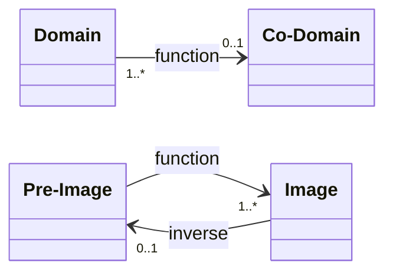

# [[Function(Math)]] 


f: x ∈ Domain --> f(x) ∈ Image ⊆ Co-Domain 



#is_/same_as :: [[../WikiData/WD~Function,11348|WD~Function,11348]] 
## Functions are single-Valued Relations

__Functions__ are single-valued [[Relation(Math)]]s, that map to **exactly 1 Value**. 
Each n-ary function is equivalent to an (n+1)-ary Relation. 

Storing Functions as [[../Technology/IT/Software/Computer_Programming/Prog~Language/Prog~Paradigm/Prog~Multi-Paradigm/CSharp/DotNET-Dictionaries|DotNET-Dictionaries]] makes them easier to reason about, 
usually avoiding combinatory Explosion. 

unary Functions can also be used to represent (upward-navigable) Trees. 

## Relations are List-Valued Functions 

[[Relation(Math)]]s can be represented as List-Valued Functions e.g. in [[Category_Theory.internal/LINQ|LINQ]] and [[../../IT/Data/DataBase/DB~Design/DB~Relations|DB~Relations]], 
unifying both, except that Functions take a single, scalar Argument and not a variadic List, 
so that Relations and list-valued Functions are chained using [[Category_Theory.internal/LINQ/SelectMany|SelectMany]]. 

They are usually represented using IDictionary{TKey, IList{TValue}}, 
or equivalently ILookup{TKey, TValue}. 
A streaming Representation is IGrouping{TKey, TValue}. 

Relations are equivalent to directed [[Graph(Math)]].  

## #has_/text_of_/abstract 

> In mathematics, a function from a set X to a set Y assigns to 
> -each element of X exactly one element of Y. 
> The set X is called the domain of the function and 
> the set Y is called the codomain of the function.
>
> Functions were originally the idealization of how a varying quantity depends on another quantity. 
> For example, the position of a planet is a function of time. 
> Historically, the concept was elaborated with the infinitesimal calculus at the end of the 17th century, 
> and, until the 19th century, the functions that were considered were differentiable 
> (that is, they had a high degree of regularity). 
> The concept of a function was formalized at the end of the 19th century in terms of set theory, 
> and this greatly enlarged the domains of application of the concept.
>
> A function is often denoted by a letter such as f, g or h. 
> The Value of a function f at an element x of its domain 
> (that is the element of the codomain that is associated to x) is denoted by f(x); 
> for example, the value of f at x = 4 is denoted by f(4). 
> Commonly, a specific function is defined by means of an expression depending on x, such as 
>  f(x)=x²+1
>  in this case, some computation, called function evaluation, may be needed 
>  for deducing the value of the function at a particular value; for example, if 
>      f(x)=x²+1,
>  then 
>  f(4)=4²+1=17. 
>  
> Given its domain and its codomain, a function is uniquely represented by the set of all pairs (x, f (x)), 
> called the __graph of the function__, a popular means of illustrating the function. 

> When the domain and the codomain are sets of real numbers, 
> each such pair may be thought of as the Cartesian coordinates of a point in the plane.
>
> Functions are widely used in science, engineering, and in most fields of mathematics. 
> It has been said that functions are "the central objects of investigation" in most fields of mathematics.
>
> [Wikipedia](https://en.wikipedia.org/wiki/Function%20(mathematics))


![[Function(Math).svg]] 

## Confidential Links & Embeds: 

### #is_/same_as :: [Function(mathematics)](/_Standards/Mathematics/Function(mathematics).md) 

### #is_/same_as :: [Function(mathematics).public](/_public/Mathematics/Function(mathematics).public.md) 

### #is_/same_as :: [Function(mathematics).internal](/_internal/Mathematics/Function(mathematics).internal.md) 

### #is_/same_as :: [Function(mathematics).protect](/_protect/Mathematics/Function(mathematics).protect.md) 

### #is_/same_as :: [Function(mathematics).private](/_private/Mathematics/Function(mathematics).private.md) 

### #is_/same_as :: [Function(mathematics).personal](/_personal/Mathematics/Function(mathematics).personal.md) 

### #is_/same_as :: [Function(mathematics).secret](/_secret/Mathematics/Function(mathematics).secret.md)


## Embedded Graph 

![[Function(Math).svg]] 


%%
## Drawing
```compressed-json
N4IgLgngDgpiBcIYA8DGBDANgSwCYCd0B3EAGhADcZ8BnbAewDsEAmcm+gV31TkQAswYKDXgB6MQHNsYfpwBGAOlT0AtmIBeNCtlQbs6RmPry6uA4wC0KDDgLFLUTJ2lH8MTDHQ0YNMWHRJMRZFAA5FFjIkT1UYRjAaBABtAF1ydCgoAGUAsD5QSXw8LOwNPkZOTExyHRgiACF0VABrQq5GXABhekx6fAQQAGIAM1GxkABfCaA==
```
