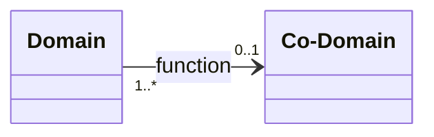

---
aliases:
- Fonzion suriettiva
- funció exhaustiva
- función sobrexectiva
- función sobreyectiva
- Functio suriectiva
- Funcție surjectivă
- fungsi surjektif
- Funtzio supraiektibo
- funzione suriettiva
- função sobrejectiva
- mapáil bharrtheilgeach
- siurjekcija
- Subrejeccion
- suriekcja
- surjectie
- surjection
- surjective
- surjective function
- Surjekcyjo
- surjeksjon
- surjektio
- Surjektiv
- surjektiv funksjon
- surjektiv funktion
- surjektive Funktion
- Surjektivna funkcija
- surjektivna preslikava
- Surjektivno preslikavanje
- surjektívne zobrazenie
- Surĵeto
- szürjekció
- Toàn ánh
- zobrazení na
- Átæk vörpun
- Örten fonksiyon
- Επί
- Сурјективна функција
- Сурјективно пресликавање
- сюр'єкція
- сюр'екцыя
- Сюрекция
- Сюръектив функц
- сюръекция
- сюр’екцыйная функцыя
- פונקציה על
- تابع پوشا
- دالة غامرة
- فانکشنی گشتگر
- সার্বিক ফাংশন
- முழுக்கோப்பு
- ฟังก์ชันทั่วถึง
- 全射
- 满射
- 滿射
- 滿射函數
- 전사 함수
has_id_wikidata: Q229102
dv_has_:
  name_:
    ar: دالة غامرة
    be: сюр'екцыя
    be_tarask: сюр’екцыйная функцыя
    bg: Сюрекция
    bn: সার্বিক ফাংশন
    bs: Surjektivna funkcija
    ca: funció exhaustiva
    ckb: فانکشنی گشتگر
    cs: zobrazení na
    da: Surjektiv
    de: surjektive Funktion
    el: Επί
    en: surjective function
    eo: Surĵeto
    es: función sobreyectiva
    eu: Funtzio supraiektibo
    fa: تابع پوشا
    fi: surjektio
    fr: surjection
    ga: mapáil bharrtheilgeach
    gl: función sobrexectiva
    he: פונקציה על
    hr: Surjektivna funkcija
    hu: szürjekció
    ia: Surjection
    id: fungsi surjektif
    io: Surjektio
    is: Átæk vörpun
    it: funzione suriettiva
    ja: 全射
    ko: 전사 함수
    la: Functio suriectiva
    lmo: Fonzion suriettiva
    lt: siurjekcija
    mk: Сурјективна функција
    mn: Сюръектив функц
    nb: surjektiv funksjon
    nl: surjectie
    nn: surjeksjon
    oc: Subrejeccion
    pl: suriekcja
    pt: função sobrejectiva
    ro: Funcție surjectivă
    ru: сюръекция
    sk: surjektívne zobrazenie
    sl: surjektivna preslikava
    sr: Сурјективно пресликавање
    sr_ec: Сурјективно пресликавање
    sr_el: Surjektivno preslikavanje
    sv: surjektiv funktion
    szl: Surjekcyjo
    ta: முழுக்கோப்பு
    th: ฟังก์ชันทั่วถึง
    tr: Örten fonksiyon
    uk: сюр'єкція
    vi: Toàn ánh
    yue: 滿射函數
    zh: 满射
    zh_cn: 满射
    zh_hans: 满射
    zh_hant: 滿射
    zh_hk: 滿射
    zh_sg: 满射
    zh_tw: 滿射
---

# [[surjective]]  

#is_/same_as :: [[Epimorphism]]

Any function can be decomposed into a [[surjection]] composed with an [[injective]].

## #has_/text_of_/abstract 

> In mathematics, a **surjective** function (also known as surjection, or `onto` function ) 
> is a function f such that, __for every element y__ of the function's co-domain, 
> there exists __at least one element x__ in the function's domain such that f(x) = y. 
> In other words, for a function f : X → Y, the co-domain Y is the image of the function's domain X. 
> It is not required that x be unique; the function f may map one or more elements of X to the same element of Y.
>
> The term surjective and the related terms [[injective]] and [[bijective]] were introduced by Nicolas [[Bourbaki]], 
> a group of mainly French 20th-century mathematicians who, under this pseudonym, 
> wrote a series of books presenting an exposition of modern advanced mathematics, 
> beginning in 1935. 
> 
> The French word `sur` means over or above, 
> and relates to the fact that the image of the domain of a surjective function 
> completely covers the function's codomain.
>
> - Any __function induces a surjection by restricting its codomain__ to the image of its domain. 
> - Every surjective function has a right inverse assuming the axiom of choice, 
> - and every function with a right inverse is necessarily a surjection. 
> - The composition of surjective functions is always surjective. 
> - Any function can be decomposed into a surjection and an injection.
>
> [Wikipedia](https://en.wikipedia.org/wiki/Surjective%20function) 

[[../../../Knowledge/Math/Combinatorics/Twelvefold_way]]] 

## Confidential Links & Embeds: 

### #is_/same_as :: [[/_Standards/Mathematics/Function(Math)/surjective|surjective]] 

### #is_/same_as :: [[/_public/Mathematics/Function(Math)/surjective.public|surjective.public]] 

### #is_/same_as :: [[/_internal/Mathematics/Function(Math)/surjective.internal|surjective.internal]] 

### #is_/same_as :: [[/_protect/Mathematics/Function(Math)/surjective.protect|surjective.protect]] 

### #is_/same_as :: [[/_private/Mathematics/Function(Math)/surjective.private|surjective.private]] 

### #is_/same_as :: [[/_personal/Mathematics/Function(Math)/surjective.personal|surjective.personal]] 

### #is_/same_as :: [[/_secret/Mathematics/Function(Math)/surjective.secret|surjective.secret]] 

