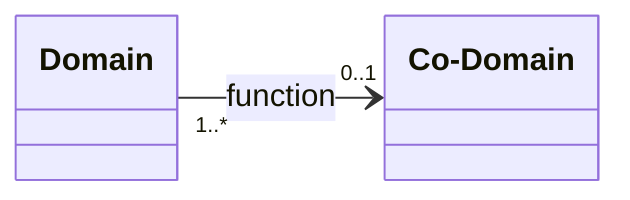

---
aliases:
- surjection
---

#is_/same_as :: [[Epimorphism]]

Any function can be decomposed into a [[surjection]] composed with an [[injective]].

## #has_/text_of_/abstract 

> In mathematics, a **surjective** function (also known as surjection, or `onto` function ) 
> is a function f such that, __for every element y__ of the function's co-domain, 
> there exists __at least one element x__ in the function's domain such that f(x) = y. 
> In other words, for a function f : X → Y, the co-domain Y is the image of the function's domain X. 
> It is not required that x be unique; the function f may map one or more elements of X to the same element of Y.
>
> The term surjective and the related terms [[injective]] and [[bijective]] were introduced by Nicolas [[Bourbaki]], 
> a group of mainly French 20th-century mathematicians who, under this pseudonym, 
> wrote a series of books presenting an exposition of modern advanced mathematics, 
> beginning in 1935. 
> 
> The French word `sur` means over or above, 
> and relates to the fact that the image of the domain of a surjective function 
> completely covers the function's codomain.
>
> - Any __function induces a surjection by restricting its codomain__ to the image of its domain. 
> - Every surjective function has a right inverse assuming the axiom of choice, 
> - and every function with a right inverse is necessarily a surjection. 
> - The composition of surjective functions is always surjective. 
> - Any function can be decomposed into a surjection and an injection.
>
> [Wikipedia](https://en.wikipedia.org/wiki/Surjective%20function)
[[../../../Knowledge/Math/Combinatorics/Twelvefold_way]]] 

## Confidential Links & Embeds: 

### #is_/same_as :: [surjective](/_Standards/Mathematics/Function(Math)/surjective.md) 

### #is_/same_as :: [surjective.public](/_public/Mathematics/Function(Math)/surjective.public.md) 

### #is_/same_as :: [surjective.internal](/_internal/Mathematics/Function(Math)/surjective.internal.md) 

### #is_/same_as :: [surjective.protect](/_protect/Mathematics/Function(Math)/surjective.protect.md) 

### #is_/same_as :: [surjective.private](/_private/Mathematics/Function(Math)/surjective.private.md) 

### #is_/same_as :: [surjective.personal](/_personal/Mathematics/Function(Math)/surjective.personal.md) 

### #is_/same_as :: [surjective.secret](/_secret/Mathematics/Function(Math)/surjective.secret.md)

