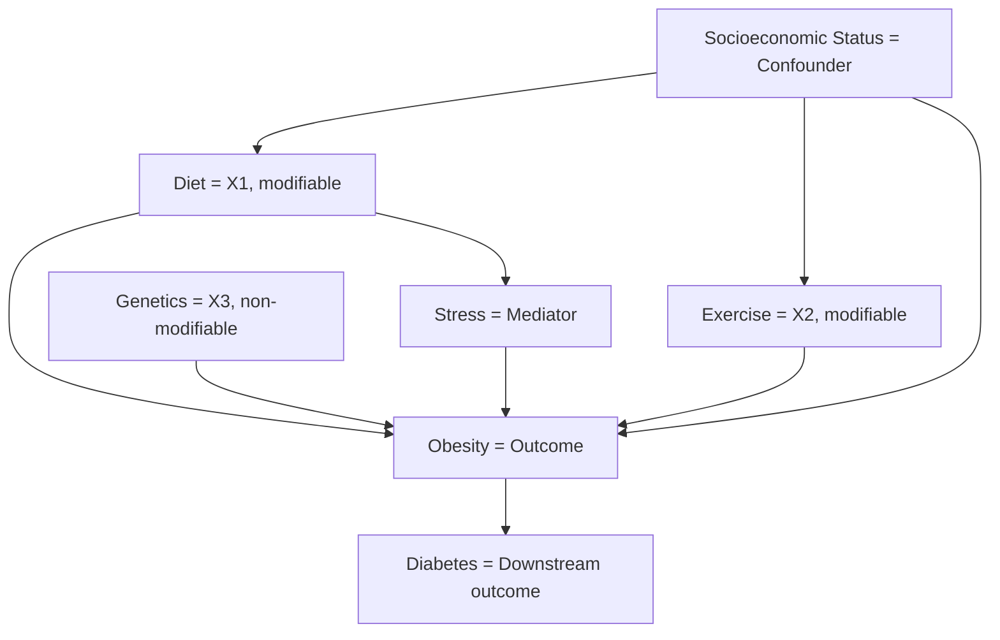

---
aliases:
  - Causality
  - Causation
has_id_wikidata: Q179289
studied_by:
  - "[[_Standards/WikiData/WD~etiology,156318]]"
  - "[[_Standards/WikiData/WD~Buddhist_logico_epistemology,10925603]]"
has_part_s_:
  - "[[_Standards/WikiData/WD~consequent,261155]]"
  - "[[_Standards/WikiData/WD~effect,926230]]"
  - "[[_Standards/WikiData/WD~cause,2574811]]"
described_by_source:
  - "[[_Standards/WikiData/WD~Encyclopædia_Britannica_11th_edition,867541]]"
  - "[[_Standards/WikiData/WD~The_Nuttall_Encyclopædia,3181656]]"
  - "[[_Standards/WikiData/WD~Granat_Encyclopedic_Dictionary,4532138]]"
subclass_of: "[[_Standards/WikiData/WD~relation,930933]]"
opposite_of: "[[_Standards/WikiData/WD~prevention,1717246]]"
part_of:
  - "[[_Standards/WikiData/WD~multiple_causes,18121382]]"
  - "[[_Standards/WikiData/WD~philosophy,5891]]"
instance_of: "[[_Standards/WikiData/WD~type_of_relation,130324710]]"
Commons_category: Causality
Stack_Exchange_tag: https://stats.stackexchange.com/tags/causality
PhilPapers_topic: causation
MeSH_tree_code:
  - N05.715.350.200
  - N06.850.490.625
Library_of_Congress_Classification: BC199.C38
---

# [[Causality]] 

#is_/better_than :: [[Correlation]] 
#is_/same_as :: [[../../../WikiData/WD~Causality,179289|WD~Causality,179289]] 

Causality has fundamental importance for any Agent, 
because it allows them to identify modifiable Variables  
(and also in which direction to change them and how much so) 
to obtain a desired Outcome. 

Causal Inference can build a chain of Causes to identify indirect Causality. 
In reverse causal inference, working backward from **Y = Obesity**:
- We identify **modifiable levers** (Diet, Exercise, Stress).
- We recognize **confounders** (Socioeconomic Status must be controlled or randomized).
- We note **non-modifiable causes** (Genetics cannot be changed).
- We track **downstream benefits** (Reducing obesity lowers diabetes risk). 

## #has_/text_of_/abstract 

> Causality is an influence by which one event, process, state, or object (a cause) 
> contributes to the production of another event, process, state, or object (an effect) 
> where the cause is at least partly responsible for the effect, 
> and the effect is at least partly dependent on the cause. 
> The cause of something may also be **described as the reason** for the event or process.
>
> In general, a process can have multiple causes, which are also said to be causal factors for it, 
> and all lie in its past. 
> An effect can in turn be a cause of, or causal factor for, many other effects, which all lie in its future. 
> 
> Some writers have held that causality is metaphysically prior to notions of time and space. 
> Causality is an abstraction that indicates how the world progresses. 
> As such it is a basic concept; it is more apt to be an explanation of other concepts of progression 
> than something to be explained by other more fundamental concepts. 
> The concept is like those of agency and efficacy. 
> For this reason, a leap of intuition may be needed to grasp it. 
> Accordingly, causality is implicit in the structure of ordinary language, 
> as well as explicit in the language of scientific causal notation.
>
> In English studies of Aristotelian philosophy, the word "cause" is used as a specialized technical term, 
> the translation of Aristotle's term αἰτία, 
> by which Aristotle meant "explanation" or "answer to a 'why' question". 
> Aristotle categorized the four types of answers as material, formal, efficient, and final "causes". 
> In this case, the "cause" is the explanans for the explanandum, 
> and failure to recognize that different kinds of "cause" are being considered can lead to futile debate. 
> Of Aristotle's four explanatory modes, the one nearest to the concerns of the present article is the "efficient" one.
>
> David Hume, as part of his opposition to rationalism, 
> argued that pure reason alone cannot prove the reality of efficient causality; 
> instead, he appealed to custom and mental habit, 
> observing that all human knowledge derives solely from experience.
>
> The topic of causality remains a staple in contemporary philosophy.
>
> [Wikipedia](https://en.wikipedia.org/wiki/Causality) 

