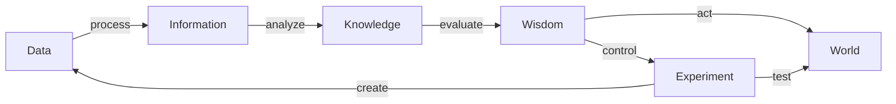

---
aliases:
- data pyramid
- Data, informasjon, kunnskap og visdom
- DIKW
- DIKW hierarchy
- DIKW Pyramid
- DIKW pyramida
- DIKW-pyramidi
- DIKW体系
- DIKW體系
- Hierarquia DIKW
- information hierarchy
- information pyramid
- Informācijas piramīda
- jerarquia del coneixement
- jerarquía del conocimiento
- knowledge hierarchy
- Knowledge Pyramid
- Podatak, informacija, znanje
- Pyramide DICS
- Tarkuse püramiid
- wisdom hierarchy
- Wissenspyramide
- هرم المعلومات
- هرم دادح
- ھەرەمی دیکو
has_id_wikidata: Q2628489
dv_has_:
  name_:
    ar: هرم المعلومات
    ca: jerarquia del coneixement
    ckb: ھەرەمی دیکو
    cs: DIKW pyramida
    de: Wissenspyramide
    en: DIKW Pyramid
    es: jerarquía del conocimiento
    et: Tarkuse püramiid
    fa: هرم دادح
    fi: DIKW-pyramidi
    fr: Pyramide DICS
    hr: Podatak, informacija, znanje
    lv: Informācijas piramīda
    nb: Data, informasjon, kunnskap og visdom
    pt: Hierarquia DIKW
    ru: DIKW
    uk: DIKW
    yue: DIKW體系
    zh: DIKW体系
    zh-hans: DIKW体系
    zh-hant: DIKW體系
    zh-hk: DIKW體系
---
# [[Knowledge_Pyramid]] 

#is_/same_as :: [[Knowledge Pyramid,]]

- Across all levels, the DIKW chain remains vulnerable—integrity preservation requires both mechanistic validation (Data → Information) and ethical scrutiny (Knowledge → Wisdom).

Each Step along the chain must be verified by Feedback Loops: 

# Table of DIKW Levels and Attributes  

| Attribute                                                     | **Data**                                                          | **Information**                                          | **Knowledge**                                                            | **Wisdom**                                                      |
| ------------------------------------------------------------- | ----------------------------------------------------------------- | -------------------------------------------------------- | ------------------------------------------------------------------------ | --------------------------------------------------------------- |
| **Nature of Content**                                         | Raw empirical measurements                                        | Structured aggregates or trends                          | Contextual interpretation and pattern recognition                        | Ethical or practical application of understanding               |
| **Example**                                                   | 30 °C                                                             | mean = 31 °C                                             | heatwave pattern detected                                                | scheduling to avoid heatstroke                                  |
| **Cognitive Value (relative %)**                              | 10                                                                | 25                                                       | 35                                                                       | 30                                                              |
| **Human Involvement (relative %)**                            | 5                                                                 | 25                                                       | 60                                                                       | 90                                                              |
| **Automation Potential (relative %)**                         | 95                                                                | 75                                                       | 40                                                                       | 10                                                              |
| **Can Be Factually Wrong (relative %)**                       | 70                                                                | 50                                                       | 30                                                                       | 10                                                              |
| **Can Be Interpretively Wrong (relative %)**                  | 10                                                                | 30                                                       | 60                                                                       | 80                                                              |
| **Error Detection Mechanism**                                 | Instrument calibration and redundancy checking                    | Statistical verification and consistency algorithms      | Peer review and experiential validation                                  | Ethical oversight and long-term reflection                      |
| **Typical Correction Mechanism**                              | Automated measurement validation                                  | Cross-source reconciliation                              | Theory revision based on new data                                        | Ethical reflection and collective accountability                |
| **Truth Orientation (baseline)**                              | Objective factual record (empirical trustworthiness)              | Derived relational truth subject to accuracy constraints | Interpretive understanding — context-dependent validity                  | Value-based truth emphasizing moral and pragmatic good          |
| **How Lies May Appear**                                       | Fabricated or falsified readings (e.g., fake temperature entries) | Misreporting quantitative summaries or trends            | Faulty causal narratives or pseudoscientific claims                      | Strategic deception disguised as moral reasoning                |
| **How Propaganda May Appear**                                 | Selective omission of inconvenient records                        | Framing bias and selective statistics presentations      | Ideological storytelling emphasizing specific causal or cultural meaning | Institutionalized ideology presented as moral duty              |
| **Fact vs Distortion Composition (relative % truthful data)** | 80 true : 20 false                                                | 40 true : 60 false                                       | 40 true : 60 false (interpretive distortion dominant)                    | 20 true : 80 interpretively biased                              |
| **Emotional Amplification Intensity (0–10)**                  | 2                                                                 | 5                                                        | 8                                                                        | 9                                                               |
| **Error / Distortion Detection Probability (relative %)**     | 90 manual or automatic detection possible                         | 70 possible via auditing                                 | 40 detectable through peer evaluation                                    | 30 detectable via ethical review or outcome analysis            |
| **Primary Cognitive Risk**                                    | Sensor or data fabrication                                        | Analytic misrepresentation                               | Ideological interpretation errors                                        | Ethical manipulation or moral corruption                        |
| **Scholarly Agreement on Structure Validity (relative %)**    | 70 accept positivist structure  (acknowledged simplicity)      | 70 same as data but with increased ambiguity             | 50 accept DIKW as conceptual model (30 critical, 20 integrative)         | 50 accept DIKW as value philosophy (40 critical, 10 postmodern) |
| **Representative Detection / Correction Tools**               | ISO 8000 data‑quality standards checks                            | Transparency and statistical auditing frameworks         | Peer and cross‑disciplinary debate                                       | Institutional ethics boards, historical evaluation              |
| **Epistemic Error Type Distribution (factual : conceptual)**  | 90 : 10                                                           | 60 : 40                                                  | 40 : 60                                                                  | 20 : 80                                                         |
| **Approximate Share of Lies and Propaganda Impact**           | Lies dominant (70), propaganda minor (30)                         | Lies 50, propaganda 50                                   | Lies 30, propaganda 70                                                   | Lies 10, propaganda 90                                          |
| **Truth Restoration Pathway**                                 | Verification via replication                                      | Transparency through audit and metadata disclosure       | Re‑evaluation of interpretive frameworks                                 | Moral and societal reassessment of values and policy            |

## #has_/text_of_/abstract 

> The DIKW pyramid, also known variously as the **Knowledge Pyramid**, knowledge hierarchy, information hierarchy, DIKW hierarchy, wisdom hierarchy, data pyramid, and information pyramid, sometimes also stylized as a chain, refer to models of possible structural and functional relationships between a set of components—often four, data, information, knowledge, and wisdom—models that had antecedents prior to the 1980s. In the latter years of that decade, interest in the models grew after explicit presentations and discussions, including from Milan Zeleny, Russell Ackoff, and Robert W. Lucky. Subsequent important discussions extended along theoretical and practical lines into the coming decades.
>
> While debate continues as to actual meaning of the component terms of DIKW-type models, and the actual nature of their relationships—including occasional doubt being cast over any simple, linear, unidirectional model—even so they have become very popular visual representations in use by business, the military, and others. Among the academic and popular, not all versions of the DIKW-type models include all four components (earlier ones excluding data, later ones excluding or downplaying wisdom, and several including additional components (for instance Ackoff inserting "understanding" before and Zeleny adding "enlightenment" after the wisdom component). In addition, DIKW-type models are no longer always presented as pyramids, instead also as a chart or framework (e.g., by Zeleny), as flow diagrams (e.g., by Liew, and by Chisholm et al.), and sometimes as a continuum (e.g., by Choo et al.).
>
> [Wikipedia](https://en.wikipedia.org/wiki/DIKW%20pyramid) 

## Confidential Links & Embeds: 

### #is_/same_as :: [[/_Standards/Philosophy/Epistemology/Knowledge/Knowledge_Pyramid|Knowledge_Pyramid]] 

### #is_/same_as :: [[/_public/Philosophy/Epistemology/Knowledge/Knowledge_Pyramid.public|Knowledge_Pyramid.public]] 

### #is_/same_as :: [[/_internal/Philosophy/Epistemology/Knowledge/Knowledge_Pyramid.internal|Knowledge_Pyramid.internal]] 

### #is_/same_as :: [[/_protect/Philosophy/Epistemology/Knowledge/Knowledge_Pyramid.protect|Knowledge_Pyramid.protect]] 

### #is_/same_as :: [[/_private/Philosophy/Epistemology/Knowledge/Knowledge_Pyramid.private|Knowledge_Pyramid.private]] 

### #is_/same_as :: [[/_personal/Philosophy/Epistemology/Knowledge/Knowledge_Pyramid.personal|Knowledge_Pyramid.personal]] 

### #is_/same_as :: [[/_secret/Philosophy/Epistemology/Knowledge/Knowledge_Pyramid.secret|Knowledge_Pyramid.secret]] 

