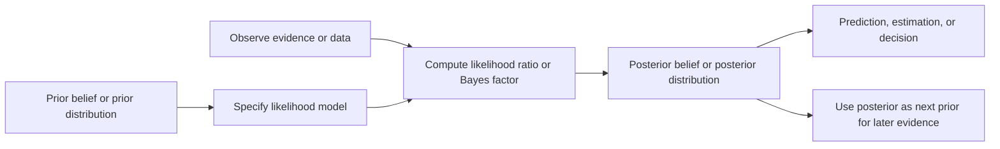

---
aliases:
has_id_wikidata: Q812535
named_after: "[[_Standards/WikiData/WD~Thomas_Bayes,208452]]"
facet_of: "[[_Standards/WikiData/WD~Bayesian_probability,812534]]"
subclass_of:
  - "[[_Standards/WikiData/WD~statistical_inference,938438]]"
  - "[[_Standards/WikiData/WD~statistical_method,12718609]]"
topic_s_main_category: "[[_Standards/WikiData/WD~Category_Bayesian_inference,8293925]]"
maintained_by_WikiProject: "[[_Standards/WikiData/WD~WikiProject_Mathematics,8487137]]"
defining_formula: <math class="mwe-math-element mwe-math-element-inline" xmlns="http://www.w3.org/1998/Math/MathML"><mrow data-mjx-texclass="ORD"><mstyle displaystyle="true" scriptlevel="0"><mi>P</mi><mo stretchy="false">(</mo><mi>H</mi><mo stretchy="false">&#x2223;</mo><mi>E</mi><mo stretchy="false">)</mo><mo stretchy="false">=</mo><mrow data-mjx-texclass="ORD"><mfrac><mrow data-mjx-texclass="ORD"><mrow data-mjx-texclass="ORD"><mi>P</mi><mo stretchy="false">(</mo><mi>E</mi><mo stretchy="false">&#x2223;</mo><mi>H</mi><mo stretchy="false">)</mo><mo stretchy="false">&#x22C5;</mo><mi>P</mi><mo stretchy="false">(</mo><mi>H</mi><mo stretchy="false">)</mo></mrow></mrow><mrow data-mjx-texclass="ORD"><mrow data-mjx-texclass="ORD"><mi>P</mi><mo stretchy="false">(</mo><mi>E</mi><mo stretchy="false">)</mo></mrow></mrow></mfrac></mrow></mstyle></mrow></math>
ACM_Classification_Code_2012_: "10003664"
Stack_Exchange_tag:
  - https://philosophy.stackexchange.com/tags/bayesian
  - https://stackoverflow.com/tags/bayesian
  - https://stats.stackexchange.com/tags/bayesian
Commons_category: Bayesian inference
GitHub_topic: bayesian-inference
Dewey_Decimal_Classification: "519.542"
---

# [[Bayesian_Inference]] 

#is_/same_as :: [[../../../WikiData/WD~Bayesian_inference,812535|WD~Bayesian_inference,812535]]

## #has_/text_of_/abstract 

> Bayesian inference ( BAY-zee-ən or  BAY-zhən) is a method of statistical inference in which Bayes' theorem is used to calculate a probability of a hypothesis, given prior evidence, and update it as more information becomes available. Fundamentally, Bayesian inference uses a prior distribution to estimate posterior probabilities. Bayesian inference is an important technique in statistics, and especially in mathematical statistics. Bayesian updating is particularly important in the dynamic analysis of a sequence of data. Bayesian inference has found application in a wide range of activities, including science, engineering, philosophy, medicine, sport, psychology, and law. In the philosophy of decision theory, Bayesian inference is closely related to subjective probability, often called "Bayesian probability".
>
> [Wikipedia](https://en.wikipedia.org/wiki/Bayesian%20inference) 

## Bayesian Reasoning and Statistics  
Bayesian reasoning treats uncertainty as a degree of belief constrained by probability theory. Bayesian statistics turns that idea into a practical method: start with a prior distribution, specify a likelihood model for how evidence would arise, observe data, and compute a posterior distribution for hypotheses, parameters, or predictions. The central slogan is: prior belief × evidential fit → updated belief.  
### Two influential viewpoints  

The Bayesian framework is highly influential, 
but it is not the only authoritative way to think about uncertainty. 
The table below gives a concise comparison. 
The numeric scores are qualitative syntheses rather than survey measurements.  

| Viewpoint                    | Core claim                                                                                                                      | Typical communities                                                                   |
| ---------------------------- | ------------------------------------------------------------------------------------------------------------------------------- | ------------------------------------------------------------------------------------- |
| Normative Bayesianism        | Rational credences should satisfy the probability axioms and update by Bayes-style conditionalization                           | Philosophy of science, decision theory, machine learning, applied Bayesian statistics |
| Frequentist complement       | Probabilities should primarily be interpreted through long-run frequencies and inference should control repeated-sampling error | Introductory statistics, biostatistics, econometrics, regulated scientific practice   |
| Bounded-rationality critique | Human reasoning is often only approximately Bayesian because cognition is limited, heuristic, and computationally constrained   | Cognitive psychology, behavioral economics, AI, judgment and decision research        |
A fair summary is that Bayesianism has very high authority as a normative theory of belief revision, while frequentist methods remain at least as prevalent in many institutional settings, and bounded-rationality research explains why real human judgment often departs from the Bayesian ideal.  
### Bayes' theorem   

For a binary hypothesis, Bayes' theorem is:  
$$\text{PosteriorProb}(\text{HypoTrue} \mid \text{Evidence})
=\frac{
\text{Prob}(\text{Evidence} \mid \text{HypoTrue}) \times \text{PriorProb}(\text{HypoTrue})
}{
\text{Prob}(\text{Evidence})
}
$$  
For the same binary case, the denominator expands to:  
$\large \text{Prob}(\text{Evidence})$
$\large =\text{Prob}(\text{Evidence} \mid \text{HypoTrue}) \times \text{PriorProb}(\text{HypoTrue})$
$\large + \text{Prob}(\text{Evidence} \mid \text{HypoFalse}) \times \text{PriorProb}(\text{HypoFalse})$  

This yields the more explicit form:  

$\text{PosteriorProb}(\text{HypoTrue} \mid \text{Evidence})$
$$=\frac{
\text{Prob}(\text{Evidence} \mid \text{HypoTrue}) \times \text{PriorProb}(\text{HypoTrue})
}{
\text{Prob}(\text{Evidence} \mid \text{HypoTrue}) \times \text{PriorProb}(\text{HypoTrue}) +
\text{Prob}(\text{Evidence} \mid \text{HypoFalse}) \times \text{PriorProb}(\text{HypoFalse})
}
$$  
Informally, the posterior probability is the prior probability 
**reweighted by how much better the evidence is predicted by the hypothesis** than by its alternatives.  
### Key definitions for probability concepts  

| Concept                 | Definition                                                                                                        | Formal relation                                                                                                                                                                |
| ----------------------- | ----------------------------------------------------------------------------------------------------------------- | ------------------------------------------------------------------------------------------------------------------------------------------------------------------------------ |
| Probability             | A number from 0 to 1 representing uncertainty; in Bayesian settings, it is often interpreted as rational credence | $$0 \leq \text{Prob}(\text{Event}) \leq 1$$                                                                                                                                    |
| Event                   | A set of possible outcomes of an experiment or observation                                                        | Subset of the sample space                                                                                                                                                     |
| Conditional probability | Probability of one event assuming another event is true                                                           | $\text{Prob}(\text{EventOne} \mid \text{EventTwo})$ $$=\frac{\text{Prob}(\text{EventOne and EventTwo})}{\text{Prob}(\text{EventTwo})}$$                                     |
| Joint probability       | Probability that two events occur together                                                                        | $\text{Prob}(\text{EventOne and EventTwo})$                                                                                                                                    |
| Marginal probability    | Total probability of an event after summing or integrating over alternatives                                      | Obtained by adding joint probabilities across possibilities                                                                                                                    |
| Independence            | Learning one event does not change the probability of the other                                                   | $\text{Prob}(\text{EventOne and EventTwo})$  $= \text{Prob}(\text{EventOne}) \times \text{Prob}(\text{EventTwo})$                                                           |
| Prior probability       | Degree of belief before seeing the new evidence                                                                   | $\text{PriorProb}(\text{Hypothesis})$                                                                                                                                          |
| Likelihood              | How well a hypothesis predicts the observed evidence; not the same as the probability that the hypothesis is true | $\text{Prob}(\text{Evidence} \mid \text{Hypothesis})$                                                                                                                          |
| Posterior probability   | Updated degree of belief after incorporating evidence                                                             | $\text{PosteriorProb}(\text{Hypothesis} \mid \text{Evidence})$                                                                                                                 |
| Odds                    | Probability expressed as a success-to-failure ratio                                                               | $\text{Odds} = \frac{\text{Probability}}{1-\text{Probability}}$                                                                                                                |
| Likelihood ratio        | Evidence multiplier comparing how strongly two hypotheses predict the same evidence                               | $\text{LikelihoodRatio}$  $$= \frac{\text{Prob}(\text{Evidence} \mid \text{HypoTrue})}{\text{Prob}(\text{Evidence} \mid \text{HypoFalse})}$$                                |
| Bayes factor            | A model-comparison version of the likelihood ratio, usually using marginal likelihoods                            | $\text{BayesFactor}$  $$= \frac{\text{MarginalLikelihood}(\text{DataObserved} \mid \text{ModelOne})}{\text{MarginalLikelihood}(\text{DataObserved} \mid \text{ModelTwo})}$$ |

A crucial distinction is that a **likelihood is a property of a hypothesis** relative to the observed data. 
It is **not itself a posterior probability**. 
Confusing those two quantities is one of the most common reasoning errors.  
### Bayesian updating and likelihood ratios  
#### Core update rules  
For binary hypotheses, Bayes' theorem is often easiest in odds form:  

$\text{PosteriorOdds}(\text{HypoTrue}:\text{HypoFalse} \mid \text{Evidence})$ 
$=\text{PriorOdds}(\text{HypoTrue}:\text{HypoFalse}) \times \text{LikelihoodRatio}(\text{Evidence})$
  
with  $\Huge \text{PriorOdds} = \frac{\text{PriorProbability}}{1-\text{PriorProbability}}$

and  $\huge \text{PosteriorProbability} = \frac{\text{PosteriorOdds}}{1+\text{PosteriorOdds}}$
  
This form makes the logic especially clear: **independent evidence multiplies odds**. 
When several conditionally **independent pieces of evidence** are observed in sequence, 
their likelihood ratios multiply:  

$\text{PosteriorOdds after many evidence items} = \text{PriorOdds} \times \prod \text{LikelihoodRatio}(\text{EachEvidenceItem})$
 
Equivalently, on the log-odds scale, evidence adds:  

$\log(\text{PosteriorOdds}) = \log(\text{PriorOdds}) + \sum \log(\text{LikelihoodRatio}(\text{EachEvidenceItem}))$
 
#### Worked example with a medical test  
Assume the following.  

| Quantity                | Value [%] | Comment                                                           |     |
| ----------------------- | --------: | ----------------------------------------------------------------- | --- |
| Prevalence of condition |      1.00 | Prior probability that a randomly chosen person has the condition |     |
| Sensitivity             |     95.00 | Probability of a positive test if the condition is present        |     |
| Specificity             |     95.00 | Probability of a negative test if the condition is absent         |     |
| False positive rate     |      5.00 | Computed as $100.00 - 95.00$                                    |     |
The corresponding natural frequencies in a population of 10,000 people are:  

| Group             | Count [people] | Positive tests [people] | Negative tests [people] |     |
| ----------------- | -------------: | ----------------------: | ----------------------: | --- |
| Condition present |            100 |                      95 |                       5 |     |
| Condition absent  |          9,900 |                     495 |                   9,405 |     |
| Total             |         10,000 |                     590 |                   9,410 |     |
Now compute the posterior probability after one positive test.  

| Derived quantity | Value [ratio] | Value [%] | Comment |  
|---|---:|---:|---|  
| Prior odds | 0.0101 | 1.01 | Computed as $0.01 / 0.99$ |  
| Positive likelihood ratio | 19.0000 | 1,900.00 | Computed as $0.95 / 0.05$ |  
| Posterior odds after one positive | 0.1919 | 19.19 | Computed as $0.0101 \times 19$ |  
| Posterior probability after one positive | 0.1610 | 16.10 | Computed as $0.1919 / 1.1919$ |  
| Posterior probability after two independent positives | 0.7848 | 78.48 | Computed as $(0.0101 \times 19^2) / (1 + 0.0101 \times 19^2)$ |  

The first positive test does not make the condition 95.00% likely. It makes it only 16.10% likely, because the condition is rare and false positives occur more often than true positives in the tested population. This is the standard structure behind base rate neglect.  
#### Visual update flow  

### Common cognitive biases that distort Bayesian reasoning  

| Bias or fallacy | Bayesian distortion | Typical example | Practical correction |  
|---|---|---|---|  
| Base rate neglect | The prior probability is underweighted or ignored | A rare disease test is treated as almost conclusive because the test is accurate | Translate probabilities into natural frequencies such as counts out of 10,000 |  
| Inverse probability fallacy | $\text{Prob}(\text{Evidence} \mid \text{Hypothesis})$ is mistaken for $\text{Prob}(\text{Hypothesis} \mid \text{Evidence})$ | A rare DNA match is treated as proof of guilt | Write both conditionals separately before updating |  
| Prosecutor's fallacy | A special legal form of the inverse probability fallacy | “Only 1 in 1,000,000 people would match, so the suspect is almost certainly guilty” | Include the size of the reference population and plausible alternative explanations |  
| Conjunction fallacy | A conjunction is judged more probable than one of its parts | A detailed story sounds more plausible than the simpler event it contains | Enforce the rule that $\text{Prob}(\text{EventOne and EventTwo}) \leq \text{Prob}(\text{EventOne})$ |  
| Confirmation bias | Evidence supporting the favored hypothesis is sought or remembered more readily than disconfirming evidence | Only checking cases that fit the current theory | Deliberately search for evidence with high likelihood under competing hypotheses |  
| Conservatism or under-updating | Beliefs move too little in response to strong evidence | A prior remains almost unchanged after highly diagnostic data | Convert the evidence into explicit likelihood ratios |  
| Representativeness heuristic | Similarity replaces probabilistic reasoning | A vivid case is judged typical despite weak statistics | Ask first for base rates, then for case-specific likelihoods |  
A useful diagnostic rule is this: if a judgment changes dramatically when probabilities are rewritten as frequencies, the original reasoning was likely not Bayesian in any strict sense.  
### Bayesian epistemology  
#### Central idea  
Bayesian epistemology studies rational belief, not only statistical estimation. Its core proposal is that a rational agent should have degrees of belief, called credences, that obey probability theory and should revise those credences systematically when evidence arrives.  
#### Three central claims  

| Claim | Content | Important caveat |  
|---|---|---|  
| Coherence | Credences should obey the probability axioms to avoid inconsistency and sure-loss vulnerability | Coherence alone does not determine the correct prior |  
| Conditionalization | When evidence is learned with certainty, rational updating typically proceeds by conditioning on that evidence | Real learning can involve ambiguous, partial, or theory-laden evidence |  
| Decision linkage | Rational action depends on posterior probabilities together with utilities, usually via expected utility | High probability alone does not determine what one should do |  
One reason Bayesian epistemology is influential is that it gives a unified picture of belief, evidence, and action. It also explains learning as a continuous process rather than a sequence of binary accept-or-reject decisions.  
#### Typical reasoning traps in Bayesian epistemology and practice  

| Trap | What goes wrong | Consequence | Mitigation |  
|---|---|---|---|  
| Dogmatic priors | Assigning prior probability 0 or 1 to empirical claims blocks later learning | No finite evidence can revise absolute certainty | Reserve 0 and 1 for logical impossibility or certainty only |  
| Prior sensitivity | With weak data, the posterior inherits much of the prior structure | Different reasonable priors yield materially different conclusions | Run sensitivity analyses with multiple priors |  
| Model misspecification | The likelihood model is wrong even if the arithmetic is right | A precise posterior can still be badly misleading | Use model checking, posterior predictive checks, and external validation |  
| Double counting evidence | Dependent pieces of evidence are treated as independent | The posterior becomes overconfident | Trace information provenance and model dependence explicitly |  
| Ignoring unmodeled alternatives | Posterior probabilities are distributed only over the hypotheses under consideration | “Best among listed models” is mistaken for “probably true” | Keep open a residual category for unknown alternatives where feasible |  
| Selection effects and publication bias | One conditions on the observed data but omits the process that made those data visible | Evidence looks stronger than it is | Model selection, stopping, and publication mechanisms when they matter |  
| Old evidence problem | A theory is proposed after the evidence is already known, complicating straightforward conditionalization | Confirmation becomes philosophically subtle | Distinguish discovery, explanation, and formal updating |  
A compact warning captures much of Bayesian epistemology: 
**the posterior is only as good as the prior, the likelihood, and the hypothesis space**. 
Bayesian arithmetic is exact only relative to those inputs.  

### Practical synthesis  
Bayesian reasoning is powerful because it forces explicit answers to four questions. 
What did you believe before seeing the evidence. 
How strongly would each hypothesis predict the evidence. 
How do competing hypotheses compare. 
What should the updated belief now be.  

Bayesian statistics is therefore not merely a formula. 
It is a disciplined workflow for uncertainty. 
Its strengths are coherence, transparency, and cumulative learning. 
Its weaknesses appear when 
- priors are poorly justified, 
- likelihoods are unrealistic, 
- evidence is dependent or selectively observed, or 
- analysts confuse model-relative posterior probability with truth itself.  

In short, the Bayesian ideal says: 
- state priors openly, 
- model evidence carefully, 
- update mechanically, and 
- remain humble about model error.  

