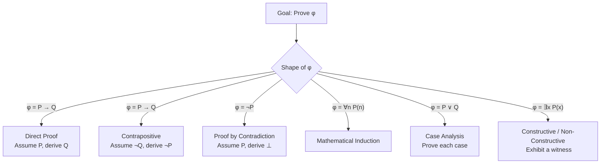
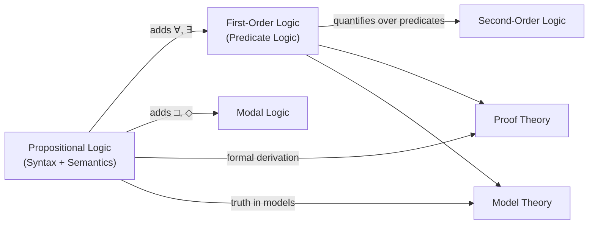

---
aliases:
  - lochica matematica
  - Logic(Math)
  - logica matematica
  - logica mathematica
  - logică matematică
  - logik matematik
  - logika matematika
  - logika matematiko
  - logika matematyczna
  - logika matématika
  - logique mathématique
  - logjika matematikore
  - loighic mhatamaiticiúil
  - Lojik
  - luận lý toán
  - lògica matemàtica
  - lógica matemática
  - lóxica matemática
  - matemaatiline loogika
  - matemaatlâš logiik
  - matemaattinen logiikka
  - matemaattlaž logikk
  - matematická logika
  - matematihkalaš logihkka
  - matematik mantiq
  - matematika logiko
  - matematikai logika
  - Matematikal na lohika
  - matematikala logiko
  - matematiksel mantık
  - matematisk logik
  - matematisk logikk
  - matematička logika
  - matematična logika
  - matemātiskā loģika
  - Mathematesch Logik
  - Mathematical logic
  - mathematische Logik
  - Okusengekensonga okw'ekibalo(Mathematical logic)
  - rhesymeg fathemategol
  - rianas matamataigeach
  - riyazi məntiq
  - simbolinė logika
  - Stærðfræðileg rökfræði
  - sò͘-lí lô-chi̍p
  - wiskundige logica
  - wiskundige logika
  - Yaayaa Herregaa
  - Μαθηματική λογική
  - мантиқи риёзӣ
  - математик логика
  - Математикăлла логика
  - Математикалык логика
  - Математическа логика
  - математическая логика
  - математичка логика
  - математична логіка
  - матэматычная лёгіка
  - матэматычная логіка
  - Символикалық логика
  - մաթեմատիկական տրամաբանություն
  - לוגיקה מתמטית
  - ریاضیاتی منطق
  - لوݢيک ماتماتيک
  - منطق رياضى
  - منطق رياضي
  - منطق ریاضی
  - गणितीय तर्कशास्त्र
  - গাণিতিক যুক্তিবিজ্ঞান
  - ಗಣಿತ ತರ್ಕಶಾಸ್ತ್ರ
  - ගණිතමය තර්කණය
  - คณิตตรรกศาสตร์
  - သင်္ချာယုတ္တိဗေဒ
  - သင်္ချာအခြီခံသီအိုရီတိ
  - მათემატიკური ლოგიკა
  - ሒሳባዊ ሥነ አምክንዮ
  - 数理論理学
  - 数理逻辑
  - 數學邏輯
  - 數理邏輯
  - 수리논리학
has_id_wikidata: Q1166618
has_characteristic: "[[_Standards/WikiData/WD~quantifier,592911|WD~quantifier,592911]]"
instance_of:
  - "[[_Standards/WikiData/WD~area_of_mathematics,1936384|WD~area_of_mathematics,1936384]]"
  - "[[_Standards/WikiData/WD~mathematical_theory,20026918|WD~mathematical_theory,20026918]]"
practiced_by: "[[_Standards/WikiData/WD~logician,14565331|WD~logician,14565331]]"
topic_has_template: "[[_Standards/WikiData/WD~Template_Mathematical_logic,18655775|WD~Template_Mathematical_logic,18655775]]"
described_by_source: "[[_Standards/WikiData/WD~Great_Soviet_Encyclopedia_(1926_1947),20078554|WD~Great_Soviet_Encyclopedia_(1926_1947),20078554]]"
permanent_duplicated_item: "[[_Standards/WikiData/WD~Q32128193,32128193|WD~Q32128193,32128193]]"
part_of:
  - "[[_Standards/WikiData/WD~mathematical_logic,_set_theory,_lattices_and_universal_algebra,112955904|WD~mathematical_logic,_set_theory,_lattices_and_universal_algebra,112955904]]"
  - "[[_Standards/WikiData/WD~mathematics,395|WD~mathematics,395]]"
  - "[[_Standards/WikiData/WD~logic,8078|WD~logic,8078]]"
subclass_of: "[[_Standards/WikiData/WD~logic,8078|WD~logic,8078]]"
used_by: "[[_Standards/WikiData/WD~mathematical_proof,11538|WD~mathematical_proof,11538]]"
OmegaWiki_Defined_Meaning: 1223499
Regensburg_Classification: SK 130
Universal_Decimal_Classification: 510.6
video: http://commons.wikimedia.org/wiki/Special:FilePath/%D0%9B%D0%BE%D0%B3%D0%B8%D0%BA%D0%B0.webm
image: http://commons.wikimedia.org/wiki/Special:FilePath/Venn%20A%20intersect%20B.svg
Basisklassifikation: 31.1
Commons_category: Mathematical logic
X_Twitter_username: PeterOHearn12
dv_has_:
  name_:
    af: wiskundige logika
    am: ሒሳባዊ ሥነ አምክንዮ
    an: lochica matematica
    ar: منطق رياضي
    arz: منطق رياضى
    ast: lóxica matemática
    az: riyazi məntiq
    ba: математик логика
    be: матэматычная логіка
    be_tarask: матэматычная лёгіка
    bg: Математическа логика
    bn: গাণিতিক যুক্তিবিজ্ঞান
    bs: matematička logika
    ca: lògica matemàtica
    cs: matematická logika
    cv: Математикăлла логика
    cy: rhesymeg fathemategol
    da: matematisk logik
    de: mathematische Logik
    el: Μαθηματική λογική
    en: mathematical logic
    eo: matematika logiko
    es: lógica matemática
    et: matemaatiline loogika
    eu: logika matematiko
    fa: منطق ریاضی
    fi: matemaattinen logiikka
    fr: logique mathématique
    ga: loighic mhatamaiticiúil
    gd: rianas matamataigeach
    gl: lóxica matemática
    gsw: mathematische Logik
    he: לוגיקה מתמטית
    hi: गणितीय तर्कशास्त्र
    hr: matematička logika
    ht: Lojik
    hu: matematikai logika
    hy: մաթեմատիկական տրամաբանություն
    id: logika matematika
    io: matematikala logiko
    is: Stærðfræðileg rökfræði
    it: logica matematica
    ja: 数理論理学
    jv: logika matématika
    ka: მათემატიკური ლოგიკა
    kk: Символикалық логика
    kn: ಗಣಿತ ತರ್ಕಶಾಸ್ತ್ರ
    ko: 수리논리학
    ky: Математикалык логика
    la: logica mathematica
    lb: Mathematesch Logik
    lg: Okusengekensonga okw'ekibalo(Mathematical logic)
    lij: logica matematica
    lt: simbolinė logika
    lv: matemātiskā loģika
    mag: गणितीय तर्कशास्त्र
    mk: математичка логика
    ms: logik matematik
    ms_arab: لوݢيک ماتماتيک
    mwl: lógica matemática
    my: သင်္ချာယုတ္တိဗေဒ
    nan: sò͘-lí lô-chi̍p
    nb: matematisk logikk
    nl: wiskundige logica
    nn: matematisk logikk
    oc: Logica Matematica
    om: Yaayaa Herregaa
    pl: logika matematyczna
    pnb: ریاضیاتی منطق
    pt: lógica matemática
    pt_br: lógica matemática
    rki: သင်္ချာအခြီခံသီအိုရီတိ
    ro: logică matematică
    ru: математическая логика
    sco: mathematical logic
    se: matematihkalaš logihkka
    sh: matematička logika
    si: ගණිතමය තර්කණය
    sk: matematická logika
    sl: matematična logika
    smn: matemaatlâš logiik
    sms: matemaattlaž logikk
    sq: logjika matematikore
    sr: математичка логика
    sv: matematisk logik
    tg: мантиқи риёзӣ
    th: คณิตตรรกศาสตร์
    tl: Matematikal na lohika
    tr: matematiksel mantık
    tt: математик логика
    uk: математична логіка
    ur: ریاضیاتی منطق
    uz: matematik mantiq
    vi: luận lý toán
    wuu: 数理逻辑
    yue: 數學邏輯
    zh: 数理逻辑
    zh_tw: 數理邏輯
tags:
  - logic
  - mathematics
---

# [[Logic(Math)]] 

#is_/same_as :: [[_Standards/WikiData/WD~Mathematical_logic,1166618|WD~Mathematical_logic,1166618]] 

## #has_/text_of_/abstract 

> Mathematical logic is the study of formal logic within mathematics. 
> Major subareas include model theory, proof theory, set theory, and recursion theory 
> (also known as computability theory). 
> 
> Research in mathematical logic commonly addresses 
> the mathematical properties of formal systems of logic 
> such as their expressive or deductive power. 
> However, it can also include uses of logic 
> to characterize correct mathematical reasoning 
> or to establish foundations of mathematics.
>
> Since its inception, mathematical logic has both contributed to 
> and been motivated by the study of foundations of mathematics. 
> 
> This study began in the late 19th century 
> with the development of axiomatic frameworks for geometry, arithmetic, and analysis. 
> 
> In the early 20th century it was shaped by David Hilbert's program 
> to prove the consistency of foundational theories. 
> 
> Results of Kurt Gödel, Gerhard Gentzen, and others provided partial resolution to the program, 
> and clarified the issues involved in proving consistency. 
> 
> Work in set theory showed that 
> almost all ordinary mathematics can be formalized in terms of sets, 
> although there are some theorems that cannot be proven in common axiom systems for set theory. 
> 
> Contemporary work in the foundations of mathematics often focuses on establishing 
> which parts of mathematics can be formalized in particular formal systems 
> (as in reverse mathematics) 
> rather than trying to find theories in which all of mathematics can be developed.
>
> [Wikipedia](https://en.wikipedia.org/wiki/Mathematical%20logic) 

## 1. Syntax vs. Semantics

Before studying any logical system, it is essential to draw a sharp distinction between two entirely separate concerns: how formulas are *written and manipulated* (syntax) and what those formulas *mean* (semantics). This separation is not merely pedantic — it is the architectural foundation of modern logic. A formula can be syntactically valid (i.e., written according to the rules) while being semantically false, and a formula can be semantically true in all possible interpretations without being derivable in some specific proof system. Understanding where you are operating — in the syntactic or semantic realm — prevents a large class of logical errors.

| Dimension         | Syntax                                           | Semantics                                     |
| ----------------- | ------------------------------------------------ | --------------------------------------------- |
| Domain of Concern | Symbols, strings, derivation rules               | Meaning, truth, models                        |
| Core Question     | Is this formula well-formed? <br>Is it provable? | Is this formula true under an interpretation? |
| Primary Tools     | Grammar, inference rules, proof calculi          | Truth assignments, models, satisfaction (⊨)   |


### 1.1 Formal Language (Syntax)

A **formal language** is a precisely defined collection of symbol strings. 
Unlike natural language (English, German, etc.), a formal language has no ambiguity: 
every string either belongs to the language or it does not, 
and this is determined entirely by mechanical rules. 
The language is specified in two layers:
$\mathcal{L} = \langle \text{Alphabet},\ \text{Formation Rules} \rangle$

#### Alphabet 

The set of atomic, indivisible symbols from which all expressions are built. 
This includes propositional variables (P, Q, R, …), logical connectives (¬, ∧, ∨, →, ↔), 
quantifier symbols (∀, ∃), punctuation (parentheses), and sometimes constant and function symbols.

#### Formation Rules (BNF) 

A recursive (inductive) grammar that specifies exactly 
which sequences of alphabet symbols count as *well-formed formulas* (wffs). 
For example: "if φ is a wff, then ¬φ is a wff" is a formation rule. 
Strings that violate these rules — such as `P ∧ ∧ Q` — 
are simply not part of the language and carry no meaning.

> 💡 **Why this matters:** Syntactic manipulation — such as applying an inference rule — never requires you to think about what a formula means. 
> A proof is, at the syntactic level, just a sequence of symbol transformations. 
> This makes syntax amenable to algorithmic treatment 
> and forms the basis of automated theorem provers.

### Interpretation (Semantics)

Once a formal language is defined, we need a way to assign meaning to its formulas. 
This is done through an **interpretation** (also called a *model* or *structure*), 
which provides a concrete universe of discourse 
and a mapping from symbols to entities in that universe.

$\mathcal{M} = \langle \text{Domain},\ \text{Valuation Function} \rangle$

#### Domain 

a non-empty set of objects that variables and constants refer to. In arithmetic, the domain might be ℕ. In a logical puzzle, it might be a set of people.

#### Valuation Function (V) 

maps each atomic formula (or propositional variable, in propositional logic) 
to either **True (T)** or **False (F)**. 
In predicate logic, it also assigns 
- extensions (sets of tuples) to predicate symbols and 
- values to constants.

Given an interpretation, every well-formed formula receives a definite truth value. 
A formula φ is said to be **satisfied** by a model M (written M ⊨ φ) 
if φ evaluates to T under M. 
Semantics is therefore the study of which models satisfy which formulas.

### The Soundness–Completeness Bridge

The deepest results in mathematical logic 
concern the *relationship* between syntax and semantics. 
Ideally, a proof system should be able to 
prove exactly the formulas that are true in all models — no more, no less. 
The theorems below characterise when this ideal holds:

```
Syntactic Provability ⊢ φ
↕ (Bridge Theorems)
Semantic Entailment ⊨ φ
```

| Theorem                         | Direction      | Statement                                                         |
| ------------------------------- | -------------- | ----------------------------------------------------------------- |
| **Soundness**                   | ⊢ → ⊨          | Every provable formula is a tautology                             |
| **Completeness** (Gödel 1930)   | ⊨ → ⊢          | Every tautology is provable in FOL(First Order Logic)             |
| **Incompleteness** (Gödel 1931) | ⊢ ↛ ⊨ (in PA+) | Sufficiently strong systems contain true-but-unprovable sentences |

**Soundness** is the minimum bar of trustworthiness: if you can prove φ, then φ is actually true (in all models). A proof system that proved false things would be useless.

**Completeness** is a much stronger and more surprising result: for first-order logic, Gödel showed in 1930 that the reverse also holds — if φ is true in all models, then there exists a finite syntactic proof of φ. This means the proof system "captures" all semantic truths.

**Incompleteness** (1931) is the celebrated limitation: for any consistent formal system powerful enough to express basic arithmetic (Peano Arithmetic and beyond), there exist true statements that *cannot* be proved within that system. Syntax and semantics therefore cannot be perfectly aligned for sufficiently expressive systems.

---

## 2. Logical Connectives

Logical connectives are the building blocks used to construct compound formulas from simpler ones. They are analogous to the words "and", "or", "not", and "if…then" in natural language — but with a crucial difference: in formal logic, each connective has a completely precise, unambiguous truth-functional definition, meaning that the truth value of the compound formula is determined solely by the truth values of its components.

### 2.1 Connective Catalogue

| Symbol | Name | Arity | Reading |
|--------|------|-------|---------|
| ¬ | Negation | 1 | "not P" |
| ∧ | Conjunction | 2 | "P and Q" |
| ∨ | Disjunction | 2 | "P or Q" |
| → | Implication | 2 | "if P then Q" |
| ↔ | Biconditional | 2 | "P if and only if Q" |
| ⊕ | Exclusive Or | 2 | "P or Q but not both" |

**Arity** refers to the number of sub-formulas a connective operates on. Negation (¬) is the only *unary* connective in standard propositional logic — it flips the truth value of a single formula. All others are *binary*, combining two formulas into one.

It is worth noting that all connectives can be defined in terms of just {¬, ∧} or just {¬, ∨} — these are called **functionally complete** sets. The NAND connective (¬(P ∧ Q)) is alone functionally complete, meaning every possible truth function can be expressed using only NAND.

### 2.2 Truth Table for Implication (→)

The conditional **P → Q** is the most frequently misunderstood connective, because it behaves differently from the causal "if…then" of everyday speech. In everyday language, "if it is raining, then I carry an umbrella" implies a causal or temporal connection between rain and umbrella-carrying. In logic, → is purely *truth-functional*: the only thing that matters is the combination of truth values.

The key rule is: **P → Q is false if and only if P is true and Q is false.** In all other cases — including when P is false — the implication is considered true. The case where P is false is called a *vacuous truth*: "if 1 = 2, then the moon is made of cheese" is a true statement in classical logic, because the premise is false.

| P | Q | ¬P | P → Q | ¬P ∨ Q | ¬Q → ¬P |
|---|---|----|-------|--------|---------|
| T | T | F | **T** | T | T |
| T | F | F | **F** | F | F |
| F | T | T | **T** | T | T |
| F | F | T | **T** | T | T |

The columns ¬P ∨ Q and ¬Q → ¬P are included deliberately to demonstrate two crucial equivalences that are useful in proof writing:

> 💡 **Key insight:** **P → Q ≡ ¬P ∨ Q ≡ ¬Q → ¬P**
> The first equivalence (*implication elimination*) lets you replace any implication with a disjunction, which is often easier to manipulate.
> The second equivalence is the *contrapositive*, a core proof technique covered in Section 5.

### 2.3 Full Connective Truth Table

The table below gives a complete reference for all six connectives simultaneously, allowing direct comparison of their behaviour across all four input combinations.

| P | Q | ¬P | P ∧ Q | P ∨ Q | P → Q | P ↔ Q | P ⊕ Q |
|---|---|----|-------|-------|-------|-------|-------|
| T | T | F | T | T | T | T | F |
| T | F | F | F | T | F | F | T |
| F | T | T | F | T | T | F | T |
| F | F | T | F | F | T | T | F |

Notice that **P ↔ Q** (biconditional) is true exactly when P and Q have the *same* truth value — it can be read as "P and Q are equivalent." Conversely, **P ⊕ Q** (exclusive or) is true exactly when they *differ* — it is the negation of the biconditional: P ⊕ Q ≡ ¬(P ↔ Q).

---

## 3. Key Laws of Propositional Logic

The laws of propositional logic are *tautological equivalences* — identities between formulas that hold under every possible truth assignment. They can be used to simplify, transform, and reason about formulas, analogously to how algebraic identities (like the distributive law a(b+c) = ab+ac) allow simplification of arithmetic expressions. Mastery of these laws is essential for writing clean proofs and for working with Boolean algebra, circuit design, and formal verification.

### 3.1 Law Reference Table

| Law | Formula |
|-----|---------|
| **Double Negation** | ¬¬P ≡ P |
| **De Morgan (∧)** | ¬(P ∧ Q) ≡ ¬P ∨ ¬Q |
| **De Morgan (∨)** | ¬(P ∨ Q) ≡ ¬P ∧ ¬Q |
| **Contrapositive** | (P → Q) ≡ (¬Q → ¬P) |
| **Implication Elimination** | (P → Q) ≡ (¬P ∨ Q) |
| **Exportation** | (P ∧ Q → R) ≡ (P → (Q → R)) |
| **Idempotency** | P ∧ P ≡ P ; P ∨ P ≡ P |
| **Absorption** | P ∧ (P ∨ Q) ≡ P |
| **Distributivity (∧ over ∨)** | P ∧ (Q ∨ R) ≡ (P ∧ Q) ∨ (P ∧ R) |
| **Distributivity (∨ over ∧)** | P ∨ (Q ∧ R) ≡ (P ∨ Q) ∧ (P ∨ R) |
| **Excluded Middle** | P ∨ ¬P ≡ ⊤ |
| **Non-Contradiction** | P ∧ ¬P ≡ ⊥ |

### 3.2 De Morgan's Laws — Explained

De Morgan's Laws describe how negation distributes over conjunction and disjunction, and they are among the most practically useful laws in logic, programming, and mathematics.

**Intuition for ¬(P ∧ Q) ≡ ¬P ∨ ¬Q:**
"It is *not* the case that both P and Q are true" means "at least one of P or Q must be false." If you know a conjunction is false, you know at least one conjunct failed — but you don't necessarily know which one. Hence the disjunction of the negations.

**Intuition for ¬(P ∨ Q) ≡ ¬P ∧ ¬Q:**
"It is *not* the case that P or Q is true" means "P is false *and* Q is false." If you know a disjunction is false, you know *both* components must have failed.

```
¬(P ∧ Q) ¬(P ∨ Q)
‖ ‖
¬P ∨ ¬Q ¬P ∧ ¬Q

Negation distributes inward and FLIPS the connective (∧ ↔ ∨).
```

De Morgan's laws are particularly important in programming: the condition `!(a && b)` is equivalent to `!a || !b`, which is often the more readable or computationally convenient form.

### 3.3 Contrapositive vs. Converse vs. Inverse

Given an implication **P → Q**, there are three derived statements that are commonly confused with one another. Only one of them is logically equivalent to the original.

| Variant | Form | Logically Equivalent to P → Q? |
|---------|------|-------------------------------|
| **Original** | P → Q | — (baseline) |
| **Contrapositive** | ¬Q → ¬P | ✅ Yes |
| **Converse** | Q → P | ❌ No |
| **Inverse** | ¬P → ¬Q | ❌ No |

**Contrapositive:** Swapping and negating *both* the antecedent and consequent preserves the truth value of the implication in all cases. This is not a coincidence — it follows directly from the truth table of →. Proving the contrapositive is therefore a fully valid proof strategy.

**Converse:** Reversing the direction of an implication produces a statement that is *independent* of the original. "If it rains, the ground is wet" does not imply "if the ground is wet, it rained" (the ground could be wet from a sprinkler). Confusing an implication with its converse is the fallacy known as *affirming the consequent*.

**Inverse:** Negating both sides without swapping gives a statement equivalent to the *converse*, not the original. Both the converse and the inverse are logically equivalent to each other, but neither is equivalent to the original.

---

## 4. Predicate Logic (First-Order Logic)

Propositional logic treats entire statements as atomic units (P, Q, R, …) with no internal structure. This is severely limiting: it cannot express statements like "every natural number has a successor" or "there exists a prime number greater than 100," because these statements make claims *about* objects and their properties. **Predicate Logic** (also called **First-Order Logic**, or FOL) solves this by introducing a richer language of individuals, predicates, and quantifiers.

### 4.1 Extending Propositional Logic

In FOL, the atomic units are no longer bare propositional variables but **atomic formulas** of the form:

$$
P(x_1, x_2, \ldots, x_n)
$$

where **P** is a predicate symbol (representing a property or relation) and **x₁, …, xₙ** are terms (variables, constants, or function applications). For example:

- `Prime(x)` — "x is prime" (unary predicate, describes a property of one object)
- `LessThan(x, y)` — "x is less than y" (binary predicate, describes a relation between two objects)
- `BetweenOf(x, y, z)` — "x is between y and z" (ternary predicate)

The logical connectives of propositional logic are fully inherited by FOL; the key addition is the layer of quantification that allows statements to range over entire domains.

### 4.2 Quantifiers

Quantifiers are the mechanism by which FOL expresses generality. Instead of enumerating every object, a quantifier makes a claim about an entire domain at once.

| Symbol | Name | Reading | Semantics |
|--------|------|---------|-----------|
| ∀ | Universal | "For all x" | True if P(x) holds for every element of the domain |
| ∃ | Existential | "There exists x" | True if P(x) holds for at least one element |
| ∃! | Unique Existence | "There exists exactly one x" | True for precisely 1 element |

**Example:** The statement "every even number greater than 2 is the sum of two primes" (Goldbach's Conjecture) would be written in FOL as:

$$
\forall n \left[ \text{Even}(n) \wedge n > 2 \;\rightarrow\; \exists p \exists q \left[ \text{Prime}(p) \wedge \text{Prime}(q) \wedge p + q = n \right] \right]
$$

This remains one of the most famous *unproven* statements in mathematics, despite being expressible so compactly in FOL.

### 4.3 Quantifier Negation Laws

Just as De Morgan's laws describe how negation interacts with ∧ and ∨, there are analogous laws for quantifiers. These are crucial for transforming statements into forms suitable for proof.

$$
\neg(\forall x\ P(x)) \equiv \exists x\ \neg P(x)
$$

$$
\neg(\exists x\ P(x)) \equiv \forall x\ \neg P(x)
$$

**Intuition for the first law:** To disprove "P holds for all x," it suffices to find a *single counterexample* — one x for which P(x) is false. That counterexample is exactly the witness guaranteed by ∃x ¬P(x).

**Intuition for the second law:** To disprove "there exists an x with P(x)," you must show that *no* such x exists — P(x) fails for every single element of the domain. Hence the universal quantifier with a negated predicate.

These laws are used constantly in proofs: if you want to disprove a universal statement, you look for a counterexample; if you want to disprove an existence statement, you prove the property is universally absent.

### 4.4 Scope and Binding

A variable in FOL is either **free** (not governed by any quantifier) or **bound** (governed by a quantifier). The region of a formula over which a quantifier governs its variable is called the quantifier's **scope**.

```
∀x [ P(x) → ∃y [ Q(x, y) ∧ R(y) ] ]
│ │
│ └─ y is BOUND by ∃y; scope is [ Q(x, y) ∧ R(y) ]
└─────────────── x is BOUND by ∀x; scope is the entire bracketed formula

Free variable: appears without a governing quantifier — its value is unspecified.
Bound variable: falls within the scope of a quantifier — its value is determined by the quantifier.
```

**Why this matters:** A formula with free variables does not have a definite truth value on its own — it is like a function waiting for its arguments. Only when all variables are bound (a *closed* formula or *sentence*) does the formula express a complete proposition with a well-defined truth value relative to a model.

Variable binding also has a direct analogue in programming: a bound variable in logic is like a local variable inside a function, whereas a free variable is like an unbound global reference.

### 4.5 FOL Validity vs. Propositional Validity

Moving from propositional to predicate logic significantly increases expressive power, but at the cost of computability. Propositional logic is fully algorithmic: you can always decide whether a formula is a tautology by constructing its truth table (exponential in the number of variables, but finite). FOL loses this property entirely.

| Property | Propositional Logic | First-Order Logic |
|----------|--------------------|-------------------|
| **Decidability** | ✅ Decidable (truth tables) | ❌ Semi-decidable only |
| **Complexity** | co-NP-complete (SAT: NP-complete) | Undecidable (Church–Turing) |
| **Completeness** | ✅ (trivially) | ✅ (Gödel 1930) |

**Semi-decidability** means there exists an algorithm that will *halt and confirm* whenever a FOL formula is valid, but may loop forever when the formula is not valid. There is no general algorithm that can always halt with a yes/no answer — this was proved independently by Church and Turing in 1936.

---

## 5. Proof Strategies

A mathematical proof is a finite, verifiable argument establishing that a statement is true beyond doubt. Unlike scientific evidence, which is probabilistic and empirical, a mathematical proof is deductive and absolute: if the premises are true and each step follows by a valid inference rule, the conclusion must be true. Choosing the *right* proof strategy — the one most natural to the structure of the goal — can mean the difference between a one-line argument and pages of futile struggle.

### 5.1 Strategy Overview

The appropriate proof strategy is often suggested by the *logical form* of the goal formula:



### 5.2 Proof Strategy Details

| Strategy | Assume | Derive | Best Used When |
|----------|--------|--------|----------------|
| **Direct** | P | Q | Implication with tractable antecedent |
| **Contrapositive** | ¬Q | ¬P | Negation of consequent is more workable |
| **Contradiction** | ¬φ | ⊥ | φ seems hard to establish directly |
| **Induction** | Base case + Inductive step | ∀n P(n) | Statements over ℕ or inductively defined sets |
| **Case Analysis** | Each case exhaustively | φ in each case | Domain naturally partitions |
| **Constructive Existence** | — | Explicit witness x₀ with P(x₀) | Existential claims; stronger than non-constructive |
| **Non-Constructive Existence** | ¬∃x P(x) | ⊥ | Witness cannot be found explicitly |
| **Biconditional (↔)** | Split into (→) and (←) | Both directions | Proving equivalences |

#### 5.2.1 Direct Proof

The most straightforward strategy. To prove P → Q, you *assume P is true* and then derive Q using definitions, axioms, previously proved lemmas, and logical inference rules. This works best when the hypothesis P gives you concrete information to work with and the path to Q is relatively clear.

**Example skeleton:**
> *Claim:* If n is an even integer, then n² is even.
> *Proof:* Assume n is even. Then n = 2k for some integer k. Therefore n² = (2k)² = 4k² = 2(2k²). Since 2k² is an integer, n² is even. □

#### 5.2.2 Proof by Contrapositive

Since P → Q ≡ ¬Q → ¬P, proving the contrapositive is logically identical to proving the original. You assume ¬Q and derive ¬P. This is particularly useful when the negation of Q gives you more concrete information to work with than P itself.

#### 5.2.3 Proof by Contradiction (Reductio ad Absurdum)

To prove φ, you assume ¬φ and show this leads to a logical contradiction (⊥) — a situation where both some statement and its negation are derived. Since a contradiction cannot be true, the assumption ¬φ must have been false, which means φ must be true. The irrationality of √2 is the canonical example: assuming √2 is rational leads to the conclusion that the numerator and denominator of its reduced fraction are both even, contradicting the assumption that it was fully reduced.

#### 5.2.4 Case Analysis

When the domain naturally splits into a finite number of exhaustive, mutually exclusive cases, you can prove the statement holds in each case separately. The conclusion then follows because the cases are exhaustive — every possible situation is covered. Common partitions: even/odd, positive/zero/negative, n < k / n = k / n > k.

#### 5.2.5 Constructive vs. Non-Constructive Existence

To prove ∃x P(x) *constructively*, you explicitly produce a value x₀ and verify that P(x₀) holds. This gives the strongest possible result: you know not just that something exists, but what it is.

A *non-constructive* existence proof establishes that the assumption ¬∃x P(x) leads to a contradiction, guaranteeing existence without exhibiting a witness. Such proofs are philosophically controversial in *constructivist* and *intuitionist* logic (which reject the Law of Excluded Middle), but are fully accepted in classical mathematics.

### 5.3 Mathematical Induction — Standard Form

Induction is the canonical tool for proving universal statements about the natural numbers ℕ (or any well-ordered set). The reasoning is: prove the first domino falls (base case), and prove that whenever any domino falls, the next one falls (inductive step) — it follows that all dominoes must eventually fall.

$$
\underbrace{P(\text{base})}_{\text{Base Case}} \quad \wedge \quad \underbrace{\forall k \left[ P(k) \Rightarrow P(k+1) \right]}_{\text{Inductive Step}} \quad \Longrightarrow \quad \forall n \in \mathbb{N}\ P(n)
$$

In the inductive step, the assumption P(k) is called the **inductive hypothesis**. It is not circular reasoning to assume P(k): you are not assuming what you are trying to prove (P for all n); you are proving a *conditional* (if P(k) then P(k+1)), and P(k) is the hypothesis of that conditional.

#### 5.3.1 Strong Induction Variant

In standard induction the inductive hypothesis is only P(k). In **strong induction** (also called *complete induction*), the hypothesis is that P holds for *all* values less than k, not just the immediate predecessor:

$$
\forall k \left[ \left(\forall j < k\ P(j)\right) \Rightarrow P(k) \right] \quad \Longrightarrow \quad \forall n \in \mathbb{N}\ P(n)
$$

Strong induction is no more powerful than standard induction in terms of what can be proved — any proof by strong induction can be transformed into a proof by standard induction — but it is far more convenient when the inductive step requires appealing to multiple earlier cases (e.g., proving properties of the Fibonacci sequence, or the Fundamental Theorem of Arithmetic).

### 5.4 Common Proof Pitfalls

| Pitfall | Description | Counter-Measure |
|---------|-------------|-----------------|
| **Circular Reasoning** | Conclusion used as premise | Map all dependencies before writing |
| **Affirming the Consequent** | Q, P→Q ⊢ P (invalid) | Distinguish ↔ from → |
| **Vacuous Truth Misuse** | Assuming P→Q is "strong" when P is ⊥ | Verify antecedent can be satisfied |
| **Induction Base Omission** | Skipping base case | Always prove both components |
| **Quantifier Confusion** | ∀x∃y ≠ ∃y∀x | Spell out quantifier order explicitly |

**Quantifier order** deserves special emphasis. ∀x∃y P(x, y) says "for every x, we can find *some* y (possibly depending on x)," whereas ∃y∀x P(x, y) says "there is a *single* y that works for all x simultaneously." These are fundamentally different claims. For example: ∀x∃y (y > x) is true over ℕ (for any x, just take y = x+1), but ∃y∀x (y > x) is false (there is no single largest natural number).

---

## 6. Modal Logic (Brief)

Classical propositional and predicate logic deal exclusively with *what is true* in a given situation. But many important concepts — necessity, possibility, knowledge, belief, obligation, and time — cannot be adequately captured by a single truth value. **Modal Logic** extends classical logic by adding *modal operators* that qualify the *mode* in which a statement is true, introducing structure into the space of interpretations.

### 6.1 Core Motivation

Consider the following statements:

1. "2 + 2 = 4" — not merely true, but *necessarily* true; it could not have been otherwise.
2. "It is raining in Paris" — true or false, but *contingently* so; things could have been different.
3. "It is *possible* that there is life on Europa" — true even if there is currently no life there, because we cannot rule it out.

Classical logic treats all three identically as propositions with truth values T or F. Modal logic adds the operators □ (necessarily) and ◇ (possibly) to express the difference between these cases formally.

### 6.2 Modal Operators

| Operator | Symbol | Reading | Dual |
|----------|--------|---------|------|
| **Necessity** | □φ | "It is necessarily the case that φ" | ◇φ ≡ ¬□¬φ |
| **Possibility** | ◇φ | "It is possibly the case that φ" | □φ ≡ ¬◇¬φ |

The duality between □ and ◇ precisely mirrors the duality between ∀ and ∃ in predicate logic — an analogy made precise by Kripke semantics below:

$$
\Box\varphi \equiv \neg\Diamond\neg\varphi \qquad \Diamond\varphi \equiv \neg\Box\neg\varphi
$$

"Necessarily φ" means "it is not possible that not-φ." Conversely, "possibly φ" means "it is not necessarily the case that not-φ." This mirrors how ∀x P(x) ≡ ¬∃x ¬P(x).

### 6.3 Kripke Semantics

The standard semantic framework for modal logic, introduced by Saul Kripke in the early 1960s, interprets modal operators in terms of **possible worlds** — abstract states of affairs representing all the ways the world might be. Modal statements are evaluated not at a single point but relative to a *structure* of interconnected worlds.

A **Kripke Frame** is:

$$
\mathcal{F} = \langle W,\ R \rangle
$$

- **Worlds (W)** — a non-empty set of possible worlds (think of each world as a complete consistent description of some state of affairs).
- **Accessibility Relation (R ⊆ W × W)** — a binary relation on worlds. Intuitively, world **w₂** is *accessible from* **w₁** (written w₁Rw₂) if w₂ represents a situation that is "reachable from" or "conceivable from" w₁. The structure of R determines which modal axioms are valid.

A **Kripke Model** adds a **valuation** V that assigns truth values to atomic propositions at each world:

$$
\mathcal{M} = \langle W,\ R,\ V \rangle
$$

```
World w₁ ──R──► World w₂ ──R──► World w₃
│
└──R──► World w₄

□φ is TRUE at w₁ iff φ is TRUE at ALL worlds accessible from w₁ (like ∀)
◇φ is TRUE at w₁ iff φ is TRUE at SOME world accessible from w₁ (like ∃)
```

This framework is extremely flexible. By changing the accessibility relation R (making it reflexive, transitive, symmetric, etc.), different modal logics with different properties are obtained.

### 6.4 Major Modal Systems

The properties of the accessibility relation R determine which modal axioms are valid, giving rise to a hierarchy of modal systems with increasing strength:

| System | Additional Axiom | Constraint on R | Interpretation |
|--------|-----------------|-----------------|----------------|
| **K** | — (base system) | None | Minimal modal logic |
| **T** | □φ → φ | Reflexive | "What is necessary is true" |
| **S4** | □φ → □□φ | Reflexive + Transitive | Epistemic / Intuitionistic |
| **S5** | ◇φ → □◇φ | Equivalence relation | Absolute possibility |
| **GL** (Löb) | □(□φ → φ) → □φ | Transitive + Well-founded | Provability logic |

**System K** is the weakest — it only enforces the basic distribution axiom □(φ → ψ) → (□φ → □ψ). Every modal system extends K.

**System T** adds the *reflexivity axiom* □φ → φ: whatever is necessary must be actual. This means every world accesses itself — a world is always among its own "possibilities."

**System S4** adds transitivity: if φ is necessary, then it is necessarily necessary (□φ → □□φ). This models knowledge well — if you know something, you know that you know it.

**System S5** is the most commonly used in philosophical logic. Every world can access every other world, making the accessibility relation an equivalence relation. This captures the idea of *absolute* logical or metaphysical necessity: what is possible is possible in every world.

**System GL** (Gödel–Löb provability logic) is remarkable: when □ is reinterpreted as "is provable in Peano Arithmetic," the GL axioms become valid, providing a complete axiomatisation of provability itself.

### 6.5 Modal Logic Branches

The Kripke framework generalises far beyond necessity and possibility. By reinterpreting the □ and ◇ operators differently, entirely new logical systems emerge from the same formal infrastructure:

| Branch | Operators Reinterpret As | Example System |
|--------|--------------------------|----------------|
| **Alethic** | Necessity / Possibility | S5 |
| **Epistemic** | Knowledge / Belief | S4 / KD45 |
| **Deontic** | Obligation / Permission | SDL |
| **Temporal** | Always / Eventually | LTL, CTL |

In **Epistemic Logic**, □φ means "agent A *knows* φ," and ◇φ means "φ is epistemically possible (consistent with A's knowledge)." This is foundational to formal epistemology and multi-agent systems in AI.

In **Deontic Logic**, □φ means "it is *obligatory* that φ" and ◇φ means "it is *permitted* that φ." This is used in formal ethics, legal reasoning, and the specification of normative systems.

In **Temporal Logic** (LTL, CTL), □φ means "φ holds at *all future times*" and ◇φ means "φ holds at *some future time*." This is extensively used in computer science for formal verification of hardware and software systems.

---

## 7. Interconnection Map

The various branches of logic do not exist in isolation — they form a layered architecture in which simpler systems are extended, specialised, or enriched to produce more expressive ones. The map below shows the principal extension relationships:



**Proof Theory** studies the syntactic structure of formal derivations: what can be derived, how derivations can be normalised (cut elimination), and the consistency of formal systems.

**Model Theory** studies the semantic side: the relationship between formal languages and the mathematical structures that satisfy them. It asks questions like "which sets of sentences have a model?" and "can two structurally different models satisfy the same sentences?"

**Second-Order Logic (SOL)** extends FOL by allowing quantification not only over individuals but over *predicates* and *relations* themselves — e.g., ∀P ∃x P(x). This dramatically increases expressive power (SOL can categorically characterise ℕ and ℝ, which FOL cannot), but at the cost of losing completeness and semi-decidability.

---

## 8. Quick-Reference Glossary

| Term | Definition |
|------|-----------|
| **Tautology** | Formula true under every interpretation; logical truth |
| **Contradiction** | Formula false under every interpretation; logical falsehood |
| **Contingency** | Formula true under some interpretations, false under others |
| **Satisfiable** | At least one interpretation makes the formula true |
| **Valid (⊨ φ)** | True in all models; equivalent to tautology for closed formulas |
| **Provable (⊢ φ)** | Derivable from axioms by a finite sequence of inference rule applications |
| **Consistent** | No contradiction (⊥) is derivable from the system's axioms |
| **Complete** | Every semantically valid formula is syntactically provable |
| **Decidable** | There exists an algorithm that terminates and correctly determines validity |
| **Wff** | Well-formed formula: a syntactically legal string in the formal language |
| **Model** | An interpretation that satisfies a given formula or set of formulas |
| **Entailment (⊨)** | Γ ⊨ φ means every model of Γ also satisfies φ |
| **Inference Rule** | A schema permitting the derivation of a conclusion from premises (e.g., Modus Ponens) |
| **Modus Ponens** | From P and P → Q, derive Q; the most fundamental inference rule |

---

## 9. Related Notes

- [[Set Theory — Foundations]]
- [[Proof Techniques — Practice Problems]]
- [[Computability and Decidability]]
- [[Propositional Calculus — Exercises]]
- [[Gödel's Incompleteness Theorems]]
## Confidential Links & Embeds: 

### #is_/same_as :: [[/_Standards/Philosophy/Logic/Logic(Math)|Logic(Math)]] 

### #is_/same_as :: [[/_public/Philosophy/Logic/Logic(Math).public|Logic(Math).public]] 

### #is_/same_as :: [[/_internal/Philosophy/Logic/Logic(Math).internal|Logic(Math).internal]] 

### #is_/same_as :: [[/_protect/Philosophy/Logic/Logic(Math).protect|Logic(Math).protect]] 

### #is_/same_as :: [[/_private/Philosophy/Logic/Logic(Math).private|Logic(Math).private]] 

### #is_/same_as :: [[/_personal/Philosophy/Logic/Logic(Math).personal|Logic(Math).personal]] 

### #is_/same_as :: [[/_secret/Philosophy/Logic/Logic(Math).secret|Logic(Math).secret]] 

