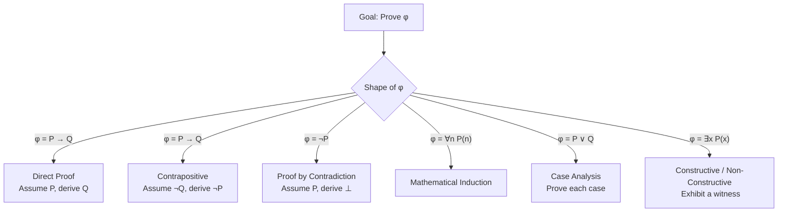
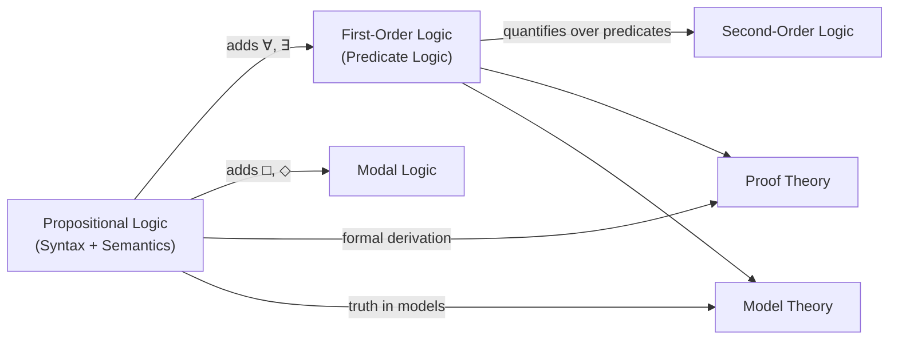

---
aliases:
  - lochica matematica
  - Logic(Math)
  - logica matematica
  - logica mathematica
  - logică matematică
  - logik matematik
  - logika matematika
  - logika matematiko
  - logika matematyczna
  - logika matématika
  - logique mathématique
  - logjika matematikore
  - loighic mhatamaiticiúil
  - Lojik
  - luận lý toán
  - lògica matemàtica
  - lógica matemática
  - lóxica matemática
  - matemaatiline loogika
  - matemaatlâš logiik
  - matemaattinen logiikka
  - matemaattlaž logikk
  - matematická logika
  - matematihkalaš logihkka
  - matematik mantiq
  - matematika logiko
  - matematikai logika
  - Matematikal na lohika
  - matematikala logiko
  - matematiksel mantık
  - matematisk logik
  - matematisk logikk
  - matematička logika
  - matematična logika
  - matemātiskā loģika
  - Mathematesch Logik
  - Mathematical logic
  - mathematische Logik
  - Okusengekensonga okw'ekibalo(Mathematical logic)
  - rhesymeg fathemategol
  - rianas matamataigeach
  - riyazi məntiq
  - simbolinė logika
  - Stærðfræðileg rökfræði
  - sò͘-lí lô-chi̍p
  - wiskundige logica
  - wiskundige logika
  - Yaayaa Herregaa
  - Μαθηματική λογική
  - мантиқи риёзӣ
  - математик логика
  - Математикăлла логика
  - Математикалык логика
  - Математическа логика
  - математическая логика
  - математичка логика
  - математична логіка
  - матэматычная лёгіка
  - матэматычная логіка
  - Символикалық логика
  - մաթեմատիկական տրամաբանություն
  - לוגיקה מתמטית
  - ریاضیاتی منطق
  - لوݢيک ماتماتيک
  - منطق رياضى
  - منطق رياضي
  - منطق ریاضی
  - गणितीय तर्कशास्त्र
  - গাণিতিক যুক্তিবিজ্ঞান
  - ಗಣಿತ ತರ್ಕಶಾಸ್ತ್ರ
  - ගණිතමය තර්කණය
  - คณิตตรรกศาสตร์
  - သင်္ချာယုတ္တိဗေဒ
  - သင်္ချာအခြီခံသီအိုရီတိ
  - მათემატიკური ლოგიკა
  - ሒሳባዊ ሥነ አምክንዮ
  - 数理論理学
  - 数理逻辑
  - 數學邏輯
  - 數理邏輯
  - 수리논리학
has_id_wikidata: Q1166618
has_characteristic: "[[_Standards/WikiData/WD~quantifier,592911|WD~quantifier,592911]]"
instance_of:
  - "[[_Standards/WikiData/WD~area_of_mathematics,1936384|WD~area_of_mathematics,1936384]]"
  - "[[_Standards/WikiData/WD~mathematical_theory,20026918|WD~mathematical_theory,20026918]]"
practiced_by: "[[_Standards/WikiData/WD~logician,14565331|WD~logician,14565331]]"
topic_has_template: "[[_Standards/WikiData/WD~Template_Mathematical_logic,18655775|WD~Template_Mathematical_logic,18655775]]"
described_by_source: "[[_Standards/WikiData/WD~Great_Soviet_Encyclopedia_(1926_1947),20078554|WD~Great_Soviet_Encyclopedia_(1926_1947),20078554]]"
permanent_duplicated_item: "[[_Standards/WikiData/WD~Q32128193,32128193|WD~Q32128193,32128193]]"
part_of:
  - "[[_Standards/WikiData/WD~mathematical_logic,_set_theory,_lattices_and_universal_algebra,112955904|WD~mathematical_logic,_set_theory,_lattices_and_universal_algebra,112955904]]"
  - "[[_Standards/WikiData/WD~mathematics,395|WD~mathematics,395]]"
  - "[[_Standards/WikiData/WD~logic,8078|WD~logic,8078]]"
subclass_of: "[[_Standards/WikiData/WD~logic,8078|WD~logic,8078]]"
used_by: "[[_Standards/WikiData/WD~mathematical_proof,11538|WD~mathematical_proof,11538]]"
OmegaWiki_Defined_Meaning: 1223499
Regensburg_Classification: SK 130
Universal_Decimal_Classification: 510.6
video: http://commons.wikimedia.org/wiki/Special:FilePath/%D0%9B%D0%BE%D0%B3%D0%B8%D0%BA%D0%B0.webm
image: http://commons.wikimedia.org/wiki/Special:FilePath/Venn%20A%20intersect%20B.svg
Basisklassifikation: 31.1
Commons_category: Mathematical logic
X_Twitter_username: PeterOHearn12
dv_has_:
  name_:
    af: wiskundige logika
    am: ሒሳባዊ ሥነ አምክንዮ
    an: lochica matematica
    ar: منطق رياضي
    arz: منطق رياضى
    ast: lóxica matemática
    az: riyazi məntiq
    ba: математик логика
    be: матэматычная логіка
    be_tarask: матэматычная лёгіка
    bg: Математическа логика
    bn: গাণিতিক যুক্তিবিজ্ঞান
    bs: matematička logika
    ca: lògica matemàtica
    cs: matematická logika
    cv: Математикăлла логика
    cy: rhesymeg fathemategol
    da: matematisk logik
    de: mathematische Logik
    el: Μαθηματική λογική
    en: mathematical logic
    eo: matematika logiko
    es: lógica matemática
    et: matemaatiline loogika
    eu: logika matematiko
    fa: منطق ریاضی
    fi: matemaattinen logiikka
    fr: logique mathématique
    ga: loighic mhatamaiticiúil
    gd: rianas matamataigeach
    gl: lóxica matemática
    gsw: mathematische Logik
    he: לוגיקה מתמטית
    hi: गणितीय तर्कशास्त्र
    hr: matematička logika
    ht: Lojik
    hu: matematikai logika
    hy: մաթեմատիկական տրամաբանություն
    id: logika matematika
    io: matematikala logiko
    is: Stærðfræðileg rökfræði
    it: logica matematica
    ja: 数理論理学
    jv: logika matématika
    ka: მათემატიკური ლოგიკა
    kk: Символикалық логика
    kn: ಗಣಿತ ತರ್ಕಶಾಸ್ತ್ರ
    ko: 수리논리학
    ky: Математикалык логика
    la: logica mathematica
    lb: Mathematesch Logik
    lg: Okusengekensonga okw'ekibalo(Mathematical logic)
    lij: logica matematica
    lt: simbolinė logika
    lv: matemātiskā loģika
    mag: गणितीय तर्कशास्त्र
    mk: математичка логика
    ms: logik matematik
    ms_arab: لوݢيک ماتماتيک
    mwl: lógica matemática
    my: သင်္ချာယုတ္တိဗေဒ
    nan: sò͘-lí lô-chi̍p
    nb: matematisk logikk
    nl: wiskundige logica
    nn: matematisk logikk
    oc: Logica Matematica
    om: Yaayaa Herregaa
    pl: logika matematyczna
    pnb: ریاضیاتی منطق
    pt: lógica matemática
    pt_br: lógica matemática
    rki: သင်္ချာအခြီခံသီအိုရီတိ
    ro: logică matematică
    ru: математическая логика
    sco: mathematical logic
    se: matematihkalaš logihkka
    sh: matematička logika
    si: ගණිතමය තර්කණය
    sk: matematická logika
    sl: matematična logika
    smn: matemaatlâš logiik
    sms: matemaattlaž logikk
    sq: logjika matematikore
    sr: математичка логика
    sv: matematisk logik
    tg: мантиқи риёзӣ
    th: คณิตตรรกศาสตร์
    tl: Matematikal na lohika
    tr: matematiksel mantık
    tt: математик логика
    uk: математична логіка
    ur: ریاضیاتی منطق
    uz: matematik mantiq
    vi: luận lý toán
    wuu: 数理逻辑
    yue: 數學邏輯
    zh: 数理逻辑
    zh_tw: 數理邏輯
tags:
  - logic
  - mathematics
---

# [[Logic(Math)]] 

#is_/same_as :: [[_Standards/WikiData/WD~Mathematical_logic,1166618|WD~Mathematical_logic,1166618]] 

## #has_/text_of_/abstract 

> Mathematical logic is the study of formal logic within mathematics. 
> Major subareas include model theory, proof theory, set theory, and recursion theory 
> (also known as computability theory). 
> 
> Research in mathematical logic commonly addresses 
> the mathematical properties of formal systems of logic 
> such as their expressive or deductive power. 
> However, it can also include uses of logic 
> to characterize correct mathematical reasoning 
> or to establish foundations of mathematics.
>
> Since its inception, mathematical logic has both contributed to 
> and been motivated by the study of foundations of mathematics. 
> 
> This study began in the late 19th century 
> with the development of axiomatic frameworks for geometry, arithmetic, and analysis. 
> 
> In the early 20th century it was shaped by David Hilbert's program 
> to prove the consistency of foundational theories. 
> 
> Results of Kurt Gödel, Gerhard Gentzen, and others provided partial resolution to the program, 
> and clarified the issues involved in proving consistency. 
> 
> Work in set theory showed that 
> almost all ordinary mathematics can be formalized in terms of sets, 
> although there are some theorems that cannot be proven in common axiom systems for set theory. 
> 
> Contemporary work in the foundations of mathematics often focuses on establishing 
> which parts of mathematics can be formalized in particular formal systems 
> (as in reverse mathematics) 
> rather than trying to find theories in which all of mathematics can be developed.
>
> [Wikipedia](https://en.wikipedia.org/wiki/Mathematical%20logic) 


## Syntax vs. Semantics

Two orthogonal dimensions govern every formal logical system.

| Dimension | Domain of Concern | Core Question | Primary Tools |
|-----------|------------------|---------------|---------------|
| **Syntax** | Symbols, strings, derivation rules | *Is this formula well-formed? Is it provable?* | Grammar, inference rules, proof calculi |
| **Semantics** | Meaning, truth, models | *Is this formula true under an interpretation?* | Truth assignments, models, satisfaction (⊨) |

### Formal Language (Syntax)

A formal language **L** is defined by:

$$
\mathcal{L} = \langle \text{Alphabet},\ \text{Grammar Rules} \rangle
$$

- **Alphabet** — atomic symbols: variables, constants, connectives, quantifiers, punctuation.
- **Grammar Rules (BNF)** — recursive grammar producing *well-formed formulas* (wffs).

### Interpretation (Semantics)

An **interpretation** (or *model*) **M** assigns:

$$
\mathcal{M} = \langle \text{Domain},\ \text{Valuation Function} \rangle
$$

- **Domain** — the non-empty set over which variables range.
- **Valuation** — maps each atomic formula to a truth value in {**T**, **F**}.

### The Soundness–Completeness Bridge

```
Syntactic Provability ⊢ φ
↕ (Bridge Theorems)
Semantic Entailment ⊨ φ
```

| Theorem                         | Direction      | Statement                                                |
| ------------------------------- | -------------- | -------------------------------------------------------- |
| **Soundness**                   | ⊢ → ⊨          | Every provable formula is a tautology                    |
| **Completeness** (Gödel 1930)   | ⊨ → ⊢          | Every tautology is provable in FOL                       |
| **Incompleteness** (Gödel 1931) | ⊢ ↛ ⊨ (in PA+) | Higher Order Logic contain true-but-unprovable sentences |

---

## 2. Logical Connectives

### 2.1 Connective Catalogue

| Symbol | Name | Arity | Reading |
|--------|------|-------|---------|
| ¬ | Negation | 1 | "not P" |
| ∧ | Conjunction | 2 | "P and Q" |
| ∨ | Disjunction | 2 | "P or Q" |
| → | Implication | 2 | "if P then Q" |
| ↔ | Biconditional | 2 | "P if and only if Q" |
| ⊕ | Exclusive Or | 2 | "P or Q but not both" |

### 2.2 Truth Table for Implication (→)

The conditional **P → Q** is the most frequently misunderstood connective.
It is **false only** when the antecedent is true and the consequent is false.

| P | Q | ¬P | P → Q | ¬P ∨ Q | ¬Q → ¬P |
|---|---|----|-------|--------|---------|
| T | T | F | **T** | T | T |
| T | F | F | **F** | F | F |
| F | T | T | **T** | T | T |
| F | F | T | **T** | T | T |

> 💡 **Key insight:** The last two columns confirm that
> **P → Q ≡ ¬P ∨ Q ≡ ¬Q → ¬P** (contrapositive equivalence).

### 2.3 Full Connective Truth Table

| P | Q | ¬P | P ∧ Q | P ∨ Q | P → Q | P ↔ Q | P ⊕ Q |
|---|---|----|-------|-------|-------|-------|-------|
| T | T | F | T | T | T | T | F |
| T | F | F | F | T | F | F | T |
| F | T | T | F | T | T | F | T |
| F | F | T | F | F | T | T | F |

---

## 3. Key Laws of Propositional Logic

### 3.1 Law Reference Table

| Law | Formula |
|-----|---------|
| **Double Negation** | ¬¬P ≡ P |
| **De Morgan (∧)** | ¬(P ∧ Q) ≡ ¬P ∨ ¬Q |
| **De Morgan (∨)** | ¬(P ∨ Q) ≡ ¬P ∧ ¬Q |
| **Contrapositive** | (P → Q) ≡ (¬Q → ¬P) |
| **Implication Elimination** | (P → Q) ≡ (¬P ∨ Q) |
| **Exportation** | (P ∧ Q → R) ≡ (P → (Q → R)) |
| **Idempotency** | P ∧ P ≡ P ; P ∨ P ≡ P |
| **Absorption** | P ∧ (P ∨ Q) ≡ P |
| **Distributivity (∧ over ∨)** | P ∧ (Q ∨ R) ≡ (P ∧ Q) ∨ (P ∧ R) |
| **Distributivity (∨ over ∧)** | P ∨ (Q ∧ R) ≡ (P ∨ Q) ∧ (P ∨ R) |
| **Excluded Middle** | P ∨ ¬P ≡ ⊤ |
| **Non-Contradiction** | P ∧ ¬P ≡ ⊥ |

### 3.2 De Morgan's Laws — Visual

```
¬(P ∧ Q) ¬(P ∨ Q)
‖ ‖
¬P ∨ ¬Q ¬P ∧ ¬Q

Negation distributes and FLIPS the connective.
```

### 3.3 Contrapositive vs. Converse vs. Inverse

Given the statement **P → Q**:

| Variant | Form | Logically Equivalent to P → Q? |
|---------|------|-------------------------------|
| **Original** | P → Q | — (baseline) |
| **Contrapositive** | ¬Q → ¬P | ✅ Yes |
| **Converse** | Q → P | ❌ No |
| **Inverse** | ¬P → ¬Q | ❌ No |

---

## 4. Predicate Logic (First-Order Logic)

### 4.1 Extending Propositional Logic

Predicate Logic (FOL) adds **individuals**, **predicates**, and **quantifiers** to express properties of and relations between objects.

$$
\text{Atomic Formula: } \quad P(x_1, x_2, \ldots, x_n)
$$

### 4.2 Quantifiers

| Symbol | Name | Reading | Semantics |
|--------|------|---------|-----------|
| ∀ | Universal | "For all x" | True if P(x) holds for every element of the domain |
| ∃ | Existential | "There exists x" | True if P(x) holds for at least one element |
| ∃! | Unique Existence | "There exists exactly one x" | True for precisely 1 element |

### 4.3 Quantifier Negation Laws

$$
\neg(\forall x\ P(x)) \equiv \exists x\ \neg P(x)
$$

$$
\neg(\exists x\ P(x)) \equiv \forall x\ \neg P(x)
$$

### 4.4 Scope and Binding

```
∀x [ P(x) → ∃y [ Q(x, y) ∧ R(y) ] ]
│ │
│ └─ y is BOUND by ∃y
└─────────────── x is BOUND by ∀x

Free variable: appears without a governing quantifier.
Bound variable: falls within the scope of a quantifier.
```

### 4.5 FOL Validity vs. Propositional Validity

| Property | Propositional Logic | First-Order Logic |
|----------|--------------------|--------------------|
| **Decidability** | ✅ Decidable (truth tables) | ❌ Semi-decidable only |
| **Complexity** | co-NP-complete (SAT: NP-complete) | Undecidable (Church–Turing) |
| **Completeness** | ✅ (trivially) | ✅ (Gödel 1930) |

---

## 5. Proof Strategies

### 5.1 Strategy Overview



### 5.2 Proof Strategy Details

| Strategy | Assume | Derive | Best Used When |
|----------|--------|--------|----------------|
| **Direct** | P | Q | Implication with tractable antecedent |
| **Contrapositive** | ¬Q | ¬P | Negation of consequent is more workable |
| **Contradiction** | ¬φ | ⊥ | φ seems hard to establish directly |
| **Induction** | Base case + Inductive step | ∀n P(n) | Statements over ℕ or inductively defined sets |
| **Case Analysis** | Each case exhaustively | φ in each case | Domain naturally partitions |
| **Constructive Existence** | — | Explicit witness x₀ with P(x₀) | Existential claims; stronger than non-constructive |
| **Non-Constructive Existence** | ¬∃x P(x) | ⊥ | Witness cannot be found explicitly |
| **Biconditional (↔)** | Split into (→) and (←) | Both directions | Proving equivalences |

### 5.3 Mathematical Induction — Standard Form

$$
\underbrace{P(\text{base})}_{\text{Base Case}} \quad \wedge \quad \underbrace{\forall k \left[ P(k) \Rightarrow P(k+1) \right]}_{\text{Inductive Step}} \quad \Longrightarrow \quad \forall n \in \mathbb{N}\ P(n)
$$

#### 5.3.1 Strong Induction Variant

$$
\forall k \left[ \left(\forall j < k\ P(j)\right) \Rightarrow P(k) \right] \quad \Longrightarrow \quad \forall n \in \mathbb{N}\ P(n)
$$

> Strong induction assumes P holds for **all** predecessors, not merely the immediate one.

### 5.4 Common Proof Pitfalls

| Pitfall | Description | Counter-Measure |
|---------|-------------|-----------------|
| **Circular Reasoning** | Conclusion used as premise | Map all dependencies before writing |
| **Affirming the Consequent** | Q, P→Q ⊢ P (invalid) | Distinguish ↔ from → |
| **Vacuous Truth Misuse** | Assuming P→Q is "strong" when P is ⊥ | Verify antecedent can be satisfied |
| **Induction Base Omission** | Skipping base case | Always prove both components |
| **Quantifier Confusion** | ∀x∃y ≠ ∃y∀x | Spell out quantifier order explicitly |

---

## 6. Modal Logic (Brief)

### 6.1 Core Motivation

Classical logic handles *truth*; Modal Logic handles **modes of truth** — necessity, possibility, belief, time, obligation.

### 6.2 Modal Operators

| Operator | Symbol | Reading | Dual |
|----------|--------|---------|------|
| **Necessity** | □φ | "It is necessarily the case that φ" | ◇φ ≡ ¬□¬φ |
| **Possibility** | ◇φ | "It is possibly the case that φ" | □φ ≡ ¬◇¬φ |

$$
\Box\varphi \equiv \neg\Diamond\neg\varphi \qquad \Diamond\varphi \equiv \neg\Box\neg\varphi
$$

### 6.3 Kripke Semantics

A **Kripke Frame** is:

$$
\mathcal{F} = \langle \text{Worlds},\ \text{Accessibility Relation} \rangle
$$

- **Worlds (W)** — a non-empty set of possible worlds.
- **Accessibility Relation (R)** — R ⊆ W × W; world **w₂** is accessible from **w₁** iff w₁ R w₂.

```
World w₁ ──R──► World w₂ ──R──► World w₃
│
└──R──► World w₄

□φ is TRUE at w₁ iff φ is TRUE at ALL worlds accessible from w₁.
◇φ is TRUE at w₁ iff φ is TRUE at SOME world accessible from w₁.
```

### 6.4 Major Modal Systems

| System | Additional Axiom | Constraint on R | Interpretation |
|--------|-----------------|-----------------|----------------|
| **K** | — (base system) | None | Minimal modal logic |
| **T** | □φ → φ | Reflexive | "What is necessary is true" |
| **S4** | □φ → □□φ | Reflexive + Transitive | Epistemic / Intuitionistic |
| **S5** | ◇φ → □◇φ | Equivalence relation | Absolute possibility |
| **GL** (Löb) | □(□φ → φ) → □φ | Transitive + Well-founded | Provability logic |

### 6.5 Modal Logic Branches

| Branch | Operators Reinterpret As | Example System |
|--------|--------------------------|----------------|
| **Alethic** | Necessity / Possibility | S5 |
| **Epistemic** | Knowledge / Belief | S4 / KD45 |
| **Deontic** | Obligation / Permission | SDL |
| **Temporal** | Always / Eventually | LTL, CTL |

---

## 7. Interconnection Map



---

## 8. Quick-Reference Glossary

| Term | Definition |
|------|-----------|
| **Tautology** | Formula true under every interpretation |
| **Contradiction** | Formula false under every interpretation |
| **Contingency** | Formula true under some, false under others |
| **Satisfiable** | At least one interpretation makes it true |
| **Valid (⊨ φ)** | True in all models |
| **Provable (⊢ φ)** | Derivable from axioms via inference rules |
| **Consistent** | No contradiction is derivable |
| **Complete** | Every truth is provable |
| **Decidable** | An algorithm exists to determine validity |
| **Wff** | Well-formed formula; a syntactically legal string |

---

## 9. Related Notes

- [[Set Theory — Foundations]]
- [[Proof Techniques — Practice Problems]]
- [[Computability and Decidability]]
- [[Propositional Calculus — Exercises]]
- [[Gödel's Incompleteness Theorems]]

## Confidential Links & Embeds: 

### #is_/same_as :: [[/_Standards/Philosophy/Logic/Logic(Math)|Logic(Math)]] 

### #is_/same_as :: [[/_public/Philosophy/Logic/Logic(Math).public|Logic(Math).public]] 

### #is_/same_as :: [[/_internal/Philosophy/Logic/Logic(Math).internal|Logic(Math).internal]] 

### #is_/same_as :: [[/_protect/Philosophy/Logic/Logic(Math).protect|Logic(Math).protect]] 

### #is_/same_as :: [[/_private/Philosophy/Logic/Logic(Math).private|Logic(Math).private]] 

### #is_/same_as :: [[/_personal/Philosophy/Logic/Logic(Math).personal|Logic(Math).personal]] 

### #is_/same_as :: [[/_secret/Philosophy/Logic/Logic(Math).secret|Logic(Math).secret]] 

