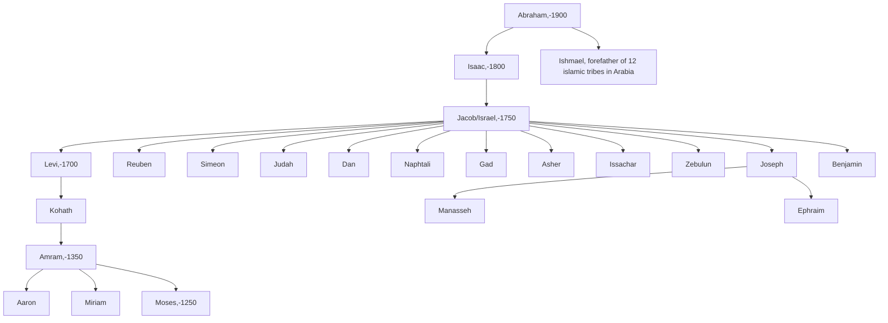

---
aliases:
  - Abram
BHCL_UUID: 0e7e2c32-a229-49aa-87f3-be4d791c1948
birth_name: אַבְרָם
child:
  - "[[_Standards/WikiData/WD~Ishmael,183403]]"
  - "[[_Standards/WikiData/WD~Shuah,369850]]"
  - "[[_Standards/WikiData/WD~Ishbak,594903]]"
  - "[[_Standards/WikiData/WD~Isaac,671872]]"
  - "[[_Standards/WikiData/WD~Jokshan,737548]]"
  - "[[_Standards/WikiData/WD~Midian,755316]]"
  - "[[_Standards/WikiData/WD~Zimran,786540]]"
  - "[[_Standards/WikiData/WD~Medan,1212757]]"
  - "[[_Standards/WikiData/WD~Bakol,109375725]]"
Commons_category: Abraham (Biblical figure)
date_of_birth: http://www.wikidata.org/.well-known/genid/309eda279d58d0812b3e1d13d269bf1e
date_of_death: http://www.wikidata.org/.well-known/genid/442da830d8a17f2bd42c2f1b0200bb81
described_by_source:
  - "[[_Standards/WikiData/WD~Catholic_Encyclopedia,302556]]"
  - "[[../../../../WikiData/WD~Brockhaus_and_Efron_Encyclopedic_Dictionary,602358]]"
  - "[[_Standards/WikiData/WD~Encyclopædia_Britannica_11th_edition,867541]]"
  - "[[_Standards/WikiData/WD~Pauly_Wissowa,1138524]]"
  - "[[_Standards/WikiData/WD~Dictionnaire_Infernal,1210353]]"
  - "[[_Standards/WikiData/WD~Shorter_Jewish_Encyclopedia,1967250]]"
  - "[[_Standards/WikiData/WD~Q2041543,2041543]]"
  - "[[_Standards/WikiData/WD~The_Nuttall_Encyclopædia,3181656]]"
  - "[[_Standards/WikiData/WD~Bible_Encyclopedia_of_Archimandrite_Nicephorus,4086271]]"
  - "[[_Standards/WikiData/WD~Jewish_Encyclopedia_of_Brockhaus_and_Efron,4173137]]"
  - "[[_Standards/WikiData/WD~Church_Encyclopedia,9253865]]"
  - "[[_Standards/WikiData/WD~The_New_Student's_Reference_Work,16082057]]"
  - "[[_Standards/WikiData/WD~Islamskiy_entsiklopedicheskiy_slovar',18517268]]"
  - "[[_Standards/WikiData/WD~Collier's_New_Encyclopedia,_1921,19047539]]"
  - "[[_Standards/WikiData/WD~Small_Brockhaus_and_Efron_Encyclopedic_Dictionary,19180675]]"
  - "[[_Standards/WikiData/WD~Orthodox_Theological_Encyclopedia,19211082]]"
  - "[[_Standards/WikiData/WD~Meyers_Konversations_Lexikon,_4th_edition_(1885_1890),19219752]]"
  - "[[_Standards/WikiData/WD~Orgelbrand's_Universal_Encyclopedia,19798659]]"
  - "[[_Standards/WikiData/WD~Great_Soviet_Encyclopedia_(1926_1947),20078554]]"
  - "[[_Standards/WikiData/WD~Medvik,99413897]]"
  - "[[_Standards/WikiData/WD~Metropolitan_Museum_of_Art_Tagging_Vocabulary,106727050]]"
  - "[[_Standards/WikiData/WD~Neues_Lexikon_des_Judentums,107459465]]"
  - "[[_Standards/WikiData/WD~Armenian_Soviet_Encyclopedia,_vol._1,123560817]]"
  - "[[_Standards/WikiData/WD~The_Oxford_Dictionary_of_the_Christian_Church_(4th_ed.),130479387]]"
different_from: "[[_Standards/WikiData/WD~Abraham,227001]]"
ethnic_group: "[[_Standards/WikiData/WD~Hebrews,570868]]"
father: "[[_Standards/WikiData/WD~Terah,586541]]"
feast_day: "[[_Standards/WikiData/WD~October_9,2923]]"
has_id_wikidata: Q9181
has_works_in_the_collection: "[[_Standards/WikiData/WD~Victoria_and_Albert_Museum,213322]]"
Iconclass_notation: 11I62(ABRAHAM)
image: http://commons.wikimedia.org/wiki/Special:FilePath/PikiWiki%20Israel%2047514%20Samaritan%20museum%20on%20mount%20Grizim%20-%20Left.jpg
Image_Archive_Herder_Institute: Q9181
instance_of: "[[_Standards/WikiData/WD~human_biblical_figure,20643955]]"
ISNI: 96500173
Krugosvet_article: kultura_i_obrazovanie/religiya/AVRAAM.html
languages_spoken_written_or_signed: "[[_Standards/WikiData/WD~Canaanite,747547]]"
Libris_URI: b8nrvpzv3bbzjvg
manner_of_death: "[[_Standards/WikiData/WD~natural_causes,3739104]]"
mother: "[[_Standards/WikiData/WD~Amasla,33205630]]"
occupation:
  - "[[_Standards/WikiData/WD~father_of_faith,2142783]]"
  - "[[_Standards/WikiData/WD~herder,12059906]]"
  - "[[_Standards/WikiData/WD~prophet,42857]]"
owner_of: "[[_Standards/WikiData/WD~Eliezer,14933103]]"
P8189: 987007311154905200
parent:
  - "[[_Standards/WikiData/WD~Terah,586541]]"
  - "[[_Standards/WikiData/WD~Amasla,33205630]]"
  - "[[_Standards/WikiData/WD~Talmud,43290]]"
part_of: "[[_Standards/WikiData/WD~Patriarchs,1189541]]"
place_of_burial: "[[_Standards/WikiData/WD~Cavern_of_the_Patriarchs,204200]]"
place_of_death: "[[_Standards/WikiData/WD~Hebron,168225]]"
position_held:
  - "[[_Standards/WikiData/WD~patriarch,171692]]"
  - "[[_Standards/WikiData/WD~prophet,42857]]"
present_in_work:
  - "[[_Standards/WikiData/WD~Book_of_Daniel,80115]]"
  - "[[_Standards/WikiData/WD~Tanakh,83367]]"
  - "[[_Standards/WikiData/WD~Gospel_of_Mark,107388]]"
  - "[[_Standards/WikiData/WD~Epistle_to_the_Hebrews,128608]]"
  - "[[_Standards/WikiData/WD~First_Book_of_Kings,131066]]"
  - "[[_Standards/WikiData/WD~Epistle_of_James,131097]]"
  - "[[_Standards/WikiData/WD~First_Epistle_of_Peter,131119]]"
  - "[[_Standards/WikiData/WD~Isaiah,131458]]"
  - "[[_Standards/WikiData/WD~Jeremiah,131590]]"
  - "[[_Standards/WikiData/WD~Book_of_Nehemiah,131640]]"
  - "[[_Standards/WikiData/WD~Book_of_Tobit,131737]]"
  - "[[_Standards/WikiData/WD~Sirach,155980]]"
  - "[[_Standards/WikiData/WD~Book_of_Micah,178076]]"
  - "[[_Standards/WikiData/WD~Ezekiel,178390]]"
  - "[[_Standards/WikiData/WD~Book_of_Judith,202129]]"
  - "[[_Standards/WikiData/WD~Second_Book_of_Chronicles,209720]]"
  - "[[_Standards/WikiData/WD~Second_Book_of_Kings,209746]]"
  - "[[_Standards/WikiData/WD~Gospel_of_Matthew,392302]]"
  - "[[_Standards/WikiData/WD~Book_of_Mormon,459842]]"
  - "[[_Standards/WikiData/WD~Book_of_Abraham,997718]]"
  - "[[_Standards/WikiData/WD~Kuando_el_Rey_Nimrod,2021659]]"
  - "[[_Standards/WikiData/WD~Tanhuma,2910304]]"
  - "[[_Standards/WikiData/WD~Midrash_Rabba,2917980]]"
  - "[[_Standards/WikiData/WD~The_Cave,2918522]]"
  - "[[_Standards/WikiData/WD~Genesis_14,12490426]]"
  - "[[_Standards/WikiData/WD~Genesis_24,12490438]]"
  - "[[_Standards/WikiData/WD~Genesis_25,12490436]]"
  - "[[_Standards/WikiData/WD~Genesis_28,12490441]]"
  - "[[_Standards/WikiData/WD~Genesis_48,12490451]]"
  - "[[_Standards/WikiData/WD~Genesis_26,14566197]]"
  - "[[_Standards/WikiData/WD~Genesis_31,14566203]]"
  - "[[_Standards/WikiData/WD~Genesis_35,14566207]]"
  - "[[_Standards/WikiData/WD~Genesis_32,14566204]]"
  - "[[_Standards/WikiData/WD~Qur_an,428]]"
  - "[[_Standards/WikiData/WD~Gospel_of_John,36766]]"
  - "[[_Standards/WikiData/WD~Gospel_of_Luke,39939]]"
  - "[[_Standards/WikiData/WD~Acts_of_the_Apostles,40309]]"
  - "[[_Standards/WikiData/WD~Psalms,41064]]"
  - "[[_Standards/WikiData/WD~Leviticus,41490]]"
  - "[[_Standards/WikiData/WD~Deuteronomy,42614]]"
  - "[[_Standards/WikiData/WD~Book_of_Numbers,43099]]"
  - "[[_Standards/WikiData/WD~Joshua,47680]]"
  - "[[_Standards/WikiData/WD~Epistle_to_the_Romans,48203]]"
pronunciation_audio: http://commons.wikimedia.org/wiki/Special:FilePath/LL-Q1571%20%28mar%29-Neelima64-%E0%A4%85%E0%A4%AC%E0%A5%8D%E0%A4%B0%E0%A4%BE%E0%A4%B9%E0%A4%AE.wav
residence:
  - "[[_Standards/WikiData/WD~Canaan,163329]]"
  - "[[_Standards/WikiData/WD~Mesopotamia,11767]]"
said_to_be_the_same_as: "[[_Standards/WikiData/WD~Ibrahim,1768161]]"
sex_or_gender: "[[_Standards/WikiData/WD~male,6581097]]"
sibling:
  - "[[_Standards/WikiData/WD~Sarah,194808]]"
  - "[[_Standards/WikiData/WD~Haran,1199156]]"
  - "[[_Standards/WikiData/WD~Nahor,6323112]]"
significant_event:
  - "[[_Standards/WikiData/WD~circumcision,83345]]"
  - "[[_Standards/WikiData/WD~vision,1682108]]"
  - "[[_Standards/WikiData/WD~Abraham_and_Lot's_conflict,4669252]]"
  - "[[_Standards/WikiData/WD~Binding_of_Isaac,5007906]]"
  - "[[_Standards/WikiData/WD~Covenant_of_the_pieces,5179022]]"
  - "[[_Standards/WikiData/WD~Battle_of_Siddim,14325705]]"
  - "[[_Standards/WikiData/WD~Q65251090,65251090]]"
spoken_text_audio: http://commons.wikimedia.org/wiki/Special:FilePath/Abraham.ogg
spouse:
  - "[[_Standards/WikiData/WD~Sarah,194808]]"
  - "[[_Standards/WikiData/WD~Hagar,214617]]"
  - "[[_Standards/WikiData/WD~Keturah,908531]]"
work_location: "[[_Standards/WikiData/WD~Palestine,23792]]"
worshipped_by:
  - "[[_Standards/WikiData/WD~Islam,432]]"
  - "[[_Standards/WikiData/WD~Christianity,5043]]"
  - "[[_Standards/WikiData/WD~Judaism,9268]]"
  - "[[_Standards/WikiData/WD~Abrahamic_religion,47280]]"
---

# [[Abraham]] 

#is_/same_as :: [[../../../../WikiData/WD~Abraham,9181]] 

## #has_/text_of_/abstract 

> **Abraham** (originally Abram) is the common Hebrew patriarch of the Abrahamic religions, 
> including Judaism, [[Christianity]], and [[Islam]]. 
> 
> In Judaism, he is the founding father 
> who began the covenantal relationship between the Jewish people and God; 
> in Christianity, he is the spiritual progenitor of all believers, whether Jewish or non-Jewish; 
> and in Islam, he is a link in the chain of Islamic prophets that begins with Adam 
> and culminates in Muhammad. 
> Abraham is also revered in other Abrahamic religions such as the Baháʼí Faith and the Druze faith.
>
> The story of the life of Abraham, as told in the narrative of the Book of Genesis in the Hebrew Bible, revolves around the themes of posterity and land. He is said to have been called by God to leave the house of his father Terah and settle in the land of Canaan, which God now promises to Abraham and his progeny. This promise is subsequently inherited by Isaac, Abraham's son by his wife Sarah, while Isaac's half-brother Ishmael is also promised that he will be the founder of a great nation. Abraham purchases a tomb (the Cave of the Patriarchs) at Hebron to be Sarah's grave, thus establishing his right to the land; and, in the second generation, his heir Isaac is married to a woman from his own kin to earn his parents' approval. Abraham later marries Keturah and has six more sons; but, on his death, when he is buried beside Sarah, it is Isaac who receives "all Abraham's goods" while the other sons receive only "gifts".
>
> Most scholars view the patriarchal age, 
> along with the Exodus and the period of the biblical judges, 
> as a late literary construct that does not relate to any particular historical era. 
> It is largely concluded that the Torah, the series of books that includes Genesis, 
> was composed during the Persian period, 
> as a result of tensions between Jewish landowners 
> who had stayed in Judah during the Babylonian captivity 
> and traced their right to the land through their "father Abraham", 
> and the returning exiles who based their counterclaim on Moses 
> and the Exodus tradition of the Israelites.
>
> [Wikipedia](https://en.wikipedia.org/wiki/Abraham) 

### Jacob

- Jacob is called _Israel_ in Genesis 32:28, after wrestling with an angel. 
- His 12 sons became heads of the families that later grew into tribes across Canaan.
- The exception is **Joseph**, whose inheritance was given to his two sons, **Manasseh** and **Ephraim**, 
  thus creating **two half-tribes** in place of Joseph. This preserved the symbolic number “12.”
- The **Levites**, while descended from Levi, were set apart for priestly duties instead of receiving contiguous tribal territory. 

## Ishmael 

Ishmael is the **first son of Abraham**, born through Hagar. He lived **137 years** (Genesis 25:17) and, like Jacob, was said to have **12 sons**, each becoming a tribal chief in Arabia.
## Confidential Links & Embeds: 

### #is_/same_as :: [Abraham](/_Standards/Philosophy/Metaphysic/Religion/Abrahamitic_Religion/Abraham.md) 

### #is_/same_as :: [Abraham.public](/_public/Philosophy/Metaphysic/Religion/Abrahamitic_Religion/Abraham.public.md) 

### #is_/same_as :: [Abraham.internal](/_internal/Philosophy/Metaphysic/Religion/Abrahamitic_Religion/Abraham.internal.md) 

### #is_/same_as :: [Abraham.protect](/_protect/Philosophy/Metaphysic/Religion/Abrahamitic_Religion/Abraham.protect.md) 

### #is_/same_as :: [Abraham.private](/_private/Philosophy/Metaphysic/Religion/Abrahamitic_Religion/Abraham.private.md) 

### #is_/same_as :: [Abraham.personal](/_personal/Philosophy/Metaphysic/Religion/Abrahamitic_Religion/Abraham.personal.md) 

### #is_/same_as :: [Abraham.secret](/_secret/Philosophy/Metaphysic/Religion/Abrahamitic_Religion/Abraham.secret.md)

