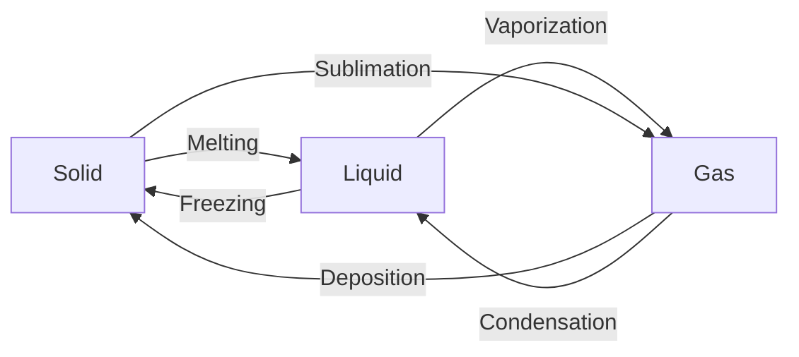

---
aliases:
- athrú pas
- būsenos kitimas
- caghlaa-stayd
- cambio de estado
- chirambo
- Chuyển pha
- Cikli shëndrrimit të gjendjeve aggregate
- egoera aldaketa
- faasimuutos
- faasisiire
- faseovergang
- fasövergång
- faza keçidləri
- fazalıq ötw
- Fazaviy oʻtish
- fazna transformacija
- fazni prehod
- fazni prelaz
- fazni prijelazi
- faztransiro
- fázisátalakulás
- fázová premena
- fázový přechod
- hal değişimi
- newid cyflwr
- peralihan fasa
- perubahan wujud zat
- phase Change
- phase transeetion
- phase transition
- Phasenübergang
- Phase_Transition
- przemiana fazowa
- Siòng choán-î
- transició de fase
- Transición de fase
- transition de phase
- transizione di fase
- transição de fase
- tranziție de fază
- ávdnasa orrunhámi nuppástus
- Фазăлла куçăм
- фазавы пераход
- фазалық өту
- фазен премин
- фазна трансформација
- фазов преход
- фазовий перехід
- фазовый переход
- Өөрчлөлтийн үе шат
- ֆազային անցում
- מעבר פאזה
- تحول طوري
- د فاز بدلون
- فازالىق ٴوتۋ
- گذار فاز
- प्रावस्था संक्रमण
- দশান্তর
- நிலை மாற்றம்
- അവസ്ഥാന്തരങ്ങൾ
- အဆင့်ကူးပြောင်းခြင်း
- အသွင်ကူးပြောင်းခြင်း
- 相变
- 相變
- 相転移
- 상전이
has_id_wikidata: Q185357
described_by_source: '[[_Standards/WikiData/WD~Armenian_Soviet_Encyclopedia,2657718]]'
subclass_of:
- '[[_Standards/WikiData/WD~change_of_state,2956046]]'
- '[[_Standards/WikiData/WD~thermodynamic_process_path,7783163]]'
- '[[_Standards/WikiData/WD~threshold_effect,7798100]]'
- '[[_Standards/WikiData/WD~transformation,65757353]]'
studied_by: '[[_Standards/WikiData/WD~thermodynamics,11473]]'
image: http://commons.wikimedia.org/wiki/Special:FilePath/Phase%20change%20-%20en.svg
IEV_number: 113-02-06
MeSH_tree_code:
- G01.645
- G02.734
Commons_category: Phase changes
dv_has_:
  name_:
    ar: تحول طوري
    ast: Transición de fase
    az: faza keçidləri
    be: фазавы пераход
    be_tarask: фазавы пераход
    bg: фазов преход
    bn: দশান্তর
    bs: fazni prelaz
    ca: transició de fase
    cs: fázový přechod
    cv: Фазăлла куçăм
    cy: newid cyflwr
    da: faseovergang
    de: Phasenübergang
    en: phase change
    eo: faztransiro
    es: transición de fase
    et: faasisiire
    eu: egoera aldaketa
    fa: گذار فاز
    fi: faasimuutos
    fr: transition de phase
    ga: athrú pas
    gl: cambio de estado
    gv: caghlaa-stayd
    he: מעבר פאזה
    hi: प्रावस्था संक्रमण
    hr: fazni prijelazi
    hu: fázisátalakulás
    hy: ֆազային անցում
    ia: transition de phase
    id: perubahan wujud zat
    it: transizione di fase
    ja: 相転移
    kk: фазалық өту
    kk_arab: فازالىق ٴوتۋ
    kk-cn: فازالىق ٴوتۋ
    kk_cyrl: фазалық өту
    kk-kz: фазалық өту
    kk_latn: fazalıq ötw
    kk-tr: fazalıq ötw
    ko: 상전이
    lt: būsenos kitimas
    mk: фазен премин
    ml: അവസ്ഥാന്തരങ്ങൾ
    mn: Өөрчлөлтийн үе шат
    ms: peralihan fasa
    my: အဆင့်ကူးပြောင်းခြင်း
    nan: Siòng choán-î
    nb: faseovergang
    nl: faseovergang
    nn: faseovergang
    pl: przemiana fazowa
    ps: د فاز بدلون
    pt: transição de fase
    rki: အသွင်ကူးပြောင်းခြင်း
    ro: tranziție de fază
    ru: фазовый переход
    sco: phase transeetion
    se: ávdnasa orrunhámi nuppástus
    sh: fazni prelaz
    sk: fázová premena
    sl: fazni prehod
    sn: chirambo
    sq: Cikli shëndrrimit të gjendjeve aggregate
    sr: фазна трансформација
    sr_ec: фазна трансформација
    sr_el: fazna transformacija
    sv: fasövergång
    ta: நிலை மாற்றம்
    tr: hal değişimi
    uk: фазовий перехід
    uz: Fazaviy oʻtish
    vi: Chuyển pha
    wuu: 相变
    yue: 相變
    zh: 相變
    zh_cn: 相变
    zh_hans: 相变
    zh_hant: 相變
    zh_hk: 相變
    zh_sg: 相变
    zh_tw: 相變
---

# [[Phase_Transition]] 

 
#is_/same_as :: [[WD~Phase_change,185357]] 
#see  :: [[_Standards/WikiData/WD~latent_heat_of_phase_transition,106553458]]

| From \ To  | [Solid](https://en.wikipedia.org/wiki/Solid "Solid")                                                        | [Liquid](https://en.wikipedia.org/wiki/Liquid "Liquid")                   | [Gas](https://en.wikipedia.org/wiki/Gas "Gas")                                             | [Plasma](https://en.wikipedia.org/wiki/Plasma_\(physics\) "Plasma (physics)") |
| ---------- | ----------------------------------------------------------------------------------------------------------- | ------------------------------------------------------------------------- | ------------------------------------------------------------------------------------------ | ----------------------------------------------------------------------------- |
| [[Solid]]  |                                                                                                             | [Melting](https://en.wikipedia.org/wiki/Melting "Melting")                | [[Solid/Sublimation\|Sublimation]]                                                         |                                                                               |
| [[Liquid]] | [Freezing](https://en.wikipedia.org/wiki/Freezing "Freezing")                                               |                                                                           | [Vaporization](https://en.wikipedia.org/wiki/Vaporization "Vaporization")                  |                                                                               |
| [[Gas]]    | [Deposition](https://en.wikipedia.org/wiki/Deposition_\(phase_transition\) "Deposition (phase transition)") | [Condensation](https://en.wikipedia.org/wiki/Condensation "Condensation") |                                                                                            | [Ionization](https://en.wikipedia.org/wiki/Ionization "Ionization")           |
| [[Plasma]] |                                                                                                             |                                                                           | [Recombination](https://en.wikipedia.org/wiki/Plasma_recombination "Plasma recombination") |                                                                               |

## #has_/text_of_/abstract 

> In physics, chemistry, and other related fields like biology, a **phase transition** (or phase change) 
> is the physical process of transition between one state of a medium and another. 
> 
> Commonly the term is used to refer to changes among the basic states of matter: 
> solid, liquid, and gas, and in rare cases, plasma. 
> 
> A phase of a thermodynamic system and the states of matter have uniform physical properties. 
> During a phase transition of a given medium, 
> certain properties of the medium change as a result of the change of external conditions, 
> such as temperature or pressure. 
> 
> This can be a discontinuous change; 
> for example, a liquid may become gas upon heating to its boiling point, 
> resulting in an abrupt change in volume. 
> 
> The identification of the external conditions at which a transformation occurs 
> defines the phase transition point.
>
> [Wikipedia](https://en.wikipedia.org/wiki/Phase%20transition) 

## Confidential Links & Embeds: 

### #is_/same_as :: [[/_Standards/Science/Physics/State_of_Matter/Phase_Transition|Phase_Transition]] 

### #is_/same_as :: [[/_public/Science/Physics/State_of_Matter/Phase_Transition.public|Phase_Transition.public]] 

### #is_/same_as :: [[/_internal/Science/Physics/State_of_Matter/Phase_Transition.internal|Phase_Transition.internal]] 

### #is_/same_as :: [[/_protect/Science/Physics/State_of_Matter/Phase_Transition.protect|Phase_Transition.protect]] 

### #is_/same_as :: [[/_private/Science/Physics/State_of_Matter/Phase_Transition.private|Phase_Transition.private]] 

### #is_/same_as :: [[/_personal/Science/Physics/State_of_Matter/Phase_Transition.personal|Phase_Transition.personal]] 

### #is_/same_as :: [[/_secret/Science/Physics/State_of_Matter/Phase_Transition.secret|Phase_Transition.secret]] 

