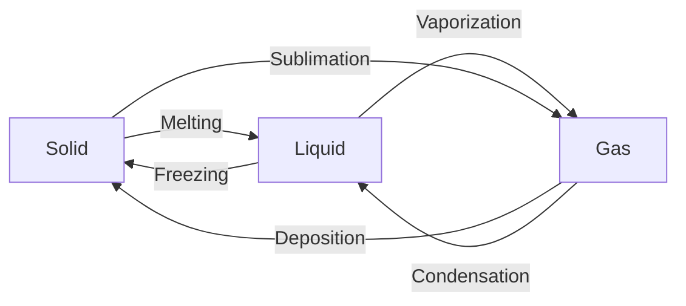

---
aliases:
  - phase transition
  - phase Change
has_id_wikidata: Q185357
described_by_source: "[[_Standards/WikiData/WD~Armenian_Soviet_Encyclopedia,2657718]]"
subclass_of:
  - "[[_Standards/WikiData/WD~change_of_state,2956046]]"
  - "[[_Standards/WikiData/WD~thermodynamic_process_path,7783163]]"
  - "[[_Standards/WikiData/WD~threshold_effect,7798100]]"
  - "[[_Standards/WikiData/WD~transformation,65757353]]"
studied_by: "[[_Standards/WikiData/WD~thermodynamics,11473]]"
image: http://commons.wikimedia.org/wiki/Special:FilePath/Phase%20change%20-%20en.svg
IEV_number: 113-02-06
MeSH_tree_code:
  - G01.645
  - G02.734
Commons_category: Phase changes
---

# [[Phase_Transition]] 

 
#is_/same_as :: [[WD~Phase_change,185357]] 
#see  :: [[_Standards/WikiData/WD~latent_heat_of_phase_transition,106553458]]

| From \ To  | [Solid](https://en.wikipedia.org/wiki/Solid "Solid")                                                        | [Liquid](https://en.wikipedia.org/wiki/Liquid "Liquid")                   | [Gas](https://en.wikipedia.org/wiki/Gas "Gas")                                             | [Plasma](https://en.wikipedia.org/wiki/Plasma_\(physics\) "Plasma (physics)") |
| ---------- | ----------------------------------------------------------------------------------------------------------- | ------------------------------------------------------------------------- | ------------------------------------------------------------------------------------------ | ----------------------------------------------------------------------------- |
| [[Solid]]  |                                                                                                             | [Melting](https://en.wikipedia.org/wiki/Melting "Melting")                | [[Solid/Sublimation\|Sublimation]]                                                         |                                                                               |
| [[Liquid]] | [Freezing](https://en.wikipedia.org/wiki/Freezing "Freezing")                                               |                                                                           | [Vaporization](https://en.wikipedia.org/wiki/Vaporization "Vaporization")                  |                                                                               |
| [[Gas]]    | [Deposition](https://en.wikipedia.org/wiki/Deposition_\(phase_transition\) "Deposition (phase transition)") | [Condensation](https://en.wikipedia.org/wiki/Condensation "Condensation") |                                                                                            | [Ionization](https://en.wikipedia.org/wiki/Ionization "Ionization")           |
| [[Plasma]] |                                                                                                             |                                                                           | [Recombination](https://en.wikipedia.org/wiki/Plasma_recombination "Plasma recombination") |                                                                               |

## #has_/text_of_/abstract 

> In physics, chemistry, and other related fields like biology, a **phase transition** (or phase change) 
> is the physical process of transition between one state of a medium and another. 
> 
> Commonly the term is used to refer to changes among the basic states of matter: 
> solid, liquid, and gas, and in rare cases, plasma. 
> 
> A phase of a thermodynamic system and the states of matter have uniform physical properties. 
> During a phase transition of a given medium, 
> certain properties of the medium change as a result of the change of external conditions, 
> such as temperature or pressure. 
> 
> This can be a discontinuous change; 
> for example, a liquid may become gas upon heating to its boiling point, 
> resulting in an abrupt change in volume. 
> 
> The identification of the external conditions at which a transformation occurs 
> defines the phase transition point.
>
> [Wikipedia](https://en.wikipedia.org/wiki/Phase%20transition) 

## Confidential Links & Embeds: 

### #is_/same_as :: [Phase_Transition](/_Standards/Science/Physics/State_of_Matter/Phase_Transition.md) 

### #is_/same_as :: [Phase_Transition.public](/_public/Science/Physics/State_of_Matter/Phase_Transition.public.md) 

### #is_/same_as :: [Phase_Transition.internal](/_internal/Science/Physics/State_of_Matter/Phase_Transition.internal.md) 

### #is_/same_as :: [Phase_Transition.protect](/_protect/Science/Physics/State_of_Matter/Phase_Transition.protect.md) 

### #is_/same_as :: [Phase_Transition.private](/_private/Science/Physics/State_of_Matter/Phase_Transition.private.md) 

### #is_/same_as :: [Phase_Transition.personal](/_personal/Science/Physics/State_of_Matter/Phase_Transition.personal.md) 

### #is_/same_as :: [Phase_Transition.secret](/_secret/Science/Physics/State_of_Matter/Phase_Transition.secret.md)

