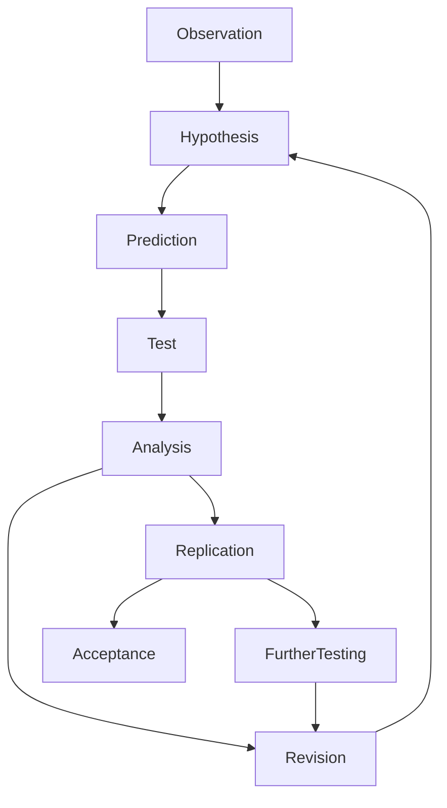

---
aliases:
- bilimsel yöntem
- ciencala metodo
- dull gwyddonol
- elmi metod
- Fomba fiasa siantifika
- Ilmiy metod
- Indlelasu yenzululwazi
- kaedah saintifik
- Kho-ha̍k-tek hong-hoat
- kërkimet shkencore
- Mala saayinsaawaa
- Mbinu ya kisayansi
- methodo scientific
- methodus scientifica
- metoda badawcza
- metode ilmiah
- metode scientific
- metodo scientifico
- metodo siensal
- metodo zientifiko
- metodu xjentifiku
- metodă științifică
- metòde scientific
- modh eolaíochta
- mokslinis metodas
- Mètoda scientifica
- mètode científic
- mètodo sientìfego
- méthode scientifique
- Métod syantifik
- métodhe èlmiah
- método científico
- métodu científicu
- naturvidenskabelig metode
- naučna metoda
- naučni metod
- Okunoonyereza okwa sayansi
- pamamaraang makaagham
- phương pháp khoa học
- saientifik methud
- Sayantifik metod
- scienca metodo
- scienteefic method
- scientific method
- scientific methodology
- siyentipiko nga paagi
- Siyentipikong paagi
- Tarrayt tusnant
- teaduslik meetod
- tieteellinen menetelmä
- tudományos módszer
- vedecká metóda
- vetenskaplig metod
- Vitenskapelig metode
- vitskapleg metode
- Vísindaleg aðferð
- vědecká metoda
- wetenschappelijke methode
- wetenskaplike metode
- wissenschaftliche Methode
- zinātniskā metode
- znanstvena metoda
- àlàkalẹ̀ sáyẹ́nsì
- Ăславла меслет
- επιστημονική μέθοδος
- зонадон метод
- навуковы метад
- навуковы мэтад
- науковий метод
- научен метод
- научни метод
- научный метод
- равиши илмӣ
- фәнни метод
- фәнни ысул
- Шинжлэх ухааны арга
- Ғылыми әдіс
- Ӏилман метод
- գիտական մեթոդ
- השיטה המדעית
- اسلوب علم
- روش علمی
- سائنسي طرز فڪر
- علمي مېتود
- قاعده ساءينتيفيک
- منهج علمي
- میتۆدی زانستی
- बैज्ञानिक बिधि
- वैज्ञानिक तवः
- वैज्ञानिक पद्धती
- वैज्ञानिक विधि
- বৈজ্ঞানিক পদ্ধতি
- ବୈଜ୍ଞାନିକ ପଦ୍ଧତି
- அறிவியல் அறிவு வழி
- శాస్త్రీయ పద్ధతి
- ವೈಜ್ಞಾನಿಕ ವಿಧಾನ
- ശാസ്ത്രീയ സമീപനം
- නවීන විද්යාත්මක ක්රමය
- ระเบียบวิธีแบบวิทยาศาสตร์
- သိပ္ပံနည်းကျ နည်းလမ်း
- მეცნიერული მეთოდი
- ሳይንሳዊ ዘዴ
- ការស្រាវជ្រាវបែបវិទ្យាសាស្ត្រ
- ᱥᱟᱬᱮᱥᱤᱭᱟ. ᱛᱚᱦᱚᱨ
- 科学方法
- 科学的方法
- 科學方法
- 과학적 방법
has_id_wikidata: Q46857
studied_by: '[[_Standards/WikiData/WD~methodology,185698|WD~methodology,185698]]'
has_characteristic: '[[_Standards/WikiData/WD~objectivity,206330|WD~objectivity,206330]]'
described_by_source: '[[_Standards/WikiData/WD~Armenian_Soviet_Encyclopedia,2657718|WD~Armenian_Soviet_Encyclopedia,2657718]]'
history_of_topic: '[[_Standards/WikiData/WD~history_of_scientific_method,3137275|WD~history_of_scientific_method,3137275]]'
Wikimedia_outline: '[[_Standards/WikiData/WD~outline_of_scientific_method,7112720|WD~outline_of_scientific_method,7112720]]'
subclass_of:
- '[[_Standards/WikiData/WD~scholarly_method,17079481|WD~scholarly_method,17079481]]'
- '[[_Standards/WikiData/WD~epistemological_values,133798571|WD~epistemological_values,133798571]]'
topic_has_template: '[[_Standards/WikiData/WD~Template_Infobox_Scientific_method,106463953|WD~Template_Infobox_Scientific_method,106463953]]'
said_to_be_the_same_as: '[[_Standards/WikiData/WD~research_method,126883870|WD~research_method,126883870]]'
used_by:
- '[[_Standards/WikiData/WD~science,336|WD~science,336]]'
- '[[_Standards/WikiData/WD~scientist,901|WD~scientist,901]]'
part_of: '[[_Standards/WikiData/WD~science,336|WD~science,336]]'
Wikidata_property: determination method or standard
facet_of: '[[_Standards/WikiData/WD~research,42240|WD~research,42240]]'
OmegaWiki_Defined_Meaning: 1592019
schematic:
- http://commons.wikimedia.org/wiki/Special:FilePath/Bilimsel%20yontem.jpg
- http://commons.wikimedia.org/wiki/Special:FilePath/M%C3%A9thode%20scientifique-La.svg
- http://commons.wikimedia.org/wiki/Special:FilePath/M%C3%A9thode%20scientifique.jpg
- http://commons.wikimedia.org/wiki/Special:FilePath/M%C3%A9todo%20cient%C3%ADfico%202021.jpg
- http://commons.wikimedia.org/wiki/Special:FilePath/Method.jpg
- http://commons.wikimedia.org/wiki/Special:FilePath/Metodo%20cientifico.svg
- http://commons.wikimedia.org/wiki/Special:FilePath/Metodo%20scientifico.svg
- http://commons.wikimedia.org/wiki/Special:FilePath/Proof-of-concept%20models.png
- http://commons.wikimedia.org/wiki/Special:FilePath/Scientific%20method-sr.svg
- http://commons.wikimedia.org/wiki/Special:FilePath/The%20Scientific%20Method.svg
- http://commons.wikimedia.org/wiki/Special:FilePath/The%20Scientific%20Method%20as%20an%20Ongoing%20Process.svg
- http://commons.wikimedia.org/wiki/Special:FilePath/Vitenskapelig%20metode.png
- http://commons.wikimedia.org/wiki/Special:FilePath/Wissenschaftliche%20Methode.svg
pronunciation_audio: http://commons.wikimedia.org/wiki/Special:FilePath/LL-Q9610%20%28ben%29-Helperofhumanity-%E0%A6%AC%E0%A7%88%E0%A6%9C%E0%A7%8D%E0%A6%9E%E0%A6%BE%E0%A6%A8%E0%A6%BF%E0%A6%95%20%E0%A6%AA%E0%A6%A6%E0%A7%8D%E0%A6%A7%E0%A6%A4%E0%A6%BF.wav
UMLS_CUI: C0025662
MeSH_tree_code: E05.581
Library_of_Congress_Classification: Q179.9-Q180.7
Commons_category: Scientific method
PhilPapers_topic: scientific-method
dv_has_:
  name_:
    af: wetenskaplike metode
    am: ሳይንሳዊ ዘዴ
    an: metodo scientifico
    ar: منهج علمي
    ast: métodu científicu
    az: elmi metod
    ba: фәнни ысул
    bcl: Siyentipikong paagi
    be: навуковы метад
    be_tarask: навуковы мэтад
    bg: научен метод
    bho: बैज्ञानिक बिधि
    bn: বৈজ্ঞানিক পদ্ধতি
    bs: naučna metoda
    ca: mètode científic
    ckb: میتۆدی زانستی
    cs: vědecká metoda
    cv: Ăславла меслет
    cy: dull gwyddonol
    da: naturvidenskabelig metode
    de: wissenschaftliche Methode
    el: επιστημονική μέθοδος
    en: scientific method
    eo: scienca metodo
    es: método científico
    et: teaduslik meetod
    eu: metodo zientifiko
    fa: روش علمی
    fi: tieteellinen menetelmä
    fr: méthode scientifique
    frp: Mètoda scientifica
    ga: modh eolaíochta
    gcr: Métod syantifik
    gl: método científico
    he: השיטה המדעית
    hi: वैज्ञानिक विधि
    hr: znanstvena metoda
    hu: tudományos módszer
    hy: գիտական մեթոդ
    ia: methodo scientific
    id: metode ilmiah
    ie: metode scientific
    inh: Ӏилман метод
    io: ciencala metodo
    is: Vísindaleg aðferð
    it: metodo scientifico
    ja: 科学的方法
    jam: Sayantifik metod
    jv: métodhe èlmiah
    ka: მეცნიერული მეთოდი
    kab: Tarrayt tusnant
    kk: Ғылыми әдіс
    km: ការស្រាវជ្រាវបែបវិទ្យាសាស្ត្រ
    kn: ವೈಜ್ಞಾನಿಕ ವಿಧಾನ
    ko: 과학적 방법
    la: methodus scientifica
    lfn: metodo siensal
    lg: Okunoonyereza okwa sayansi
    lt: mokslinis metodas
    lv: zinātniskā metode
    mg: Fomba fiasa siantifika
    min: Metode ilmiah
    mk: научен метод
    ml: ശാസ്ത്രീയ സമീപനം
    mn: Шинжлэх ухааны арга
    mr: वैज्ञानिक पद्धती
    ms: kaedah saintifik
    ms_arab: قاعده ساءينتيفيک
    mt: metodu xjentifiku
    my: သိပ္ပံနည်းကျ နည်းလမ်း
    nan: Kho-ha̍k-tek hong-hoat
    nb: Vitenskapelig metode
    new: वैज्ञानिक तवः
    nl: wetenschappelijke methode
    nn: vitskapleg metode
    oc: metòde scientific
    om: Mala saayinsaawaa
    or: ବୈଜ୍ଞାନିକ ପଦ୍ଧତି
    os: зонадон метод
    pa: scientific methodology
    pih: saientifik methud
    pl: metoda badawcza
    ps: علمي مېتود
    pt: método científico
    pt_br: método científico
    ro: metodă științifică
    ru: научный метод
    rue: Научный метод
    sat: ᱥᱟᱬᱮᱥᱤᱭᱟ. ᱛᱚᱦᱚᱨ
    sco: scienteefic method
    sd: سائنسي طرز فڪر
    sh: naučna metoda
    si: නවීන විද්යාත්මක ක්රමය
    sk: vedecká metóda
    sl: znanstvena metoda
    sq: kërkimet shkencore
    sr: научни метод
    sr_ec: научни метод
    sr_el: naučni metod
    sv: vetenskaplig metod
    sw: Mbinu ya kisayansi
    ta: அறிவியல் அறிவு வழி
    te: శాస్త్రీయ పద్ధతి
    tg: равиши илмӣ
    th: ระเบียบวิธีแบบวิทยาศาสตร์
    tl: pamamaraang makaagham
    tr: bilimsel yöntem
    tt: фәнни метод
    uk: науковий метод
    ur: اسلوب علم
    uz: Ilmiy metod
    vec: mètodo sientìfego
    vi: phương pháp khoa học
    war: siyentipiko nga paagi
    wuu: 科学方法
    yo: àlàkalẹ̀ sáyẹ́nsì
    yue: 科學方法
    zh: 科学方法
    zh_hant: 科學方法
    zh_tw: 科學方法
    zu: Indlelasu yenzululwazi
---

# [[Scientific_Method]] 

#is_/same_as :: [[_Standards/WikiData/WD~Scientific_method,46857|WD~Scientific_method,46857]] 

## #has_/text_of_/abstract 

> The scientific method is an empirical method for acquiring knowledge 
> that has been referred to while doing science since at least the 17th century. 
> 
> Historically, it was developed through the centuries from the ancient and medieval world. 
> 
> The scientific method involves careful observation coupled with rigorous skepticism, 
> because cognitive assumptions can distort the interpretation of the observation. 
> 
> Scientific inquiry includes **creating a testable hypothesis** through inductive reasoning, 
> testing it through experiments and statistical analysis, 
> and adjusting or discarding the hypothesis based on the results.
>
> Although procedures vary across fields, the underlying process is often similar. 
> In more detail: the scientific method involves 
> - making conjectures (hypothetical explanations), 
> - predicting the logical consequences of hypothesis, 
> - then carrying out experiments or empirical observations based on those predictions. 
> 
> A hypothesis is a conjecture based on knowledge obtained 
> while seeking answers to the question. 
> 
> Hypotheses can be very specific or broad but must be falsifiable, 
> implying that it is possible to identify a possible outcome of an experiment or observation 
> that conflicts with predictions deduced from the hypothesis; 
> otherwise, the hypothesis cannot be meaningfully tested.
>
> While the scientific method is often presented as a fixed sequence of steps, 
> it actually represents a set of general principles. 
> 
> Not all steps take place in every scientific inquiry (nor to the same degree), 
> and they are not always in the same order. 
> 
> Numerous discoveries have **not** followed the textbook model of the scientific method, 
> and, in some cases, chance has played a role.
>
> [Wikipedia](https://en.wikipedia.org/wiki/Scientific%20method) 

## Philosophy of Science  

The Philosophy of science studies what science is, how scientific knowledge is justified, 
how theories change, and where the boundary lies between science and non-science. 

The field asks both **normative** questions, such as how inquiry ought to proceed, 
and **descriptive** questions, such as how successful sciences actually develop. 

A central lesson of twentieth-century debate is that science is 
neither a simple accumulation of facts nor pure social construction; 
it is a fallible, historically situated, but still evidence-constrained enterprise.  
  
### Orientation  

A useful first contrast is between two broad outlooks. 
The older outlook sought one universal logic or method of science. 
The newer, more prevalent outlook treats science as a family of related practices 
that vary across fields while sharing common virtues such as 
- empirical testing, 
- explanatory power, 
- predictive success, 
- reproducibility, and 
- openness to criticism.  
  
#### Approximate standing of major outlooks  

The figures below are heuristic ranges, not survey data. They indicate relative current sympathy in philosophy of science and teaching presence. The positions overlap, so the percentages are not additive. 
  
| Outlook                            | Core claim                                                                            | Min% | Max% | Teach% |
| ---------------------------------- | ------------------------------------------------------------------------------------- | ---: | ---: | -----: |
| Methodological monism              | There is one universal scientific method.                                             |   10 |   20 |      80 |
| Methodological pluralism           | Sciences use multiple methods under shared norms of evidence and criticism.           |   60 |   80 |      90 |
| Strong inductivism                 | Science mainly justifies laws by accumulating confirming instances.                   |    5 |   15 |      70 |
| Strict Popperian falsificationism  | Science advances by conjectures and refutations; falsifiability is the key criterion. |   10 |   20 |     100 |
| Kuhnian historical paradigm view   | Science is structured by paradigms, normal science, crises, and revolutions.          |   20 |   35 |     100 |
| Lakatosian research-programme view | Theories are appraised as programmes over time, not by single tests.                  |   15 |   25 |      80 |
| Strong Feyerabendian anarchism     | No universal methodological rules should govern science.                              |    5 |   10 |      70 |
| Sharp demarcation criterion        | One clear rule separates science from non-science.                                    |   15 |   25 |      70 |
| Multi-criteria demarcation view    | Demarcation is context-sensitive and uses several indicators.                         |   60 |   80 |      90 |
| Moderate theory-ladenness          | Observation is influenced by theory but not wholly determined by it.                  |   70 |   90 |      90 |
| Strong theory-determination        | Observation is so theory-bound that neutral evidence is largely impossible.           |   10 |   20 |      60 |
  
### The Scientific Method  

In school textbooks, the scientific method is often presented as a sequence: 
- observe, hypothesize, predict, test, and revise. 

This model captures something important, namely the cyclic relation between theory and evidence, 
but it is too simple to describe all sciences. 

Astronomy often relies on observation and mathematical modeling rather than controlled experiment. 
Geology and evolutionary biology often infer past causes from present traces. 
Particle physics depends heavily on instrumentation, statistics, and model-based detection.  
  

  
#### Two main viewpoints  

##### monist viewpoint 
there is one core method common to all sciences. Historically, this was highly influential because it promised a clear logic of discovery and justification. Its authority today is lower because actual sciences differ too much in tools and standards.  
  
##### pluralist viewpoint 
 there is no single algorithm, but there are shared norms: empirical accountability, inferential discipline, public criticism, and readiness to revise. This is the more prevalent contemporary position. It preserves scientific objectivity without pretending that chemistry, cosmology, epidemiology, and economics proceed identically.  
  
### Inductivism and Hume's Problem  

Inductivism holds that science begins with observations and builds general laws from repeated instances. If many observed metals expand when heated, one may infer that all metals expand when heated. This fits the intuitive image of science as generalization from data.  
  
#### The core problem  
David Hume argued that no purely logical route justifies the step from observed cases to unobserved cases. The fact that the future has resembled the past does not deductively prove that it always will. Any attempt to justify induction by saying that induction worked in the past is circular, because it already relies on induction.  
  
#### The structure of the problem  
A simple inductive projection can be written as follows.  
$$
ProjectedProb(FutureCaseMatchesPattern \mid ObservedCasesMatchPattern)
$$  
Hume's point is that repeated success does not entail, by deduction alone, that future cases must match the pattern. The hidden assumption is often called the UniformityOfNature principle. The difficulty is that this principle itself seems to require justification.  
  
#### Main responses  
One response accepts Hume's challenge and concludes that induction lacks rational foundation in the strong sense. This skeptical reading has lasting authority. A second response tries to soften the problem rather than dissolve it. Bayesian philosophers, for example, describe rational updating by the formula below.  
$$
PosteriorProb(Hypothesis \mid Evidence) 
= \frac{Likelihood(Evidence \mid Hypothesis) \times PriorProb(Hypothesis)}{TotalProb(Evidence)}
$$ 
Bayesianism is influential because it formalizes how evidence can increase or decrease confidence. However, it does not fully escape Hume's challenge, because priors, model assumptions, and likelihoods still need justification. Pragmatist and naturalized responses make a different move: they argue that induction need not be philosophically guaranteed in order to be indispensable and successful in practice.  
  
#### Assessment  
Most philosophers accept Hume's negative point that induction is not deductively justified. What remains disputed is whether probabilistic, pragmatic, or naturalized approaches count as adequate vindications. Pure inductivism is now a minority position, but the problem it raised remains central.  
  
### Falsificationism, associated with Karl Popper  
Popper rejected the idea that science advances by confirming theories through induction. He argued that science proceeds by bold conjectures that expose themselves to possible refutation. A theory is scientific, on this view, if it is falsifiable, meaning that it forbids certain possible observations.  
  
#### Popper's central idea  
The statement "All swans are white" can be refuted by one black swan. By contrast, a claim flexible enough to fit every possible outcome is not genuinely testable. For Popper, the virtue of science lies not in verification but in severe testing. Theories that survive demanding tests are corroborated, though never finally proven.  
  
#### Strengths and limits  

| Aspect        | Popperian claim                                                                           | Contemporary assessment                                         |     |
| ------------- | ----------------------------------------------------------------------------------------- | --------------------------------------------------------------- | --- |
| Justification | Science does not verify theories; it tests them critically.                               | Widely influential as an ideal of critical inquiry.             |     |
| Demarcation   | Scientific theories must be falsifiable.                                                  | Still important, but rarely treated as the sole criterion.      |     |
| Progress      | Knowledge grows through error elimination.                                                | Plausible in part, but incomplete as a full history of science. |     |
| Weakness      | A failed prediction can be blamed on auxiliaries, instruments, or background assumptions. | This is a major challenge to strict falsificationism.           |     |
  
#### Two viewpoints on Popper  
A strong Popperian view treats falsifiability as both the essence of science and the key to scientific progress. Its current endorsement is limited, though its teaching authority remains very high.  
  
A softer contemporary view retains Popper's emphasis on risky prediction, testability, and criticism, but rejects naïve one-shot falsification. This softer view is more prevalent. Scientists usually evaluate bodies of theory together with auxiliary assumptions, measurement practices, and competing alternatives.  
  
### Kuhn's structure of scientific revolutions  
Thomas Kuhn argued that science is not best understood as a smooth accumulation of truths. Instead, long periods of normal science occur within a paradigm, interrupted by crises and revolutionary shifts. A paradigm includes exemplary achievements, standards of good explanation, accepted problems, techniques, and sometimes even ways of seeing the world.  
  
#### Kuhn's basic cycle  

| Stage                | Main activity                                                   | Treatment of anomalies                          |     |
| -------------------- | --------------------------------------------------------------- | ----------------------------------------------- | --- |
| Normal science       | Puzzle-solving within an accepted paradigm                      | Usually set aside or locally repaired           |     |
| Anomaly accumulation | Increasing mismatch between paradigm and recalcitrant phenomena | Becomes harder to ignore                        |     |
| Crisis               | Confidence in existing framework weakens                        | Anomalies press for deeper change               |     |
| Revolution           | A rival paradigm gains support                                  | Old standards and concepts are partly replaced  |     |
| New normal science   | Puzzle-solving resumes under the new paradigm                   | Some former anomalies disappear; new ones arise |     |
  
#### Why Kuhn mattered  
Kuhn redirected attention from abstract logic to scientific history and scientific communities. He showed that standards of evidence, acceptable questions, and even observational salience are partly paradigm-dependent. This was a major corrective to overly simple pictures of rationality.  
  
#### Controversies  
One reading of Kuhn emphasizes discontinuity and incommensurability, the idea that rival paradigms may not be fully comparable because they organize concepts and standards differently. This radical reading is influential but not dominant.  
  
A more moderate reading, which is more prevalent today, says Kuhn revealed genuine historical breaks without denying rational comparison altogether. Kuhn himself later emphasized evaluative values such as accuracy, consistency, scope, simplicity, and fruitfulness. On this reading, revolutions are not irrational leaps; they are comparisons under changing standards.  
  
### Lakatos's research programmes  
Imre Lakatos tried to combine Popper's rational criticism with Kuhn's historical realism. He argued that science should not be judged by isolated theories or single tests, but by research programmes that develop over time.  
  
#### Core structure  
A research programme has a hard core, a set of central commitments not easily abandoned, and a protective belt of auxiliary hypotheses that can be modified. It also has a heuristic, meaning a strategy for further development.  
  
#### Progressive and degenerating programmes  
A programme is progressive when theoretical changes lead to novel predictions and empirical successes. It is degenerating when modifications merely protect the programme from failure after the fact. Lakatos thus allows temporary resistance to apparent falsification while still demanding long-run empirical growth.  
  
#### Comparison with Popper and Kuhn  

| Thinker | Unit of appraisal                 | Main standard                               | Main advantage                               | Main limitation                              |     |
| ------- | --------------------------------- | ------------------------------------------- | -------------------------------------------- | -------------------------------------------- | --- |
| Popper  | Individual theory or conjecture   | Falsifiability and severe testing           | Strong critical ideal                        | Too simple about actual testing practice     |     |
| Kuhn    | Paradigm and scientific community | Puzzle-solving under a paradigm             | Historically realistic                       | Can seem vague about rational comparison     |     |
| Lakatos | Research programme over time      | Progressive versus degenerating development | Balances criticism and historical continuity | Hard to specify exact thresholds of progress |     |
  
#### Relative standing  
Lakatos has less broad public recognition than Popper or Kuhn, but among philosophers he is often treated as a sophisticated middle position. His framework has moderate current authority because it captures how scientists often protect core ideas while still demanding comparative empirical success.  
  
### Feyerabend's anarchism  
Paul Feyerabend criticized the search for universal methodological rules. His famous slogan, "anything goes," was meant as a provocation against methodological rigidity, not as a recommendation for chaos in everyday inquiry. His claim was that strict rules, if consistently enforced, would often have blocked important scientific advances.  
  
#### Main thesis  
Historical episodes suggest that successful scientists sometimes violated accepted methodological standards. New theories may begin with weak evidence, conceptual confusion, or ad hoc elements. On Feyerabend's view, creativity and plurality are therefore essential to progress.  
  
#### Two readings  
A strong reading takes Feyerabend to support epistemic anarchism, according to which there are no binding methodological constraints. This remains a minority view.  
  
A milder and more influential reading sees him as a radical pluralist. On this interpretation, his main lesson is that science should not be imprisoned by one official method, one style of explanation, or one intellectual authority. That lesson has had real influence, even though few philosophers accept unrestricted anarchism.  
  
#### Assessment  
Feyerabend is valuable as a critic of dogmatism, scientistic self-certainty, and the myth of a timeless method. His weakness is that, taken too far, his view can blur the distinction between disciplined heterodoxy and mere irresponsibility.  
  
### The demarcation problem  
The demarcation problem asks how to distinguish science from non-science, pseudoscience, metaphysics, or ideology. This matters both intellectually and socially, because scientific authority carries educational, legal, and political weight.  
  
#### Why the problem is difficult  
No single criterion appears to work in every case. Some non-scientific claims are meaningful and rational. Some scientific research programmes are immature or temporarily weakly testable. Some pseudosciences imitate scientific language and selective testing.  
  
#### Major demarcation proposals  

| Criterion | What it says | Main strength | Main difficulty |  
|---|---|---|---|  
| Verification | Scientific claims must be verifiable by observation. | Emphasizes empirical accountability | Universal laws are not straightforwardly verifiable |  
| Falsifiability | Scientific claims must be open to refutation. | Strong tool against immunized doctrines | Too crude as a complete criterion |  
| Puzzle-solving within a tradition | Science works within a mature problem-solving framework. | Captures disciplinary practice | Can exclude novel or fringe but promising work |  
| Reliability and reproducibility | Science yields stable, publicly checkable results. | Fits modern experimental ideals | Some exploratory science is not yet reproducible |  
| Multi-criteria cluster view | Science is identified by several converging features. | Flexible and realistic | Less sharp and less rhetorically simple |  
  
#### Two dominant viewpoints  
The sharp-criterion viewpoint seeks a necessary and sufficient rule, such as falsifiability. It has historical authority because it is clear, teachable, and useful in some disputes. Its current prevalence is lower.  
  
The multi-criteria viewpoint is more common today. It treats science as marked by a cluster of features: empirical testability, methodological transparency, explanatory integration, predictive success, openness to criticism, and cumulative problem-solving. This approach is less elegant but better suited to real cases.  
  
### Theory-ladenness of observation  
Theory-ladenness is the thesis that observation is influenced by prior concepts, training, background beliefs, and instrumentation. Scientists do not simply read facts directly from nature. What counts as a signal, a relevant variable, or an anomaly often depends on theory.  
  
#### Why observation is theory-laden  
A cloud-chamber track is not self-interpreting. A microscope image requires assumptions about optics, staining, and sample preparation. Even ordinary perception is shaped by learned categories and expectations. Thus, observation is rarely "pure."  
  
#### Two versions  

| Version | Core claim | Current sympathy Minimum /% | Current sympathy Maximum /% | Main implication |  
|---|---|---:|---:|---|  
| Moderate theory-ladenness | Observation is influenced by theory but still constrained by public methods and shared evidence. | 70 | 90 | Objectivity is difficult but possible |  
| Strong theory-determination | Observation is so theory-bound that neutral testing is largely impossible. | 10 | 20 | Objectivity becomes deeply unstable |  
  
#### Assessment  
The moderate view is far more prevalent. It explains why scientific training matters and why rival groups can initially "see" the same data differently. Yet it also leaves room for objectivity through calibration, reproducibility, triangulation, intersubjective criticism, and instrumentally mediated measurement. The strong view is less widely accepted because it risks collapsing into epistemic relativism.  
  
### Overall synthesis  
The philosophy of science developed from a search for a single logic of scientific justification into a more complex picture. Inductivism highlighted the role of evidence but was shaken by Hume's problem. Popper emphasized criticism and testability. Kuhn stressed paradigms, history, and scientific communities. Lakatos tried to preserve rational evaluation across time. Feyerabend warned against methodological dogmatism. Current work on demarcation and theory-ladenness usually favors nuanced, multi-criteria, and historically informed accounts.  
  
A fair summary is that contemporary philosophy of science is neither strictly Popperian nor purely Kuhnian. The prevailing view is more pluralist: science has no universal algorithm, but it is still distinguished by disciplined interaction between theory, evidence, instruments, models, and communal criticism.  
  
### Reliable starting points  
The homepages below are stable entry points for authoritative reference material. Searching the listed names from those sites is usually safer than relying on memory for every article-specific URL.  
  
| Resource | Best use | URL |  
|---|---|---|  
| Stanford Encyclopedia of Philosophy | Authoritative overview articles on Popper, Kuhn, induction, and related topics | https://plato.stanford.edu/ |  
| Internet Encyclopedia of Philosophy | Accessible introductions and teaching-oriented summaries | https://iep.utm.edu/ |  
| PhilPapers | Bibliography and recent academic literature | https://philpapers.org/ |  
  
### Canonical texts  

| Author | Work | Publication year | Lasting importance |  
|---|---|---:|---|  
| David Hume | *An Enquiry Concerning Human Understanding* | 1748 | Classical statement of the problem of induction |  
| Karl Popper | *The Logic of Scientific Discovery* | 1934 | Canonical statement of falsificationism |  
| Thomas S. Kuhn | *The Structure of Scientific Revolutions* | 1962 | Paradigm theory and scientific revolutions |  
| Imre Lakatos | *Falsification and the Methodology of Scientific Research Programmes* | 1970 | Middle position between Popper and Kuhn |  
| Paul Feyerabend | *Against Method* | 1975 | Landmark critique of methodological monism |  
  

### Confidential Links & Embeds: 

#### #is_/same_as :: [[/_Standards/Science/Scientific_Method|Scientific_Method]] 

#### #is_/same_as :: [[/_public/Science/Scientific_Method.public|Scientific_Method.public]] 

#### #is_/same_as :: [[/_internal/Science/Scientific_Method.internal|Scientific_Method.internal]] 

#### #is_/same_as :: [[/_protect/Science/Scientific_Method.protect|Scientific_Method.protect]] 

#### #is_/same_as :: [[/_private/Science/Scientific_Method.private|Scientific_Method.private]] 

#### #is_/same_as :: [[/_personal/Science/Scientific_Method.personal|Scientific_Method.personal]] 

#### #is_/same_as :: [[/_secret/Science/Scientific_Method.secret|Scientific_Method.secret]] 

