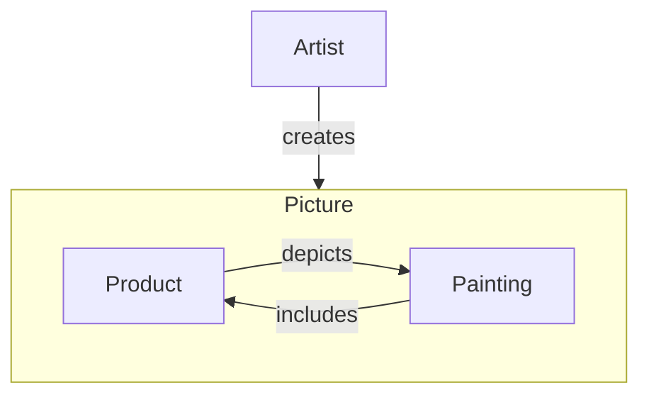

---
aliases:
  - mise en abyme
has_id_wikidata: Q7245255
instance_of: "[[_Standards/WikiData/WD~lithograph_print,15123870]]"
creator: "[[_Standards/WikiData/WD~M._C._Escher,1470]]"
---

# [[Droste_Effect]] 

#is_/same_as :: [[WD~Droste_Effect,7245255]]

## #has_/examples 

![[../../../../../../assets/Cacao_Droste_Tin_Can.png]] 

## #has_/text_of_/abstract 

> The Droste effect (Dutch pronunciation: [ˈdrɔstə]) is the effect of 
> a picture recursively appearing within itself, 
> in a place where a similar picture would realistically be expected to appear. 
> 
> In art history, the technique is known as mise en abyme. 
> This produces a loop which in theory could go on forever, 
> but in practice only continues as far as the image's resolution allows.
> 
> The effect is named after Droste, a Dutch brand of cocoa, 
> with an image designed by Jan Misset in 1904. 
> 
> The Droste effect has since been used in the packaging of a variety of products. 
> Apart from advertising, a variant of the effect is seen in the 
> Dutch artist M. C. Escher's 1956 lithograph Print Gallery, 
> which portrays a gallery that depicts itself. 
> 
> The effect has been widely used on the covers of comic books, mainly in the 1940s.
>
> [Wikipedia](https://en.wikipedia.org/wiki/Droste%20effect)  

