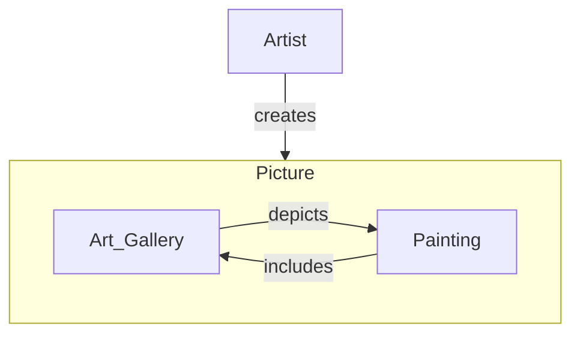

---
aliases:
  - Prentententoonstelling
  - Print Gallery
has_id_wikidata: Q7245255
instance_of: "[[_Standards/WikiData/WD~lithograph_print,15123870]]"
creator: "[[_Standards/WikiData/WD~M._C._Escher,1470]]"
---

# [[Print_Gallery(Escher)]]

#is_/same_as :: [[WD~Print_Gallery_(M._C._Escher),7245255]] 
#is_/instance_of :: [[Droste_Effect]] 

In 1956 the famous Dutch artist M.C. Escher created a very puzzeling print. 
In his lithograph ["Print Gallery"](https://en.wikipedia.org/wiki/Print_Gallery_\(M._C._Escher\)) a visitor observes a picture that ultimately contains himself.

  ## #has_/text_of_/abstract 

> Print Gallery (Dutch: Prentententoonstelling) 
> is a lithograph printed in 1956 by the Dutch artist M. C. Escher. 
> 
> It depicts a man in a gallery viewing a print of a seaport, 
> and among the buildings in the seaport is the very gallery in which he is standing, 
> making use of the [[Droste_Effect]] with visual recursion. 
> 
> The lithograph has attracted discussion in both mathematical and artistic contexts. 
> Escher considered Print Gallery to be among the best of his works.
>
> [Wikipedia](https://en.wikipedia.org/wiki/Print%20Gallery%20(M.%20C.%20Escher))  

Unlike the above picture, Eschers original contained a void blurry spot 
with his signature in the middle of the image. 

In 2002 the Dutch mathematicians Hendrik Lenstra and Bart de Smit 
investigated the question how the spot in the middle could reasonably be filled. 

They found very intresting connections to the complex exponential, 
and **doubly periodic functions**, and related it to the so called "Droste Effect" 
of self referencing images containing themselves as part.

the complex exponential is a conformal Map, i.e. 
(infinite) Squares are mapped to Squares again (orthogonal Meridians). 

The Idea is to take the complex Log of a Droste Image, 
which is double periodic (in x/real due to the Droste Effect, in y/imag always),
then rotate and scale this image around a Fixed Point, 
so that the Connection between the larger and the smaller copy in the double periodic Image
align with the y/i Axis, so the traversal between them is a rotation and they end up overlayed. 

Then do the inverse exponential Map to create a Droste Image, 
but this time the smaller and larger copies are continuously connected. 

In effect you do w -> ln(w) * c + z0 -> exp(ln(w) * c + z0) =  A0 * w^c 

Escher used a Scaling of 16 * 16 = 256, so the map is actually a complex Power Function

Doubly periodic functions can be described as the Surface of a [[../../../../../../Knowledge/Math/Topology/Torus|Torus]]. 
The topological related [[Klein_Bottle]] cannot be used to map the complex Plane on, 
not the least because it is non-orientable. 

 

## Confidential Links & Embeds: 

### #is_/same_as :: [[/_Standards/Society/Communication/Media/Painting/Painter/Print_Gallery(Escher)|Print_Gallery(Escher)]] 

### #is_/same_as :: [[/_public/Society/Communication/Media/Painting/Painter/Print_Gallery(Escher).public|Print_Gallery(Escher).public]] 

### #is_/same_as :: [[/_internal/Society/Communication/Media/Painting/Painter/Print_Gallery(Escher).internal|Print_Gallery(Escher).internal]] 

### #is_/same_as :: [[/_protect/Society/Communication/Media/Painting/Painter/Print_Gallery(Escher).protect|Print_Gallery(Escher).protect]] 

### #is_/same_as :: [[/_private/Society/Communication/Media/Painting/Painter/Print_Gallery(Escher).private|Print_Gallery(Escher).private]] 

### #is_/same_as :: [[/_personal/Society/Communication/Media/Painting/Painter/Print_Gallery(Escher).personal|Print_Gallery(Escher).personal]] 

### #is_/same_as :: [[/_secret/Society/Communication/Media/Painting/Painter/Print_Gallery(Escher).secret|Print_Gallery(Escher).secret]] 
