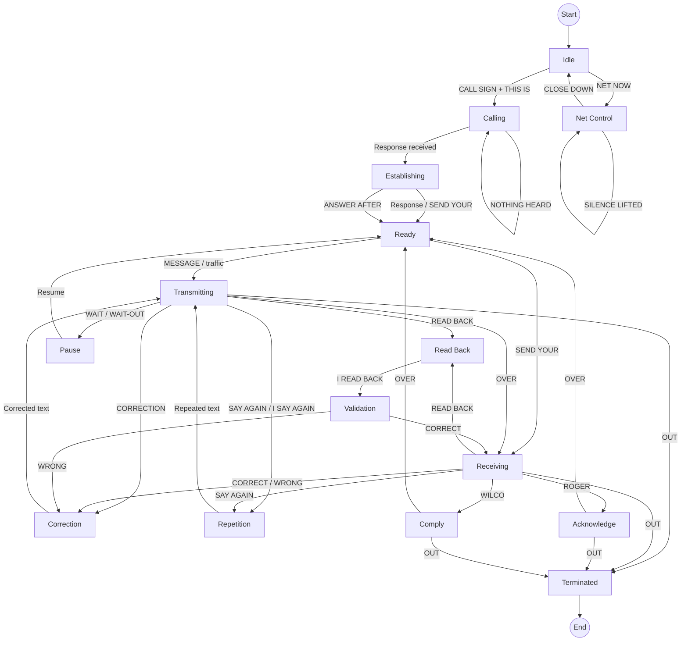
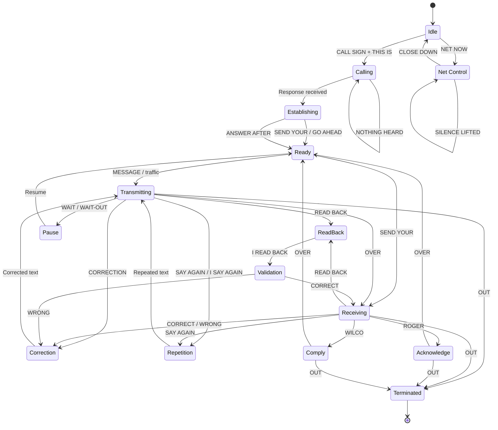

---
aliases:
  - Allied Communications Publication
has_id_wikidata: Q19365905
---

# [[ACP_125(Allied_Communications_Publication)]] 

#is_/same_as :: [[WD~ACP_125,19365905]] 

## #has_/text_of_/abstract 

> **ACP 125** is the short name for Allied Communications Publication 125: 
> Communications Instructions—Radiotelephone Procedures, 
> developed and published by the Combined Communications Electronics Board, 
> for use by the Five Eyes nations and the rest of NATO. 
> 
> According to the latest version, 
> "The aim of ACP 125 is to prescribe the voice procedure 
> for use by the armed forces of Allied nations on secure and non-secure tactical voice nets. 
> Its purpose is to provide a standardized way of passing speech and data traffic 
> as securely as possible consistent with accuracy, speed and the needs of command and control."
> 
> The standard defines the procedures for communicating by voice over two-way radio, 
> and has served as the basis for radio communications procedures 
> for many non-military organizations, as well as numerous U.S. government organizations, including 
> - the United States Department of State and 
> - the Civil Air Patrol.
> 
> First published as ACP 125(A) in about 1951, 
> the current version is ACP 125(G), published in 2016. 
> The standard itself is ACP 125, with the letter in parentheses indicating the major revision level. 
> 
> There are at least two supplements, including:
> - ACP 125 U.S. SUPP-1: HF Air-Ground Radiotelephone Procedures U.S. Supplement 1 to ACP 125(B)
> - ACP 125 (US SUPP-2): Radiotelephone Procedures for the Conduct of Artillery and Naval Gunfire (U)
>
> [Wikipedia](https://en.wikipedia.org/wiki/ACP%20125) 


## NATO / military voice procedure

The formal NATO reference is **ACP 125 — Communications Instructions: Radiotelephone Procedures**. 
It defines standardized voice procedure for Allied military forces on tactical voice nets, 
including secure and non-secure communications. 
The latest publicly documented major edition is **ACP 125(G)**. ([navy-radio.com](https://www.navy-radio.com/manuals/acp/acp125g.pdf?utm_source=chatgpt.com "Communications Instructions Radiotelephone Procedures"))

The important point is that this is **not simply a collection of radio slang**. 
ACP 125 defines a structured protocol for 
- establishing contact, 
- transmitting information, acknowledging it, correcting errors, requesting repetitions, controlling a radio net, and terminating transmissions. 


### State Machine 

#### Complete conceptual model

The easiest way to understand NATO radio procedure is as a **state machine**:








```text
                 ┌──────────────┐
                 │   NOT IN     │
                 │ COMMUNICATION│
                 └──────┬───────┘
                        │
                        ▼
                 CALL THE STATION
                        │
                        ▼
                 IDENTIFICATION
                 "THIS IS ..."
                        │
                        ▼
                  "GO AHEAD"
                        │
                        ▼
                    MESSAGE
                        │
          ┌─────────────┼─────────────┐
          ▼             ▼             ▼
       READ BACK     SAY AGAIN    CORRECTION
          │             │             │
          ▼             └──────┬──────┘
       CORRECT                │
          │                   │
          └──────────┬────────┘
                     ▼
                ACKNOWLEDGE
             ROGER / WILCO
                     │
             ┌───────┴───────┐
             ▼               ▼
           OVER             OUT
             │               │
             ▼               ▼
        OTHER STATION       END
```

That is the fundamental reason military radio sounds so different from ordinary conversation: **the words themselves encode the state of the communication**.

The authoritative source for this procedure is **ACP 125(G)**; the publicly available copy describes itself as _Communications Instructions — Radiotelephone Procedures_ and explicitly defines `OVER`, `OUT`, message structure, read-back, receipt, and the other prowords discussed above. ([navy-radio.com](https://www.navy-radio.com/manuals/acp/acp125g.pdf?utm_source=chatgpt.com "Communications Instructions Radiotelephone Procedures"))

#### All ProWords 


|      % | Proword                         | Semantics                                                                                        | French                           | German                            |
| -----: | ------------------------------- | ------------------------------------------------------------------------------------------------ | -------------------------------- | --------------------------------- |
| **80** | **OUT**                         | End of transmission; <br>no answer is required or expected.                                      | TERMINÉ                          | ENDE                              |
| **80** | **OVER**                        | End of transmission; <br>a response is required or expected.                                     | PARLEZ                           | ENDE / ANTWORTEN                  |
| **70** | **ROGER**                       | I have received your last transmission satisfactorily.                                           | REÇU                             | EMPFANGEN / VERSTANDEN            |
| **50** | **SAY AGAIN**                   | Repeat the last transmission or specified portion.                                               | RÉPÉTEZ                          | WIEDERHOLEN                       |
| **50** | **THIS IS**                     | Identifies the station transmitting.                                                             | ICI                              | HIER IST                          |
|     45 | **READ BACK**                   | Repeat the entire transmission <br>exactly as received.                                          | COLLATIONNEZ                     | ZURÜCKLESEN                       |
|     40 | **CORRECTION**                  | An error has been made; <br>corrected transmission follows.                                      | CORRECTION                       | KORREKTUR                         |
|     40 | **WILCO**                       | Received, understood and will comply.                                                            | APERÇU                           | WIRD AUSGEFÜHRT                   |
|     35 | **ACKNOWLEDGE**                 | Addressee is <br>to acknowledge receipt of the message.                                          | ACCUSEZ RÉCEPTION                | BESTÄTIGEN                        |
|     35 | **SEND YOUR**                   | I am ready to receive your message/report/etc.                                                   | ENVOYEZ VOTRE                    | SENDEN SIE IHRE                   |
|     30 | **I SAY AGAIN**                 | Repetition of the transmission or indicated portion.                                             | JE RÉPÈTE                        | ICH WIEDERHOLE                    |
|     25 | **CORRECT**                     | You are correct / <br>what you transmitted is correct.                                           | CORRECT                          | RICHTIG                           |
|     25 | **WRONG**                       | Last transmission was incorrect; <br>correct version follows.                                    | ERREUR                           | FALSCH                            |
|     20 | **NEGATIVE (NEGAT)**            | Means "no"; NEGAT can also cancel messages awaiting execution under Delayed Executive Method.    | NÉGATIF                          | NEGATIV                           |
|     20 | **WAIT**                        | Pause for a few seconds.                                                                         | ATTENDEZ                         | WARTEN                            |
|     20 | **WAIT-OUT**                    | Pause for longer than a few seconds.                                                             | ATTENDEZ TERMINÉ                 | LÄNGER WARTEN                     |
|     15 | **FIGURES**                     | Numerals or numbers follow.                                                                      | CHIFFRES                         | ZIFFERN                           |
|     15 | **I READ BACK**                 | Following is the <br>response to an instruction to read back.                                    | JE COLLATIONNE                   | ICH LESE ZURÜCK                   |
|     15 | **I SPELL**                     | Next word is to be spelled phonetically.                                                         | J'ÉPELLE                         | ICH BUCHSTABIERE                  |
|     15 | **MORE TO FOLLOW**              | Transmitting station has additional traffic.                                                     | SUITE À VENIR                    | WEITERES FOLGT                    |
|     10 | **FROM**                        | Following designator identifies the originator.                                                  | DE                               | VON                               |
|     10 | **INFO**                        | Following addressees are for information only.                                                   | POUR INFORMATION                 | ZUR INFORMATION                   |
|     10 | **PRIORITY**                    | Indicates PRIORITY precedence.                                                                   | PRIORITÉ                         | PRIORITÄT                         |
|     10 | **ROUTINE**                     | Indicates ROUTINE precedence.                                                                    | ROUTINE                          | ROUTINE                           |
|     10 | **TO**                          | Following addressees are addressed for action.                                                   | À                                | AN                                |
|      5 | **ADDRESS GROUP**               | Following group is the address group.                                                            | GROUPE DESTINATAIRE              | ADRESSGRUPPE                      |
|      5 | **ALL AFTER**                   | Portion referred to is all that follows the specified word/group.                                | TOUT APRÈS                       | ALLES NACH                        |
|      5 | **ALL BEFORE**                  | Portion referred to is all that precedes the specified word/group.                               | TOUT AVANT                       | ALLES VOR                         |
|      5 | **ANSWER AFTER**                | Called station is to answer after the specified callsign.                                        | RÉPONDEZ APRÈS                   | ANTWORTEN NACH                    |
|      5 | **BREAK**                       | Separates text from other portions of the transmission.                                          | SÉPARATION                       | TRENNUNG                          |
|      5 | **CALL SIGN**                   | Following group is a callsign.                                                                   | INDICATIF                        | RUFZEICHEN                        |
|      5 | **FLASH**                       | Indicates FLASH precedence.                                                                      | FLASH                            | FLASH                             |
|      5 | **MESSAGE**                     | A message requiring recording is about to follow.                                                | MESSAGE                          | NACHRICHT                         |
|      5 | **NOTHING HEARD**               | No reply has been received from the called station.                                              | RIEN ENTENDU                     | NICHTS GEHÖRT                     |
|      5 | **SPEAK SLOWER**                | Transmission is too fast; reduce speaking speed.                                                 | PARLEZ LENTEMENT                 | LANGSAMER SPRECHEN                |
|      5 | **TO--**                        | Portion referred to is all that lies between two specified groups.                               | ENTRE                            | ZWISCHEN                          |
|      5 | **UNKNOWN STATION**             | Used when the identity of the station being contacted is unknown.                                | STATION INCONNUE                 | UNBEKANNTE STATION                |
|      5 | **WORD AFTER**                  | Referred word follows the specified word/group.                                                  | LE MOT APRÈS                     | WORT NACH                         |
|      5 | **WORD BEFORE**                 | Referred word precedes the specified word/group.                                                 | LE MOT AVANT                     | WORT VOR                          |
|      5 | **WORDS TWICE**                 | Each phrase/code group is to be transmitted twice because communication is difficult.            | LES MOTS DEUX FOIS               | WÖRTER ZWEIMAL                    |
|      3 | **AUTHENTICATE**                | Called station is to reply to the authentication challenge that follows.                         | AUTHENTIFIEZ                     | AUTHENTISIEREN                    |
|      3 | **EXECUTE**                     | Carry out the purport of the message/signal; Executive Method.                                   | EXÉCUTEZ                         | AUSFÜHREN                         |
|      3 | **GRID**                        | Following portion is a grid reference.                                                           | QUADRILLAGE                      | GITTERREFERENZ                    |
|      3 | **GROUPS**                      | Message contains the number of groups indicated by the following numeral.                        | GROUPES                          | GRUPPEN                           |
|      3 | **IMMEDIATE**                   | Indicates IMMEDIATE precedence.                                                                  | IMMÉDIAT                         | SOFORT                            |
|      3 | **NUMBER**                      | Following is a station/message serial number.                                                    | NUMÉRO                           | NUMMER                            |
|      3 | **RELAY (TO)**                  | Transmit the message to the specified addressee(s).                                              | TRANSMETTEZ (À)                  | WEITERLEITEN (AN)                 |
|      3 | **SERVICE**                     | Following message is a service message.                                                          | SERVICE                          | DIENSTNACHRICHT                   |
|      3 | **TIME**                        | Following is a time/date-time group.                                                             | GROUPE HORAIRE                   | ZEIT                              |
|      3 | **VERIFY**                      | Verify the entire message or indicated portion with the originator and send the correct version. | VÉRIFIEZ                         | ÜBERPRÜFEN                        |
|      2 | **ASSUME CONTROL**              | You will assume control of the net until further notice.                                         | PRENEZ LE CONTRÔLE               | NETZKONTROLLE ÜBERNEHMEN          |
|      2 | **AUTHENTICATION IS**           | Following transmission is the authentication.                                                    | L'AUTHENTIFICATION EST           | AUTHENTIFIZIERUNG IST             |
|      2 | **CLOSE DOWN**                  | Stations are to close down when indicated; acknowledgements are required.                        | FERMEZ                           | NETZ SCHLIESSEN                   |
|      2 | **DISREGARD THIS TRANSMISSION** | Transmission is in error and is to be disregarded; does not cancel a message.                    | ANNULEZ CETTE TRANSMISSION       | DIESE ÜBERTRAGUNG IGNORIEREN      |
|      2 | **DO NOT ANSWER**               | Called stations are not to answer, acknowledge or otherwise transmit.                            | NE RÉPONDEZ PAS                  | NICHT ANTWORTEN                   |
|      2 | **EXECUTE TO FOLLOW**           | Action is to be carried out only upon a subsequent EXECUTE.                                      | PRÉPAREZ-VOUS À EXÉCUTER         | AUSFÜHRUNG FOLGT                  |
|      2 | **EXEMPT**                      | Following station(s) are exempted from the collective call/address.                              | EXCEPTÉ                          | AUSGENOMMEN                       |
|      2 | **GROUP NO COUNT**              | Groups have not been counted.                                                                    | GROUPES NON COMPTÉS              | GRUPPEN NICHT GEZÄHLT             |
|      2 | **I AM ASSUMING CONTROL**       | I am assuming control of the net until further notice.                                           | JE PRENDS LE CONTRÔLE            | ICH ÜBERNEHME DIE NETZKONTROLLE   |
|      2 | **I AUTHENTICATE**              | Following group is the reply to an authentication challenge.                                     | J'AUTHENTIFIE                    | ICH AUTHENTISIERE                 |
|      2 | **IMMEDIATE EXECUTE**           | Action on the following message/signal is carried out on receipt.                                | EXÉCUTION IMMÉDIATE              | SOFORT AUSFÜHREN                  |
|      2 | **I VERIFY**                    | Following information has been verified and is repeated.                                         | JE VÉRIFIE                       | ICH ÜBERPRÜFE                     |
|      2 | **NET NOW**                     | Stations are to net their radios in preparation for transmission.                                | RÉSEAU MAINTENANT                | NETZ JETZT                        |
|      2 | **RELAY THROUGH**               | Relay through the specified callsign.                                                            | TRANSMETTEZ PAR                  | WEITERLEITEN ÜBER                 |
|      2 | **SIGNALS**                     | Following groups are taken from a signal book.                                                   | SIGNAUX                          | SIGNALE                           |
|      2 | **SILENCE**                     | Cease transmissions immediately and maintain silence until lifted.                               | SILENCE                          | FUNKSTILLE                        |
|      2 | **SILENCE LIFTED**              | Radio silence is lifted.                                                                         | SILENCE SUSPENDU                 | FUNKSTILLE AUFGEHOBEN             |
|      2 | **THIS IS A DIRECTED NET**      | Net is directed until further notice.                                                            | CE RÉSEAU EST DIRIGÉ             | DIES IST EIN GEFÜHRTES NETZ       |
|      2 | **THIS IS A FREE NET**          | Net is free until further notice.                                                                | CE RÉSEAU EST LIBRE              | DIES IST EIN FREIES NETZ          |
|      2 | **THROUGH ME**                  | Relay the message through the transmitting station.                                              | PAR MOI                          | ÜBER MICH                         |
|      1 | **BROADCAST YOUR NET**          | Link two nets under control for automatic rebroadcast.                                           | DIFFUSEZ VOTRE RÉSEAU            | NETZ ÜBERTRAGEN                   |
|      1 | **NO PLAY**                     | Indicates that the following activity is real rather than exercise play.                         | PAS D'EXERCICE                   | KEIN ÜBUNGSSPIEL                  |
|      1 | **REBROADCAST YOUR NET**        | Link nets for automatic rebroadcast.                                                             | REDIFFUSEZ VOTRE RÉSEAU          | NETZ WEITERÜBERTRAGEN             |
|      1 | **STOP REBROADCASTING**         | Stop the automatic rebroadcast link and return to normal working.                                | CESSEZ LA REDIFFUSION            | WEITERÜBERTRAGUNG BEENDEN         |
|      1 | **USE ABBREVIATED CALL SIGNS**  | Use abbreviated callsigns until further notice.                                                  | EMPLOYEZ LES INDICATIFS ABRÉGÉS  | ABGEKÜRZTE RUFZEICHEN VERWENDEN   |
|      1 | **USE ABBREVIATED PROCEDURE**   | Use abbreviated procedure until further notice.                                                  | EMPLOYEZ LA PROCÉDURE ABRÉGÉE    | ABGEKÜRZTES VERFAHREN VERWENDEN   |
|      1 | **USE FULL CALL SIGNS**         | Use full callsigns until further notice.                                                         | EMPLOYEZ LES INDICATIFS COMPLETS | VOLLSTÄNDIGE RUFZEICHEN VERWENDEN |
|      1 | **USE FULL PROCEDURE**          | Use full procedure until further notice.                                                         | EMPLOYEZ LA PROCÉDURE COMPLÈTE   | VOLLSTÄNDIGES VERFAHREN VERWENDEN |


### History 

- 1860s Morse telegraphy 
	- procedural signals / prosigns e.g. 
		- K = "go ahead" 
		- AR = "end of transmission" 
		- R = "received" 
- Early 1900s Military / naval wireless telegraphy 
	- standardized operating procedures 
	- callsigns 
	- abbreviated messages 
	- phonetic spelling 
- WWI / WWII Military radiotelephone procedure 
	- OVER 
	- OUT 
	- ROGER 
	- SAY AGAIN 
	- CORRECTION 
	- standardized calling formats 
- 1940s–1950s US/UK/Commonwealth procedures consolidated 
- 1951 NATO / CCEB ACP 125(A) 
- 1950s–2010s ACP 125(B) → C → D → E → F → G ca. every Decade 


### 1. The fundamental transmission structure

The basic NATO pattern is:

```text
[CALLED STATION], THIS IS [CALLING STATION], [MESSAGE], OVER.
```

For example:

```text
BRAVO TWO, THIS IS ALPHA ONE, OVER.
```

The reply is:

```text
ALPHA ONE, THIS IS BRAVO TWO, SEND YOUR TRAFFIC, OVER.
```

Then the actual message follows:

```text
BRAVO TWO, THIS IS ALPHA ONE.
REPORT YOUR POSITION.
OVER.
```

And the answer:

```text
ALPHA ONE, THIS IS BRAVO TWO.
MY POSITION IS GRID ONE TWO THREE FOUR FIVE SIX.
OVER.
```

The transmission ends in **OVER** when a response is expected, or **OUT** when no response is expected. ACP 125 explicitly specifies that transmissions normally terminate with one or the other. ([navy-radio.com](https://www.navy-radio.com/manuals/acp/acp125g.pdf?utm_source=chatgpt.com "Communications Instructions Radiotelephone Procedures"))

---

### 2. CALL → IDENTIFICATION → TRAFFIC → ENDING

A useful mental model is:

|Phase|Example|Purpose|
|---|---|---|
|Call|`BRAVO TWO`|Who am I calling?|
|Identification|`THIS IS ALPHA ONE`|Who am I?|
|Traffic|`REPORT YOUR POSITION`|Actual information|
|Ending|`OVER`|Your turn|
|Ending|`OUT`|Conversation finished|

Thus a complete call is:

```text
BRAVO TWO, THIS IS ALPHA ONE, REPORT YOUR POSITION, OVER.
```

The receiver answers:

```text
ALPHA ONE, THIS IS BRAVO TWO, MY POSITION IS GRID ONE TWO
THREE FOUR FIVE SIX, OVER.
```

---

### 3. `THIS IS`

**THIS IS** identifies the station transmitting.

```text
BRAVO TWO, THIS IS ALPHA ONE...
```

means:

> "The station transmitting this message is Alpha One."

It is not normally necessary to say "I am Alpha One."

---

### 4. `OVER`

**OVER** means:

> "This transmission is finished and I expect you to transmit."

Example:

```text
ALPHA ONE, THIS IS BRAVO TWO, REPORT STATUS, OVER.
```

The important implication is **the other station has the floor**.

---

### 5. `OUT`

**OUT** means:

> "This transmission is finished and I do not expect a reply."

Example:

```text
BRAVO TWO, THIS IS ALPHA ONE, MESSAGE RECEIVED, OUT.
```

Therefore:

```text
OVER
```

and

```text
OUT
```

are fundamentally different.

##### `OVER`

```text
I have finished → you transmit.
```

##### `OUT`

```text
I have finished → nobody transmits.
```

Consequently, formal military procedure does **not** use "OVER AND OUT" as a combined ending. It is contradictory in the formal sense. ([navy-radio.com](https://www.navy-radio.com/manuals/acp/acp125g.pdf?utm_source=chatgpt.com "Communications Instructions Radiotelephone Procedures"))

---

### 6. `ROGER`

**ROGER** means:

> "I have received your last transmission satisfactorily."

It does **not** mean "yes", and it does **not** mean "I will do it." ([NATO Radio Scanner](https://nato.radioscanner.ru/files/article53/acp125f_communicatio.pdf?utm_source=chatgpt.com "ACP125 -Release 5 September 2001"))

For example:

```text
ALPHA ONE:
BRAVO TWO, MOVE TO CHECKPOINT CHARLIE, OVER.

BRAVO TWO:
ALPHA ONE, ROGER, OUT.
```

This only confirms receipt.

---

### 7. `WILCO`

**WILCO** comes from **"will comply."**

It means:

> "I have received your signal, understand it, and will comply."

Therefore:

```text
ALPHA ONE:
BRAVO TWO, MOVE TO CHECKPOINT CHARLIE, OVER.

BRAVO TWO:
ALPHA ONE, WILCO, OUT.
```

Because **WILCO already includes the acknowledgement represented by ROGER**, formal ACP 125 procedure says that **ROGER WILCO is redundant and should not be used**. ([NATO Radio Scanner](https://nato.radioscanner.ru/files/article53/acp125f_communicatio.pdf?utm_source=chatgpt.com "ACP125 -Release 5 September 2001"))

So:

```text
ROGER
```

= received.

```text
WILCO
```

= received + understood + will comply.

Not:

```text
ROGER WILCO
```

---

### 8. `SAY AGAIN`

**SAY AGAIN** requests repetition of the previous transmission.

Example:

```text
BRAVO TWO:
ALPHA ONE, SAY AGAIN, OVER.
```

The original station responds:

```text
BRAVO TWO, THIS IS ALPHA ONE.
I SAY AGAIN, MOVE TO CHECKPOINT CHARLIE.
OVER.
```

You can specify what needs repeating.

```text
SAY AGAIN GRID
```

or:

```text
SAY AGAIN TIME
```

ACP 125 specifically supports this type of selective repetition. ([NATO Radio Scanner](https://nato.radioscanner.ru/files/article53/acp125f_communicatio.pdf?utm_source=chatgpt.com "ACP125 -Release 5 September 2001"))

---

### 9. `I SAY AGAIN`

This is used by the transmitting station when deliberately repeating something.

For example:

```text
I SAY AGAIN, CHECKPOINT CHARLIE.
```

This is different from **SAY AGAIN**, which is a request from the receiving station.

|Proword|Direction|Meaning|
|---|---|---|
|`SAY AGAIN`|Receiver → sender|Repeat it|
|`I SAY AGAIN`|Sender → receiver|I am repeating it|

---

### 10. `CORRECTION`

Suppose Alpha One says:

```text
BRAVO TWO, MOVE TO CHECKPOINT DELTA...
```

but realizes that the destination should have been Charlie.

The proper correction is:

```text
CORRECTION, CHECKPOINT CHARLIE.
```

The receiver therefore knows that the previous information was wrong and that what follows is the corrected information.

---

### 11. `WRONG`

**WRONG** means that the preceding transmission was incorrect and that the correct version follows. ([NATO Radio Scanner](https://nato.radioscanner.ru/files/article53/acp125f_communicatio.pdf?utm_source=chatgpt.com "ACP125 -Release 5 September 2001"))

For example:

```text
WRONG.
THE CORRECT GRID IS ONE TWO THREE FOUR FIVE SIX.
```

`CORRECTION` is consequently not merely an apology; it is a procedural indicator that the information has changed.

---

### 12. `READ BACK`

This is particularly important for information where an error could have serious consequences.

For example:

```text
ALPHA ONE:
BRAVO TWO, READ BACK GRID.
GRID ONE TWO THREE FOUR FIVE SIX.
OVER.
```

Bravo Two responds:

```text
ALPHA ONE, THIS IS BRAVO TWO.
I READ BACK GRID.
ONE TWO THREE FOUR FIVE SIX.
OVER.
```

Alpha One then confirms:

```text
THIS IS ALPHA ONE.
CORRECT.
OUT.
```

This is a **read-back loop**:

```text
Sender
   ↓
Information
   ↓
Receiver
   ↓
READ BACK
   ↓
Sender verifies
   ↓
CORRECT
```

ACP 125 specifically describes `READ BACK GRID`, `READ BACK TIME`, `READ BACK TEXT`, etc. ([Scribd](https://www.scribd.com/document/797159521/ACP-125-F?utm_source=chatgpt.com "Acp 125 (F) | PDF | Radio | Signals Intelligence"))

---

### 13. `CORRECT`

**CORRECT** confirms that the read-back is accurate.

Example:

```text
BRAVO TWO:
I READ BACK GRID ONE TWO THREE FOUR FIVE SIX, OVER.

ALPHA ONE:
CORRECT, OUT.
```

This is preferable to merely saying `ROGER` when the purpose is specifically to validate the read-back.

---

### 14. `WAIT`

**WAIT** means that the operator needs to pause for a short period.

Example:

```text
ALPHA ONE, THIS IS BRAVO TWO.
WAIT, OVER.
```

However, the normal interpretation is that the other station should wait rather than immediately transmitting another message.

---

### 15. `WAIT OUT`

**WAIT OUT** indicates a longer pause.

The distinction in ACP 125 is approximately:

|Proword|Meaning|
|---|---|
|`WAIT`|Pause for a few seconds|
|`WAIT OUT`|Pause for longer than a few seconds|

([NATO Radio Scanner](https://nato.radioscanner.ru/files/article53/acp125f_communicatio.pdf?utm_source=chatgpt.com "ACP125 -Release 5 September 2001"))

It is therefore not simply a more emphatic version of `WAIT`.

---

### 16. `MORE TO FOLLOW`

This tells the other station that the sender has additional traffic.

Example:

```text
ALPHA ONE:
BRAVO TWO, THIS IS ALPHA ONE.
SUPPLY VEHICLE HAS ARRIVED.
MORE TO FOLLOW.
OVER.
```

The receiving station knows that the communication is not necessarily finished. ACP 125 explicitly provides for `MORE TO FOLLOW` in message endings and receipts. ([Scribd](https://www.scribd.com/document/797159521/ACP-125-F?utm_source=chatgpt.com "Acp 125 (F) | PDF | Radio | Signals Intelligence"))

---

### 17. `BREAK`

**BREAK** is used to separate portions of a transmission, particularly where a message contains distinct components.

For example:

```text
BRAVO TWO, THIS IS ALPHA ONE.

MOVE TO CHECKPOINT CHARLIE.
BREAK.

DEPARTURE TIME 1430 ZULU.
BREAK.

ACKNOWLEDGE.
OVER.
```

It effectively tells the receiver:

> "The following is a separate part of the communication."

---

### 18. `I SPELL`

When a word could be misunderstood, the NATO phonetic alphabet is used.

```text
I SPELL.
CHARLIE, ALFA, ROMEO, LIMA, INDIA, ECHO.
```

The NATO alphabet is:

|Letter|Word|Letter|Word|
|---|---|---|---|
|A|Alfa|N|November|
|B|Bravo|O|Oscar|
|C|Charlie|P|Papa|
|D|Delta|Q|Quebec|
|E|Echo|R|Romeo|
|F|Foxtrot|S|Sierra|
|G|Golf|T|Tango|
|H|Hotel|U|Uniform|
|I|India|V|Victor|
|J|Juliett|W|Whiskey|
|K|Kilo|X|X-ray|
|L|Lima|Y|Yankee|
|M|Mike|Z|Zulu|

Notice the official spellings **Alfa**, **Juliett**, and **X-ray**.

---

### 19. Numbers

Numbers are normally transmitted digit-by-digit where ambiguity could otherwise occur.

For example:

```text
GRID ONE TWO THREE FOUR FIVE SIX
```

rather than:

```text
GRID 123456
```

Similarly:

```text
TIME ONE FOUR THREE ZERO ZULU
```

means:

```text
14:30 UTC
```

`FIGURES` is a proword used to indicate that the following material consists of figures/numbers.

---

### 20. `TIME`

Time information is normally expressed carefully and may include a time-zone suffix.

For example:

```text
TIME ONE FOUR THREE ZERO ZULU.
```

means:

```text
14:30 UTC.
```

`ZULU` is the NATO designation for UTC.

---

### 21. `GRID`

Grid references are particularly important because they are normally information that should not be misheard.

For example:

```text
READ BACK GRID.
ONE TWO THREE FOUR FIVE SIX.
OVER.
```

The receiver repeats the grid exactly, and the sender responds:

```text
CORRECT.
```

This is an example where **read-back is more useful than merely saying ROGER**. ([Scribd](https://www.scribd.com/document/797159521/ACP-125-F?utm_source=chatgpt.com "Acp 125 (F) | PDF | Radio | Signals Intelligence"))

---

### 22. `AUTHENTICATION`

Military radio procedure also has procedures for authentication.

Authentication is fundamentally different from acknowledgement.

##### Acknowledgement

```text
ROGER
```

means:

> "I received what you said."

##### Authentication

Authentication establishes that the station transmitting is authorized/genuine according to the applicable authentication system.

ACP 125 includes `AUTHENTICATION IS` among the procedural elements that can occur in final instructions. ([navy-radio.com](https://www.navy-radio.com/manuals/acp/acp125g.pdf?utm_source=chatgpt.com "Communications Instructions Radiotelephone Procedures"))

The **actual authentication codes and mechanisms are system-specific**, so they are not something that can be represented by one universal NATO phrasebook.

---

### 23. `DO NOT ANSWER`

This is an especially interesting one.

A station can transmit information while explicitly instructing the receiving station **not to respond**.

For example:

```text
ALL STATIONS, THIS IS ALPHA ONE.

EXERCISE MESSAGE FOLLOWS.
...
DO NOT ANSWER.
OUT.
```

ACP 125 specifies that transmissions containing `DO NOT ANSWER` terminate with **OUT**, not OVER. ([navy-radio.com](https://www.navy-radio.com/manuals/acp/acp125g.pdf?utm_source=chatgpt.com "Communications Instructions Radiotelephone Procedures"))

---

### 24. `UNKNOWN STATION`

If you hear a station but do not know its identity, there is a standardized way to address it.

Conceptually:

```text
UNKNOWN STATION, THIS IS ALPHA ONE, IDENTIFY YOURSELF, OVER.
```

This avoids the informal:

```text
"Who is that?"
```

---

### 25. `NOTHING HEARD`

If a station calls but no response is received, military procedure provides a standardized way of reporting that nothing was heard.

The important distinction is that radio silence is not automatically interpreted as agreement, acknowledgement, or compliance.

---

### 26. `SILENCE`

This is one of the more serious net-control procedures.

**SILENCE** orders stations to stop transmitting on the net.

The ACP procedure even provides for repeated `SILENCE` and subsequently `SILENCE LIFTED`. ([Scribd](https://www.scribd.com/document/797159521/ACP-125-F?utm_source=chatgpt.com "Acp 125 (F) | PDF | Radio | Signals Intelligence"))

Conceptually:

```text
SILENCE SILENCE SILENCE.
```

followed later by:

```text
SILENCE LIFTED.
```

This is fundamentally different from an ordinary request to stop talking. It is a **net-control procedure**.

---

### 27. `NET CONTROL`

On a military net, there may be a designated **Net Control Station (NCS)**.

The NCS controls access to the shared frequency.

A simplified net might look like:

```text
NCS:
ALL STATIONS, THIS IS NET CONTROL.
RADIO CHECK, OVER.

ALPHA ONE:
NET CONTROL, THIS IS ALPHA ONE.
ROGER, OVER.

BRAVO TWO:
NET CONTROL, THIS IS BRAVO TWO.
ROGER, OVER.
```

The exact radio-check and net-opening procedures depend on the particular network and operating instructions.

---

### 28. Radio checks

A radio check asks whether the transmission is being received adequately.

A simplified example is:

```text
BRAVO TWO, THIS IS ALPHA ONE.
RADIO CHECK, OVER.
```

The response could indicate reception quality according to the applicable procedure.

The important principle is that a radio check is **not** the same thing as asking whether the message was understood.

---

### 29. A complete tactical-style exchange

Putting the pieces together:

```text
BRAVO TWO, THIS IS ALPHA ONE, RADIO CHECK, OVER.

ALPHA ONE, THIS IS BRAVO TWO.
LOUD AND CLEAR, OVER.

BRAVO TWO, THIS IS ALPHA ONE.
REPORT YOUR POSITION.
READ BACK GRID.
OVER.

ALPHA ONE, THIS IS BRAVO TWO.
I READ BACK GRID.
ONE TWO THREE FOUR FIVE SIX.
OVER.

BRAVO TWO, THIS IS ALPHA ONE.
CORRECT.

MOVE TO CHECKPOINT CHARLIE.
DEPARTURE TIME ONE FOUR THREE ZERO ZULU.
ACKNOWLEDGE.
OVER.

ALPHA ONE, THIS IS BRAVO TWO.
WILCO.
OUT.

BRAVO TWO, THIS IS ALPHA ONE.
MORE TO FOLLOW.
OVER.

ALPHA ONE, THIS IS BRAVO TWO.
OVER.

BRAVO TWO, THIS IS ALPHA ONE.
REPORT ON ARRIVAL.
OUT.
```

The important thing here is that **each word has a procedural function** rather than merely making the conversation sound military.

---

### 30. A message can be considerably more structured

ACP 125 also defines a formal message format rather than merely conversational traffic. One of the important concepts is that a message can contain elements such as:

```text
CALL
MESSAGE
ORIGINATOR
ADDRESSEE
TEXT
BREAK
TIME
FINAL INSTRUCTIONS
ENDING
```

The later portions can include things such as `AUTHENTICATION IS`, `CORRECTION`, `I SAY AGAIN`, `MORE TO FOLLOW`, `STANDBY`, and `EXECUTE`. ([Scribd](https://www.scribd.com/document/797159521/ACP-125-F?utm_source=chatgpt.com "Acp 125 (F) | PDF | Radio | Signals Intelligence"))

So a more formal message could look conceptually like:

```text
BRAVO TWO, THIS IS ALPHA ONE.

MESSAGE.

FROM ALPHA ONE.
TO BRAVO TWO.

MOVE TO CHECKPOINT CHARLIE.

BREAK.

TIME ONE FOUR THREE ZERO ZULU.

ACKNOWLEDGE.

OVER.
```

The actual formal message format is more elaborate than this simplified example.

---

### 31. `EXECUTE`

`EXECUTE` is used in command/control situations to indicate that an instruction is to be carried out.

There is also:

```text
EXECUTE TO FOLLOW
```

which indicates that execution will occur following a specified condition, signal, or subsequent instruction.

This is important because **receiving an order and executing an order are different events**.

For example:

```text
BRAVO TWO, THIS IS ALPHA ONE.
EXECUTE TO FOLLOW.
OVER.
```

does not mean "execute immediately."

---

### 32. `STANDBY`

`STANDBY` is different from `WAIT OUT` in an important operational sense.

It generally tells the receiving station to remain ready for further traffic.

For example:

```text
BRAVO TWO, STANDBY.
```

The appropriate response is generally **not** an automatic `ROGER`; the station may simply wait for the subsequent transmission depending on the procedure being used.

---

### 33. `RELAY`

A station can be instructed to relay traffic.

For example:

```text
BRAVO TWO, RELAY TO CHARLIE THREE, OVER.
```

The station then acts as an intermediary rather than merely receiving the information for itself.

This is especially relevant when radio propagation or terrain prevents direct communication.

---

### 34. The most important prowords

If you wanted to learn the **core NATO vocabulary first**, I would rank it approximately like this:

|Priority|Proword|Function|
|--:|---|---|
|1|`OVER`|Your turn|
|2|`OUT`|Conversation finished|
|3|`THIS IS`|Identify transmitting station|
|4|`ROGER`|Received|
|5|`WILCO`|Received + understood + will comply|
|6|`SAY AGAIN`|Repeat|
|7|`I SAY AGAIN`|I am repeating|
|8|`CORRECTION`|Previous information was wrong|
|9|`READ BACK`|Repeat information for verification|
|10|`CORRECT`|Read-back is correct|
|11|`WAIT`|Short pause|
|12|`WAIT OUT`|Longer pause|
|13|`MORE TO FOLLOW`|More traffic follows|
|14|`BREAK`|Separate message sections|
|15|`I SPELL`|Spell phonetically|
|16|`FIGURES`|Numbers follow|
|17|`VERIFY`|Verify information|
|18|`WRONG`|Previous transmission incorrect|
|19|`RELAY`|Pass traffic onward|
|20|`DO NOT ANSWER`|Do not respond|

These are drawn from the ACP 125 procedure rather than the broader collection of phrases commonly heard in movies or informal radio use. ([NATO Radio Scanner](https://nato.radioscanner.ru/files/article53/acp125f_communicatio.pdf?utm_source=chatgpt.com "ACP125 -Release 5 September 2001"))

---

### 35. The three biggest Hollywood misconceptions

##### "Over and out"

**Incorrect in formal procedure.**

```text
OVER = response expected
OUT  = response not expected
```

Therefore combining them defeats their distinct meanings. ([navy-radio.com](https://www.navy-radio.com/manuals/acp/acp125g.pdf?utm_source=chatgpt.com "Communications Instructions Radiotelephone Procedures"))

##### "Roger" means "yes"

Not exactly.

```text
ROGER = I received your transmission.
```

It does not inherently mean agreement or compliance.

##### "Roger Wilco"

Also formally redundant.

```text
ROGER = received
WILCO = received + understood + will comply
```

ACP 125 explicitly says the two are not used together because `WILCO` already includes the receipt represented by `ROGER`. ([NATO Radio Scanner](https://nato.radioscanner.ru/files/article53/acp125f_communicatio.pdf?utm_source=chatgpt.com "ACP125 -Release 5 September 2001"))

---

If you want to go one level deeper, the particularly interesting next step is the **

## full NATO proword table 


