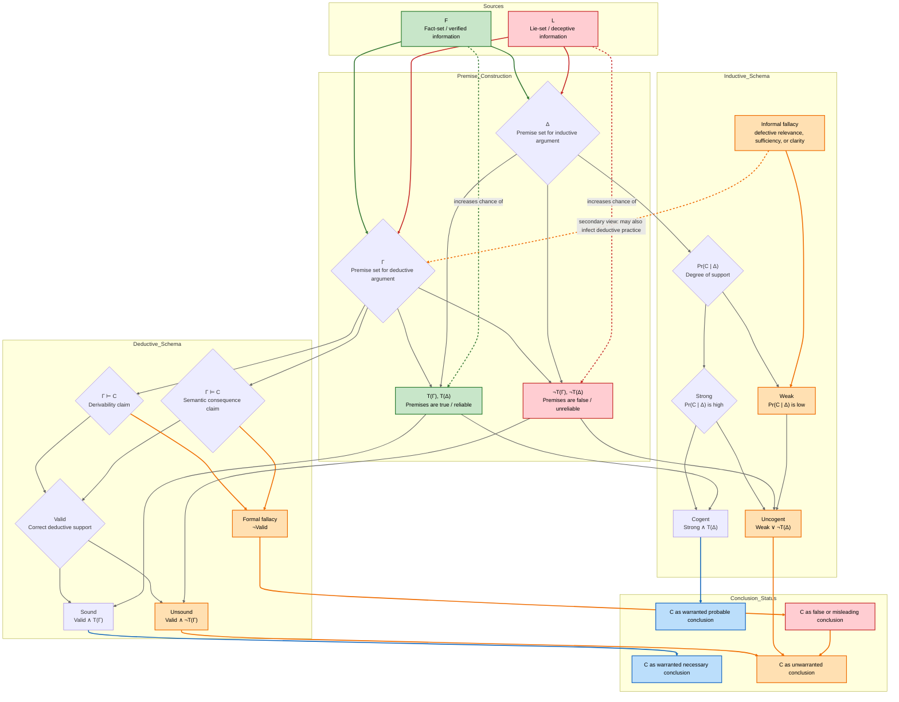

---
aliases:
- argomento
- Argudio
- Argument
- Argumentación
- argumentas
- argumentasi
- argumentasjon
- argumentation
- Argumenti
- argumento
- Argumento (retoriko)
- Arguments
- Argumentti
- Argumentu
- Argumentum
- Arguméntasi
- Argwment
- argóint
- argüman
- arqument
- arutlus
- Dokaz
- Hujah
- Hujah (mantèk)
- luận cứ logic
- érv
- επιχείρημα
- аргумент
- Аргумент (логіка)
- аргумэнт
- Доказ
- логички аргумент
- טיעון
- ارگۋمەنت
- برهان
- بەڵگە
- حجة
- دليل
- دلیل
- منطق (استدلال)
- तर्क
- যুক্তিবাণ
- வாதம்
- การอ้างเหตุผล
- არგუმენტი
- 論証
- 論證
- 逻辑论证
- 邏輯論證
- 논증
has_id_wikidata: Q186619
subclass_of:
- '[[_Standards/WikiData/WD~discourse,190539|WD~discourse,190539]]'
- '[[_Standards/WikiData/WD~message,628523|WD~message,628523]]'
different_from: '[[_Standards/WikiData/WD~argument,651343|WD~argument,651343]]'
described_by_source:
- '[[_Standards/WikiData/WD~Encyclopædia_Britannica_11th_edition,867541|WD~Encyclopædia_Britannica_11th_edition,867541]]'
- '[[_Standards/WikiData/WD~Small_Brockhaus_and_Efron_Encyclopedic_Dictionary,19180675|WD~Small_Brockhaus_and_Efron_Encyclopedic_Dictionary,19180675]]'
- '[[_Standards/WikiData/WD~The_Domestic_Encyclopædia;_Or,_A_Dictionary_Of_Facts,_And_Useful_Knowledge,56441911|WD~The_Domestic_Encyclopædia;_Or,_A_Dictionary_Of_Facts,_And_Useful_Knowledge,56441911]]'
- '[[_Standards/WikiData/WD~Red_Blue_Translator,131935072|WD~Red_Blue_Translator,131935072]]'
has_characteristic: '[[_Standards/WikiData/WD~validity,1047000|WD~validity,1047000]]'
has_goal: '[[_Standards/WikiData/WD~persuasion,1231428|WD~persuasion,1231428]]'
said_to_be_the_same_as: '[[_Standards/WikiData/WD~Q12359534,12359534|WD~Q12359534,12359534]]'
has_part_s_: '[[_Standards/WikiData/WD~claim,95972591|WD~claim,95972591]]'
Dewey_Decimal_Classification: 168
IMDb_keyword: argument
PhilPapers_topic: argument
Commons_category: Arguments
spoken_text_audio: http://commons.wikimedia.org/wiki/Special:FilePath/Wikipedia%20-%20Argumento%20%28hablado%20por%20voz%20AI%29.mp3
dv_has_:
  name_:
    af: argument
    ar: حجة
    as: যুক্তিবাণ
    ast: Argumentu
    az: arqument
    be: Аргумент (логіка)
    be_tarask: аргумэнт
    bew: Hujah (mantèk)
    bs: argument
    ca: argument
    ckb: بەڵگە
    cs: argument
    da: argumentation
    de: Argument
    de_ch: Argument
    el: επιχείρημα
    en: argument
    en_ca: Argument
    en_gb: argument
    eo: argumento
    es: argumento
    et: arutlus
    eu: Argudio
    fa: برهان
    fi: Argumentti
    fr: argumentation
    ga: argóint
    gl: Argumentación
    he: טיעון
    hi: तर्क
    hr: argument
    hu: érv
    id: argumentasi
    io: Argumento (retoriko)
    it: argomento
    ja: 論証
    ka: არგუმენტი
    kk: Аргумент
    kk_arab: ارگۋمەنت
    kk-cn: ارگۋمەنت
    kk_cyrl: Аргумент
    kk-kz: Аргумент
    kk_latn: Argwment
    kk-tr: Argwment
    ko: 논증
    la: Argumentum
    lb: Argument
    lt: argumentas
    lv: Arguments
    mk: логички аргумент
    ms: Hujah
    nb: argumentasjon
    nl: argument
    pl: argument
    ps: منطق (استدلال)
    pt: argumento
    pt_br: Argumento
    ro: argument
    ru: аргумент
    sd: دليل
    sh: Dokaz
    sk: Argument
    sl: argument
    sq: Argumenti
    sr: Доказ
    sr_ec: Доказ
    sr_el: Dokaz
    su: Arguméntasi
    sv: argumentation
    ta: வாதம்
    th: การอ้างเหตุผล
    tr: argüman
    tt: аргумент
    uk: аргумент
    ur: دلیل
    vi: luận cứ logic
    wuu: 逻辑论证
    xmf: არგუმენტი
    yue: 論證
    zh: 逻辑论证
    zh_cn: 逻辑论证
    zh_hans: 逻辑论证
    zh_hant: 邏輯論證
    zh_hk: 邏輯論證
    zh_sg: 逻辑论证
    zh_tw: 邏輯論證
---

# [[Argument]] 

#is_/same_as :: [[../../../WikiData/WD~Argument,186619|WD~Argument,186619]] 

the main flows are:  
Facts → true premises → argument evaluation → warranted conclusion.  
Lies → false premises → argument evaluation → unjustified or misleading conclusion.

The decisive formal distinction is:  
- Deductive quality is assessed by validity and soundness.  
- Inductive quality is assessed by strength and cogency.

## #has_/diagram  

| Symbol   | Meaning                                          | Typical domain                        |
| -------- | ------------------------------------------------ | ------------------------------------- |
| Γ        | Set of premises                                  | Deductive and general argument schema |
| C        | Conclusion                                       | Both                                  |
| Γ ⊢ C    | `C` is derivable from `Γ` in a proof system      | Syntactic notion                      |
| Γ ⊨ C    | `C` is a semantic consequence of `Γ`             | Semantic notion                       |
| Δ        | Set of premises for inductive schema             | **Inductive** arguments               |
| Pr(C\|Δ) | Conditional probability of `C` given `Δ`         | **Inductive** support                 |
| Valid    | If premises are true, conclusion cannot be false | **Deductive** evaluation              |
| Sound    | Valid and premises are true                      | **Deductive** evaluation              |
| Strong   | Premises make conclusion highly probable         | **Inductive** evaluation              |
| Cogent   | Strong and premises are true                     | **Inductive** evaluation              |

## #has_/text_of_/abstract 

> An **Argument** is a series of sentences, statements, or propositions 
> some of which are called premises and one is the conclusion. 
> 
> The purpose of an argument is to give reasons for one's conclusion 
> via justification, explanation, and/or persuasion.
>
> Arguments are intended to determine or show the degree of truth or acceptability of another statement called a conclusion. The process of crafting or delivering arguments, argumentation, can be studied from three main perspectives: the logical, the dialectical and the rhetorical perspective.
>
> In logic, an argument is usually expressed not in natural language but in a symbolic formal language, and it can be defined as any group of propositions of which one is claimed to follow from the others through deductively valid inferences that preserve truth from the premises to the conclusion. This logical perspective on argument is relevant for scientific fields such as mathematics and computer science. Logic is the study of the forms of reasoning in arguments and the development of standards and criteria to evaluate arguments. Deductive arguments can be valid, and the valid ones can be sound: in a valid argument, premises necessitate the conclusion, even if one or more of the premises is false and the conclusion is false; in a sound argument, true premises necessitate a true conclusion. Inductive arguments, by contrast, can have different degrees of logical strength: the stronger or more cogent the argument, the greater the probability that the conclusion is true, the weaker the argument, the lesser that probability. The standards for evaluating non-deductive arguments may rest on different or additional criteria than truth—for example, the persuasiveness of so-called "indispensability claims" in transcendental arguments, the quality of hypotheses in retroduction, or even the disclosure of new possibilities for thinking and acting.
>
> In dialectics, and also in a more colloquial sense, an argument can be conceived as a social and verbal means of trying to resolve, or at least contend with, a conflict or difference of opinion that has arisen or exists between two or more parties. For the rhetorical perspective, the argument is constitutively linked with the context, in particular with the time and place in which the argument is located. From this perspective, the argument is evaluated not just by two parties (as in a dialectical approach) but also by an audience. In both dialectic and rhetoric, arguments are used not through formal but through natural language. Since classical antiquity, philosophers and rhetoricians have developed lists of argument types in which premises and conclusions are connected in informal and defeasible ways.
>
> [Wikipedia](https://en.wikipedia.org/wiki/Argument) 

## Confidential Links & Embeds: 

### #is_/same_as :: [[/_Standards/Society/Communication/Rethoric/Argument|Argument]] 

### #is_/same_as :: [[/_public/Society/Communication/Rethoric/Argument.public|Argument.public]] 

### #is_/same_as :: [[/_internal/Society/Communication/Rethoric/Argument.internal|Argument.internal]] 

### #is_/same_as :: [[/_protect/Society/Communication/Rethoric/Argument.protect|Argument.protect]] 

### #is_/same_as :: [[/_private/Society/Communication/Rethoric/Argument.private|Argument.private]] 

### #is_/same_as :: [[/_personal/Society/Communication/Rethoric/Argument.personal|Argument.personal]] 

### #is_/same_as :: [[/_secret/Society/Communication/Rethoric/Argument.secret|Argument.secret]] 

