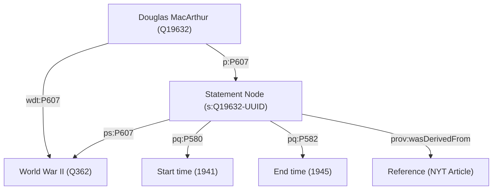

---
aliases:
- agha
- anaaʼ
- Awhàn
- bellum
- bresel
- brezel
- Cancwngh
- cenk
- Ch'axwa
- Chiàn-cheng
- chiến tranh
- Ciéng-cĕng
- cogadh
- Dagaalada
- Dgère
- Dgèrre
- digmaan
- doarro
- du᷆rnà
- dåaroe
- Etumba
- gera
- gerra
- Gerá
- Grieg
- gubat
- guera
- Guere
- guerra
- guerre
- Guèra
- Guèrra
- Herb
- Hondo
- háború
- Imfazwe
- Imnɣi
- impi
- jang
- karas
- karš
- kraig
- Kreech
- Krich
- Krieg
- Krig
- Kriich
- kurriba
- Kәriwu
- Lagè
- Lagèr
- Lufta
- Maqanakuy
- milito
- müharibə
- ngangayaw
- nkhondo
- Nyimpi
- Oarloch
- Ogun
- oorlog
- Parang
- peperangan
- Perang
- Perrang
- Polimu
- Porang
- rat
- rhyfel
- război
- savaş
- soahti
- soda
- sota
- Ssematalo
- stríð
- suáti
- Sõda
- tenpo utala
- Tɔbu
- Urush
- urıs
- Vaina
- Viera
- Vita
- vojna
- Vuere
- válka
- väinn
- Waar
- War
- wojna
- wójna
- yaƙi
- You
- Yudh
- Zwang
- Ñorairõ
- şer
- ɔko
- πόλεμος
- Вăрçă
- війна
- вайна
- војна
- воина
- война
- Дайн
- Къазауат
- ожгар
- Рагъ
- рат
- сар
- Согуш
- соғыс
- сугыш
- Сэрии
- ТIом
- торпинге
- Тыш
- тюрема
- ТӀом
- хæст
- ҷанг
- Һуғыш
- Պատերազմ
- מלחמה
- الجه
- جنگ
- جَنٛگ
- جګړه
- حرب
- ساواش
- شەڕ
- ܩܪܒܐ
- ߞߍ߬ߟߍ
- जुद्ध
- युद्ध
- युद्धम्
- संग्राम
- हताः
- যুদ্ধ
- ਜੰਗ
- યુદ્ધ
- ଯୁଦ୍ଧ
- போர்
- యుద్ధం|సంగ్రామం
- ಯುದ್ಧ
- യുദ്ധം
- යුද්ධය
- สงคราม
- ສົງຄາມ
- དམག་འཁྲུག
- စစ်
- သိုၵ်း
- ლჷმა
- ომი
- ጦርነት
- ᎠᏓᏃᏫ
- ᐊᑭᕋᖅᑑᑎᔪᑦ
- ᡩᠠᡳᠨ
- ṭṭrad
- 战争
- 戦争
- 戰爭
- 打仗
- 전쟁
- "\U00010345\U00010339\U00010332\U00010330\U0001033D"
has_id_wikidata: Q198
Archive_of_Our_Own_tag: War
associated_hazard:
- '[[_Standards/WikiData/WD~casualty,1056901]]'
- '[[_Standards/WikiData/WD~war_damage,3035596]]'
- '[[_Standards/WikiData/WD~uncertainty,13649246]]'
Colon_Classification: Y:438
Commons_category: War
described_by_source:
- '[[../../../../WikiData/WD~Brockhaus_and_Efron_Encyclopedic_Dictionary,602358]]'
- '[[_Standards/WikiData/WD~Encyclopædia_Britannica_11th_edition,867541]]'
- '[[_Standards/WikiData/WD~Bible_Encyclopedia_of_Archimandrite_Nicephorus,4086271]]'
- '[[_Standards/WikiData/WD~Sytin_Military_Encyclopedia,4114391]]'
- '[[_Standards/WikiData/WD~Jewish_Encyclopedia_of_Brockhaus_and_Efron,4173137]]'
- '[[_Standards/WikiData/WD~Small_Brockhaus_and_Efron_Encyclopedic_Dictionary,19180675]]'
- '[[_Standards/WikiData/WD~Meyers_Konversations-Lexikon,_4th_edition_(1885_1890),19219752]]'
- '[[_Standards/WikiData/WD~The_Domestic_Encyclopædia;_Or,_A_Dictionary_Of_Facts,_And_Useful_Knowledge,56441911]]'
- '[[_Standards/WikiData/WD~Metropolitan_Museum_of_Art_Tagging_Vocabulary,106727050]]'
Dewey_Decimal_Classification:
- 172.42
- 201.7273
- 303.66
- 355.02
different_from:
- '[[_Standards/WikiData/WD~fatherland,642555]]'
- '[[_Standards/WikiData/WD~mass_killing,56514238]]'
- '[[_Standards/WikiData/WD~violent_conflict,115431196]]'
distribution_map:
- http://commons.wikimedia.org/wiki/Special:FilePath/War%20world%20map%20-%20DALY%20-%20WHO2004.svg
- http://commons.wikimedia.org/wiki/Special:FilePath/War%20world%20map%20-%20Death%20-%20WHO2004.svg
handled_mitigated_or_managed_by:
- '[[_Standards/WikiData/WD~preventive_diplomacy,648683]]'
- '[[_Standards/WikiData/WD~anti-war_movement,794691]]'
- '[[_Standards/WikiData/WD~peacebuilding,2632158]]'
hashtag: wars
has_cause:
- '[[_Standards/WikiData/WD~casus_belli,45635]]'
- '[[_Standards/WikiData/WD~conflict_escalation,5160184]]'
has_characteristic: '[[_Standards/WikiData/WD~type_of_war,124867660]]'
has_effect: '[[_Standards/WikiData/WD~effects_of_war,3511052]]'
has_part_s_:
- '[[_Standards/WikiData/WD~battle,178561]]'
- '[[_Standards/WikiData/WD~war_phase,105370834]]'
history_of_topic: '[[_Standards/WikiData/WD~history_of_war,112575702]]'
IAB_code: 389
image:
- http://commons.wikimedia.org/wiki/Special:FilePath/Thure%20de%20Thulstrup%20-%20L.%20Prang%20and%20Co.%20-%20Battle%20of%20Gettysburg%20-%20Restoration%20by%20Adam%20Cuerden.jpg
- http://commons.wikimedia.org/wiki/Special:FilePath/History%20of%20war.png
instance_of:
- '[[_Standards/WikiData/WD~aspect_of_history,17524420]]'
- '[[_Standards/WikiData/WD~type_of_conflict,125092269]]'
IPTC_NewsCode: mediatopic/20000062
Krugosvet_article: istoriya/VONA.html
Library_of_Congress_Classification: JZ6378-JZ6405
Libris_URI: c9prqv9w0rr5l02
OmegaWiki_Defined_Meaning: 3990
opposite_of: '[[_Standards/WikiData/WD~peace,454]]'
participant: '[[_Standards/WikiData/WD~state,7275]]'
PhilPapers_topic: war
practiced_by:
- '[[_Standards/WikiData/WD~mercenary,178197]]'
- '[[_Standards/WikiData/WD~warrior,1250916]]'
- '[[_Standards/WikiData/WD~fictional_warrior,125887289]]'
- '[[_Standards/WikiData/WD~fictional_mercenary,125889411]]'
Provenio_UUID: fe40e8d6-efea-462e-9159-c685692f0532
schematic:
- http://commons.wikimedia.org/wiki/Special:FilePath/List%20of%20wars%20by%20death%20toll.jpg
- http://commons.wikimedia.org/wiki/Special:FilePath/War%20deaths%20caused%20by%20warfare.svg
- http://commons.wikimedia.org/wiki/Special:FilePath/War%20deaths%20caused%20by%20warfareMortsHommesGuerre.jpg
studied_in:
- '[[_Standards/WikiData/WD~military_history,192781]]'
- '[[_Standards/WikiData/WD~war_studies,1367522]]'
- '[[_Standards/WikiData/WD~Institute_for_the_Study_of_War,6039802]]'
- '[[_Standards/WikiData/WD~sociology_of_peace,_war,_and_social_conflict,7552857]]'
- '[[_Standards/WikiData/WD~peace_and_conflict_studies,15820293]]'
subclass_of:
- '[[_Standards/WikiData/WD~armed_conflict,350604]]'
- '[[_Standards/WikiData/WD~occurrence,1190554]]'
- '[[_Standards/WikiData/WD~social_issue,1920219]]'
- '[[_Standards/WikiData/WD~era,6428674]]'
- '[[_Standards/WikiData/WD~group_conflict,17091170]]'
- '[[_Standards/WikiData/WD~military_activity,68482296]]'
topic_s_main_template:
- '[[_Standards/WikiData/WD~Template_War,13479477]]'
- '[[_Standards/WikiData/WD~Q19410114,19410114]]'
topic_s_main_Wikimedia_portal: '[[_Standards/WikiData/WD~Q108629336,108629336]]'
union_of: '[[_Standards/WikiData/WD~list_of_values_as_qualifiers,23766486]]'
U_S_National_Archives_Identifier: 10642341
Wikidata_property: conflict
dv_has_:
  name_:
    aeb_arab: حرب
    af: oorlog
    am: ጦርነት
    an: Guerra
    anp: युद्ध
    ar: حرب
    arc: ܩܪܒܐ
    arq: حرب
    ary: حرب
    arz: حرب
    as: যুদ্ধ
    ast: guerra
    av: Рагъ
    ay: Ch'axwa
    az: müharibə
    azb: ساواش
    ba: Һуғыш
    be: вайна
    be_tarask: вайна
    bg: война
    bho: जुद्ध
    bn: যুদ্ধ
    bo: དམག་འཁྲུག
    br: brezel
    brh: jang
    bs: rat
    btm: Porang
    bxr: Дайн
    ca: guerra
    cdo: Ciéng-cĕng
    ce: ТӀом
    ceb: Gubat
    ch: Gera
    chr: ᎠᏓᏃᏫ
    ckb: شەڕ
    crh: cenk
    cs: válka
    cu: воина
    cv: Вăрçă
    cy: rhyfel
    da: krig
    dag: Tɔbu
    de: Krieg
    diq: Herb
    dsb: wójna
    el: πόλεμος
    en: war
    eo: milito
    es: guerra
    et: sõda
    eu: gerra
    ext: Guerra
    fa: جنگ
    fi: sota
    fr: guerre
    frp: Guèrra
    frr: Kriich
    fur: Vuere
    fy: Oarloch
    ga: cogadh
    gan: 打仗
    gcr: Lagèr
    gd: cogadh
    gl: guerra
    glk: جنگ
    gn: Ñorairõ
    got: "\U00010345\U00010339\U00010332\U00010330\U0001033D"
    grc: πόλεμος
    gsw: Krieg
    gu: યુદ્ધ
    guw: Awhàn
    ha: yaƙi
    he: מלחמה
    hi: संग्राम
    hif: Yudh
    hr: rat
    hsb: wójna
    ht: Lagè
    hu: háború
    hy: պատերազմ
    hyw: Պատերազմ
    ia: guerra
    id: perang
    ie: Guerre
    ig: agha
    ilo: gubat
    inh: ТIом
    io: Milito
    is: stríð
    it: guerra
    iu: ᐊᑭᕋᖅᑑᑎᔪᑦ
    ja: 戦争
    jam: Waar
    jv: Perang
    ka: ომი
    kaa: urıs
    kab: ṭṭrad
    kbp: You
    kcg: Zwang
    kg: Vita
    kk: соғыс
    kn: ಯುದ್ಧ
    knc: Kәriwu
    ko: 전쟁
    ko-kp: 전쟁
    krc: Къазауат
    ks: جَنٛگ
    ksh: Kreech
    ku: şer
    ku_latn: şer
    kv: Тыш
    kw: bresel
    ky: Согуш
    la: bellum
    lb: Krich
    lg: Ssematalo
    li: Krieg
    lld: Viera
    lmo: Guerra
    ln: Etumba
    lo: ສົງຄາມ
    lt: karas
    lv: karš
    mad: Perrang
    map_bms: Perang
    mcn: du᷆rnà
    mdf: торпинге
    mhr: сар
    min: Parang
    mk: војна
    ml: യുദ്ധം
    mn: Дайн
    mnc: ᡩᠠᡳᠨ
    mr: युद्ध
    ms: peperangan
    mwl: Guerra
    my: စစ်
    myv: тюрема
    mzn: الجه
    nan: Chiàn-cheng
    nb: krig
    nds: Krieg
    nds_nl: kraig
    ne: युद्ध
    new: हताः
    nl: oorlog
    nn: krig
    nqo: ߞߍ߬ߟߍ
    nrm: Dgèrre
    nv: anaaʼ
    ny: nkhondo
    oc: Guèrra
    or: ଯୁଦ୍ଧ
    os: хæст
    pa: ਜੰਗ
    pam: gera
    pap: guera
    pcd: Dgère
    pdc: Grieg
    pl: wojna
    pms: Guèra
    pnb: جنگ
    ps: جګړه
    pt: guerra
    pt_br: guerra
    qu: Maqanakuy
    rmf: kurriba
    ro: război
    ru: война
    rue: Война
    rup: Polimu
    sa: युद्धम्
    sah: Сэрии
    scn: Guerra
    sco: war
    sd: جنگ
    se: soahti
    sgs: Vaina
    sh: rat
    shi: Imnɣi
    shn: သိုၵ်း
    si: යුද්ධය
    sk: vojna
    skr: جنگ
    sl: vojna
    sma: dåaroe
    smj: doarro
    smn: suáti
    sms: väinn
    sn: Hondo
    so: Dagaalada
    sq: Lufta
    sr: рат
    sr_ec: рат
    sr_el: rat
    su: Perang
    sv: krig
    sw: Vita
    szl: wojna
    szy: ngangayaw
    ta: போர்
    te: యుద్ధం|సంగ్రామం
    tg: ҷанг
    th: สงคราม
    tl: digmaan
    tok: tenpo utala
    tr: savaş
    ts: Nyimpi
    tt: сугыш
    tt_cyrl: сугыш
    tw: ɔko
    udm: ожгар
    uk: війна
    ur: جنگ
    uz: Urush
    vec: guera
    vep: soda
    vi: chiến tranh
    vo: Krig
    vro: Sõda
    wa: Guere
    war: Gerá
    wuu: 打仗
    xh: Imfazwe
    xmf: ლჷმა
    yi: מלחמה
    yo: Ogun
    yue: 打仗
    za: Cancwngh
    zh: 戰爭
    zh_cn: 战争
    zh_hans: 战争
    zh_hant: 戰爭
    zh_hk: 戰爭
    zh_mo: 戰爭
    zh-my: 战争
    zh_sg: 战争
    zh_tw: 戰爭
    zu: impi
---

# [[War]] 

#is_/same_as :: [[../../../../WikiData/WD~War,198|WD~War,198]] 

## #has_/text_of_/abstract 

> **War** is an armed conflict between the armed forces of states, or between governmental forces and armed groups that are organized under a certain command structure and have the capacity to sustain military operations, or between such organized groups. It is generally characterized by widespread violence, destruction, and mortality, using regular or irregular military forces. Warfare refers to the common activities and characteristics of types of war, or of wars in general. Total war is warfare that is not restricted to purely legitimate military targets, and can result in massive civilian or other non-combatant suffering and casualties.
>
> While some war studies scholars consider war a universal and ancestral aspect of human nature, others argue it is a result of specific socio-cultural, economic, or ecological circumstances.
>
> [Wikipedia](https://en.wikipedia.org/wiki/War) 

## Confidential Links & Embeds: 

### #is_/same_as :: [[War|War]] 

### #is_/same_as :: [[/_public/Society/Military/Military_Operation/Combat/War.public|War.public]] 

### #is_/same_as :: [[/_internal/Society/Military/Military_Operation/Combat/War.internal|War.internal]] 

### #is_/same_as :: [[/_protect/Society/Military/Military_Operation/Combat/War.protect|War.protect]] 

### #is_/same_as :: [[/_private/Society/Military/Military_Operation/Combat/War.private|War.private]] 

### #is_/same_as :: [[/_personal/Society/Military/Military_Operation/Combat/War.personal|War.personal]] 

### #is_/same_as :: [[/_secret/Society/Military/Military_Operation/Combat/War.secret|War.secret]] 

