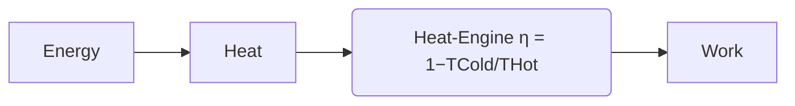

---
aliases:
  - Heat Engine
has_id_wikidata: Q178185
product_or_material_produced: "[[_Standards/WikiData/WD~mechanical_energy,184550]]"
made_from_material: "[[_Standards/WikiData/WD~thermal_energy,209233]]"
subclass_of:
  - "[[_Standards/WikiData/WD~thermodynamic_system,503327]]"
  - "[[_Standards/WikiData/WD~power_engine,18762500]]"
  - "[[_Standards/WikiData/WD~engine,44167]]"
topic_has_template: "[[_Standards/WikiData/WD~Template_Heat_engines,8084301]]"
has_goal: "[[_Standards/WikiData/WD~energy_transformation,11271324]]"
studied_by: "[[_Standards/WikiData/WD~thermodynamics,11473]]"
image:
  - http://commons.wikimedia.org/wiki/Special:FilePath/Energiebilanz%20Motor.svg
  - http://commons.wikimedia.org/wiki/Special:FilePath/Heat%20engine.png
Wolfram_Language_entity_code: Entity["Concept", "HeatEngine::d5c8k"]
Commons_category: Heat engines
Krugosvet_article: nauka_i_tehnika/tehnologiya_i_promyshlennost/DVIGATEL_TEPLOVO.html
---

# [[Heat_Engine]] 

#is_/same_as :: [[../../WikiData/WD~Heat_engine,178185|WD~Heat_engine,178185]] 

Heat Engines are bounded by the **Carnot efficiency**: η = 1 − TCold / THot 
Steam Turbines (Peak 47%) or internal Combustion Engines (Peak 45%) 
 are less efficient than Gas Turbines (Peak 62%) and using the Heat adds another 20%. 
Their advantage is that all other Forms of Energy can be converted to Heat, 
but direct conversion to Work e.g. via electrochemical cell would be more efficient. 

better are Fuel-Cells: 

## #has_/text_of_/abstract 

> A **Heat Engine** is a system that transfers thermal energy to do mechanical or electrical work. 
> 
> While originally conceived in the context of mechanical energy, 
> the concept of the heat engine has been applied to various other kinds of energy, 
> particularly electrical, since at least the late 19th century. 
> 
> The heat engine does this by bringing a working substance from a higher state temperature 
> to a lower state temperature. 
> 
> A heat source generates thermal energy 
> that brings the working substance to the higher temperature state. 
> 
> The working substance generates work in the working body of the engine 
> while transferring heat to the colder sink until it reaches a lower temperature state. 
> 
> During this process some of the thermal energy is converted into work 
> by exploiting the properties of the working substance. 
> The working substance can be any system with a non-zero heat capacity, 
> but it usually is a gas or liquid. 
> 
> During this process, some heat is normally lost to the surroundings and is not converted to work. 
> Also, some energy is unusable because of friction and drag.
>
> In general, an [[../Mechanical_Engineering/Engine|Engine]] is any machine that converts Energy to mechanical Work. 
> 
> Heat engines distinguish themselves from other types of engines by the fact 
> that their efficiency is fundamentally limited by Carnot's theorem of thermodynamics. 
> Although this efficiency limitation can be a drawback, 
> an advantage of heat engines is that most forms of energy can be easily converted to heat 
> by processes like exothermic reactions (such as combustion), nuclear fission, 
> absorption of light or energetic particles, friction, dissipation and resistance. 
> 
> Since the heat source that supplies thermal energy to the engine 
> can thus be powered by virtually any kind of energy, 
> heat engines cover a wide range of applications.
>
> Heat engines are often confused with the cycles they attempt to implement. 
> Typically, the term "engine" is used for a physical device and "cycle" for the models.
>
> [Wikipedia](https://en.wikipedia.org/wiki/Heat%20engine) 

