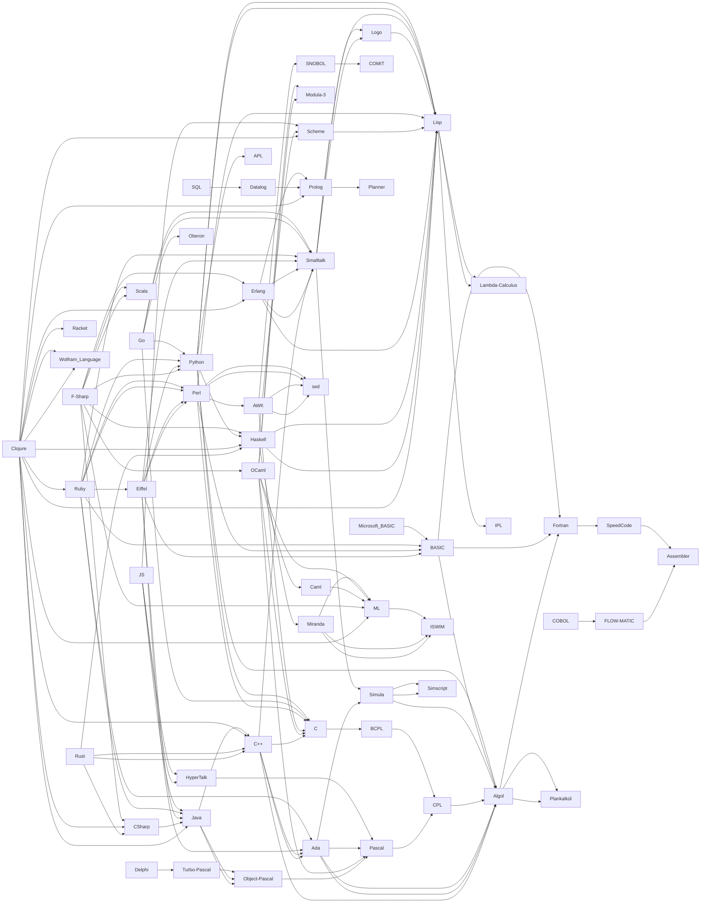

# [[Prog~Language]] 

#is_/same_as :: 

## #has_/text_of_/abstract 

> A programming language is a system of notation for writing computer programs.
>
> A programming language is usually described in terms of its syntax (form) and semantics (meaning). 
> These are usually defined by a formal language. 
> A language usually has at least one implementation in the form of a compiler or interpreter, 
> allowing programs written in the language to be executed.
>
> Programming language theory is the subfield of computer science that studies the design, 
> implementation, analysis, characterization, and classification of programming languages.
>
> [Wikipedia](https://en.wikipedia.org/wiki/Programming%20language)

## Runtime Paradigms 

| Language        | typed        | untyped              |
| --------------- | ------------ | -------------------- |
| __unmanaged__   | C, C++, Rust | Assembler, Forth     |
| __JIT__         | Java, C#     | Forth, LUA           |
| __managed__     | Java, C#     | JavaScript, .NET DLR |
| __interpreted__ | Python       | Basic                |

## Grammar Paradigms 

[[Prog~Language/Prog~Structured|Prog~Structured]], [[Prog~Language/Prog~Functional|Prog~Functional]] , [[Prog~Language/Prog~OO|Prog~OO]] , [[Prog~Language/Prog~Logic|Prog~Logic]] 
As of 2010, most Programming-Languages support multiple Paradigms, 
so you can choose and mix Approaches 
without having to interface between different Runtimes or even Languages. 
Web-Services allow to interface, but have a big Overhead. 
The Difference between managed Languages like Java and C# and unmanaged Languages like C,C++ and Rust is 
that the Runtime manages Memory and also JIT Operation, enabling **JIT optimizations** and **inlining**. 

Unmanaged Languages run directly on the Hardware are preferred for OS (Linux, Windows), 
because they have the least Overhead. 


## Language-Ancestry 

This Table as well as the Graph below are dynamically generated 
from distributed Links in the Documents of this Folder. 

```dataview 

table has_parent, dateformat(has_time_started, "yyyy-MM-dd") as date 
from #is_a_/computer_language  
sort has_time_started 

```

## Graph 





## All Contents

```folderv
```

```ccard
type: folder_brief_live
style : card
col: 2
briefMax: 128
noteOnly: true
```


