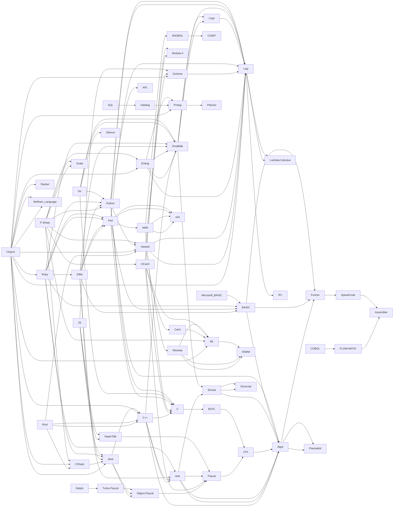

---
ArchWiki_article:
- Programming_languages
- Programming_languages_(Español)
Commons_category: "Programming languages"
different_from:
- '[[_Standards/WikiData/WD~hardware_description_language,173341]]'
- '[[_Standards/WikiData/WD~pseudocode,189224]]'
- '[[_Standards/WikiData/WD~computer_language,629206]]'
- '[[_Standards/WikiData/WD~implementation_of_a_programming_language,4117406]]'
EntitySchema_for_this_class: E55
equivalent_class: "http://dbpedia.org/ontology/ProgrammingLanguage"
has_characteristic:
- '[[_Standards/WikiData/WD~case_sensitivity_(two_options),55121384]]'
- '[[_Standards/WikiData/WD~type_of_programming_language,116481801]]'
has_id_wikidata: Q9143
has_list:
- '[[_Standards/WikiData/WD~list_of_programming_languages_by_type,389085]]'
- '[[_Standards/WikiData/WD~list_of_programming_languages,11707952]]'
has_part_s_:
- '[[_Standards/WikiData/WD~type_system,865760]]'
- '[[_Standards/WikiData/WD~syntax,1152399]]'
- '[[_Standards/WikiData/WD~standard_library,1199356]]'
- '[[_Standards/WikiData/WD~execution_model,25346349]]'
has_use: '[[_Standards/WikiData/WD~computer_programming,80006]]'
history_of_topic:
- '[[_Standards/WikiData/WD~timeline_of_programming_languages,186936]]'
- '[[_Standards/WikiData/WD~history_of_programming_languages,1068652]]'
IAB_code: 631
IEV_number: 171-05-10
image: "http://commons.wikimedia.org/wiki/Special:FilePath/C%20Hello%20World%20Program.png"
instance_of: '[[_Standards/WikiData/WD~computer_science_term,66747126]]'
maintained_by_WikiProject: '[[_Standards/WikiData/WD~WikiProject_Computer_Science,6526225]]'
manifestation_of: '[[_Standards/WikiData/WD~programming_paradigm,188267]]'
OmegaWiki_Defined_Meaning: 488500
part_of: '[[_Standards/WikiData/WD~computer,68]]'
properties_for_this_type:
- "copyright license"
- "designed by"
- "operating system"
- "software version identifier"
- "has part(s)"
- inception
- "influenced by"
- mascot
- "official website"
- "file extension"
- "source code repository URL"
- "issue tracker URL"
- "topic's main template"
- "Stack Exchange tag"
- "IRC channel URL"
- "name in kana"
- "history of topic"
- hashtag
- "software quality assurance"
- "programming paradigm"
- "typing discipline"
- "dialect of computer language"
- "official forum URL"
- "official demo URL"
- image
- "discoverer or inventor"
- "named after"
- "based on"
- "logo image"
- developer
small_logo_or_icon: "http://commons.wikimedia.org/wiki/Special:FilePath/OOjs%20UI%20icon%20markup.svg"
Stack_Exchange_tag: "https://stackoverflow.com/tags/programming-languages"
subclass_of: '[[_Standards/WikiData/WD~computer_language,629206]]'
subreddit: ProgrammingLanguages
topic_s_main_template:
- '[[_Standards/WikiData/WD~Template_Infobox_programming_language,6459089]]'
- '[[_Standards/WikiData/WD~Template_Programming_languages,7480464]]'
Wikidata_property:
- "programmed in"
- "supports programming language"
- "implementation of"
Wolfram_Language_entity_type: ProgrammingLanguage
---

# [[Programming_Language]] 
# [[Prog~Language]] 

#is_/different_from :: [[../../Data/Data_Language|Data_Language]] 
#is_/same_as :: [[../../../../WikiData/WD~Programming_language,9143|WD~Programming_language,9143]] 

## #has_/text_of_/abstract 

> A **Programming language** is a system of notation for writing computer programs.
>
> A programming language is usually described in terms of its syntax (form) and semantics (meaning). 
> These are usually defined by a formal language. 
> A language usually has at least one implementation in the form of a compiler or interpreter, 
> allowing programs written in the language to be executed.
>
> Programming language theory is the subfield of computer science that studies the design, 
> implementation, analysis, characterization, and classification of programming languages.
>
> [Wikipedia](https://en.wikipedia.org/wiki/Programming%20language) 

## Runtime Paradigms 


| Language        | typed        | untyped              |
| --------------- | ------------ | -------------------- |
| __unmanaged__   | C, C++, Rust | Assembler, Forth     |
| __JIT__         | Java, C#     | Forth, LUA           |
| __managed__     | Java, C#     | JavaScript, .NET DLR |
| __interpreted__ | Python       | Basic                |

## Grammar Paradigms 

[[Prog~Language/Prog~Structured|Prog~Structured]], [[Prog~Language/Prog~Functional|Prog~Functional]] , [[Prog~Language/Prog~OO|Prog~OO]] , [[Prog~Language/Prog~Logic|Prog~Logic]] 
As of 2010, most Programming-Languages support multiple Paradigms, 
so you can choose and mix Approaches 
without having to interface between different Runtimes or even Languages. 
Web-Services allow to interface, but have a big Overhead. 
The Difference between managed Languages like Java and C# and unmanaged Languages like C,C++ and Rust is 
that the Runtime manages Memory and also JIT Operation, enabling **JIT optimizations** and **inlining**. 

Unmanaged Languages run directly on the Hardware are preferred for OS (Linux, Windows), 
because they have the least Overhead. 


## Language-Ancestry 

This Table as well as the Graph below are dynamically generated 
from distributed Links in the Documents of this Folder. 

```dataview 

table has_parent, dateformat(has_time_started, "yyyy-MM-dd") as date 
from #is_a_/computer_language  
sort has_time_started 

```

## Graph 





## All Contents

```folderv
```

```ccard
type: folder_brief_live
style : card
col: 2
briefMax: 128
noteOnly: true
```


## Confidential Links & Embeds: 

### #is_/same_as :: [Programming_Language](/_Standards/Technology/IT/Software/Programming_Language.md) 

### #is_/same_as :: [Programming_Language.public](/_public/Technology/IT/Software/Programming_Language.public.md) 

### #is_/same_as :: [Programming_Language.internal](/_internal/Technology/IT/Software/Programming_Language.internal.md) 

### #is_/same_as :: [Programming_Language.protect](/_protect/Technology/IT/Software/Programming_Language.protect.md) 

### #is_/same_as :: [Programming_Language.private](/_private/Technology/IT/Software/Programming_Language.private.md) 

### #is_/same_as :: [Programming_Language.personal](/_personal/Technology/IT/Software/Programming_Language.personal.md) 

### #is_/same_as :: [Programming_Language.secret](/_secret/Technology/IT/Software/Programming_Language.secret.md)

