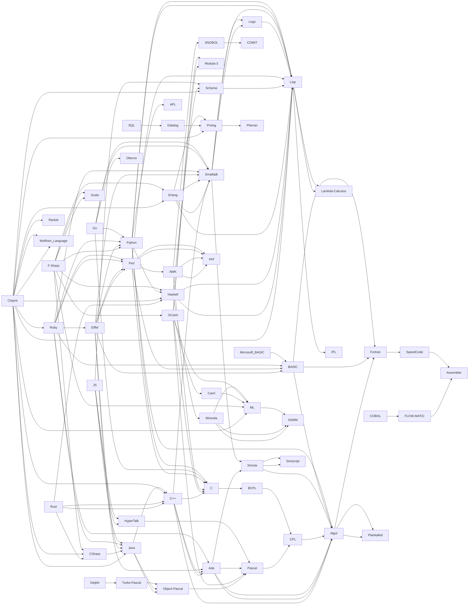

---
aliases:
- bahasa pemrograman
- bahasa pengaturcaraan
- Bahaso pamrograman
- basa pamrograman
- basa program
- Chiyowoyero cha vilayizgo
- cànan prògramaidh
- forritunarmál
- fрограмчлалын хэл
- gjuhë programimi
- gŏdka programowaniŏ
- iaith raglennu
- język programowania
- langage de programmation
- lengage ëd programassion
- Lengatge de programacion
- lengguahe ti panangprograma
- lengua de prugramazion
- Lenguagi de pogramación
- lenguaje de programación
- lenguajo de programasion
- limbaj de programare
- limbàgiu de programmatzione
- Lingua programmandi
- linguage de programmation
- linguagem de programação
- linguaggio di programmazione
- linguaggiu di prugrammazzioni
- linguaxe de programación
- lingue de programmation
- llenguatge de programació
- llinguaxe de programación
- luengache de programación
- lugha ya programu
- ngôn ngữ lập trình
- ohjelmistemkielâ
- ohjelmointikieli
- pinulongan hin programa
- piĕng-tiàng ngṳ̄-ngiòng
- programavimo kalba
- programazio-lengoaia
- Programiarspriak
- programifo-lingui
- programing
- programlama dili
- programlingvo
- programma tili
- programmalash tili
- programmalastırıw tili
- programmeerimiskeel
- Programmeerspraak
- programmeertaal
- programmerengiella
- programmeringssprog
- programmeringsspråk
- Programmiasproch
- Programmiersprache
- Programmiersprooch
- programmin leid
- programming language
- programmâʹsttemǩiõll
- Programméiersprooch
- programmēšanas valoda
- programovací jazyk
- programozási nyelv
- programski jezik
- programěrowanske rěče
- Prog~Language
- Projrameerschprooch
- proqramlaşdırma dili
- pruogramavėma kalba
- samplabau
- teanga ríomhchlárúcháin
- thêng-sek gí-giân
- toki ilo
- tutlayt n usihel
- Ulimi lokuhlelelisa
- vosa parokaramu
- Wakichiy simi
- wikang pamprograma
- yezh programmiñ
- zimanê bernamekirinê
- zıwanê programnayışi
- Èdè Ìṣèlànà Kọ̀mpútà
- γλώσσα προγραμματισμού
- бағдарламалау тілі
- дenguaige de porgramaçon
- език за програмиране
- Забони барномасозӣ
- компьютер чĕлхи
- мова праграмавання
- мова праграмаваньня
- мова програмування
- програмлау теле
- программæтæ аразыны æвзаг
- программалааhын тыла
- программалау теле
- программалоо тили
- программированилэн кылыз
- программированин мотт
- программлымаш йылме
- програмски јазик
- програмски језик
- язык программирования
- язык проґрамованя
- ծրագրավորման լեզու
- פראגראמירן שפראך
- שפת תכנות
- برېښليک ژبه
- زبانهای برنامهنویسی
- زمانی بەرنامەسازی
- لغة برمجة
- لغة برمجه
- لونڭاج
- پروگرامما تىلى
- پروگرامنگ زبان
- کمپیوٹر بولی
- یازیلیملاما دیلی
- ߢߍߥߟߊߦߊߟߌ߫ ߞߊ߲
- कम्प्युटर भाषा
- क्रमादेशनभाषा
- प्रोग्रामिंग भाषा
- प्रोग्रामिङ भाषा
- प्रोग्रॅमिंग भाषा
- প্রোগ্রামিং ভাষা
- ਪ੍ਰੋਗਰਾਮਿੰਗ ਭਾਸ਼ਾ
- நிரல் மொழி
- ప్రోగ్రామింగు భాష
- പ്രോഗ്രാമിംഗ് ഭാഷ
- ක්රමලේඛන භාෂා
- ภาษาโปรแกรม
- ພາສາໂປຣແກຣມ
- ပရိုဂရမ်မင်းဘာသာစကား
- ပရိုဂရမ်မိဉ်းဘာႏသာႏငေါဝ်းငွါ
- პროგრამირაფაშ ნინა
- პროგრამირების ენა
- የፕሮግራም ቋንቋ
- ភាសាកម្មវិធី
- ᨅᨔ ᨄᨆᨚᨁᨛᨑᨆ
- プログラミング言語
- 程式語言
- 編程語言
- 编程语言
- 프로그래밍 언어
has_id_wikidata: Q9143
ArchWiki_article:
- Programming_languages
- Programming_languages_(Español)
- Programming language
Commons_category: Programming languages
different_from:
- '[[_Standards/WikiData/WD~hardware_description_language,173341]]'
- '[[_Standards/WikiData/WD~pseudocode,189224]]'
- '[[_Standards/WikiData/WD~computer_language,629206]]'
- '[[_Standards/WikiData/WD~implementation_of_a_programming_language,4117406]]'
EntitySchema_for_this_class: E55
equivalent_class: http://dbpedia.org/ontology/ProgrammingLanguage
has_characteristic:
- '[[_Standards/WikiData/WD~case_sensitivity_(two_options),55121384]]'
- '[[_Standards/WikiData/WD~type_of_programming_language,116481801]]'
has_list:
- '[[_Standards/WikiData/WD~list_of_programming_languages_by_type,389085]]'
- '[[_Standards/WikiData/WD~list_of_programming_languages,11707952]]'
has_part_s_:
- '[[_Standards/WikiData/WD~type_system,865760]]'
- '[[_Standards/WikiData/WD~syntax,1152399]]'
- '[[_Standards/WikiData/WD~standard_library,1199356]]'
- '[[_Standards/WikiData/WD~execution_model,25346349]]'
has_use: '[[_Standards/WikiData/WD~computer_programming,80006]]'
history_of_topic:
- '[[_Standards/WikiData/WD~timeline_of_programming_languages,186936]]'
- '[[_Standards/WikiData/WD~history_of_programming_languages,1068652]]'
IAB_code: 631
IEV_number: 171-05-10
image: http://commons.wikimedia.org/wiki/Special:FilePath/C%20Hello%20World%20Program.png
instance_of: '[[_Standards/WikiData/WD~computer_science_term,66747126]]'
maintained_by_WikiProject: '[[_Standards/WikiData/WD~WikiProject_Computer_Science,6526225]]'
manifestation_of: '[[_Standards/WikiData/WD~programming_paradigm,188267]]'
OmegaWiki_Defined_Meaning: 488500
part_of: '[[_Standards/WikiData/WD~computer,68]]'
properties_for_this_type:
- copyright license
- designed by
- operating system
- software version identifier
- has part(s)
- inception
- influenced by
- mascot
- official website
- file extension
- source code repository URL
- issue tracker URL
- topic's main template
- Stack Exchange tag
- IRC channel URL
- name in kana
- history of topic
- hashtag
- software quality assurance
- programming paradigm
- typing discipline
- dialect of computer language
- official forum URL
- official demo URL
- image
- discoverer or inventor
- named after
- based on
- logo image
- developer
small_logo_or_icon: http://commons.wikimedia.org/wiki/Special:FilePath/OOjs%20UI%20icon%20markup.svg
Stack_Exchange_tag: https://stackoverflow.com/tags/programming-languages
subclass_of: '[[_Standards/WikiData/WD~computer_language,629206]]'
subreddit: ProgrammingLanguages
topic_s_main_template:
- '[[_Standards/WikiData/WD~Template_Infobox_programming_language,6459089]]'
- '[[_Standards/WikiData/WD~Template_Programming_languages,7480464]]'
Wikidata_property:
- programmed in
- supports programming language
- implementation of
Wolfram_Language_entity_type: ProgrammingLanguage
dv_has_:
  name_:
    af: programmeertaal
    am: የፕሮግራም ቋንቋ
    an: luengache de programación
    anp: प्रोग्रामिंग भाषा
    ar: لغة برمجة
    ary: لونڭاج
    arz: لغة برمجه
    as: প্রোগ্রামিং ভাষা
    ast: llinguaxe de programación
    az: proqramlaşdırma dili
    azb: یازیلیملاما دیلی
    ba: программалау теле
    bar: Programmiasproch
    be: мова праграмавання
    be_tarask: мова праграмаваньня
    bg: език за програмиране
    bho: प्रोग्रामिंग भाषा
    blk: ပရိုဂရမ်မိဉ်းဘာႏသာႏငေါဝ်းငွါ
    bn: প্রোগ্রামিং ভাষা
    br: yezh programmiñ
    bs: programski jezik
    bug: ᨅᨔ ᨄᨆᨚᨁᨛᨑᨆ
    ca: llenguatge de programació
    cdo: piĕng-tiàng ngṳ̄-ngiòng
    ce: программированин мотт
    ckb: زمانی بەرنامەسازی
    crh: programma tili
    cs: programovací jazyk
    cv: компьютер чĕлхи
    cy: iaith raglennu
    da: programmeringssprog
    de: Programmiersprache
    de_ch: Programmiersprache
    diq: zıwanê programnayışi
    el: γλώσσα προγραμματισμού
    en: programming language
    en_ca: programming language
    en_gb: programming language
    eo: programlingvo
    es: lenguaje de programación
    et: programmeerimiskeel
    eu: programazio-lengoaia
    ext: Lenguagi de pogramación
    fa: زبانهای برنامهنویسی
    fi: ohjelmointikieli
    fj: vosa parokaramu
    fr: langage de programmation
    frr: Programiarspriak
    ga: teanga ríomhchlárúcháin
    gd: cànan prògramaidh
    gl: linguaxe de programación
    gsw: Programmiersprooch
    he: שפת תכנות
    hi: प्रोग्रामिंग भाषा
    hif: programming language
    hr: programski jezik
    hsb: programěrowanske rěče
    hu: programozási nyelv
    hy: ծրագրավորման լեզու
    ia: linguage de programmation
    id: bahasa pemrograman
    ie: lingue de programmation
    ilo: lengguahe ti panangprograma
    io: programifo-lingui
    is: forritunarmál
    it: linguaggio di programmazione
    ja: プログラミング言語
    jbo: samplabau
    jv: basa pamrograman
    ka: პროგრამირების ენა
    kaa: programmalastırıw tili
    kab: tutlayt n usihel
    kk: бағдарламалау тілі
    km: ភាសាកម្មវិធី
    ko: 프로그래밍 언어
    ksh: Projrameerschprooch
    ku: zimanê bernamekirinê
    ky: программалоо тили
    la: Lingua programmandi
    lb: Programméiersprooch
    lmo: lengua de prugramazion
    lo: ພາສາໂປຣແກຣມ
    lt: programavimo kalba
    lv: programmēšanas valoda
    lzh: 編程語言
    mag: क्रमादेशनभाषा
    mhr: программлымаш йылме
    min: Bahaso pamrograman
    mk: програмски јазик
    ml: പ്രോഗ്രാമിംഗ് ഭാഷ
    mn: fрограмчлалын хэл
    mr: प्रोग्रॅमिंग भाषा
    ms: bahasa pengaturcaraan
    mwl: дenguaige de porgramaçon
    my: ပရိုဂရမ်မင်းဘာသာစကား
    nan: thêng-sek gí-giân
    nb: programmeringsspråk
    nds: Programmeerspraak
    ne: कम्प्युटर भाषा
    new: प्रोग्रामिङ भाषा
    nl: programmeertaal
    nn: programmeringsspråk
    nqo: ߢߍߥߟߊߦߊߟߌ߫ ߞߊ߲
    oc: Lengatge de programacion
    os: программæтæ аразыны æвзаг
    pa: ਪ੍ਰੋਗਰਾਮਿੰਗ ਭਾਸ਼ਾ
    pl: język programowania
    pms: lengage ëd programassion
    pnb: کمپیوٹر بولی
    ps: برېښليک ژبه
    pt: linguagem de programação
    pt_br: linguagem de programação
    qu: Wakichiy simi
    ro: limbaj de programare
    ru: язык программирования
    rue: язык проґрамованя
    sah: программалааhын тыла
    sc: limbàgiu de programmatzione
    scn: linguaggiu di prugrammazzioni
    sco: programmin leid
    se: programmerengiella
    sgs: pruogramavėma kalba
    sh: programski jezik
    shn: programming language
    si: ක්රමලේඛන භාෂා
    sk: programovací jazyk
    sl: programski jezik
    smn: ohjelmistemkielâ
    sms: programmâʹsttemǩiõll
    sq: gjuhë programimi
    sr: програмски језик
    sr_ec: програмски језик
    sr_el: programski jezik
    su: basa program
    sv: programmeringsspråk
    sw: lugha ya programu
    szl: gŏdka programowaniŏ
    ta: நிரல் மொழி
    te: ప్రోగ్రామింగు భాష
    tet: programing
    tg: Забони барномасозӣ
    th: ภาษาโปรแกรม
    tl: wikang pamprograma
    tok: toki ilo
    tr: programlama dili
    tt: програмлау теле
    tt_cyrl: програмлау теле
    tum: Chiyowoyero cha vilayizgo
    udm: программированилэн кылыз
    ug: پروگرامما تىلى
    uk: мова програмування
    ur: پروگرامنگ زبان
    uz: programmalash tili
    vec: lenguajo de programasion
    vi: ngôn ngữ lập trình
    war: pinulongan hin programa
    wuu: 编程语言
    xmf: პროგრამირაფაშ ნინა
    yi: פראגראמירן שפראך
    yo: Èdè Ìṣèlànà Kọ̀mpútà
    yue: 程式語言
    zh: 编程语言
    zh_cn: 编程语言
    zh_hans: 编程语言
    zh_hant: 程式語言
    zh_hk: 程式語言
    zh_mo: 程式語言
    zh-my: 编程语言
    zh_sg: 编程语言
    zh_tw: 程式語言
    zu: Ulimi lokuhlelelisa
---

# [[Prog~Language]] 

#is_/different_from :: [[../../Data/Data_Language|Data_Language]] 
#is_/same_as :: [[../../../../WikiData/WD~Programming_language,9143|WD~Programming_language,9143]] 

## #has_/text_of_/abstract 

> A **Programming language** is a system of notation for writing computer programs.
>
> A programming language is usually described in terms of its syntax (form) and semantics (meaning). 
> These are usually defined by a formal language. 
> A language usually has at least one implementation in the form of a compiler or interpreter, 
> allowing programs written in the language to be executed.
>
> Programming language theory is the subfield of computer science that studies the design, 
> implementation, analysis, characterization, and classification of programming languages.
>
> [Wikipedia](https://en.wikipedia.org/wiki/Programming%20language) 


## Runtime Paradigms 

| Language        | typed        | untyped              |
| --------------- | ------------ | -------------------- |
| __unmanaged__   | C, C++, Rust | Assembler, Forth     |
| __JIT__         | Java, C#     | Forth, LUA           |
| __managed__     | Java, C#     | JavaScript, .NET DLR |
| __interpreted__ | Python       | Basic                |

## Grammar Paradigms 

[[Prog~Language/Prog~Paradigm/Prog~Structured|Prog~Structured]], [[Prog~Language/Prog~Paradigm/Prog~Functional|Prog~Functional]] , [[Prog~Language/Prog~Paradigm/Prog~OO|Prog~OO]] , [[Prog~Language/Prog~Paradigm/Prog~Logic|Prog~Logic]] 
As of 2010, most Programming-Languages support multiple Paradigms, 
so you can choose and mix Approaches 
without having to interface between different Runtimes or even Languages. 
Web-Services allow to interface, but have a big Overhead. 
The Difference between managed Languages like Java and C# and unmanaged Languages like C,C++ and Rust is 
that the Runtime manages Memory and also JIT Operation, enabling **JIT optimizations** and **inlining**. 

Unmanaged Languages run directly on the Hardware are preferred for OS (Linux, Windows), 
because they have the least Overhead. 


## Language-Ancestry 

This Table as well as the Graph below are dynamically generated 
from distributed Links in the Documents of this Folder. 

```dataview 

table has_parent, dateformat(has_time_started, "yyyy-MM-dd") as date 
from #is_a_/computer_language  
sort has_time_started 

```

## Graph 





## All Contents

```folderv
```

```ccard
type: folder_brief_live
style : card
col: 2
briefMax: 128
noteOnly: true
```


## Confidential Links & Embeds: 

### #is_/same_as :: [[/_Standards/Technology/IT/Software/Computer_Programming/Prog~Language|Prog~Language]] 

### #is_/same_as :: [[/_public/Technology/IT/Software/Computer_Programming/Prog~Language.public|Prog~Language.public]] 

### #is_/same_as :: [[/_internal/Technology/IT/Software/Computer_Programming/Prog~Language.internal|Prog~Language.internal]] 

### #is_/same_as :: [[/_protect/Technology/IT/Software/Computer_Programming/Prog~Language.protect|Prog~Language.protect]] 

### #is_/same_as :: [[/_private/Technology/IT/Software/Computer_Programming/Prog~Language.private|Prog~Language.private]] 

### #is_/same_as :: [[/_personal/Technology/IT/Software/Computer_Programming/Prog~Language.personal|Prog~Language.personal]] 

### #is_/same_as :: [[/_secret/Technology/IT/Software/Computer_Programming/Prog~Language.secret|Prog~Language.secret]] 

