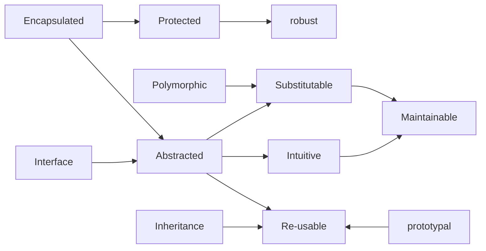

# [[Prog~OO]] 

see [[Prog~OO/OO~Modeling|OO~Modeling]] 
#is_/different_from :: [[ECP(Entity Component System)]] 
#is_/same_as :: [[../../../../../../WikiData/WD~Object-oriented_programming,79872|WD~Object-oriented_programming,79872]] 

## Extensions to [[Prog~Paradigm/Prog~Structured]] 

### Records have Methods and become Objects 
### Objects can be __polymorphic__ 

In contrast to structured Programming, where only individual [[Prog~Paradigm/Prog~Structured/Function-Pointer|Function-Pointer]]s can be polymorphic. 
### Objects can implement multiple polymorphic Interfaces 

(pure Virtual Classes in C++)

## #has_/Pros 

### Often intuitive Entities => Usable 

#### Roles & Responsibilities **must** be intuitive 

Otherwise Reasoning goes wrong => Logic Errors 
But some very technical Classes may have non-intuitive Behavior. 
#### non-intuitive Extremes:
##### DTOs 

##### Delegates/Strategies 

### Polymorphic => substitutable 

This decouples the Client from the Service allowing to 
- re-use both 
- test each in Isolation / Test-Harness 
- develop independently 
### Encapsulated => Abstraction => reduced Side-Effects 

These re-inforce each other: 



[[Prog~OO/Inheritance,prototypal]] is different from [[Prog~OO/Inheritance_by_Class]] 
Both can be used to __define Polymorphy__ (more important) 
and achieve Re-Use (less important)

## #has_/Cons 

### #has_/Cons :: Coupling between Classes / Prototypes 

Using one Class drags dozens of other Classes or Objects (as Parameters or as Base-Classes/Prototypes).
Contrast this with the Functional Paradigm, 
which can define [[Extension-Method]]s on Objects in many independent Places
and thus limits the Scope of their Core Methods and thus also their Dependencies! 

Each Method adds the Types of Parameters and Return-Values to the Class-Universe. 
It also increases the Surface of the Class with is a Problem both for Security and Cognitive Load. 

[[Prog~Functional]] is a more modular and maintainable Paradigm. 
Also different Domains have their own Class Models, that should be linked via IDs between each other, but otherwise largely independent. 
Each Entity should define its leading Domain and all other Domains have to comply. 

## All Contents

```folderv
```

```ccard
type: folder_brief_live
style : card
col: 2
briefMax: 128
noteOnly: true
```

