```mermaid
---
displayMode: compact
---
gantt
    title Millenia in Neogene Ages 
    dateFormat x
    axisFormat %s
    tickInterval 1000year
    
    section Period 
Neogene: crit, -23030000, -2580000
Quaternary: crit, -2580000, 2000

section Epoch 

Miocene: crit, -23030000, -5333000
Pliocene: crit, -5333000, -2580000
Pleistocene: crit, -2580000, -11700
Holocene: crit, -11700, 2000

section Ages 

Aquitanian: crit, -23030000, -20440000
Burdigalian: crit, -20440000, -15980000
Langhian: crit, -15980000, -13820000
Serravallian: crit, -13820000, -11630000
Tortonian: crit, -11630000, -7246000
Messinian: crit, -7246000, -5333000
Zanclean: crit, -5333000, -3600000
Piacenzian: crit, -3600000, -2580000
Gelasian: crit, -2580000, -1800000
Calabrian: crit, -1800000, -774000
Chibanian: crit, -774000, -129000
Late_Pleistocene: crit, -129000, -11700
Greenlandian: crit, -11700, -8200
Northgrippian: crit, -8200, -4200
Meghalayan: crit, -4200, 2000
```

```mermaid
---
displayMode: compact
---
gantt
    title Millenia in Quaternary Ages 
    dateFormat x
    axisFormat %s
    
    section Period 
Quaternary: crit, -2580000, 2000

section Epoch 

Pleistocene: crit, -2580000, -11700
Holocene: crit, -11700, 2000

section Ages 

Gelasian: crit, -2580000, -1800000
Calabrian: crit, -1800000, -774000
Chibanian: crit, -774000, -129000
Late_Pleistocene: crit, -129000, -11700
Greenlandian: crit, -11700, -8200
Northgrippian: crit, -8200, -4200
Meghalayan: crit, -4200, 2000

section Cultures 

Lower_Paleolithic: crit, -3300000, -300000 
Middle_Paleolithic: crit, -300000, -50000 
Upper_Paleolithic: crit, -50000, -13000 

section Revolutions 

humans and chimpanzees split : milestone, -6000000, 0d  
First stone tools. : milestone, -2500000 , 0d 
Homo-Races spread from Africa to Eurasia. : milestone, -2000000, 0d 
Neanderthals evolve : milestone, -500000 , 0d 
Daily usage of fire. : milestone, -300000 , 0d 
Homo sapiens evolves in East Africa. : milestone, -200000, 0d 
Sapiens spreads out of Africa. : milestone, -70000, 0d 
Sapiens reaches Australia : milestone, -45000, 0d 
Extinction of Neanderthals. : milestone, 30000, 0d 
Sapiens reach America : milestone, -14000, 0d 
sapiens is last human species. : milestone, -11000, 0d 


Cognitive : crit, -70000, -30000
Agricultural : milestone, -10000, 0d
Scientific : milestone, -1500, 0d

```

```mermaid
---
displayMode: compact
---
gantt
    title Millenia in Holocene Ages 
    dateFormat x
    axisFormat %s
    tickInterval 1second
    

section Epoch 

Holocene: crit, -11700, 2000

section Ages 

Greenlandian: crit, -11700, -8200
Northgrippian: crit, -8200, -4200
Meghalayan: crit, -4200, 2000

section Culture 

Mesolithic: crit, -13000, -8000 
Neolithic: crit, -8000, -3300 
Bronze-Age: crit, -3300, -1200 
Iron-Age: crit, -1200, -100 
Ancient_Rome: crit, -100, 400 
Early_Middle-Ages: crit, 400, 800 
Middle-Ages: crit, 800, 1500 
Post-Middle-Ages: crit, 1500, 1800 
Industrial-Age: crit, 1800, 1900 

section Revolutions 

Sapiens reach America : milestone, -14000, 0d 
last human species. : milestone, -11000, 0d 
Agricultural : milestone, -10000, 0d
First kingdoms, script, money : milestone, -3000, 0d 
First empire — Akkadian : milestone, -2350, 0d
Buddhism in India : milestone, -500 
Roman Empire : milestone, 0, 0d 
Islam. : milestone, 610 
Scientific : milestone, 1500, 0d

section China
Han Empire in China : milestone, 0, 0d 

```

# [[geo~Eons]] 

An eon is the largest formal geochronologic time unit 
and is equivalent to a chronostratigraphic eonothem. 
These are several hundred million years to two billion years in length.

## Eon 
```dataview
TABLE WITHOUT ID
substring(file.name,6), 
round(has_time_createdma * 1000000) as start, 
round(has_time_destroyedma * 1000000) as end 
from #is_a_/time_/Eon  
SORT has_time_createdma asc
```



```mermaid
---
displayMode: compact
---
gantt
    title All geological Eons
    dateFormat x
    axisFormat %s
    tickInterval 1000year
    
    section Eon
Hadean:crit,     -4567000000,-4031000000 
Archean:crit,     -4031000000,-2500000000 
Proterozoic:crit,    -2500000000,-538800000 
Phanerozoic:crit,    -538800000,0 

    section Era
Eoarchean: crit, -4031000000, -3600000000
Paleoarchean: crit, -3600000000, -3200000000
Mesoarchean: crit, -3200000000, -2800000000
Neoarchean: crit, -2800000000, -2500000000
Paleoproterozoic: crit, -2500000000, -1600000000
Mesoproterozoic: crit, -1600000000, -1000000000
Neoproterozoic: crit, -1000000000, -538800000
Paleozoic: crit, -538800000, -251902000
Mesozoic: crit, -251902000, -66000000
Cenozoic: crit, -66000000, 0

    section Period 
Siderian: crit, -2500000000, -2300000000
Rhyacian: crit, -2300000000, -2050000000
Orosirian: crit, -2050000000, -1800000000
Statherian: crit, -1800000000, -1600000000
Calymmian: crit, -1600000000, -1400000000
Ectasian: crit, -1400000000, -1200000000
Stenian: crit, -1200000000, -1000000000
Tonian: crit, -1000000000, -720000000
Cryogenian: crit, -720000000, -635000000
Ediacaran: crit, -635000000, -538800000
Cambrian: crit, -538800000, -485400000
Ordovician: crit, -485400000, -443800000
Silurian: crit, -443800000, -419200000
Devonian: crit, -419200000, -358900000
Carboniferous: crit, -358900000, -298900000
Permian: crit, -298900000, -251902000
Triassic: crit, -251902000, -201400000
Jurassic: crit, -201400000, -145000000
Cretaceous: crit, -145000000, -66000000
Paleogene: crit, -66000000, -23030000
Neogene: crit, -23030000, -2580000
Quaternary: crit, -2580000, 0

```

## Era 

```dataview
TABLE WITHOUT ID
substring(file.name,6) + ": crit, " 
+ round(has_time_createdma * 1000000) + ", "
+ round(has_time_destroyedma * 1000000) as task
FROM #is_a_/time_/Era  
SORT has_time_createdma asc
```




```mermaid
---
displayMode: compact
---
gantt
    title Phanerozoic Eon 
    dateFormat x
    axisFormat %s
    tickInterval 1000year
    
    section Eon
Phanerozoic:crit,    -538800000,0 

    section Era
Paleozoic: crit, -538800000, -251902000
Mesozoic: crit, -251902000, -66000000
Cenozoic: crit, -66000000, 0

    section Period 
Cambrian: crit, -538800000, -485400000
Ordovician: crit, -485400000, -443800000
Silurian: crit, -443800000, -419200000
Devonian: crit, -419200000, -358900000
Carboniferous: crit, -358900000, -298900000
Permian: crit, -298900000, -251902000
Triassic: crit, -251902000, -201400000
Jurassic: crit, -201400000, -145000000
Cretaceous: crit, -145000000, -66000000
Paleogene: crit, -66000000, -23030000
Neogene: crit, -23030000, -2580000
Quaternary: crit, -2580000, 0


```

## Period

```dataview
TABLE WITHOUT ID
substring(file.name,9) + ": crit, " 
+ round(has_time_createdma * 1000000) + ", "
+ round(has_time_destroyedma * 1000000) as task
FROM #is_a_/time_/Period  
SORT has_time_createdma asc
```





```mermaid
---
displayMode: compact
---
gantt
    title Mesozoic Epochs 
    dateFormat x
    axisFormat %s
    tickInterval 1000year
    
    section Era
Mesozoic: crit, -251902000, -66000000
Cenozoic: crit, -66000000, 0

    section Period 
Triassic: crit, -251902000, -201400000
Jurassic: crit, -201400000, -145000000
Cretaceous: crit, -145000000, -66000000
Paleogene: crit, -66000000, -23030000
Neogene: crit, -23030000, -2580000
Quaternary: crit, -2580000, 0

section Epoch 

Early_Jurassic: crit, -201400000, -174700000
Middle_Jurassic: crit, -174700000, -161500000
Late_Jurassic: crit, -161500000, -145000000
Early_Cretaceous: crit, -145000000, -100500000
Late_Cretaceous: crit, -100500000, -66000000
Paleocene: crit, -66000000, -56000000
Eocene: crit, -56000000, -33900000
Oligocene: crit, -33900000, -23030000
Miocene: crit, -23030000, -5333000
Pliocene: crit, -5333000, -2580000
Pleistocene: crit, -2580000, -11700
Holocene: crit, -11700, 0

```

## Epoch 

```dataview
TABLE WITHOUT ID
substring(file.name,8) + ": crit, " 
+ round(has_time_createdma * 1000000) + ", "
+ round(has_time_destroyedma * 1000000) as task
FROM #is_a_/time_/Epoch  
SORT has_time_createdma asc
```





```mermaid
---
displayMode: compact
---
gantt
    title Cenozoic Ages 
    dateFormat x
    axisFormat %s
    
    section Era
Cenozoic: crit, -66000000, 0

    section Period 
Paleogene: crit, -66000000, -23030000
Neogene: crit, -23030000, -2580000
Quaternary: crit, -2580000, 0

section Epoch 

Paleocene: crit, -66000000, -56000000
Eocene: crit, -56000000, -33900000
Oligocene: crit, -33900000, -23030000
Miocene: crit, -23030000, -5333000
Pliocene: crit, -5333000, -2580000
Pleistocene: crit, -2580000, -11700
Holocene: crit, -11700, 0

section Ages 

Danian: crit, -66000000, -61600000
Selandian: crit, -61600000, -59200000
Thanetian: crit, -59200000, -56000000
Ypresian: crit, -56000000, -47800000
Lutetian: crit, -47800000, -41200000
Bartonian: crit, -41200000, -37710000
Priabonian: crit, -37710000, -33900000
Rupelian: crit, -33900000, -27820000
Chattian: crit, -27820000, -23030000
Aquitanian: crit, -23030000, -20440000
Burdigalian: crit, -20440000, -15980000
Langhian: crit, -15980000, -13820000
Serravallian: crit, -13820000, -11630000
Tortonian: crit, -11630000, -7246000
Messinian: crit, -7246000, -5333000
Zanclean: crit, -5333000, -3600000
Piacenzian: crit, -3600000, -2580000
Gelasian: crit, -2580000, -1800000
Calabrian: crit, -1800000, -774000
Chibanian: crit, -774000, -129000
Late_Pleistocene: crit, -129000, -11700
Greenlandian: crit, -11700, -8200
Northgrippian: crit, -8200, -4200
Meghalayan: crit, -4200, 0
```

## Age 

```dataview
TABLE WITHOUT ID
substring(file.name,6) + ": crit, " 
+ round(has_time_createdma * 1000000) + ", "
+ round(has_time_destroyedma * 1000000) as task
FROM #is_a_/time_/Age  
SORT has_time_createdma asc
```











```dataview
TABLE WITHOUT ID
substring(file.name,0) + ": crit, " 
+ round(has_time_createdka * 1000) + ", "
+ round(has_time_destroyedka * 1000) as task
FROM #is_a_/time_/Culture 
SORT has_time_createdka asc
```


## All Contents

```ccard
type: folder_brief_live
style : card
col: 2
briefMax: 128
noteOnly: true
```

