```mermaid
---
displayMode: compact
---
gantt
    title Millenia in Neogene Ages 
    dateFormat x
    axisFormat %s
    tickInterval 1000year
    
    section Period 
Neogene: crit, -23030000, -2580000
Quaternary: crit, -2580000, 2000

section Epoch 

Miocene: crit, -23030000, -5333000
Pliocene: crit, -5333000, -2580000
Pleistocene: crit, -2580000, -11700
Holocene: crit, -11700, 2000

section Ages 

Aquitanian: crit, -23030000, -20440000
Burdigalian: crit, -20440000, -15980000
Langhian: crit, -15980000, -13820000
Serravallian: crit, -13820000, -11630000
Tortonian: crit, -11630000, -7246000
Messinian: crit, -7246000, -5333000
Zanclean: crit, -5333000, -3600000
Piacenzian: crit, -3600000, -2580000
Gelasian: crit, -2580000, -1800000
Calabrian: crit, -1800000, -774000
Chibanian: crit, -774000, -129000
Late_Pleistocene: crit, -129000, -11700
Greenlandian: crit, -11700, -8200
Northgrippian: crit, -8200, -4200
Meghalayan: crit, -4200, 2000
```

```mermaid
---
displayMode: compact
---
gantt
    title Millenia in Holocene Ages 
    dateFormat x
    axisFormat %s
    tickInterval 1second
    

section Epoch 

Holocene: crit, -11700, 2000

section Ages 

Greenlandian: crit, -11700, -8200
Northgrippian: crit, -8200, -4200
Meghalayan: crit, -4200, 2000

section Culture 

Mesolithic: crit, -13000, -8000 
Neolithic: crit, -8000, -3300 
Bronze-Age: crit, -3300, -1200 
Iron-Age: crit, -1200, -100 
Ancient_Rome: crit, -100, 400 
Early_Middle-Ages: crit, 400, 800 
Middle-Ages: crit, 800, 1500 
Post-Middle-Ages: crit, 1500, 1800 
Industrial-Age: crit, 1800, 1900 

section Humans  

Sapiens reach America : milestone, -14000, 0d 
last human species. : milestone, -11000, 0d 
Agricultural : milestone, -10000, 0d
First kingdoms, script, money : milestone, -3000, 0d 
First empire — Akkadian : milestone, -2350, 0d
Buddhism in India : milestone, -500 
Roman Empire : milestone, 0, 0d 
Islam. : milestone, 610 
Scientific : milestone, 1500, 0d

```

```mermaid
gantt
    title Years in History  
    dateFormat x
    axisFormat %Q
    tickInterval 100millisecond
    


section Africa

Khufu Pyramid	: crit, 	-2580	,	-2560
Mali-Mansa Musa's Pilgrimage	: crit, 	1324	,	1325
Building Suez Canal	: crit, 	1859	,	1869
Nelson Mandela imprisoned	: crit, 	1962	,	1990
Apartheid Ends in South Africa	: milestone, 	1994	,	1994
Rwandan Genocide	: milestone, 	1994	,	1994
Second Congo War	: crit, 	1998	,	2003


section Asia 

Building the Great Wall of China	: crit, 	-700	,	1700
Three Kingdoms Period	: crit, 	220	,	280
Japan-Heian Period	: crit, 	794	,	1185
China-Invention of Gunpowder	: milestone, 	800	,	800
Pax Mongolica	: crit, 	1200	,	1400
Ming Dynasty's Yongle Encyclopedia	: crit, 	1403	,	1408
China-Zheng He's Voyages	: crit, 	1405	,	1433
China-Opium Trade	: crit, 	1700	,	1900
Opium War I China vs Britain	: crit, 	1839	,	1842
China-Treaty of Nanking	: milestone, 	1842	,	1842
Opium War II China vs Britain	: crit, 	1856	,	1860
Japan-Meiji Restoration	: crit, 	1868	,	1912
China-Long March	: crit, 	1934	,	1935
Korean War	: crit, 	1950	,	1953
Vietnam War Begins	: crit, 	1955	,	1975
Cultural Revolution in China	: crit, 	1966	,	1976
Vietnam-Tet Offensive	: milestone, 	1968	,	1968
Bangladesh-Independence	: milestone, 	1971	,	1971
Hong Kong to China	: milestone, 	1997	,	1997
Indian Ocean Tsunami	: milestone, 	2004	,	2004
North Korea-Nuclear Tests	: crit, 	2006	,	2017
Hong Kong Protests	: crit, 	2019	,	2020

section Europe 

Roman Republic	: crit, 	-509	,	-27  
Greece: Battle of Marathon	: milestone, 	-490	,	-490
Greece-Peloponnesian Wars	: crit, 	-431	,	-404
Alexander the Great	: crit, 	-356	,	-323
Rome: Punic War I	: crit, 	-264	,	-241
Julius Caesar crosses the Rubicon	: milestone, 	-49	,	-49
Jesus Christ	: crit, 	1	,	33
Great Fire of Rome	: milestone, 	64	,	64
Construction of the Colosseum	: crit, 	70	,	80
Edict of Milan	: crit, 	313	,	313
Western Roman Empire	: crit, 	-27	,	476
Justinian's Code	: milestone, 	529	,	529
Viking Expansion	: crit, 	700	,	1100
Umayyad defeated at Tours	: milestone, 	732	,	732
Norman Conquest of England	: milestone, 	1066	,	1066
First Crusade	: crit, 	1096	,	1099
Mongol Invasion of Europe	: crit, 	1241	,	1242
Black Death Peaks	: crit, 	1347	,	1351
Ottoman Empire Conquers Constantinople	: milestone, 	1453	,	1453
Spanish Inquisition Established	: milestone, 	1478	,	1478
Leonardo da Vinci's Last Supper	: crit, 	1495	,	1498
Martin Luther's 95 Theses	: milestone, 	1517	,	1517
Siege of Vienna by Ottomans	: milestone, 	1529	,	1529
England-Elizabet I	: crit, 	1558	,	1603
Age of Enlightenment	: crit, 	1600	,	1800
Netherlands-Tulip Mania	: milestone, 	1637	,	1637
Thirty Years' War	: crit, 	1618	,	1648
Peter the Great's Westernization of Russia	: crit, 	1697	,	1725
France-Reign of Terror	: crit, 	1793	,	1794
Industrial Revolution	: crit, 	1800	,	1900
Napoleon Bonaparte Reign	: crit, 	1804	,	1815
Battle of Leipzig	: milestone, 	1813	,	1813
Greece-Battle of Navarino	: milestone, 	1827	,	1827
UK-Victoria I	: crit, 	1837	,	1901
Crimean War	: crit, 	1853	,	1856
Berlin Conference on Africa	: crit, 	1884	,	1885
First Nobel Prizes Awarded	: milestone, 	1901	,	1901
Russian Revolution of 1905	: milestone, 	1905	,	1905
Russian October Revolution	: milestone, 	1917	,	1917
Austro-Hungarian Empire	: crit, 	1867	,	1918
Hyperinflation in Germany	: crit, 	1921	,	1924
Ottoman Empire	: crit, 	1299	,	1922
Guernica Bombing	: milestone, 	1937	,	1937
Battle of Stalingrad	: crit, 	1942	,	1943
Nuremberg Trials	: crit, 	1945	,	1946
Chernobyl Disaster	: milestone, 	1986	,	1986
Siege of Sarajevo	: crit, 	1992	,	1996
European Union Established	: milestone, 	1993	,	1993
Annexation of Crimea	: milestone, 	2014	,	2014
2015 Paris Islamic Attacks	: milestone, 	2015	,	2015
Brexit Referendum	: milestone, 	2016	,	2016

section Global 

Christopher Columbus Reaches the Americas	: milestone, 	1492	,	1492
Spanish-American War	: milestone, 	1898	,	1898
Battle of the Somme	: milestone, 	1916	,	1916
Great Depression	: crit, 	1929	,	1939
Marshall Plan Implemented	: milestone, 	1948	,	1948
Antarctic Treaty Signed	: milestone, 	1959	,	1959
Kyoto Protocol Adopted	: milestone, 	1997	,	1997
Paris Agreement Signed	: milestone, 	2015	,	2015
COVID-19 Pandemic	: crit, 	2019	,	2022 

section India 
Buddha's Enlightenment	: milestone, 	-600	,	-600
Maurya Empire Established	: crit, 	-322	,	-322
Indian Mutiny	: crit, 	1857	,	1858

section Middle-East 

Code of Ur-Nammu	: milestone, 	-2100	,	-2100
Hammurabi's Code	: milestone, 	-1754	,	-1754
Alexander the Great in Persia 	: milestone, 	-330	,	-330
Abbasid Caliphate Translations	: crit, 	700	,	1000
Iranian Revolution	: milestone, 	1979	,	1979
Invasion of Iraq	: milestone, 	2003	,	2003
Arab Spring Begins	: milestone, 	2010	,	2010
Syrian Civil War Begins	: milestone, 	2011	,	2011
Beirut Port Explosion	: milestone, 	2020	,	2020

section North-America 

Salem Witch Trials	: milestone, 	1692	,	1692
Boston Tea Party	: milestone, 	1773	,	1773
American Revolution	: crit, 	1775	,	1783
Louisiana Purchase by US	: milestone, 	1803	,	1803
Haitian Independence	: milestone, 	1804	,	1804
Mexican War of Independence	: crit, 	1810	,	1821
Gold Rush in California	: crit, 	1848	,	1855
Lincolns Slavery Abolition	: milestone, 	1863	,	1863
Transcontinental Railroad Completed	: milestone, 	1869	,	1869
Construction of the Panama Canal	: crit, 	1904	,	1914
Mexican Revolution	: crit, 	1910	,	1920
Cuban Revolution	: crit, 	1953	,	1959
Cuban Missile Crisis	: milestone, 	1962	,	1962
Civil Rights-March on Washington	: milestone, 	1963	,	1963
Civil Rights Act of 1964	: milestone, 	1964	,	1964
Apollo 11 Moon Landing	: milestone, 	1969	,	1969
Apollo 13 Mission	: milestone, 	1970	,	1970
Watergate Scandal	: crit, 	1972	,	1974
9/11 Terrorist Attacks	: milestone, 	2001	,	2001
U.S. Capitol Riot	: milestone, 	2021	,	2021

section South-America 

Inca-Machu Picchu Built	: crit, 	1450	,	1460
Siege of Aztec Tenochtitlan	: milestone, 	1521	,	1521


```

# [[geo~Eons]] 

An eon is the largest formal geochronologic time unit 
and is equivalent to a chronostratigraphic eonothem. 
These are several hundred million years to two billion years in length.

## Eon 
```dataview
TABLE WITHOUT ID
substring(file.name,6), 
round(has_time_createdma * 1000000) as start, 
round(has_time_destroyedma * 1000000) as end 
from #is_a_/time_/Eon  
SORT has_time_createdma asc
```



```mermaid
---
displayMode: compact
---
gantt
    title All geological Eons
    dateFormat x
    axisFormat %s
    tickInterval 1000year
    
    section Eon
Hadean:crit,     -4567000000,-4031000000 
Archean:crit,     -4031000000,-2500000000 
Proterozoic:crit,    -2500000000,-538800000 
Phanerozoic:crit,    -538800000,0 

    section Era
Eoarchean: crit, -4031000000, -3600000000
Paleoarchean: crit, -3600000000, -3200000000
Mesoarchean: crit, -3200000000, -2800000000
Neoarchean: crit, -2800000000, -2500000000
Paleoproterozoic: crit, -2500000000, -1600000000
Mesoproterozoic: crit, -1600000000, -1000000000
Neoproterozoic: crit, -1000000000, -538800000
Paleozoic: crit, -538800000, -251902000
Mesozoic: crit, -251902000, -66000000
Cenozoic: crit, -66000000, 0

    section Period 
Siderian: crit, -2500000000, -2300000000
Rhyacian: crit, -2300000000, -2050000000
Orosirian: crit, -2050000000, -1800000000
Statherian: crit, -1800000000, -1600000000
Calymmian: crit, -1600000000, -1400000000
Ectasian: crit, -1400000000, -1200000000
Stenian: crit, -1200000000, -1000000000
Tonian: crit, -1000000000, -720000000
Cryogenian: crit, -720000000, -635000000
Ediacaran: crit, -635000000, -538800000
Cambrian: crit, -538800000, -485400000
Ordovician: crit, -485400000, -443800000
Silurian: crit, -443800000, -419200000
Devonian: crit, -419200000, -358900000
Carboniferous: crit, -358900000, -298900000
Permian: crit, -298900000, -251902000
Triassic: crit, -251902000, -201400000
Jurassic: crit, -201400000, -145000000
Cretaceous: crit, -145000000, -66000000
Paleogene: crit, -66000000, -23030000
Neogene: crit, -23030000, -2580000
Quaternary: crit, -2580000, 0

```

## Era 

```dataview
TABLE WITHOUT ID
substring(file.name,6) + ": crit, " 
+ round(has_time_createdma * 1000000) + ", "
+ round(has_time_destroyedma * 1000000) as task
FROM #is_a_/time_/Era  
SORT has_time_createdma asc
```




```mermaid
---
displayMode: compact
---
gantt
    title Phanerozoic Eon 
    dateFormat x
    axisFormat %s
    tickInterval 1000year
    
    section Eon
Phanerozoic:crit,    -538800000,0 

    section Era
Paleozoic: crit, -538800000, -251902000
Mesozoic: crit, -251902000, -66000000
Cenozoic: crit, -66000000, 0

    section Period 
Cambrian: crit, -538800000, -485400000
Ordovician: crit, -485400000, -443800000
Silurian: crit, -443800000, -419200000
Devonian: crit, -419200000, -358900000
Carboniferous: crit, -358900000, -298900000
Permian: crit, -298900000, -251902000
Triassic: crit, -251902000, -201400000
Jurassic: crit, -201400000, -145000000
Cretaceous: crit, -145000000, -66000000
Paleogene: crit, -66000000, -23030000
Neogene: crit, -23030000, -2580000
Quaternary: crit, -2580000, 0


```

## Period

```dataview
TABLE WITHOUT ID
substring(file.name,9) + ": crit, " 
+ round(has_time_createdma * 1000000) + ", "
+ round(has_time_destroyedma * 1000000) as task
FROM #is_a_/time_/Period  
SORT has_time_createdma asc
```





```mermaid
---
displayMode: compact
---
gantt
    title Mesozoic Epochs 
    dateFormat x
    axisFormat %s
    tickInterval 1000year
    
    section Era
Mesozoic: crit, -251902000, -66000000
Cenozoic: crit, -66000000, 0

    section Period 
Triassic: crit, -251902000, -201400000
Jurassic: crit, -201400000, -145000000
Cretaceous: crit, -145000000, -66000000
Paleogene: crit, -66000000, -23030000
Neogene: crit, -23030000, -2580000
Quaternary: crit, -2580000, 0

section Epoch 

Early_Jurassic: crit, -201400000, -174700000
Middle_Jurassic: crit, -174700000, -161500000
Late_Jurassic: crit, -161500000, -145000000
Early_Cretaceous: crit, -145000000, -100500000
Late_Cretaceous: crit, -100500000, -66000000
Paleocene: crit, -66000000, -56000000
Eocene: crit, -56000000, -33900000
Oligocene: crit, -33900000, -23030000
Miocene: crit, -23030000, -5333000
Pliocene: crit, -5333000, -2580000
Pleistocene: crit, -2580000, -11700
Holocene: crit, -11700, 0

```

## Epoch 

```dataview
TABLE WITHOUT ID
substring(file.name,8) + ": crit, " 
+ round(has_time_createdma * 1000000) + ", "
+ round(has_time_destroyedma * 1000000) as task
FROM #is_a_/time_/Epoch  
SORT has_time_createdma asc
```





```mermaid
---
displayMode: compact
---
gantt
    title Cenozoic Ages 
    dateFormat x
    axisFormat %s
    
    section Era
Cenozoic: crit, -66000000, 0

    section Period 
Paleogene: crit, -66000000, -23030000
Neogene: crit, -23030000, -2580000
Quaternary: crit, -2580000, 0

section Epoch 

Paleocene: crit, -66000000, -56000000
Eocene: crit, -56000000, -33900000
Oligocene: crit, -33900000, -23030000
Miocene: crit, -23030000, -5333000
Pliocene: crit, -5333000, -2580000
Pleistocene: crit, -2580000, -11700
Holocene: crit, -11700, 0

section Ages 

Danian: crit, -66000000, -61600000
Selandian: crit, -61600000, -59200000
Thanetian: crit, -59200000, -56000000
Ypresian: crit, -56000000, -47800000
Lutetian: crit, -47800000, -41200000
Bartonian: crit, -41200000, -37710000
Priabonian: crit, -37710000, -33900000
Rupelian: crit, -33900000, -27820000
Chattian: crit, -27820000, -23030000
Aquitanian: crit, -23030000, -20440000
Burdigalian: crit, -20440000, -15980000
Langhian: crit, -15980000, -13820000
Serravallian: crit, -13820000, -11630000
Tortonian: crit, -11630000, -7246000
Messinian: crit, -7246000, -5333000
Zanclean: crit, -5333000, -3600000
Piacenzian: crit, -3600000, -2580000
Gelasian: crit, -2580000, -1800000
Calabrian: crit, -1800000, -774000
Chibanian: crit, -774000, -129000
Late_Pleistocene: crit, -129000, -11700
Greenlandian: crit, -11700, -8200
Northgrippian: crit, -8200, -4200
Meghalayan: crit, -4200, 0
```

## Age 

```dataview
TABLE WITHOUT ID
substring(file.name,6) + ": crit, " 
+ round(has_time_createdma * 1000000) + ", "
+ round(has_time_destroyedma * 1000000) as task
FROM #is_a_/time_/Age  
SORT has_time_createdma asc
```











```dataview
TABLE WITHOUT ID
substring(file.name,0) + ": crit, " 
+ round(has_time_createdka * 1000) + ", "
+ round(has_time_destroyedka * 1000) as task
FROM #is_a_/time_/Culture 
SORT has_time_createdka asc
```


## All Contents

```ccard
type: folder_brief_live
style : card
col: 2
briefMax: 128
noteOnly: true
```

| Event | Date |  |
| ---- | ---- | ---- |
| [Sumerian](https://en.wikipedia.org/wiki/Sumer "Sumer") [cuneiform](https://en.wikipedia.org/wiki/Cuneiform "Cuneiform") [writing system](https://en.wikipedia.org/wiki/Writing_system "Writing system") | -3500 | 200 |
| [writing system](https://en.wikipedia.org/wiki/Writing_system "Writing system")  [Egyptian hieroglyphs](https://en.wikipedia.org/wiki/Egyptian_hieroglyphs "Egyptian hieroglyphs") | -3200 | 400 |
| [Cycladic culture](https://en.wikipedia.org/wiki/Cycladic_culture "Cycladic culture") in [Greece](https://en.wikipedia.org/wiki/Greece "Greece"). | -3100 | -1000 |
| [Caral-Supe civilization](https://en.wikipedia.org/wiki/Caral-Supe_civilization "Caral-Supe civilization") begins in [Peru](https://en.wikipedia.org/wiki/Peru "Peru"). | -3200 | -1800 |
| Rise of [Proto-Elamite](https://en.wikipedia.org/wiki/Proto-Elamite "Proto-Elamite") Civilization in [Iran](https://en.wikipedia.org/wiki/Iran "Iran"). | -3100 | -2700 |
| [Skara Brae](https://en.wikipedia.org/wiki/Skara_Brae "Skara Brae") is built in [Scotland](https://en.wikipedia.org/wiki/Scotland "Scotland"). | -3180 | -2500 |
| [First Dynasty of Egypt](https://en.wikipedia.org/wiki/First_Dynasty_of_Egypt "First Dynasty of Egypt"). | -3100 | -2900 |
| [Stonehenge](https://en.wikipedia.org/wiki/Stonehenge "Stonehenge") construction begins. In its first version, it consisted of a circular ditch and bank, with 56 wooden posts. | -3100 |  |
| [Cucuteni–Trypillia culture](https://en.wikipedia.org/wiki/Cucuteni%E2%80%93Trypillia_culture "Cucuteni–Trypillia culture") is established in [Romania](https://en.wikipedia.org/wiki/Romania "Romania") and [Ukraine](https://en.wikipedia.org/wiki/Ukraine "Ukraine"). | -4800 | -3000 |
| [Jiroft culture](https://en.wikipedia.org/wiki/Jiroft_culture "Jiroft culture") begins in [Iran](https://en.wikipedia.org/wiki/Iran "Iran"). | -2500 | -2200 |
| First known use of [papyrus](https://en.wikipedia.org/wiki/Papyrus "Papyrus") by [Egyptians](https://en.wikipedia.org/wiki/Ancient_Egypt "Ancient Egypt"). | -3000 |  |
| Earliest evidence of autochthonous [iron production](https://en.wikipedia.org/wiki/Iron_metallurgy_in_Africa "Iron metallurgy in Africa") in [West Africa](https://en.wikipedia.org/wiki/West_Africa "West Africa"). | -3000 | -2500 |
| The [East African Pastoral neolithic](https://en.wikipedia.org/wiki/Pastoral_Neolithic "Pastoral Neolithic") culture builds [East Africa's](https://en.wikipedia.org/wiki/Eastern_Africa "Eastern Africa") earliest and largest [monumental cemetery](https://en.wikipedia.org/wiki/Monumental_cemetery "Monumental cemetery") at [Lothagam North Pillar Site](https://en.wikipedia.org/wiki/Lothagam_North_Pillar_Site "Lothagam North Pillar Site"). | -3000 | -2300 |
| Domestication of the horse in the [Yamnaya culture](https://en.wikipedia.org/wiki/Yamnaya_culture "Yamnaya culture"). | -3000 | -2600 |
| [Kot Diji](https://en.wikipedia.org/wiki/Kot_Diji "Kot Diji") phase of the [Indus Valley Civilisation](https://en.wikipedia.org/wiki/Indus_Valley_Civilisation "Indus Valley Civilisation") begins. | -3300 | -2600 |
| [Longshan culture](https://en.wikipedia.org/wiki/Longshan_culture "Longshan culture") begins in [China](https://en.wikipedia.org/wiki/China "China"). | -2800 | -1900 |
| [Minoan civilization](https://en.wikipedia.org/wiki/Minoan_civilization "Minoan civilization") ancient palace city [Knossos](https://en.wikipedia.org/wiki/Knossos "Knossos") reaches 80,000 inhabitants. | -3100 | -1100 |
| Rise of [Elam](https://en.wikipedia.org/wiki/Elam "Elam") in Iran. | -3200 | -539 |
| The [Old Kingdom](https://en.wikipedia.org/wiki/Old_Kingdom_of_Egypt "Old Kingdom of Egypt") begins in Egypt. | -2686 | -2181 |
| Oldest known surviving literature: [Sumerian](https://en.wikipedia.org/wiki/Sumer "Sumer") texts from [Abu Salabikh](https://en.wikipedia.org/wiki/Abu_Salabikh "Abu Salabikh"), including the _[Instructions of Shuruppak](https://en.wikipedia.org/wiki/Instructions_of_Shuruppak "Instructions of Shuruppak")_ and the _[Kesh temple hymn](https://en.wikipedia.org/wiki/Kesh_temple_hymn "Kesh temple hymn")_ | -2600 |  |
| [Mature Harappan](https://en.wikipedia.org/wiki/Mature_Harappan "Mature Harappan") phase of the Indus Valley civilization (in present-day [Pakistan](https://en.wikipedia.org/wiki/Pakistan "Pakistan") and [India](https://en.wikipedia.org/wiki/India "India")) begins. | -3300 | -1300 |
| Emergence of [Mayan](https://en.wikipedia.org/wiki/Maya_civilization "Maya civilization") culture in the [Yucatán Peninsula](https://en.wikipedia.org/wiki/Yucat%C3%A1n_Peninsula "Yucatán Peninsula"). | -2600 |  |
| King Khufu completes the [Great Pyramid of Giza](https://en.wikipedia.org/wiki/Great_Pyramid_of_Giza "Great Pyramid of Giza"). The [Land of Punt](https://en.wikipedia.org/wiki/Land_of_Punt "Land of Punt") in the Horn of Africa first appears in Egyptian records around this time. | -2570 | -2545 |
| [Kerma culture](https://en.wikipedia.org/wiki/Kerma_culture "Kerma culture") begins in [Nubia](https://en.wikipedia.org/wiki/Nubia "Nubia"). | -2500 | -1500 |
| The last [mammoth](https://en.wikipedia.org/wiki/Mammoth "Mammoth") population, on [Wrangel Island](https://en.wikipedia.org/wiki/Wrangel_Island "Wrangel Island") in Siberia, goes extinct. | -2500 |  |
| [Akkadian Empire](https://en.wikipedia.org/wiki/Akkadian_Empire "Akkadian Empire") is founded, dating depends upon whether the [Middle chronology](https://en.wikipedia.org/wiki/Middle_chronology "Middle chronology") or the [Short chronology](https://en.wikipedia.org/wiki/Short_chronology_timeline "Short chronology timeline") is used. | -2334 | -2154 |
| Pharaoh [Teti](https://en.wikipedia.org/wiki/Teti "Teti") is thought to be the earliest known victim of assassination. | -2323 | -2291 |
| Oldest known depiction of the [Staff God](https://en.wikipedia.org/wiki/Staff_God "Staff God"), the oldest image of a god to be found in the Americas. | -2250 |  |
| [4.2-kiloyear event](https://en.wikipedia.org/wiki/4.2-kiloyear_event "4.2-kiloyear event"): a severe [aridification](https://en.wikipedia.org/wiki/Aridification "Aridification") phase, likely connected to a [Bond event](https://en.wikipedia.org/wiki/Bond_event "Bond event"), which was registered throughout most of [North Africa](https://en.wikipedia.org/wiki/North_Africa "North Africa"), [Middle East](https://en.wikipedia.org/wiki/Middle_East "Middle East") and continental [North America](https://en.wikipedia.org/wiki/North_America "North America"). Related droughts very likely caused the collapse of the [Old Kingdom](https://en.wikipedia.org/wiki/Old_Kingdom "Old Kingdom") in [Egypt](https://en.wikipedia.org/wiki/Egypt "Egypt") and the [Akkadian Empire](https://en.wikipedia.org/wiki/Akkadian_Empire "Akkadian Empire") in [Mesopotamia](https://en.wikipedia.org/wiki/Mesopotamia "Mesopotamia"). | -2200 | -2100 |
| Completion of [Stonehenge](https://en.wikipedia.org/wiki/Stonehenge "Stonehenge"). | -2200 |  |
| Traditional date for the legendary foundation of [Armenia](https://en.wikipedia.org/wiki/Armenia "Armenia") by [Hayk](https://en.wikipedia.org/wiki/Hayk "Hayk"). | -2115 |  |
| The [Middle Kingdom](https://en.wikipedia.org/wiki/Middle_Kingdom_of_Egypt "Middle Kingdom of Egypt") in Egypt. | -2055 | -1650 |
| [Erlitou culture](https://en.wikipedia.org/wiki/Erlitou_culture "Erlitou culture") begins in China. | -1900 | -1500 |
| [Alphabetic writing](https://en.wikipedia.org/wiki/Middle_Bronze_Age_alphabets "Middle Bronze Age alphabets") emerges. | -1800 |  |
| The Old Babylonian [Epic of Gilgamesh](https://en.wikipedia.org/wiki/Epic_of_Gilgamesh "Epic of Gilgamesh") constitutes the earliest complete version of that narrative. | -1800 |  |
| Oldest Record of [Hammurabi's Code](https://en.wikipedia.org/wiki/Code_of_Hammurabi "Code of Hammurabi"). | -1780 |  |
| [Mycenaean civilization](https://en.wikipedia.org/wiki/Mycenaean_civilization "Mycenaean civilization") begins in mainland Greece. | -1750 | -1050 |
| The [Proto-Sinaitic script](https://en.wikipedia.org/wiki/Proto-Sinaitic_script "Proto-Sinaitic script") is the oldest alphabet created in Egypt. | -1700 | -1400 |
| Indus Valley Civilization is continued by the [Cemetery H culture](https://en.wikipedia.org/wiki/Cemetery_H_culture "Cemetery H culture"); | -1900 | -1300 |
| [Poverty Point culture](https://en.wikipedia.org/wiki/Poverty_Point_culture "Poverty Point culture") in [North America](https://en.wikipedia.org/wiki/North_America "North America"). | -1730 | -1350 |
| [Minoan civilization](https://en.wikipedia.org/wiki/Minoan_civilization "Minoan civilization") on [Crete](https://en.wikipedia.org/wiki/Crete "Crete") is devastated by the [Minoan eruption](https://en.wikipedia.org/wiki/Minoan_eruption "Minoan eruption") of [Santorini](https://en.wikipedia.org/wiki/Santorini "Santorini") island. | -1600 |  |
| [Shang dynasty](https://en.wikipedia.org/wiki/Shang_dynasty "Shang dynasty") in China; evidence of a fully developed writing system, see [Oracle bone script](https://en.wikipedia.org/wiki/Oracle_bone_script "Oracle bone script"). | -1600 | -1045 |
| The [New Kingdom](https://en.wikipedia.org/wiki/New_Kingdom_of_Egypt "New Kingdom of Egypt") in Egypt. | -1550 | -1069 |
| Composition of the [Rigveda](https://en.wikipedia.org/wiki/Rigveda "Rigveda") is completed. | -1500 |  |
| [Olmec](https://en.wikipedia.org/wiki/Olmec "Olmec") civilization flourishes in Pre-Columbian [Mexico](https://en.wikipedia.org/wiki/Mexico "Mexico"), during Mesoamerica's [Formative](https://en.wikipedia.org/wiki/Mesoamerican_chronology "Mesoamerican chronology") period. | -1500 | -400 |
| [Oldest known song](https://en.wikipedia.org/wiki/Hurrian_songs "Hurrian songs") with notation. | -1400 |  |
| [Hallstatt culture](https://en.wikipedia.org/wiki/Hallstatt_culture "Hallstatt culture") in Europe. | -1200 | -450 |
| [Bronze Age collapse occurs](https://en.wikipedia.org/wiki/Bronze_Age_collapse "Bronze Age collapse") in [Southwestern Asia](https://en.wikipedia.org/wiki/Southwestern_Asia "Southwestern Asia") and in the [Eastern Mediterranean](https://en.wikipedia.org/wiki/Eastern_Mediterranean "Eastern Mediterranean") region. This period is also the setting of the _[Iliad](https://en.wikipedia.org/wiki/Iliad "Iliad")_ and the _[Odyssey](https://en.wikipedia.org/wiki/Odyssey "Odyssey")_ epic poems (which were composed about four centuries later). | -1200 | -1150 |
| [Hittite Empire](https://en.wikipedia.org/wiki/Hittite_Empire "Hittite Empire") | -1650 | -1180 |
| Use of [Iron](https://en.wikipedia.org/wiki/Iron "Iron") spreads. | -1100 |  |
| The Phoenician alphabet is created. | -1050 |  |
| The Zhou force (led by [King Wu of Zhou](https://en.wikipedia.org/wiki/King_Wu_of_Zhou "King Wu of Zhou")) overthrow the last king of [Shang dynasty](https://en.wikipedia.org/wiki/Shang_dynasty "Shang dynasty"); [Zhou dynasty](https://en.wikipedia.org/wiki/Zhou_dynasty "Zhou dynasty") established in China. | -1046 | -256 |
| [Nok culture](https://en.wikipedia.org/wiki/Nok_culture "Nok culture")  in West Africa. | -1500 | -1 |
| The second stream of [Bantu expansion](https://en.wikipedia.org/wiki/Bantu_expansion "Bantu expansion") reaches the [great lakes region](https://en.wikipedia.org/wiki/Great_lakes_(Africa) "Great lakes (Africa)") of [Africa](https://en.wikipedia.org/wiki/Africa "Africa"), creating a major population centre. | -1000 |  |
| Approximate date for the composition of the _[Iliad](https://en.wikipedia.org/wiki/Iliad "Iliad")_ and the _[Odyssey](https://en.wikipedia.org/wiki/Odyssey "Odyssey")._ | -890 |  |
| Foundation of Carthage by the [Phoenicians](https://en.wikipedia.org/wiki/Phoenicia "Phoenicia") in today known Tunisia. | -814 |  |
| Rise of [Greek](https://en.wikipedia.org/wiki/Ancient_Greece "Ancient Greece") city-states. | -800 |  |
| Iron Age begins in Sungai Batu (Old Kedah). | -788 |  |
| [Kingdom of Kush](https://en.wikipedia.org/wiki/Kingdom_of_Kush "Kingdom of Kush"). | -785 | 350 |
| [Ancient Olympic Games](https://en.wikipedia.org/wiki/Ancient_Olympic_Games "Ancient Olympic Games"). | -776 | 393 |
| [Spring and Autumn period](https://en.wikipedia.org/wiki/Spring_and_Autumn_period "Spring and Autumn period") begins in China; [Zhou dynasty](https://en.wikipedia.org/wiki/Zhou_dynasty "Zhou dynasty")'s power is diminishing; the era of the [Hundred Schools of Thought](https://en.wikipedia.org/wiki/Hundred_Schools_of_Thought "Hundred Schools of Thought"). | -771 |  |
| Founding of [Rome](https://en.wikipedia.org/wiki/Ancient_Rome "Ancient Rome") (traditional date). | -753 |  |
| [Tiglath-Pileser III](https://en.wikipedia.org/wiki/Tiglath-Pileser_III "Tiglath-Pileser III") becomes the new king of [Assyria](https://en.wikipedia.org/wiki/Assyria "Assyria"). With time he conquers neighboring countries and turns Assyria into an empire. | -745 | -727 |
| [Median Empire](https://en.wikipedia.org/wiki/Median_Empire "Median Empire") in Iran. | -678 | -549 |
| The construction of [Marib Dam](https://en.wikipedia.org/wiki/Marib_Dam "Marib Dam") in [Arabia Felix](https://en.wikipedia.org/wiki/Arabia_Felix "Arabia Felix"), in modern Saudi Arabia and Yemen. | -700 |  |
| [Achaemenid dynasty](https://en.wikipedia.org/wiki/Achaemenid_Empire "Achaemenid Empire") in Persia. | -705 | -330 |
| The [Urewe culture](https://en.wikipedia.org/wiki/Urewe "Urewe") dominates the African [Great Lakes region](https://en.wikipedia.org/wiki/Great_lakes_(Africa) "Great lakes (Africa)"). It was one of Africa's oldest iron smelting centres. | -650 | -550 |
| An alliance between the Babylonians, Medes, and Scythians succeeds in destroying [Nineveh](https://en.wikipedia.org/wiki/Nineveh "Nineveh") and causing subsequent fall of the Assyrian empire. | -612 |  |
| [Pandyan kingdom](https://en.wikipedia.org/wiki/Pandyan_kingdom "Pandyan kingdom") is founded in [South India](https://en.wikipedia.org/wiki/South_India "South India"). | -600 |  |
| Sixteen [Mahajanapadas](https://en.wikipedia.org/wiki/Mahajanapadas "Mahajanapadas") ("_Great Realms_" or "_Great Kingdoms_") emerge in India. | -600 | -345 |
| Evidence of writing system appears in [Oaxaca](https://en.wikipedia.org/wiki/Oaxaca "Oaxaca") used by the [Zapotec civilization](https://en.wikipedia.org/wiki/Zapotec_civilization "Zapotec civilization"). | -600 |  |
| [Sao civilization](https://en.wikipedia.org/wiki/Sao_civilization "Sao civilization") near Lake Chad. | -600 | 1600 |
| [Siddhartha Gautama](https://en.wikipedia.org/wiki/Siddhartha_Gautama "Siddhartha Gautama") (Buddha), founder of [Buddhism](https://en.wikipedia.org/wiki/Buddhism "Buddhism"), born as a prince of the [Shakya clan](https://en.wikipedia.org/wiki/Shakya "Shakya"), which ruled parts of [Magadha](https://en.wikipedia.org/wiki/Magadha "Magadha"), one of the Mahajanapadas. | -563 | -483 |
| [Confucius](https://en.wikipedia.org/wiki/Confucius "Confucius"), founder of [Confucianism](https://en.wikipedia.org/wiki/Confucianism "Confucianism"). | -551 | -479 |
| [Achaemenid Empire](https://en.wikipedia.org/wiki/Achaemenid_Empire "Achaemenid Empire") by [Cyrus the Great](https://en.wikipedia.org/wiki/Cyrus_the_Great "Cyrus the Great"). | -550 |  |
| [Mahavira](https://en.wikipedia.org/wiki/Mahavira "Mahavira"), founder of [Jainism](https://en.wikipedia.org/wiki/Jainism "Jainism"),. | -599 | -526 |
| Cyrus the Great overthrows [Croesus](https://en.wikipedia.org/wiki/Croesus "Croesus"), King of Lydia. | -546 |  |
| Rise of [Magadha](https://en.wikipedia.org/wiki/Magadha "Magadha") as the dominant power under [Bimbisara](https://en.wikipedia.org/wiki/Bimbisara "Bimbisara"). | -544 |  |
| The fall of the [Neo-Babylonian Empire](https://en.wikipedia.org/wiki/Neo-Babylonian_Empire "Neo-Babylonian Empire") and liberation of the [Jews](https://en.wikipedia.org/wiki/Jews "Jews") by [Cyrus the Great](https://en.wikipedia.org/wiki/Cyrus_the_Great "Cyrus the Great"). | -539 |  |
| Death of [Cyrus the Great](https://en.wikipedia.org/wiki/Cyrus_the_Great "Cyrus the Great"). | -529 |  |
| [Cambyses II](https://en.wikipedia.org/wiki/Cambyses_II "Cambyses II") of [Persia](https://en.wikipedia.org/wiki/Persia "Persia") conquers [Ancient Egypt](https://en.wikipedia.org/wiki/Egypt "Egypt"). | -525 |  |
| [Darius I](https://en.wikipedia.org/wiki/Darius_I "Darius I") (Darius the Great) of Persia, subjugates eastern [Thrace](https://en.wikipedia.org/wiki/Thrace "Thrace"), [Macedonia](https://en.wikipedia.org/wiki/Macedonia_(ancient_kingdom) "Macedonia (ancient kingdom)") submits voluntarily, and annexes the [Libyan Kingdom](https://en.wikipedia.org/wiki/Libya "Libya"), Persian Empire at largest extent. | -512 |  |
| Expulsion of Lucius Tarquinius Superbus, founding of [Roman Republic](https://en.wikipedia.org/wiki/Roman_Republic "Roman Republic") (traditional date). | -509 |  |
| [Athenian democracy](https://en.wikipedia.org/wiki/Athenian_democracy "Athenian democracy") instituted at [the Republic of Athens](https://en.wikipedia.org/wiki/Athens "Athens"). | -508 |  |
| [Panini](https://en.wikipedia.org/wiki/P%C4%81%E1%B9%87ini "Pāṇini") standardizes the [grammar](https://en.wikipedia.org/wiki/Grammar "Grammar") and [morphology](https://en.wikipedia.org/wiki/Morphology_(linguistics) "Morphology (linguistics)") of [Sanskrit](https://en.wikipedia.org/wiki/Sanskrit "Sanskrit") in the text [Ashtadhyayi](https://en.wikipedia.org/wiki/Ashtadhyayi "Ashtadhyayi"). Panini's standardized Sanskrit is known as [Classical Sanskrit](https://en.wikipedia.org/wiki/Classical_Sanskrit "Classical Sanskrit"). | -500 |  |
| King Aristagoras of [Miletus](https://en.wikipedia.org/wiki/Miletus "Miletus") incites all of Hellenic Asia Minor to rebel against the Persian Empire, beginning the [Greco-Persian Wars](https://en.wikipedia.org/wiki/Greco-Persian_Wars "Greco-Persian Wars"). | -499 | -449 |
| Greek city-states defeat Persian invasion at [Battle of Marathon](https://en.wikipedia.org/wiki/Battle_of_Marathon "Battle of Marathon"). | -490 |  |
| Persian invasion of Greece by [Xerxes I](https://en.wikipedia.org/wiki/Xerxes_I_of_Persia "Xerxes I of Persia"); Battles of [Thermopylae](https://en.wikipedia.org/wiki/Thermopylae "Thermopylae") and [Salamis](https://en.wikipedia.org/wiki/Battle_of_Salamis "Battle of Salamis"). | -480 |  |
| [Warring States period](https://en.wikipedia.org/wiki/Warring_States_period "Warring States period") begins in China as the [Zhou](https://en.wikipedia.org/wiki/Zhou_dynasty "Zhou dynasty") king became a mere figurehead; China is annexed by regional warlords. | -475 |  |
|  [Socrates](https://en.wikipedia.org/wiki/Socrates "Socrates") of Athens. | -470 | -399 |
| Murder of [Xerxes I](https://en.wikipedia.org/wiki/Xerxes_I_of_Persia "Xerxes I of Persia"). | -465 |  |
| Birth of [Democritus](https://en.wikipedia.org/wiki/Democritus "Democritus") of Abdera. | -460 | -370 |
| _[The Oresteia](https://en.wikipedia.org/wiki/The_Oresteia "The Oresteia")_ by [Aeschylus](https://en.wikipedia.org/wiki/Aeschylus "Aeschylus"), the only surviving [trilogy](https://en.wikipedia.org/wiki/Trilogy "Trilogy") of [ancient Greek plays](https://en.wikipedia.org/wiki/Theatre_of_Ancient_Greece "Theatre of Ancient Greece"), is performed. | -458 |  |
| Building of the [Parthenon](https://en.wikipedia.org/wiki/Parthenon "Parthenon") at Athens. | -447 | -432 |
| Construction of the Parthenon is completed. |  |  |
| Beginning of the [Peloponnesian War](https://en.wikipedia.org/wiki/Peloponnesian_War "Peloponnesian War") between the Greek city-states. | -431 |  |
| [Sophocles](https://en.wikipedia.org/wiki/Sophocles "Sophocles")'s play _[Oedipus Rex](https://en.wikipedia.org/wiki/Oedipus_Rex "Oedipus Rex")_ is first performed. | -429 |  |
| Birth of [Plato](https://en.wikipedia.org/wiki/Plato "Plato"). | -427 |  |
| [Nanda dynasty](https://en.wikipedia.org/wiki/Nanda_dynasty "Nanda dynasty") comes to power in Magadha. | -424 |  |
| End of the [Peloponnesian War](https://en.wikipedia.org/wiki/Peloponnesian_War "Peloponnesian War"). | -404 |  |
| [Zapotec](https://en.wikipedia.org/wiki/Zapotec_civilization "Zapotec civilization") culture flourishes around city of [Monte Albán](https://en.wikipedia.org/wiki/Monte_Alb%C3%A1n "Monte Albán"). | -400 |  |
| Rise of the [Garamantes](https://en.wikipedia.org/wiki/Garamantes "Garamantes") as an irrigation-based desert state in the Fezzan region of Libya. | -400 |  |
| [Death of Socrates](https://en.wikipedia.org/wiki/Death_of_Socrates "Death of Socrates"). | -399 |  |
| Birth of [Aristotle](https://en.wikipedia.org/wiki/Aristotle "Aristotle"). | -384 |  |
| Death of [Democritus](https://en.wikipedia.org/wiki/Democritus "Democritus"). | -370 |  |
| [Alexander the Great](https://en.wikipedia.org/wiki/Alexander_the_Great "Alexander the Great") defeats [Darius III of Persia](https://en.wikipedia.org/wiki/Darius_III_of_Persia "Darius III of Persia") in the [Battle of Gaugamela](https://en.wikipedia.org/wiki/Battle_of_Gaugamela "Battle of Gaugamela"), completing his conquest of Persia. | -331 |  |
| Alexander the Great defeats Indian king [Porus](https://en.wikipedia.org/wiki/King_Porus "King Porus") in the [Battle of the Hydaspes River](https://en.wikipedia.org/wiki/Battle_of_the_Hydaspes_River "Battle of the Hydaspes River"). | -326 |  |
| Death of Alexander the Great at [Babylon](https://en.wikipedia.org/wiki/Babylon "Babylon"). | -323 |  |
| Death of Aristotle. | -322 |  |
| [Chandragupta Maurya](https://en.wikipedia.org/wiki/Chandragupta_Maurya "Chandragupta Maurya") overthrows the Nanda dynasty of [Magadha](https://en.wikipedia.org/wiki/Magadha "Magadha"). | -321 |  |
| Establishment of the [Seleucid Empire](https://en.wikipedia.org/wiki/Seleucid_Empire "Seleucid Empire") by [Seleucus I Nicator](https://en.wikipedia.org/wiki/Seleucus_I_Nicator "Seleucus I Nicator"). The empire existed until -63. | -321 |  |
| Chandragupta Maurya seizes the satrapies of [Paropamisadae](https://en.wikipedia.org/wiki/Paropamisadae "Paropamisadae") (Kabul), [Aria](https://en.wikipedia.org/wiki/Aria_(region) "Aria (region)") (Herat), [Arachosia](https://en.wikipedia.org/wiki/Arachosia "Arachosia") (Qanadahar) and [Gedrosia](https://en.wikipedia.org/wiki/Gedrosia "Gedrosia") (Baluchistan) from [Seleucus I Nicator](https://en.wikipedia.org/wiki/Seleucus_I_Nicator "Seleucus I Nicator"), the Macedonian [satrap](https://en.wikipedia.org/wiki/Satrap "Satrap") of [Babylonia](https://en.wikipedia.org/wiki/Babylonia "Babylonia"), in return for 500 elephants. | -305 |  |
| Completion of [Euclid](https://en.wikipedia.org/wiki/Euclid "Euclid")'s _Elements._ | -300 |  |
| [Pingala](https://en.wikipedia.org/wiki/Pingala "Pingala") uses [zero](https://en.wikipedia.org/wiki/0_(number) "0 (number)") and [binary numeral system](https://en.wikipedia.org/wiki/Binary_numeral_system "Binary numeral system"). | -300 |  |
| [Sangam literature](https://en.wikipedia.org/wiki/Sangam_literature "Sangam literature") (Tamil: சங்க இலக்கியம், Canka ilakkiyam) period in the history of ancient southern India (known as the Tamilakam) | -300 |  |
| [Chola Empire forms](https://en.wikipedia.org/wiki/Chola_Empire "Chola Empire") in South India. | -300 |  |
| Construction of the [Great Pyramid of Cholula](https://en.wikipedia.org/wiki/Great_Pyramid_of_Cholula "Great Pyramid of Cholula"), the world's largest pyramid by volume (the [Great Pyramid of Giza](https://en.wikipedia.org/wiki/Great_Pyramid_of_Giza "Great Pyramid of Giza") built -2560 Egypt stands 146.5 meters, making it 91.5 meters taller), begins in [Cholula, Puebla](https://en.wikipedia.org/wiki/Cholula,_Puebla "Cholula, Puebla"), Mexico. | -300 |  |
| [Ashoka](https://en.wikipedia.org/wiki/Ashoka "Ashoka") becomes the emperor of the [Maurya Empire](https://en.wikipedia.org/wiki/Maurya_Empire "Maurya Empire"). | -273 |  |
| [Kalinga War](https://en.wikipedia.org/wiki/Kalinga_War "Kalinga War"). | -261 |  |
| [An Dương Vương](https://en.wikipedia.org/wiki/An_D%C6%B0%C6%A1ng_V%C6%B0%C6%A1ng "An Dương Vương") takes over Việt Nam (then Kingdom of Âu Lạc). | -257 |  |
| [Ashoka](https://en.wikipedia.org/wiki/Ashoka "Ashoka") sends a Buddhist missionary led by his son who was Mahinda Thero (Buddhist monk) to Sri Lanka (then Lanka) [Mahinda (Buddhist monk)](https://en.wikipedia.org/wiki/Mahinda_(Buddhist_monk) "Mahinda (Buddhist monk)"). | -255 |  |
| Rise of [Parthia](https://en.wikipedia.org/wiki/Parthia "Parthia") (Ashkâniân), the second native dynasty of ancient Persia. | -250 |  |
| Death of Emperor [Ashoka](https://en.wikipedia.org/wiki/Ashoka "Ashoka"); Decline of the Mauryan Empire. | -232 |  |
| Emergence of [Satavahana](https://en.wikipedia.org/wiki/Satavahana "Satavahana") in [South India](https://en.wikipedia.org/wiki/South_India "South India"). | -230 |  |
| [Qin Shi Huang](https://en.wikipedia.org/wiki/Qin_Shi_Huang "Qin Shi Huang") unifies China, end of [Warring States period](https://en.wikipedia.org/wiki/Warring_States_period "Warring States period"); marking the beginning of Imperial rule in China which lasts until 1912. Construction of the [Great Wall](https://en.wikipedia.org/wiki/Great_Wall "Great Wall") by the [Qin dynasty](https://en.wikipedia.org/wiki/Qin_dynasty "Qin dynasty") begins. | -221 |  |
| [Battle of Cannae](https://en.wikipedia.org/wiki/Battle_of_Cannae "Battle of Cannae") - Rome defeated in major battle in the second Punic War. | -216 |  |
| [Kingdom of Nanyue](https://en.wikipedia.org/wiki/Nanyue "Nanyue") extends from [Guangzhou](https://en.wikipedia.org/wiki/Guangzhou "Guangzhou") to North Việt Nam . | -207 |  |
| [Han dynasty](https://en.wikipedia.org/wiki/Han_dynasty "Han dynasty") established in China, after the death of [Qin Shi Huang](https://en.wikipedia.org/wiki/Qin_Shi_Huang "Qin Shi Huang"); China in this period officially becomes a [Confucian](https://en.wikipedia.org/wiki/Confucian "Confucian") state and opens trading connections with the West, i.e. the [Silk Road](https://en.wikipedia.org/wiki/Silk_Road "Silk Road"). | -206 |  |
| [Scipio Africanus](https://en.wikipedia.org/wiki/Scipio_Africanus "Scipio Africanus") defeats [Hannibal](https://en.wikipedia.org/wiki/Hannibal "Hannibal") at [Battle of Zama](https://en.wikipedia.org/wiki/Battle_of_Zama "Battle of Zama"). | -202 |  |
| El Mirador, largest early [Maya](https://en.wikipedia.org/wiki/Maya_civilization "Maya civilization") city, flourishes. | -200 |  |
| [Paper](https://en.wikipedia.org/wiki/Paper "Paper") is invented in [the Han dynasty](https://en.wikipedia.org/wiki/China "China"). | -200 |  |
| [Chera dynasty](https://en.wikipedia.org/wiki/Chera_dynasty "Chera dynasty") in South India. | -200 |  |
| [Shunga Empire](https://en.wikipedia.org/wiki/Shunga_Empire "Shunga Empire") founded. | -185 |  |
| [Maccabean Revolt](https://en.wikipedia.org/wiki/Maccabean_Revolt "Maccabean Revolt"). | -167 | -160 |
| [Third Punic War](https://en.wikipedia.org/wiki/Third_Punic_War "Third Punic War") between Rome and Carthage. War ends with the complete destruction of Carthage, allowing Rome to conquer modern day [Tunisia](https://en.wikipedia.org/wiki/Tunisia "Tunisia") and [Libya](https://en.wikipedia.org/wiki/Libya "Libya"). | -149 | -146 |
| Roman conquest of Greece, _see [Roman Greece](https://en.wikipedia.org/wiki/Roman_Greece "Roman Greece")._ | -146 |  |
| [Eucratides I](https://en.wikipedia.org/wiki/Eucratides_I "Eucratides I") dies; [Greco-Bactrian Kingdom](https://en.wikipedia.org/wiki/Greco-Bactrian_Kingdom "Greco-Bactrian Kingdom") collapses. Remnants move southwards to form the [Indo-Greek Kingdom](https://en.wikipedia.org/wiki/Indo-Greek_Kingdom "Indo-Greek Kingdom"). | -145 |  |
| Roman armies enter [Gaul](https://en.wikipedia.org/wiki/Gaul "Gaul") for the first time. | -121 |  |
| [First Chinese domination](https://en.wikipedia.org/wiki/First_Era_of_Northern_Domination "First Era of Northern Domination") of [Việtnam](https://en.wikipedia.org/wiki/Vietnam "Vietnam") in the form of the Nanyue Kingdom. | -111 |  |
| [Chola dynasty](https://en.wikipedia.org/wiki/Chola_dynasty "Chola dynasty") rises in prominence. | -100 |  |
| [Bantu speaking](https://en.wikipedia.org/wiki/Bantu-speaking "Bantu-speaking") communities in the [great lakes region](https://en.wikipedia.org/wiki/Great_lakes_(Africa) "Great lakes (Africa)") of [Africa](https://en.wikipedia.org/wiki/Africa "Africa") develop iron forging techniques that enable them to produce [carbon steel](https://en.wikipedia.org/wiki/Carbon_steel "Carbon steel"). | -100 | 100 |
| The earliest [Bantu](https://en.wikipedia.org/wiki/Bantu_peoples "Bantu peoples") settlements in the [Swahili coast](https://en.wikipedia.org/wiki/Swahili_coast "Swahili coast") appear on the archaeological record in [Kwale County](https://en.wikipedia.org/wiki/Kwale_County "Kwale County") in Kenya, Misasa in [Tanzania](https://en.wikipedia.org/wiki/Tanzania "Tanzania") and [Ras Hafun](https://en.wikipedia.org/wiki/Ras_Hafun "Ras Hafun") in [Somalia](https://en.wikipedia.org/wiki/Somalia "Somalia"). | -100 | 300 |
| [Burebista](https://en.wikipedia.org/wiki/Burebista "Burebista") becomes the king of [Dacia](https://en.wikipedia.org/wiki/Dacia "Dacia"). | -82 |  |
| Death of [Spartacus](https://en.wikipedia.org/wiki/Spartacus "Spartacus"). End of the [Third Servile War](https://en.wikipedia.org/wiki/Third_Servile_War "Third Servile War"), a major [slave uprising](https://en.wikipedia.org/wiki/Slave_uprising "Slave uprising") against the [Roman Republic](https://en.wikipedia.org/wiki/Roman_Republic "Roman Republic"). | -71 |  |
| The [Siege of Jerusalem](https://en.wikipedia.org/wiki/Siege_of_Jerusalem_(63_BC) "Siege of Jerusalem (-63)") leads to the conquest of Judea by the Romans. | -63 |  |
| [Burebista](https://en.wikipedia.org/wiki/Burebista "Burebista") conquers territories from south [Germany](https://en.wikipedia.org/wiki/Germany "Germany") to [Thrace](https://en.wikipedia.org/wiki/Thrace "Thrace"), reaching the coast of the [Aegean sea](https://en.wikipedia.org/wiki/Aegean_sea "Aegean sea"). | -60 | -44 |
| Roman Civil War between [Julius Caesar](https://en.wikipedia.org/wiki/Julius_Caesar "Julius Caesar") and [Pompey the Great](https://en.wikipedia.org/wiki/Pompey_the_Great "Pompey the Great"). | -49 |  |
| Julius Caesar murdered by [Marcus Brutus](https://en.wikipedia.org/wiki/Marcus_Brutus "Marcus Brutus") and others; End of Roman Republic; beginning of [Roman Empire](https://en.wikipedia.org/wiki/Roman_Empire "Roman Empire"). | -44 |  |
| Burebista is assassinated in the same year like Julius Caesar and his empire breaks into 4 and later 5 kingdoms in modern-day [Romania](https://en.wikipedia.org/wiki/Romania "Romania"). | -44 |  |
| [Battle of Actium](https://en.wikipedia.org/wiki/Battle_of_Actium "Battle of Actium"). The Roman conquest of [Ptolemaic Egypt](https://en.wikipedia.org/wiki/Egypt "Egypt"). | -31 | -30 |
| [Cleopatra](https://en.wikipedia.org/wiki/Cleopatra "Cleopatra") ends her reign as the last active ruler of the [Ptolemaic Kingdom](https://en.wikipedia.org/wiki/Ptolemaic_Kingdom "Ptolemaic Kingdom") of [Egypt](https://en.wikipedia.org/wiki/Egypt "Egypt"). | -30 |  |
| Formation of Roman Empire: Augustus is given titles of Princeps and Augustus by Roman Senate – beginning of [Pax Romana](https://en.wikipedia.org/wiki/Pax_Romana "Pax Romana"). Formation of influential [Praetorian Guard](https://en.wikipedia.org/wiki/Praetorian_Guard "Praetorian Guard") to provide security to Emperor. | -27 |  |
| [Amanirenas](https://en.wikipedia.org/wiki/Amanirenas "Amanirenas"), the _[kandake](https://en.wikipedia.org/wiki/Kandake "Kandake")_ (Queen) of the [Kingdom of Kush](https://en.wikipedia.org/wiki/Kingdom_of_Kush "Kingdom of Kush"), leads Kushite armies against the Romans. | -27 | -22 |
| [Three Kingdoms](https://en.wikipedia.org/wiki/Three_Kingdoms_of_Korea "Three Kingdoms of Korea") period begins in [Korea](https://en.wikipedia.org/wiki/Korea "Korea"). [Herod's Temple](https://en.wikipedia.org/wiki/Herod%27s_Temple "Herod's Temple") is reconstructed. | -18 |  |
| Earliest theorized date for birth of [Jesus](https://en.wikipedia.org/wiki/Jesus "Jesus") of [Nazareth](https://en.wikipedia.org/wiki/Nazareth "Nazareth"). Roman succession: [Gaius Caesar](https://en.wikipedia.org/wiki/Gaius_Caesar "Gaius Caesar") and [Lucius Caesar](https://en.wikipedia.org/wiki/Lucius_Caesar "Lucius Caesar") groomed for the throne. | -6 |  |
| Widely accepted date (Ussher) for birth of [Jesus](https://en.wikipedia.org/wiki/Jesus "Jesus") [Christ](https://en.wikipedia.org/wiki/Christ "Christ"). | -4 |  |
| The [Periplus of the Erythrean Sea](https://en.wikipedia.org/wiki/Periplus_of_the_Erythrean_Sea "Periplus of the Erythrean Sea"), a [Graeco-Roman](https://en.wikipedia.org/wiki/Graeco-Roman "Graeco-Roman") manuscript is written. It describes an established [Indian Ocean Trade route](https://en.wikipedia.org/wiki/Indian_Ocean_trade "Indian Ocean trade"). | 1 | 50 |
| [Battle of the Teutoburg Forest](https://en.wikipedia.org/wiki/Battle_of_the_Teutoburg_Forest "Battle of the Teutoburg Forest"), the Imperial [Roman Army](https://en.wikipedia.org/wiki/Roman_Army "Roman Army")'s bloodiest defeat. | 9 |  |
| Death of [Roman Emperor](https://en.wikipedia.org/wiki/Roman_Emperor "Roman Emperor") [Augustus Caesar](https://en.wikipedia.org/wiki/Caesar_Augustus "Caesar Augustus") (Octavian), ascension of his adopted son [Tiberius](https://en.wikipedia.org/wiki/Tiberius "Tiberius") to the throne. | 14 |  |
| [Crucifixion of Jesus Christ](https://en.wikipedia.org/wiki/Crucifixion_of_Jesus_Christ "Crucifixion of Jesus Christ"), exact date unknown. | 26 | 34 |
| Death of Emperor [Tiberius](https://en.wikipedia.org/wiki/Tiberius "Tiberius"), ascension of his nephew [Caligula](https://en.wikipedia.org/wiki/Caligula "Caligula") to the throne. | 37 |  |
| Rome conquers [Mauretania](https://en.wikipedia.org/wiki/Mauretania "Mauretania"). | 40 |  |
| Emperor [Caligula](https://en.wikipedia.org/wiki/Caligula "Caligula") is assassinated by the Roman senate. His uncle [Claudius](https://en.wikipedia.org/wiki/Claudius "Claudius") succeeds him. | 41 |  |
| The [Roman Empire](https://en.wikipedia.org/wiki/Roman_Empire "Roman Empire") enters [Great Britain](https://en.wikipedia.org/wiki/Great_Britain "Great Britain") for the first time. | 43 |  |
| Emperor [Claudius](https://en.wikipedia.org/wiki/Claudius "Claudius") dies and is succeeded by his grand nephew [Nero](https://en.wikipedia.org/wiki/Nero "Nero"). | 54 |  |
| Emperor [Nero](https://en.wikipedia.org/wiki/Nero "Nero") commits suicide, prompting the [Year of the Four Emperors](https://en.wikipedia.org/wiki/Year_of_the_Four_Emperors "Year of the Four Emperors") in Rome. | 68 |  |
| Destruction of [Jerusalem](https://en.wikipedia.org/wiki/Jerusalem "Jerusalem") by the armies of [Titus](https://en.wikipedia.org/wiki/Titus "Titus"). | 70 |  |
| Destruction of [Pompeii](https://en.wikipedia.org/wiki/Pompeii "Pompeii") by the volcano [Vesuvius](https://en.wikipedia.org/wiki/Vesuvius "Vesuvius"). | 79 |  |
| After a two-year rule, Emperor [Nerva](https://en.wikipedia.org/wiki/Nerva "Nerva") dies of natural causes, his adopted son Trajan succeeds him. | 98 |  |
| [Kingdom of Aksum](https://en.wikipedia.org/wiki/Kingdom_of_Aksum "Kingdom of Aksum") forms in the Horn of Africa. | 100 | 940 |
| Roman Empire at largest extent under [Trajan](https://en.wikipedia.org/wiki/Trajan "Trajan") after having conquered modern-day [Romania](https://en.wikipedia.org/wiki/Romania "Romania"), [Iraq](https://en.wikipedia.org/wiki/Iraq "Iraq") and [Armenia](https://en.wikipedia.org/wiki/Armenia "Armenia"). | 106 | 117 |
| Trajan dies of natural causes. His adopted son [Hadrian](https://en.wikipedia.org/wiki/Hadrian "Hadrian") succeeds him. Hadrian pulls out of Iraq and Armenia. | 117 |  |
| Construction of [Hadrian's Wall](https://en.wikipedia.org/wiki/Hadrian%27s_Wall "Hadrian's Wall") begins. | 122 |  |
| Hadrian completes the [Roman Pantheon](https://en.wikipedia.org/wiki/Pantheon,_Rome "Pantheon, Rome"). | 126 |  |
| Hadrian dies of natural causes. His adopted son [Antoninus Pius](https://en.wikipedia.org/wiki/Antoninus_Pius "Antoninus Pius") succeeds him. | 138 |  |
| Death of [Antoninus Pius](https://en.wikipedia.org/wiki/Antoninus_Pius "Antoninus Pius"). His rule was the only one in which Rome did not fight in a war. | 161 |  |
| [Marcus Aurelius](https://en.wikipedia.org/wiki/Marcus_Aurelius "Marcus Aurelius") becomes emperor of the Roman Empire. | 161 |  |
| Reign of Marcus Aurelius officially ends. | 180 |  |
| [Commodus](https://en.wikipedia.org/wiki/Commodus "Commodus") becomes Roman Emperor. | 180 | 181 |
| [Kingdom of Champa](https://en.wikipedia.org/wiki/Kingdom_of_Champa "Kingdom of Champa") in Tay Nguyen. | 192 |  |
| The [Buddhist](https://en.wikipedia.org/wiki/Buddhist "Buddhist") [Srivijaya](https://en.wikipedia.org/wiki/Srivijaya "Srivijaya") Empire established in [Maritime Southeast Asia](https://en.wikipedia.org/wiki/Maritime_Southeast_Asia "Maritime Southeast Asia"). | 200s |  |
| [Three Kingdoms](https://en.wikipedia.org/wiki/Three_Kingdoms "Three Kingdoms") period begins in China after the fall of [Han dynasty](https://en.wikipedia.org/wiki/Han_dynasty "Han dynasty"). | 220 |  |
| Fall of the Parthian Empire and Rise of the [Sassanian Empire](https://en.wikipedia.org/wiki/Sassanian_Empire "Sassanian Empire"). | 226 |  |
| Defeat of [Gordian III](https://en.wikipedia.org/wiki/Gordian_III "Gordian III") (238–244), [Philip the Arab](https://en.wikipedia.org/wiki/Philip_the_Arab "Philip the Arab") (244–249), and [Emperor Valerian](https://en.wikipedia.org/wiki/Valerian_(emperor) "Valerian (emperor)") (253–260), by [Shapur I](https://en.wikipedia.org/wiki/Shapur_I "Shapur I") of Persia (Valerian was captured by the Persians). | 238 |  |
| [Emperor Wu of Jin](https://en.wikipedia.org/wiki/Emperor_Wu_of_J%C3%ACn "Emperor Wu of Jìn") established the [First Jin dynasty](https://en.wikipedia.org/wiki/Jin_dynasty_(265%E2%80%93420) "Jin dynasty (265–420)") providing a temporary unity of China after the devastating [Three Kingdoms](https://en.wikipedia.org/wiki/Three_Kingdoms "Three Kingdoms") period. | 280 |  |
| [Diocletian](https://en.wikipedia.org/wiki/Diocletian "Diocletian") becomes emperor of Rome and splits the Roman Empire into [Eastern](https://en.wikipedia.org/wiki/Eastern_Roman_Empire "Eastern Roman Empire") and [Western](https://en.wikipedia.org/wiki/Western_Roman_Empire "Western Roman Empire") Roman Empires. | 285 |  |
| [Diocletian](https://en.wikipedia.org/wiki/Diocletian "Diocletian") begins a large-scale persecution of [Christians](https://en.wikipedia.org/wiki/Christians "Christians"). | 285 |  |
| The capital of the Roman empire is officially moved from Rome to Mediolanum (modern day [Milan](https://en.wikipedia.org/wiki/Milan "Milan")). | 292 |  |
| Growth of [Azanian](https://en.wikipedia.org/wiki/Azania "Azania") and [Zanj](https://en.wikipedia.org/wiki/Zanj "Zanj") settlements in the [Swahili coast](https://en.wikipedia.org/wiki/Swahili_coast "Swahili coast"). Local industry and international trade flourish. | 300 | 1000 |
| [Diocletian's edict on maximum prices](https://en.wikipedia.org/wiki/Edict_on_Maximum_Prices "Edict on Maximum Prices"). | 301 |  |
| [Armenia](https://en.wikipedia.org/wiki/Kingdom_of_Armenia_(antiquity) "Kingdom of Armenia (antiquity)") first to adopt [Christianity](https://en.wikipedia.org/wiki/Christianity "Christianity") as [state religion](https://en.wikipedia.org/wiki/State_religion "State religion"). | 301 |  |
| [Edict of Milan](https://en.wikipedia.org/wiki/Edict_of_Milan "Edict of Milan") declared that the Roman Empire would tolerate all forms of religious worship. | 313 |  |
| [Emperor Min of Jin](https://en.wikipedia.org/wiki/Emperor_Min_of_Jin "Emperor Min of Jin") executed, with northern China then controlled by [various kingdoms founded by non-Han people](https://en.wikipedia.org/w/index.php?title=Sixteen_Kingdom&action=edit&redlink=1 "Sixteen Kingdom (page does not exist)"). The Jin dynasty continues to rule the south. | 316 |  |
| [Constantine I](https://en.wikipedia.org/wiki/Constantine_I "Constantine I") organizes the [First Council of Nicaea](https://en.wikipedia.org/wiki/First_Council_of_Nicaea "First Council of Nicaea"). | 325 |  |
| [Constantinople](https://en.wikipedia.org/wiki/Constantinople "Constantinople") is officially named and becomes the capital of the eastern Roman Empire. | 330 |  |
| [Samudragupta](https://en.wikipedia.org/wiki/Samudragupta "Samudragupta") becomes the emperor of the [Gupta empire](https://en.wikipedia.org/wiki/Gupta_empire "Gupta empire"). | 335 |  |
| Emperor [Constantine I](https://en.wikipedia.org/wiki/Constantine_I "Constantine I") dies, leaving his sons [Constantius II](https://en.wikipedia.org/wiki/Constantius_II "Constantius II"), [Constans I](https://en.wikipedia.org/wiki/Constans_I "Constans I"), and [Emperor Constantine II](https://en.wikipedia.org/wiki/Constantine_II_(emperor) "Constantine II (emperor)") as the emperors of the Roman empire. | 337 |  |
| [Constantius II](https://en.wikipedia.org/wiki/Constantius_II "Constantius II") is left sole emperor with the death of his two brothers. | 350 |  |
| Birth of [Augustine of Hippo](https://en.wikipedia.org/wiki/Augustine_of_Hippo "Augustine of Hippo"). | 354 |  |
| [Constantius II](https://en.wikipedia.org/wiki/Constantius_II "Constantius II") dies, his cousin [Emperor Julian](https://en.wikipedia.org/wiki/Julian_(emperor) "Julian (emperor)") succeeds him. | 361 |  |
| [Battle of Adrianople](https://en.wikipedia.org/wiki/Battle_of_Adrianople "Battle of Adrianople"), Roman army is defeated by the [Germanic tribes](https://en.wikipedia.org/wiki/Germanic_tribes "Germanic tribes"). | 378 |  |
| [Roman Emperor](https://en.wikipedia.org/wiki/Roman_Emperor "Roman Emperor") [Theodosius I](https://en.wikipedia.org/wiki/Theodosius_I "Theodosius I") declares the Arian faith of Christianity heretical. | 380 |  |
| [Theodosius I](https://en.wikipedia.org/wiki/Theodosius_I "Theodosius I") outlaws all religions other than Catholic Christianity. | 395 |  |
| Romans are expelled from Britain. | 406 |  |
| [Visigoths](https://en.wikipedia.org/wiki/Visigoths "Visigoths") and other Germanic tribes cross into Roman-[Gaul](https://en.wikipedia.org/wiki/Gaul "Gaul") for the first time. | 407 | 409 |
| [Visigoths](https://en.wikipedia.org/wiki/Visigoths "Visigoths") [sack Rome in 410](https://en.wikipedia.org/wiki/Sack_of_Rome_(410) "Sack of Rome (410)") for the first time since -390. | 410 |  |
| Germanic tribes enter Spain. | 415 |  |
| The general [Liu Yu](https://en.wikipedia.org/wiki/Emperor_Wu_of_Song "Emperor Wu of Song") usurps the Jin in southern China, beginning the [Liu Song dynasty](https://en.wikipedia.org/wiki/Liu_Song_dynasty "Liu Song dynasty"). | 420 |  |
| [Vandals](https://en.wikipedia.org/wiki/Vandals "Vandals") enter [North Africa](https://en.wikipedia.org/wiki/North_Africa "North Africa") from Spain for the first time. | 429 |  |
| [Vandals](https://en.wikipedia.org/wiki/Vandals "Vandals") have conquered the land stretching from [Morocco](https://en.wikipedia.org/wiki/Morocco "Morocco") to [Tunisia](https://en.wikipedia.org/wiki/Tunisia "Tunisia") by this time. | 439 |  |
| The [Northern Wei dynasty](https://en.wikipedia.org/wiki/Northern_Wei_dynasty "Northern Wei dynasty") unites northern China, beginning the [Northern and Southern dynasties](https://en.wikipedia.org/wiki/Northern_and_Southern_dynasties "Northern and Southern dynasties") period. | 439 |  |
| Vandals sack Rome, capture Sicily and Sardinia. | 455 |  |
| [Skandagupta](https://en.wikipedia.org/wiki/Skandagupta "Skandagupta") repels a [Huna people](https://en.wikipedia.org/wiki/Huna_people "Huna people") attack on [India](https://en.wikipedia.org/wiki/India "India"). | 455 |  |
| [Romulus Augustulus](https://en.wikipedia.org/wiki/Romulus_Augustulus "Romulus Augustulus"), last [Western Roman Emperor](https://en.wikipedia.org/wiki/Western_Roman_Emperor "Western Roman Emperor") is forced to abdicate by [Odoacer](https://en.wikipedia.org/wiki/Odoacer "Odoacer"), a chieftain of the [Germanic](https://en.wikipedia.org/wiki/Germanic_tribes "Germanic tribes") [Heruli](https://en.wikipedia.org/wiki/Heruli "Heruli"); Odoacer returns the imperial regalia to [Eastern Roman Emperor](https://en.wikipedia.org/wiki/Eastern_Roman_Emperor "Eastern Roman Emperor") [Zeno](https://en.wikipedia.org/wiki/Zeno_(emperor) "Zeno (emperor)") in [Constantinople](https://en.wikipedia.org/wiki/Constantinople "Constantinople") in return for the title of _dux_ of [Italy](https://en.wikipedia.org/wiki/Italy "Italy"); most frequently cited date for the end of ancient history. | 476 |  |


| Event                                      | Start Date | End Date   |
|--------------------------------------------|------------|------------|
| Columbus' First Voyage                      | 1492       | 1493       |
| Protestant Reformation               | 1517       | - )|
| Magellan's Circumnavigation                | 1519       | 1522       |
| Aztec Empire Conquered                      | 1519       | 1521       |
| Mughal Empire                        | 1526       | 1803  |
| Henry VIII's Marriage to Anne Boleyn        | 1533       | 1547  |
| Copernicus' Heliocentric Model              | 1543       | -          |
| Peace of Augsburg                           | 1555       | -          |
| Spanish Armada                              | 1588       | 1588       |
| Edict of Nantes                              | 1598       | 1685  |
| Battle of Lepanto                           | 1571       | 1571       |
| Council of Trent                            | 1545       | 1563       |
| St. Bartholomew's Day Massacre             | 1572       | 1572       |
| The Elizabethan Era Begins                 | 1558       | 1603       |
| Treaty of Tordesillas                      | 1494       | -          |
| Ignatius of Loyola Establishes the Jesuits | 1540       | -          |
| The Great Fire of London                   | 1666       | 1666       |
| The Spanish Colonization of the Americas    | 1492       | -          |
| The Portuguese Colonization of Brazil      | 1500       | -          |
| The Sack of Rome                           | 1527       | 1527       |
| The Battle of Panipat                      | 1526       | 1556       |
| The Treaty of Cateau-Cambrésis             | 1559       | 1559       |
| The Foundation of Quebec City              | 1608       | 1608       |
| The Plantation of Ulster                   | 1609       | 1609       |
| The Dutch Revolt                           | 1568       | 1648       |
| Thirty Years' War                         | 1618       | 1648       |
| English Civil War                          | 1642       | 1651       |
| Peace of Westphalia                        | 1648       | 1648       |
| Treaty of Westphalia                       | 1648       | 1648       |
| Scientific Revolution                     | 1600 | 1700 |
| Ottoman–Safavid War                       | 1603       | 1618       |
| Tokugawa Shogunate Established             | 1603       | 1868  |
| Dutch Golden Age                           | 1600 | 1700 |
| The Siege of Osaka                         | 1614       | 1615       |
| Ming-Qing Transition                      | 1618       | 1683       |
| Peace of Augsburg                          | 1555       | 1555       |
| Fronde Civil Wars (France)                 | 1648       | 1653       |
| Treaty of Utrecht                          | 1713       | 1714       |
| Great Fire of London                       | 1666       | 1666       |
| First Anglo-Dutch War                      | 1652       | 1654       |
| The Taj Mahal Construction                 | 1632       | 1653       |
| The English Restoration                   | 1660       | 1688       |
| The Pueblo Revolt                          | 1680       | 1692       |
| The Battle of Vienna                       | 1683       | 1683       |
| Glorious Revolution (England)              | 1688       | 1689       |
| Salem Witch Trials                         | 1692       | 1693       |
| The Treaty of Pyrenees                     | 1659       | 1659       |
| The Navigation Acts                        | 1651       | 1660s      |
| The Treaty of Breda                        | 1667       | 1667       |
| The Glorious Revolution in Scotland       | 1688       | 1688       |
| The Treaty of Paris (1763)                 | 1763       | 1763       |
| The Peace of Basel                         | 1795       | 1795       |
| War of Spanish Succession                  | 1701       | 1714       |
| Treaty of Utrecht                          | 1713       | 1714       |
| The Treaty of Nystad                       | 1721       | 1721       |
| Great Northern War                         | 1700       | 1721       |
| The South Sea Bubble                       | 1720       | 1720       |
| War of Austrian Succession                 | 1740       | 1748       |
| Seven Years' War                           | 1756       | 1763       |
| American Revolutionary War                | 1775       | 1783       |
| Treaty of Paris (1783)                     | 1783       | 1783       |
| French Revolution                          | 1789       | 1799       |
| Reign of Terror                            | 1793       | 1794       |
| The Napoleonic Wars                        | 1803       | 1815       |
| Haitian Revolution                         | 1791       | 1804       |
| American Constitution Ratified             | 1787       | 1788       |
| Boston Tea Party                           | 1773       | 1773       |
| Thomas Jefferson's Louisiana Purchase      | 1803       | 1803       |
| Battle of Plassey                          | 1757       | 1757       |
| First Partition of Poland                  | 1772       | 1772       |
| Catherine the Great's Rule in Russia       | 1762       | 1796       |
| Treaty of Kucuk Kaynarca                   | 1774       | 1774       |
| James Cook's First Voyage                  | 1768       | 1771       |
| The Molasses Act                           | 1733       | 1733       |
| The First Industrial Revolution            | 1750 | 1850 |
| The Enlightenment in France                | 1715       | 1789       |
| The Three Treaties of Paris                | 1761-1783  | 1761-1783  |
| The Treaty of Hubertusburg                 | 1763       | 1763       |
| The Treaty of Paris (1763)                 | 1763       | 1763       |
| The Treaty of Paris (1783)                 | 1783       | 1783       |
| Napoleonic Wars                            | 1803       | 1815       |
| Congress of Vienna                         | 1814       | 1815       |
| Latin American Wars of Independence        | 1810 | 1826       |
| Greek War of Independence                  | 1821       | 1829       |
| July Revolution (France)                   | 1830       | 1830       |
| Belgian Revolution                        | 1830       | 1831       |
| Abolition of Slavery (British Empire)      | 1807       | 1833       |
| Opium Wars                                 | 1839       | 1842       |
| Texas Revolution                           | 1835       | 1836       |
| Treaty of Nanking                          | 1842       | 1842       |
| Revolutions of 1848                        | 1848       | 1849       |
| Crimean War                                | 1853       | 1856       |
| Indian Rebellion of 1857                   | 1857       | 1858       |
| American Civil War                         | 1861       | 1865       |
| Emancipation Proclamation (US)             | 1863       | 1863       |
| Meiji Restoration (Japan)                  | 1868       | 1912       |
| Suez Canal Completed                       | 1869       | 1869       |
| Franco-Prussian War                        | 1870       | 1871       |
| Paris Commune                              | 1871       | 1871       |
| The Long Depression                        | 1873       | 1896       |
| Berlin Conference                          | 1884       | 1885       |
| Scramble for Africa                        | 1870 | 1914 |
| First Sino-Japanese War                    | 1894       | 1895       |
| Spanish-American War                       | 1898       | 1898       |
| Boxer Rebellion                            | 1899       | 1901       |
| Boer War (Second Anglo-Boer War)           | 1899       | 1902       |
| Trans-Siberian Railway Completed           | 1891       | 1916       |
| Russo-Japanese War                         | 1904       | 1905       |
| Panama Canal Completion                    | 1914       | 1914       |
| Mexican Revolution                         | 1910       | 1920       |
| World War I                                | 1914       | 1918       |
| Treaty of Brest-Litovsk                    | 1918       | 1918       |
| Russian Revolution                         | 1917       | 1923       |
| Treaty of Versailles                       | 1919       | 1920       |
| League of Nations Formation                | 1920       | 1946 |
| Chinese Civil War                          | 1927       | 1949       |
| Great Depression                           | 1929       | 1939  |
| US Dust Bowl                                  | 1930      | 1940  |
| Spanish Civil War                          | 1936       | 1939       |
| Rape of Nanking                            | 1937       | 1938       |
| Munich Agreement                           | 1938       | 1938       |
| World War II                               | 1939       | 1945       |
| Pearl Harbor Attack                        | 1941       | 1941       |
| Holocaust                                  | 1941       | 1945       |
| D-Day (Normandy Invasion)                  | 1944       | 1944       |
| Nuremberg Trials                           | 1945       | 1946       |
| United Nations Formation                            | 1945       | -    |
| Cold War                                   | 1947       | 1991       |
| Marshall Plan                              | 1947       | 1951       |
| NATO Formation                             | 1949       | -    |
| Korean War                                 | 1950       | 1953       |
| Korean War Armistice Agreement             | 1953       | 1953       |
| Cuban Revolution                           | 1953       | 1959       |
| Vietnam War                                | 1955       | 1975       |
| Suez Crisis                                | 1956       | 1956       |
| Space Race                                 | 1957  | 1975       |
| Civil Rights Movement (US)                 | 1950      | 1968      |
| Cuban Missile Crisis                       | 1962       | 1962       |
| Cultural Revolution (China)                | 1966       | 1976       |
| Prague Spring                              | 1968       | 1968       |
| Apollo 11 Moon Landing                     | 1969       | 1969       |
| Nixon's Visit to China                     | 1972       | 1972       |
| Watergate Scandal                          | 1972       | 1974       |
| Vietnam War Ends                           | 1975       | 1975       |
| Iranian Revolution                         | 1979       | 1979       |
| Falklands War                              | 1982       | 1982       |
| Berlin Wall Falls                          | 1989       | 1989       |
| Gulf War                                   | 1990       | 1991       |
| Nelson Mandela Released                    | 1990       | 1990       |
| Dissolution of the Soviet Union            | 1991       | 1991       |
| Bosnian War                                | 1992       | 1995       |
| European Union Formation                   | 1993       | -    |
| Oslo Accords                               | 1993       | 1995       |
| Rwandan Genocide                          | 1994       | 1994       |
| End of Apartheid (South Africa)            | 1994       | 1994       |
| NATO Intervention in Kosovo                | 1999       | 1999       |
| Hong Kong Handover                         | 1997       | 1997       |
| 9/11 Attacks                               | 2001       | 2001       |
| War in Afghanistan                         | 2001       | 2021 (withdrawal) |
| Iraq War                                   | 2003       | 2011       |
| Global Financial Crisis                   | 2008       | 2009       |
| Arab Spring                                | 2010       | 2012       |
| Syrian Civil War                           | 2011       | -    |
| 2011 Tōhoku Earthquake and Tsunami         | 2011       | 2011       |
| Rohingya Crisis                            | 2017       | -    |
| COVID-19 Pandemic                         | 2019       | 2022    |


- [1401](https://en.wikipedia.org/wiki/1401 "1401"): [Dilawar Khan](https://en.wikipedia.org/wiki/Dilawar_Khan "Dilawar Khan") establishes the [Malwa Sultanate](https://en.wikipedia.org/wiki/Malwa_Sultanate "Malwa Sultanate") in present-day central India.
- [1402](https://en.wikipedia.org/wiki/1402 "1402"): [Ottoman](https://en.wikipedia.org/wiki/Ottoman_Empire "Ottoman Empire") and [Timurid Empires](https://en.wikipedia.org/wiki/Timurid_Empire "Timurid Empire") fight at the [Battle of Ankara](https://en.wikipedia.org/wiki/Battle_of_Ankara "Battle of Ankara") resulting in the capture of [Bayezid I](https://en.wikipedia.org/wiki/Bayezid_I "Bayezid I") by [Timur](https://en.wikipedia.org/wiki/Timur "Timur").
- [1402](https://en.wikipedia.org/wiki/1402 "1402"): [Sultanate of Malacca](https://en.wikipedia.org/wiki/Sultanate_of_Malacca "Sultanate of Malacca") founded by [Parameswara](https://en.wikipedia.org/wiki/Parameswara_(sultan) "Parameswara (sultan)").
- [1402](https://en.wikipedia.org/wiki/1402 "1402"): The [settlement of the Canary Islands](https://en.wikipedia.org/wiki/Conquest_of_the_Canary_Islands "Conquest of the Canary Islands") signals the beginning of the [Spanish Empire](https://en.wikipedia.org/wiki/Spanish_Empire "Spanish Empire").
- [1403](https://en.wikipedia.org/wiki/1403 "1403")–[1413](https://en.wikipedia.org/wiki/1413 "1413"): [Ottoman Interregnum](https://en.wikipedia.org/wiki/Ottoman_Interregnum "Ottoman Interregnum"), a civil war between the four sons of [Bayezid I](https://en.wikipedia.org/wiki/Bayezid_I "Bayezid I").
- [1403](https://en.wikipedia.org/wiki/1403 "1403"): The [Yongle Emperor](https://en.wikipedia.org/wiki/Yongle_Emperor "Yongle Emperor") moves the capital of China from [Nanjing](https://en.wikipedia.org/wiki/Nanjing "Nanjing") to [Beijing](https://en.wikipedia.org/wiki/Beijing "Beijing").
- [1404](https://en.wikipedia.org/wiki/1404 "1404")–[1406](https://en.wikipedia.org/wiki/1406 "1406"): [Regreg War](https://en.wikipedia.org/wiki/Regreg_War "Regreg War"), [Majapahit](https://en.wikipedia.org/wiki/Majapahit "Majapahit") civil war of secession between [Wikramawardhana](https://en.wikipedia.org/wiki/Wikramawardhana "Wikramawardhana") against Wirabhumi.
- [1405](https://en.wikipedia.org/wiki/1405 "1405"): The [Sultanate of Sulu](https://en.wikipedia.org/wiki/Sultanate_of_Sulu "Sultanate of Sulu") is established by [Sharif ul-Hāshim](https://en.wikipedia.org/wiki/Sharif_ul-H%C4%81shim_of_Sulu "Sharif ul-Hāshim of Sulu").
- [1405](https://en.wikipedia.org/wiki/1405 "1405")–[1433](https://en.wikipedia.org/wiki/1433 "1433"): During the [Ming treasure voyages](https://en.wikipedia.org/wiki/Ming_treasure_voyages "Ming treasure voyages"), Admiral [Zheng He](https://en.wikipedia.org/wiki/Zheng_He "Zheng He") of China sails through the [Indian Ocean](https://en.wikipedia.org/wiki/Indian_Ocean "Indian Ocean") to Malacca, India, Ceylon, Persia, Arabia, and East Africa to spread China's influence and sovereignty. The first voyage, a massive [Ming dynasty](https://en.wikipedia.org/wiki/Ming_dynasty "Ming dynasty") naval expedition ending in 1407, visited Java, Palembang, Malacca, Aru, Samudera and Lambri.
- [1408](https://en.wikipedia.org/wiki/1408 "1408"): The last recorded event to occur in the [Norse](https://en.wikipedia.org/wiki/Norsemen "Norsemen") settlements of [Greenland](https://en.wikipedia.org/wiki/Greenland "Greenland") was a wedding in [Hvalsey](https://en.wikipedia.org/wiki/Hvalsey "Hvalsey") in the [Eastern Settlement](https://en.wikipedia.org/wiki/Eastern_Settlement "Eastern Settlement") in 1408.
- [1410](https://en.wikipedia.org/wiki/1410 "1410"): The [Battle of Grunwald](https://en.wikipedia.org/wiki/Battle_of_Grunwald "Battle of Grunwald") is the decisive battle of the [Polish–Lithuanian–Teutonic War](https://en.wikipedia.org/wiki/Polish%E2%80%93Lithuanian%E2%80%93Teutonic_War "Polish–Lithuanian–Teutonic War") leading to the downfall of the [Teutonic Knights](https://en.wikipedia.org/wiki/Teutonic_Knights "Teutonic Knights").
- [1410](https://en.wikipedia.org/wiki/1410 "1410")-[1415](https://en.wikipedia.org/wiki/1415 "1415"): [The last Welsh war of independence](https://en.wikipedia.org/wiki/Glynd%C5%B5r_Rising "Glyndŵr Rising"), led by [Owain Glyndŵr](https://en.wikipedia.org/wiki/Owain_Glynd%C5%B5r "Owain Glyndŵr").
- [1414](https://en.wikipedia.org/wiki/1414 "1414"): [Khizr Khan](https://en.wikipedia.org/wiki/Khizr_Khan "Khizr Khan"), deputised by [Timur](https://en.wikipedia.org/wiki/Timur "Timur") to be the governor of [Multan](https://en.wikipedia.org/wiki/Multan "Multan"), takes over Delhi founding the [Sayyid dynasty](https://en.wikipedia.org/wiki/Sayyid_dynasty "Sayyid dynasty").
- [1415](https://en.wikipedia.org/wiki/1415 "1415"): [Henry the Navigator](https://en.wikipedia.org/wiki/Henry_the_Navigator "Henry the Navigator") leads the [conquest of Ceuta](https://en.wikipedia.org/wiki/Conquest_of_Ceuta "Conquest of Ceuta") from the [Moors](https://en.wikipedia.org/wiki/Moors "Moors") marking the beginning of the [Portuguese Empire](https://en.wikipedia.org/wiki/Portuguese_Empire "Portuguese Empire").
- [1415](https://en.wikipedia.org/wiki/1415 "1415"): [Battle of Agincourt](https://en.wikipedia.org/wiki/Battle_of_Agincourt "Battle of Agincourt") fought between the [Kingdom of England](https://en.wikipedia.org/wiki/Kingdom_of_England "Kingdom of England") and [France](https://en.wikipedia.org/wiki/France "France").
- [1415](https://en.wikipedia.org/wiki/1415 "1415"): [Jan Hus](https://en.wikipedia.org/wiki/Jan_Hus "Jan Hus") is burned at the stake as a heretic at the [Council of Constance](https://en.wikipedia.org/wiki/Council_of_Constance "Council of Constance").
- [1417](https://en.wikipedia.org/wiki/1417 "1417"): A large goodwill mission led by three kings of Sulu, the _Eastern King_ [Paduka Pahala](https://en.wikipedia.org/wiki/Paduka_Pahala "Paduka Pahala"), the _Western king_ Maharaja Kolamating and _Cave king_ Paduka Prabhu as well as 340 members of their delegation, in what is now the southern Philippines, ploughed through the Pacific Ocean to China to pay tribute to the [Yongle emperor](https://en.wikipedia.org/wiki/Yongle_emperor "Yongle emperor") of the [Ming Dynasty](https://en.wikipedia.org/wiki/Ming_Dynasty "Ming Dynasty").
- [1417](https://en.wikipedia.org/wiki/1417 "1417"): The East king of Sulu, [Paduka Pahala](https://en.wikipedia.org/wiki/Paduka_Pahala "Paduka Pahala"), on their way home, suddenly died in Dezhou, a city in east China's Shandong province. The [Yongle Emperor](https://en.wikipedia.org/wiki/Yongle_Emperor "Yongle Emperor") Zhu Di commissioned artisans to build a tomb for the king.
- [1419](https://en.wikipedia.org/wiki/1419 "1419")–[1433](https://en.wikipedia.org/wiki/1433 "1433"): The [Hussite Wars](https://en.wikipedia.org/wiki/Hussite_Wars "Hussite Wars") in [Bohemia](https://en.wikipedia.org/wiki/Bohemia "Bohemia").
- [1420](https://en.wikipedia.org/wiki/1420 "1420"): Construction of the Chinese [Forbidden City](https://en.wikipedia.org/wiki/Forbidden_City "Forbidden City") is completed in Beijing.
- [1424](https://en.wikipedia.org/wiki/1424 "1424"): [James I](https://en.wikipedia.org/wiki/James_I_of_Scotland "James I of Scotland") returns to [Scotland](https://en.wikipedia.org/wiki/Scotland "Scotland") after being held hostage under three [Kings of England](https://en.wikipedia.org/wiki/Kings_of_England "Kings of England") since [1406](https://en.wikipedia.org/wiki/1406 "1406").
- [1424](https://en.wikipedia.org/wiki/1424 "1424"): [Deva Raya II](https://en.wikipedia.org/wiki/Deva_Raya_II "Deva Raya II") succeeds his father [Veera Vijaya Bukka Raya](https://en.wikipedia.org/wiki/Veera_Vijaya_Bukka_Raya "Veera Vijaya Bukka Raya") as monarch of the [Vijayanagara Empire](https://en.wikipedia.org/wiki/Vijayanagara_Empire "Vijayanagara Empire").
- [1425](https://en.wikipedia.org/wiki/1425 "1425"): Catholic [University of Leuven](https://en.wikipedia.org/wiki/Old_University_of_Leuven "Old University of Leuven") (Belgium) founded by [Pope Martin V](https://en.wikipedia.org/wiki/Pope_Martin_V "Pope Martin V").
- [1427](https://en.wikipedia.org/wiki/1427 "1427"): Reign of [Itzcoatl](https://en.wikipedia.org/wiki/Itzcoatl "Itzcoatl") begins as the fourth _[tlatoani](https://en.wikipedia.org/wiki/Tlatoani "Tlatoani")_ of [Tenochtitlan](https://en.wikipedia.org/wiki/Tenochtitlan "Tenochtitlan") and the first emperor of the [Aztec Empire](https://en.wikipedia.org/wiki/Aztec_Empire "Aztec Empire").
- [1429](https://en.wikipedia.org/wiki/1429 "1429"): [Joan of Arc](https://en.wikipedia.org/wiki/Joan_of_Arc "Joan of Arc") ends the [Siege of Orléans](https://en.wikipedia.org/wiki/Siege_of_Orl%C3%A9ans "Siege of Orléans") and turns the tide of the [Hundred Years' War](https://en.wikipedia.org/wiki/Hundred_Years%27_War "Hundred Years' War").
- [1429](https://en.wikipedia.org/wiki/1429 "1429"): Queen [Suhita](https://en.wikipedia.org/wiki/Suhita "Suhita") succeeds her father [Wikramawardhana](https://en.wikipedia.org/wiki/Wikramawardhana "Wikramawardhana") as ruler of [Majapahit](https://en.wikipedia.org/wiki/Majapahit "Majapahit").
- [1430](https://en.wikipedia.org/wiki/1430 "1430"): [Rajah Lontok](https://en.wikipedia.org/wiki/Rajah_Lontok "Rajah Lontok") and [Dayang Kalangitan](https://en.wikipedia.org/wiki/Dayang_Kalangitan "Dayang Kalangitan") become co-regent rulers of the ancient kingdom of [Tondo](https://en.wikipedia.org/wiki/Tondo_(historical_polity) "Tondo (historical polity)").
- [1431](https://en.wikipedia.org/wiki/1431 "1431")
    - [9 January](https://en.wikipedia.org/wiki/9_January "9 January") – Pretrial investigations for [Joan of Arc](https://en.wikipedia.org/wiki/Joan_of_Arc "Joan of Arc") begin in [Rouen](https://en.wikipedia.org/wiki/Rouen "Rouen"), [France](https://en.wikipedia.org/wiki/France "France") under [English](https://en.wikipedia.org/wiki/England "England") occupation.
    - [3 March](https://en.wikipedia.org/wiki/3_March "3 March") – [Pope Eugene IV](https://en.wikipedia.org/wiki/Pope_Eugene_IV "Pope Eugene IV") succeeds [Pope Martin V](https://en.wikipedia.org/wiki/Pope_Martin_V "Pope Martin V"), to become the 207th [pope](https://en.wikipedia.org/wiki/Pope "Pope").
    - [26 March](https://en.wikipedia.org/wiki/26_March "26 March") – The [trial of Joan of Arc](https://en.wikipedia.org/wiki/Trial_of_Joan_of_Arc "Trial of Joan of Arc") begins.
    - [30 May](https://en.wikipedia.org/wiki/30_May "30 May") – Nineteen-year-old Joan of Arc is [burned at the stake](https://en.wikipedia.org/wiki/Burned_at_the_stake "Burned at the stake").
    - [16 June](https://en.wikipedia.org/wiki/16_June "16 June") – the [Teutonic Knights](https://en.wikipedia.org/wiki/Teutonic_Knights "Teutonic Knights") and [Švitrigaila](https://en.wikipedia.org/wiki/%C5%A0vitrigaila "Švitrigaila") sign the [Treaty of Christmemel](https://en.wikipedia.org/wiki/Treaty_of_Christmemel "Treaty of Christmemel"), creating anti-Polish alliance
    - September – [Battle of Inverlochy](https://en.wikipedia.org/wiki/Battle_of_Inverlochy_(1431) "Battle of Inverlochy (1431)"): Donald Balloch defeats the Royalists.
    - [30 October](https://en.wikipedia.org/wiki/30_October "30 October") – [Treaty of Medina del Campo](https://en.wikipedia.org/wiki/Treaty_of_Medina_del_Campo_(1431) "Treaty of Medina del Campo (1431)"), consolidating peace between [Portugal](https://en.wikipedia.org/wiki/Kingdom_of_Portugal "Kingdom of Portugal") and [Castille](https://en.wikipedia.org/wiki/Crown_of_Castile "Crown of Castile").
    - [16 December](https://en.wikipedia.org/wiki/16_December "16 December") – [Henry VI of England](https://en.wikipedia.org/wiki/Henry_VI_of_England "Henry VI of England") is crowned King of France.
- [1438](https://en.wikipedia.org/wiki/1438 "1438"): [Pachacuti](https://en.wikipedia.org/wiki/Pachacuti "Pachacuti") founds the [Inca Empire](https://en.wikipedia.org/wiki/Inca_Empire "Inca Empire").
- [1440](https://en.wikipedia.org/wiki/1440 "1440"): [Eton College](https://en.wikipedia.org/wiki/Eton_College "Eton College") founded by Henry VI.
- [1440s](https://en.wikipedia.org/wiki/1440s "1440s"): The [Golden Horde](https://en.wikipedia.org/wiki/Golden_Horde "Golden Horde") breaks up into the [Siberia Khanate](https://en.wikipedia.org/wiki/Siberia_Khanate "Siberia Khanate"), the [Khanate of Kazan](https://en.wikipedia.org/wiki/Khanate_of_Kazan "Khanate of Kazan"), the [Astrakhan Khanate](https://en.wikipedia.org/wiki/Astrakhan_Khanate "Astrakhan Khanate"), the [Crimean Khanate](https://en.wikipedia.org/wiki/Crimean_Khanate "Crimean Khanate"), and the [Great Horde](https://en.wikipedia.org/wiki/Great_Horde "Great Horde").
- [1440](https://en.wikipedia.org/wiki/1440 "1440")–[1469](https://en.wikipedia.org/wiki/1469 "1469"): Under [Moctezuma I](https://en.wikipedia.org/wiki/Moctezuma_I "Moctezuma I"), the [Aztecs](https://en.wikipedia.org/wiki/Aztec "Aztec") become the dominant power in [Mesoamerica](https://en.wikipedia.org/wiki/Mesoamerica "Mesoamerica").
- [1440](https://en.wikipedia.org/wiki/1440 "1440"): [Oba Ewuare](https://en.wikipedia.org/wiki/Oba_Ewuare "Oba Ewuare") comes to power in the [West African](https://en.wikipedia.org/wiki/West_African "West African") city of [Benin](https://en.wikipedia.org/wiki/Benin_Empire "Benin Empire"), and turns it into an empire.
- [1440](https://en.wikipedia.org/wiki/1440 "1440"): Reign of [Moctezuma I](https://en.wikipedia.org/wiki/Moctezuma_I "Moctezuma I") begins as the fifth _[tlatoani](https://en.wikipedia.org/wiki/Tlatoani "Tlatoani")_ of [Tenochtitlan](https://en.wikipedia.org/wiki/Tenochtitlan "Tenochtitlan") and emperor of the [Aztec Empire](https://en.wikipedia.org/wiki/Aztec_Empire "Aztec Empire").
- [1441](https://en.wikipedia.org/wiki/1441 "1441"): [Jan van Eyck](https://en.wikipedia.org/wiki/Jan_van_Eyck "Jan van Eyck"), Flemish painter, dies.
- [1441](https://en.wikipedia.org/wiki/1441 "1441"): Portuguese navigators cruise [West Africa](https://en.wikipedia.org/wiki/West_Africa "West Africa") and reestablish the [European slave trade](https://en.wikipedia.org/wiki/Atlantic_Slave_Trade "Atlantic Slave Trade") with a shipment of [African slaves](https://en.wikipedia.org/wiki/Slavery_in_Africa "Slavery in Africa") sent directly from [Africa](https://en.wikipedia.org/wiki/Africa "Africa") to [Portugal](https://en.wikipedia.org/wiki/Portugal "Portugal").
- [1441](https://en.wikipedia.org/wiki/1441 "1441"): A civil war between the [Tutul Xiues](https://en.wikipedia.org/wiki/Tutul-Xiu "Tutul-Xiu") and [Cocom](https://en.wikipedia.org/wiki/Cocom "Cocom") breaks out in the [League of Mayapan](https://en.wikipedia.org/wiki/League_of_Mayapan "League of Mayapan"). As a consequence, the league begins to disintegrate.
- [1442](https://en.wikipedia.org/wiki/1442 "1442"): [Leonardo Bruni](https://en.wikipedia.org/wiki/Leonardo_Bruni "Leonardo Bruni") defines [Middle Ages](https://en.wikipedia.org/wiki/Middle_Ages "Middle Ages") and Modern times.
- [1443](https://en.wikipedia.org/wiki/1443 "1443"): [Abdur Razzaq](https://en.wikipedia.org/wiki/Abdur_Razzaq_(traveller) "Abdur Razzaq (traveller)") visits India.
- [1443](https://en.wikipedia.org/wiki/1443 "1443"): [King Sejong the Great](https://en.wikipedia.org/wiki/Sejong_the_Great_of_Joseon "Sejong the Great of Joseon") publishes the [hangul](https://en.wikipedia.org/wiki/Hangul "Hangul"), the native phonetic alphabet system for the [Korean language](https://en.wikipedia.org/wiki/Korean_language "Korean language").
- [1444](https://en.wikipedia.org/wiki/1444 "1444"): The [Albanian league](https://en.wikipedia.org/wiki/Albania "Albania") is established in Lezha, [Skanderbeg](https://en.wikipedia.org/wiki/Skanderbeg "Skanderbeg") is elected leader. A war begins against the [Ottoman Empire](https://en.wikipedia.org/wiki/Ottoman_Empire "Ottoman Empire"). An Albanian [state](https://en.wikipedia.org/wiki/Sovereign_state "Sovereign state") is set up and lasts until [1479](https://en.wikipedia.org/wiki/1479 "1479").
- [1444](https://en.wikipedia.org/wiki/1444 "1444"): [Ottoman Empire](https://en.wikipedia.org/wiki/Ottoman_Empire "Ottoman Empire") under [Sultan](https://en.wikipedia.org/wiki/Sultan "Sultan") [Murad II](https://en.wikipedia.org/wiki/Murad_II "Murad II") defeats the [Polish](https://en.wikipedia.org/wiki/Poland "Poland") and [Hungarian](https://en.wikipedia.org/wiki/Hungary "Hungary") armies under [Władysław III of Poland](https://en.wikipedia.org/wiki/W%C5%82adys%C5%82aw_III_of_Poland "Władysław III of Poland") and [János Hunyadi](https://en.wikipedia.org/wiki/John_Hunyadi "John Hunyadi") at the [Battle of Varna](https://en.wikipedia.org/wiki/Battle_of_Varna "Battle of Varna").
- [1445](https://en.wikipedia.org/wiki/1445 "1445"): The [Kazan Khanate](https://en.wikipedia.org/wiki/Kazan_Khanate "Kazan Khanate") defeats the [Grand Duchy of Moscow](https://en.wikipedia.org/wiki/Grand_Duchy_of_Moscow "Grand Duchy of Moscow") at the [Battle of Suzdal](https://en.wikipedia.org/wiki/Battle_of_Suzdal "Battle of Suzdal").
- [1446](https://en.wikipedia.org/wiki/1446 "1446"): [Mallikarjuna Raya](https://en.wikipedia.org/wiki/Mallikarjuna_Raya "Mallikarjuna Raya") succeeds his father [Deva Raya II](https://en.wikipedia.org/wiki/Deva_Raya_II "Deva Raya II") as monarch of the [Vijayanagara Empire](https://en.wikipedia.org/wiki/Vijayanagara_Empire "Vijayanagara Empire").
- [1447](https://en.wikipedia.org/wiki/1447 "1447"): Wijaya Parakrama Wardhana, succeeds [Suhita](https://en.wikipedia.org/wiki/Suhita "Suhita") as ruler of Majapahit.
- [1449](https://en.wikipedia.org/wiki/1449 "1449"): [Saint Srimanta Sankardeva](https://en.wikipedia.org/wiki/Sankardeva "Sankardeva") was born.
- [1449](https://en.wikipedia.org/wiki/1449 "1449"): [Esen Tayisi](https://en.wikipedia.org/wiki/Esen_Tayisi "Esen Tayisi") leads an [Oirat Mongol](https://en.wikipedia.org/wiki/Oirats "Oirats") invasion of China which culminate in the capture of the [Zhengtong Emperor](https://en.wikipedia.org/wiki/Zhengtong_Emperor "Zhengtong Emperor") at [Battle of Tumu Fortress](https://en.wikipedia.org/wiki/Battle_of_Tumu_Fortress "Battle of Tumu Fortress").
- [1450s](https://en.wikipedia.org/wiki/1450s "1450s"): [Machu Picchu](https://en.wikipedia.org/wiki/Machu_Picchu "Machu Picchu") constructed.
- [1450](https://en.wikipedia.org/wiki/1450 "1450"): [Dayang Kalangitan](https://en.wikipedia.org/wiki/Dayang_Kalangitan "Dayang Kalangitan") became the [Queen regnant](https://en.wikipedia.org/wiki/Queen_regnant "Queen regnant") of the ancient kingdom of [Tondo](https://en.wikipedia.org/wiki/Tondo_(historical_polity) "Tondo (historical polity)") that started Tondo's political dominance over [Luzon](https://en.wikipedia.org/wiki/Luzon "Luzon").
- [1451](https://en.wikipedia.org/wiki/1451 "1451"): [Bahlul Khan Lodhi](https://en.wikipedia.org/wiki/Bahlul_Khan_Lodhi "Bahlul Khan Lodhi") ascends the throne of the [Delhi sultanate](https://en.wikipedia.org/wiki/Delhi_sultanate "Delhi sultanate") starting the [Lodhi dynasty](https://en.wikipedia.org/wiki/Lodhi_dynasty "Lodhi dynasty")
- [1451](https://en.wikipedia.org/wiki/1451 "1451"): Rajasawardhana, born Bhre Pamotan, styled Brawijaya II succeeds Wijayaparakramawardhana as ruler of Majapahit.
- [1453](https://en.wikipedia.org/wiki/1453 "1453"): The [Fall of Constantinople](https://en.wikipedia.org/wiki/Fall_of_Constantinople "Fall of Constantinople") marks the end of the [Byzantine Empire](https://en.wikipedia.org/wiki/Byzantine_Empire "Byzantine Empire") and the death of the last Roman Emperor [Constantine XI](https://en.wikipedia.org/wiki/Constantine_XI "Constantine XI") and the beginning of the [Classical Age of the Ottoman Empire](https://en.wikipedia.org/wiki/Classical_Age_of_the_Ottoman_Empire "Classical Age of the Ottoman Empire").
- [1453](https://en.wikipedia.org/wiki/1453 "1453"): The [Battle of Castillon](https://en.wikipedia.org/wiki/Battle_of_Castillon "Battle of Castillon") is the last engagement of the [Hundred Years' War](https://en.wikipedia.org/wiki/Hundred_Years%27_War "Hundred Years' War") and the first battle in European history where cannons were a major factor in deciding the battle.
- [1453](https://en.wikipedia.org/wiki/1453 "1453"): Reign of Rajasawardhana ends.
- [1454](https://en.wikipedia.org/wiki/1454 "1454")–[1466](https://en.wikipedia.org/wiki/1466 "1466"): After defeating the Teutonic Knights in the [Thirteen Years' War](https://en.wikipedia.org/wiki/Thirteen_Years%27_War_(1454%E2%80%9366) "Thirteen Years' War (1454–66)"), Poland annexes [Royal Prussia](https://en.wikipedia.org/wiki/Royal_Prussia "Royal Prussia").
- [1455](https://en.wikipedia.org/wiki/1455 "1455")–[1485](https://en.wikipedia.org/wiki/1485 "1485"): [Wars of the Roses](https://en.wikipedia.org/wiki/Wars_of_the_Roses "Wars of the Roses") – English civil war between the House of York and the House of Lancaster.
- [1456](https://en.wikipedia.org/wiki/1456 "1456"): [Joan of Arc](https://en.wikipedia.org/wiki/Joan_of_Arc "Joan of Arc") is [posthumously acquitted](https://en.wikipedia.org/wiki/Retrial_of_Joan_of_Arc "Retrial of Joan of Arc") of [heresy](https://en.wikipedia.org/wiki/Heresy "Heresy") by the [Catholic Church](https://en.wikipedia.org/wiki/Catholic_Church "Catholic Church"), redeeming her status as the heroine of [France](https://en.wikipedia.org/wiki/France "France").
- [1456](https://en.wikipedia.org/wiki/1456 "1456"): The [Siege of Belgrade](https://en.wikipedia.org/wiki/Siege_of_Belgrade_(1456) "Siege of Belgrade (1456)") halts the Ottomans' advance into Europe.
- [1456](https://en.wikipedia.org/wiki/1456 "1456"): Girishawardhana, styled Brawijaya III, becomes ruler of Majapahit.
- [1457](https://en.wikipedia.org/wiki/1457 "1457"): Construction of [Edo Castle](https://en.wikipedia.org/wiki/Edo_Castle "Edo Castle") begins.
- [1461](https://en.wikipedia.org/wiki/1461 "1461"): The [League of Mayapan](https://en.wikipedia.org/wiki/League_of_Mayapan "League of Mayapan") disintegrates. The league is replaced by seventeen [Kuchkabal](https://en.wikipedia.org/wiki/Kuchkabal "Kuchkabal").
- [1461](https://en.wikipedia.org/wiki/1461 "1461"): The city of [Sarajevo](https://en.wikipedia.org/wiki/Sarajevo "Sarajevo") is founded by the [Ottomans](https://en.wikipedia.org/wiki/Ottoman_Empire "Ottoman Empire").
- [1461](https://en.wikipedia.org/wiki/1461 "1461"):
    - [2 February](https://en.wikipedia.org/wiki/2_February "2 February") – [Battle of Mortimer's Cross](https://en.wikipedia.org/wiki/Battle_of_Mortimer%27s_Cross "Battle of Mortimer's Cross"): Yorkist troops led by [Edward, Duke of York](https://en.wikipedia.org/wiki/Edward_IV_of_England "Edward IV of England") defeat Lancastrians under [Owen Tudor](https://en.wikipedia.org/wiki/Owen_Tudor "Owen Tudor") and his son [Jasper Tudor, Earl of Pembroke](https://en.wikipedia.org/wiki/Jasper_Tudor,_Earl_of_Pembroke "Jasper Tudor, Earl of Pembroke") in [Wales](https://en.wikipedia.org/wiki/Wales "Wales").
    - [17 February](https://en.wikipedia.org/wiki/17_February "17 February") – [Second Battle of St Albans](https://en.wikipedia.org/wiki/Second_Battle_of_St_Albans "Second Battle of St Albans"), [England](https://en.wikipedia.org/wiki/England "England"): The [Earl of Warwick](https://en.wikipedia.org/wiki/Richard_Neville,_Earl_of_Warwick "Richard Neville, Earl of Warwick")'s army is defeated by a Lancastrian force under [Queen Margaret](https://en.wikipedia.org/wiki/Margaret_of_Anjou "Margaret of Anjou"), who recovers control of her husband.
    - [4 March](https://en.wikipedia.org/wiki/4_March "4 March") – The Duke of York seizes London and proclaims himself King [Edward IV of England](https://en.wikipedia.org/wiki/Edward_IV_of_England "Edward IV of England").
    - [5 March](https://en.wikipedia.org/wiki/5_March "5 March") – [Henry VI of England](https://en.wikipedia.org/wiki/Henry_VI_of_England "Henry VI of England") is deposed by the [Duke of York](https://en.wikipedia.org/wiki/Duke_of_York "Duke of York") during [war of the Roses](https://en.wikipedia.org/wiki/War_of_the_Roses "War of the Roses").
    - [29 March](https://en.wikipedia.org/wiki/29_March "29 March") – [Battle of Towton](https://en.wikipedia.org/wiki/Battle_of_Towton "Battle of Towton"): Edward IV defeats Queen Margaret to make good his claim to the English throne (thought to be the bloodiest battle ever fought in England).
    - [28 June](https://en.wikipedia.org/wiki/28_June "28 June") – Edward, Richard of York's son, is crowned as [Edward IV](https://en.wikipedia.org/wiki/Edward_IV_of_England "Edward IV of England"), King of England (reigns until [1483](https://en.wikipedia.org/wiki/1483 "1483")).
    - July – [Byzantine](https://en.wikipedia.org/wiki/Byzantine_Empire "Byzantine Empire") general [Graitzas Palaiologos](https://en.wikipedia.org/wiki/Graitzas_Palaiologos "Graitzas Palaiologos") honourably surrenders [Salmeniko Castle](https://en.wikipedia.org/wiki/Salmeniko_Castle "Salmeniko Castle"), last garrison of the [Despotate of the Morea](https://en.wikipedia.org/wiki/Despotate_of_the_Morea "Despotate of the Morea"), to invading forces of the [Ottoman Empire](https://en.wikipedia.org/wiki/Ottoman_Empire "Ottoman Empire") after a year-long siege.
    - [22 July](https://en.wikipedia.org/wiki/22_July "22 July") – [Louis XI of France](https://en.wikipedia.org/wiki/Louis_XI_of_France "Louis XI of France") succeeds [Charles VII of France](https://en.wikipedia.org/wiki/Charles_VII_of_France "Charles VII of France") as king (reigns until [1483](https://en.wikipedia.org/wiki/1483 "1483")).
- [1462](https://en.wikipedia.org/wiki/1462 "1462"): [Sonni Ali Ber](https://en.wikipedia.org/wiki/Sonni_Ali "Sonni Ali"), the ruler of the [Songhai (or Songhay) Empire](https://en.wikipedia.org/wiki/Songhai_Empire "Songhai Empire"), along the [Niger River](https://en.wikipedia.org/wiki/Niger_River "Niger River"), conquers [Mali](https://en.wikipedia.org/wiki/Mali_Empire "Mali Empire") in the central [Sudan](https://en.wikipedia.org/wiki/Sudan "Sudan") by defeating the [Tuareg](https://en.wikipedia.org/wiki/Tuareg_people "Tuareg people") contingent at [Tombouctou](https://en.wikipedia.org/wiki/Timbuktu "Timbuktu") (or [Timbuktu](https://en.wikipedia.org/wiki/Timbuktu "Timbuktu")) and capturing the city. He develops both his own capital, [Gao](https://en.wikipedia.org/wiki/Gao "Gao"), and the main centres of Mali, Timbuktu and [Djenné](https://en.wikipedia.org/wiki/Djenn%C3%A9 "Djenné"), into major cities. Ali Ber controls trade along the Niger River with a navy of war vessels.
- [1462](https://en.wikipedia.org/wiki/1462 "1462"): [Mehmed the Conqueror](https://en.wikipedia.org/wiki/Mehmed_the_Conqueror "Mehmed the Conqueror") is driven back by [Wallachian](https://en.wikipedia.org/wiki/Wallachia "Wallachia") prince [Vlad III Dracula](https://en.wikipedia.org/wiki/Vlad_III_Dracula "Vlad III Dracula") at [The Night Attack](https://en.wikipedia.org/wiki/The_Night_Attack "The Night Attack").
- [1464](https://en.wikipedia.org/wiki/1464 "1464"): [Edward IV of England](https://en.wikipedia.org/wiki/Edward_IV_of_England "Edward IV of England") secretly marries [Elizabeth Woodville](https://en.wikipedia.org/wiki/Elizabeth_Woodville "Elizabeth Woodville").
- [1465](https://en.wikipedia.org/wiki/1465 "1465"): The [1465 Moroccan revolt](https://en.wikipedia.org/wiki/1465_Moroccan_revolt "1465 Moroccan revolt") ends in the murder of the last [Marinid](https://en.wikipedia.org/wiki/Marinid "Marinid") Sultan of Morocco [Abd al-Haqq II](https://en.wikipedia.org/wiki/Abd_al-Haqq_II "Abd al-Haqq II").
- [1466](https://en.wikipedia.org/wiki/1466 "1466"): Singhawikramawardhana, succeeds Girishawardhana as ruler of Majapahit.
- [1467](https://en.wikipedia.org/wiki/1467 "1467"): [Uzun Hasan](https://en.wikipedia.org/wiki/Uzun_Hasan "Uzun Hasan") defeats the [Black Sheep Turkoman](https://en.wikipedia.org/wiki/Kara_Koyunlu "Kara Koyunlu") leader [Jahān Shāh](https://en.wikipedia.org/wiki/Jahan_Shah "Jahan Shah").
- [1467](https://en.wikipedia.org/wiki/1467 "1467")–1615: The [Sengoku period](https://en.wikipedia.org/wiki/Sengoku_period "Sengoku period") is one of civil war in Japan.
- [1469](https://en.wikipedia.org/wiki/1469 "1469"): The marriage of [Ferdinand II of Aragon](https://en.wikipedia.org/wiki/Ferdinand_II_of_Aragon "Ferdinand II of Aragon") and [Isabella I of Castile](https://en.wikipedia.org/wiki/Isabella_I_of_Castile "Isabella I of Castile") leads to the unification of [Spain](https://en.wikipedia.org/wiki/Spain "Spain").
  - [1469](https://en.wikipedia.org/wiki/1469 "1469"): [Matthias Corvinus of Hungary](https://en.wikipedia.org/wiki/Matthias_Corvinus_of_Hungary "Matthias Corvinus of Hungary") conquers some parts of [Bohemia](https://en.wikipedia.org/wiki/Bohemia "Bohemia").
- [1469](https://en.wikipedia.org/wiki/1469 "1469"): Birth of [Guru Nanak Dev](https://en.wikipedia.org/wiki/Guru_Nanak_Dev "Guru Nanak Dev"). Beside followers of [Sikhism](https://en.wikipedia.org/wiki/Sikhism "Sikhism"), Guru Nanak is revered by [Hindus](https://en.wikipedia.org/wiki/Hindus "Hindus") and [Muslim Sufis](https://en.wikipedia.org/wiki/Muslim_Sufis "Muslim Sufis") across the [Indian subcontinent](https://en.wikipedia.org/wiki/Indian_subcontinent "Indian subcontinent").
- [1469](https://en.wikipedia.org/wiki/1469 "1469"): Reign of [Axayacatl](https://en.wikipedia.org/wiki/Axayacatl "Axayacatl") begins in the [Aztec](https://en.wikipedia.org/wiki/Aztec "Aztec") capital of [Tenochtitlan](https://en.wikipedia.org/wiki/Tenochtitlan "Tenochtitlan") as the sixth _[tlatoani](https://en.wikipedia.org/wiki/Tlatoani "Tlatoani")_ and emperor of the [Aztec Triple Alliance](https://en.wikipedia.org/wiki/Aztec_Triple_Alliance "Aztec Triple Alliance").
- [1470](https://en.wikipedia.org/wiki/1470 "1470"): The [Moldavian](https://en.wikipedia.org/wiki/Moldavia "Moldavia") forces under [Stephen the Great](https://en.wikipedia.org/wiki/Stephen_the_Great "Stephen the Great") defeat the Tatars of the [Golden Horde](https://en.wikipedia.org/wiki/Golden_Horde "Golden Horde") at the [Battle of Lipnic](https://en.wikipedia.org/wiki/Battle_of_Lipnic "Battle of Lipnic").
- [1471](https://en.wikipedia.org/wiki/1471 "1471"): The kingdom of [Champa](https://en.wikipedia.org/wiki/Champa "Champa") suffers a massive defeat by the Vietnamese king [Lê Thánh Tông](https://en.wikipedia.org/wiki/L%C3%AA_Th%C3%A1nh_T%C3%B4ng "Lê Thánh Tông").
- [1472](https://en.wikipedia.org/wiki/1472 "1472"): [Abu Abd Allah al-Sheikh Muhammad ibn Yahya](https://en.wikipedia.org/wiki/Abu_Abd_Allah_al-Sheikh_Muhammad_ibn_Yahya "Abu Abd Allah al-Sheikh Muhammad ibn Yahya") becomes the first [Wattasid](https://en.wikipedia.org/wiki/Wattasid_dynasty "Wattasid dynasty") Sultan of Morocco.
- [1474](https://en.wikipedia.org/wiki/1474 "1474")–[1477](https://en.wikipedia.org/wiki/1477 "1477"): [Burgundy Wars](https://en.wikipedia.org/wiki/Burgundy_Wars "Burgundy Wars") of France, [Switzerland](https://en.wikipedia.org/wiki/Switzerland "Switzerland"), [Lorraine](https://en.wikipedia.org/wiki/Lorraine_(province) "Lorraine (province)") and [Sigismund II of Habsburg](https://en.wikipedia.org/wiki/Sigismund,_Archduke_of_Austria "Sigismund, Archduke of Austria") against the [Charles the Bold](https://en.wikipedia.org/wiki/Charles_the_Bold "Charles the Bold"), [Duke of Burgundy](https://en.wikipedia.org/wiki/Duchy_of_Burgundy "Duchy of Burgundy").
- [1478](https://en.wikipedia.org/wiki/1478 "1478"): [Muscovy](https://en.wikipedia.org/wiki/Grand_Duchy_of_Moscow "Grand Duchy of Moscow") conquers [Novgorod](https://en.wikipedia.org/wiki/Novgorod "Novgorod").
- [1478](https://en.wikipedia.org/wiki/1478 "1478"): Reign of Singhawikramawardhana ends.
- [1478](https://en.wikipedia.org/wiki/1478 "1478"): [The Great Mosque of Demak](https://en.wikipedia.org/wiki/Demak_Great_Mosque "Demak Great Mosque") is the oldest mosque in Java, built by the [Wali Songo](https://en.wikipedia.org/wiki/Wali_Songo "Wali Songo") during the reign of Sultan [Raden Patah](https://en.wikipedia.org/wiki/Raden_Patah "Raden Patah").
- [1479](https://en.wikipedia.org/wiki/1479 "1479"): [Battle of Breadfield](https://en.wikipedia.org/wiki/Battle_of_Breadfield "Battle of Breadfield"), [Matthias Corvinus of Hungary](https://en.wikipedia.org/wiki/Matthias_Corvinus_of_Hungary "Matthias Corvinus of Hungary") defeated the Turks.
- [1479](https://en.wikipedia.org/wiki/1479 "1479"): [JagatGuru Vallabhacharya Ji Mahaprabhu](https://en.wikipedia.org/wiki/Vallabha "Vallabha") was born
- [1480](https://en.wikipedia.org/wiki/1480 "1480"): After the [Great standing on the Ugra river](https://en.wikipedia.org/wiki/Great_standing_on_the_Ugra_river "Great standing on the Ugra river"), [Muscovy](https://en.wikipedia.org/wiki/Grand_Duchy_of_Moscow "Grand Duchy of Moscow") gained independence from the [Great Horde](https://en.wikipedia.org/wiki/Great_Horde "Great Horde").
- [1481](https://en.wikipedia.org/wiki/1481 "1481"): [Spanish Inquisition](https://en.wikipedia.org/wiki/Spanish_Inquisition "Spanish Inquisition") begins in practice with the first _[auto-da-fé](https://en.wikipedia.org/wiki/Auto-da-f%C3%A9 "Auto-da-fé")_.
- [1481](https://en.wikipedia.org/wiki/1481 "1481"): Reign of [Tizoc](https://en.wikipedia.org/wiki/Tizoc "Tizoc") begins as the seventh _[tlatoani](https://en.wikipedia.org/wiki/Tlatoani "Tlatoani")_ of [Tenochtitlan](https://en.wikipedia.org/wiki/Tenochtitlan "Tenochtitlan") and the emperor of the [Aztec Triple Alliance](https://en.wikipedia.org/wiki/Aztec_Triple_Alliance "Aztec Triple Alliance").
- [1482](https://en.wikipedia.org/wiki/1482 "1482"): [Portuguese](https://en.wikipedia.org/wiki/Portugal "Portugal") navigator [Diogo Cão](https://en.wikipedia.org/wiki/Diogo_C%C3%A3o "Diogo Cão") becomes the first [European](https://en.wikipedia.org/wiki/Europe "Europe") to enter the [Congo](https://en.wikipedia.org/wiki/Congo_(river) "Congo (river)").
- [1483](https://en.wikipedia.org/wiki/1483 "1483"): [The Jews are expelled from Andalusia](https://en.wikipedia.org/wiki/Expulsion_of_Jews_from_Spain#The_expulsion_of_the_Jews_from_Andalusia_(1483) "Expulsion of Jews from Spain").
- [1483](https://en.wikipedia.org/wiki/1483 "1483"): [Pluto](https://en.wikipedia.org/wiki/Pluto "Pluto") moves inside [Neptune](https://en.wikipedia.org/wiki/Neptune "Neptune")'s orbit until [July 23](https://en.wikipedia.org/wiki/July_23 "July 23"), [1503](https://en.wikipedia.org/wiki/1503 "1503"), according to modern [orbital](https://en.wikipedia.org/wiki/Orbit "Orbit") calculations.
- [1484](https://en.wikipedia.org/wiki/1484 "1484"): [William Caxton](https://en.wikipedia.org/wiki/William_Caxton "William Caxton"), the first [printer](https://en.wikipedia.org/wiki/Printer_(publishing) "Printer (publishing)") of books in [English](https://en.wikipedia.org/wiki/English_language "English language"), prints his translation of _[Aesop's Fables](https://en.wikipedia.org/wiki/Aesop%27s_Fables "Aesop's Fables")_ in London.
- [1485](https://en.wikipedia.org/wiki/1485 "1485"): [Matthias Corvinus of Hungary](https://en.wikipedia.org/wiki/Matthias_Corvinus_of_Hungary "Matthias Corvinus of Hungary") captured [Vienna](https://en.wikipedia.org/wiki/Vienna "Vienna"), [Frederick III, Holy Roman Emperor](https://en.wikipedia.org/wiki/Frederick_III,_Holy_Roman_Emperor "Frederick III, Holy Roman Emperor") ran away.
- [1485](https://en.wikipedia.org/wiki/1485 "1485"): [Henry VII](https://en.wikipedia.org/wiki/Henry_VII_of_England "Henry VII of England") defeats [Richard III](https://en.wikipedia.org/wiki/Richard_III_of_England "Richard III of England") at the [Battle of Bosworth](https://en.wikipedia.org/wiki/Battle_of_Bosworth "Battle of Bosworth") and becomes King of England.
- [1485](https://en.wikipedia.org/wiki/1485 "1485"): [Ivan III of Russia](https://en.wikipedia.org/wiki/Ivan_III_of_Russia "Ivan III of Russia") conquered [Tver](https://en.wikipedia.org/wiki/Prince_of_Tver "Prince of Tver").
- [1485](https://en.wikipedia.org/wiki/1485 "1485"): [Saluva Narasimha Deva Raya](https://en.wikipedia.org/wiki/Saluva_Narasimha_Deva_Raya "Saluva Narasimha Deva Raya") drives out [Praudha Raya](https://en.wikipedia.org/wiki/Praudha_Raya "Praudha Raya") ending the [Sangama Dynasty](https://en.wikipedia.org/wiki/Sangama_Dynasty "Sangama Dynasty").
- [1486](https://en.wikipedia.org/wiki/1486 "1486"): [Sher Shah Suri](https://en.wikipedia.org/wiki/Sher_Shah_Suri "Sher Shah Suri"), is born in [Sasaram](https://en.wikipedia.org/wiki/Sasaram "Sasaram"), [Bihar](https://en.wikipedia.org/wiki/Bihar "Bihar").
- [1486](https://en.wikipedia.org/wiki/1486 "1486"): Reign of [Ahuitzotl](https://en.wikipedia.org/wiki/Ahuitzotl "Ahuitzotl") begins as the eighth _[tlatoani](https://en.wikipedia.org/wiki/Tlatoani "Tlatoani")_ of [Tenochtitlan](https://en.wikipedia.org/wiki/Tenochtitlan "Tenochtitlan") and emperor of the [Aztec Triple Alliance](https://en.wikipedia.org/wiki/Aztec_Triple_Alliance "Aztec Triple Alliance").
- [1487](https://en.wikipedia.org/wiki/1487 "1487"): [Hongzhi Emperor](https://en.wikipedia.org/wiki/Hongzhi_Emperor "Hongzhi Emperor") ascends the throne, bringing Confucian ideology under his administration.
- [1488](https://en.wikipedia.org/wiki/1488 "1488"): Portuguese Navigator [Bartolomeu Dias](https://en.wikipedia.org/wiki/Bartolomeu_Dias "Bartolomeu Dias") sails around the [Cape of Good Hope](https://en.wikipedia.org/wiki/Cape_of_Good_Hope "Cape of Good Hope").
- [1492](https://en.wikipedia.org/wiki/1492 "1492"): The death of [Sunni Ali Ber](https://en.wikipedia.org/wiki/Sonni_Ali "Sonni Ali") left a leadership void in the [Songhai Empire](https://en.wikipedia.org/wiki/Songhai_Empire "Songhai Empire"), and his son was soon dethroned by [Mamadou Toure](https://en.wikipedia.org/wiki/Askia_Muhammad_I "Askia Muhammad I") who ascended the throne in 1493 under the name [Askia](https://en.wikipedia.org/wiki/Askia_Mohammad_I "Askia Mohammad I") (meaning "general") Muhammad. Askia Muhammad made Songhai the largest empire in the history of West Africa. The empire went into decline, however, after 1528, when the now-blind Askia Muhammad was dethroned by his son, [Askia Musa](https://en.wikipedia.org/wiki/Askia_Musa "Askia Musa").
- [1492](https://en.wikipedia.org/wiki/1492 "1492"): [Boabdil](https://en.wikipedia.org/wiki/Boabdil "Boabdil")'s surrender of [Granada](https://en.wikipedia.org/wiki/Granada "Granada") marks the end of the Spanish [Reconquista](https://en.wikipedia.org/wiki/Reconquista "Reconquista") and [Al-Andalus](https://en.wikipedia.org/wiki/Al-Andalus "Al-Andalus").
- [1492](https://en.wikipedia.org/wiki/1492 "1492"): [Ferdinand](https://en.wikipedia.org/wiki/Ferdinand_II_of_Aragon "Ferdinand II of Aragon") and [Isabella](https://en.wikipedia.org/wiki/Isabella_I_of_Castile "Isabella I of Castile") sign the [Alhambra Decree](https://en.wikipedia.org/wiki/Alhambra_Decree "Alhambra Decree"), expelling all [Jews](https://en.wikipedia.org/wiki/Jews "Jews") from Spain unless they convert to [Catholicism](https://en.wikipedia.org/wiki/Catholicism "Catholicism"); 40,000–200,000 leave.
- [1492](https://en.wikipedia.org/wiki/1492 "1492"): [Christopher Columbus](https://en.wikipedia.org/wiki/Christopher_Columbus "Christopher Columbus") landed in the Americas from [Spain](https://en.wikipedia.org/wiki/Spain "Spain").
- [1493](https://en.wikipedia.org/wiki/1493 "1493"): [Christopher Columbus](https://en.wikipedia.org/wiki/Christopher_Columbus "Christopher Columbus") landed on modern-day [Puerto Rico](https://en.wikipedia.org/wiki/Puerto_Rico "Puerto Rico").
- [1493](https://en.wikipedia.org/wiki/1493 "1493"): [Leonardo da Vinci](https://en.wikipedia.org/wiki/Leonardo_da_Vinci "Leonardo da Vinci") creates the first known design for a [helicopter](https://en.wikipedia.org/wiki/Helicopter "Helicopter").
- [1494](https://en.wikipedia.org/wiki/1494 "1494"): Spain and Portugal sign the [Treaty of Tordesillas](https://en.wikipedia.org/wiki/Treaty_of_Tordesillas "Treaty of Tordesillas") and agree to divide the World outside of Europe between themselves.
- [1494](https://en.wikipedia.org/wiki/1494 "1494")–1559: The [Italian Wars](https://en.wikipedia.org/wiki/Italian_Wars "Italian Wars") lead to the downfall of the [Italian city-states](https://en.wikipedia.org/wiki/Italian_city-states "Italian city-states").
- [1495](https://en.wikipedia.org/wiki/1495 "1495"): [Manuel I of Portugal](https://en.wikipedia.org/wiki/Manuel_I_of_Portugal "Manuel I of Portugal") was succeeded as the king of [Portugal](https://en.wikipedia.org/wiki/Portugal "Portugal") (reigns until [1521](https://en.wikipedia.org/wiki/1521 "1521")).
- [1497](https://en.wikipedia.org/wiki/1497 "1497")–[1499](https://en.wikipedia.org/wiki/1499 "1499"): [Vasco da Gama](https://en.wikipedia.org/wiki/Vasco_da_Gama "Vasco da Gama")'s first voyage from [Europe](https://en.wikipedia.org/wiki/Europe "Europe") to [India](https://en.wikipedia.org/wiki/India "India") and back.
- [1499](https://en.wikipedia.org/wiki/1499 "1499"): [Ottoman fleet](https://en.wikipedia.org/wiki/Ottoman_Navy "Ottoman Navy") defeats [Venetians](https://en.wikipedia.org/wiki/Republic_of_Venice "Republic of Venice") at the [Battle of Zonchio](https://en.wikipedia.org/wiki/Battle_of_Zonchio "Battle of Zonchio").
- [1499](https://en.wikipedia.org/wiki/1499 "1499"): University "Alcalá de Henares" in Madrid, Spain is built.
- [1499](https://en.wikipedia.org/wiki/1499 "1499"): [Michelangelo](https://en.wikipedia.org/wiki/Michelangelo "Michelangelo")'s [Pietà](https://en.wikipedia.org/wiki/Piet%C3%A0 "Pietà") in St. Peter's Basilica is made in Rome
- [1500](https://en.wikipedia.org/wiki/1500 "1500"): Islam becomes the dominant religion across the Indonesian archipelago.
- [1500](https://en.wikipedia.org/wiki/1500 "1500"): Around late 15th century [Bujangga Manik](https://en.wikipedia.org/wiki/Bujangga_Manik "Bujangga Manik") manuscript was composed, tell the story of Jaya Pakuan Bujangga Manik, a [Sundanese](https://en.wikipedia.org/wiki/Sunda_kingdom "Sunda kingdom") Hindu hermit journeys throughout Java and Bali.
- [1500](https://en.wikipedia.org/wiki/1500 "1500"): [Charles of Ghent](https://en.wikipedia.org/wiki/Charles_V,_Holy_Roman_Emperor "Charles V, Holy Roman Emperor") (future [Lord of the Netherlands](https://en.wikipedia.org/wiki/Lord_of_the_Netherlands "Lord of the Netherlands"), [King of Spain](https://en.wikipedia.org/wiki/King_of_Spain "King of Spain"), [Archduke of Austria](https://en.wikipedia.org/wiki/Archduke_of_Austria "Archduke of Austria"), and [Holy Roman Emperor](https://en.wikipedia.org/wiki/Holy_Roman_Emperor "Holy Roman Emperor")) was born.
- [1500](https://en.wikipedia.org/wiki/1500 "1500"): [Guru Nanak](https://en.wikipedia.org/wiki/Guru_Nanak "Guru Nanak") begins the spreading of [Sikhism](https://en.wikipedia.org/wiki/Sikhism "Sikhism"), the fifth-largest religion in the world.
- [1500](https://en.wikipedia.org/wiki/1500 "1500"): [Spanish](https://en.wikipedia.org/wiki/Spain "Spain") navigator [Vicente Yáñez Pinzón](https://en.wikipedia.org/wiki/Vicente_Y%C3%A1%C3%B1ez_Pinz%C3%B3n "Vicente Yáñez Pinzón") encounters [Brazil](https://en.wikipedia.org/wiki/Brazil "Brazil") but is prevented from claiming it by the [Treaty of Tordesillas](https://en.wikipedia.org/wiki/Treaty_of_Tordesillas "Treaty of Tordesillas").
- [1500](https://en.wikipedia.org/wiki/1500 "1500"): [Portuguese](https://en.wikipedia.org/wiki/Portugal "Portugal") navigator [Pedro Álvares Cabral](https://en.wikipedia.org/wiki/Pedro_%C3%81lvares_Cabral "Pedro Álvares Cabral") claims Brazil for Portugal.
- [1500](https://en.wikipedia.org/wiki/1500 "1500"): The [Ottoman fleet](https://en.wikipedia.org/wiki/Ottoman_Navy "Ottoman Navy") of [Kemal Reis](https://en.wikipedia.org/wiki/Kemal_Reis "Kemal Reis") defeats the [Venetians](https://en.wikipedia.org/wiki/Republic_of_Venice "Republic of Venice") at the [Second Battle of Lepanto](https://en.wikipedia.org/wiki/Battle_of_Lepanto_(1500) "Battle of Lepanto (1500)").
- 