```mermaid
---
displayMode: compact
---
gantt
    title Millenia in Neogene Ages 
    dateFormat x
    axisFormat %s
    tickInterval 1000year
    
    section Period 
Neogene: crit, -23030000, -2580000
Quaternary: crit, -2580000, 2000

section Epoch 

Miocene: crit, -23030000, -5333000
Pliocene: crit, -5333000, -2580000
Pleistocene: crit, -2580000, -11700
Holocene: crit, -11700, 2000

section Ages 

Aquitanian: crit, -23030000, -20440000
Burdigalian: crit, -20440000, -15980000
Langhian: crit, -15980000, -13820000
Serravallian: crit, -13820000, -11630000
Tortonian: crit, -11630000, -7246000
Messinian: crit, -7246000, -5333000
Zanclean: crit, -5333000, -3600000
Piacenzian: crit, -3600000, -2580000
Gelasian: crit, -2580000, -1800000
Calabrian: crit, -1800000, -774000
Chibanian: crit, -774000, -129000
Late_Pleistocene: crit, -129000, -11700
Greenlandian: crit, -11700, -8200
Northgrippian: crit, -8200, -4200
Meghalayan: crit, -4200, 2000
```

```mermaid
---
displayMode: compact
---
gantt
    title Millenia in Holocene Ages 
    dateFormat x
    axisFormat %s
    tickInterval 1second
    

section Epoch 

Holocene: crit, -11700, 2000

section Ages 

Greenlandian: crit, -11700, -8200
Northgrippian: crit, -8200, -4200
Meghalayan: crit, -4200, 2000

section Culture 

Mesolithic: crit, -13000, -8000 
Neolithic: crit, -8000, -3300 
Bronze-Age: crit, -3300, -1200 
Iron-Age: crit, -1200, -100 
Ancient_Rome: crit, -100, 400 
Early_Middle-Ages: crit, 400, 800 
Middle-Ages: crit, 800, 1500 
Post-Middle-Ages: crit, 1500, 1800 
Industrial-Age: crit, 1800, 1900 

section Humans  

Sapiens reach America : milestone, -14000, 0d 
last human species. : milestone, -11000, 0d 
Agricultural : milestone, -10000, 0d
First kingdoms, script, money : milestone, -3000, 0d 
First empire — Akkadian : milestone, -2350, 0d
Buddhism in India : milestone, -500 
Roman Empire : milestone, 0, 0d 
Islam. : milestone, 610 
Scientific : milestone, 1500, 0d

```

```mermaid
---
displayMode: compact

---

gantt
    title Years in History  
    dateFormat x
    axisFormat %Q
    tickInterval 100millisecond
    


section Africa

Mali-Mansa Musa's Pilgrimage	: crit, 	1324	,	1325
Building Suez Canal	: crit, 	1859	,	1869
Nelson Mandela imprisoned	: crit, 	1962	,	1990
Apartheid Ends in South Africa	: milestone, 	1994	,	1994
Rwandan Genocide	: milestone, 	1994	,	1994
Second Congo War	: crit, 	1998	,	2003


section Asia 

Building the Great Wall of China	: crit, 	-700	,	1700
Three Kingdoms Period	: crit, 	220	,	280
Japan-Heian Period	: crit, 	794	,	1185
China-Invention of Gunpowder	: milestone, 	800	,	800
Pax Mongolica	: crit, 	1200	,	1400
Ming Dynasty's Yongle Encyclopedia	: crit, 	1403	,	1408
China-Zheng He's Voyages	: crit, 	1405	,	1433
China-Opium Trade	: crit, 	1700	,	1900
Opium War I China vs Britain	: crit, 	1839	,	1842
China-Treaty of Nanking	: milestone, 	1842	,	1842
Opium War II China vs Britain	: crit, 	1856	,	1860
Japan-Meiji Restoration	: crit, 	1868	,	1912
China-Long March	: crit, 	1934	,	1935
Korean War	: crit, 	1950	,	1953
Vietnam War Begins	: crit, 	1955	,	1975
Cultural Revolution in China	: crit, 	1966	,	1976
Vietnam-Tet Offensive	: milestone, 	1968	,	1968
Bangladesh-Independence	: milestone, 	1971	,	1971
Hong Kong to China	: milestone, 	1997	,	1997
Indian Ocean Tsunami	: milestone, 	2004	,	2004
North Korea-Nuclear Tests	: crit, 	2006	,	2017
Hong Kong Protests	: crit, 	2019	,	2020

section Europe 

Roman Republic	: crit, 	-509	,	-27  
Greece: Battle of Marathon	: milestone, 	-490	,	-490
Greece-Peloponnesian Wars	: crit, 	-431	,	-404
Alexander the Great	: crit, 	-356	,	-323
Rome: Punic War I	: crit, 	-264	,	-241
Julius Caesar crosses the Rubicon	: milestone, 	-49	,	-49
Jesus Christ	: crit, 	1	,	33
Great Fire of Rome	: milestone, 	64	,	64
Construction of the Colosseum	: crit, 	70	,	80
Edict of Milan	: crit, 	313	,	313
Western Roman Empire	: crit, 	-27	,	476
Justinian's Code	: milestone, 	529	,	529
Viking Expansion	: crit, 	700	,	1100
Umayyad defeated at Tours	: milestone, 	732	,	732
Norman Conquest of England	: milestone, 	1066	,	1066
First Crusade	: crit, 	1096	,	1099
Mongol Invasion of Europe	: crit, 	1241	,	1242
Black Death Peaks	: crit, 	1347	,	1351
Ottoman Empire Conquers Constantinople	: milestone, 	1453	,	1453
Spanish Inquisition Established	: milestone, 	1478	,	1478
Leonardo da Vinci's Last Supper	: crit, 	1495	,	1498
Martin Luther's 95 Theses	: milestone, 	1517	,	1517
Siege of Vienna by Ottomans	: milestone, 	1529	,	1529
England-Elizabet I	: crit, 	1558	,	1603
Age of Enlightenment	: crit, 	1600	,	1800
Netherlands-Tulip Mania	: milestone, 	1637	,	1637
Thirty Years' War	: crit, 	1618	,	1648
Peter the Great's Westernization of Russia	: crit, 	1697	,	1725
France-Reign of Terror	: crit, 	1793	,	1794
Industrial Revolution	: crit, 	1800	,	1900
Napoleon Bonaparte Reign	: crit, 	1804	,	1815
Battle of Leipzig	: milestone, 	1813	,	1813
Greece-Battle of Navarino	: milestone, 	1827	,	1827
UK-Victoria I	: crit, 	1837	,	1901
Crimean War	: crit, 	1853	,	1856
Berlin Conference on Africa	: crit, 	1884	,	1885
First Nobel Prizes Awarded	: milestone, 	1901	,	1901
Russian Revolution of 1905	: milestone, 	1905	,	1905
Russian October Revolution	: milestone, 	1917	,	1917
Austro-Hungarian Empire	: crit, 	1867	,	1918
Hyperinflation in Germany	: crit, 	1921	,	1924
Ottoman Empire	: crit, 	1299	,	1922
Guernica Bombing	: milestone, 	1937	,	1937
Battle of Stalingrad	: crit, 	1942	,	1943
Nuremberg Trials	: crit, 	1945	,	1946
Chernobyl Disaster	: milestone, 	1986	,	1986
Siege of Sarajevo	: crit, 	1992	,	1996
European Union Established	: milestone, 	1993	,	1993
Annexation of Crimea	: milestone, 	2014	,	2014
2015 Paris Islamic Attacks	: milestone, 	2015	,	2015
Brexit Referendum	: milestone, 	2016	,	2016

section Global 

Christopher Columbus Reaches the Americas	: milestone, 	1492	,	1492
Spanish-American War	: milestone, 	1898	,	1898
Battle of the Somme	: milestone, 	1916	,	1916
Great Depression	: crit, 	1929	,	1939
Marshall Plan Implemented	: milestone, 	1948	,	1948
Antarctic Treaty Signed	: milestone, 	1959	,	1959
Kyoto Protocol Adopted	: milestone, 	1997	,	1997
Paris Agreement Signed	: milestone, 	2015	,	2015
COVID-19 Pandemic	: crit, 	2019	,	2022 

section India 
Buddha's Enlightenment	: milestone, 	-600	,	-600
Maurya Empire Established	: milestone, 	-322	,	-322
Indian Mutiny	: crit, 	1857	,	1858

section Middle-East 

Alexander the Great in Persia 	: milestone, 	-330	,	-330
Abbasid Caliphate Translations	: crit, 	700	,	1000
Iranian Revolution	: milestone, 	1979	,	1979
Invasion of Iraq	: milestone, 	2003	,	2003
Arab Spring Begins	: milestone, 	2010	,	2010
Syrian Civil War Begins	: milestone, 	2011	,	2011
Beirut Port Explosion	: milestone, 	2020	,	2020

section North-America 

Salem Witch Trials	: milestone, 	1692	,	1692
Boston Tea Party	: milestone, 	1773	,	1773
American Revolution	: crit, 	1775	,	1783
Louisiana Purchase by US	: milestone, 	1803	,	1803
Haitian Independence	: milestone, 	1804	,	1804
Mexican War of Independence	: crit, 	1810	,	1821
Gold Rush in California	: crit, 	1848	,	1855
Lincolns Slavery Abolition	: milestone, 	1863	,	1863
Transcontinental Railroad Completed	: milestone, 	1869	,	1869
Construction of the Panama Canal	: crit, 	1904	,	1914
Mexican Revolution	: crit, 	1910	,	1920
Cuban Revolution	: crit, 	1953	,	1959
Cuban Missile Crisis	: milestone, 	1962	,	1962
Civil Rights-March on Washington	: milestone, 	1963	,	1963
Civil Rights Act of 1964	: milestone, 	1964	,	1964
Apollo 11 Moon Landing	: milestone, 	1969	,	1969
Apollo 13 Mission	: milestone, 	1970	,	1970
Watergate Scandal	: crit, 	1972	,	1974
9/11 Terrorist Attacks	: milestone, 	2001	,	2001
U.S. Capitol Riot	: milestone, 	2021	,	2021

section South-America 

Inca-Machu Picchu Built	: crit, 	1450	,	1460
Siege of Aztec Tenochtitlan	: milestone, 	1521	,	1521


```

---

---

# [[geo~Eons]] 

An eon is the largest formal geochronologic time unit 
and is equivalent to a chronostratigraphic eonothem. 
These are several hundred million years to two billion years in length.

## Eon 

```dataview
TABLE WITHOUT ID
substring(file.name,6), 
round(has_time_createdma * 1000000) as start, 
round(has_time_destroyedma * 1000000) as end 
from #is_a_/time_/Eon  
SORT has_time_createdma asc
```



```mermaid
---
displayMode: compact
---
gantt
    title All geological Eons
    dateFormat x
    axisFormat %s
    tickInterval 1000year
    
    section Eon
Hadean:crit,     -4567000000,-4031000000 
Archean:crit,     -4031000000,-2500000000 
Proterozoic:crit,    -2500000000,-538800000 
Phanerozoic:crit,    -538800000,0 

    section Era
Eoarchean: crit, -4031000000, -3600000000
Paleoarchean: crit, -3600000000, -3200000000
Mesoarchean: crit, -3200000000, -2800000000
Neoarchean: crit, -2800000000, -2500000000
Paleoproterozoic: crit, -2500000000, -1600000000
Mesoproterozoic: crit, -1600000000, -1000000000
Neoproterozoic: crit, -1000000000, -538800000
Paleozoic: crit, -538800000, -251902000
Mesozoic: crit, -251902000, -66000000
Cenozoic: crit, -66000000, 0

    section Period 
Siderian: crit, -2500000000, -2300000000
Rhyacian: crit, -2300000000, -2050000000
Orosirian: crit, -2050000000, -1800000000
Statherian: crit, -1800000000, -1600000000
Calymmian: crit, -1600000000, -1400000000
Ectasian: crit, -1400000000, -1200000000
Stenian: crit, -1200000000, -1000000000
Tonian: crit, -1000000000, -720000000
Cryogenian: crit, -720000000, -635000000
Ediacaran: crit, -635000000, -538800000
Cambrian: crit, -538800000, -485400000
Ordovician: crit, -485400000, -443800000
Silurian: crit, -443800000, -419200000
Devonian: crit, -419200000, -358900000
Carboniferous: crit, -358900000, -298900000
Permian: crit, -298900000, -251902000
Triassic: crit, -251902000, -201400000
Jurassic: crit, -201400000, -145000000
Cretaceous: crit, -145000000, -66000000
Paleogene: crit, -66000000, -23030000
Neogene: crit, -23030000, -2580000
Quaternary: crit, -2580000, 0

```

## Era 

```dataview
TABLE WITHOUT ID
substring(file.name,6) + ": crit, " 
+ round(has_time_createdma * 1000000) + ", "
+ round(has_time_destroyedma * 1000000) as task
FROM #is_a_/time_/Era  
SORT has_time_createdma asc
```




```mermaid
---
displayMode: compact
---
gantt
    title Phanerozoic Eon 
    dateFormat x
    axisFormat %s
    tickInterval 1000year
    
    section Eon
Phanerozoic:crit,    -538800000,0 

    section Era
Paleozoic: crit, -538800000, -251902000
Mesozoic: crit, -251902000, -66000000
Cenozoic: crit, -66000000, 0

    section Period 
Cambrian: crit, -538800000, -485400000
Ordovician: crit, -485400000, -443800000
Silurian: crit, -443800000, -419200000
Devonian: crit, -419200000, -358900000
Carboniferous: crit, -358900000, -298900000
Permian: crit, -298900000, -251902000
Triassic: crit, -251902000, -201400000
Jurassic: crit, -201400000, -145000000
Cretaceous: crit, -145000000, -66000000
Paleogene: crit, -66000000, -23030000
Neogene: crit, -23030000, -2580000
Quaternary: crit, -2580000, 0


```

## Period

```dataview
TABLE WITHOUT ID
substring(file.name,9) + ": crit, " 
+ round(has_time_createdma * 1000000) + ", "
+ round(has_time_destroyedma * 1000000) as task
FROM #is_a_/time_/Period  
SORT has_time_createdma asc
```





```mermaid
---
displayMode: compact
---
gantt
    title Mesozoic Epochs 
    dateFormat x
    axisFormat %s
    tickInterval 1000year
    
    section Era
Mesozoic: crit, -251902000, -66000000
Cenozoic: crit, -66000000, 0

    section Period 
Triassic: crit, -251902000, -201400000
Jurassic: crit, -201400000, -145000000
Cretaceous: crit, -145000000, -66000000
Paleogene: crit, -66000000, -23030000
Neogene: crit, -23030000, -2580000
Quaternary: crit, -2580000, 0

section Epoch 

Early_Jurassic: crit, -201400000, -174700000
Middle_Jurassic: crit, -174700000, -161500000
Late_Jurassic: crit, -161500000, -145000000
Early_Cretaceous: crit, -145000000, -100500000
Late_Cretaceous: crit, -100500000, -66000000
Paleocene: crit, -66000000, -56000000
Eocene: crit, -56000000, -33900000
Oligocene: crit, -33900000, -23030000
Miocene: crit, -23030000, -5333000
Pliocene: crit, -5333000, -2580000
Pleistocene: crit, -2580000, -11700
Holocene: crit, -11700, 0

```

## Epoch 

```dataview
TABLE WITHOUT ID
substring(file.name,8) + ": crit, " 
+ round(has_time_createdma * 1000000) + ", "
+ round(has_time_destroyedma * 1000000) as task
FROM #is_a_/time_/Epoch  
SORT has_time_createdma asc
```





```mermaid
---
displayMode: compact
---
gantt
    title Cenozoic Ages 
    dateFormat x
    axisFormat %s
    
    section Era
Cenozoic: crit, -66000000, 0

    section Period 
Paleogene: crit, -66000000, -23030000
Neogene: crit, -23030000, -2580000
Quaternary: crit, -2580000, 0

section Epoch 

Paleocene: crit, -66000000, -56000000
Eocene: crit, -56000000, -33900000
Oligocene: crit, -33900000, -23030000
Miocene: crit, -23030000, -5333000
Pliocene: crit, -5333000, -2580000
Pleistocene: crit, -2580000, -11700
Holocene: crit, -11700, 0

section Ages 

Danian: crit, -66000000, -61600000
Selandian: crit, -61600000, -59200000
Thanetian: crit, -59200000, -56000000
Ypresian: crit, -56000000, -47800000
Lutetian: crit, -47800000, -41200000
Bartonian: crit, -41200000, -37710000
Priabonian: crit, -37710000, -33900000
Rupelian: crit, -33900000, -27820000
Chattian: crit, -27820000, -23030000
Aquitanian: crit, -23030000, -20440000
Burdigalian: crit, -20440000, -15980000
Langhian: crit, -15980000, -13820000
Serravallian: crit, -13820000, -11630000
Tortonian: crit, -11630000, -7246000
Messinian: crit, -7246000, -5333000
Zanclean: crit, -5333000, -3600000
Piacenzian: crit, -3600000, -2580000
Gelasian: crit, -2580000, -1800000
Calabrian: crit, -1800000, -774000
Chibanian: crit, -774000, -129000
Late_Pleistocene: crit, -129000, -11700
Greenlandian: crit, -11700, -8200
Northgrippian: crit, -8200, -4200
Meghalayan: crit, -4200, 0
```

## Age 

```dataview
TABLE WITHOUT ID
substring(file.name,6) + ": crit, " 
+ round(has_time_createdma * 1000000) + ", "
+ round(has_time_destroyedma * 1000000) as task
FROM #is_a_/time_/Age  
SORT has_time_createdma asc
```











```dataview
TABLE WITHOUT ID
substring(file.name,0) + ": crit, " 
+ round(has_time_createdka * 1000) + ", "
+ round(has_time_destroyedka * 1000) as task
FROM #is_a_/time_/Culture 
SORT has_time_createdka asc
```


## All Contents

```folderv
```

```ccard
type: folder_brief_live
style : card
col: 2
briefMax: 128
noteOnly: true
```


## Events 


### 5th and 6th century 

### 7th century


### 9th century


### 10th century

See also: [10th century](https://en.wikipedia.org/wiki/10th_century "10th century")


## Middle post-classical history

Further information: [High Middle Ages](https://en.wikipedia.org/wiki/High_Middle_Ages "High Middle Ages")

### 11th century

See also: [11th century](https://en.wikipedia.org/wiki/11th_century "11th century")


### 12th century

See also: [12th century](https://en.wikipedia.org/wiki/12th_century "12th century")


### 13th century

See also: [13th century](https://en.wikipedia.org/wiki/13th_century "13th century")


## Late post-classical history

Further information: [Late Middle Ages](https://en.wikipedia.org/wiki/Late_Middle_Ages "Late Middle Ages")

### 14th century

See also: [14th century](https://en.wikipedia.org/wiki/14th_century "14th century")


### 15th century

See also: [15th century](https://en.wikipedia.org/wiki/15th_century "15th century")


| Event                                      | Start Date | End Date   |
|--------------------------------------------|------------|------------|
| Columbus' First Voyage                      | 1492       | 1493       |
| Protestant Reformation               | 1517       | - )|
| Magellan's Circumnavigation                | 1519       | 1522       |
| Aztec Empire Conquered                      | 1519       | 1521       |
| Mughal Empire                        | 1526       | 1803  |
| Henry VIII's Marriage to Anne Boleyn        | 1533       | 1547  |
| Copernicus' Heliocentric Model              | 1543       | -          |
| Peace of Augsburg                           | 1555       | -          |
| Spanish Armada                              | 1588       | 1588       |
| Edict of Nantes                              | 1598       | 1685  |
| Battle of Lepanto                           | 1571       | 1571       |
| Council of Trent                            | 1545       | 1563       |
| St. Bartholomew's Day Massacre             | 1572       | 1572       |
| The Elizabethan Era Begins                 | 1558       | 1603       |
| Treaty of Tordesillas                      | 1494       | -          |
| Ignatius of Loyola Establishes the Jesuits | 1540       | -          |
| The Great Fire of London                   | 1666       | 1666       |
| The Spanish Colonization of the Americas    | 1492       | -          |
| The Portuguese Colonization of Brazil      | 1500       | -          |
| The Sack of Rome                           | 1527       | 1527       |
| The Battle of Panipat                      | 1526       | 1556       |
| The Treaty of Cateau-Cambrésis             | 1559       | 1559       |
| The Foundation of Quebec City              | 1608       | 1608       |
| The Plantation of Ulster                   | 1609       | 1609       |
| The Dutch Revolt                           | 1568       | 1648       |
| Thirty Years' War                         | 1618       | 1648       |
| English Civil War                          | 1642       | 1651       |
| Peace of Westphalia                        | 1648       | 1648       |
| Treaty of Westphalia                       | 1648       | 1648       |
| Scientific Revolution                     | 1600 | 1700 |
| Ottoman–Safavid War                       | 1603       | 1618       |
| Tokugawa Shogunate Established             | 1603       | 1868  |
| Dutch Golden Age                           | 1600 | 1700 |
| The Siege of Osaka                         | 1614       | 1615       |
| Ming-Qing Transition                      | 1618       | 1683       |
| Peace of Augsburg                          | 1555       | 1555       |
| Fronde Civil Wars (France)                 | 1648       | 1653       |
| Treaty of Utrecht                          | 1713       | 1714       |
| Great Fire of London                       | 1666       | 1666       |
| First Anglo-Dutch War                      | 1652       | 1654       |
| The Taj Mahal Construction                 | 1632       | 1653       |
| The English Restoration                   | 1660       | 1688       |
| The Pueblo Revolt                          | 1680       | 1692       |
| The Battle of Vienna                       | 1683       | 1683       |
| Glorious Revolution (England)              | 1688       | 1689       |
| Salem Witch Trials                         | 1692       | 1693       |
| The Treaty of Pyrenees                     | 1659       | 1659       |
| The Navigation Acts                        | 1651       | 1660s      |
| The Treaty of Breda                        | 1667       | 1667       |
| The Glorious Revolution in Scotland       | 1688       | 1688       |
| The Treaty of Paris (1763)                 | 1763       | 1763       |
| The Peace of Basel                         | 1795       | 1795       |
| War of Spanish Succession                  | 1701       | 1714       |
| Treaty of Utrecht                          | 1713       | 1714       |
| The Treaty of Nystad                       | 1721       | 1721       |
| Great Northern War                         | 1700       | 1721       |
| The South Sea Bubble                       | 1720       | 1720       |
| War of Austrian Succession                 | 1740       | 1748       |
| Seven Years' War                           | 1756       | 1763       |
| American Revolutionary War                | 1775       | 1783       |
| Treaty of Paris (1783)                     | 1783       | 1783       |
| French Revolution                          | 1789       | 1799       |
| Reign of Terror                            | 1793       | 1794       |
| The Napoleonic Wars                        | 1803       | 1815       |
| Haitian Revolution                         | 1791       | 1804       |
| American Constitution Ratified             | 1787       | 1788       |
| Boston Tea Party                           | 1773       | 1773       |
| Thomas Jefferson's Louisiana Purchase      | 1803       | 1803       |
| Battle of Plassey                          | 1757       | 1757       |
| First Partition of Poland                  | 1772       | 1772       |
| Catherine the Great's Rule in Russia       | 1762       | 1796       |
| Treaty of Kucuk Kaynarca                   | 1774       | 1774       |
| James Cook's First Voyage                  | 1768       | 1771       |
| The Molasses Act                           | 1733       | 1733       |
| The First Industrial Revolution            | 1750 | 1850 |
| The Enlightenment in France                | 1715       | 1789       |
| The Three Treaties of Paris                | 1761-1783  | 1761-1783  |
| The Treaty of Hubertusburg                 | 1763       | 1763       |
| The Treaty of Paris (1763)                 | 1763       | 1763       |
| The Treaty of Paris (1783)                 | 1783       | 1783       |
| Napoleonic Wars                            | 1803       | 1815       |
| Congress of Vienna                         | 1814       | 1815       |
| Latin American Wars of Independence        | 1810 | 1826       |
| Greek War of Independence                  | 1821       | 1829       |
| July Revolution (France)                   | 1830       | 1830       |
| Belgian Revolution                        | 1830       | 1831       |
| Abolition of Slavery (British Empire)      | 1807       | 1833       |
| Opium Wars                                 | 1839       | 1842       |
| Texas Revolution                           | 1835       | 1836       |
| Treaty of Nanking                          | 1842       | 1842       |
| Revolutions of 1848                        | 1848       | 1849       |
| Crimean War                                | 1853       | 1856       |
| Indian Rebellion of 1857                   | 1857       | 1858       |
| American Civil War                         | 1861       | 1865       |
| Emancipation Proclamation (US)             | 1863       | 1863       |
| Meiji Restoration (Japan)                  | 1868       | 1912       |
| Suez Canal Completed                       | 1869       | 1869       |
| Franco-Prussian War                        | 1870       | 1871       |
| Paris Commune                              | 1871       | 1871       |
| The Long Depression                        | 1873       | 1896       |
| Berlin Conference                          | 1884       | 1885       |
| Scramble for Africa                        | 1870 | 1914 |
| First Sino-Japanese War                    | 1894       | 1895       |
| Spanish-American War                       | 1898       | 1898       |
| Boxer Rebellion                            | 1899       | 1901       |
| Boer War (Second Anglo-Boer War)           | 1899       | 1902       |
| Trans-Siberian Railway Completed           | 1891       | 1916       |
| Russo-Japanese War                         | 1904       | 1905       |
| Panama Canal Completion                    | 1914       | 1914       |
| Mexican Revolution                         | 1910       | 1920       |
| World War I                                | 1914       | 1918       |
| Treaty of Brest-Litovsk                    | 1918       | 1918       |
| Russian Revolution                         | 1917       | 1923       |
| Treaty of Versailles                       | 1919       | 1920       |
| League of Nations Formation                | 1920       | 1946 |
| Chinese Civil War                          | 1927       | 1949       |
| Great Depression                           | 1929       | 1939  |
| US Dust Bowl                                  | 1930      | 1940  |
| Spanish Civil War                          | 1936       | 1939       |
| Rape of Nanking                            | 1937       | 1938       |
| Munich Agreement                           | 1938       | 1938       |
| World War II                               | 1939       | 1945       |
| Pearl Harbor Attack                        | 1941       | 1941       |
| Holocaust                                  | 1941       | 1945       |
| D-Day (Normandy Invasion)                  | 1944       | 1944       |
| Nuremberg Trials                           | 1945       | 1946       |
| United Nations Formation                            | 1945       | -    |
| Cold War                                   | 1947       | 1991       |
| Marshall Plan                              | 1947       | 1951       |
| NATO Formation                             | 1949       | -    |
| Korean War                                 | 1950       | 1953       |
| Korean War Armistice Agreement             | 1953       | 1953       |
| Cuban Revolution                           | 1953       | 1959       |
| Vietnam War                                | 1955       | 1975       |
| Suez Crisis                                | 1956       | 1956       |
| Space Race                                 | 1957  | 1975       |
| Civil Rights Movement (US)                 | 1950      | 1968      |
| Cuban Missile Crisis                       | 1962       | 1962       |
| Cultural Revolution (China)                | 1966       | 1976       |
| Prague Spring                              | 1968       | 1968       |
| Apollo 11 Moon Landing                     | 1969       | 1969       |
| Nixon's Visit to China                     | 1972       | 1972       |
| Watergate Scandal                          | 1972       | 1974       |
| Vietnam War Ends                           | 1975       | 1975       |
| Iranian Revolution                         | 1979       | 1979       |
| Falklands War                              | 1982       | 1982       |
| Berlin Wall Falls                          | 1989       | 1989       |
| Gulf War                                   | 1990       | 1991       |
| Nelson Mandela Released                    | 1990       | 1990       |
| Dissolution of the Soviet Union            | 1991       | 1991       |
| Bosnian War                                | 1992       | 1995       |
| European Union Formation                   | 1993       | -    |
| Oslo Accords                               | 1993       | 1995       |
| Rwandan Genocide                          | 1994       | 1994       |
| End of Apartheid (South Africa)            | 1994       | 1994       |
| NATO Intervention in Kosovo                | 1999       | 1999       |
| Hong Kong Handover                         | 1997       | 1997       |
| 9/11 Attacks                               | 2001       | 2001       |
| War in Afghanistan                         | 2001       | 2021 (withdrawal) |
| Iraq War                                   | 2003       | 2011       |
| Global Financial Crisis                   | 2008       | 2009       |
| Arab Spring                                | 2010       | 2012       |
| Syrian Civil War                           | 2011       | -    |
| 2011 Tōhoku Earthquake and Tsunami         | 2011       | 2011       |
| Rohingya Crisis                            | 2017       | -    |
| COVID-19 Pandemic                         | 2019       | 2022    |


- [1401](https://en.wikipedia.org/wiki/1401 "1401"): [Dilawar Khan](https://en.wikipedia.org/wiki/Dilawar_Khan "Dilawar Khan") establishes the [Malwa Sultanate](https://en.wikipedia.org/wiki/Malwa_Sultanate "Malwa Sultanate") in present-day central India.
- [1402](https://en.wikipedia.org/wiki/1402 "1402"): [Ottoman](https://en.wikipedia.org/wiki/Ottoman_Empire "Ottoman Empire") and [Timurid Empires](https://en.wikipedia.org/wiki/Timurid_Empire "Timurid Empire") fight at the [Battle of Ankara](https://en.wikipedia.org/wiki/Battle_of_Ankara "Battle of Ankara") resulting in the capture of [Bayezid I](https://en.wikipedia.org/wiki/Bayezid_I "Bayezid I") by [Timur](https://en.wikipedia.org/wiki/Timur "Timur").
- [1402](https://en.wikipedia.org/wiki/1402 "1402"): [Sultanate of Malacca](https://en.wikipedia.org/wiki/Sultanate_of_Malacca "Sultanate of Malacca") founded by [Parameswara](https://en.wikipedia.org/wiki/Parameswara_(sultan) "Parameswara (sultan)").
- [1402](https://en.wikipedia.org/wiki/1402 "1402"): The [settlement of the Canary Islands](https://en.wikipedia.org/wiki/Conquest_of_the_Canary_Islands "Conquest of the Canary Islands") signals the beginning of the [Spanish Empire](https://en.wikipedia.org/wiki/Spanish_Empire "Spanish Empire").
- [1403](https://en.wikipedia.org/wiki/1403 "1403")–[1413](https://en.wikipedia.org/wiki/1413 "1413"): [Ottoman Interregnum](https://en.wikipedia.org/wiki/Ottoman_Interregnum "Ottoman Interregnum"), a civil war between the four sons of [Bayezid I](https://en.wikipedia.org/wiki/Bayezid_I "Bayezid I").
- [1403](https://en.wikipedia.org/wiki/1403 "1403"): The [Yongle Emperor](https://en.wikipedia.org/wiki/Yongle_Emperor "Yongle Emperor") moves the capital of China from [Nanjing](https://en.wikipedia.org/wiki/Nanjing "Nanjing") to [Beijing](https://en.wikipedia.org/wiki/Beijing "Beijing").
- [1404](https://en.wikipedia.org/wiki/1404 "1404")–[1406](https://en.wikipedia.org/wiki/1406 "1406"): [Regreg War](https://en.wikipedia.org/wiki/Regreg_War "Regreg War"), [Majapahit](https://en.wikipedia.org/wiki/Majapahit "Majapahit") civil war of secession between [Wikramawardhana](https://en.wikipedia.org/wiki/Wikramawardhana "Wikramawardhana") against Wirabhumi.
- [1405](https://en.wikipedia.org/wiki/1405 "1405"): The [Sultanate of Sulu](https://en.wikipedia.org/wiki/Sultanate_of_Sulu "Sultanate of Sulu") is established by [Sharif ul-Hāshim](https://en.wikipedia.org/wiki/Sharif_ul-H%C4%81shim_of_Sulu "Sharif ul-Hāshim of Sulu").
- [1405](https://en.wikipedia.org/wiki/1405 "1405")–[1433](https://en.wikipedia.org/wiki/1433 "1433"): During the [Ming treasure voyages](https://en.wikipedia.org/wiki/Ming_treasure_voyages "Ming treasure voyages"), Admiral [Zheng He](https://en.wikipedia.org/wiki/Zheng_He "Zheng He") of China sails through the [Indian Ocean](https://en.wikipedia.org/wiki/Indian_Ocean "Indian Ocean") to Malacca, India, Ceylon, Persia, Arabia, and East Africa to spread China's influence and sovereignty. The first voyage, a massive [Ming dynasty](https://en.wikipedia.org/wiki/Ming_dynasty "Ming dynasty") naval expedition ending in 1407, visited Java, Palembang, Malacca, Aru, Samudera and Lambri.
- [1408](https://en.wikipedia.org/wiki/1408 "1408"): The last recorded event to occur in the [Norse](https://en.wikipedia.org/wiki/Norsemen "Norsemen") settlements of [Greenland](https://en.wikipedia.org/wiki/Greenland "Greenland") was a wedding in [Hvalsey](https://en.wikipedia.org/wiki/Hvalsey "Hvalsey") in the [Eastern Settlement](https://en.wikipedia.org/wiki/Eastern_Settlement "Eastern Settlement") in 1408.
- [1410](https://en.wikipedia.org/wiki/1410 "1410"): The [Battle of Grunwald](https://en.wikipedia.org/wiki/Battle_of_Grunwald "Battle of Grunwald") is the decisive battle of the [Polish–Lithuanian–Teutonic War](https://en.wikipedia.org/wiki/Polish%E2%80%93Lithuanian%E2%80%93Teutonic_War "Polish–Lithuanian–Teutonic War") leading to the downfall of the [Teutonic Knights](https://en.wikipedia.org/wiki/Teutonic_Knights "Teutonic Knights").
- [1410](https://en.wikipedia.org/wiki/1410 "1410")-[1415](https://en.wikipedia.org/wiki/1415 "1415"): [The last Welsh war of independence](https://en.wikipedia.org/wiki/Glynd%C5%B5r_Rising "Glyndŵr Rising"), led by [Owain Glyndŵr](https://en.wikipedia.org/wiki/Owain_Glynd%C5%B5r "Owain Glyndŵr").
- [1414](https://en.wikipedia.org/wiki/1414 "1414"): [Khizr Khan](https://en.wikipedia.org/wiki/Khizr_Khan "Khizr Khan"), deputised by [Timur](https://en.wikipedia.org/wiki/Timur "Timur") to be the governor of [Multan](https://en.wikipedia.org/wiki/Multan "Multan"), takes over Delhi founding the [Sayyid dynasty](https://en.wikipedia.org/wiki/Sayyid_dynasty "Sayyid dynasty").
- [1415](https://en.wikipedia.org/wiki/1415 "1415"): [Henry the Navigator](https://en.wikipedia.org/wiki/Henry_the_Navigator "Henry the Navigator") leads the [conquest of Ceuta](https://en.wikipedia.org/wiki/Conquest_of_Ceuta "Conquest of Ceuta") from the [Moors](https://en.wikipedia.org/wiki/Moors "Moors") marking the beginning of the [Portuguese Empire](https://en.wikipedia.org/wiki/Portuguese_Empire "Portuguese Empire").
- [1415](https://en.wikipedia.org/wiki/1415 "1415"): [Battle of Agincourt](https://en.wikipedia.org/wiki/Battle_of_Agincourt "Battle of Agincourt") fought between the [Kingdom of England](https://en.wikipedia.org/wiki/Kingdom_of_England "Kingdom of England") and [France](https://en.wikipedia.org/wiki/France "France").
- [1415](https://en.wikipedia.org/wiki/1415 "1415"): [Jan Hus](https://en.wikipedia.org/wiki/Jan_Hus "Jan Hus") is burned at the stake as a heretic at the [Council of Constance](https://en.wikipedia.org/wiki/Council_of_Constance "Council of Constance").
- [1417](https://en.wikipedia.org/wiki/1417 "1417"): A large goodwill mission led by three kings of Sulu, the _Eastern King_ [Paduka Pahala](https://en.wikipedia.org/wiki/Paduka_Pahala "Paduka Pahala"), the _Western king_ Maharaja Kolamating and _Cave king_ Paduka Prabhu as well as 340 members of their delegation, in what is now the southern Philippines, ploughed through the Pacific Ocean to China to pay tribute to the [Yongle emperor](https://en.wikipedia.org/wiki/Yongle_emperor "Yongle emperor") of the [Ming Dynasty](https://en.wikipedia.org/wiki/Ming_Dynasty "Ming Dynasty").
- [1417](https://en.wikipedia.org/wiki/1417 "1417"): The East king of Sulu, [Paduka Pahala](https://en.wikipedia.org/wiki/Paduka_Pahala "Paduka Pahala"), on their way home, suddenly died in Dezhou, a city in east China's Shandong province. The [Yongle Emperor](https://en.wikipedia.org/wiki/Yongle_Emperor "Yongle Emperor") Zhu Di commissioned artisans to build a tomb for the king.
- [1419](https://en.wikipedia.org/wiki/1419 "1419")–[1433](https://en.wikipedia.org/wiki/1433 "1433"): The [Hussite Wars](https://en.wikipedia.org/wiki/Hussite_Wars "Hussite Wars") in [Bohemia](https://en.wikipedia.org/wiki/Bohemia "Bohemia").
- [1420](https://en.wikipedia.org/wiki/1420 "1420"): Construction of the Chinese [Forbidden City](https://en.wikipedia.org/wiki/Forbidden_City "Forbidden City") is completed in Beijing.
- [1424](https://en.wikipedia.org/wiki/1424 "1424"): [James I](https://en.wikipedia.org/wiki/James_I_of_Scotland "James I of Scotland") returns to [Scotland](https://en.wikipedia.org/wiki/Scotland "Scotland") after being held hostage under three [Kings of England](https://en.wikipedia.org/wiki/Kings_of_England "Kings of England") since [1406](https://en.wikipedia.org/wiki/1406 "1406").
- [1424](https://en.wikipedia.org/wiki/1424 "1424"): [Deva Raya II](https://en.wikipedia.org/wiki/Deva_Raya_II "Deva Raya II") succeeds his father [Veera Vijaya Bukka Raya](https://en.wikipedia.org/wiki/Veera_Vijaya_Bukka_Raya "Veera Vijaya Bukka Raya") as monarch of the [Vijayanagara Empire](https://en.wikipedia.org/wiki/Vijayanagara_Empire "Vijayanagara Empire").
- [1425](https://en.wikipedia.org/wiki/1425 "1425"): Catholic [University of Leuven](https://en.wikipedia.org/wiki/Old_University_of_Leuven "Old University of Leuven") (Belgium) founded by [Pope Martin V](https://en.wikipedia.org/wiki/Pope_Martin_V "Pope Martin V").
- [1427](https://en.wikipedia.org/wiki/1427 "1427"): Reign of [Itzcoatl](https://en.wikipedia.org/wiki/Itzcoatl "Itzcoatl") begins as the fourth _[tlatoani](https://en.wikipedia.org/wiki/Tlatoani "Tlatoani")_ of [Tenochtitlan](https://en.wikipedia.org/wiki/Tenochtitlan "Tenochtitlan") and the first emperor of the [Aztec Empire](https://en.wikipedia.org/wiki/Aztec_Empire "Aztec Empire").
- [1429](https://en.wikipedia.org/wiki/1429 "1429"): [Joan of Arc](https://en.wikipedia.org/wiki/Joan_of_Arc "Joan of Arc") ends the [Siege of Orléans](https://en.wikipedia.org/wiki/Siege_of_Orl%C3%A9ans "Siege of Orléans") and turns the tide of the [Hundred Years' War](https://en.wikipedia.org/wiki/Hundred_Years%27_War "Hundred Years' War").
- [1429](https://en.wikipedia.org/wiki/1429 "1429"): Queen [Suhita](https://en.wikipedia.org/wiki/Suhita "Suhita") succeeds her father [Wikramawardhana](https://en.wikipedia.org/wiki/Wikramawardhana "Wikramawardhana") as ruler of [Majapahit](https://en.wikipedia.org/wiki/Majapahit "Majapahit").
- [1430](https://en.wikipedia.org/wiki/1430 "1430"): [Rajah Lontok](https://en.wikipedia.org/wiki/Rajah_Lontok "Rajah Lontok") and [Dayang Kalangitan](https://en.wikipedia.org/wiki/Dayang_Kalangitan "Dayang Kalangitan") become co-regent rulers of the ancient kingdom of [Tondo](https://en.wikipedia.org/wiki/Tondo_(historical_polity) "Tondo (historical polity)").
- [1431](https://en.wikipedia.org/wiki/1431 "1431")
    - [9 January](https://en.wikipedia.org/wiki/9_January "9 January") – Pretrial investigations for [Joan of Arc](https://en.wikipedia.org/wiki/Joan_of_Arc "Joan of Arc") begin in [Rouen](https://en.wikipedia.org/wiki/Rouen "Rouen"), [France](https://en.wikipedia.org/wiki/France "France") under [English](https://en.wikipedia.org/wiki/England "England") occupation.
    - [3 March](https://en.wikipedia.org/wiki/3_March "3 March") – [Pope Eugene IV](https://en.wikipedia.org/wiki/Pope_Eugene_IV "Pope Eugene IV") succeeds [Pope Martin V](https://en.wikipedia.org/wiki/Pope_Martin_V "Pope Martin V"), to become the 207th [pope](https://en.wikipedia.org/wiki/Pope "Pope").
    - [26 March](https://en.wikipedia.org/wiki/26_March "26 March") – The [trial of Joan of Arc](https://en.wikipedia.org/wiki/Trial_of_Joan_of_Arc "Trial of Joan of Arc") begins.
    - [30 May](https://en.wikipedia.org/wiki/30_May "30 May") – Nineteen-year-old Joan of Arc is [burned at the stake](https://en.wikipedia.org/wiki/Burned_at_the_stake "Burned at the stake").
    - [16 June](https://en.wikipedia.org/wiki/16_June "16 June") – the [Teutonic Knights](https://en.wikipedia.org/wiki/Teutonic_Knights "Teutonic Knights") and [Švitrigaila](https://en.wikipedia.org/wiki/%C5%A0vitrigaila "Švitrigaila") sign the [Treaty of Christmemel](https://en.wikipedia.org/wiki/Treaty_of_Christmemel "Treaty of Christmemel"), creating anti-Polish alliance
    - September – [Battle of Inverlochy](https://en.wikipedia.org/wiki/Battle_of_Inverlochy_(1431) "Battle of Inverlochy (1431)"): Donald Balloch defeats the Royalists.
    - [30 October](https://en.wikipedia.org/wiki/30_October "30 October") – [Treaty of Medina del Campo](https://en.wikipedia.org/wiki/Treaty_of_Medina_del_Campo_(1431) "Treaty of Medina del Campo (1431)"), consolidating peace between [Portugal](https://en.wikipedia.org/wiki/Kingdom_of_Portugal "Kingdom of Portugal") and [Castille](https://en.wikipedia.org/wiki/Crown_of_Castile "Crown of Castile").
    - [16 December](https://en.wikipedia.org/wiki/16_December "16 December") – [Henry VI of England](https://en.wikipedia.org/wiki/Henry_VI_of_England "Henry VI of England") is crowned King of France.
- [1438](https://en.wikipedia.org/wiki/1438 "1438"): [Pachacuti](https://en.wikipedia.org/wiki/Pachacuti "Pachacuti") founds the [Inca Empire](https://en.wikipedia.org/wiki/Inca_Empire "Inca Empire").
- [1440](https://en.wikipedia.org/wiki/1440 "1440"): [Eton College](https://en.wikipedia.org/wiki/Eton_College "Eton College") founded by Henry VI.
- [1440s](https://en.wikipedia.org/wiki/1440s "1440s"): The [Golden Horde](https://en.wikipedia.org/wiki/Golden_Horde "Golden Horde") breaks up into the [Siberia Khanate](https://en.wikipedia.org/wiki/Siberia_Khanate "Siberia Khanate"), the [Khanate of Kazan](https://en.wikipedia.org/wiki/Khanate_of_Kazan "Khanate of Kazan"), the [Astrakhan Khanate](https://en.wikipedia.org/wiki/Astrakhan_Khanate "Astrakhan Khanate"), the [Crimean Khanate](https://en.wikipedia.org/wiki/Crimean_Khanate "Crimean Khanate"), and the [Great Horde](https://en.wikipedia.org/wiki/Great_Horde "Great Horde").
- [1440](https://en.wikipedia.org/wiki/1440 "1440")–[1469](https://en.wikipedia.org/wiki/1469 "1469"): Under [Moctezuma I](https://en.wikipedia.org/wiki/Moctezuma_I "Moctezuma I"), the [Aztecs](https://en.wikipedia.org/wiki/Aztec "Aztec") become the dominant power in [Mesoamerica](https://en.wikipedia.org/wiki/Mesoamerica "Mesoamerica").
- [1440](https://en.wikipedia.org/wiki/1440 "1440"): [Oba Ewuare](https://en.wikipedia.org/wiki/Oba_Ewuare "Oba Ewuare") comes to power in the [West African](https://en.wikipedia.org/wiki/West_African "West African") city of [Benin](https://en.wikipedia.org/wiki/Benin_Empire "Benin Empire"), and turns it into an empire.
- [1440](https://en.wikipedia.org/wiki/1440 "1440"): Reign of [Moctezuma I](https://en.wikipedia.org/wiki/Moctezuma_I "Moctezuma I") begins as the fifth _[tlatoani](https://en.wikipedia.org/wiki/Tlatoani "Tlatoani")_ of [Tenochtitlan](https://en.wikipedia.org/wiki/Tenochtitlan "Tenochtitlan") and emperor of the [Aztec Empire](https://en.wikipedia.org/wiki/Aztec_Empire "Aztec Empire").
- [1441](https://en.wikipedia.org/wiki/1441 "1441"): [Jan van Eyck](https://en.wikipedia.org/wiki/Jan_van_Eyck "Jan van Eyck"), Flemish painter, dies.
- [1441](https://en.wikipedia.org/wiki/1441 "1441"): Portuguese navigators cruise [West Africa](https://en.wikipedia.org/wiki/West_Africa "West Africa") and reestablish the [European slave trade](https://en.wikipedia.org/wiki/Atlantic_Slave_Trade "Atlantic Slave Trade") with a shipment of [African slaves](https://en.wikipedia.org/wiki/Slavery_in_Africa "Slavery in Africa") sent directly from [Africa](https://en.wikipedia.org/wiki/Africa "Africa") to [Portugal](https://en.wikipedia.org/wiki/Portugal "Portugal").
- [1441](https://en.wikipedia.org/wiki/1441 "1441"): A civil war between the [Tutul Xiues](https://en.wikipedia.org/wiki/Tutul-Xiu "Tutul-Xiu") and [Cocom](https://en.wikipedia.org/wiki/Cocom "Cocom") breaks out in the [League of Mayapan](https://en.wikipedia.org/wiki/League_of_Mayapan "League of Mayapan"). As a consequence, the league begins to disintegrate.
- [1442](https://en.wikipedia.org/wiki/1442 "1442"): [Leonardo Bruni](https://en.wikipedia.org/wiki/Leonardo_Bruni "Leonardo Bruni") defines [Middle Ages](https://en.wikipedia.org/wiki/Middle_Ages "Middle Ages") and Modern times.
- [1443](https://en.wikipedia.org/wiki/1443 "1443"): [Abdur Razzaq](https://en.wikipedia.org/wiki/Abdur_Razzaq_(traveller) "Abdur Razzaq (traveller)") visits India.
- [1443](https://en.wikipedia.org/wiki/1443 "1443"): [King Sejong the Great](https://en.wikipedia.org/wiki/Sejong_the_Great_of_Joseon "Sejong the Great of Joseon") publishes the [hangul](https://en.wikipedia.org/wiki/Hangul "Hangul"), the native phonetic alphabet system for the [Korean language](https://en.wikipedia.org/wiki/Korean_language "Korean language").
- [1444](https://en.wikipedia.org/wiki/1444 "1444"): The [Albanian league](https://en.wikipedia.org/wiki/Albania "Albania") is established in Lezha, [Skanderbeg](https://en.wikipedia.org/wiki/Skanderbeg "Skanderbeg") is elected leader. A war begins against the [Ottoman Empire](https://en.wikipedia.org/wiki/Ottoman_Empire "Ottoman Empire"). An Albanian [state](https://en.wikipedia.org/wiki/Sovereign_state "Sovereign state") is set up and lasts until [1479](https://en.wikipedia.org/wiki/1479 "1479").
- [1444](https://en.wikipedia.org/wiki/1444 "1444"): [Ottoman Empire](https://en.wikipedia.org/wiki/Ottoman_Empire "Ottoman Empire") under [Sultan](https://en.wikipedia.org/wiki/Sultan "Sultan") [Murad II](https://en.wikipedia.org/wiki/Murad_II "Murad II") defeats the [Polish](https://en.wikipedia.org/wiki/Poland "Poland") and [Hungarian](https://en.wikipedia.org/wiki/Hungary "Hungary") armies under [Władysław III of Poland](https://en.wikipedia.org/wiki/W%C5%82adys%C5%82aw_III_of_Poland "Władysław III of Poland") and [János Hunyadi](https://en.wikipedia.org/wiki/John_Hunyadi "John Hunyadi") at the [Battle of Varna](https://en.wikipedia.org/wiki/Battle_of_Varna "Battle of Varna").
- [1445](https://en.wikipedia.org/wiki/1445 "1445"): The [Kazan Khanate](https://en.wikipedia.org/wiki/Kazan_Khanate "Kazan Khanate") defeats the [Grand Duchy of Moscow](https://en.wikipedia.org/wiki/Grand_Duchy_of_Moscow "Grand Duchy of Moscow") at the [Battle of Suzdal](https://en.wikipedia.org/wiki/Battle_of_Suzdal "Battle of Suzdal").
- [1446](https://en.wikipedia.org/wiki/1446 "1446"): [Mallikarjuna Raya](https://en.wikipedia.org/wiki/Mallikarjuna_Raya "Mallikarjuna Raya") succeeds his father [Deva Raya II](https://en.wikipedia.org/wiki/Deva_Raya_II "Deva Raya II") as monarch of the [Vijayanagara Empire](https://en.wikipedia.org/wiki/Vijayanagara_Empire "Vijayanagara Empire").
- [1447](https://en.wikipedia.org/wiki/1447 "1447"): Wijaya Parakrama Wardhana, succeeds [Suhita](https://en.wikipedia.org/wiki/Suhita "Suhita") as ruler of Majapahit.
- [1449](https://en.wikipedia.org/wiki/1449 "1449"): [Saint Srimanta Sankardeva](https://en.wikipedia.org/wiki/Sankardeva "Sankardeva") was born.
- [1449](https://en.wikipedia.org/wiki/1449 "1449"): [Esen Tayisi](https://en.wikipedia.org/wiki/Esen_Tayisi "Esen Tayisi") leads an [Oirat Mongol](https://en.wikipedia.org/wiki/Oirats "Oirats") invasion of China which culminate in the capture of the [Zhengtong Emperor](https://en.wikipedia.org/wiki/Zhengtong_Emperor "Zhengtong Emperor") at [Battle of Tumu Fortress](https://en.wikipedia.org/wiki/Battle_of_Tumu_Fortress "Battle of Tumu Fortress").
- [1450s](https://en.wikipedia.org/wiki/1450s "1450s"): [Machu Picchu](https://en.wikipedia.org/wiki/Machu_Picchu "Machu Picchu") constructed.
- [1450](https://en.wikipedia.org/wiki/1450 "1450"): [Dayang Kalangitan](https://en.wikipedia.org/wiki/Dayang_Kalangitan "Dayang Kalangitan") became the [Queen regnant](https://en.wikipedia.org/wiki/Queen_regnant "Queen regnant") of the ancient kingdom of [Tondo](https://en.wikipedia.org/wiki/Tondo_(historical_polity) "Tondo (historical polity)") that started Tondo's political dominance over [Luzon](https://en.wikipedia.org/wiki/Luzon "Luzon").
- [1451](https://en.wikipedia.org/wiki/1451 "1451"): [Bahlul Khan Lodhi](https://en.wikipedia.org/wiki/Bahlul_Khan_Lodhi "Bahlul Khan Lodhi") ascends the throne of the [Delhi sultanate](https://en.wikipedia.org/wiki/Delhi_sultanate "Delhi sultanate") starting the [Lodhi dynasty](https://en.wikipedia.org/wiki/Lodhi_dynasty "Lodhi dynasty")
- [1451](https://en.wikipedia.org/wiki/1451 "1451"): Rajasawardhana, born Bhre Pamotan, styled Brawijaya II succeeds Wijayaparakramawardhana as ruler of Majapahit.
- [1453](https://en.wikipedia.org/wiki/1453 "1453"): The [Fall of Constantinople](https://en.wikipedia.org/wiki/Fall_of_Constantinople "Fall of Constantinople") marks the end of the [Byzantine Empire](https://en.wikipedia.org/wiki/Byzantine_Empire "Byzantine Empire") and the death of the last Roman Emperor [Constantine XI](https://en.wikipedia.org/wiki/Constantine_XI "Constantine XI") and the beginning of the [Classical Age of the Ottoman Empire](https://en.wikipedia.org/wiki/Classical_Age_of_the_Ottoman_Empire "Classical Age of the Ottoman Empire").
- [1453](https://en.wikipedia.org/wiki/1453 "1453"): The [Battle of Castillon](https://en.wikipedia.org/wiki/Battle_of_Castillon "Battle of Castillon") is the last engagement of the [Hundred Years' War](https://en.wikipedia.org/wiki/Hundred_Years%27_War "Hundred Years' War") and the first battle in European history where cannons were a major factor in deciding the battle.
- [1453](https://en.wikipedia.org/wiki/1453 "1453"): Reign of Rajasawardhana ends.
- [1454](https://en.wikipedia.org/wiki/1454 "1454")–[1466](https://en.wikipedia.org/wiki/1466 "1466"): After defeating the Teutonic Knights in the [Thirteen Years' War](https://en.wikipedia.org/wiki/Thirteen_Years%27_War_(1454%E2%80%9366) "Thirteen Years' War (1454–66)"), Poland annexes [Royal Prussia](https://en.wikipedia.org/wiki/Royal_Prussia "Royal Prussia").
- [1455](https://en.wikipedia.org/wiki/1455 "1455")–[1485](https://en.wikipedia.org/wiki/1485 "1485"): [Wars of the Roses](https://en.wikipedia.org/wiki/Wars_of_the_Roses "Wars of the Roses") – English civil war between the House of York and the House of Lancaster.
- [1456](https://en.wikipedia.org/wiki/1456 "1456"): [Joan of Arc](https://en.wikipedia.org/wiki/Joan_of_Arc "Joan of Arc") is [posthumously acquitted](https://en.wikipedia.org/wiki/Retrial_of_Joan_of_Arc "Retrial of Joan of Arc") of [heresy](https://en.wikipedia.org/wiki/Heresy "Heresy") by the [Catholic Church](https://en.wikipedia.org/wiki/Catholic_Church "Catholic Church"), redeeming her status as the heroine of [France](https://en.wikipedia.org/wiki/France "France").
- [1456](https://en.wikipedia.org/wiki/1456 "1456"): The [Siege of Belgrade](https://en.wikipedia.org/wiki/Siege_of_Belgrade_(1456) "Siege of Belgrade (1456)") halts the Ottomans' advance into Europe.
- [1456](https://en.wikipedia.org/wiki/1456 "1456"): Girishawardhana, styled Brawijaya III, becomes ruler of Majapahit.
- [1457](https://en.wikipedia.org/wiki/1457 "1457"): Construction of [Edo Castle](https://en.wikipedia.org/wiki/Edo_Castle "Edo Castle") begins.
- [1461](https://en.wikipedia.org/wiki/1461 "1461"): The [League of Mayapan](https://en.wikipedia.org/wiki/League_of_Mayapan "League of Mayapan") disintegrates. The league is replaced by seventeen [Kuchkabal](https://en.wikipedia.org/wiki/Kuchkabal "Kuchkabal").
- [1461](https://en.wikipedia.org/wiki/1461 "1461"): The city of [Sarajevo](https://en.wikipedia.org/wiki/Sarajevo "Sarajevo") is founded by the [Ottomans](https://en.wikipedia.org/wiki/Ottoman_Empire "Ottoman Empire").
- [1461](https://en.wikipedia.org/wiki/1461 "1461"):
    - [2 February](https://en.wikipedia.org/wiki/2_February "2 February") – [Battle of Mortimer's Cross](https://en.wikipedia.org/wiki/Battle_of_Mortimer%27s_Cross "Battle of Mortimer's Cross"): Yorkist troops led by [Edward, Duke of York](https://en.wikipedia.org/wiki/Edward_IV_of_England "Edward IV of England") defeat Lancastrians under [Owen Tudor](https://en.wikipedia.org/wiki/Owen_Tudor "Owen Tudor") and his son [Jasper Tudor, Earl of Pembroke](https://en.wikipedia.org/wiki/Jasper_Tudor,_Earl_of_Pembroke "Jasper Tudor, Earl of Pembroke") in [Wales](https://en.wikipedia.org/wiki/Wales "Wales").
    - [17 February](https://en.wikipedia.org/wiki/17_February "17 February") – [Second Battle of St Albans](https://en.wikipedia.org/wiki/Second_Battle_of_St_Albans "Second Battle of St Albans"), [England](https://en.wikipedia.org/wiki/England "England"): The [Earl of Warwick](https://en.wikipedia.org/wiki/Richard_Neville,_Earl_of_Warwick "Richard Neville, Earl of Warwick")'s army is defeated by a Lancastrian force under [Queen Margaret](https://en.wikipedia.org/wiki/Margaret_of_Anjou "Margaret of Anjou"), who recovers control of her husband.
    - [4 March](https://en.wikipedia.org/wiki/4_March "4 March") – The Duke of York seizes London and proclaims himself King [Edward IV of England](https://en.wikipedia.org/wiki/Edward_IV_of_England "Edward IV of England").
    - [5 March](https://en.wikipedia.org/wiki/5_March "5 March") – [Henry VI of England](https://en.wikipedia.org/wiki/Henry_VI_of_England "Henry VI of England") is deposed by the [Duke of York](https://en.wikipedia.org/wiki/Duke_of_York "Duke of York") during [war of the Roses](https://en.wikipedia.org/wiki/War_of_the_Roses "War of the Roses").
    - [29 March](https://en.wikipedia.org/wiki/29_March "29 March") – [Battle of Towton](https://en.wikipedia.org/wiki/Battle_of_Towton "Battle of Towton"): Edward IV defeats Queen Margaret to make good his claim to the English throne (thought to be the bloodiest battle ever fought in England).
    - [28 June](https://en.wikipedia.org/wiki/28_June "28 June") – Edward, Richard of York's son, is crowned as [Edward IV](https://en.wikipedia.org/wiki/Edward_IV_of_England "Edward IV of England"), King of England (reigns until [1483](https://en.wikipedia.org/wiki/1483 "1483")).
    - July – [Byzantine](https://en.wikipedia.org/wiki/Byzantine_Empire "Byzantine Empire") general [Graitzas Palaiologos](https://en.wikipedia.org/wiki/Graitzas_Palaiologos "Graitzas Palaiologos") honourably surrenders [Salmeniko Castle](https://en.wikipedia.org/wiki/Salmeniko_Castle "Salmeniko Castle"), last garrison of the [Despotate of the Morea](https://en.wikipedia.org/wiki/Despotate_of_the_Morea "Despotate of the Morea"), to invading forces of the [Ottoman Empire](https://en.wikipedia.org/wiki/Ottoman_Empire "Ottoman Empire") after a year-long siege.
    - [22 July](https://en.wikipedia.org/wiki/22_July "22 July") – [Louis XI of France](https://en.wikipedia.org/wiki/Louis_XI_of_France "Louis XI of France") succeeds [Charles VII of France](https://en.wikipedia.org/wiki/Charles_VII_of_France "Charles VII of France") as king (reigns until [1483](https://en.wikipedia.org/wiki/1483 "1483")).
- [1462](https://en.wikipedia.org/wiki/1462 "1462"): [Sonni Ali Ber](https://en.wikipedia.org/wiki/Sonni_Ali "Sonni Ali"), the ruler of the [Songhai (or Songhay) Empire](https://en.wikipedia.org/wiki/Songhai_Empire "Songhai Empire"), along the [Niger River](https://en.wikipedia.org/wiki/Niger_River "Niger River"), conquers [Mali](https://en.wikipedia.org/wiki/Mali_Empire "Mali Empire") in the central [Sudan](https://en.wikipedia.org/wiki/Sudan "Sudan") by defeating the [Tuareg](https://en.wikipedia.org/wiki/Tuareg_people "Tuareg people") contingent at [Tombouctou](https://en.wikipedia.org/wiki/Timbuktu "Timbuktu") (or [Timbuktu](https://en.wikipedia.org/wiki/Timbuktu "Timbuktu")) and capturing the city. He develops both his own capital, [Gao](https://en.wikipedia.org/wiki/Gao "Gao"), and the main centres of Mali, Timbuktu and [Djenné](https://en.wikipedia.org/wiki/Djenn%C3%A9 "Djenné"), into major cities. Ali Ber controls trade along the Niger River with a navy of war vessels.
- [1462](https://en.wikipedia.org/wiki/1462 "1462"): [Mehmed the Conqueror](https://en.wikipedia.org/wiki/Mehmed_the_Conqueror "Mehmed the Conqueror") is driven back by [Wallachian](https://en.wikipedia.org/wiki/Wallachia "Wallachia") prince [Vlad III Dracula](https://en.wikipedia.org/wiki/Vlad_III_Dracula "Vlad III Dracula") at [The Night Attack](https://en.wikipedia.org/wiki/The_Night_Attack "The Night Attack").
- [1464](https://en.wikipedia.org/wiki/1464 "1464"): [Edward IV of England](https://en.wikipedia.org/wiki/Edward_IV_of_England "Edward IV of England") secretly marries [Elizabeth Woodville](https://en.wikipedia.org/wiki/Elizabeth_Woodville "Elizabeth Woodville").
- [1465](https://en.wikipedia.org/wiki/1465 "1465"): The [1465 Moroccan revolt](https://en.wikipedia.org/wiki/1465_Moroccan_revolt "1465 Moroccan revolt") ends in the murder of the last [Marinid](https://en.wikipedia.org/wiki/Marinid "Marinid") Sultan of Morocco [Abd al-Haqq II](https://en.wikipedia.org/wiki/Abd_al-Haqq_II "Abd al-Haqq II").
- [1466](https://en.wikipedia.org/wiki/1466 "1466"): Singhawikramawardhana, succeeds Girishawardhana as ruler of Majapahit.
- [1467](https://en.wikipedia.org/wiki/1467 "1467"): [Uzun Hasan](https://en.wikipedia.org/wiki/Uzun_Hasan "Uzun Hasan") defeats the [Black Sheep Turkoman](https://en.wikipedia.org/wiki/Kara_Koyunlu "Kara Koyunlu") leader [Jahān Shāh](https://en.wikipedia.org/wiki/Jahan_Shah "Jahan Shah").
- [1467](https://en.wikipedia.org/wiki/1467 "1467")–1615: The [Sengoku period](https://en.wikipedia.org/wiki/Sengoku_period "Sengoku period") is one of civil war in Japan.
- [1469](https://en.wikipedia.org/wiki/1469 "1469"): The marriage of [Ferdinand II of Aragon](https://en.wikipedia.org/wiki/Ferdinand_II_of_Aragon "Ferdinand II of Aragon") and [Isabella I of Castile](https://en.wikipedia.org/wiki/Isabella_I_of_Castile "Isabella I of Castile") leads to the unification of [Spain](https://en.wikipedia.org/wiki/Spain "Spain").
  - [1469](https://en.wikipedia.org/wiki/1469 "1469"): [Matthias Corvinus of Hungary](https://en.wikipedia.org/wiki/Matthias_Corvinus_of_Hungary "Matthias Corvinus of Hungary") conquers some parts of [Bohemia](https://en.wikipedia.org/wiki/Bohemia "Bohemia").
- [1469](https://en.wikipedia.org/wiki/1469 "1469"): Birth of [Guru Nanak Dev](https://en.wikipedia.org/wiki/Guru_Nanak_Dev "Guru Nanak Dev"). Beside followers of [Sikhism](https://en.wikipedia.org/wiki/Sikhism "Sikhism"), Guru Nanak is revered by [Hindus](https://en.wikipedia.org/wiki/Hindus "Hindus") and [Muslim Sufis](https://en.wikipedia.org/wiki/Muslim_Sufis "Muslim Sufis") across the [Indian subcontinent](https://en.wikipedia.org/wiki/Indian_subcontinent "Indian subcontinent").
- [1469](https://en.wikipedia.org/wiki/1469 "1469"): Reign of [Axayacatl](https://en.wikipedia.org/wiki/Axayacatl "Axayacatl") begins in the [Aztec](https://en.wikipedia.org/wiki/Aztec "Aztec") capital of [Tenochtitlan](https://en.wikipedia.org/wiki/Tenochtitlan "Tenochtitlan") as the sixth _[tlatoani](https://en.wikipedia.org/wiki/Tlatoani "Tlatoani")_ and emperor of the [Aztec Triple Alliance](https://en.wikipedia.org/wiki/Aztec_Triple_Alliance "Aztec Triple Alliance").
- [1470](https://en.wikipedia.org/wiki/1470 "1470"): The [Moldavian](https://en.wikipedia.org/wiki/Moldavia "Moldavia") forces under [Stephen the Great](https://en.wikipedia.org/wiki/Stephen_the_Great "Stephen the Great") defeat the Tatars of the [Golden Horde](https://en.wikipedia.org/wiki/Golden_Horde "Golden Horde") at the [Battle of Lipnic](https://en.wikipedia.org/wiki/Battle_of_Lipnic "Battle of Lipnic").
- [1471](https://en.wikipedia.org/wiki/1471 "1471"): The kingdom of [Champa](https://en.wikipedia.org/wiki/Champa "Champa") suffers a massive defeat by the Vietnamese king [Lê Thánh Tông](https://en.wikipedia.org/wiki/L%C3%AA_Th%C3%A1nh_T%C3%B4ng "Lê Thánh Tông").
- [1472](https://en.wikipedia.org/wiki/1472 "1472"): [Abu Abd Allah al-Sheikh Muhammad ibn Yahya](https://en.wikipedia.org/wiki/Abu_Abd_Allah_al-Sheikh_Muhammad_ibn_Yahya "Abu Abd Allah al-Sheikh Muhammad ibn Yahya") becomes the first [Wattasid](https://en.wikipedia.org/wiki/Wattasid_dynasty "Wattasid dynasty") Sultan of Morocco.
- [1474](https://en.wikipedia.org/wiki/1474 "1474")–[1477](https://en.wikipedia.org/wiki/1477 "1477"): [Burgundy Wars](https://en.wikipedia.org/wiki/Burgundy_Wars "Burgundy Wars") of France, [Switzerland](https://en.wikipedia.org/wiki/Switzerland "Switzerland"), [Lorraine](https://en.wikipedia.org/wiki/Lorraine_(province) "Lorraine (province)") and [Sigismund II of Habsburg](https://en.wikipedia.org/wiki/Sigismund,_Archduke_of_Austria "Sigismund, Archduke of Austria") against the [Charles the Bold](https://en.wikipedia.org/wiki/Charles_the_Bold "Charles the Bold"), [Duke of Burgundy](https://en.wikipedia.org/wiki/Duchy_of_Burgundy "Duchy of Burgundy").
- [1478](https://en.wikipedia.org/wiki/1478 "1478"): [Muscovy](https://en.wikipedia.org/wiki/Grand_Duchy_of_Moscow "Grand Duchy of Moscow") conquers [Novgorod](https://en.wikipedia.org/wiki/Novgorod "Novgorod").
- [1478](https://en.wikipedia.org/wiki/1478 "1478"): Reign of Singhawikramawardhana ends.
- [1478](https://en.wikipedia.org/wiki/1478 "1478"): [The Great Mosque of Demak](https://en.wikipedia.org/wiki/Demak_Great_Mosque "Demak Great Mosque") is the oldest mosque in Java, built by the [Wali Songo](https://en.wikipedia.org/wiki/Wali_Songo "Wali Songo") during the reign of Sultan [Raden Patah](https://en.wikipedia.org/wiki/Raden_Patah "Raden Patah").
- [1479](https://en.wikipedia.org/wiki/1479 "1479"): [Battle of Breadfield](https://en.wikipedia.org/wiki/Battle_of_Breadfield "Battle of Breadfield"), [Matthias Corvinus of Hungary](https://en.wikipedia.org/wiki/Matthias_Corvinus_of_Hungary "Matthias Corvinus of Hungary") defeated the Turks.
- [1479](https://en.wikipedia.org/wiki/1479 "1479"): [JagatGuru Vallabhacharya Ji Mahaprabhu](https://en.wikipedia.org/wiki/Vallabha "Vallabha") was born
- [1480](https://en.wikipedia.org/wiki/1480 "1480"): After the [Great standing on the Ugra river](https://en.wikipedia.org/wiki/Great_standing_on_the_Ugra_river "Great standing on the Ugra river"), [Muscovy](https://en.wikipedia.org/wiki/Grand_Duchy_of_Moscow "Grand Duchy of Moscow") gained independence from the [Great Horde](https://en.wikipedia.org/wiki/Great_Horde "Great Horde").
- [1481](https://en.wikipedia.org/wiki/1481 "1481"): [Spanish Inquisition](https://en.wikipedia.org/wiki/Spanish_Inquisition "Spanish Inquisition") begins in practice with the first _[auto-da-fé](https://en.wikipedia.org/wiki/Auto-da-f%C3%A9 "Auto-da-fé")_.
- [1481](https://en.wikipedia.org/wiki/1481 "1481"): Reign of [Tizoc](https://en.wikipedia.org/wiki/Tizoc "Tizoc") begins as the seventh _[tlatoani](https://en.wikipedia.org/wiki/Tlatoani "Tlatoani")_ of [Tenochtitlan](https://en.wikipedia.org/wiki/Tenochtitlan "Tenochtitlan") and the emperor of the [Aztec Triple Alliance](https://en.wikipedia.org/wiki/Aztec_Triple_Alliance "Aztec Triple Alliance").
- [1482](https://en.wikipedia.org/wiki/1482 "1482"): [Portuguese](https://en.wikipedia.org/wiki/Portugal "Portugal") navigator [Diogo Cão](https://en.wikipedia.org/wiki/Diogo_C%C3%A3o "Diogo Cão") becomes the first [European](https://en.wikipedia.org/wiki/Europe "Europe") to enter the [Congo](https://en.wikipedia.org/wiki/Congo_(river) "Congo (river)").
- [1483](https://en.wikipedia.org/wiki/1483 "1483"): [The Jews are expelled from Andalusia](https://en.wikipedia.org/wiki/Expulsion_of_Jews_from_Spain#The_expulsion_of_the_Jews_from_Andalusia_(1483) "Expulsion of Jews from Spain").
- [1483](https://en.wikipedia.org/wiki/1483 "1483"): [Pluto](https://en.wikipedia.org/wiki/Pluto "Pluto") moves inside [Neptune](https://en.wikipedia.org/wiki/Neptune "Neptune")'s orbit until [July 23](https://en.wikipedia.org/wiki/July_23 "July 23"), [1503](https://en.wikipedia.org/wiki/1503 "1503"), according to modern [orbital](https://en.wikipedia.org/wiki/Orbit "Orbit") calculations.
- [1484](https://en.wikipedia.org/wiki/1484 "1484"): [William Caxton](https://en.wikipedia.org/wiki/William_Caxton "William Caxton"), the first [printer](https://en.wikipedia.org/wiki/Printer_(publishing) "Printer (publishing)") of books in [English](https://en.wikipedia.org/wiki/English_language "English language"), prints his translation of _[Aesop's Fables](https://en.wikipedia.org/wiki/Aesop%27s_Fables "Aesop's Fables")_ in London.
- [1485](https://en.wikipedia.org/wiki/1485 "1485"): [Matthias Corvinus of Hungary](https://en.wikipedia.org/wiki/Matthias_Corvinus_of_Hungary "Matthias Corvinus of Hungary") captured [Vienna](https://en.wikipedia.org/wiki/Vienna "Vienna"), [Frederick III, Holy Roman Emperor](https://en.wikipedia.org/wiki/Frederick_III,_Holy_Roman_Emperor "Frederick III, Holy Roman Emperor") ran away.
- [1485](https://en.wikipedia.org/wiki/1485 "1485"): [Henry VII](https://en.wikipedia.org/wiki/Henry_VII_of_England "Henry VII of England") defeats [Richard III](https://en.wikipedia.org/wiki/Richard_III_of_England "Richard III of England") at the [Battle of Bosworth](https://en.wikipedia.org/wiki/Battle_of_Bosworth "Battle of Bosworth") and becomes King of England.
- [1485](https://en.wikipedia.org/wiki/1485 "1485"): [Ivan III of Russia](https://en.wikipedia.org/wiki/Ivan_III_of_Russia "Ivan III of Russia") conquered [Tver](https://en.wikipedia.org/wiki/Prince_of_Tver "Prince of Tver").
- [1485](https://en.wikipedia.org/wiki/1485 "1485"): [Saluva Narasimha Deva Raya](https://en.wikipedia.org/wiki/Saluva_Narasimha_Deva_Raya "Saluva Narasimha Deva Raya") drives out [Praudha Raya](https://en.wikipedia.org/wiki/Praudha_Raya "Praudha Raya") ending the [Sangama Dynasty](https://en.wikipedia.org/wiki/Sangama_Dynasty "Sangama Dynasty").
- [1486](https://en.wikipedia.org/wiki/1486 "1486"): [Sher Shah Suri](https://en.wikipedia.org/wiki/Sher_Shah_Suri "Sher Shah Suri"), is born in [Sasaram](https://en.wikipedia.org/wiki/Sasaram "Sasaram"), [Bihar](https://en.wikipedia.org/wiki/Bihar "Bihar").
- [1486](https://en.wikipedia.org/wiki/1486 "1486"): Reign of [Ahuitzotl](https://en.wikipedia.org/wiki/Ahuitzotl "Ahuitzotl") begins as the eighth _[tlatoani](https://en.wikipedia.org/wiki/Tlatoani "Tlatoani")_ of [Tenochtitlan](https://en.wikipedia.org/wiki/Tenochtitlan "Tenochtitlan") and emperor of the [Aztec Triple Alliance](https://en.wikipedia.org/wiki/Aztec_Triple_Alliance "Aztec Triple Alliance").
- [1487](https://en.wikipedia.org/wiki/1487 "1487"): [Hongzhi Emperor](https://en.wikipedia.org/wiki/Hongzhi_Emperor "Hongzhi Emperor") ascends the throne, bringing Confucian ideology under his administration.
- [1488](https://en.wikipedia.org/wiki/1488 "1488"): Portuguese Navigator [Bartolomeu Dias](https://en.wikipedia.org/wiki/Bartolomeu_Dias "Bartolomeu Dias") sails around the [Cape of Good Hope](https://en.wikipedia.org/wiki/Cape_of_Good_Hope "Cape of Good Hope").
- [1492](https://en.wikipedia.org/wiki/1492 "1492"): The death of [Sunni Ali Ber](https://en.wikipedia.org/wiki/Sonni_Ali "Sonni Ali") left a leadership void in the [Songhai Empire](https://en.wikipedia.org/wiki/Songhai_Empire "Songhai Empire"), and his son was soon dethroned by [Mamadou Toure](https://en.wikipedia.org/wiki/Askia_Muhammad_I "Askia Muhammad I") who ascended the throne in 1493 under the name [Askia](https://en.wikipedia.org/wiki/Askia_Mohammad_I "Askia Mohammad I") (meaning "general") Muhammad. Askia Muhammad made Songhai the largest empire in the history of West Africa. The empire went into decline, however, after 1528, when the now-blind Askia Muhammad was dethroned by his son, [Askia Musa](https://en.wikipedia.org/wiki/Askia_Musa "Askia Musa").
- [1492](https://en.wikipedia.org/wiki/1492 "1492"): [Boabdil](https://en.wikipedia.org/wiki/Boabdil "Boabdil")'s surrender of [Granada](https://en.wikipedia.org/wiki/Granada "Granada") marks the end of the Spanish [Reconquista](https://en.wikipedia.org/wiki/Reconquista "Reconquista") and [Al-Andalus](https://en.wikipedia.org/wiki/Al-Andalus "Al-Andalus").
- [1492](https://en.wikipedia.org/wiki/1492 "1492"): [Ferdinand](https://en.wikipedia.org/wiki/Ferdinand_II_of_Aragon "Ferdinand II of Aragon") and [Isabella](https://en.wikipedia.org/wiki/Isabella_I_of_Castile "Isabella I of Castile") sign the [Alhambra Decree](https://en.wikipedia.org/wiki/Alhambra_Decree "Alhambra Decree"), expelling all [Jews](https://en.wikipedia.org/wiki/Jews "Jews") from Spain unless they convert to [Catholicism](https://en.wikipedia.org/wiki/Catholicism "Catholicism"); 40,000–200,000 leave.
- [1492](https://en.wikipedia.org/wiki/1492 "1492"): [Christopher Columbus](https://en.wikipedia.org/wiki/Christopher_Columbus "Christopher Columbus") landed in the Americas from [Spain](https://en.wikipedia.org/wiki/Spain "Spain").
- [1493](https://en.wikipedia.org/wiki/1493 "1493"): [Christopher Columbus](https://en.wikipedia.org/wiki/Christopher_Columbus "Christopher Columbus") landed on modern-day [Puerto Rico](https://en.wikipedia.org/wiki/Puerto_Rico "Puerto Rico").
- [1493](https://en.wikipedia.org/wiki/1493 "1493"): [Leonardo da Vinci](https://en.wikipedia.org/wiki/Leonardo_da_Vinci "Leonardo da Vinci") creates the first known design for a [helicopter](https://en.wikipedia.org/wiki/Helicopter "Helicopter").
- [1494](https://en.wikipedia.org/wiki/1494 "1494"): Spain and Portugal sign the [Treaty of Tordesillas](https://en.wikipedia.org/wiki/Treaty_of_Tordesillas "Treaty of Tordesillas") and agree to divide the World outside of Europe between themselves.
- [1494](https://en.wikipedia.org/wiki/1494 "1494")–1559: The [Italian Wars](https://en.wikipedia.org/wiki/Italian_Wars "Italian Wars") lead to the downfall of the [Italian city-states](https://en.wikipedia.org/wiki/Italian_city-states "Italian city-states").
- [1495](https://en.wikipedia.org/wiki/1495 "1495"): [Manuel I of Portugal](https://en.wikipedia.org/wiki/Manuel_I_of_Portugal "Manuel I of Portugal") was succeeded as the king of [Portugal](https://en.wikipedia.org/wiki/Portugal "Portugal") (reigns until [1521](https://en.wikipedia.org/wiki/1521 "1521")).
- [1497](https://en.wikipedia.org/wiki/1497 "1497")–[1499](https://en.wikipedia.org/wiki/1499 "1499"): [Vasco da Gama](https://en.wikipedia.org/wiki/Vasco_da_Gama "Vasco da Gama")'s first voyage from [Europe](https://en.wikipedia.org/wiki/Europe "Europe") to [India](https://en.wikipedia.org/wiki/India "India") and back.
- [1499](https://en.wikipedia.org/wiki/1499 "1499"): [Ottoman fleet](https://en.wikipedia.org/wiki/Ottoman_Navy "Ottoman Navy") defeats [Venetians](https://en.wikipedia.org/wiki/Republic_of_Venice "Republic of Venice") at the [Battle of Zonchio](https://en.wikipedia.org/wiki/Battle_of_Zonchio "Battle of Zonchio").
- [1499](https://en.wikipedia.org/wiki/1499 "1499"): University "Alcalá de Henares" in Madrid, Spain is built.
- [1499](https://en.wikipedia.org/wiki/1499 "1499"): [Michelangelo](https://en.wikipedia.org/wiki/Michelangelo "Michelangelo")'s [Pietà](https://en.wikipedia.org/wiki/Piet%C3%A0 "Pietà") in St. Peter's Basilica is made in Rome
- [1500](https://en.wikipedia.org/wiki/1500 "1500"): Islam becomes the dominant religion across the Indonesian archipelago.
- [1500](https://en.wikipedia.org/wiki/1500 "1500"): Around late 15th century [Bujangga Manik](https://en.wikipedia.org/wiki/Bujangga_Manik "Bujangga Manik") manuscript was composed, tell the story of Jaya Pakuan Bujangga Manik, a [Sundanese](https://en.wikipedia.org/wiki/Sunda_kingdom "Sunda kingdom") Hindu hermit journeys throughout Java and Bali.
- [1500](https://en.wikipedia.org/wiki/1500 "1500"): [Charles of Ghent](https://en.wikipedia.org/wiki/Charles_V,_Holy_Roman_Emperor "Charles V, Holy Roman Emperor") (future [Lord of the Netherlands](https://en.wikipedia.org/wiki/Lord_of_the_Netherlands "Lord of the Netherlands"), [King of Spain](https://en.wikipedia.org/wiki/King_of_Spain "King of Spain"), [Archduke of Austria](https://en.wikipedia.org/wiki/Archduke_of_Austria "Archduke of Austria"), and [Holy Roman Emperor](https://en.wikipedia.org/wiki/Holy_Roman_Emperor "Holy Roman Emperor")) was born.
- [1500](https://en.wikipedia.org/wiki/1500 "1500"): [Guru Nanak](https://en.wikipedia.org/wiki/Guru_Nanak "Guru Nanak") begins the spreading of [Sikhism](https://en.wikipedia.org/wiki/Sikhism "Sikhism"), the fifth-largest religion in the world.
- [1500](https://en.wikipedia.org/wiki/1500 "1500"): [Spanish](https://en.wikipedia.org/wiki/Spain "Spain") navigator [Vicente Yáñez Pinzón](https://en.wikipedia.org/wiki/Vicente_Y%C3%A1%C3%B1ez_Pinz%C3%B3n "Vicente Yáñez Pinzón") encounters [Brazil](https://en.wikipedia.org/wiki/Brazil "Brazil") but is prevented from claiming it by the [Treaty of Tordesillas](https://en.wikipedia.org/wiki/Treaty_of_Tordesillas "Treaty of Tordesillas").
- [1500](https://en.wikipedia.org/wiki/1500 "1500"): [Portuguese](https://en.wikipedia.org/wiki/Portugal "Portugal") navigator [Pedro Álvares Cabral](https://en.wikipedia.org/wiki/Pedro_%C3%81lvares_Cabral "Pedro Álvares Cabral") claims Brazil for Portugal.
- [1500](https://en.wikipedia.org/wiki/1500 "1500"): The [Ottoman fleet](https://en.wikipedia.org/wiki/Ottoman_Navy "Ottoman Navy") of [Kemal Reis](https://en.wikipedia.org/wiki/Kemal_Reis "Kemal Reis") defeats the [Venetians](https://en.wikipedia.org/wiki/Republic_of_Venice "Republic of Venice") at the [Second Battle of Lepanto](https://en.wikipedia.org/wiki/Battle_of_Lepanto_(1500) "Battle of Lepanto (1500)").

