```mermaid
---
displayMode: compact
---
gantt
    title Millenia in Neogene Ages 
    dateFormat x
    axisFormat %s
    tickInterval 1000year
    
    section Period 
Neogene: crit, -23030000, -2580000
Quaternary: crit, -2580000, 2000

section Epoch 

Miocene: crit, -23030000, -5333000
Pliocene: crit, -5333000, -2580000
Pleistocene: crit, -2580000, -11700
Holocene: crit, -11700, 2000

section Ages 

Aquitanian: crit, -23030000, -20440000
Burdigalian: crit, -20440000, -15980000
Langhian: crit, -15980000, -13820000
Serravallian: crit, -13820000, -11630000
Tortonian: crit, -11630000, -7246000
Messinian: crit, -7246000, -5333000
Zanclean: crit, -5333000, -3600000
Piacenzian: crit, -3600000, -2580000
Gelasian: crit, -2580000, -1800000
Calabrian: crit, -1800000, -774000
Chibanian: crit, -774000, -129000
Late_Pleistocene: crit, -129000, -11700
Greenlandian: crit, -11700, -8200
Northgrippian: crit, -8200, -4200
Meghalayan: crit, -4200, 2000
```

```mermaid
---
displayMode: compact
---
gantt
    title Millenia in Holocene Ages 
    dateFormat x
    axisFormat %s
    tickInterval 1second
    

section Epoch 

Holocene: crit, -11700, 2000

section Ages 

Greenlandian: crit, -11700, -8200
Northgrippian: crit, -8200, -4200
Meghalayan: crit, -4200, 2000

section Culture 

Mesolithic: crit, -13000, -8000 
Neolithic: crit, -8000, -3300 
Bronze-Age: crit, -3300, -1200 
Iron-Age: crit, -1200, -100 
Ancient_Rome: crit, -100, 400 
Early_Middle-Ages: crit, 400, 800 
Middle-Ages: crit, 800, 1500 
Post-Middle-Ages: crit, 1500, 1800 
Industrial-Age: crit, 1800, 1900 

section Humans  

Sapiens reach America : milestone, -14000, 0d 
last human species. : milestone, -11000, 0d 
Agricultural : milestone, -10000, 0d
First kingdoms, script, money : milestone, -3000, 0d 
First empire — Akkadian : milestone, -2350, 0d
Buddhism in India : milestone, -500 
Roman Empire : milestone, 0, 0d 
Islam. : milestone, 610 
Scientific : milestone, 1500, 0d

```

```mermaid
---
displayMode: compact

---

gantt
    title Years in History  
    dateFormat x
    axisFormat %Q
    tickInterval 100millisecond
    


section Africa

Mali-Mansa Musa's Pilgrimage	: crit, 	1324	,	1325
Building Suez Canal	: crit, 	1859	,	1869
Nelson Mandela imprisoned	: crit, 	1962	,	1990
Apartheid Ends in South Africa	: milestone, 	1994	,	1994
Rwandan Genocide	: milestone, 	1994	,	1994
Second Congo War	: crit, 	1998	,	2003


section Asia 

Building the Great Wall of China	: crit, 	-700	,	1700
Three Kingdoms Period	: crit, 	220	,	280
Japan-Heian Period	: crit, 	794	,	1185
China-Invention of Gunpowder	: milestone, 	800	,	800
Pax Mongolica	: crit, 	1200	,	1400
Ming Dynasty's Yongle Encyclopedia	: crit, 	1403	,	1408
China-Zheng He's Voyages	: crit, 	1405	,	1433
China-Opium Trade	: crit, 	1700	,	1900
Opium War I China vs Britain	: crit, 	1839	,	1842
China-Treaty of Nanking	: milestone, 	1842	,	1842
Opium War II China vs Britain	: crit, 	1856	,	1860
Japan-Meiji Restoration	: crit, 	1868	,	1912
China-Long March	: crit, 	1934	,	1935
Korean War	: crit, 	1950	,	1953
Vietnam War Begins	: crit, 	1955	,	1975
Cultural Revolution in China	: crit, 	1966	,	1976
Vietnam-Tet Offensive	: milestone, 	1968	,	1968
Bangladesh-Independence	: milestone, 	1971	,	1971
Hong Kong to China	: milestone, 	1997	,	1997
Indian Ocean Tsunami	: milestone, 	2004	,	2004
North Korea-Nuclear Tests	: crit, 	2006	,	2017
Hong Kong Protests	: crit, 	2019	,	2020

section Europe 

Roman Republic	: crit, 	-509	,	-27  
Greece: Battle of Marathon	: milestone, 	-490	,	-490
Greece-Peloponnesian Wars	: crit, 	-431	,	-404
Alexander the Great	: crit, 	-356	,	-323
Rome: Punic War I	: crit, 	-264	,	-241
Julius Caesar crosses the Rubicon	: milestone, 	-49	,	-49
Jesus Christ	: crit, 	1	,	33
Great Fire of Rome	: milestone, 	64	,	64
Construction of the Colosseum	: crit, 	70	,	80
Edict of Milan	: crit, 	313	,	313
Western Roman Empire	: crit, 	-27	,	476
Justinian's Code	: milestone, 	529	,	529
Viking Expansion	: crit, 	700	,	1100
Umayyad defeated at Tours	: milestone, 	732	,	732
Norman Conquest of England	: milestone, 	1066	,	1066
First Crusade	: crit, 	1096	,	1099
Mongol Invasion of Europe	: crit, 	1241	,	1242
Black Death Peaks	: crit, 	1347	,	1351
Ottoman Empire Conquers Constantinople	: milestone, 	1453	,	1453
Spanish Inquisition Established	: milestone, 	1478	,	1478
Leonardo da Vinci's Last Supper	: crit, 	1495	,	1498
Martin Luther's 95 Theses	: milestone, 	1517	,	1517
Siege of Vienna by Ottomans	: milestone, 	1529	,	1529
England-Elizabet I	: crit, 	1558	,	1603
Age of Enlightenment	: crit, 	1600	,	1800
Netherlands-Tulip Mania	: milestone, 	1637	,	1637
Thirty Years' War	: crit, 	1618	,	1648
Peter the Great's Westernization of Russia	: crit, 	1697	,	1725
France-Reign of Terror	: crit, 	1793	,	1794
Industrial Revolution	: crit, 	1800	,	1900
Napoleon Bonaparte Reign	: crit, 	1804	,	1815
Battle of Leipzig	: milestone, 	1813	,	1813
Greece-Battle of Navarino	: milestone, 	1827	,	1827
UK-Victoria I	: crit, 	1837	,	1901
Crimean War	: crit, 	1853	,	1856
Berlin Conference on Africa	: crit, 	1884	,	1885
First Nobel Prizes Awarded	: milestone, 	1901	,	1901
Russian Revolution of 1905	: milestone, 	1905	,	1905
Russian October Revolution	: milestone, 	1917	,	1917
Austro-Hungarian Empire	: crit, 	1867	,	1918
Hyperinflation in Germany	: crit, 	1921	,	1924
Ottoman Empire	: crit, 	1299	,	1922
Guernica Bombing	: milestone, 	1937	,	1937
Battle of Stalingrad	: crit, 	1942	,	1943
Nuremberg Trials	: crit, 	1945	,	1946
Chernobyl Disaster	: milestone, 	1986	,	1986
Siege of Sarajevo	: crit, 	1992	,	1996
European Union Established	: milestone, 	1993	,	1993
Annexation of Crimea	: milestone, 	2014	,	2014
2015 Paris Islamic Attacks	: milestone, 	2015	,	2015
Brexit Referendum	: milestone, 	2016	,	2016

section Global 

Christopher Columbus Reaches the Americas	: milestone, 	1492	,	1492
Spanish-American War	: milestone, 	1898	,	1898
Battle of the Somme	: milestone, 	1916	,	1916
Great Depression	: crit, 	1929	,	1939
Marshall Plan Implemented	: milestone, 	1948	,	1948
Antarctic Treaty Signed	: milestone, 	1959	,	1959
Kyoto Protocol Adopted	: milestone, 	1997	,	1997
Paris Agreement Signed	: milestone, 	2015	,	2015
COVID-19 Pandemic	: crit, 	2019	,	2022 

section India 
Buddha's Enlightenment	: milestone, 	-600	,	-600
Maurya Empire Established	: milestone, 	-322	,	-322
Indian Mutiny	: crit, 	1857	,	1858

section Middle-East 

Alexander the Great in Persia 	: milestone, 	-330	,	-330
Abbasid Caliphate Translations	: crit, 	700	,	1000
Iranian Revolution	: milestone, 	1979	,	1979
Invasion of Iraq	: milestone, 	2003	,	2003
Arab Spring Begins	: milestone, 	2010	,	2010
Syrian Civil War Begins	: milestone, 	2011	,	2011
Beirut Port Explosion	: milestone, 	2020	,	2020

section North-America 

Salem Witch Trials	: milestone, 	1692	,	1692
Boston Tea Party	: milestone, 	1773	,	1773
American Revolution	: crit, 	1775	,	1783
Louisiana Purchase by US	: milestone, 	1803	,	1803
Haitian Independence	: milestone, 	1804	,	1804
Mexican War of Independence	: crit, 	1810	,	1821
Gold Rush in California	: crit, 	1848	,	1855
Lincolns Slavery Abolition	: milestone, 	1863	,	1863
Transcontinental Railroad Completed	: milestone, 	1869	,	1869
Construction of the Panama Canal	: crit, 	1904	,	1914
Mexican Revolution	: crit, 	1910	,	1920
Cuban Revolution	: crit, 	1953	,	1959
Cuban Missile Crisis	: milestone, 	1962	,	1962
Civil Rights-March on Washington	: milestone, 	1963	,	1963
Civil Rights Act of 1964	: milestone, 	1964	,	1964
Apollo 11 Moon Landing	: milestone, 	1969	,	1969
Apollo 13 Mission	: milestone, 	1970	,	1970
Watergate Scandal	: crit, 	1972	,	1974
9/11 Terrorist Attacks	: milestone, 	2001	,	2001
U.S. Capitol Riot	: milestone, 	2021	,	2021

section South-America 

Inca-Machu Picchu Built	: crit, 	1450	,	1460
Siege of Aztec Tenochtitlan	: milestone, 	1521	,	1521


```

# [[geo~Eons]] 

An eon is the largest formal geochronologic time unit 
and is equivalent to a chronostratigraphic eonothem. 
These are several hundred million years to two billion years in length.

## Eon 
```dataview
TABLE WITHOUT ID
substring(file.name,6), 
round(has_time_createdma * 1000000) as start, 
round(has_time_destroyedma * 1000000) as end 
from #is_a_/time_/Eon  
SORT has_time_createdma asc
```



```mermaid
---
displayMode: compact
---
gantt
    title All geological Eons
    dateFormat x
    axisFormat %s
    tickInterval 1000year
    
    section Eon
Hadean:crit,     -4567000000,-4031000000 
Archean:crit,     -4031000000,-2500000000 
Proterozoic:crit,    -2500000000,-538800000 
Phanerozoic:crit,    -538800000,0 

    section Era
Eoarchean: crit, -4031000000, -3600000000
Paleoarchean: crit, -3600000000, -3200000000
Mesoarchean: crit, -3200000000, -2800000000
Neoarchean: crit, -2800000000, -2500000000
Paleoproterozoic: crit, -2500000000, -1600000000
Mesoproterozoic: crit, -1600000000, -1000000000
Neoproterozoic: crit, -1000000000, -538800000
Paleozoic: crit, -538800000, -251902000
Mesozoic: crit, -251902000, -66000000
Cenozoic: crit, -66000000, 0

    section Period 
Siderian: crit, -2500000000, -2300000000
Rhyacian: crit, -2300000000, -2050000000
Orosirian: crit, -2050000000, -1800000000
Statherian: crit, -1800000000, -1600000000
Calymmian: crit, -1600000000, -1400000000
Ectasian: crit, -1400000000, -1200000000
Stenian: crit, -1200000000, -1000000000
Tonian: crit, -1000000000, -720000000
Cryogenian: crit, -720000000, -635000000
Ediacaran: crit, -635000000, -538800000
Cambrian: crit, -538800000, -485400000
Ordovician: crit, -485400000, -443800000
Silurian: crit, -443800000, -419200000
Devonian: crit, -419200000, -358900000
Carboniferous: crit, -358900000, -298900000
Permian: crit, -298900000, -251902000
Triassic: crit, -251902000, -201400000
Jurassic: crit, -201400000, -145000000
Cretaceous: crit, -145000000, -66000000
Paleogene: crit, -66000000, -23030000
Neogene: crit, -23030000, -2580000
Quaternary: crit, -2580000, 0

```

## Era 

```dataview
TABLE WITHOUT ID
substring(file.name,6) + ": crit, " 
+ round(has_time_createdma * 1000000) + ", "
+ round(has_time_destroyedma * 1000000) as task
FROM #is_a_/time_/Era  
SORT has_time_createdma asc
```




```mermaid
---
displayMode: compact
---
gantt
    title Phanerozoic Eon 
    dateFormat x
    axisFormat %s
    tickInterval 1000year
    
    section Eon
Phanerozoic:crit,    -538800000,0 

    section Era
Paleozoic: crit, -538800000, -251902000
Mesozoic: crit, -251902000, -66000000
Cenozoic: crit, -66000000, 0

    section Period 
Cambrian: crit, -538800000, -485400000
Ordovician: crit, -485400000, -443800000
Silurian: crit, -443800000, -419200000
Devonian: crit, -419200000, -358900000
Carboniferous: crit, -358900000, -298900000
Permian: crit, -298900000, -251902000
Triassic: crit, -251902000, -201400000
Jurassic: crit, -201400000, -145000000
Cretaceous: crit, -145000000, -66000000
Paleogene: crit, -66000000, -23030000
Neogene: crit, -23030000, -2580000
Quaternary: crit, -2580000, 0


```

## Period

```dataview
TABLE WITHOUT ID
substring(file.name,9) + ": crit, " 
+ round(has_time_createdma * 1000000) + ", "
+ round(has_time_destroyedma * 1000000) as task
FROM #is_a_/time_/Period  
SORT has_time_createdma asc
```





```mermaid
---
displayMode: compact
---
gantt
    title Mesozoic Epochs 
    dateFormat x
    axisFormat %s
    tickInterval 1000year
    
    section Era
Mesozoic: crit, -251902000, -66000000
Cenozoic: crit, -66000000, 0

    section Period 
Triassic: crit, -251902000, -201400000
Jurassic: crit, -201400000, -145000000
Cretaceous: crit, -145000000, -66000000
Paleogene: crit, -66000000, -23030000
Neogene: crit, -23030000, -2580000
Quaternary: crit, -2580000, 0

section Epoch 

Early_Jurassic: crit, -201400000, -174700000
Middle_Jurassic: crit, -174700000, -161500000
Late_Jurassic: crit, -161500000, -145000000
Early_Cretaceous: crit, -145000000, -100500000
Late_Cretaceous: crit, -100500000, -66000000
Paleocene: crit, -66000000, -56000000
Eocene: crit, -56000000, -33900000
Oligocene: crit, -33900000, -23030000
Miocene: crit, -23030000, -5333000
Pliocene: crit, -5333000, -2580000
Pleistocene: crit, -2580000, -11700
Holocene: crit, -11700, 0

```

## Epoch 

```dataview
TABLE WITHOUT ID
substring(file.name,8) + ": crit, " 
+ round(has_time_createdma * 1000000) + ", "
+ round(has_time_destroyedma * 1000000) as task
FROM #is_a_/time_/Epoch  
SORT has_time_createdma asc
```





```mermaid
---
displayMode: compact
---
gantt
    title Cenozoic Ages 
    dateFormat x
    axisFormat %s
    
    section Era
Cenozoic: crit, -66000000, 0

    section Period 
Paleogene: crit, -66000000, -23030000
Neogene: crit, -23030000, -2580000
Quaternary: crit, -2580000, 0

section Epoch 

Paleocene: crit, -66000000, -56000000
Eocene: crit, -56000000, -33900000
Oligocene: crit, -33900000, -23030000
Miocene: crit, -23030000, -5333000
Pliocene: crit, -5333000, -2580000
Pleistocene: crit, -2580000, -11700
Holocene: crit, -11700, 0

section Ages 

Danian: crit, -66000000, -61600000
Selandian: crit, -61600000, -59200000
Thanetian: crit, -59200000, -56000000
Ypresian: crit, -56000000, -47800000
Lutetian: crit, -47800000, -41200000
Bartonian: crit, -41200000, -37710000
Priabonian: crit, -37710000, -33900000
Rupelian: crit, -33900000, -27820000
Chattian: crit, -27820000, -23030000
Aquitanian: crit, -23030000, -20440000
Burdigalian: crit, -20440000, -15980000
Langhian: crit, -15980000, -13820000
Serravallian: crit, -13820000, -11630000
Tortonian: crit, -11630000, -7246000
Messinian: crit, -7246000, -5333000
Zanclean: crit, -5333000, -3600000
Piacenzian: crit, -3600000, -2580000
Gelasian: crit, -2580000, -1800000
Calabrian: crit, -1800000, -774000
Chibanian: crit, -774000, -129000
Late_Pleistocene: crit, -129000, -11700
Greenlandian: crit, -11700, -8200
Northgrippian: crit, -8200, -4200
Meghalayan: crit, -4200, 0
```

## Age 

```dataview
TABLE WITHOUT ID
substring(file.name,6) + ": crit, " 
+ round(has_time_createdma * 1000000) + ", "
+ round(has_time_destroyedma * 1000000) as task
FROM #is_a_/time_/Age  
SORT has_time_createdma asc
```











```dataview
TABLE WITHOUT ID
substring(file.name,0) + ": crit, " 
+ round(has_time_createdka * 1000) + ", "
+ round(has_time_destroyedka * 1000) as task
FROM #is_a_/time_/Culture 
SORT has_time_createdka asc
```


## All Contents

```ccard
type: folder_brief_live
style : card
col: 2
briefMax: 128
noteOnly: true
```


## Events 
### Classical Antiquity 

| Event | Date | End |
| ---- | ---- | ---- |
| [Sumerian](https://en.wikipedia.org/wiki/Sumer "Sumer") [cuneiform](https://en.wikipedia.org/wiki/Cuneiform "Cuneiform") [writing system](https://en.wikipedia.org/wiki/Writing_system "Writing system") | -3500 | 200 |
| [writing system](https://en.wikipedia.org/wiki/Writing_system "Writing system")  [Egyptian hieroglyphs](https://en.wikipedia.org/wiki/Egyptian_hieroglyphs "Egyptian hieroglyphs") | -3200 | 400 |
| [Cycladic culture](https://en.wikipedia.org/wiki/Cycladic_culture "Cycladic culture") in [Greece](https://en.wikipedia.org/wiki/Greece "Greece"). | -3100 | -1000 |
| [Caral-Supe civilization](https://en.wikipedia.org/wiki/Caral-Supe_civilization "Caral-Supe civilization") begins in [Peru](https://en.wikipedia.org/wiki/Peru "Peru"). | -3200 | -1800 |
| Rise of [Proto-Elamite](https://en.wikipedia.org/wiki/Proto-Elamite "Proto-Elamite") Civilization in [Iran](https://en.wikipedia.org/wiki/Iran "Iran"). | -3100 | -2700 |
| [Skara Brae](https://en.wikipedia.org/wiki/Skara_Brae "Skara Brae") is built in [Scotland](https://en.wikipedia.org/wiki/Scotland "Scotland"). | -3180 | -2500 |
| [First Dynasty of Egypt](https://en.wikipedia.org/wiki/First_Dynasty_of_Egypt "First Dynasty of Egypt"). | -3100 | -2900 |
| [Stonehenge](https://en.wikipedia.org/wiki/Stonehenge "Stonehenge") construction begins. In its first version, it consisted of a circular ditch and bank, with 56 wooden posts. | -3100 |  |
| [Cucuteni–Trypillia culture](https://en.wikipedia.org/wiki/Cucuteni%E2%80%93Trypillia_culture "Cucuteni–Trypillia culture") is established in [Romania](https://en.wikipedia.org/wiki/Romania "Romania") and [Ukraine](https://en.wikipedia.org/wiki/Ukraine "Ukraine"). | -4800 | -3000 |
| [Jiroft culture](https://en.wikipedia.org/wiki/Jiroft_culture "Jiroft culture") begins in [Iran](https://en.wikipedia.org/wiki/Iran "Iran"). | -2500 | -2200 |
| First known use of [papyrus](https://en.wikipedia.org/wiki/Papyrus "Papyrus") by [Egyptians](https://en.wikipedia.org/wiki/Ancient_Egypt "Ancient Egypt"). | -3000 |  |
| Earliest evidence of autochthonous [iron production](https://en.wikipedia.org/wiki/Iron_metallurgy_in_Africa "Iron metallurgy in Africa") in [West Africa](https://en.wikipedia.org/wiki/West_Africa "West Africa"). | -3000 | -2500 |
| The [East African Pastoral neolithic](https://en.wikipedia.org/wiki/Pastoral_Neolithic "Pastoral Neolithic") culture builds [East Africa's](https://en.wikipedia.org/wiki/Eastern_Africa "Eastern Africa") earliest and largest [monumental cemetery](https://en.wikipedia.org/wiki/Monumental_cemetery "Monumental cemetery") at [Lothagam North Pillar Site](https://en.wikipedia.org/wiki/Lothagam_North_Pillar_Site "Lothagam North Pillar Site"). | -3000 | -2300 |
| Domestication of the horse in the [Yamnaya culture](https://en.wikipedia.org/wiki/Yamnaya_culture "Yamnaya culture"). | -3000 | -2600 |
| [Kot Diji](https://en.wikipedia.org/wiki/Kot_Diji "Kot Diji") phase of the [Indus Valley Civilisation](https://en.wikipedia.org/wiki/Indus_Valley_Civilisation "Indus Valley Civilisation") begins. | -3300 | -2600 |
| [Longshan culture](https://en.wikipedia.org/wiki/Longshan_culture "Longshan culture") begins in [China](https://en.wikipedia.org/wiki/China "China"). | -2800 | -1900 |
| [Minoan civilization](https://en.wikipedia.org/wiki/Minoan_civilization "Minoan civilization") ancient palace city [Knossos](https://en.wikipedia.org/wiki/Knossos "Knossos") reaches 80,000 inhabitants. | -3100 | -1100 |
| Rise of [Elam](https://en.wikipedia.org/wiki/Elam "Elam") in Iran. | -3200 | -539 |
| The [Old Kingdom](https://en.wikipedia.org/wiki/Old_Kingdom_of_Egypt "Old Kingdom of Egypt") begins in Egypt. | -2686 | -2181 |
| Oldest known surviving literature: [Sumerian](https://en.wikipedia.org/wiki/Sumer "Sumer") texts from [Abu Salabikh](https://en.wikipedia.org/wiki/Abu_Salabikh "Abu Salabikh"), including the _[Instructions of Shuruppak](https://en.wikipedia.org/wiki/Instructions_of_Shuruppak "Instructions of Shuruppak")_ and the _[Kesh temple hymn](https://en.wikipedia.org/wiki/Kesh_temple_hymn "Kesh temple hymn")_ | -2600 |  |
| [Mature Harappan](https://en.wikipedia.org/wiki/Mature_Harappan "Mature Harappan") phase of the Indus Valley civilization (in present-day [Pakistan](https://en.wikipedia.org/wiki/Pakistan "Pakistan") and [India](https://en.wikipedia.org/wiki/India "India")) begins. | -3300 | -1300 |
| Emergence of [Mayan](https://en.wikipedia.org/wiki/Maya_civilization "Maya civilization") culture in the [Yucatán Peninsula](https://en.wikipedia.org/wiki/Yucat%C3%A1n_Peninsula "Yucatán Peninsula"). | -2600 |  |
| King Khufu completes the [Great Pyramid of Giza](https://en.wikipedia.org/wiki/Great_Pyramid_of_Giza "Great Pyramid of Giza"). The [Land of Punt](https://en.wikipedia.org/wiki/Land_of_Punt "Land of Punt") in the Horn of Africa first appears in Egyptian records around this time. | -2570 | -2545 |
| [Kerma culture](https://en.wikipedia.org/wiki/Kerma_culture "Kerma culture") begins in [Nubia](https://en.wikipedia.org/wiki/Nubia "Nubia"). | -2500 | -1500 |
| The last [mammoth](https://en.wikipedia.org/wiki/Mammoth "Mammoth") population, on [Wrangel Island](https://en.wikipedia.org/wiki/Wrangel_Island "Wrangel Island") in Siberia, goes extinct. | -2500 |  |
| [Akkadian Empire](https://en.wikipedia.org/wiki/Akkadian_Empire "Akkadian Empire") is founded, dating depends upon whether the [Middle chronology](https://en.wikipedia.org/wiki/Middle_chronology "Middle chronology") or the [Short chronology](https://en.wikipedia.org/wiki/Short_chronology_timeline "Short chronology timeline") is used. | -2334 | -2154 |
| Pharaoh [Teti](https://en.wikipedia.org/wiki/Teti "Teti") is thought to be the earliest known victim of assassination. | -2323 | -2291 |
| Oldest known depiction of the [Staff God](https://en.wikipedia.org/wiki/Staff_God "Staff God"), the oldest image of a god to be found in the Americas. | -2250 |  |
| [4.2-kiloyear event](https://en.wikipedia.org/wiki/4.2-kiloyear_event "4.2-kiloyear event"): a severe [aridification](https://en.wikipedia.org/wiki/Aridification "Aridification") phase, likely connected to a [Bond event](https://en.wikipedia.org/wiki/Bond_event "Bond event"), which was registered throughout most of [North Africa](https://en.wikipedia.org/wiki/North_Africa "North Africa"), [Middle East](https://en.wikipedia.org/wiki/Middle_East "Middle East") and continental [North America](https://en.wikipedia.org/wiki/North_America "North America"). Related droughts very likely caused the collapse of the [Old Kingdom](https://en.wikipedia.org/wiki/Old_Kingdom "Old Kingdom") in [Egypt](https://en.wikipedia.org/wiki/Egypt "Egypt") and the [Akkadian Empire](https://en.wikipedia.org/wiki/Akkadian_Empire "Akkadian Empire") in [Mesopotamia](https://en.wikipedia.org/wiki/Mesopotamia "Mesopotamia"). | -2200 | -2100 |
| Completion of [Stonehenge](https://en.wikipedia.org/wiki/Stonehenge "Stonehenge"). | -2200 |  |
| Traditional date for the legendary foundation of [Armenia](https://en.wikipedia.org/wiki/Armenia "Armenia") by [Hayk](https://en.wikipedia.org/wiki/Hayk "Hayk"). | -2115 |  |
| The [Middle Kingdom](https://en.wikipedia.org/wiki/Middle_Kingdom_of_Egypt "Middle Kingdom of Egypt") in Egypt. | -2055 | -1650 |
| [Erlitou culture](https://en.wikipedia.org/wiki/Erlitou_culture "Erlitou culture") begins in China. | -1900 | -1500 |
| [Alphabetic writing](https://en.wikipedia.org/wiki/Middle_Bronze_Age_alphabets "Middle Bronze Age alphabets") emerges. | -1800 |  |
| The Old Babylonian [Epic of Gilgamesh](https://en.wikipedia.org/wiki/Epic_of_Gilgamesh "Epic of Gilgamesh") constitutes the earliest complete version of that narrative. | -1800 |  |
| Oldest Record of [Hammurabi's Code](https://en.wikipedia.org/wiki/Code_of_Hammurabi "Code of Hammurabi"). | -1780 |  |
| [Mycenaean civilization](https://en.wikipedia.org/wiki/Mycenaean_civilization "Mycenaean civilization") begins in mainland Greece. | -1750 | -1050 |
| The [Proto-Sinaitic script](https://en.wikipedia.org/wiki/Proto-Sinaitic_script "Proto-Sinaitic script") is the oldest alphabet created in Egypt. | -1700 | -1400 |
| Indus Valley Civilization is continued by the [Cemetery H culture](https://en.wikipedia.org/wiki/Cemetery_H_culture "Cemetery H culture"); | -1900 | -1300 |
| [Poverty Point culture](https://en.wikipedia.org/wiki/Poverty_Point_culture "Poverty Point culture") in [North America](https://en.wikipedia.org/wiki/North_America "North America"). | -1730 | -1350 |
| [Minoan civilization](https://en.wikipedia.org/wiki/Minoan_civilization "Minoan civilization") on [Crete](https://en.wikipedia.org/wiki/Crete "Crete") is devastated by the [Minoan eruption](https://en.wikipedia.org/wiki/Minoan_eruption "Minoan eruption") of [Santorini](https://en.wikipedia.org/wiki/Santorini "Santorini") island. | -1600 |  |
| [Shang dynasty](https://en.wikipedia.org/wiki/Shang_dynasty "Shang dynasty") in China; evidence of a fully developed writing system, see [Oracle bone script](https://en.wikipedia.org/wiki/Oracle_bone_script "Oracle bone script"). | -1600 | -1045 |
| The [New Kingdom](https://en.wikipedia.org/wiki/New_Kingdom_of_Egypt "New Kingdom of Egypt") in Egypt. | -1550 | -1069 |
| Composition of the [Rigveda](https://en.wikipedia.org/wiki/Rigveda "Rigveda") is completed. | -1500 |  |
| [Olmec](https://en.wikipedia.org/wiki/Olmec "Olmec") civilization flourishes in Pre-Columbian [Mexico](https://en.wikipedia.org/wiki/Mexico "Mexico"), during Mesoamerica's [Formative](https://en.wikipedia.org/wiki/Mesoamerican_chronology "Mesoamerican chronology") period. | -1500 | -400 |
| [Oldest known song](https://en.wikipedia.org/wiki/Hurrian_songs "Hurrian songs") with notation. | -1400 |  |
| [Hallstatt culture](https://en.wikipedia.org/wiki/Hallstatt_culture "Hallstatt culture") in Europe. | -1200 | -450 |
| [Bronze Age collapse occurs](https://en.wikipedia.org/wiki/Bronze_Age_collapse "Bronze Age collapse") in [Southwestern Asia](https://en.wikipedia.org/wiki/Southwestern_Asia "Southwestern Asia") and in the [Eastern Mediterranean](https://en.wikipedia.org/wiki/Eastern_Mediterranean "Eastern Mediterranean") region. This period is also the setting of the _[Iliad](https://en.wikipedia.org/wiki/Iliad "Iliad")_ and the _[Odyssey](https://en.wikipedia.org/wiki/Odyssey "Odyssey")_ epic poems (which were composed about four centuries later). | -1200 | -1150 |
| [Hittite Empire](https://en.wikipedia.org/wiki/Hittite_Empire "Hittite Empire") | -1650 | -1180 |
| Use of [Iron](https://en.wikipedia.org/wiki/Iron "Iron") spreads. | -1100 |  |
| The Phoenician alphabet is created. | -1050 |  |
| The Zhou force (led by [King Wu of Zhou](https://en.wikipedia.org/wiki/King_Wu_of_Zhou "King Wu of Zhou")) overthrow the last king of [Shang dynasty](https://en.wikipedia.org/wiki/Shang_dynasty "Shang dynasty"); [Zhou dynasty](https://en.wikipedia.org/wiki/Zhou_dynasty "Zhou dynasty") established in China. | -1046 | -256 |
| [Nok culture](https://en.wikipedia.org/wiki/Nok_culture "Nok culture")  in West Africa. | -1500 | -1 |
| The second stream of [Bantu expansion](https://en.wikipedia.org/wiki/Bantu_expansion "Bantu expansion") reaches the [great lakes region](https://en.wikipedia.org/wiki/Great_lakes_(Africa) "Great lakes (Africa)") of [Africa](https://en.wikipedia.org/wiki/Africa "Africa"), creating a major population centre. | -1000 |  |
| Approximate date for the composition of the _[Iliad](https://en.wikipedia.org/wiki/Iliad "Iliad")_ and the _[Odyssey](https://en.wikipedia.org/wiki/Odyssey "Odyssey")._ | -890 |  |
| Foundation of Carthage by the [Phoenicians](https://en.wikipedia.org/wiki/Phoenicia "Phoenicia") in today known Tunisia. | -814 |  |
| Rise of [Greek](https://en.wikipedia.org/wiki/Ancient_Greece "Ancient Greece") city-states. | -800 |  |
| Iron Age begins in Sungai Batu (Old Kedah). | -788 |  |
| [Kingdom of Kush](https://en.wikipedia.org/wiki/Kingdom_of_Kush "Kingdom of Kush"). | -785 | 350 |
| [Ancient Olympic Games](https://en.wikipedia.org/wiki/Ancient_Olympic_Games "Ancient Olympic Games"). | -776 | 393 |
| [Spring and Autumn period](https://en.wikipedia.org/wiki/Spring_and_Autumn_period "Spring and Autumn period") begins in China; [Zhou dynasty](https://en.wikipedia.org/wiki/Zhou_dynasty "Zhou dynasty")'s power is diminishing; the era of the [Hundred Schools of Thought](https://en.wikipedia.org/wiki/Hundred_Schools_of_Thought "Hundred Schools of Thought"). | -771 |  |
| Founding of [Rome](https://en.wikipedia.org/wiki/Ancient_Rome "Ancient Rome") (traditional date). | -753 |  |
| [Tiglath-Pileser III](https://en.wikipedia.org/wiki/Tiglath-Pileser_III "Tiglath-Pileser III") becomes the new king of [Assyria](https://en.wikipedia.org/wiki/Assyria "Assyria"). With time he conquers neighboring countries and turns Assyria into an empire. | -745 | -727 |
| [Median Empire](https://en.wikipedia.org/wiki/Median_Empire "Median Empire") in Iran. | -678 | -549 |
| The construction of [Marib Dam](https://en.wikipedia.org/wiki/Marib_Dam "Marib Dam") in [Arabia Felix](https://en.wikipedia.org/wiki/Arabia_Felix "Arabia Felix"), in modern Saudi Arabia and Yemen. | -700 |  |
| [Achaemenid dynasty](https://en.wikipedia.org/wiki/Achaemenid_Empire "Achaemenid Empire") in Persia. | -705 | -330 |
| The [Urewe culture](https://en.wikipedia.org/wiki/Urewe "Urewe") dominates the African [Great Lakes region](https://en.wikipedia.org/wiki/Great_lakes_(Africa) "Great lakes (Africa)"). It was one of Africa's oldest iron smelting centres. | -650 | -550 |
| An alliance between the Babylonians, Medes, and Scythians succeeds in destroying [Nineveh](https://en.wikipedia.org/wiki/Nineveh "Nineveh") and causing subsequent fall of the Assyrian empire. | -612 |  |
| [Pandyan kingdom](https://en.wikipedia.org/wiki/Pandyan_kingdom "Pandyan kingdom") is founded in [South India](https://en.wikipedia.org/wiki/South_India "South India"). | -600 |  |
| Sixteen [Mahajanapadas](https://en.wikipedia.org/wiki/Mahajanapadas "Mahajanapadas") ("_Great Realms_" or "_Great Kingdoms_") emerge in India. | -600 | -345 |
| Evidence of writing system appears in [Oaxaca](https://en.wikipedia.org/wiki/Oaxaca "Oaxaca") used by the [Zapotec civilization](https://en.wikipedia.org/wiki/Zapotec_civilization "Zapotec civilization"). | -600 |  |
| [Sao civilization](https://en.wikipedia.org/wiki/Sao_civilization "Sao civilization") near Lake Chad. | -600 | 1600 |
| [Siddhartha Gautama](https://en.wikipedia.org/wiki/Siddhartha_Gautama "Siddhartha Gautama") (Buddha), founder of [Buddhism](https://en.wikipedia.org/wiki/Buddhism "Buddhism"), born as a prince of the [Shakya clan](https://en.wikipedia.org/wiki/Shakya "Shakya"), which ruled parts of [Magadha](https://en.wikipedia.org/wiki/Magadha "Magadha"), one of the Mahajanapadas. | -563 | -483 |
| [Confucius](https://en.wikipedia.org/wiki/Confucius "Confucius"), founder of [Confucianism](https://en.wikipedia.org/wiki/Confucianism "Confucianism"). | -551 | -479 |
| [Achaemenid Empire](https://en.wikipedia.org/wiki/Achaemenid_Empire "Achaemenid Empire") by [Cyrus the Great](https://en.wikipedia.org/wiki/Cyrus_the_Great "Cyrus the Great"). | -550 |  |
| [Mahavira](https://en.wikipedia.org/wiki/Mahavira "Mahavira"), founder of [Jainism](https://en.wikipedia.org/wiki/Jainism "Jainism"),. | -599 | -526 |
| Cyrus the Great overthrows [Croesus](https://en.wikipedia.org/wiki/Croesus "Croesus"), King of Lydia. | -546 |  |
| Rise of [Magadha](https://en.wikipedia.org/wiki/Magadha "Magadha") as the dominant power under [Bimbisara](https://en.wikipedia.org/wiki/Bimbisara "Bimbisara"). | -544 |  |
| The fall of the [Neo-Babylonian Empire](https://en.wikipedia.org/wiki/Neo-Babylonian_Empire "Neo-Babylonian Empire") and liberation of the [Jews](https://en.wikipedia.org/wiki/Jews "Jews") by [Cyrus the Great](https://en.wikipedia.org/wiki/Cyrus_the_Great "Cyrus the Great"). | -539 |  |
| Death of [Cyrus the Great](https://en.wikipedia.org/wiki/Cyrus_the_Great "Cyrus the Great"). | -529 |  |
| [Cambyses II](https://en.wikipedia.org/wiki/Cambyses_II "Cambyses II") of [Persia](https://en.wikipedia.org/wiki/Persia "Persia") conquers [Ancient Egypt](https://en.wikipedia.org/wiki/Egypt "Egypt"). | -525 |  |
| [Darius I](https://en.wikipedia.org/wiki/Darius_I "Darius I") (Darius the Great) of Persia, subjugates eastern [Thrace](https://en.wikipedia.org/wiki/Thrace "Thrace"), [Macedonia](https://en.wikipedia.org/wiki/Macedonia_(ancient_kingdom) "Macedonia (ancient kingdom)") submits voluntarily, and annexes the [Libyan Kingdom](https://en.wikipedia.org/wiki/Libya "Libya"), Persian Empire at largest extent. | -512 |  |
| Expulsion of Lucius Tarquinius Superbus, founding of [Roman Republic](https://en.wikipedia.org/wiki/Roman_Republic "Roman Republic") (traditional date). | -509 |  |
| [Athenian democracy](https://en.wikipedia.org/wiki/Athenian_democracy "Athenian democracy") instituted at [the Republic of Athens](https://en.wikipedia.org/wiki/Athens "Athens"). | -508 |  |
| [Panini](https://en.wikipedia.org/wiki/P%C4%81%E1%B9%87ini "Pāṇini") standardizes the [grammar](https://en.wikipedia.org/wiki/Grammar "Grammar") and [morphology](https://en.wikipedia.org/wiki/Morphology_(linguistics) "Morphology (linguistics)") of [Sanskrit](https://en.wikipedia.org/wiki/Sanskrit "Sanskrit") in the text [Ashtadhyayi](https://en.wikipedia.org/wiki/Ashtadhyayi "Ashtadhyayi"). Panini's standardized Sanskrit is known as [Classical Sanskrit](https://en.wikipedia.org/wiki/Classical_Sanskrit "Classical Sanskrit"). | -500 |  |
| King Aristagoras of [Miletus](https://en.wikipedia.org/wiki/Miletus "Miletus") incites all of Hellenic Asia Minor to rebel against the Persian Empire, beginning the [Greco-Persian Wars](https://en.wikipedia.org/wiki/Greco-Persian_Wars "Greco-Persian Wars"). | -499 | -449 |
| Greek city-states defeat Persian invasion at [Battle of Marathon](https://en.wikipedia.org/wiki/Battle_of_Marathon "Battle of Marathon"). | -490 |  |
| Persian invasion of Greece by [Xerxes I](https://en.wikipedia.org/wiki/Xerxes_I_of_Persia "Xerxes I of Persia"); Battles of [Thermopylae](https://en.wikipedia.org/wiki/Thermopylae "Thermopylae") and [Salamis](https://en.wikipedia.org/wiki/Battle_of_Salamis "Battle of Salamis"). | -480 |  |
| [Warring States period](https://en.wikipedia.org/wiki/Warring_States_period "Warring States period") begins in China as the [Zhou](https://en.wikipedia.org/wiki/Zhou_dynasty "Zhou dynasty") king became a mere figurehead; China is annexed by regional warlords. | -475 |  |
|  [Socrates](https://en.wikipedia.org/wiki/Socrates "Socrates") of Athens. | -470 | -399 |
| Murder of [Xerxes I](https://en.wikipedia.org/wiki/Xerxes_I_of_Persia "Xerxes I of Persia"). | -465 |  |
| Birth of [Democritus](https://en.wikipedia.org/wiki/Democritus "Democritus") of Abdera. | -460 | -370 |
| _[The Oresteia](https://en.wikipedia.org/wiki/The_Oresteia "The Oresteia")_ by [Aeschylus](https://en.wikipedia.org/wiki/Aeschylus "Aeschylus"), the only surviving [trilogy](https://en.wikipedia.org/wiki/Trilogy "Trilogy") of [ancient Greek plays](https://en.wikipedia.org/wiki/Theatre_of_Ancient_Greece "Theatre of Ancient Greece"), is performed. | -458 |  |
| Building of the [Parthenon](https://en.wikipedia.org/wiki/Parthenon "Parthenon") at Athens. | -447 | -432 |
| Construction of the Parthenon is completed. |  |  |
| Beginning of the [Peloponnesian War](https://en.wikipedia.org/wiki/Peloponnesian_War "Peloponnesian War") between the Greek city-states. | -431 |  |
| [Sophocles](https://en.wikipedia.org/wiki/Sophocles "Sophocles")'s play _[Oedipus Rex](https://en.wikipedia.org/wiki/Oedipus_Rex "Oedipus Rex")_ is first performed. | -429 |  |
| Birth of [Plato](https://en.wikipedia.org/wiki/Plato "Plato"). | -427 |  |
| [Nanda dynasty](https://en.wikipedia.org/wiki/Nanda_dynasty "Nanda dynasty") comes to power in Magadha. | -424 |  |
| End of the [Peloponnesian War](https://en.wikipedia.org/wiki/Peloponnesian_War "Peloponnesian War"). | -404 |  |
| [Zapotec](https://en.wikipedia.org/wiki/Zapotec_civilization "Zapotec civilization") culture flourishes around city of [Monte Albán](https://en.wikipedia.org/wiki/Monte_Alb%C3%A1n "Monte Albán"). | -400 |  |
| Rise of the [Garamantes](https://en.wikipedia.org/wiki/Garamantes "Garamantes") as an irrigation-based desert state in the Fezzan region of Libya. | -400 |  |
| [Death of Socrates](https://en.wikipedia.org/wiki/Death_of_Socrates "Death of Socrates"). | -399 |  |
| Birth of [Aristotle](https://en.wikipedia.org/wiki/Aristotle "Aristotle"). | -384 |  |
| Death of [Democritus](https://en.wikipedia.org/wiki/Democritus "Democritus"). | -370 |  |
| [Alexander the Great](https://en.wikipedia.org/wiki/Alexander_the_Great "Alexander the Great") defeats [Darius III of Persia](https://en.wikipedia.org/wiki/Darius_III_of_Persia "Darius III of Persia") in the [Battle of Gaugamela](https://en.wikipedia.org/wiki/Battle_of_Gaugamela "Battle of Gaugamela"), completing his conquest of Persia. | -331 |  |
| Alexander the Great defeats Indian king [Porus](https://en.wikipedia.org/wiki/King_Porus "King Porus") in the [Battle of the Hydaspes River](https://en.wikipedia.org/wiki/Battle_of_the_Hydaspes_River "Battle of the Hydaspes River"). | -326 |  |
| Death of Alexander the Great at [Babylon](https://en.wikipedia.org/wiki/Babylon "Babylon"). | -323 |  |
| Death of Aristotle. | -322 |  |
| [Chandragupta Maurya](https://en.wikipedia.org/wiki/Chandragupta_Maurya "Chandragupta Maurya") overthrows the Nanda dynasty of [Magadha](https://en.wikipedia.org/wiki/Magadha "Magadha"). | -321 |  |
| Establishment of the [Seleucid Empire](https://en.wikipedia.org/wiki/Seleucid_Empire "Seleucid Empire") by [Seleucus I Nicator](https://en.wikipedia.org/wiki/Seleucus_I_Nicator "Seleucus I Nicator"). The empire existed until -63. | -321 |  |
| Chandragupta Maurya seizes the satrapies of [Paropamisadae](https://en.wikipedia.org/wiki/Paropamisadae "Paropamisadae") (Kabul), [Aria](https://en.wikipedia.org/wiki/Aria_(region) "Aria (region)") (Herat), [Arachosia](https://en.wikipedia.org/wiki/Arachosia "Arachosia") (Qanadahar) and [Gedrosia](https://en.wikipedia.org/wiki/Gedrosia "Gedrosia") (Baluchistan) from [Seleucus I Nicator](https://en.wikipedia.org/wiki/Seleucus_I_Nicator "Seleucus I Nicator"), the Macedonian [satrap](https://en.wikipedia.org/wiki/Satrap "Satrap") of [Babylonia](https://en.wikipedia.org/wiki/Babylonia "Babylonia"), in return for 500 elephants. | -305 |  |
| Completion of [Euclid](https://en.wikipedia.org/wiki/Euclid "Euclid")'s _Elements._ | -300 |  |
| [Pingala](https://en.wikipedia.org/wiki/Pingala "Pingala") uses [zero](https://en.wikipedia.org/wiki/0_(number) "0 (number)") and [binary numeral system](https://en.wikipedia.org/wiki/Binary_numeral_system "Binary numeral system"). | -300 |  |
| [Sangam literature](https://en.wikipedia.org/wiki/Sangam_literature "Sangam literature") (Tamil: சங்க இலக்கியம், Canka ilakkiyam) period in the history of ancient southern India (known as the Tamilakam) | -300 |  |
| [Chola Empire forms](https://en.wikipedia.org/wiki/Chola_Empire "Chola Empire") in South India. | -300 |  |
| Construction of the [Great Pyramid of Cholula](https://en.wikipedia.org/wiki/Great_Pyramid_of_Cholula "Great Pyramid of Cholula"), the world's largest pyramid by volume (the [Great Pyramid of Giza](https://en.wikipedia.org/wiki/Great_Pyramid_of_Giza "Great Pyramid of Giza") built -2560 Egypt stands 146.5 meters, making it 91.5 meters taller), begins in [Cholula, Puebla](https://en.wikipedia.org/wiki/Cholula,_Puebla "Cholula, Puebla"), Mexico. | -300 |  |
| [Ashoka](https://en.wikipedia.org/wiki/Ashoka "Ashoka") becomes the emperor of the [Maurya Empire](https://en.wikipedia.org/wiki/Maurya_Empire "Maurya Empire"). | -273 |  |
| [Kalinga War](https://en.wikipedia.org/wiki/Kalinga_War "Kalinga War"). | -261 |  |
| [An Dương Vương](https://en.wikipedia.org/wiki/An_D%C6%B0%C6%A1ng_V%C6%B0%C6%A1ng "An Dương Vương") takes over Việt Nam (then Kingdom of Âu Lạc). | -257 |  |
| [Ashoka](https://en.wikipedia.org/wiki/Ashoka "Ashoka") sends a Buddhist missionary led by his son who was Mahinda Thero (Buddhist monk) to Sri Lanka (then Lanka) [Mahinda (Buddhist monk)](https://en.wikipedia.org/wiki/Mahinda_(Buddhist_monk) "Mahinda (Buddhist monk)"). | -255 |  |
| Rise of [Parthia](https://en.wikipedia.org/wiki/Parthia "Parthia") (Ashkâniân), the second native dynasty of ancient Persia. | -250 |  |
| Death of Emperor [Ashoka](https://en.wikipedia.org/wiki/Ashoka "Ashoka"); Decline of the Mauryan Empire. | -232 |  |
| Emergence of [Satavahana](https://en.wikipedia.org/wiki/Satavahana "Satavahana") in [South India](https://en.wikipedia.org/wiki/South_India "South India"). | -230 |  |
| [Qin Shi Huang](https://en.wikipedia.org/wiki/Qin_Shi_Huang "Qin Shi Huang") unifies China, end of [Warring States period](https://en.wikipedia.org/wiki/Warring_States_period "Warring States period"); marking the beginning of Imperial rule in China which lasts until 1912. Construction of the [Great Wall](https://en.wikipedia.org/wiki/Great_Wall "Great Wall") by the [Qin dynasty](https://en.wikipedia.org/wiki/Qin_dynasty "Qin dynasty") begins. | -221 |  |
| [Battle of Cannae](https://en.wikipedia.org/wiki/Battle_of_Cannae "Battle of Cannae") - Rome defeated in major battle in the second Punic War. | -216 |  |
| [Kingdom of Nanyue](https://en.wikipedia.org/wiki/Nanyue "Nanyue") extends from [Guangzhou](https://en.wikipedia.org/wiki/Guangzhou "Guangzhou") to North Việt Nam . | -207 |  |
| [Han dynasty](https://en.wikipedia.org/wiki/Han_dynasty "Han dynasty") established in China, after the death of [Qin Shi Huang](https://en.wikipedia.org/wiki/Qin_Shi_Huang "Qin Shi Huang"); China in this period officially becomes a [Confucian](https://en.wikipedia.org/wiki/Confucian "Confucian") state and opens trading connections with the West, i.e. the [Silk Road](https://en.wikipedia.org/wiki/Silk_Road "Silk Road"). | -206 |  |
| [Scipio Africanus](https://en.wikipedia.org/wiki/Scipio_Africanus "Scipio Africanus") defeats [Hannibal](https://en.wikipedia.org/wiki/Hannibal "Hannibal") at [Battle of Zama](https://en.wikipedia.org/wiki/Battle_of_Zama "Battle of Zama"). | -202 |  |
| El Mirador, largest early [Maya](https://en.wikipedia.org/wiki/Maya_civilization "Maya civilization") city, flourishes. | -200 |  |
| [Paper](https://en.wikipedia.org/wiki/Paper "Paper") is invented in [the Han dynasty](https://en.wikipedia.org/wiki/China "China"). | -200 |  |
| [Chera dynasty](https://en.wikipedia.org/wiki/Chera_dynasty "Chera dynasty") in South India. | -200 |  |
| [Shunga Empire](https://en.wikipedia.org/wiki/Shunga_Empire "Shunga Empire") founded. | -185 |  |
| [Maccabean Revolt](https://en.wikipedia.org/wiki/Maccabean_Revolt "Maccabean Revolt"). | -167 | -160 |
| [Third Punic War](https://en.wikipedia.org/wiki/Third_Punic_War "Third Punic War") between Rome and Carthage. War ends with the complete destruction of Carthage, allowing Rome to conquer modern day [Tunisia](https://en.wikipedia.org/wiki/Tunisia "Tunisia") and [Libya](https://en.wikipedia.org/wiki/Libya "Libya"). | -149 | -146 |
| Roman conquest of Greece, _see [Roman Greece](https://en.wikipedia.org/wiki/Roman_Greece "Roman Greece")._ | -146 |  |
| [Eucratides I](https://en.wikipedia.org/wiki/Eucratides_I "Eucratides I") dies; [Greco-Bactrian Kingdom](https://en.wikipedia.org/wiki/Greco-Bactrian_Kingdom "Greco-Bactrian Kingdom") collapses. Remnants move southwards to form the [Indo-Greek Kingdom](https://en.wikipedia.org/wiki/Indo-Greek_Kingdom "Indo-Greek Kingdom"). | -145 |  |
| Roman armies enter [Gaul](https://en.wikipedia.org/wiki/Gaul "Gaul") for the first time. | -121 |  |
| [First Chinese domination](https://en.wikipedia.org/wiki/First_Era_of_Northern_Domination "First Era of Northern Domination") of [Việtnam](https://en.wikipedia.org/wiki/Vietnam "Vietnam") in the form of the Nanyue Kingdom. | -111 |  |
| [Chola dynasty](https://en.wikipedia.org/wiki/Chola_dynasty "Chola dynasty") rises in prominence. | -100 |  |
| [Bantu speaking](https://en.wikipedia.org/wiki/Bantu-speaking "Bantu-speaking") communities in the [great lakes region](https://en.wikipedia.org/wiki/Great_lakes_(Africa) "Great lakes (Africa)") of [Africa](https://en.wikipedia.org/wiki/Africa "Africa") develop iron forging techniques that enable them to produce [carbon steel](https://en.wikipedia.org/wiki/Carbon_steel "Carbon steel"). | -100 | 100 |
| The earliest [Bantu](https://en.wikipedia.org/wiki/Bantu_peoples "Bantu peoples") settlements in the [Swahili coast](https://en.wikipedia.org/wiki/Swahili_coast "Swahili coast") appear on the archaeological record in [Kwale County](https://en.wikipedia.org/wiki/Kwale_County "Kwale County") in Kenya, Misasa in [Tanzania](https://en.wikipedia.org/wiki/Tanzania "Tanzania") and [Ras Hafun](https://en.wikipedia.org/wiki/Ras_Hafun "Ras Hafun") in [Somalia](https://en.wikipedia.org/wiki/Somalia "Somalia"). | -100 | 300 |
| [Burebista](https://en.wikipedia.org/wiki/Burebista "Burebista") becomes the king of [Dacia](https://en.wikipedia.org/wiki/Dacia "Dacia"). | -82 |  |
| Death of [Spartacus](https://en.wikipedia.org/wiki/Spartacus "Spartacus"). End of the [Third Servile War](https://en.wikipedia.org/wiki/Third_Servile_War "Third Servile War"), a major [slave uprising](https://en.wikipedia.org/wiki/Slave_uprising "Slave uprising") against the [Roman Republic](https://en.wikipedia.org/wiki/Roman_Republic "Roman Republic"). | -71 |  |
| The [Siege of Jerusalem](https://en.wikipedia.org/wiki/Siege_of_Jerusalem_(63_BC) "Siege of Jerusalem (-63)") leads to the conquest of Judea by the Romans. | -63 |  |
| [Burebista](https://en.wikipedia.org/wiki/Burebista "Burebista") conquers territories from south [Germany](https://en.wikipedia.org/wiki/Germany "Germany") to [Thrace](https://en.wikipedia.org/wiki/Thrace "Thrace"), reaching the coast of the [Aegean sea](https://en.wikipedia.org/wiki/Aegean_sea "Aegean sea"). | -60 | -44 |
| Roman Civil War between [Julius Caesar](https://en.wikipedia.org/wiki/Julius_Caesar "Julius Caesar") and [Pompey the Great](https://en.wikipedia.org/wiki/Pompey_the_Great "Pompey the Great"). | -49 |  |
| Julius Caesar murdered by [Marcus Brutus](https://en.wikipedia.org/wiki/Marcus_Brutus "Marcus Brutus") and others; End of Roman Republic; beginning of [Roman Empire](https://en.wikipedia.org/wiki/Roman_Empire "Roman Empire"). | -44 |  |
| Burebista is assassinated in the same year like Julius Caesar and his empire breaks into 4 and later 5 kingdoms in modern-day [Romania](https://en.wikipedia.org/wiki/Romania "Romania"). | -44 |  |
| [Battle of Actium](https://en.wikipedia.org/wiki/Battle_of_Actium "Battle of Actium"). The Roman conquest of [Ptolemaic Egypt](https://en.wikipedia.org/wiki/Egypt "Egypt"). | -31 | -30 |
| [Cleopatra](https://en.wikipedia.org/wiki/Cleopatra "Cleopatra") ends her reign as the last active ruler of the [Ptolemaic Kingdom](https://en.wikipedia.org/wiki/Ptolemaic_Kingdom "Ptolemaic Kingdom") of [Egypt](https://en.wikipedia.org/wiki/Egypt "Egypt"). | -30 |  |
| Formation of Roman Empire: Augustus is given titles of Princeps and Augustus by Roman Senate – beginning of [Pax Romana](https://en.wikipedia.org/wiki/Pax_Romana "Pax Romana"). Formation of influential [Praetorian Guard](https://en.wikipedia.org/wiki/Praetorian_Guard "Praetorian Guard") to provide security to Emperor. | -27 |  |
| [Amanirenas](https://en.wikipedia.org/wiki/Amanirenas "Amanirenas"), the _[kandake](https://en.wikipedia.org/wiki/Kandake "Kandake")_ (Queen) of the [Kingdom of Kush](https://en.wikipedia.org/wiki/Kingdom_of_Kush "Kingdom of Kush"), leads Kushite armies against the Romans. | -27 | -22 |
| [Three Kingdoms](https://en.wikipedia.org/wiki/Three_Kingdoms_of_Korea "Three Kingdoms of Korea") period begins in [Korea](https://en.wikipedia.org/wiki/Korea "Korea"). [Herod's Temple](https://en.wikipedia.org/wiki/Herod%27s_Temple "Herod's Temple") is reconstructed. | -18 |  |
| Earliest theorized date for birth of [Jesus](https://en.wikipedia.org/wiki/Jesus "Jesus") of [Nazareth](https://en.wikipedia.org/wiki/Nazareth "Nazareth"). Roman succession: [Gaius Caesar](https://en.wikipedia.org/wiki/Gaius_Caesar "Gaius Caesar") and [Lucius Caesar](https://en.wikipedia.org/wiki/Lucius_Caesar "Lucius Caesar") groomed for the throne. | -6 |  |
| Widely accepted date (Ussher) for birth of [Jesus](https://en.wikipedia.org/wiki/Jesus "Jesus") [Christ](https://en.wikipedia.org/wiki/Christ "Christ"). | -4 |  |
| The [Periplus of the Erythrean Sea](https://en.wikipedia.org/wiki/Periplus_of_the_Erythrean_Sea "Periplus of the Erythrean Sea"), a [Graeco-Roman](https://en.wikipedia.org/wiki/Graeco-Roman "Graeco-Roman") manuscript is written. It describes an established [Indian Ocean Trade route](https://en.wikipedia.org/wiki/Indian_Ocean_trade "Indian Ocean trade"). | 1 | 50 |
| [Battle of the Teutoburg Forest](https://en.wikipedia.org/wiki/Battle_of_the_Teutoburg_Forest "Battle of the Teutoburg Forest"), the Imperial [Roman Army](https://en.wikipedia.org/wiki/Roman_Army "Roman Army")'s bloodiest defeat. | 9 |  |
| Death of [Roman Emperor](https://en.wikipedia.org/wiki/Roman_Emperor "Roman Emperor") [Augustus Caesar](https://en.wikipedia.org/wiki/Caesar_Augustus "Caesar Augustus") (Octavian), ascension of his adopted son [Tiberius](https://en.wikipedia.org/wiki/Tiberius "Tiberius") to the throne. | 14 |  |
| [Crucifixion of Jesus Christ](https://en.wikipedia.org/wiki/Crucifixion_of_Jesus_Christ "Crucifixion of Jesus Christ"), exact date unknown. | 26 | 34 |
| Death of Emperor [Tiberius](https://en.wikipedia.org/wiki/Tiberius "Tiberius"), ascension of his nephew [Caligula](https://en.wikipedia.org/wiki/Caligula "Caligula") to the throne. | 37 |  |
| Rome conquers [Mauretania](https://en.wikipedia.org/wiki/Mauretania "Mauretania"). | 40 |  |
| Emperor [Caligula](https://en.wikipedia.org/wiki/Caligula "Caligula") is assassinated by the Roman senate. His uncle [Claudius](https://en.wikipedia.org/wiki/Claudius "Claudius") succeeds him. | 41 |  |
| The [Roman Empire](https://en.wikipedia.org/wiki/Roman_Empire "Roman Empire") enters [Great Britain](https://en.wikipedia.org/wiki/Great_Britain "Great Britain") for the first time. | 43 |  |
| Emperor [Claudius](https://en.wikipedia.org/wiki/Claudius "Claudius") dies and is succeeded by his grand nephew [Nero](https://en.wikipedia.org/wiki/Nero "Nero"). | 54 |  |
| Emperor [Nero](https://en.wikipedia.org/wiki/Nero "Nero") commits suicide, prompting the [Year of the Four Emperors](https://en.wikipedia.org/wiki/Year_of_the_Four_Emperors "Year of the Four Emperors") in Rome. | 68 |  |
| Destruction of [Jerusalem](https://en.wikipedia.org/wiki/Jerusalem "Jerusalem") by the armies of [Titus](https://en.wikipedia.org/wiki/Titus "Titus"). | 70 |  |
| Destruction of [Pompeii](https://en.wikipedia.org/wiki/Pompeii "Pompeii") by the volcano [Vesuvius](https://en.wikipedia.org/wiki/Vesuvius "Vesuvius"). | 79 |  |
| After a two-year rule, Emperor [Nerva](https://en.wikipedia.org/wiki/Nerva "Nerva") dies of natural causes, his adopted son Trajan succeeds him. | 98 |  |
| [Kingdom of Aksum](https://en.wikipedia.org/wiki/Kingdom_of_Aksum "Kingdom of Aksum") forms in the Horn of Africa. | 100 | 940 |
| Roman Empire at largest extent under [Trajan](https://en.wikipedia.org/wiki/Trajan "Trajan") after having conquered modern-day [Romania](https://en.wikipedia.org/wiki/Romania "Romania"), [Iraq](https://en.wikipedia.org/wiki/Iraq "Iraq") and [Armenia](https://en.wikipedia.org/wiki/Armenia "Armenia"). | 106 | 117 |
| Trajan dies of natural causes. His adopted son [Hadrian](https://en.wikipedia.org/wiki/Hadrian "Hadrian") succeeds him. Hadrian pulls out of Iraq and Armenia. | 117 |  |
| Construction of [Hadrian's Wall](https://en.wikipedia.org/wiki/Hadrian%27s_Wall "Hadrian's Wall") begins. | 122 |  |
| Hadrian completes the [Roman Pantheon](https://en.wikipedia.org/wiki/Pantheon,_Rome "Pantheon, Rome"). | 126 |  |
| Hadrian dies of natural causes. His adopted son [Antoninus Pius](https://en.wikipedia.org/wiki/Antoninus_Pius "Antoninus Pius") succeeds him. | 138 |  |
| Death of [Antoninus Pius](https://en.wikipedia.org/wiki/Antoninus_Pius "Antoninus Pius"). His rule was the only one in which Rome did not fight in a war. | 161 |  |
| [Marcus Aurelius](https://en.wikipedia.org/wiki/Marcus_Aurelius "Marcus Aurelius") becomes emperor of the Roman Empire. | 161 |  |
| Reign of Marcus Aurelius officially ends. | 180 |  |
| [Commodus](https://en.wikipedia.org/wiki/Commodus "Commodus") becomes Roman Emperor. | 180 | 181 |
| [Kingdom of Champa](https://en.wikipedia.org/wiki/Kingdom_of_Champa "Kingdom of Champa") in Tay Nguyen. | 192 |  |
| The [Buddhist](https://en.wikipedia.org/wiki/Buddhist "Buddhist") [Srivijaya](https://en.wikipedia.org/wiki/Srivijaya "Srivijaya") Empire established in [Maritime Southeast Asia](https://en.wikipedia.org/wiki/Maritime_Southeast_Asia "Maritime Southeast Asia"). | 200s |  |
| [Three Kingdoms](https://en.wikipedia.org/wiki/Three_Kingdoms "Three Kingdoms") period begins in China after the fall of [Han dynasty](https://en.wikipedia.org/wiki/Han_dynasty "Han dynasty"). | 220 |  |
| Fall of the Parthian Empire and Rise of the [Sassanian Empire](https://en.wikipedia.org/wiki/Sassanian_Empire "Sassanian Empire"). | 226 |  |
| Defeat of [Gordian III](https://en.wikipedia.org/wiki/Gordian_III "Gordian III") (238–244), [Philip the Arab](https://en.wikipedia.org/wiki/Philip_the_Arab "Philip the Arab") (244–249), and [Emperor Valerian](https://en.wikipedia.org/wiki/Valerian_(emperor) "Valerian (emperor)") (253–260), by [Shapur I](https://en.wikipedia.org/wiki/Shapur_I "Shapur I") of Persia (Valerian was captured by the Persians). | 238 |  |
| [Emperor Wu of Jin](https://en.wikipedia.org/wiki/Emperor_Wu_of_J%C3%ACn "Emperor Wu of Jìn") established the [First Jin dynasty](https://en.wikipedia.org/wiki/Jin_dynasty_(265%E2%80%93420) "Jin dynasty (265–420)") providing a temporary unity of China after the devastating [Three Kingdoms](https://en.wikipedia.org/wiki/Three_Kingdoms "Three Kingdoms") period. | 280 |  |
| [Diocletian](https://en.wikipedia.org/wiki/Diocletian "Diocletian") becomes emperor of Rome and splits the Roman Empire into [Eastern](https://en.wikipedia.org/wiki/Eastern_Roman_Empire "Eastern Roman Empire") and [Western](https://en.wikipedia.org/wiki/Western_Roman_Empire "Western Roman Empire") Roman Empires. | 285 |  |
| [Diocletian](https://en.wikipedia.org/wiki/Diocletian "Diocletian") begins a large-scale persecution of [Christians](https://en.wikipedia.org/wiki/Christians "Christians"). | 285 |  |
| The capital of the Roman empire is officially moved from Rome to Mediolanum (modern day [Milan](https://en.wikipedia.org/wiki/Milan "Milan")). | 292 |  |
| Growth of [Azanian](https://en.wikipedia.org/wiki/Azania "Azania") and [Zanj](https://en.wikipedia.org/wiki/Zanj "Zanj") settlements in the [Swahili coast](https://en.wikipedia.org/wiki/Swahili_coast "Swahili coast"). Local industry and international trade flourish. | 300 | 1000 |
| [Diocletian's edict on maximum prices](https://en.wikipedia.org/wiki/Edict_on_Maximum_Prices "Edict on Maximum Prices"). | 301 |  |
| [Armenia](https://en.wikipedia.org/wiki/Kingdom_of_Armenia_(antiquity) "Kingdom of Armenia (antiquity)") first to adopt [Christianity](https://en.wikipedia.org/wiki/Christianity "Christianity") as [state religion](https://en.wikipedia.org/wiki/State_religion "State religion"). | 301 |  |
| [Edict of Milan](https://en.wikipedia.org/wiki/Edict_of_Milan "Edict of Milan") declared that the Roman Empire would tolerate all forms of religious worship. | 313 |  |
| [Emperor Min of Jin](https://en.wikipedia.org/wiki/Emperor_Min_of_Jin "Emperor Min of Jin") executed, with northern China then controlled by [various kingdoms founded by non-Han people](https://en.wikipedia.org/w/index.php?title=Sixteen_Kingdom&action=edit&redlink=1 "Sixteen Kingdom (page does not exist)"). The Jin dynasty continues to rule the south. | 316 |  |
| [Constantine I](https://en.wikipedia.org/wiki/Constantine_I "Constantine I") organizes the [First Council of Nicaea](https://en.wikipedia.org/wiki/First_Council_of_Nicaea "First Council of Nicaea"). | 325 |  |
| [Constantinople](https://en.wikipedia.org/wiki/Constantinople "Constantinople") is officially named and becomes the capital of the eastern Roman Empire. | 330 |  |
| [Samudragupta](https://en.wikipedia.org/wiki/Samudragupta "Samudragupta") becomes the emperor of the [Gupta empire](https://en.wikipedia.org/wiki/Gupta_empire "Gupta empire"). | 335 |  |
| Emperor [Constantine I](https://en.wikipedia.org/wiki/Constantine_I "Constantine I") dies, leaving his sons [Constantius II](https://en.wikipedia.org/wiki/Constantius_II "Constantius II"), [Constans I](https://en.wikipedia.org/wiki/Constans_I "Constans I"), and [Emperor Constantine II](https://en.wikipedia.org/wiki/Constantine_II_(emperor) "Constantine II (emperor)") as the emperors of the Roman empire. | 337 |  |
| [Constantius II](https://en.wikipedia.org/wiki/Constantius_II "Constantius II") is left sole emperor with the death of his two brothers. | 350 |  |
| Birth of [Augustine of Hippo](https://en.wikipedia.org/wiki/Augustine_of_Hippo "Augustine of Hippo"). | 354 |  |
| [Constantius II](https://en.wikipedia.org/wiki/Constantius_II "Constantius II") dies, his cousin [Emperor Julian](https://en.wikipedia.org/wiki/Julian_(emperor) "Julian (emperor)") succeeds him. | 361 |  |
| [Battle of Adrianople](https://en.wikipedia.org/wiki/Battle_of_Adrianople "Battle of Adrianople"), Roman army is defeated by the [Germanic tribes](https://en.wikipedia.org/wiki/Germanic_tribes "Germanic tribes"). | 378 |  |
| [Roman Emperor](https://en.wikipedia.org/wiki/Roman_Emperor "Roman Emperor") [Theodosius I](https://en.wikipedia.org/wiki/Theodosius_I "Theodosius I") declares the Arian faith of Christianity heretical. | 380 |  |
| [Theodosius I](https://en.wikipedia.org/wiki/Theodosius_I "Theodosius I") outlaws all religions other than Catholic Christianity. | 395 |  |
| Romans are expelled from Britain. | 406 |  |
| [Visigoths](https://en.wikipedia.org/wiki/Visigoths "Visigoths") and other Germanic tribes cross into Roman-[Gaul](https://en.wikipedia.org/wiki/Gaul "Gaul") for the first time. | 407 | 409 |
| [Visigoths](https://en.wikipedia.org/wiki/Visigoths "Visigoths") [sack Rome in 410](https://en.wikipedia.org/wiki/Sack_of_Rome_(410) "Sack of Rome (410)") for the first time since -390. | 410 |  |
| Germanic tribes enter Spain. | 415 |  |
| The general [Liu Yu](https://en.wikipedia.org/wiki/Emperor_Wu_of_Song "Emperor Wu of Song") usurps the Jin in southern China, beginning the [Liu Song dynasty](https://en.wikipedia.org/wiki/Liu_Song_dynasty "Liu Song dynasty"). | 420 |  |
| [Vandals](https://en.wikipedia.org/wiki/Vandals "Vandals") enter [North Africa](https://en.wikipedia.org/wiki/North_Africa "North Africa") from Spain for the first time. | 429 |  |
| [Vandals](https://en.wikipedia.org/wiki/Vandals "Vandals") have conquered the land stretching from [Morocco](https://en.wikipedia.org/wiki/Morocco "Morocco") to [Tunisia](https://en.wikipedia.org/wiki/Tunisia "Tunisia") by this time. | 439 |  |
| The [Northern Wei dynasty](https://en.wikipedia.org/wiki/Northern_Wei_dynasty "Northern Wei dynasty") unites northern China, beginning the [Northern and Southern dynasties](https://en.wikipedia.org/wiki/Northern_and_Southern_dynasties "Northern and Southern dynasties") period. | 439 |  |
| Vandals sack Rome, capture Sicily and Sardinia. | 455 |  |
| [Skandagupta](https://en.wikipedia.org/wiki/Skandagupta "Skandagupta") repels a [Huna people](https://en.wikipedia.org/wiki/Huna_people "Huna people") attack on [India](https://en.wikipedia.org/wiki/India "India"). | 455 |  |
| [Romulus Augustulus](https://en.wikipedia.org/wiki/Romulus_Augustulus "Romulus Augustulus"), last [Western Roman Emperor](https://en.wikipedia.org/wiki/Western_Roman_Emperor "Western Roman Emperor") is forced to abdicate by [Odoacer](https://en.wikipedia.org/wiki/Odoacer "Odoacer"), a chieftain of the [Germanic](https://en.wikipedia.org/wiki/Germanic_tribes "Germanic tribes") [Heruli](https://en.wikipedia.org/wiki/Heruli "Heruli"); Odoacer returns the imperial regalia to [Eastern Roman Emperor](https://en.wikipedia.org/wiki/Eastern_Roman_Emperor "Eastern Roman Emperor") [Zeno](https://en.wikipedia.org/wiki/Zeno_(emperor) "Zeno (emperor)") in [Constantinople](https://en.wikipedia.org/wiki/Constantinople "Constantinople") in return for the title of _dux_ of [Italy](https://en.wikipedia.org/wiki/Italy "Italy"); most frequently cited date for the end of ancient history. | 476 |  |


### 5th and 6th century 

|Year|Date|Event|Significance|
|---|---|---|---|
|c. 400||Highland [Maya](https://en.wikipedia.org/wiki/Maya_civilization "Maya civilization") fall to the lowland city of [Teotihuacan](https://en.wikipedia.org/wiki/Teotihuacan "Teotihuacan")|Begins the decline of [Maya culture](https://en.wikipedia.org/wiki/Maya_culture "Maya culture") and [language](https://en.wikipedia.org/wiki/Mayan_languages "Mayan languages") in some parts of the highlands.|
|405||[St. Jerome](https://en.wikipedia.org/wiki/St._Jerome "St. Jerome") finished the [Vulgate](https://en.wikipedia.org/wiki/Vulgate "Vulgate").|The Christian Gospel is translated into [Latin](https://en.wikipedia.org/wiki/Latin "Latin").|
|410|August 24|Rome is [sacked](https://en.wikipedia.org/wiki/Sack_of_Rome_(410) "Sack of Rome (410)") by [Alaric](https://en.wikipedia.org/wiki/Alaric_I "Alaric I"), King of the [Visigoths](https://en.wikipedia.org/wiki/Visigoths "Visigoths")|Decisive event in the decline of the [Western Roman Empire](https://en.wikipedia.org/wiki/Western_Roman_Empire "Western Roman Empire").|
|431|June 22 – July 31|[Council of Ephesus](https://en.wikipedia.org/wiki/Council_of_Ephesus "Council of Ephesus")|Confirmed the original [Nicene Creed](https://en.wikipedia.org/wiki/Nicene_Creed "Nicene Creed"), and condemned the teachings of [Nestorius](https://en.wikipedia.org/wiki/Nestorius "Nestorius"), [Patriarch of Constantinople](https://en.wikipedia.org/wiki/Ecumenical_Patriarch_of_Constantinople "Ecumenical Patriarch of Constantinople"), that led to his exile and separation with the [Church of the East](https://en.wikipedia.org/wiki/Church_of_the_East "Church of the East").|
|455|June 2|Rome is [sacked](https://en.wikipedia.org/wiki/Sack_of_Rome_(455) "Sack of Rome (455)") by [Genseric](https://en.wikipedia.org/wiki/Genseric "Genseric"), King of the [Vandals](https://en.wikipedia.org/wiki/Vandals "Vandals").|Another decisive event in the [Fall of Rome](https://en.wikipedia.org/wiki/Fall_of_Rome "Fall of Rome") and held by some historians to mark the "end of the Roman Empire".|
|476|September 4|[Odoacer](https://en.wikipedia.org/wiki/Odoacer "Odoacer") deposes the [Roman Emperor](https://en.wikipedia.org/wiki/Roman_Emperor "Roman Emperor") [Romulus Augustulus](https://en.wikipedia.org/wiki/Romulus_Augustulus "Romulus Augustulus")|Considered by some historians to be the starting point of the [Middle Ages](https://en.wikipedia.org/wiki/Middle_Ages "Middle Ages").|
|480|April 25|Death of [Julius Nepos](https://en.wikipedia.org/wiki/Julius_Nepos "Julius Nepos"), last [Roman Emperor](https://en.wikipedia.org/wiki/Roman_Emperor "Roman Emperor") to be recognized as such by the Roman Senate and the [Byzantine Empire](https://en.wikipedia.org/wiki/Byzantine_Empire "Byzantine Empire")|Considered by some historians to be the starting point of the [Middle Ages](https://en.wikipedia.org/wiki/Middle_Ages "Middle Ages").|
|493|March 15|[Theodoric the Great](https://en.wikipedia.org/wiki/Theodoric_the_Great "Theodoric the Great") killed [Odoacer](https://en.wikipedia.org/wiki/Odoacer "Odoacer") at a banquet after the [Siege of Ravenna (490–493)](https://en.wikipedia.org/wiki/Siege_of_Ravenna_(490%E2%80%93493) "Siege of Ravenna (490–493)").|The [Ostrogothic Kingdom](https://en.wikipedia.org/wiki/Ostrogothic_Kingdom "Ostrogothic Kingdom") ruled Italy from 493 to 553.|
|c. 500||[Tikal](https://en.wikipedia.org/wiki/Tikal "Tikal") becomes the first great [Maya](https://en.wikipedia.org/wiki/Maya_civilization "Maya civilization") city|Significant cultural exchange between the Maya of Tikal and the citizens of [Teotihuacan](https://en.wikipedia.org/wiki/Teotihuacan "Teotihuacan").|
|c. 500||[Battle of Mons Badonicus](https://en.wikipedia.org/wiki/Battle_of_Mons_Badonicus "Battle of Mons Badonicus").|The [West Saxon](https://en.wikipedia.org/wiki/Kingdom_of_the_West_Saxons "Kingdom of the West Saxons") advance is halted by [Britons](https://en.wikipedia.org/wiki/Britons_(historic) "Britons (historic)") in England. Chiefly known today for the supposed involvement of [King Arthur](https://en.wikipedia.org/wiki/King_Arthur "King Arthur") but because of the limited number of sources, there is no certainty about the date, location, or details of the fighting.|
|507|Spring|The [Franks](https://en.wikipedia.org/wiki/Franks "Franks") under [Clovis](https://en.wikipedia.org/wiki/Clovis_I "Clovis I") defeat the [Visigoths](https://en.wikipedia.org/wiki/Visigoths "Visigoths") in the [Battle of Vouillé](https://en.wikipedia.org/wiki/Battle_of_Vouill%C3%A9 "Battle of Vouillé").|The Visigoths retreated into Spain.|
|c. 524||[Boethius](https://en.wikipedia.org/wiki/Boethius "Boethius") writes his _[Consolation of Philosophy](https://en.wikipedia.org/wiki/Consolation_of_Philosophy "Consolation of Philosophy")_|It has been described as the single most important and influential work in the West on Medieval and early Renaissance Christianity.|
|525||[Dionysius Exiguus](https://en.wikipedia.org/wiki/Dionysius_Exiguus "Dionysius Exiguus") publishes the [Dionysius Exiguus' Easter table](https://en.wikipedia.org/wiki/Dionysius_Exiguus%27_Easter_table "Dionysius Exiguus' Easter table").|This initiated the [Anno Domini](https://en.wikipedia.org/wiki/Anno_Domini "Anno Domini") era, used for the [Gregorian](https://en.wikipedia.org/wiki/Gregorian_calendar "Gregorian calendar") and [Julian calendars](https://en.wikipedia.org/wiki/Julian_calendar "Julian calendar").|
|527|August 1|[Justinian I](https://en.wikipedia.org/wiki/Justinian_I "Justinian I") becomes [Eastern Roman Emperor](https://en.wikipedia.org/wiki/Eastern_Roman_Emperor "Eastern Roman Emperor").|Justinian is best remembered for his Code of Civil Law (529), and expansion of imperial territory retaking Rome from the Ostrogoths.|
|529–534||[Justinian I](https://en.wikipedia.org/wiki/Justinian_I "Justinian I") publishes the [Code of Civil Law](https://en.wikipedia.org/wiki/Corpus_Juris_Civilis "Corpus Juris Civilis").|This compiled centuries of legal writings and imperial pronouncements into three parts of one body of law.|
|529||[Benedict of Nursia](https://en.wikipedia.org/wiki/Benedict_of_Nursia "Benedict of Nursia") founds monastery at [Monte Cassino](https://en.wikipedia.org/wiki/Monte_Cassino "Monte Cassino").|The first of twelve monasteries founded by Saint Benedict, beginning the [Order of Saint Benedict](https://en.wikipedia.org/wiki/Order_of_Saint_Benedict "Order of Saint Benedict").|
|532|January 1|[Nika riots](https://en.wikipedia.org/wiki/Nika_riots "Nika riots") in Constantinople.|Nearly half the city being burned or destroyed and tens of thousands of people killed.|
|533|December 15|Byzantines, under [Belisarius](https://en.wikipedia.org/wiki/Belisarius "Belisarius"), retake North Africa from the [Vandals](https://en.wikipedia.org/wiki/Vandals "Vandals").|Vandal kingdom ends and the Reconquest of North Africa is completed.|
|535–554||[Gothic War](https://en.wikipedia.org/wiki/Gothic_War_(535%E2%80%93554) "Gothic War (535–554)") in Italy as a part of [Justinian's](https://en.wikipedia.org/wiki/Justinian_I "Justinian I") Reconquest.|Byzantines retook Italy but crippled the [Byzantine](https://en.wikipedia.org/wiki/Byzantine_Empire "Byzantine Empire") economy and left Italy unable to cope against the oncoming [Lombards](https://en.wikipedia.org/wiki/Lombards "Lombards").|
|563||Saint [Columba](https://en.wikipedia.org/wiki/Columba "Columba") founds mission in [Iona](https://en.wikipedia.org/wiki/Iona "Iona").|Constructed an [abbey](https://en.wikipedia.org/wiki/Abbey "Abbey") which helped convert the [Picts](https://en.wikipedia.org/wiki/Picts "Picts") to Christianity until it was destroyed and raided by the [Vikings](https://en.wikipedia.org/wiki/Vikings "Vikings") in 794.|
|568||The [Kingdom of the Lombards](https://en.wikipedia.org/wiki/Kingdom_of_the_Lombards "Kingdom of the Lombards") is founded in Italy.|Survived in Italy until the invasion of the [Franks](https://en.wikipedia.org/wiki/Franks "Franks") in 774 under [Charlemagne](https://en.wikipedia.org/wiki/Charlemagne "Charlemagne").|
|c. 570||[Muhammad](https://en.wikipedia.org/wiki/Muhammad "Muhammad") is born.|Professed receiving revelations from [God](https://en.wikipedia.org/wiki/God "God"), which were recorded in the [Quran](https://en.wikipedia.org/wiki/Quran "Quran"), the basis of Islamic theology, in which he is regarded as the last of the sent prophets.|
|577||The West Saxons continue their advance at the [Battle of Deorham](https://en.wikipedia.org/wiki/Battle_of_Deorham "Battle of Deorham").|Led to the permanent separation of [Cornwall](https://en.wikipedia.org/wiki/Cornwall "Cornwall"), England from [Wales](https://en.wikipedia.org/wiki/Wales "Wales").|
|581–618|March 4 – May 23|[Sui dynasty](https://en.wikipedia.org/wiki/Sui_dynasty "Sui dynasty") in China.|China unified once again during this period for the first time in almost 400 years.|
|590|September 3|[Gregory the Great](https://en.wikipedia.org/wiki/Gregory_the_Great "Gregory the Great") becomes [Pope](https://en.wikipedia.org/wiki/Pope "Pope").|The missionary work reached new levels during his pontificate, revolutionized the way of worship for the Catholic Church ([Gregorian chant](https://en.wikipedia.org/wiki/Gregorian_chant "Gregorian chant")), liturgy, etc., and was soon canonized after his death.|
|597||[Augustine](https://en.wikipedia.org/wiki/Augustine_of_Canterbury "Augustine of Canterbury") arrives in [Kent](https://en.wikipedia.org/wiki/Kent "Kent").|Christianization of England (Anglo-Saxons) begins.|
|598–668||Massive Chinese ([Sui](https://en.wikipedia.org/wiki/Goguryeo%E2%80%93Sui_War "Goguryeo–Sui War") and [Tang](https://en.wikipedia.org/wiki/Goguryeo%E2%80%93Tang_War "Goguryeo–Tang War")) invasions against [Korean](https://en.wikipedia.org/wiki/Korea "Korea") [Goguryeo](https://en.wikipedia.org/wiki/Goguryeo "Goguryeo").|Contributed to the fall of the [Sui dynasty](https://en.wikipedia.org/wiki/Sui_dynasty "Sui dynasty"), and Goguryeo fell under the forces of the Tang and [Silla](https://en.wikipedia.org/wiki/Silla "Silla").|
|c. 600||Deliberate fires set for unknown reasons destroy major buildings in [Teotihuacan](https://en.wikipedia.org/wiki/Teotihuacan "Teotihuacan").|Destroys the Teotihuacan civilization and empire. [Tikal](https://en.wikipedia.org/wiki/Tikal "Tikal") is now the largest [city-state](https://en.wikipedia.org/wiki/City-state "City-state") in [Mesoamerica](https://en.wikipedia.org/wiki/Mesoamerica "Mesoamerica").|

### 7th century

See also: [7th century](https://en.wikipedia.org/wiki/7th_century "7th century")

|Year|Date|Event|Significance|
|---|---|---|---|
|602–629||Last great [Roman–Persian War](https://en.wikipedia.org/wiki/Roman%E2%80%93Persian_Wars#Climax "Roman–Persian Wars").|Long conflict leaves both empires exhausted and unable to cope with the newly united Arab armies under Islam in the 630s|
|604–609||[Grand Canal](https://en.wikipedia.org/wiki/Grand_Canal_(China) "Grand Canal (China)") in China is fully completed|Its main role throughout its history was the transport of grain to the capital.|
|618–907|June 18 – June 1|[Tang dynasty](https://en.wikipedia.org/wiki/Tang_dynasty "Tang dynasty") in China.|The essential administrative system of this dynasty lasts for 286 years.|
|622|9 September – 23 September|Muhammad [migrates from Mecca to Medina](https://en.wikipedia.org/wiki/Hegira "Hegira").|Event will have designated first year of the [Islamic calendar](https://en.wikipedia.org/wiki/Islamic_calendar "Islamic calendar"), as [Anno Hegirae](https://en.wikipedia.org/wiki/Anno_Hegirae "Anno Hegirae").|
|626||[Joint Persian–Avar–Slav Siege of Constantinople](https://en.wikipedia.org/wiki/Siege_of_Constantinople_(626) "Siege of Constantinople (626)")|Constantinople saved, Avar power broken, and Persians henceforth on the defensive|
|627|December 12|[Battle of Nineveh](https://en.wikipedia.org/wiki/Battle_of_Nineveh_(627) "Battle of Nineveh (627)").|The Byzantines, under [Heraclius](https://en.wikipedia.org/wiki/Heraclius "Heraclius"), crush the [Persians](https://en.wikipedia.org/wiki/Sasanian_Empire "Sasanian Empire").|
|632|June 8|Death of Muhammad|By this point, all of Arabia is under the religion of [Islam](https://en.wikipedia.org/wiki/Islam "Islam").|
|632–668||Establishment and expansion of [Old Great Bulgaria](https://en.wikipedia.org/wiki/Old_Great_Bulgaria "Old Great Bulgaria").|The demise of [Old Great Bulgaria](https://en.wikipedia.org/wiki/Old_Great_Bulgaria "Old Great Bulgaria") lead to the founding of the [First Bulgarian Empire](https://en.wikipedia.org/wiki/First_Bulgarian_Empire "First Bulgarian Empire") and [Volga Bulgaria](https://en.wikipedia.org/wiki/Volga_Bulgaria "Volga Bulgaria") by the sons of [Kubrat](https://en.wikipedia.org/wiki/Kubrat "Kubrat").|
|632|June 8|Accession of [Abu Bakr](https://en.wikipedia.org/wiki/Abu_Bakr "Abu Bakr") as first [Caliph](https://en.wikipedia.org/wiki/Caliph "Caliph").|Though the period of his caliphate was not long, it included successful invasions of the two most powerful empires of the time.|
|633–634||[Battle of Heavenfield](https://en.wikipedia.org/wiki/Battle_of_Heavenfield "Battle of Heavenfield").|[Northumbrian](https://en.wikipedia.org/wiki/Northumbria "Northumbria") army under [Oswald](https://en.wikipedia.org/wiki/Oswald_of_Northumbria "Oswald of Northumbria") defeat [Welsh](https://en.wikipedia.org/wiki/Wales "Wales") army.|
|638||[Jerusalem](https://en.wikipedia.org/wiki/Siege_of_Jerusalem_(636%E2%80%93637) "Siege of Jerusalem (636–637)") captured by the Arab army, mostly Muslims, but with contingents of Syrian Christians.||
|642||[Battle of Nahavand](https://en.wikipedia.org/wiki/Battle_of_Nahavand "Battle of Nahavand"). Muslims conquer Persia.||
|643||Arab Army led by [Amr ibn al-As](https://en.wikipedia.org/wiki/Amr_ibn_al-As "Amr ibn al-As") takes [Alexandria](https://en.wikipedia.org/wiki/Siege_of_Alexandria_(641) "Siege of Alexandria (641)").||
|645||In Japan, the [Soga clan](https://en.wikipedia.org/wiki/Soga_clan "Soga clan") falls.|This initiates a period of imitation of Chinese culture, The [Nara period](https://en.wikipedia.org/wiki/Nara_period "Nara period") begins a year later.|
|650||Slav occupation of [Balkans](https://en.wikipedia.org/wiki/Balkans "Balkans") complete.|
|c. 650||The city-state [Xochicalco](https://en.wikipedia.org/wiki/Xochicalco "Xochicalco") is founded by the Olmeca–Xicallanca.|Becomes an important cultural and commercial center.|
|663||[Synod of Whitby](https://en.wikipedia.org/wiki/Synod_of_Whitby "Synod of Whitby").|Roman Christianity triumphs over [Celtic Christianity](https://en.wikipedia.org/wiki/Celtic_Christianity "Celtic Christianity") in England.|
|668||End of the [Three Kingdoms](https://en.wikipedia.org/wiki/Three_Kingdoms_of_Korea "Three Kingdoms of Korea") period in [Korea](https://en.wikipedia.org/wiki/Korea "Korea").|Established a [Unified Silla](https://en.wikipedia.org/wiki/Unified_Silla "Unified Silla") which led to the [North–South States Period](https://en.wikipedia.org/wiki/North%E2%80%93South_States_Period "North–South States Period") 30 years later.|
|674–678||[First Arab siege of Constantinople](https://en.wikipedia.org/wiki/Siege_of_Constantinople_(674%E2%80%93678) "Siege of Constantinople (674–678)").|First-time Islamic armies defeated, forestalling Islamic conquest of Europe.|
|680|October 10|Slaughter of [Hussain Ibn Ali](https://en.wikipedia.org/wiki/Husayn_ibn_Ali "Husayn ibn Ali"), grandson of [Muhammad](https://en.wikipedia.org/wiki/Muhammad "Muhammad") by Umayyad Dynasty in [Battle of Karbala](https://en.wikipedia.org/wiki/Battle_of_Karbala "Battle of Karbala").|Thus [Yazid I](https://en.wikipedia.org/wiki/Yazid_I "Yazid I") secured [Umayyad](https://en.wikipedia.org/wiki/Umayyad_Caliphate "Umayyad Caliphate") rule form line of Muhammad for more than 60 years.|
|681||Establishment of the [Bulgarian Empire](https://en.wikipedia.org/wiki/First_Bulgarian_Empire "First Bulgarian Empire").|A country with great influence in European history in the Middle Ages.|
|685||[Battle of Dun Nechtain](https://en.wikipedia.org/wiki/Battle_of_Dun_Nechtain "Battle of Dun Nechtain").|[Picts](https://en.wikipedia.org/wiki/Picts "Picts") defeat [Northumbrians](https://en.wikipedia.org/wiki/Northumbrians "Northumbrians"), whose dominance ends.|
|687||[Battle of Tertry](https://en.wikipedia.org/wiki/Battle_of_Tertry "Battle of Tertry").|Established [Pepin of Herstal](https://en.wikipedia.org/wiki/Pepin_of_Herstal "Pepin of Herstal") as mayor over the entire realms of [Neustria](https://en.wikipedia.org/wiki/Neustria "Neustria") and [Austrasia](https://en.wikipedia.org/wiki/Austrasia "Austrasia"), which further dwindled [Merovingian](https://en.wikipedia.org/wiki/Merovingian "Merovingian") power.|
|698||Arab army takes [Carthage](https://en.wikipedia.org/wiki/Battle_of_Carthage_(698) "Battle of Carthage (698)").|End of [Byzantine](https://en.wikipedia.org/wiki/Byzantine "Byzantine") rule in North Africa|
|698||[North–South States Period](https://en.wikipedia.org/wiki/North%E2%80%93South_States_Period "North–South States Period") begins in [Korea](https://en.wikipedia.org/wiki/Korea "Korea").|Silla and Balhae coexisted in the south and north of the peninsula, respectively, until 926|

### 8th century

See also: [8th century](https://en.wikipedia.org/wiki/8th_century "8th century")

|Year|Date|Event|Significance|
|---|---|---|---|
|711||[Umayyad conquest of Hispania](https://en.wikipedia.org/wiki/Umayyad_conquest_of_Hispania "Umayyad conquest of Hispania") under [Tarik](https://en.wikipedia.org/wiki/Tariq_ibn_Ziyad "Tariq ibn Ziyad").|Will begin a period of Muslim rule in the [Al-Andalus](https://en.wikipedia.org/wiki/Al-Andalus "Al-Andalus") (with various portions of the [Iberian peninsula](https://en.wikipedia.org/wiki/Iberian_peninsula "Iberian peninsula")) until nearly the end of the [Fifteenth Century](https://en.wikipedia.org/wiki/Fifteenth_Century "Fifteenth Century").|
|718||[Second Arab attack](https://en.wikipedia.org/wiki/Siege_of_Constantinople_(717%E2%80%93718) "Siege of Constantinople (717–718)") on [Constantinople](https://en.wikipedia.org/wiki/Constantinople "Constantinople"), ending in failure.|The combined [Byzantine](https://en.wikipedia.org/wiki/Byzantine "Byzantine")–[Bulgarian](https://en.wikipedia.org/wiki/Bulgarians "Bulgarians") forces stop the Arab threat in [Southeastern Europe](https://en.wikipedia.org/wiki/Southeastern_Europe "Southeastern Europe").|
|726||[Iconoclast movement](https://en.wikipedia.org/wiki/Iconoclasm "Iconoclasm") begun in the Byzantine Empire under [Leo III](https://en.wikipedia.org/wiki/Leo_III_the_Isaurian "Leo III the Isaurian"). This was opposed by [Pope Gregory II](https://en.wikipedia.org/wiki/Pope_Gregory_II "Pope Gregory II"), and an important difference between the Roman and Byzantine churches.|
|732|October|[Battle of Tours](https://en.wikipedia.org/wiki/Battle_of_Tours "Battle of Tours"). [Charles Martel](https://en.wikipedia.org/wiki/Charles_Martel "Charles Martel") halts Muslim advance.|Significant moment that led to the forming of the [Carolingian Empire](https://en.wikipedia.org/wiki/Carolingian_Empire "Carolingian Empire") for the Franks, and halted the advancement of the Moors in southwestern Europe.|
|735|26 May|Death of [Bede](https://en.wikipedia.org/wiki/Bede "Bede").|Bede was later regarded as "the father of English history".|
|750|25 January|Beginning of [Abbasid Caliphate](https://en.wikipedia.org/wiki/Abbasid_Caliphate "Abbasid Caliphate").|Would become the longest-lasting caliphate, until 1519 when conquered and annexed into the [Ottoman Empire](https://en.wikipedia.org/wiki/Ottoman_Empire "Ottoman Empire").|
|751||[Pepin the Short](https://en.wikipedia.org/wiki/Pippin_the_Younger "Pippin the Younger") founds the [Carolingian dynasty](https://en.wikipedia.org/wiki/Carolingian_dynasty "Carolingian dynasty").|
|754||Pepin promises the Pope central Italy. This is arguably the beginning of the temporal power of the Papacy.|
|768||Beginning of [Charlemagne](https://en.wikipedia.org/wiki/Charlemagne "Charlemagne")'s reign.||
|778|15 August|[Battle of Roncevaux Pass](https://en.wikipedia.org/wiki/Battle_of_Roncevaux_Pass "Battle of Roncevaux Pass").|Caused the death of [Roland](https://en.wikipedia.org/wiki/Roland "Roland"), and elevated him into legend, becoming the role model for [knights](https://en.wikipedia.org/wiki/Knights "Knights") and influencing the code of [chivalry](https://en.wikipedia.org/wiki/Chivalry "Chivalry") in the [Middle Ages](https://en.wikipedia.org/wiki/Middle_Ages "Middle Ages").|
|786|14 September|Accession of [Harun al-Rashid](https://en.wikipedia.org/wiki/Harun_al-Rashid "Harun al-Rashid") to the Caliphate in Baghdad.|
|793||[Sack of Lindisfarne](https://en.wikipedia.org/wiki/Lindisfarne#Vikings "Lindisfarne"). [Viking](https://en.wikipedia.org/wiki/Viking "Viking") attacks on Britain begin.|Generally considered the beginning of the [Viking Age](https://en.wikipedia.org/wiki/Viking_Age "Viking Age") that would span over two centuries, and reach as far south as [Hispania](https://en.wikipedia.org/wiki/Hispania "Hispania") and as far east as the [Byzantine Empire](https://en.wikipedia.org/wiki/Byzantine_Empire "Byzantine Empire"), and present-day [Russia](https://en.wikipedia.org/wiki/Russia "Russia").|
|794||[Heian period](https://en.wikipedia.org/wiki/Heian_period "Heian period") in Japan.|Considered to be the last classical period of [History of Japan](https://en.wikipedia.org/wiki/Japanese_History "Japanese History"). Chinese influence was at its strongest during this era in Japan.|
|795|29 July|Death of [Offa](https://en.wikipedia.org/wiki/Offa "Offa").|Marks the end of [Mercian](https://en.wikipedia.org/wiki/Mercia "Mercia") dominance in England.|
|800|25 December|[Charlemagne](https://en.wikipedia.org/wiki/Charlemagne "Charlemagne") is crowned [Holy Roman Emperor](https://en.wikipedia.org/wiki/Holy_Roman_Emperor "Holy Roman Emperor").|With his crowning, [Charlemagne](https://en.wikipedia.org/wiki/Charlemagne "Charlemagne")'s kingdom is officially recognized by the Papacy as the largest in Europe since the fall of the [Roman Empire](https://en.wikipedia.org/wiki/Roman_Empire "Roman Empire").|
|800||[Gunpowder](https://en.wikipedia.org/wiki/Gunpowder "Gunpowder") is invented in China (somewhere around 9th century)|

### 9th century

See also: [9th century](https://en.wikipedia.org/wiki/9th_century "9th century")

|Year|Date|Event|Significance|
|---|---|---|---|
|814|28 January|Death of [Charlemagne](https://en.wikipedia.org/wiki/Charlemagne "Charlemagne").|Would be a factor towards the splitting of his empire almost 30 years later.|
|820||Birth of Legendary Viking [Ragnar Lodbrok](https://en.wikipedia.org/wiki/Ragnar_Lodbrok "Ragnar Lodbrok")||
|820||Algebrae et Alumcabola Algorithm|[Muhammad ibn Musa- al-Khwarizmi](https://en.wikipedia.org/wiki/Muhammad_ibn_Musa_al-Khwarizmi "Muhammad ibn Musa al-Khwarizmi")|
|825||Battle of [Ellandun](https://en.wikipedia.org/wiki/Ellandun "Ellandun"). Egbert defeats Mercians.|[Wessex](https://en.wikipedia.org/wiki/Wessex "Wessex") becomes the leading kingdom of England.|
|827||[Muslims invade Sicily](https://en.wikipedia.org/wiki/Muslim_conquest_of_Sicily "Muslim conquest of Sicily").|First encounter of attempts to conquer [Byzantine Sicily](https://en.wikipedia.org/wiki/Sicily#Byzantine_period_(535–827) "Sicily"), until the last Byzantine outpost was conquered in 965.|
|840||Muslims capture [Bari](https://en.wikipedia.org/wiki/Emirate_of_Bari "Emirate of Bari") and much of southern Italy.|
|843||Division of Charlemagne's Empire between his grandsons with the [Treaty of Verdun](https://en.wikipedia.org/wiki/Treaty_of_Verdun "Treaty of Verdun").|Sets the stage for the founding of the [Holy Roman Empire](https://en.wikipedia.org/wiki/Holy_Roman_Empire "Holy Roman Empire") and France as separate states.|
|843||[Kenneth McAlpin](https://en.wikipedia.org/wiki/Kenneth_I_of_Scotland "Kenneth I of Scotland") becomes king of the Picts and Scots, creating the [Kingdom of Alba](https://en.wikipedia.org/wiki/Kingdom_of_Alba "Kingdom of Alba").|
|862||Viking state in Russia founded under [Rurik](https://en.wikipedia.org/wiki/Rurik "Rurik"), first at [Novgorod](https://en.wikipedia.org/wiki/Novgorod "Novgorod"), then [Kiev](https://en.wikipedia.org/wiki/Kiev "Kiev").||
|864||[Christianization of Bulgaria](https://en.wikipedia.org/wiki/Christianization_of_Bulgaria "Christianization of Bulgaria").|The emperor of Bulgaria [Boris I](https://en.wikipedia.org/wiki/Boris_I_of_Bulgaria "Boris I of Bulgaria") was baptized in 864 and was named Michael. Bulgaria fall under the influence of [Byzantine Empire](https://en.wikipedia.org/wiki/Byzantine_Empire "Byzantine Empire").|
|866||[Fujiwara period](https://en.wikipedia.org/wiki/Fujiwara_clan "Fujiwara clan") in Japan.|Would become the most powerful clan during the [Heian period](https://en.wikipedia.org/wiki/Heian_period "Heian period") in Japan for around three centuries.|
|865||Death of Ragnar Lodbrok|Viking Great Army rises.|
|866||[Viking Great Army](https://en.wikipedia.org/wiki/Viking_Great_Army "Viking Great Army") arrives in England.|Northumbria, East Anglia, and Mercia were overwhelmed.|
|868||Earliest known printed book _[Diamond Sutra](https://en.wikipedia.org/wiki/Diamond_Sutra "Diamond Sutra")_ in China with a date.|
|871||[Alfred the Great](https://en.wikipedia.org/wiki/Alfred_the_Great "Alfred the Great") assumes the throne, the first king of a united England.|He defended England from [Viking](https://en.wikipedia.org/wiki/Viking "Viking") invaders, formed new laws and fostered a rebirth of religious and scholarly activities.|
|c. 872||[Harold Fairhair](https://en.wikipedia.org/wiki/Harold_Fairhair "Harold Fairhair") becomes King of Norway.|
|874||[Iceland](https://en.wikipedia.org/wiki/Iceland "Iceland") is settled by Norsemen.|
|882||[Kievan Rus'](https://en.wikipedia.org/wiki/Kievan_Rus%27 "Kievan Rus'") is established.|Would be sustained until the [Mongol invasion of Rus'](https://en.wikipedia.org/wiki/Mongol_invasion_of_Rus%27 "Mongol invasion of Rus'") over four and a half centuries, despite peaking during the middle 11th century during the reign of [Yaroslav the Wise](https://en.wikipedia.org/wiki/Yaroslav_the_Wise "Yaroslav the Wise").|
|885||Arrival of the disciples of [Saints Cyril and Methodius](https://en.wikipedia.org/wiki/Saints_Cyril_and_Methodius "Saints Cyril and Methodius") in [Bulgaria](https://en.wikipedia.org/wiki/Bulgaria "Bulgaria")|Creation of the [Cyrillic script](https://en.wikipedia.org/wiki/Cyrillic_script "Cyrillic script"); in the following decades the country became the cultural and spiritual centre of the whole [Eastern Orthodox](https://en.wikipedia.org/wiki/Eastern_Orthodox "Eastern Orthodox") part of the [Slavic](https://en.wikipedia.org/wiki/Slavic_peoples "Slavic peoples") World.|
|885–886||Vikings [attack Paris](https://en.wikipedia.org/wiki/Siege_of_Paris_(885%E2%80%9386) "Siege of Paris (885–86)").|
|893||Emperor [Simeon I](https://en.wikipedia.org/wiki/Simeon_I_of_Bulgaria "Simeon I of Bulgaria") becomes ruler of the [First Bulgarian Empire](https://en.wikipedia.org/wiki/First_Bulgarian_Empire "First Bulgarian Empire") in the [Balkans](https://en.wikipedia.org/wiki/Balkans "Balkans").|Golden age of the [First Bulgarian Empire](https://en.wikipedia.org/wiki/First_Bulgarian_Empire "First Bulgarian Empire") (896–927). The [Cyrillic alphabet](https://en.wikipedia.org/wiki/Cyrillic_alphabet "Cyrillic alphabet") was developed in the [Preslav Literary School](https://en.wikipedia.org/wiki/Preslav_Literary_School "Preslav Literary School") and [Ohrid Literary School](https://en.wikipedia.org/wiki/Ohrid_Literary_School "Ohrid Literary School").|
|896||[Arpad](https://en.wikipedia.org/wiki/%C3%81rp%C3%A1d "Árpád") and the [Magyars](https://en.wikipedia.org/wiki/Magyars "Magyars") are present in [Pannonia](https://en.wikipedia.org/wiki/Pannonia "Pannonia").|
|899|27 October|Death of [Alfred the Great](https://en.wikipedia.org/wiki/Alfred_the_Great "Alfred the Great").||
|c. 900||Lowland [Maya](https://en.wikipedia.org/wiki/Maya_civilization "Maya civilization") cities in the south collapse.|Signifies the end of the [Classic Period of Maya history](https://en.wikipedia.org/wiki/Mesoamerican_chronology "Mesoamerican chronology"). The Maya in northern [Yucatán](https://en.wikipedia.org/wiki/Yucat%C3%A1n_Peninsula "Yucatán Peninsula") continue to thrive.|

### 10th century

See also: [10th century](https://en.wikipedia.org/wiki/10th_century "10th century")

|Year|Date|Event|Significance|
|---|---|---|---|
|907||[Tang Dynasty](https://en.wikipedia.org/wiki/Tang_Dynasty "Tang Dynasty") ends with [Emperor Ai](https://en.wikipedia.org/wiki/Emperor_Ai_of_Tang "Emperor Ai of Tang") deposed.|The [Five Dynasties and Ten Kingdoms](https://en.wikipedia.org/wiki/Five_Dynasties_and_Ten_Kingdoms "Five Dynasties and Ten Kingdoms") period in China commences.|
|910||King [Edward the Elder](https://en.wikipedia.org/wiki/Edward_the_Elder "Edward the Elder") of England, son of King Alfred, defeats the [Northumbrian](https://en.wikipedia.org/wiki/Northumbria "Northumbria") Vikings at the [Battle of Tettenhall](https://en.wikipedia.org/wiki/Battle_of_Tettenhall "Battle of Tettenhall").|Vikings never raid south of the River [Humber](https://en.wikipedia.org/wiki/Humber "Humber") again.|
|910||[Cluny Abbey](https://en.wikipedia.org/wiki/Cluny_Abbey "Cluny Abbey") is founded by [William I](https://en.wikipedia.org/wiki/William_I_of_Aquitaine "William I of Aquitaine"), [Count of Auvergne](https://en.wikipedia.org/wiki/Count_of_Auvergne "Count of Auvergne").|Cluny goes on to become the acknowledged leader of Western [Monasticism](https://en.wikipedia.org/wiki/Monasticism "Monasticism"). [Cluniac Reforms](https://en.wikipedia.org/wiki/Cluniac_Reforms "Cluniac Reforms") initiated with the abbey's founding.|
|911||The Viking [Rollo](https://en.wikipedia.org/wiki/Rollo_of_Normandy "Rollo of Normandy") and his tribe settle in what is now [Normandy](https://en.wikipedia.org/wiki/Normandy "Normandy") by the terms of the [Treaty of Saint-Clair-sur-Epte](https://en.wikipedia.org/wiki/Treaty_of_Saint-Clair-sur-Epte "Treaty of Saint-Clair-sur-Epte"), founding the Duchy of Normandy.||
|913||[Sri Kesari Warmadewa](https://en.wikipedia.org/wiki/Sri_Kesari_Warmadewa "Sri Kesari Warmadewa") reigned in Walidwipa ([Bali](https://en.wikipedia.org/wiki/Bali "Bali"))||
|917||[Battle of Anchialus](https://en.wikipedia.org/wiki/Battle_of_Achelous_(917) "Battle of Achelous (917)"). [Simeon I the Great](https://en.wikipedia.org/wiki/Simeon_I_of_Bulgaria "Simeon I of Bulgaria") defeats the [Byzantines](https://en.wikipedia.org/wiki/Byzantine_Empire "Byzantine Empire").|Recognition of the Imperial Title of the Bulgarian rulers.|
|919||[Henry the Fowler](https://en.wikipedia.org/wiki/Henry_the_Fowler "Henry the Fowler"), [Duke of Saxony](https://en.wikipedia.org/wiki/Duke_of_Saxony "Duke of Saxony") elected German King. First king of the [Ottonian Dynasty](https://en.wikipedia.org/wiki/Ottonian_Dynasty "Ottonian Dynasty").|Henry I considered the founder and first king of the medieval German state.|
|925||The first [King of Croatia](https://en.wikipedia.org/wiki/King_of_Croatia "King of Croatia") (_rex Croatorum_), [Tomislav](https://en.wikipedia.org/wiki/Tomislav_of_Croatia "Tomislav of Croatia") (910–928) of the [Trpimirović dynasty](https://en.wikipedia.org/wiki/Trpimirovi%C4%87_dynasty "Trpimirović dynasty") was crowned.|Tomislav united Croats of Dalmatia and Pannonia into a single Kingdom, and created a sizeable state.|
|927||King [Aethelstan the Glorious](https://en.wikipedia.org/wiki/Aethelstan_the_Glorious "Aethelstan the Glorious") unites the [heptarchy](https://en.wikipedia.org/wiki/Heptarchy "Heptarchy") of The [Anglo-Saxon](https://en.wikipedia.org/wiki/Anglo-Saxon "Anglo-Saxon") nations of [Wessex](https://en.wikipedia.org/wiki/Wessex "Wessex"), [Sussex](https://en.wikipedia.org/wiki/Sussex "Sussex"), [Essex](https://en.wikipedia.org/wiki/Essex "Essex"), [Kent](https://en.wikipedia.org/wiki/Kent "Kent"), [East Anglia](https://en.wikipedia.org/wiki/East_Anglia "East Anglia"), [Mercia](https://en.wikipedia.org/wiki/Mercia "Mercia") and [Northumbria](https://en.wikipedia.org/wiki/Northumbria "Northumbria") founding the [Kingdom of England](https://en.wikipedia.org/wiki/Kingdom_of_England "Kingdom of England").|
|927||_According to [Theophanes Continuatus](https://en.wikipedia.org/wiki/Theophanes_Continuatus "Theophanes Continuatus") (The Continuer of Theophanes's Chronicle)_ – [Tomislav of Croatia](https://en.wikipedia.org/wiki/Tomislav_of_Croatia "Tomislav of Croatia") defeated [Bulgarian](https://en.wikipedia.org/wiki/Bulgaria "Bulgaria") army of Tsar [Simeon I](https://en.wikipedia.org/wiki/Simeon_I_of_Bulgaria "Simeon I of Bulgaria") under Duke [Alogobotur](https://en.wikipedia.org/wiki/Alogobotur "Alogobotur"), in [battle of the Bosnian Highlands](https://en.wikipedia.org/wiki/Battle_of_the_Bosnian_Highlands "Battle of the Bosnian Highlands").|Bulgarian expansion to the west was stopped.|
|927||Death of Simeon I the Great. Recognition of the [Bulgarian Patriarchate](https://en.wikipedia.org/wiki/Bulgarian_Patriarchate "Bulgarian Patriarchate"), the first independent National Church in Europe.||
|929||[Abd-ar-Rahman III](https://en.wikipedia.org/wiki/Abd-ar-Rahman_III "Abd-ar-Rahman III") of the [Umayyad dynasty](https://en.wikipedia.org/wiki/Umayyad_dynasty "Umayyad dynasty") in [al-Andalus](https://en.wikipedia.org/wiki/Al-Andalus "Al-Andalus") (part of the [Iberian peninsula](https://en.wikipedia.org/wiki/Iberian_peninsula "Iberian peninsula")) takes the title of [Caliph](https://en.wikipedia.org/wiki/Caliph "Caliph") or ruler of the Islamic world.|Beginning of the [Caliphate of Córdoba](https://en.wikipedia.org/wiki/Caliphate_of_C%C3%B3rdoba "Caliphate of Córdoba") (929–1031).|
|936||[Wang Geon](https://en.wikipedia.org/wiki/Taejo_of_Goryeo "Taejo of Goryeo") unified [Later Three Kingdoms of Korea](https://en.wikipedia.org/wiki/Later_Three_Kingdoms_of_Korea "Later Three Kingdoms of Korea").||
|938||Ngo Quyen won the battle of Bach Dang against the Chinese Southern Han army.|This event marked the independence of Vietnam after 1000 years under the Chinese colony.|
|955||[Battle of Lechfeld](https://en.wikipedia.org/wiki/Battle_of_Lechfeld "Battle of Lechfeld"). [Otto the Great](https://en.wikipedia.org/wiki/Otto_I,_Holy_Roman_Emperor "Otto I, Holy Roman Emperor"), son of Henry the Fowler, defeats the [Magyars](https://en.wikipedia.org/wiki/Magyars "Magyars").|This is the defining event that prevents the Hungarians from entering Central Europe.|
|c. 960||[Mieszko I](https://en.wikipedia.org/wiki/Mieszko_I_of_Poland "Mieszko I of Poland") becomes duke of [Polans](https://en.wikipedia.org/wiki/Polans_(western) "Polans (western)").|First historical ruler of [Poland](https://en.wikipedia.org/wiki/Poland "Poland") and de facto founder of the Polish State.|
|960||[Song Dynasty](https://en.wikipedia.org/wiki/Song_Dynasty "Song Dynasty") begins after [Emperor of Taizu](https://en.wikipedia.org/wiki/Emperor_Taizu_of_Song "Emperor Taizu of Song") usurps the throne from the [Later Zhou](https://en.wikipedia.org/wiki/Later_Zhou "Later Zhou"), last of the [Five Dynasties](https://en.wikipedia.org/wiki/Five_Dynasties "Five Dynasties").|A 319-year period of Song rule (Northern & Southern combined) goes underway.|
|962||[Otto the Great](https://en.wikipedia.org/wiki/Otto_I,_Holy_Roman_Emperor "Otto I, Holy Roman Emperor") crowned the [Holy Roman Emperor](https://en.wikipedia.org/wiki/Holy_Roman_Emperor "Holy Roman Emperor").|First to be crowned [Holy Roman Emperor](https://en.wikipedia.org/wiki/Holy_Roman_Emperor "Holy Roman Emperor") in nearly 40 years.|
|963–964||Otto deposes [Pope John XII](https://en.wikipedia.org/wiki/Pope_John_XII "Pope John XII") who is replaced with [Pope Leo VIII](https://en.wikipedia.org/wiki/Pope_Leo_VIII "Pope Leo VIII").|Citizens of Rome promise not to elect another Pope without Imperial approval.|
|965–967||Mieszko I of Poland and his court embrace Christianity, which becomes the national religion.|
|969||[John I Tzimiskes](https://en.wikipedia.org/wiki/John_I_Tzimiskes "John I Tzimiskes") and [Nikephoros II](https://en.wikipedia.org/wiki/Nikephoros_II "Nikephoros II") are executed.|Sultane of Rums are proclaimed.|
|976||Death of John I Tzimiskes; [Basil II](https://en.wikipedia.org/wiki/Basil_II "Basil II") (his co-emperor) takes sole power.|Under Basil II zenith of the power of Eastern Empire after [Justinian I](https://en.wikipedia.org/wiki/Justinian_I "Justinian I").|
|978||[Al-Mansur Ibn Abi Aamir](https://en.wikipedia.org/wiki/Al-Mansur_Ibn_Abi_Aamir "Al-Mansur Ibn Abi Aamir") becomes _de facto_ ruler of Muslim Al-Andalus.|Peak of power of Moorish Iberia under "Almanzor".|
|981||[Basil II](https://en.wikipedia.org/wiki/Basil_II "Basil II") (called "Bulgar Slayer") begins final conquest of [Bulgaria](https://en.wikipedia.org/wiki/Bulgaria "Bulgaria").|[Complete subjugation](https://en.wikipedia.org/wiki/Byzantine_conquest_of_Bulgaria "Byzantine conquest of Bulgaria") of the [First Bulgarian Empire](https://en.wikipedia.org/wiki/First_Bulgarian_Empire "First Bulgarian Empire").|
|985||[Eric the Red](https://en.wikipedia.org/wiki/Eric_the_Red "Eric the Red"), exiled from [Iceland](https://en.wikipedia.org/wiki/Iceland "Iceland"), begins Scandinavian colonization of [Greenland](https://en.wikipedia.org/wiki/Greenland "Greenland").|
|987||Succession of [Hugh Capet](https://en.wikipedia.org/wiki/Hugh_Capet "Hugh Capet") to the French Throne.|Beginning of [Capetian Dynasty](https://en.wikipedia.org/wiki/Capetian_Dynasty "Capetian Dynasty").|
|988||[Volodymyr I of Kiev](https://en.wikipedia.org/wiki/Volodymyr_I_of_Kiev "Volodymyr I of Kiev") embraces Christianity, which becomes national religion.|
|989||[Peace and Truce of God](https://en.wikipedia.org/wiki/Peace_and_Truce_of_God "Peace and Truce of God") formed.|The first movement of the [Catholic Church](https://en.wikipedia.org/wiki/Catholic_Church "Catholic Church") using spiritual means to limit private war, and the first movement in medieval Europe to control society through non-violent means.|

## Middle post-classical history

Further information: [High Middle Ages](https://en.wikipedia.org/wiki/High_Middle_Ages "High Middle Ages")

### 11th century

See also: [11th century](https://en.wikipedia.org/wiki/11th_century "11th century")

|Year|Date|Event|Significance|
|---|---|---|---|
|c. 1001||[Leif Erikson](https://en.wikipedia.org/wiki/Leif_Erikson "Leif Erikson") is to settle during the winter in present-day Canada at [L'Anse aux Meadows](https://en.wikipedia.org/wiki/L%27Anse_aux_Meadows "L'Anse aux Meadows").|[Ericson](https://en.wikipedia.org/wiki/Leif_Ericson "Leif Ericson") is to be the first European to settle in the Americas during the [Norse exploration of the Americas](https://en.wikipedia.org/wiki/Norse_exploration_of_the_Americas "Norse exploration of the Americas").|
|1016||[Canute the Great](https://en.wikipedia.org/wiki/Canute_the_Great "Canute the Great") becomes King of [England](https://en.wikipedia.org/wiki/England_in_the_Middle_Ages "England in the Middle Ages") after the death of [Edmund Ironside](https://en.wikipedia.org/wiki/Edmund_Ironside "Edmund Ironside"), with whom he shared the English throne.|[Danes](https://en.wikipedia.org/wiki/Danes "Danes") become kings of England for the next 26 years before the last rise of the [Anglo-Saxons](https://en.wikipedia.org/wiki/Anglo-Saxons "Anglo-Saxons") before the [Norman Conquest](https://en.wikipedia.org/wiki/Norman_conquest_of_England "Norman conquest of England").|
|1018||The Byzantines under [Basil II](https://en.wikipedia.org/wiki/Basil_II "Basil II") conquer Bulgaria after a bitter 50-years struggle.|Concludes the [Byzantine conquest of Bulgaria](https://en.wikipedia.org/wiki/Byzantine_conquest_of_Bulgaria "Byzantine conquest of Bulgaria").|
|1021||_[The Tale of Genji](https://en.wikipedia.org/wiki/The_Tale_of_Genji "The Tale of Genji")_, written by [Murasaki Shikibu](https://en.wikipedia.org/wiki/Murasaki_Shikibu "Murasaki Shikibu"), is completed sometime before this date.|It is sometimes called the world's first [novel](https://en.wikipedia.org/wiki/Novel "Novel"), the first [modern novel](https://en.wikipedia.org/wiki/Modern_novel "Modern novel"), the first [psychological novel](https://en.wikipedia.org/wiki/Psychological_fiction "Psychological fiction") or the first novel still to be considered a classic.|
|1025||[The Canon of Medicine](https://en.wikipedia.org/wiki/The_Canon_of_Medicine "The Canon of Medicine") is written.|Persian polymath [Avicenna](https://en.wikipedia.org/wiki/Avicenna "Avicenna") set the standard for medical textbooks through 18th century Europe.|
|1037||The [Great Seljuk Empire](https://en.wikipedia.org/wiki/Great_Seljuk_Empire "Great Seljuk Empire") is founded by [Tughril Beg](https://en.wikipedia.org/wiki/Tughril_Beg "Tughril Beg").|Would be a major force during the first two [Crusades](https://en.wikipedia.org/wiki/Crusades "Crusades"), and an antagonist to the Byzantine Empire over the next century.|
|1049||[Pope Leo IX](https://en.wikipedia.org/wiki/Pope_Leo_IX "Pope Leo IX") ascends to the papal throne.|Leo IX was the pope that excommunicated [Patriarch of Constantinople](https://en.wikipedia.org/wiki/Ecumenical_Patriarch_of_Constantinople "Ecumenical Patriarch of Constantinople"), [Michael Cerularius](https://en.wikipedia.org/wiki/Michael_Cerularius "Michael Cerularius") (who also excommunicated Leo), which caused the [Great Schism](https://en.wikipedia.org/wiki/East-West_Schism "East-West Schism").|
|1050||The [astrolabe](https://en.wikipedia.org/wiki/Astrolabe "Astrolabe"), an ancient tool of navigation, is first used in Europe.|Early tool of marine navigators, astrologers, astronomers.|
|1050||[Westminster Abbey](https://en.wikipedia.org/wiki/Westminster_Abbey "Westminster Abbey") is built.|Notable religious building in England and a burial site for English monarchs.|
|1054||The [East-West Schism](https://en.wikipedia.org/wiki/East-West_Schism "East-West Schism") which divided the church into [Western Catholicism](https://en.wikipedia.org/wiki/Roman_Catholic_Church "Roman Catholic Church") and [Eastern Orthodoxy](https://en.wikipedia.org/wiki/Eastern_Orthodoxy "Eastern Orthodoxy").|Tensions will vary between the Catholic and Orthodox churches throughout the [Middle Ages](https://en.wikipedia.org/wiki/Middle_Ages "Middle Ages").|
|1066||[William the Conqueror](https://en.wikipedia.org/wiki/William_the_Conqueror "William the Conqueror"), Duke of Normandy, invades England and becomes King after the [Battle of Hastings](https://en.wikipedia.org/wiki/Battle_of_Hastings "Battle of Hastings").|End of Anglo-Saxon rule in England and start of Norman lineage.|
|1067||[Pope Gregory VII](https://en.wikipedia.org/wiki/Pope_Gregory_VII "Pope Gregory VII") elevated to the papal throne.|This begins a period of church reform.|
|1071||The [Seljuks](https://en.wikipedia.org/wiki/Seljuks "Seljuks") under [Alp Arslan](https://en.wikipedia.org/wiki/Alp_Arslan "Alp Arslan") defeat the [Byzantine](https://en.wikipedia.org/wiki/Byzantine_Empire "Byzantine Empire") army at [Manzikert](https://en.wikipedia.org/wiki/Manzikert "Manzikert"). The [Normans](https://en.wikipedia.org/wiki/Normans "Normans") capture [Bari](https://en.wikipedia.org/wiki/Bari "Bari"), the last Byzantine possession in southern Italy.|Beginning of the end of Byzantine rule in Asia Minor.|
|1075||[Dictatus Papae](https://en.wikipedia.org/wiki/Dictatus_Papae "Dictatus Papae") in which [Pope Gregory VII](https://en.wikipedia.org/wiki/Pope_Gregory_VII "Pope Gregory VII") defines the powers of the pope.|Peak of the [Gregorian Reform](https://en.wikipedia.org/wiki/Gregorian_Reform "Gregorian Reform"), and an immense factor in the [Investiture Controversy](https://en.wikipedia.org/wiki/Investiture_Controversy "Investiture Controversy").|
|1077||Holy Roman Emperor [Henry IV](https://en.wikipedia.org/wiki/Henry_IV,_Holy_Roman_Emperor "Henry IV, Holy Roman Emperor") walks to [Canossa](https://en.wikipedia.org/wiki/Canossa "Canossa") where he stands barefoot in the snow to beg forgiveness of the Pope for his offences, and admitting defeat in the [Investiture Controversy](https://en.wikipedia.org/wiki/Investiture_Controversy "Investiture Controversy").|This helps establish Papal rule over European heads of state for another 450 years.|
|1077||The Construction of the [Tower of London](https://en.wikipedia.org/wiki/Tower_of_London "Tower of London") begins.|The tower of London was the ultimate keep of the British Empire.|
|1086||The compilation of the [Domesday Book](https://en.wikipedia.org/wiki/Domesday_Book "Domesday Book"), a great land and property survey commissioned by [William the Conqueror](https://en.wikipedia.org/wiki/William_the_Conqueror "William the Conqueror") to assess his new possessions.|This is the first such undertaking since Roman times.|
|1088||[University of Bologna](https://en.wikipedia.org/wiki/University_of_Bologna "University of Bologna") is formed.|Currently the oldest university in [Europe](https://en.wikipedia.org/wiki/Europe "Europe").|
|1095||[Pope Urban](https://en.wikipedia.org/wiki/Pope_Urban_II "Pope Urban II") issues the Crusades to capture the [Holy Land](https://en.wikipedia.org/wiki/Holy_Land "Holy Land"), and to repel the [Seljuk Turks](https://en.wikipedia.org/wiki/Seljuk_Turks "Seljuk Turks") from the [Byzantine Empire](https://en.wikipedia.org/wiki/Byzantine_Empire "Byzantine Empire") from [Alexios I Komnenos](https://en.wikipedia.org/wiki/Alexios_I_Komnenos "Alexios I Komnenos").|This would be the first of 9 Major Crusades, and a number of other crusades that would spread into the late 13th century.|
|1098||The [Cistercian](https://en.wikipedia.org/wiki/Cistercian "Cistercian") Order is founded.|Was a return to the original observance of the [Rule of St. Benedict](https://en.wikipedia.org/wiki/Rule_of_St._Benedict "Rule of St. Benedict").|
|1099||[First Crusade](https://en.wikipedia.org/wiki/First_Crusade "First Crusade"). Jerusalem is re-taken from the Muslims on the urging of [Pope Urban II](https://en.wikipedia.org/wiki/Pope_Urban_II "Pope Urban II").|This would lead to the beginning of the [Kingdom of Jerusalem](https://en.wikipedia.org/wiki/Kingdom_of_Jerusalem "Kingdom of Jerusalem"), which would last for nearly two centuries; within the era of the Crusades to the [Holy Land](https://en.wikipedia.org/wiki/Holy_Land "Holy Land").|

### 12th century

See also: [12th century](https://en.wikipedia.org/wiki/12th_century "12th century")

|Year|Date|Event|Significance|
|---|---|---|---|
|1100||Latin-translation of the great masters of [Arabic medicine](https://en.wikipedia.org/wiki/Arabic_medicine "Arabic medicine"): [Rhazes](https://en.wikipedia.org/wiki/Muhammad_ibn_Zakariya_al-Razi "Muhammad ibn Zakariya al-Razi"), [Ishaq Ibn Imran](https://en.wikipedia.org/wiki/Ishaq_Ibn_Imran "Ishaq Ibn Imran"), [Ibn Suleiman](https://en.wikipedia.org/wiki/Isaac_Israeli_ben_Solomon "Isaac Israeli ben Solomon"), and [Ibn al-Jazzar](https://en.wikipedia.org/wiki/Ibn_al-Jazzar "Ibn al-Jazzar").|Translated by [Constantine the African](https://en.wikipedia.org/wiki/Constantine_the_African "Constantine the African").|
|1102||[Kingdom of Croatia](https://en.wikipedia.org/wiki/Kingdom_of_Croatia_(medieval) "Kingdom of Croatia (medieval)") and [Kingdom of Hungary](https://en.wikipedia.org/wiki/Kingdom_of_Hungary "Kingdom of Hungary") formed a [personal union](https://en.wikipedia.org/wiki/Personal_union "Personal union") of two kingdoms united under the Hungarian king. The act of union was deal with [Pacta conventa](https://en.wikipedia.org/wiki/Pacta_conventa_(Croatia) "Pacta conventa (Croatia)"), by which institutions of separate Croatian statehood were maintained through the [Sabor](https://en.wikipedia.org/wiki/Sabor "Sabor") (an assembly of Croatian nobles) and the [ban](https://en.wikipedia.org/wiki/Ban_(title) "Ban (title)") (viceroy). In addition, the Croatian nobles retained their lands and titles.|Medieval [Hungary](https://en.wikipedia.org/wiki/Hungary "Hungary") and [Croatia](https://en.wikipedia.org/wiki/Croatia "Croatia") were (in terms of public international law) allied by means of [personal union](https://en.wikipedia.org/wiki/Personal_union "Personal union") until 1526. Although, [Hungarian-Croatian state](https://en.wikipedia.org/wiki/Croatia_in_personal_union_with_Hungary "Croatia in personal union with Hungary") existed until the beginning of the 20th century and the [Treaty of Trianon](https://en.wikipedia.org/wiki/Treaty_of_Trianon "Treaty of Trianon").|
|1102||[Synods of Westminster](https://en.wikipedia.org/wiki/Synods_of_Westminster "Synods of Westminster").|End of simony, [clerical marriages](https://en.wikipedia.org/wiki/Clerical_celibacy "Clerical celibacy"), slavery under [Anselm of Canterbury](https://en.wikipedia.org/wiki/Anselm_of_Canterbury "Anselm of Canterbury")|
|1106|28 September|[Henry I of England](https://en.wikipedia.org/wiki/Henry_I_of_England "Henry I of England") defeats his older brother [Robert Curthose](https://en.wikipedia.org/wiki/Robert_Curthose "Robert Curthose"), duke of [Normandy](https://en.wikipedia.org/wiki/Normandy "Normandy"), at the [Battle of Tinchebrai](https://en.wikipedia.org/wiki/Battle_of_Tinchebrai "Battle of Tinchebrai"), and imprisons him in [Devizes castle](https://en.wikipedia.org/wiki/Devizes_Castle "Devizes Castle"); [Edgar Atheling](https://en.wikipedia.org/wiki/Edgar_Atheling "Edgar Atheling") and [William Clito](https://en.wikipedia.org/wiki/William_Clito "William Clito") are also taken prisoner.|This victory made a later struggle between England and the rising [Capetian](https://en.wikipedia.org/wiki/House_of_Capet "House of Capet") power in France inevitable.|
|1107||Through the Compromise of 1107, suggested by [Adela](https://en.wikipedia.org/wiki/Adela_of_Normandy "Adela of Normandy"), the sister of [King Henry](https://en.wikipedia.org/wiki/Henry_I_of_England "Henry I of England"), the Investiture Struggle in England is ended.|This compromise removed one of the points of friction between the English monarchy and the Catholic Church.|
|1109||In the Battle of [Naklo](https://en.wikipedia.org/wiki/Nak%C5%82o_nad_Noteci%C4%85 "Nakło nad Notecią"), [Boleslaus III Wrymouth](https://en.wikipedia.org/wiki/Boleslaus_III_Wrymouth "Boleslaus III Wrymouth") defeats the [Pomeranians](https://en.wikipedia.org/wiki/Pomeranians_(Slavic_tribe) "Pomeranians (Slavic tribe)").|Polish access to the sea is re-established.|
|1109|24 August|In the [Battle of Hundsfeld](https://en.wikipedia.org/wiki/Battle_of_Hundsfeld "Battle of Hundsfeld"), [Boleslaus III Wrymouth](https://en.wikipedia.org/wiki/Boleslaus_III_Wrymouth "Boleslaus III Wrymouth") defeats Emperor [Henry V](https://en.wikipedia.org/wiki/Henry_V,_Holy_Roman_Emperor "Henry V, Holy Roman Emperor").|German expansion to the centre of Europe is stopped.|
|1116||The Byzantine army defeats the Turks at [Philomelion](https://en.wikipedia.org/wiki/Philomelion "Philomelion").|The Turks abandon the entire coastal area of [Anatolia](https://en.wikipedia.org/wiki/Anatolia "Anatolia") and all of western [Anatolia](https://en.wikipedia.org/wiki/Anatolia "Anatolia")|
|1117||The [University of Oxford](https://en.wikipedia.org/wiki/University_of_Oxford "University of Oxford") is founded.|It is the oldest university in the [United Kingdom](https://en.wikipedia.org/wiki/United_Kingdom "United Kingdom").|
|1118||The [Knights Templar](https://en.wikipedia.org/wiki/Knights_Templar "Knights Templar") are founded to protect Jerusalem and European pilgrims on their journey to the city.|Becomes the most recognizable, and impactful [military orders](https://en.wikipedia.org/wiki/Military_order_(society) "Military order (society)") during the [Crusades](https://en.wikipedia.org/wiki/Crusades "Crusades").|
|1121|25 December|[St. Norbert](https://en.wikipedia.org/wiki/Norbert_of_Xanten "Norbert of Xanten") and 29 companions make their solemn vows marking the beginning of the [Premonstratensian](https://en.wikipedia.org/wiki/Premonstratensian "Premonstratensian") Order.|This order played a significant role in evangelizing the [Slavs](https://en.wikipedia.org/wiki/Slavs "Slavs"), the [Wends](https://en.wikipedia.org/wiki/Wends "Wends"), to the east of the [Holy Roman Empire](https://en.wikipedia.org/wiki/Holy_Roman_Empire "Holy Roman Empire").|
|1122|23 September|The [Concordat of Worms](https://en.wikipedia.org/wiki/Concordat_of_Worms "Concordat of Worms") was drawn up between Emperor [Henry V](https://en.wikipedia.org/wiki/Henry_V,_Holy_Roman_Emperor "Henry V, Holy Roman Emperor") and Pope [Calixtus II](https://en.wikipedia.org/wiki/Calixtus_II "Calixtus II").|This concordat ended the investiture struggle, but bitter rivalry between emperor and pope remained.|
|1123|18 March - 27 March|The [First Lateran Council](https://en.wikipedia.org/wiki/First_Council_of_the_Lateran "First Council of the Lateran") followed and confirmed the [Concordat of Worms](https://en.wikipedia.org/wiki/Concordat_of_Worms "Concordat of Worms").||
|1125||[Lothair](https://en.wikipedia.org/wiki/Lothair_III,_Holy_Roman_Emperor "Lothair III, Holy Roman Emperor") of Supplinburg, duke of [Saxony](https://en.wikipedia.org/wiki/Saxony "Saxony"), is elected [Holy Roman Emperor](https://en.wikipedia.org/wiki/Holy_Roman_Emperor "Holy Roman Emperor") instead of the nearest heir, [Frederick](https://en.wikipedia.org/w/index.php?title=Fredrick_I,_Holy_Roman_Emperor&action=edit&redlink=1 "Fredrick I, Holy Roman Emperor (page does not exist)") of Swabia.|This election marks the beginning of the great struggle between the [Guelfs](https://en.wikipedia.org/wiki/Guelfs "Guelfs") and the [Ghibellines](https://en.wikipedia.org/wiki/Ghibellines "Ghibellines").|
|1125–1127||[Jingkang Incident](https://en.wikipedia.org/wiki/Jingkang_Incident "Jingkang Incident").|The [Jurchen](https://en.wikipedia.org/wiki/Jin_dynasty_(1115%E2%80%931234) "Jin dynasty (1115–1234)") soldiers sack [Kaifeng](https://en.wikipedia.org/wiki/Bianjing "Bianjing"), bringing an end to the [Northern Song Dynasty](https://en.wikipedia.org/wiki/Northern_Song_Dynasty "Northern Song Dynasty") in China; the Song moves further south and makes [Lin'an](https://en.wikipedia.org/wiki/Hangzhou "Hangzhou") their new capital.|
|1130|25 December|[Roger II](https://en.wikipedia.org/wiki/Roger_II "Roger II") is crowned King of [Sicily](https://en.wikipedia.org/wiki/Sicily "Sicily"), a Royal title given him by the [Antipope](https://en.wikipedia.org/wiki/Antipope "Antipope") [Anacletus II](https://en.wikipedia.org/wiki/Anacletus_II "Anacletus II").|This coronation marks the beginning of the Kingdom of Sicily and its Mediterranean empire under the [Norman](https://en.wikipedia.org/wiki/Normans "Normans") kings, which was able to take on the [Holy Roman Empire](https://en.wikipedia.org/wiki/Holy_Roman_Empire "Holy Roman Empire"), the [Papacy](https://en.wikipedia.org/wiki/Papacy "Papacy"), and the [Byzantine Empire](https://en.wikipedia.org/wiki/Byzantine_Empire "Byzantine Empire").|
|1135||[The Anarchy](https://en.wikipedia.org/wiki/The_Anarchy "The Anarchy") begins in England.|This will mark a 19-year period of Government strife and Civil War between the supporters of [Stephen](https://en.wikipedia.org/wiki/King_Stephen_of_England "King Stephen of England") and [Matilda](https://en.wikipedia.org/wiki/Empress_Matilda "Empress Matilda"), and end with the crowning of Matilda's son, [Henry II](https://en.wikipedia.org/wiki/Henry_II_of_England "Henry II of England"), and beginning the [Plantagenet](https://en.wikipedia.org/wiki/Plantagenet "Plantagenet") dynasty.|
|1139|April|The [Second Lateran Council](https://en.wikipedia.org/wiki/Second_Council_of_the_Lateran "Second Council of the Lateran") declared clerical marriages invalid, regulated clerical dress, and punished attacks on clerics by [excommunication](https://en.wikipedia.org/wiki/Excommunication "Excommunication").|Enforces the major reforms that [Gregory VII](https://en.wikipedia.org/wiki/Pope_Gregory_VII "Pope Gregory VII") began to heavily campaign for several decades earlier.|
|1140||[Decretum](https://en.wikipedia.org/wiki/Decretum_Gratiani "Decretum Gratiani")|[Gratian](https://en.wikipedia.org/wiki/Decretum_Gratiani "Decretum Gratiani")|
|1144||Rebuild of [Basilica of Saint Denis](https://en.wikipedia.org/wiki/Basilica_of_Saint_Denis "Basilica of Saint Denis")|[Suger](https://en.wikipedia.org/wiki/Suger "Suger")|
|1147–1149||The [Second Crusade](https://en.wikipedia.org/wiki/Second_Crusade "Second Crusade") was in retaliation for the fall of [Edessa](https://en.wikipedia.org/wiki/Edessa,_Mesopotamia "Edessa, Mesopotamia"), one of the first [Crusader States](https://en.wikipedia.org/wiki/Crusader_States "Crusader States") founded in the First Crusade. It was an overall failure.|This was the first Crusade to have been led by European kings.|
|1150||[Ramon Berenguer IV, Count of Barcelona](https://en.wikipedia.org/wiki/Ramon_Berenguer_IV,_Count_of_Barcelona "Ramon Berenguer IV, Count of Barcelona"), married Queen [Petronilla of Aragon](https://en.wikipedia.org/wiki/Petronilla_of_Aragon "Petronilla of Aragon"). They had been betrothed in 1137.|This marriage gave the Kingdom of [Aragon](https://en.wikipedia.org/wiki/Aragon "Aragon") access to the Mediterranean Sea, creating a powerful kingdom which expanded to control many of the Mediterranean lands.|
|1150||Founding of the [University of Paris](https://en.wikipedia.org/wiki/University_of_Paris "University of Paris")||
|1152||The [Synod of Kells-Mellifont](https://en.wikipedia.org/wiki/Synod_of_Kells-Mellifont "Synod of Kells-Mellifont") established the present diocesan system of Ireland (with later modifications) and recognized the [primacy](https://en.wikipedia.org/wiki/Primate_(bishop) "Primate (bishop)") of [Armagh](https://en.wikipedia.org/wiki/Armagh "Armagh").|This synod marks the inclusion of the Irish Church into mainstream European Catholicism.|
|1154||[Common Law](https://en.wikipedia.org/wiki/Common_law#Norman_conquest "Common law")|[Henry II](https://en.wikipedia.org/wiki/Henry_II_of_England "Henry II of England")|
|1158||The [Hanseatic League](https://en.wikipedia.org/wiki/Hanseatic_League "Hanseatic League") is founded.|This marks a new period of trade and economic development for northern and central Europe.|
|1163||The first cornerstone is laid for the construction of [Notre Dame de Paris](https://en.wikipedia.org/wiki/Notre_Dame_de_Paris "Notre Dame de Paris").|One of the most famous [Gothic](https://en.wikipedia.org/wiki/Gothic_architecture "Gothic architecture") cathedrals of the Middle Ages|
|1166||[Stefan Nemanja](https://en.wikipedia.org/wiki/Stefan_Nemanja "Stefan Nemanja") united Serbian territories, establishing the Medieval Serbian state.|This marks the rise of [Serbia](https://en.wikipedia.org/wiki/Serbia "Serbia") which will dominate the Balkans for the next three hundred years. Allies of Serbia at this moment become the Hungarian Kingdom and the [Republic of Venice](https://en.wikipedia.org/wiki/Republic_of_Venice "Republic of Venice").|
|1171||King [Henry II of England](https://en.wikipedia.org/wiki/Henry_II_of_England "Henry II of England") lands in Ireland to assert his supremacy and the Synod of Cashel acknowledges his sovereignty.|With his landing, Henry begins the English claim to and occupation of Ireland which would last some seven and a half centuries.|
|1174|7/12|King [William I of Scotland](https://en.wikipedia.org/wiki/William_I_of_Scotland "William I of Scotland"), captured in the [Battle of Alnwick](https://en.wikipedia.org/wiki/Battle_of_Alnwick_(1174) "Battle of Alnwick (1174)") by the English, accepts the feudal lordship of the English crown and does ceremonial allegiance at York.|This is the beginning of the gradual acquisition of Scotland by the English.|
|1175||[Hōnen Shōnin](https://en.wikipedia.org/wiki/H%C5%8Dnen "Hōnen") (Genkū) founds the [Jōdo shū](https://en.wikipedia.org/wiki/Jodo_shu "Jodo shu") (Pure Land) sect of Buddhism.|This event marks the beginning of the Buddhist sectarian movement in Japan.|
|1176|5/29|At the [Battle of Legnano](https://en.wikipedia.org/wiki/Battle_of_Legnano "Battle of Legnano"), the cavalry of [Frederick Barbarossa](https://en.wikipedia.org/wiki/Frederick_I,_Holy_Roman_Emperor "Frederick I, Holy Roman Emperor") is defeated by the infantry of the [Lombard League](https://en.wikipedia.org/wiki/Lombard_League "Lombard League").|This is the first major defeat of cavalry by infantry, signaling the new role of the bourgeoisie.|
|1175||Latin-translation|[Gerard of Cremona](https://en.wikipedia.org/wiki/Gerard_of_Cremona "Gerard of Cremona")|
|1179||church schools|[Third Council of the Lateran](https://en.wikipedia.org/wiki/Third_Council_of_the_Lateran "Third Council of the Lateran")|
|1179|March|The [Third Lateran Council](https://en.wikipedia.org/wiki/Third_Council_of_the_Lateran "Third Council of the Lateran") limits papal electees to the cardinals alone, condemns [simony](https://en.wikipedia.org/wiki/Simony "Simony"), and forbids the promotion of anyone to the [episcopate](https://en.wikipedia.org/wiki/Episcopate "Episcopate") before the age of thirty.||
|1183||The final [Peace of Constance](https://en.wikipedia.org/wiki/Peace_of_Constance "Peace of Constance") between [Frederick Barbarossa](https://en.wikipedia.org/wiki/Frederick_I,_Holy_Roman_Emperor "Frederick I, Holy Roman Emperor"), the pope, and the Lombard towns is signed.|The various articles of the treaty destroyed the unity of the Empire and Germany and Italy underwent separate developments.|
|1183||The [Taira](https://en.wikipedia.org/wiki/Taira "Taira") clan are driven out of [Kyōto](https://en.wikipedia.org/wiki/Ky%C5%8Dto "Kyōto") by [Minamoto](https://en.wikipedia.org/wiki/Minamoto "Minamoto") Yoshinaka.|The two-year conflict which follows ends at the [Battle of Dan no Ura](https://en.wikipedia.org/wiki/Battle_of_Dan_no_Ura "Battle of Dan no Ura") (1185).|
|1184|November|Pope [Lucius III](https://en.wikipedia.org/wiki/Lucius_III "Lucius III") issues the [papal bull](https://en.wikipedia.org/wiki/Papal_bull "Papal bull") _[Ad Abolendam](https://en.wikipedia.org/wiki/Ad_Abolendam "Ad Abolendam")_.|This bull set up the organization of the medieval [inquisitions](https://en.wikipedia.org/wiki/Inquisitions "Inquisitions").|
|1185||[Windmills](https://en.wikipedia.org/wiki/Windmills "Windmills") are first recorded.||
|1185||[Uprising of Asen and Peter](https://en.wikipedia.org/wiki/Uprising_of_Asen_and_Peter "Uprising of Asen and Peter"). The reestablishment of the [Bulgarian Empire](https://en.wikipedia.org/wiki/Second_Bulgarian_Empire "Second Bulgarian Empire").||
|1185||At the [Battle of Dan no Ura](https://en.wikipedia.org/wiki/Battle_of_Dan_no_Ura "Battle of Dan no Ura"), [Minamoto](https://en.wikipedia.org/wiki/Minamoto "Minamoto") Yoshitsune annihilates the [Taira](https://en.wikipedia.org/wiki/Taira "Taira") clan.|The elimination of the Taira leaves the Minamoto the virtual rulers of Japan and marks the beginning of the first period of feudal rule known as the [Kamakura Period](https://en.wikipedia.org/wiki/Kamakura_Period "Kamakura Period").|
|1186|1/27|The future emperor [Henry VI](https://en.wikipedia.org/wiki/Henry_VI,_Holy_Roman_Emperor "Henry VI, Holy Roman Emperor") marries [Constance of Sicily](https://en.wikipedia.org/wiki/Constance_of_Sicily "Constance of Sicily"), heiress to the [Sicilian](https://en.wikipedia.org/wiki/Sicily "Sicily") throne.|This marriage shifts the focus of the [Guelphs](https://en.wikipedia.org/wiki/Guelphs_and_Ghibellines "Guelphs and Ghibellines")/Ghibelline struggle to Sicily and marks the ruin of the House of [Hohenstaufen](https://en.wikipedia.org/wiki/Hohenstaufen "Hohenstaufen").|
|1187||[Saladin](https://en.wikipedia.org/wiki/Saladin "Saladin") recaptures Jerusalem.|Would lead to the [Third Crusade](https://en.wikipedia.org/wiki/Third_Crusade "Third Crusade").|
|1188||[Tractatus of Glanvil](https://en.wikipedia.org/wiki/Tractatus_of_Glanvil "Tractatus of Glanvil")|[Oxford University](https://en.wikipedia.org/wiki/University_of_Oxford "University of Oxford")|
|1189|July 6|[Richard I](https://en.wikipedia.org/wiki/Richard_I_of_England "Richard I of England") ascends the throne of England.|His heavy taxation to finance his European ventures created an antipathy of barons and people toward the crown, but his being absent enabled the English to advance in their political development.|
|1189|November 11|[William II of Sicily](https://en.wikipedia.org/wiki/William_II_of_Sicily "William II of Sicily") died and was succeeded by [Tancred of Sicily](https://en.wikipedia.org/wiki/Tancred_of_Sicily "Tancred of Sicily") instead of Constance.|A result to the displeasure of Constance and her husband Henry that would lead to expeditions in 1191 and 1194.|
|1189–1192||The [Third Crusade](https://en.wikipedia.org/wiki/Third_Crusade "Third Crusade") follows upon [Saladin](https://en.wikipedia.org/wiki/Saladin "Saladin")'s uniting the Muslim world and recapturing [Jerusalem](https://en.wikipedia.org/wiki/Jerusalem "Jerusalem").|Despite managing to win several major battles, the Crusaders did not recapture Jerusalem.|
|1191|May to August|New Emperor Henry VI sets an expedition to conquer Kingdom of Sicily however fails and Empress Constance is captured.|In 1192 [Margaritus of Brindisi](https://en.wikipedia.org/wiki/Margaritus_of_Brindisi "Margaritus of Brindisi") was created the first [Count of Malta](https://en.wikipedia.org/wiki/Count_of_Malta "Count of Malta") for capturing the empress; in the same year [Pope Celestine III](https://en.wikipedia.org/wiki/Pope_Celestine_III "Pope Celestine III") forced Tancred to release the empress.|
|1192||[Minamoto no Yoritomo](https://en.wikipedia.org/wiki/Minamoto_no_Yoritomo "Minamoto no Yoritomo") is appointed _Sei-i Taishōgun_, or _[shōgun](https://en.wikipedia.org/wiki/Sh%C5%8Dgun "Shōgun")_ for short.|He is the first of a long line of military dictators to bear this title. The institution would last until 1913.|
|1193||[Muhammad bin Bakhtiyar Khilji](https://en.wikipedia.org/wiki/Muhammad_bin_Bakhtiyar_Khilji "Muhammad bin Bakhtiyar Khilji") sack and burn the university at [Nalanda](https://en.wikipedia.org/wiki/Nalanda "Nalanda").|This is the beginning of the decline of [Buddhism](https://en.wikipedia.org/wiki/Buddhism "Buddhism") in India.|
|1193||The first known merchant [guild](https://en.wikipedia.org/wiki/Guild "Guild").||
|1195||[Battle of Alarcos](https://en.wikipedia.org/wiki/Battle_of_Alarcos "Battle of Alarcos") The [Almohad Caliphate](https://en.wikipedia.org/wiki/Almohad_Caliphate "Almohad Caliphate") decisively defeat the Kingdom of Castile.|The Almohads pushed Christians to the north and established themselves as the supreme power in Al-Andalus|
|1199||Europeans first use [compasses](https://en.wikipedia.org/wiki/Compass "Compass").||

### 13th century

See also: [13th century](https://en.wikipedia.org/wiki/13th_century "13th century")

|Year|Date|Event|Significance|
|---|---|---|---|
|1202||The [Fourth Crusade](https://en.wikipedia.org/wiki/Fourth_Crusade "Fourth Crusade") sacked [Croatian](https://en.wikipedia.org/wiki/Croatia "Croatia") town of [Zadar](https://en.wikipedia.org/wiki/Zadar "Zadar") ([Italian](https://en.wikipedia.org/wiki/Italian_language "Italian language"): _Zara_), a rival of [Venice](https://en.wikipedia.org/wiki/Venice "Venice"). Unable to raise enough funds to pay to their [Venetian](https://en.wikipedia.org/wiki/Republic_of_Venice "Republic of Venice") contractors, the crusaders agreed to sack the city despite letters from [Pope Innocent III](https://en.wikipedia.org/wiki/Pope_Innocent_III "Pope Innocent III") forbidding such an action and threatening [excommunication](https://en.wikipedia.org/wiki/Excommunication "Excommunication").|[Siege of Zara](https://en.wikipedia.org/wiki/Siege_of_Zara "Siege of Zara") was the first major Crusade's action and the first attack against a Catholic city by Catholic crusaders.|
|1202|1 August|[Battle of Mirebeau](https://en.wikipedia.org/wiki/Battle_of_Mirebeau "Battle of Mirebeau"). [John of England](https://en.wikipedia.org/wiki/John_of_England "John of England") captures [Arthur I of Brittany](https://en.wikipedia.org/wiki/Arthur_I_of_Brittany "Arthur I of Brittany") and [Eleanor, Fair Maid of Brittany](https://en.wikipedia.org/wiki/Eleanor,_Fair_Maid_of_Brittany "Eleanor, Fair Maid of Brittany") sister of Arthur.|John secured his English throne with Arthur disappeared in 1203 and Eleanor imprisoned till her death in 1241.|
|1204||Sack of [Constantinople](https://en.wikipedia.org/wiki/Constantinople "Constantinople") during the [Fourth Crusade](https://en.wikipedia.org/wiki/Fourth_Crusade "Fourth Crusade").|Considered to be the beginning of the [decline](https://en.wikipedia.org/wiki/Decline_of_the_Byzantine_Empire "Decline of the Byzantine Empire") of the [Byzantine Empire](https://en.wikipedia.org/wiki/Byzantine_Empire "Byzantine Empire").|
|1205||[Battle of Adrianople](https://en.wikipedia.org/wiki/Battle_of_Adrianople_(1205) "Battle of Adrianople (1205)"). The Bulgarians under Emperor [Kaloyan](https://en.wikipedia.org/wiki/Kaloyan_of_Bulgaria "Kaloyan of Bulgaria") defeat [Baldwin I](https://en.wikipedia.org/wiki/Baldwin_I_of_Constantinople "Baldwin I of Constantinople").|Beginning of the decline of the [Latin Empire](https://en.wikipedia.org/wiki/Latin_Empire "Latin Empire").|
|1206||[Genghis Khan](https://en.wikipedia.org/wiki/Genghis_Khan "Genghis Khan") was elected as [Khagan](https://en.wikipedia.org/wiki/Khagan "Khagan") of the [Mongols](https://en.wikipedia.org/wiki/Mongols "Mongols") and the [Mongol Empire](https://en.wikipedia.org/wiki/Mongol_Empire "Mongol Empire") was established.|The Mongols would conquer much of Eurasia, changing former political borders.|
|1208||[Pope Innocent III](https://en.wikipedia.org/wiki/Pope_Innocent_III "Pope Innocent III") calls for the [Albigensian Crusade](https://en.wikipedia.org/wiki/Albigensian_Crusade "Albigensian Crusade") which seeks to destroy a rival form of Christianity practiced by the [Cathars](https://en.wikipedia.org/wiki/Cathar "Cathar").|
|1209||The [University of Cambridge](https://en.wikipedia.org/wiki/University_of_Cambridge "University of Cambridge") is founded.||
|1209||Founding of the [Franciscan Order](https://en.wikipedia.org/wiki/Franciscan_Order "Franciscan Order").|One of the more significant orders in the [Roman Catholic](https://en.wikipedia.org/wiki/Roman_Catholic "Roman Catholic") church, founded by [Saint Francis of Assisi](https://en.wikipedia.org/wiki/Saint_Francis_of_Assisi "Saint Francis of Assisi").|
|1212||Spanish Christians succeed in defeating the [Moors](https://en.wikipedia.org/wiki/Moors "Moors") in the long [Reconquista](https://en.wikipedia.org/wiki/Reconquista "Reconquista") campaigns, after the [Battle of Las Navas de Tolosa](https://en.wikipedia.org/wiki/Battle_of_Las_Navas_de_Tolosa "Battle of Las Navas de Tolosa").|By 1238, only the small southern [Emirate of Granada](https://en.wikipedia.org/wiki/Emirate_of_Granada "Emirate of Granada") remained under [Muslim](https://en.wikipedia.org/wiki/Muslim "Muslim") control.|
|1214|27 June|[Battle of Bouvines](https://en.wikipedia.org/wiki/Battle_of_Bouvines "Battle of Bouvines").|King John of England gave up his ambition to recover his continental lands.|
|1215|15 June|The [Magna Carta](https://en.wikipedia.org/wiki/Magna_Carta "Magna Carta") is sealed by [John of England](https://en.wikipedia.org/wiki/John_of_England "John of England").|This marks one of the first times a medieval ruler is forced to accept limits on his power.|
|1215||[Fourth Lateran Council](https://en.wikipedia.org/wiki/Fourth_Council_of_the_Lateran "Fourth Council of the Lateran"). Dealt with transubstantiation, papal primacy and conduct of clergy. Proclaimed that [Jews](https://en.wikipedia.org/wiki/Jews "Jews") and [Muslims](https://en.wikipedia.org/wiki/Muslims "Muslims") should wear identification marks to distinguish them from [Christians](https://en.wikipedia.org/wiki/Christians "Christians").||
|1216||Papal recognition of the [Dominican Order](https://en.wikipedia.org/wiki/Dominican_Order "Dominican Order").||
|1219||[Serbian Orthodox Church](https://en.wikipedia.org/wiki/Serbian_Orthodox_Church "Serbian Orthodox Church") becomes [autocephalous](https://en.wikipedia.org/wiki/Autocephalous "Autocephalous") under [St. Sava](https://en.wikipedia.org/wiki/St._Sava "St. Sava"), its first [Archbishop](https://en.wikipedia.org/wiki/Archbishop "Archbishop").|
|1227|18 August|[Genghis Khan](https://en.wikipedia.org/wiki/Genghis_Khan "Genghis Khan") dies.|His kingdom is divided among his children and grandchildren: [Empire of the Great Khan](https://en.wikipedia.org/wiki/Empire_of_the_Great_Khan "Empire of the Great Khan"), [Chagatai Khanate](https://en.wikipedia.org/wiki/Chagatai_Khanate "Chagatai Khanate"), Mongolian Homeland, and the [Blue Horde](https://en.wikipedia.org/wiki/Blue_Horde "Blue Horde") and [White Horde](https://en.wikipedia.org/wiki/White_Horde "White Horde") (which would later become the [Golden Horde](https://en.wikipedia.org/wiki/Golden_Horde "Golden Horde")).|
|1237–1240||[Mongol invasion of Rus'](https://en.wikipedia.org/wiki/Mongol_invasion_of_Rus%27 "Mongol invasion of Rus'") resumes.|Causes the split of [Kievan Rus'](https://en.wikipedia.org/wiki/Kievan_Rus%27 "Kievan Rus'") into three components (present day [Russia](https://en.wikipedia.org/wiki/Russia "Russia"), [Ukraine](https://en.wikipedia.org/wiki/Ukraine "Ukraine"), [Belarus](https://en.wikipedia.org/wiki/Belarus "Belarus")), greatly affects various regions of raided lands in other parts of Europe; [Golden Horde](https://en.wikipedia.org/wiki/Golden_Horde "Golden Horde") formed.|
|1246||Election of [Güyük Khan](https://en.wikipedia.org/wiki/G%C3%BCy%C3%BCk_Khan "Güyük Khan").|Güyük ruled the [Mongol Empire](https://en.wikipedia.org/wiki/Mongol_Empire "Mongol Empire") from 1246 to 1248.|
|1250||[Louis IX](https://en.wikipedia.org/wiki/Louis_IX "Louis IX") is captured at the last major battle of the [Seventh Crusade](https://en.wikipedia.org/wiki/Seventh_Crusade "Seventh Crusade").||
|1257||Opening of the [College of Sorbonne](https://en.wikipedia.org/wiki/College_of_Sorbonne "College of Sorbonne").||
|1257||[Provisions of Oxford](https://en.wikipedia.org/wiki/Provisions_of_Oxford "Provisions of Oxford") forced upon [Henry III of England](https://en.wikipedia.org/wiki/Henry_III_of_England "Henry III of England").|This establishes a new form of government-limited regal authority.|
|1258|29 January– 10 February|[Siege of Baghdad](https://en.wikipedia.org/wiki/Siege_of_Baghdad_(1258) "Siege of Baghdad (1258)")|Mongols (the [Ilkhanate](https://en.wikipedia.org/wiki/Ilkhanate "Ilkhanate")) ensure control of the region; Generally considered the end of the [Islamic Golden Age](https://en.wikipedia.org/wiki/Islamic_Golden_Age "Islamic Golden Age").|
|1258||The first Mongol invasion of Vietnam|The Mongol army was defeated by emperor Tran Thai Tong of [Đại Việt](https://en.wikipedia.org/wiki/%C4%90%E1%BA%A1i_Vi%E1%BB%87t "Đại Việt").|
|1272–73||The [Ninth Crusade](https://en.wikipedia.org/wiki/Ninth_Crusade "Ninth Crusade") occurs.|Considered to be the Last Major Crusade to take place in the [Holy Land](https://en.wikipedia.org/wiki/Holy_Land "Holy Land").|
|1273|29 September|[Rudolph I of Germany](https://en.wikipedia.org/wiki/Rudolph_I_of_Germany "Rudolph I of Germany") is elected Holy Roman Emperor.|This begins the [Habsburg](https://en.wikipedia.org/wiki/Habsburg "Habsburg") _de facto_ domination of the crown that lasted until is dissolution in 1806.|
|1274||[Thomas Aquinas](https://en.wikipedia.org/wiki/Thomas_Aquinas "Thomas Aquinas")' work, _[Summa Theologica](https://en.wikipedia.org/wiki/Summa_Theologica "Summa Theologica")_ is published, after his death.|Is the main staple of theology during the [Middle Ages](https://en.wikipedia.org/wiki/Middle_Ages "Middle Ages").|
|1279|19 March|[Battle of Yamen](https://en.wikipedia.org/wiki/Battle_of_Yamen "Battle of Yamen").|Marks the end of the [Song Dynasty](https://en.wikipedia.org/wiki/Song_Dynasty "Song Dynasty") in China, and all of China is under the rule of [Kublai Khan](https://en.wikipedia.org/wiki/Kublai_Khan "Kublai Khan") as the emperor.|
|1282||[Sicilian Vespers](https://en.wikipedia.org/wiki/Sicilian_Vespers "Sicilian Vespers"). Sicilians massacre [Angevins](https://en.wikipedia.org/wiki/County_of_Anjou "County of Anjou") over a six-week period, after a Frenchman, harassed a woman.|Would mark a two-decade period of war, and peace treaties mainly between [Aragon](https://en.wikipedia.org/wiki/Crown_of_Aragon "Crown of Aragon"), Sicily, and the [Angevins](https://en.wikipedia.org/wiki/Capetian_House_of_Anjou "Capetian House of Anjou").|
|1283||First regulated [Catalan Courts](https://en.wikipedia.org/wiki/Catalan_Courts "Catalan Courts").|Presided by king [Peter III of Aragon](https://en.wikipedia.org/wiki/Peter_III_of_Aragon "Peter III of Aragon") for the whole [Principality of Catalonia](https://en.wikipedia.org/wiki/Principality_of_Catalonia "Principality of Catalonia"), it became in one of the first parliamentary bodies that banned the royal power to create legislation unilaterally.|
|1285||The second Mongol invasion of Vietnam.|The Mongol army was defeated by emperor Tran Nhan Tong and general Tran Hung Dao.|
|1287||The third Mongol invasion of Vietnam.|Decisive Vietnam victory. To avoid further conflict, [Đại Việt](https://en.wikipedia.org/wiki/%C4%90%E1%BA%A1i_Vi%E1%BB%87t "Đại Việt") agreed to a tributary relationship with the [Yuan dynasty](https://en.wikipedia.org/wiki/Yuan_dynasty "Yuan dynasty").|
|1293||[Mongol invasion of Java](https://en.wikipedia.org/wiki/Mongol_invasion_of_Java "Mongol invasion of Java").|Failed invasion of the Javanese [Majapahit Kingdom](https://en.wikipedia.org/wiki/Majapahit_Kingdom "Majapahit Kingdom"). Which led Majapahit to rise as a significant regional power.|
|1296||[Edward I of England](https://en.wikipedia.org/wiki/Edward_I_of_England "Edward I of England") invades [Scotland](https://en.wikipedia.org/wiki/Scotland "Scotland"), starting the [First War of Scottish Independence](https://en.wikipedia.org/wiki/First_War_of_Scottish_Independence "First War of Scottish Independence").||
|1297|11 September|The [Battle of Stirling Bridge](https://en.wikipedia.org/wiki/Battle_of_Stirling_Bridge "Battle of Stirling Bridge").|[William Wallace](https://en.wikipedia.org/wiki/William_Wallace "William Wallace") emerges as the leader of the Scottish resistance to England.|
|1298||[Marco Polo](https://en.wikipedia.org/wiki/Marco_Polo "Marco Polo") publishes his tales of China, along with [Rustichello da Pisa](https://en.wikipedia.org/wiki/Rustichello_da_Pisa "Rustichello da Pisa").|A key step to the bridging of Asia and Europe in trade.|
|1299|27 July|The [Ottoman Empire](https://en.wikipedia.org/wiki/Ottoman_Empire "Ottoman Empire") is founded by [Osman I](https://en.wikipedia.org/wiki/Osman_I "Osman I").|Becomes longest lasting Islamic Empire, lasting over 600 years into the 20th century.|

## Late post-classical history

Further information: [Late Middle Ages](https://en.wikipedia.org/wiki/Late_Middle_Ages "Late Middle Ages")

### 14th century

See also: [14th century](https://en.wikipedia.org/wiki/14th_century "14th century")

|Year|Date|Event|Significance|
|---|---|---|---|
|1305|Wednesday August 23|[William Wallace](https://en.wikipedia.org/wiki/William_Wallace "William Wallace") is executed for treason.|
|1307|[Friday, October 13th](https://en.wikipedia.org/wiki/Friday_13th "Friday 13th")|The [Knights Templar](https://en.wikipedia.org/wiki/Knights_Templar "Knights Templar") are rounded up and murdered by [Philip the Fair](https://en.wikipedia.org/wiki/Philip_IV_of_France "Philip IV of France") of France, with the backing of the Pope.|Hastens the demise of the order within a decade.|
|1307||Beginning of the [Babylonian Captivity of the Papacy](https://en.wikipedia.org/wiki/Babylonian_Captivity_of_the_Papacy "Babylonian Captivity of the Papacy") during which the Popes moved to [Avignon](https://en.wikipedia.org/wiki/Avignon "Avignon").|Begins a period of over seven decades of the Papacy outside of Rome that would be one of the major factors of the [Western Schism](https://en.wikipedia.org/wiki/Western_Schism "Western Schism").|
|1310||[Dante](https://en.wikipedia.org/wiki/Dante "Dante") publishes his _[Divine Comedy](https://en.wikipedia.org/wiki/Divine_Comedy "Divine Comedy")_.|Is one of the most defining works of literature during the [Late Middle Ages](https://en.wikipedia.org/wiki/Late_Middle_Ages "Late Middle Ages"), and among the most recognizable in all of literature.|
|1314|23–24 June|[Battle of Bannockburn](https://en.wikipedia.org/wiki/Battle_of_Bannockburn "Battle of Bannockburn").|[Robert the Bruce](https://en.wikipedia.org/wiki/Robert_the_Bruce "Robert the Bruce") restores [Scotland](https://en.wikipedia.org/wiki/Scotland "Scotland")'s _de facto_ independence.|
|1325||The [Mexica](https://en.wikipedia.org/wiki/Mexica "Mexica") found the city of [Tenochtitlan](https://en.wikipedia.org/wiki/Tenochtitlan "Tenochtitlan").|This would later be the epicenter and capital of the [Aztec Empire](https://en.wikipedia.org/wiki/Aztec_Empire "Aztec Empire") until the [Siege of Tenochtitlan](https://en.wikipedia.org/wiki/Siege_of_Tenochtitlan "Siege of Tenochtitlan") 200 years later.|
|1328||The [First War of Scottish Independence](https://en.wikipedia.org/wiki/First_War_of_Scottish_Independence "First War of Scottish Independence") ends in Scottish victory with the [Treaty of Edinburgh–Northampton](https://en.wikipedia.org/wiki/Treaty_of_Edinburgh%E2%80%93Northampton "Treaty of Edinburgh–Northampton") and _de jure_ independence.|
|1330|28 July|[Battle of Velbazhd](https://en.wikipedia.org/wiki/Battle_of_Velbazhd "Battle of Velbazhd").|
|1333||Emperor [Go-Daigo](https://en.wikipedia.org/wiki/Go-Daigo "Go-Daigo") returns to the throne from exile, and begins the [Kenmu Restoration](https://en.wikipedia.org/wiki/Kenmu_Restoration "Kenmu Restoration").|The [Kamakura shogunate](https://en.wikipedia.org/wiki/Kamakura_shogunate "Kamakura shogunate") comes to an end, and the Kenmu Restoration only lasts a few years before the [Ashikaga shogunate](https://en.wikipedia.org/wiki/Ashikaga_shogunate "Ashikaga shogunate") begins.|
|1337||The [Hundred Years' War](https://en.wikipedia.org/wiki/Hundred_Years%27_War "Hundred Years' War") begins. England and France struggle for a dominating position in Europe and their region.|The war will span through three/four different war periods within a 116-year period.|
|1346|August 26|[Battle of Crécy](https://en.wikipedia.org/wiki/Battle_of_Cr%C3%A9cy "Battle of Crécy").|English forces led by [Edward III](https://en.wikipedia.org/wiki/Edward_III "Edward III") and [Edward, the Black Prince](https://en.wikipedia.org/wiki/Edward,_the_Black_Prince "Edward, the Black Prince") defeat the French forces of [Philip VI](https://en.wikipedia.org/wiki/Philip_VI_of_France "Philip VI of France") despite being outnumbered at least 4 to 1, with the [longbow](https://en.wikipedia.org/wiki/English_longbow "English longbow") being a major factor in favor of England. Also considered to be the beginning of the end of classic [chivalry](https://en.wikipedia.org/wiki/Chivalry "Chivalry").|
|1347||The [Black Death](https://en.wikipedia.org/wiki/Black_Death "Black Death") ravages Europe for the first of many times. An estimated 20% – 40% of the population is thought to have perished within the first year.|The first of many concurrences of this plague, This was believed to have wiped out as many as 50% of Europe's population by its end.|
|1347||The [University of Prague](https://en.wikipedia.org/wiki/Charles_University_of_Prague "Charles University of Prague") is founded.|It is the oldest Czech and German-Speaking University in the world|
|1364||[Astrarium](https://en.wikipedia.org/wiki/Astrarium "Astrarium")|[Giovanni de Dondi](https://en.wikipedia.org/wiki/Giovanni_de_Dondi "Giovanni de Dondi")|
|1368||The fall of the [Yuan dynasty](https://en.wikipedia.org/wiki/Yuan_dynasty "Yuan dynasty"). Its remnants, known as [Northern Yuan](https://en.wikipedia.org/wiki/Northern_Yuan "Northern Yuan"), continued to rule [Mongolia](https://en.wikipedia.org/wiki/Mongolia "Mongolia").|The breakup of the Mongol Empire, which marked the end of [Pax Mongolica](https://en.wikipedia.org/wiki/Pax_Mongolica "Pax Mongolica").|
|1370||[Tamerlane](https://en.wikipedia.org/wiki/Tamerlane "Tamerlane") establishes the [Timurid dynasty](https://en.wikipedia.org/wiki/Timurid_dynasty "Timurid dynasty").|During this 35-year period, [Tamerlane](https://en.wikipedia.org/wiki/Timur "Timur") would ravage his fellow Islamic states such as the [Golden Horde](https://en.wikipedia.org/wiki/Golden_Horde "Golden Horde") and the [Delhi Sultanate](https://en.wikipedia.org/wiki/Delhi_Sultanate "Delhi Sultanate") in order to accomplish his goal of a restored Mongol Empire.|
|1371||[King Marko](https://en.wikipedia.org/wiki/Prince_Marko "Prince Marko")'s realm is established, the capital is located in [Prilep](https://en.wikipedia.org/wiki/Prilep "Prilep").|
|1378||The [Western Schism](https://en.wikipedia.org/wiki/Western_Schism "Western Schism") during which three claimant popes were elected simultaneously.|The [Avignon Papacy](https://en.wikipedia.org/wiki/Avignon_Papacy "Avignon Papacy") ends.|
|1380||Prince [Dmitry Donskoy](https://en.wikipedia.org/wiki/Dmitry_Donskoy "Dmitry Donskoy") of Moscow led a united Russian army to a victory over the [Mongols](https://en.wikipedia.org/wiki/Mongols "Mongols") in the [Battle of Kulikovo](https://en.wikipedia.org/wiki/Battle_of_Kulikovo "Battle of Kulikovo").|The first successful (temporary) attempt to overthrow the Tatar-Mongol yoke over the Russian principalities. Moscow becomes the center of unification of the northeastern Russian lands.|
|1380||[Chaucer](https://en.wikipedia.org/wiki/Chaucer "Chaucer") begins to write [The Canterbury Tales](https://en.wikipedia.org/wiki/The_Canterbury_Tales "The Canterbury Tales").|Chaucer's greatest work, and one of the foundations towards the formation of the Modern English language|
|1381||[Peasants' Revolt](https://en.wikipedia.org/wiki/Peasants%27_Revolt "Peasants' Revolt") in England.|Quickest-spread revolt in English history, and the most popular revolt of the [Late Middle Ages](https://en.wikipedia.org/wiki/Late_Middle_Ages "Late Middle Ages").|
|1381||The [Bible](https://en.wikipedia.org/wiki/Bible "Bible") is translated into English by [John Wycliffe](https://en.wikipedia.org/wiki/John_Wycliffe "John Wycliffe").|First print published in English ([Vulgate](https://en.wikipedia.org/wiki/Vulgate "Vulgate"))|
|1386|October 18–19th|The [University of Heidelberg](https://en.wikipedia.org/wiki/University_of_Heidelberg "University of Heidelberg") is founded.|It is the oldest university in [Germany](https://en.wikipedia.org/wiki/Germany "Germany").|
|1389|June 15|[Battle of Kosovo](https://en.wikipedia.org/wiki/Battle_of_Kosovo "Battle of Kosovo") in Serbia.|This was in many respects the decisive battle between the Turks, led by [Sultan Murat](https://en.wikipedia.org/wiki/Murad_I "Murad I"), and Christian army, led by the [Serbs](https://en.wikipedia.org/wiki/Serbs "Serbs") and their duke Lazar. The battle took place in Kosovo, the southern province of the Medieval Serbian Empire. After this battle Turkish empire continued to spread over the Balkans, to finally reach [Vienna](https://en.wikipedia.org/wiki/Vienna "Vienna").|
|1392||[Joseon dynasty](https://en.wikipedia.org/wiki/Joseon_dynasty "Joseon dynasty") founded in [Korea](https://en.wikipedia.org/wiki/Korea "Korea").|Becomes longest reigning Korean dynasty.|
|1396||The [Battle of Nicopolis](https://en.wikipedia.org/wiki/Battle_of_Nicopolis "Battle of Nicopolis").|The last great [Crusade](https://en.wikipedia.org/wiki/Crusade "Crusade") fails. [Bulgaria](https://en.wikipedia.org/wiki/Bulgaria "Bulgaria") was conquered by the [Ottomans](https://en.wikipedia.org/wiki/Ottomans "Ottomans")|
|1397||The [Kalmar Union](https://en.wikipedia.org/wiki/Kalmar_Union "Kalmar Union") is formed.|Queen [Margaret I of Denmark](https://en.wikipedia.org/wiki/Margaret_I_of_Denmark "Margaret I of Denmark") unites the [Denmark](https://en.wikipedia.org/wiki/Kingdom_of_Denmark "Kingdom of Denmark"), [Sweden](https://en.wikipedia.org/wiki/Kingdom_of_Sweden "Kingdom of Sweden"), and [Norway](https://en.wikipedia.org/wiki/Kingdom_of_Norway "Kingdom of Norway"), and lasts until 1523.|
|1399||[Richard II](https://en.wikipedia.org/wiki/Richard_II_of_England "Richard II of England") abdicates the throne to Henry of Bolingbroke, who becomes [Henry IV of England](https://en.wikipedia.org/wiki/Henry_IV_of_England "Henry IV of England").|End of [Plantagenet dynasty](https://en.wikipedia.org/wiki/Plantagenet_dynasty "Plantagenet dynasty"), beginning of the [Lancaster](https://en.wikipedia.org/wiki/House_of_Lancaster "House of Lancaster") lineage of kings.|

### 15th century

See also: [15th century](https://en.wikipedia.org/wiki/15th_century "15th century")

|Year|Date|Event|Significance|
|---|---|---|---|
|c. 1400||Establishment of the [Malaccan Sultanate](https://en.wikipedia.org/wiki/Malacca_Sultanate "Malacca Sultanate").|The earliest state that was unified on what is now modern Malaysia (except Sabah and Sarawak state).|
|1402|July 20|[Battle of Ankara](https://en.wikipedia.org/wiki/Battle_of_Ankara "Battle of Ankara")|[Bayezid I](https://en.wikipedia.org/wiki/Bayezid_I "Bayezid I") is captured by [Tamerlane](https://en.wikipedia.org/wiki/Tamerlane "Tamerlane")'s forces, causing the [interregnum of the Ottoman Empire](https://en.wikipedia.org/wiki/Ottoman_Interregnum "Ottoman Interregnum").|
|1405||Chinese naval expeditions of Southeast Asia and the Indian Ocean (to Eastern Africa) begin, under the leadership of [Zheng He](https://en.wikipedia.org/wiki/Cheng_Ho "Cheng Ho").|This will be the first of seven of the [Ming Dynasty](https://en.wikipedia.org/wiki/Ming_Dynasty "Ming Dynasty")-sponsored expeditions, lasting until 1433.|
|1409||[Ladislaus of Naples](https://en.wikipedia.org/wiki/Ladislaus_of_Naples "Ladislaus of Naples") sells his "rights" on [Dalmatia](https://en.wikipedia.org/wiki/Dalmatia "Dalmatia") to the [Venetian Republic](https://en.wikipedia.org/wiki/Venetian_Republic "Venetian Republic") for 100,000 [ducats](https://en.wikipedia.org/wiki/Ducats "Ducats").|Dalmatia would with some interruptions remain under Venetian rule for nearly four centuries, until 1797.|
|1410||[Battle of Grunwald](https://en.wikipedia.org/wiki/Battle_of_Grunwald "Battle of Grunwald")|Major turning point in history of [Lithuania](https://en.wikipedia.org/wiki/Lithuania "Lithuania"), [Poland](https://en.wikipedia.org/wiki/Poland "Poland") and the [Teutonic Order](https://en.wikipedia.org/wiki/Teutonic_Order "Teutonic Order").|
|1415||[Kingdom of Portugal](https://en.wikipedia.org/wiki/Kingdom_of_Portugal "Kingdom of Portugal") [conquers Ceuta](https://en.wikipedia.org/wiki/Conquest_of_Ceuta "Conquest of Ceuta").|Beginning of the [Portuguese Empire](https://en.wikipedia.org/wiki/Portuguese_Empire "Portuguese Empire"). Beginning of the [Age of Discovery](https://en.wikipedia.org/wiki/Age_of_Discovery "Age of Discovery").|
|1415|October 25|[Battle of Agincourt](https://en.wikipedia.org/wiki/Battle_of_Agincourt "Battle of Agincourt"). [Henry V](https://en.wikipedia.org/wiki/Henry_V_of_England "Henry V of England") and his army defeat a numerically superior French army, partially because of the newly introduced [English longbow](https://en.wikipedia.org/wiki/English_longbow "English longbow").|The turning point in the [Hundred Years' War](https://en.wikipedia.org/wiki/Hundred_Years%27_War "Hundred Years' War") for 15th-century England that leads to the signing of the [Treaty of Troyes](https://en.wikipedia.org/wiki/Treaty_of_Troyes "Treaty of Troyes") five years later, making Henry V heir to the throne of France.|
|1417||The [Council of Constance](https://en.wikipedia.org/wiki/Council_of_Constance "Council of Constance") ends.|The Western Schism comes to a close, and elects [Pope Martin V](https://en.wikipedia.org/wiki/Pope_Martin_V "Pope Martin V") as the sole pope.|
|1419||[Hussite Wars](https://en.wikipedia.org/wiki/Hussite_Wars "Hussite Wars") begin after four years after the death of [Jan Hus](https://en.wikipedia.org/wiki/Jan_Hus "Jan Hus") in central Europe, dealing with [the followers of Jan Hus](https://en.wikipedia.org/wiki/Hussites "Hussites") and those against them.|Although the war was a stalemate (ended around 1434), it was another factor that[_[clarification needed](https://en.wikipedia.org/wiki/Wikipedia:Please_clarify "Wikipedia:Please clarify")_] between the Catholics and Protestants before the [Protestant Reformation](https://en.wikipedia.org/wiki/Protestant_Reformation "Protestant Reformation").|
|1428||[Itzcoatl](https://en.wikipedia.org/wiki/Itzcoatl "Itzcoatl"), the fourth [Mexica](https://en.wikipedia.org/wiki/Mexica "Mexica") king in [Tenochtitlán](https://en.wikipedia.org/wiki/Tenochtitlan "Tenochtitlan"), allied with [Texcoco](https://en.wikipedia.org/wiki/Texcoco_(altepetl) "Texcoco (altepetl)") and [Tlacopan](https://en.wikipedia.org/wiki/Tlacopan "Tlacopan"), defeats [Azcapotzalco](https://en.wikipedia.org/wiki/Azcapotzalco_(altepetl) "Azcapotzalco (altepetl)").|Signifies the birth of the [Aztec Empire](https://en.wikipedia.org/wiki/Aztec_Empire "Aztec Empire") and the start of an aggressive expansion lasting 90 years. Itzcoatl and his men began burning historic [hieroglyphic](https://en.wikipedia.org/wiki/Mesoamerican_writing_systems "Mesoamerican writing systems") [books](https://en.wikipedia.org/wiki/Book "Book") of conquered states, rewriting history with the Mexica at its center.|
|1429||[Joan of Arc](https://en.wikipedia.org/wiki/Joan_of_Arc "Joan of Arc") lifts the siege of [Orléans](https://en.wikipedia.org/wiki/Orl%C3%A9ans "Orléans") for the [Dauphin of France](https://en.wikipedia.org/wiki/Dauphin_of_France "Dauphin of France"), enabling him to eventually be crowned at [Reims](https://en.wikipedia.org/wiki/Reims "Reims").|The battle at Orléans is the first of many which ultimately drive the English from continental Europe.|
|1431|30 May|Trial and execution of [Joan of Arc](https://en.wikipedia.org/wiki/Joan_of_Arc "Joan of Arc").|Death of the woman who helped turn the [Hundred Years' War](https://en.wikipedia.org/wiki/Hundred_Years%27_War "Hundred Years' War") in favor of the French over the past two years.|
|1434||The [Medici](https://en.wikipedia.org/wiki/Medici "Medici") family rises to prominence in [Florence](https://en.wikipedia.org/wiki/Florence "Florence").|This ushers in a period of significance of the Medicis, such as bankers, popes, queens (regents) and dukes, throughout Europe (mainly [Italy](https://en.wikipedia.org/wiki/Italy "Italy"), especially the [Florentine Republic](https://en.wikipedia.org/wiki/Florentine_Republic "Florentine Republic")), over the next three centuries.|
|1434||[Aronolfini Portrait](https://en.wikipedia.org/wiki/Arnolfini_Portrait "Arnolfini Portrait") [Jan van Eyck](https://en.wikipedia.org/wiki/Jan_van_Eyck "Jan van Eyck")|evidence on usage of convex mirror|
|1438||Prince [Cusi Yupanqui](https://en.wikipedia.org/wiki/Cusi_Yapanqui "Cusi Yapanqui") becomes the first [Inca](https://en.wikipedia.org/wiki/Inca_Empire "Inca Empire") emperor.|Inca civilization begins expanding and the Inca Empire is born.|
|1439||[Johannes Gutenberg](https://en.wikipedia.org/wiki/Johannes_Gutenberg "Johannes Gutenberg") invents the [printing press](https://en.wikipedia.org/wiki/Printing_press "Printing press").|Literature, news, etc. becomes more accessible throughout Europe.|
|1442||[Battle of Szeben](https://en.wikipedia.org/wiki/Battle_of_Sibiu "Battle of Sibiu")|Third significant victory for the Hungarian forces led by [Janos Hunyadi](https://en.wikipedia.org/wiki/Janos_Hunyadi "Janos Hunyadi") over the Ottoman forces.|
|1443||[Sejong the Great](https://en.wikipedia.org/wiki/Sejong_the_Great "Sejong the Great") creates [Hangul](https://en.wikipedia.org/wiki/Hangul "Hangul")|Koreans gain an alphabet suited to their language|
|1444|November 10|[Battle of Varna](https://en.wikipedia.org/wiki/Battle_of_Varna "Battle of Varna")|Final battle of the [Crusade of Varna](https://en.wikipedia.org/wiki/Crusade_of_Varna "Crusade of Varna"); Ottomans are victorious over the Hungarian-Polish armies, and [Władysław III of Poland](https://en.wikipedia.org/wiki/W%C5%82adys%C5%82aw_III_of_Poland "Władysław III of Poland") dies.|
|1450||[Jack Cade's Rebellion](https://en.wikipedia.org/wiki/Jack_Cade%27s_Rebellion "Jack Cade's Rebellion")|Unsuccessful popular rebellion in South East England|
|1452||[Coronation of Frederick III](https://en.wikipedia.org/wiki/Frederick_III,_Holy_Roman_Emperor#Emperor "Frederick III, Holy Roman Emperor")|
|1453||[Constantinople](https://en.wikipedia.org/wiki/Constantinople "Constantinople") falls to the [Ottoman Turks](https://en.wikipedia.org/wiki/Ottoman_Turks "Ottoman Turks").|End of the Byzantine Empire (or Eastern Roman Empire to some); Constantinople becomes capital of Ottoman Empire.|
|1453||The [Hundred Years' War](https://en.wikipedia.org/wiki/Hundred_Years%27_War "Hundred Years' War") ends.|England's once vast territory in France is now reduced to only [Calais](https://en.wikipedia.org/wiki/Calais "Calais"), which they eventually lose control of as well.|
|1455|May 22|[Battle of St. Albans](https://en.wikipedia.org/wiki/First_Battle_of_St._Albans "First Battle of St. Albans")|Traditionally marks the beginning of the [War of the Roses](https://en.wikipedia.org/wiki/War_of_the_Roses "War of the Roses").|
|1456||[Siege of Belgrade](https://en.wikipedia.org/wiki/Siege_of_Belgrade_(1456) "Siege of Belgrade (1456)")|Major Ottoman advances are halted for seven decades; last major victory for [Hunyadi](https://en.wikipedia.org/wiki/John_Hunyadi "John Hunyadi").|
|1459||[Smederevo](https://en.wikipedia.org/wiki/Smederevo "Smederevo") falls under the [Turks](https://en.wikipedia.org/wiki/Ottoman_Empire "Ottoman Empire")|Marks the end of the Medieval Serbian state.|
|1461||The [Empire of Trebizond](https://en.wikipedia.org/wiki/Empire_of_Trebizond "Empire of Trebizond") falls to the [Ottoman Turks](https://en.wikipedia.org/wiki/Ottoman_Turks "Ottoman Turks").|Last Roman outpost to be conquered by the Ottomans.|
|1464||[Dardanelles gun](https://en.wikipedia.org/wiki/Dardanelles_gun "Dardanelles gun") constructed.|A siege cannon made by the Turkish Munir Ali, modelled after a cannon used in the [Fall of Constantinople](https://en.wikipedia.org/wiki/Fall_of_Constantinople "Fall of Constantinople")|
|1467–1477||[Ōnin War](https://en.wikipedia.org/wiki/%C5%8Cnin_War "Ōnin War") takes place in Japan.|First of many significant civil wars between shogunates that would continue for another century during the [Muromachi period](https://en.wikipedia.org/wiki/Muromachi_period "Muromachi period").|
|1469|April 15|[Guru Nanak](https://en.wikipedia.org/wiki/Guru_Nanak "Guru Nanak") is born.|Found [Sikhism](https://en.wikipedia.org/wiki/Sikhism "Sikhism") and becomes the first of the ten [Sikh Gurus](https://en.wikipedia.org/wiki/Sikh_Gurus "Sikh Gurus").|
|1475||The [Khanate of Crimea](https://en.wikipedia.org/wiki/Khanate_of_Crimea "Khanate of Crimea") is conquered and made a [vassal state](https://en.wikipedia.org/wiki/Vassal_state "Vassal state") by the Ottoman Empire.|[Venice](https://en.wikipedia.org/wiki/Republic_of_Venice "Republic of Venice") is defeated and the Ottoman Empire becomes master of the [Aegean Sea](https://en.wikipedia.org/wiki/Aegean_Sea "Aegean Sea").|
|1480||[Great Stand on the Ugra River](https://en.wikipedia.org/wiki/Great_Stand_on_the_Ugra_River "Great Stand on the Ugra River").|The end of the Tatar-Mongol yoke over the Russian principalities.|
|1485||[Thomas Malory](https://en.wikipedia.org/wiki/Thomas_Malory "Thomas Malory") composes _[Le Morte d'Arthur](https://en.wikipedia.org/wiki/Le_Morte_d%27Arthur "Le Morte d'Arthur")_|Perhaps the best-known work of Arthurian literature in English.|
|1485|August 22|[Battle of Bosworth Field](https://en.wikipedia.org/wiki/Battle_of_Bosworth_Field "Battle of Bosworth Field").|[Richard III](https://en.wikipedia.org/wiki/Richard_III_of_England "Richard III of England") dies in battle, and [Henry Tudor](https://en.wikipedia.org/wiki/Henry_VII_of_England "Henry VII of England") becomes king of England; last shift of Houses/kingship during the [War of the Roses](https://en.wikipedia.org/wiki/War_of_the_Roses "War of the Roses").|
|1487|June 16|[Battle of Stoke](https://en.wikipedia.org/wiki/Battle_of_Stoke "Battle of Stoke").|Marks end of the [War of the Roses](https://en.wikipedia.org/wiki/War_of_the_Roses "War of the Roses").|
|1492||[Reconquista](https://en.wikipedia.org/wiki/Reconquista "Reconquista") ends.|Marks end of Moorish-Muslim rule within Iberian Peninsula; [Unification of Spain](https://en.wikipedia.org/wiki/Unification_of_Spain "Unification of Spain").|
|1492||[Christopher Columbus](https://en.wikipedia.org/wiki/Christopher_Columbus "Christopher Columbus") reaches the [New World](https://en.wikipedia.org/wiki/New_World "New World").|[Age of Discovery](https://en.wikipedia.org/wiki/Age_of_Discovery "Age of Discovery") into the New World begins.|
|1494|June 10|[Spain](https://en.wikipedia.org/wiki/Spanish_Empire "Spanish Empire") and [Portugal](https://en.wikipedia.org/wiki/Portuguese_Empire "Portuguese Empire") sign the [Treaty of Tordesillas](https://en.wikipedia.org/wiki/Treaty_of_Tordesillas "Treaty of Tordesillas") and agree to divide the World outside of Europe between themselves.|Pope's ruling will lead to the division of [Brazil](https://en.wikipedia.org/wiki/Brazil "Brazil") and [Spanish America](https://en.wikipedia.org/wiki/Spanish_America "Spanish America"), as well as the formation of the [Spanish Philippines](https://en.wikipedia.org/wiki/Spanish_Philippines "Spanish Philippines") and [Portuguese colonies](https://en.wikipedia.org/wiki/Portuguese_colonies "Portuguese colonies") in India and Africa.|
|1494–1559||The [Italian Wars](https://en.wikipedia.org/wiki/Italian_Wars "Italian Wars").|Italian Wars will eventually lead to the downfall of the [Italian city-states](https://en.wikipedia.org/wiki/Italian_city-states "Italian city-states").|
|1497||[Vasco da Gama](https://en.wikipedia.org/wiki/Vasco_da_Gama "Vasco da Gama") begins his first voyage from [Europe](https://en.wikipedia.org/wiki/Europe "Europe") to [India](https://en.wikipedia.org/wiki/India "India") and back.|Vasco da Gama sailed round the [Cape of Good Hope](https://en.wikipedia.org/wiki/Cape_of_Good_Hope "Cape of Good Hope"), established the first direct sea route from Europe to India.|
|1499||[Ottoman fleet](https://en.wikipedia.org/wiki/Ottoman_Navy "Ottoman Navy") defeats [Venetians](https://en.wikipedia.org/wiki/Republic_of_Venice "Republic of Venice") at the [Battle of Zonchio](https://en.wikipedia.org/wiki/Battle_of_Zonchio "Battle of Zonchio").|The first naval battle that used cannons in ships.|


| Event                                      | Start Date | End Date   |
|--------------------------------------------|------------|------------|
| Columbus' First Voyage                      | 1492       | 1493       |
| Protestant Reformation               | 1517       | - )|
| Magellan's Circumnavigation                | 1519       | 1522       |
| Aztec Empire Conquered                      | 1519       | 1521       |
| Mughal Empire                        | 1526       | 1803  |
| Henry VIII's Marriage to Anne Boleyn        | 1533       | 1547  |
| Copernicus' Heliocentric Model              | 1543       | -          |
| Peace of Augsburg                           | 1555       | -          |
| Spanish Armada                              | 1588       | 1588       |
| Edict of Nantes                              | 1598       | 1685  |
| Battle of Lepanto                           | 1571       | 1571       |
| Council of Trent                            | 1545       | 1563       |
| St. Bartholomew's Day Massacre             | 1572       | 1572       |
| The Elizabethan Era Begins                 | 1558       | 1603       |
| Treaty of Tordesillas                      | 1494       | -          |
| Ignatius of Loyola Establishes the Jesuits | 1540       | -          |
| The Great Fire of London                   | 1666       | 1666       |
| The Spanish Colonization of the Americas    | 1492       | -          |
| The Portuguese Colonization of Brazil      | 1500       | -          |
| The Sack of Rome                           | 1527       | 1527       |
| The Battle of Panipat                      | 1526       | 1556       |
| The Treaty of Cateau-Cambrésis             | 1559       | 1559       |
| The Foundation of Quebec City              | 1608       | 1608       |
| The Plantation of Ulster                   | 1609       | 1609       |
| The Dutch Revolt                           | 1568       | 1648       |
| Thirty Years' War                         | 1618       | 1648       |
| English Civil War                          | 1642       | 1651       |
| Peace of Westphalia                        | 1648       | 1648       |
| Treaty of Westphalia                       | 1648       | 1648       |
| Scientific Revolution                     | 1600 | 1700 |
| Ottoman–Safavid War                       | 1603       | 1618       |
| Tokugawa Shogunate Established             | 1603       | 1868  |
| Dutch Golden Age                           | 1600 | 1700 |
| The Siege of Osaka                         | 1614       | 1615       |
| Ming-Qing Transition                      | 1618       | 1683       |
| Peace of Augsburg                          | 1555       | 1555       |
| Fronde Civil Wars (France)                 | 1648       | 1653       |
| Treaty of Utrecht                          | 1713       | 1714       |
| Great Fire of London                       | 1666       | 1666       |
| First Anglo-Dutch War                      | 1652       | 1654       |
| The Taj Mahal Construction                 | 1632       | 1653       |
| The English Restoration                   | 1660       | 1688       |
| The Pueblo Revolt                          | 1680       | 1692       |
| The Battle of Vienna                       | 1683       | 1683       |
| Glorious Revolution (England)              | 1688       | 1689       |
| Salem Witch Trials                         | 1692       | 1693       |
| The Treaty of Pyrenees                     | 1659       | 1659       |
| The Navigation Acts                        | 1651       | 1660s      |
| The Treaty of Breda                        | 1667       | 1667       |
| The Glorious Revolution in Scotland       | 1688       | 1688       |
| The Treaty of Paris (1763)                 | 1763       | 1763       |
| The Peace of Basel                         | 1795       | 1795       |
| War of Spanish Succession                  | 1701       | 1714       |
| Treaty of Utrecht                          | 1713       | 1714       |
| The Treaty of Nystad                       | 1721       | 1721       |
| Great Northern War                         | 1700       | 1721       |
| The South Sea Bubble                       | 1720       | 1720       |
| War of Austrian Succession                 | 1740       | 1748       |
| Seven Years' War                           | 1756       | 1763       |
| American Revolutionary War                | 1775       | 1783       |
| Treaty of Paris (1783)                     | 1783       | 1783       |
| French Revolution                          | 1789       | 1799       |
| Reign of Terror                            | 1793       | 1794       |
| The Napoleonic Wars                        | 1803       | 1815       |
| Haitian Revolution                         | 1791       | 1804       |
| American Constitution Ratified             | 1787       | 1788       |
| Boston Tea Party                           | 1773       | 1773       |
| Thomas Jefferson's Louisiana Purchase      | 1803       | 1803       |
| Battle of Plassey                          | 1757       | 1757       |
| First Partition of Poland                  | 1772       | 1772       |
| Catherine the Great's Rule in Russia       | 1762       | 1796       |
| Treaty of Kucuk Kaynarca                   | 1774       | 1774       |
| James Cook's First Voyage                  | 1768       | 1771       |
| The Molasses Act                           | 1733       | 1733       |
| The First Industrial Revolution            | 1750 | 1850 |
| The Enlightenment in France                | 1715       | 1789       |
| The Three Treaties of Paris                | 1761-1783  | 1761-1783  |
| The Treaty of Hubertusburg                 | 1763       | 1763       |
| The Treaty of Paris (1763)                 | 1763       | 1763       |
| The Treaty of Paris (1783)                 | 1783       | 1783       |
| Napoleonic Wars                            | 1803       | 1815       |
| Congress of Vienna                         | 1814       | 1815       |
| Latin American Wars of Independence        | 1810 | 1826       |
| Greek War of Independence                  | 1821       | 1829       |
| July Revolution (France)                   | 1830       | 1830       |
| Belgian Revolution                        | 1830       | 1831       |
| Abolition of Slavery (British Empire)      | 1807       | 1833       |
| Opium Wars                                 | 1839       | 1842       |
| Texas Revolution                           | 1835       | 1836       |
| Treaty of Nanking                          | 1842       | 1842       |
| Revolutions of 1848                        | 1848       | 1849       |
| Crimean War                                | 1853       | 1856       |
| Indian Rebellion of 1857                   | 1857       | 1858       |
| American Civil War                         | 1861       | 1865       |
| Emancipation Proclamation (US)             | 1863       | 1863       |
| Meiji Restoration (Japan)                  | 1868       | 1912       |
| Suez Canal Completed                       | 1869       | 1869       |
| Franco-Prussian War                        | 1870       | 1871       |
| Paris Commune                              | 1871       | 1871       |
| The Long Depression                        | 1873       | 1896       |
| Berlin Conference                          | 1884       | 1885       |
| Scramble for Africa                        | 1870 | 1914 |
| First Sino-Japanese War                    | 1894       | 1895       |
| Spanish-American War                       | 1898       | 1898       |
| Boxer Rebellion                            | 1899       | 1901       |
| Boer War (Second Anglo-Boer War)           | 1899       | 1902       |
| Trans-Siberian Railway Completed           | 1891       | 1916       |
| Russo-Japanese War                         | 1904       | 1905       |
| Panama Canal Completion                    | 1914       | 1914       |
| Mexican Revolution                         | 1910       | 1920       |
| World War I                                | 1914       | 1918       |
| Treaty of Brest-Litovsk                    | 1918       | 1918       |
| Russian Revolution                         | 1917       | 1923       |
| Treaty of Versailles                       | 1919       | 1920       |
| League of Nations Formation                | 1920       | 1946 |
| Chinese Civil War                          | 1927       | 1949       |
| Great Depression                           | 1929       | 1939  |
| US Dust Bowl                                  | 1930      | 1940  |
| Spanish Civil War                          | 1936       | 1939       |
| Rape of Nanking                            | 1937       | 1938       |
| Munich Agreement                           | 1938       | 1938       |
| World War II                               | 1939       | 1945       |
| Pearl Harbor Attack                        | 1941       | 1941       |
| Holocaust                                  | 1941       | 1945       |
| D-Day (Normandy Invasion)                  | 1944       | 1944       |
| Nuremberg Trials                           | 1945       | 1946       |
| United Nations Formation                            | 1945       | -    |
| Cold War                                   | 1947       | 1991       |
| Marshall Plan                              | 1947       | 1951       |
| NATO Formation                             | 1949       | -    |
| Korean War                                 | 1950       | 1953       |
| Korean War Armistice Agreement             | 1953       | 1953       |
| Cuban Revolution                           | 1953       | 1959       |
| Vietnam War                                | 1955       | 1975       |
| Suez Crisis                                | 1956       | 1956       |
| Space Race                                 | 1957  | 1975       |
| Civil Rights Movement (US)                 | 1950      | 1968      |
| Cuban Missile Crisis                       | 1962       | 1962       |
| Cultural Revolution (China)                | 1966       | 1976       |
| Prague Spring                              | 1968       | 1968       |
| Apollo 11 Moon Landing                     | 1969       | 1969       |
| Nixon's Visit to China                     | 1972       | 1972       |
| Watergate Scandal                          | 1972       | 1974       |
| Vietnam War Ends                           | 1975       | 1975       |
| Iranian Revolution                         | 1979       | 1979       |
| Falklands War                              | 1982       | 1982       |
| Berlin Wall Falls                          | 1989       | 1989       |
| Gulf War                                   | 1990       | 1991       |
| Nelson Mandela Released                    | 1990       | 1990       |
| Dissolution of the Soviet Union            | 1991       | 1991       |
| Bosnian War                                | 1992       | 1995       |
| European Union Formation                   | 1993       | -    |
| Oslo Accords                               | 1993       | 1995       |
| Rwandan Genocide                          | 1994       | 1994       |
| End of Apartheid (South Africa)            | 1994       | 1994       |
| NATO Intervention in Kosovo                | 1999       | 1999       |
| Hong Kong Handover                         | 1997       | 1997       |
| 9/11 Attacks                               | 2001       | 2001       |
| War in Afghanistan                         | 2001       | 2021 (withdrawal) |
| Iraq War                                   | 2003       | 2011       |
| Global Financial Crisis                   | 2008       | 2009       |
| Arab Spring                                | 2010       | 2012       |
| Syrian Civil War                           | 2011       | -    |
| 2011 Tōhoku Earthquake and Tsunami         | 2011       | 2011       |
| Rohingya Crisis                            | 2017       | -    |
| COVID-19 Pandemic                         | 2019       | 2022    |


- [1401](https://en.wikipedia.org/wiki/1401 "1401"): [Dilawar Khan](https://en.wikipedia.org/wiki/Dilawar_Khan "Dilawar Khan") establishes the [Malwa Sultanate](https://en.wikipedia.org/wiki/Malwa_Sultanate "Malwa Sultanate") in present-day central India.
- [1402](https://en.wikipedia.org/wiki/1402 "1402"): [Ottoman](https://en.wikipedia.org/wiki/Ottoman_Empire "Ottoman Empire") and [Timurid Empires](https://en.wikipedia.org/wiki/Timurid_Empire "Timurid Empire") fight at the [Battle of Ankara](https://en.wikipedia.org/wiki/Battle_of_Ankara "Battle of Ankara") resulting in the capture of [Bayezid I](https://en.wikipedia.org/wiki/Bayezid_I "Bayezid I") by [Timur](https://en.wikipedia.org/wiki/Timur "Timur").
- [1402](https://en.wikipedia.org/wiki/1402 "1402"): [Sultanate of Malacca](https://en.wikipedia.org/wiki/Sultanate_of_Malacca "Sultanate of Malacca") founded by [Parameswara](https://en.wikipedia.org/wiki/Parameswara_(sultan) "Parameswara (sultan)").
- [1402](https://en.wikipedia.org/wiki/1402 "1402"): The [settlement of the Canary Islands](https://en.wikipedia.org/wiki/Conquest_of_the_Canary_Islands "Conquest of the Canary Islands") signals the beginning of the [Spanish Empire](https://en.wikipedia.org/wiki/Spanish_Empire "Spanish Empire").
- [1403](https://en.wikipedia.org/wiki/1403 "1403")–[1413](https://en.wikipedia.org/wiki/1413 "1413"): [Ottoman Interregnum](https://en.wikipedia.org/wiki/Ottoman_Interregnum "Ottoman Interregnum"), a civil war between the four sons of [Bayezid I](https://en.wikipedia.org/wiki/Bayezid_I "Bayezid I").
- [1403](https://en.wikipedia.org/wiki/1403 "1403"): The [Yongle Emperor](https://en.wikipedia.org/wiki/Yongle_Emperor "Yongle Emperor") moves the capital of China from [Nanjing](https://en.wikipedia.org/wiki/Nanjing "Nanjing") to [Beijing](https://en.wikipedia.org/wiki/Beijing "Beijing").
- [1404](https://en.wikipedia.org/wiki/1404 "1404")–[1406](https://en.wikipedia.org/wiki/1406 "1406"): [Regreg War](https://en.wikipedia.org/wiki/Regreg_War "Regreg War"), [Majapahit](https://en.wikipedia.org/wiki/Majapahit "Majapahit") civil war of secession between [Wikramawardhana](https://en.wikipedia.org/wiki/Wikramawardhana "Wikramawardhana") against Wirabhumi.
- [1405](https://en.wikipedia.org/wiki/1405 "1405"): The [Sultanate of Sulu](https://en.wikipedia.org/wiki/Sultanate_of_Sulu "Sultanate of Sulu") is established by [Sharif ul-Hāshim](https://en.wikipedia.org/wiki/Sharif_ul-H%C4%81shim_of_Sulu "Sharif ul-Hāshim of Sulu").
- [1405](https://en.wikipedia.org/wiki/1405 "1405")–[1433](https://en.wikipedia.org/wiki/1433 "1433"): During the [Ming treasure voyages](https://en.wikipedia.org/wiki/Ming_treasure_voyages "Ming treasure voyages"), Admiral [Zheng He](https://en.wikipedia.org/wiki/Zheng_He "Zheng He") of China sails through the [Indian Ocean](https://en.wikipedia.org/wiki/Indian_Ocean "Indian Ocean") to Malacca, India, Ceylon, Persia, Arabia, and East Africa to spread China's influence and sovereignty. The first voyage, a massive [Ming dynasty](https://en.wikipedia.org/wiki/Ming_dynasty "Ming dynasty") naval expedition ending in 1407, visited Java, Palembang, Malacca, Aru, Samudera and Lambri.
- [1408](https://en.wikipedia.org/wiki/1408 "1408"): The last recorded event to occur in the [Norse](https://en.wikipedia.org/wiki/Norsemen "Norsemen") settlements of [Greenland](https://en.wikipedia.org/wiki/Greenland "Greenland") was a wedding in [Hvalsey](https://en.wikipedia.org/wiki/Hvalsey "Hvalsey") in the [Eastern Settlement](https://en.wikipedia.org/wiki/Eastern_Settlement "Eastern Settlement") in 1408.
- [1410](https://en.wikipedia.org/wiki/1410 "1410"): The [Battle of Grunwald](https://en.wikipedia.org/wiki/Battle_of_Grunwald "Battle of Grunwald") is the decisive battle of the [Polish–Lithuanian–Teutonic War](https://en.wikipedia.org/wiki/Polish%E2%80%93Lithuanian%E2%80%93Teutonic_War "Polish–Lithuanian–Teutonic War") leading to the downfall of the [Teutonic Knights](https://en.wikipedia.org/wiki/Teutonic_Knights "Teutonic Knights").
- [1410](https://en.wikipedia.org/wiki/1410 "1410")-[1415](https://en.wikipedia.org/wiki/1415 "1415"): [The last Welsh war of independence](https://en.wikipedia.org/wiki/Glynd%C5%B5r_Rising "Glyndŵr Rising"), led by [Owain Glyndŵr](https://en.wikipedia.org/wiki/Owain_Glynd%C5%B5r "Owain Glyndŵr").
- [1414](https://en.wikipedia.org/wiki/1414 "1414"): [Khizr Khan](https://en.wikipedia.org/wiki/Khizr_Khan "Khizr Khan"), deputised by [Timur](https://en.wikipedia.org/wiki/Timur "Timur") to be the governor of [Multan](https://en.wikipedia.org/wiki/Multan "Multan"), takes over Delhi founding the [Sayyid dynasty](https://en.wikipedia.org/wiki/Sayyid_dynasty "Sayyid dynasty").
- [1415](https://en.wikipedia.org/wiki/1415 "1415"): [Henry the Navigator](https://en.wikipedia.org/wiki/Henry_the_Navigator "Henry the Navigator") leads the [conquest of Ceuta](https://en.wikipedia.org/wiki/Conquest_of_Ceuta "Conquest of Ceuta") from the [Moors](https://en.wikipedia.org/wiki/Moors "Moors") marking the beginning of the [Portuguese Empire](https://en.wikipedia.org/wiki/Portuguese_Empire "Portuguese Empire").
- [1415](https://en.wikipedia.org/wiki/1415 "1415"): [Battle of Agincourt](https://en.wikipedia.org/wiki/Battle_of_Agincourt "Battle of Agincourt") fought between the [Kingdom of England](https://en.wikipedia.org/wiki/Kingdom_of_England "Kingdom of England") and [France](https://en.wikipedia.org/wiki/France "France").
- [1415](https://en.wikipedia.org/wiki/1415 "1415"): [Jan Hus](https://en.wikipedia.org/wiki/Jan_Hus "Jan Hus") is burned at the stake as a heretic at the [Council of Constance](https://en.wikipedia.org/wiki/Council_of_Constance "Council of Constance").
- [1417](https://en.wikipedia.org/wiki/1417 "1417"): A large goodwill mission led by three kings of Sulu, the _Eastern King_ [Paduka Pahala](https://en.wikipedia.org/wiki/Paduka_Pahala "Paduka Pahala"), the _Western king_ Maharaja Kolamating and _Cave king_ Paduka Prabhu as well as 340 members of their delegation, in what is now the southern Philippines, ploughed through the Pacific Ocean to China to pay tribute to the [Yongle emperor](https://en.wikipedia.org/wiki/Yongle_emperor "Yongle emperor") of the [Ming Dynasty](https://en.wikipedia.org/wiki/Ming_Dynasty "Ming Dynasty").
- [1417](https://en.wikipedia.org/wiki/1417 "1417"): The East king of Sulu, [Paduka Pahala](https://en.wikipedia.org/wiki/Paduka_Pahala "Paduka Pahala"), on their way home, suddenly died in Dezhou, a city in east China's Shandong province. The [Yongle Emperor](https://en.wikipedia.org/wiki/Yongle_Emperor "Yongle Emperor") Zhu Di commissioned artisans to build a tomb for the king.
- [1419](https://en.wikipedia.org/wiki/1419 "1419")–[1433](https://en.wikipedia.org/wiki/1433 "1433"): The [Hussite Wars](https://en.wikipedia.org/wiki/Hussite_Wars "Hussite Wars") in [Bohemia](https://en.wikipedia.org/wiki/Bohemia "Bohemia").
- [1420](https://en.wikipedia.org/wiki/1420 "1420"): Construction of the Chinese [Forbidden City](https://en.wikipedia.org/wiki/Forbidden_City "Forbidden City") is completed in Beijing.
- [1424](https://en.wikipedia.org/wiki/1424 "1424"): [James I](https://en.wikipedia.org/wiki/James_I_of_Scotland "James I of Scotland") returns to [Scotland](https://en.wikipedia.org/wiki/Scotland "Scotland") after being held hostage under three [Kings of England](https://en.wikipedia.org/wiki/Kings_of_England "Kings of England") since [1406](https://en.wikipedia.org/wiki/1406 "1406").
- [1424](https://en.wikipedia.org/wiki/1424 "1424"): [Deva Raya II](https://en.wikipedia.org/wiki/Deva_Raya_II "Deva Raya II") succeeds his father [Veera Vijaya Bukka Raya](https://en.wikipedia.org/wiki/Veera_Vijaya_Bukka_Raya "Veera Vijaya Bukka Raya") as monarch of the [Vijayanagara Empire](https://en.wikipedia.org/wiki/Vijayanagara_Empire "Vijayanagara Empire").
- [1425](https://en.wikipedia.org/wiki/1425 "1425"): Catholic [University of Leuven](https://en.wikipedia.org/wiki/Old_University_of_Leuven "Old University of Leuven") (Belgium) founded by [Pope Martin V](https://en.wikipedia.org/wiki/Pope_Martin_V "Pope Martin V").
- [1427](https://en.wikipedia.org/wiki/1427 "1427"): Reign of [Itzcoatl](https://en.wikipedia.org/wiki/Itzcoatl "Itzcoatl") begins as the fourth _[tlatoani](https://en.wikipedia.org/wiki/Tlatoani "Tlatoani")_ of [Tenochtitlan](https://en.wikipedia.org/wiki/Tenochtitlan "Tenochtitlan") and the first emperor of the [Aztec Empire](https://en.wikipedia.org/wiki/Aztec_Empire "Aztec Empire").
- [1429](https://en.wikipedia.org/wiki/1429 "1429"): [Joan of Arc](https://en.wikipedia.org/wiki/Joan_of_Arc "Joan of Arc") ends the [Siege of Orléans](https://en.wikipedia.org/wiki/Siege_of_Orl%C3%A9ans "Siege of Orléans") and turns the tide of the [Hundred Years' War](https://en.wikipedia.org/wiki/Hundred_Years%27_War "Hundred Years' War").
- [1429](https://en.wikipedia.org/wiki/1429 "1429"): Queen [Suhita](https://en.wikipedia.org/wiki/Suhita "Suhita") succeeds her father [Wikramawardhana](https://en.wikipedia.org/wiki/Wikramawardhana "Wikramawardhana") as ruler of [Majapahit](https://en.wikipedia.org/wiki/Majapahit "Majapahit").
- [1430](https://en.wikipedia.org/wiki/1430 "1430"): [Rajah Lontok](https://en.wikipedia.org/wiki/Rajah_Lontok "Rajah Lontok") and [Dayang Kalangitan](https://en.wikipedia.org/wiki/Dayang_Kalangitan "Dayang Kalangitan") become co-regent rulers of the ancient kingdom of [Tondo](https://en.wikipedia.org/wiki/Tondo_(historical_polity) "Tondo (historical polity)").
- [1431](https://en.wikipedia.org/wiki/1431 "1431")
    - [9 January](https://en.wikipedia.org/wiki/9_January "9 January") – Pretrial investigations for [Joan of Arc](https://en.wikipedia.org/wiki/Joan_of_Arc "Joan of Arc") begin in [Rouen](https://en.wikipedia.org/wiki/Rouen "Rouen"), [France](https://en.wikipedia.org/wiki/France "France") under [English](https://en.wikipedia.org/wiki/England "England") occupation.
    - [3 March](https://en.wikipedia.org/wiki/3_March "3 March") – [Pope Eugene IV](https://en.wikipedia.org/wiki/Pope_Eugene_IV "Pope Eugene IV") succeeds [Pope Martin V](https://en.wikipedia.org/wiki/Pope_Martin_V "Pope Martin V"), to become the 207th [pope](https://en.wikipedia.org/wiki/Pope "Pope").
    - [26 March](https://en.wikipedia.org/wiki/26_March "26 March") – The [trial of Joan of Arc](https://en.wikipedia.org/wiki/Trial_of_Joan_of_Arc "Trial of Joan of Arc") begins.
    - [30 May](https://en.wikipedia.org/wiki/30_May "30 May") – Nineteen-year-old Joan of Arc is [burned at the stake](https://en.wikipedia.org/wiki/Burned_at_the_stake "Burned at the stake").
    - [16 June](https://en.wikipedia.org/wiki/16_June "16 June") – the [Teutonic Knights](https://en.wikipedia.org/wiki/Teutonic_Knights "Teutonic Knights") and [Švitrigaila](https://en.wikipedia.org/wiki/%C5%A0vitrigaila "Švitrigaila") sign the [Treaty of Christmemel](https://en.wikipedia.org/wiki/Treaty_of_Christmemel "Treaty of Christmemel"), creating anti-Polish alliance
    - September – [Battle of Inverlochy](https://en.wikipedia.org/wiki/Battle_of_Inverlochy_(1431) "Battle of Inverlochy (1431)"): Donald Balloch defeats the Royalists.
    - [30 October](https://en.wikipedia.org/wiki/30_October "30 October") – [Treaty of Medina del Campo](https://en.wikipedia.org/wiki/Treaty_of_Medina_del_Campo_(1431) "Treaty of Medina del Campo (1431)"), consolidating peace between [Portugal](https://en.wikipedia.org/wiki/Kingdom_of_Portugal "Kingdom of Portugal") and [Castille](https://en.wikipedia.org/wiki/Crown_of_Castile "Crown of Castile").
    - [16 December](https://en.wikipedia.org/wiki/16_December "16 December") – [Henry VI of England](https://en.wikipedia.org/wiki/Henry_VI_of_England "Henry VI of England") is crowned King of France.
- [1438](https://en.wikipedia.org/wiki/1438 "1438"): [Pachacuti](https://en.wikipedia.org/wiki/Pachacuti "Pachacuti") founds the [Inca Empire](https://en.wikipedia.org/wiki/Inca_Empire "Inca Empire").
- [1440](https://en.wikipedia.org/wiki/1440 "1440"): [Eton College](https://en.wikipedia.org/wiki/Eton_College "Eton College") founded by Henry VI.
- [1440s](https://en.wikipedia.org/wiki/1440s "1440s"): The [Golden Horde](https://en.wikipedia.org/wiki/Golden_Horde "Golden Horde") breaks up into the [Siberia Khanate](https://en.wikipedia.org/wiki/Siberia_Khanate "Siberia Khanate"), the [Khanate of Kazan](https://en.wikipedia.org/wiki/Khanate_of_Kazan "Khanate of Kazan"), the [Astrakhan Khanate](https://en.wikipedia.org/wiki/Astrakhan_Khanate "Astrakhan Khanate"), the [Crimean Khanate](https://en.wikipedia.org/wiki/Crimean_Khanate "Crimean Khanate"), and the [Great Horde](https://en.wikipedia.org/wiki/Great_Horde "Great Horde").
- [1440](https://en.wikipedia.org/wiki/1440 "1440")–[1469](https://en.wikipedia.org/wiki/1469 "1469"): Under [Moctezuma I](https://en.wikipedia.org/wiki/Moctezuma_I "Moctezuma I"), the [Aztecs](https://en.wikipedia.org/wiki/Aztec "Aztec") become the dominant power in [Mesoamerica](https://en.wikipedia.org/wiki/Mesoamerica "Mesoamerica").
- [1440](https://en.wikipedia.org/wiki/1440 "1440"): [Oba Ewuare](https://en.wikipedia.org/wiki/Oba_Ewuare "Oba Ewuare") comes to power in the [West African](https://en.wikipedia.org/wiki/West_African "West African") city of [Benin](https://en.wikipedia.org/wiki/Benin_Empire "Benin Empire"), and turns it into an empire.
- [1440](https://en.wikipedia.org/wiki/1440 "1440"): Reign of [Moctezuma I](https://en.wikipedia.org/wiki/Moctezuma_I "Moctezuma I") begins as the fifth _[tlatoani](https://en.wikipedia.org/wiki/Tlatoani "Tlatoani")_ of [Tenochtitlan](https://en.wikipedia.org/wiki/Tenochtitlan "Tenochtitlan") and emperor of the [Aztec Empire](https://en.wikipedia.org/wiki/Aztec_Empire "Aztec Empire").
- [1441](https://en.wikipedia.org/wiki/1441 "1441"): [Jan van Eyck](https://en.wikipedia.org/wiki/Jan_van_Eyck "Jan van Eyck"), Flemish painter, dies.
- [1441](https://en.wikipedia.org/wiki/1441 "1441"): Portuguese navigators cruise [West Africa](https://en.wikipedia.org/wiki/West_Africa "West Africa") and reestablish the [European slave trade](https://en.wikipedia.org/wiki/Atlantic_Slave_Trade "Atlantic Slave Trade") with a shipment of [African slaves](https://en.wikipedia.org/wiki/Slavery_in_Africa "Slavery in Africa") sent directly from [Africa](https://en.wikipedia.org/wiki/Africa "Africa") to [Portugal](https://en.wikipedia.org/wiki/Portugal "Portugal").
- [1441](https://en.wikipedia.org/wiki/1441 "1441"): A civil war between the [Tutul Xiues](https://en.wikipedia.org/wiki/Tutul-Xiu "Tutul-Xiu") and [Cocom](https://en.wikipedia.org/wiki/Cocom "Cocom") breaks out in the [League of Mayapan](https://en.wikipedia.org/wiki/League_of_Mayapan "League of Mayapan"). As a consequence, the league begins to disintegrate.
- [1442](https://en.wikipedia.org/wiki/1442 "1442"): [Leonardo Bruni](https://en.wikipedia.org/wiki/Leonardo_Bruni "Leonardo Bruni") defines [Middle Ages](https://en.wikipedia.org/wiki/Middle_Ages "Middle Ages") and Modern times.
- [1443](https://en.wikipedia.org/wiki/1443 "1443"): [Abdur Razzaq](https://en.wikipedia.org/wiki/Abdur_Razzaq_(traveller) "Abdur Razzaq (traveller)") visits India.
- [1443](https://en.wikipedia.org/wiki/1443 "1443"): [King Sejong the Great](https://en.wikipedia.org/wiki/Sejong_the_Great_of_Joseon "Sejong the Great of Joseon") publishes the [hangul](https://en.wikipedia.org/wiki/Hangul "Hangul"), the native phonetic alphabet system for the [Korean language](https://en.wikipedia.org/wiki/Korean_language "Korean language").
- [1444](https://en.wikipedia.org/wiki/1444 "1444"): The [Albanian league](https://en.wikipedia.org/wiki/Albania "Albania") is established in Lezha, [Skanderbeg](https://en.wikipedia.org/wiki/Skanderbeg "Skanderbeg") is elected leader. A war begins against the [Ottoman Empire](https://en.wikipedia.org/wiki/Ottoman_Empire "Ottoman Empire"). An Albanian [state](https://en.wikipedia.org/wiki/Sovereign_state "Sovereign state") is set up and lasts until [1479](https://en.wikipedia.org/wiki/1479 "1479").
- [1444](https://en.wikipedia.org/wiki/1444 "1444"): [Ottoman Empire](https://en.wikipedia.org/wiki/Ottoman_Empire "Ottoman Empire") under [Sultan](https://en.wikipedia.org/wiki/Sultan "Sultan") [Murad II](https://en.wikipedia.org/wiki/Murad_II "Murad II") defeats the [Polish](https://en.wikipedia.org/wiki/Poland "Poland") and [Hungarian](https://en.wikipedia.org/wiki/Hungary "Hungary") armies under [Władysław III of Poland](https://en.wikipedia.org/wiki/W%C5%82adys%C5%82aw_III_of_Poland "Władysław III of Poland") and [János Hunyadi](https://en.wikipedia.org/wiki/John_Hunyadi "John Hunyadi") at the [Battle of Varna](https://en.wikipedia.org/wiki/Battle_of_Varna "Battle of Varna").
- [1445](https://en.wikipedia.org/wiki/1445 "1445"): The [Kazan Khanate](https://en.wikipedia.org/wiki/Kazan_Khanate "Kazan Khanate") defeats the [Grand Duchy of Moscow](https://en.wikipedia.org/wiki/Grand_Duchy_of_Moscow "Grand Duchy of Moscow") at the [Battle of Suzdal](https://en.wikipedia.org/wiki/Battle_of_Suzdal "Battle of Suzdal").
- [1446](https://en.wikipedia.org/wiki/1446 "1446"): [Mallikarjuna Raya](https://en.wikipedia.org/wiki/Mallikarjuna_Raya "Mallikarjuna Raya") succeeds his father [Deva Raya II](https://en.wikipedia.org/wiki/Deva_Raya_II "Deva Raya II") as monarch of the [Vijayanagara Empire](https://en.wikipedia.org/wiki/Vijayanagara_Empire "Vijayanagara Empire").
- [1447](https://en.wikipedia.org/wiki/1447 "1447"): Wijaya Parakrama Wardhana, succeeds [Suhita](https://en.wikipedia.org/wiki/Suhita "Suhita") as ruler of Majapahit.
- [1449](https://en.wikipedia.org/wiki/1449 "1449"): [Saint Srimanta Sankardeva](https://en.wikipedia.org/wiki/Sankardeva "Sankardeva") was born.
- [1449](https://en.wikipedia.org/wiki/1449 "1449"): [Esen Tayisi](https://en.wikipedia.org/wiki/Esen_Tayisi "Esen Tayisi") leads an [Oirat Mongol](https://en.wikipedia.org/wiki/Oirats "Oirats") invasion of China which culminate in the capture of the [Zhengtong Emperor](https://en.wikipedia.org/wiki/Zhengtong_Emperor "Zhengtong Emperor") at [Battle of Tumu Fortress](https://en.wikipedia.org/wiki/Battle_of_Tumu_Fortress "Battle of Tumu Fortress").
- [1450s](https://en.wikipedia.org/wiki/1450s "1450s"): [Machu Picchu](https://en.wikipedia.org/wiki/Machu_Picchu "Machu Picchu") constructed.
- [1450](https://en.wikipedia.org/wiki/1450 "1450"): [Dayang Kalangitan](https://en.wikipedia.org/wiki/Dayang_Kalangitan "Dayang Kalangitan") became the [Queen regnant](https://en.wikipedia.org/wiki/Queen_regnant "Queen regnant") of the ancient kingdom of [Tondo](https://en.wikipedia.org/wiki/Tondo_(historical_polity) "Tondo (historical polity)") that started Tondo's political dominance over [Luzon](https://en.wikipedia.org/wiki/Luzon "Luzon").
- [1451](https://en.wikipedia.org/wiki/1451 "1451"): [Bahlul Khan Lodhi](https://en.wikipedia.org/wiki/Bahlul_Khan_Lodhi "Bahlul Khan Lodhi") ascends the throne of the [Delhi sultanate](https://en.wikipedia.org/wiki/Delhi_sultanate "Delhi sultanate") starting the [Lodhi dynasty](https://en.wikipedia.org/wiki/Lodhi_dynasty "Lodhi dynasty")
- [1451](https://en.wikipedia.org/wiki/1451 "1451"): Rajasawardhana, born Bhre Pamotan, styled Brawijaya II succeeds Wijayaparakramawardhana as ruler of Majapahit.
- [1453](https://en.wikipedia.org/wiki/1453 "1453"): The [Fall of Constantinople](https://en.wikipedia.org/wiki/Fall_of_Constantinople "Fall of Constantinople") marks the end of the [Byzantine Empire](https://en.wikipedia.org/wiki/Byzantine_Empire "Byzantine Empire") and the death of the last Roman Emperor [Constantine XI](https://en.wikipedia.org/wiki/Constantine_XI "Constantine XI") and the beginning of the [Classical Age of the Ottoman Empire](https://en.wikipedia.org/wiki/Classical_Age_of_the_Ottoman_Empire "Classical Age of the Ottoman Empire").
- [1453](https://en.wikipedia.org/wiki/1453 "1453"): The [Battle of Castillon](https://en.wikipedia.org/wiki/Battle_of_Castillon "Battle of Castillon") is the last engagement of the [Hundred Years' War](https://en.wikipedia.org/wiki/Hundred_Years%27_War "Hundred Years' War") and the first battle in European history where cannons were a major factor in deciding the battle.
- [1453](https://en.wikipedia.org/wiki/1453 "1453"): Reign of Rajasawardhana ends.
- [1454](https://en.wikipedia.org/wiki/1454 "1454")–[1466](https://en.wikipedia.org/wiki/1466 "1466"): After defeating the Teutonic Knights in the [Thirteen Years' War](https://en.wikipedia.org/wiki/Thirteen_Years%27_War_(1454%E2%80%9366) "Thirteen Years' War (1454–66)"), Poland annexes [Royal Prussia](https://en.wikipedia.org/wiki/Royal_Prussia "Royal Prussia").
- [1455](https://en.wikipedia.org/wiki/1455 "1455")–[1485](https://en.wikipedia.org/wiki/1485 "1485"): [Wars of the Roses](https://en.wikipedia.org/wiki/Wars_of_the_Roses "Wars of the Roses") – English civil war between the House of York and the House of Lancaster.
- [1456](https://en.wikipedia.org/wiki/1456 "1456"): [Joan of Arc](https://en.wikipedia.org/wiki/Joan_of_Arc "Joan of Arc") is [posthumously acquitted](https://en.wikipedia.org/wiki/Retrial_of_Joan_of_Arc "Retrial of Joan of Arc") of [heresy](https://en.wikipedia.org/wiki/Heresy "Heresy") by the [Catholic Church](https://en.wikipedia.org/wiki/Catholic_Church "Catholic Church"), redeeming her status as the heroine of [France](https://en.wikipedia.org/wiki/France "France").
- [1456](https://en.wikipedia.org/wiki/1456 "1456"): The [Siege of Belgrade](https://en.wikipedia.org/wiki/Siege_of_Belgrade_(1456) "Siege of Belgrade (1456)") halts the Ottomans' advance into Europe.
- [1456](https://en.wikipedia.org/wiki/1456 "1456"): Girishawardhana, styled Brawijaya III, becomes ruler of Majapahit.
- [1457](https://en.wikipedia.org/wiki/1457 "1457"): Construction of [Edo Castle](https://en.wikipedia.org/wiki/Edo_Castle "Edo Castle") begins.
- [1461](https://en.wikipedia.org/wiki/1461 "1461"): The [League of Mayapan](https://en.wikipedia.org/wiki/League_of_Mayapan "League of Mayapan") disintegrates. The league is replaced by seventeen [Kuchkabal](https://en.wikipedia.org/wiki/Kuchkabal "Kuchkabal").
- [1461](https://en.wikipedia.org/wiki/1461 "1461"): The city of [Sarajevo](https://en.wikipedia.org/wiki/Sarajevo "Sarajevo") is founded by the [Ottomans](https://en.wikipedia.org/wiki/Ottoman_Empire "Ottoman Empire").
- [1461](https://en.wikipedia.org/wiki/1461 "1461"):
    - [2 February](https://en.wikipedia.org/wiki/2_February "2 February") – [Battle of Mortimer's Cross](https://en.wikipedia.org/wiki/Battle_of_Mortimer%27s_Cross "Battle of Mortimer's Cross"): Yorkist troops led by [Edward, Duke of York](https://en.wikipedia.org/wiki/Edward_IV_of_England "Edward IV of England") defeat Lancastrians under [Owen Tudor](https://en.wikipedia.org/wiki/Owen_Tudor "Owen Tudor") and his son [Jasper Tudor, Earl of Pembroke](https://en.wikipedia.org/wiki/Jasper_Tudor,_Earl_of_Pembroke "Jasper Tudor, Earl of Pembroke") in [Wales](https://en.wikipedia.org/wiki/Wales "Wales").
    - [17 February](https://en.wikipedia.org/wiki/17_February "17 February") – [Second Battle of St Albans](https://en.wikipedia.org/wiki/Second_Battle_of_St_Albans "Second Battle of St Albans"), [England](https://en.wikipedia.org/wiki/England "England"): The [Earl of Warwick](https://en.wikipedia.org/wiki/Richard_Neville,_Earl_of_Warwick "Richard Neville, Earl of Warwick")'s army is defeated by a Lancastrian force under [Queen Margaret](https://en.wikipedia.org/wiki/Margaret_of_Anjou "Margaret of Anjou"), who recovers control of her husband.
    - [4 March](https://en.wikipedia.org/wiki/4_March "4 March") – The Duke of York seizes London and proclaims himself King [Edward IV of England](https://en.wikipedia.org/wiki/Edward_IV_of_England "Edward IV of England").
    - [5 March](https://en.wikipedia.org/wiki/5_March "5 March") – [Henry VI of England](https://en.wikipedia.org/wiki/Henry_VI_of_England "Henry VI of England") is deposed by the [Duke of York](https://en.wikipedia.org/wiki/Duke_of_York "Duke of York") during [war of the Roses](https://en.wikipedia.org/wiki/War_of_the_Roses "War of the Roses").
    - [29 March](https://en.wikipedia.org/wiki/29_March "29 March") – [Battle of Towton](https://en.wikipedia.org/wiki/Battle_of_Towton "Battle of Towton"): Edward IV defeats Queen Margaret to make good his claim to the English throne (thought to be the bloodiest battle ever fought in England).
    - [28 June](https://en.wikipedia.org/wiki/28_June "28 June") – Edward, Richard of York's son, is crowned as [Edward IV](https://en.wikipedia.org/wiki/Edward_IV_of_England "Edward IV of England"), King of England (reigns until [1483](https://en.wikipedia.org/wiki/1483 "1483")).
    - July – [Byzantine](https://en.wikipedia.org/wiki/Byzantine_Empire "Byzantine Empire") general [Graitzas Palaiologos](https://en.wikipedia.org/wiki/Graitzas_Palaiologos "Graitzas Palaiologos") honourably surrenders [Salmeniko Castle](https://en.wikipedia.org/wiki/Salmeniko_Castle "Salmeniko Castle"), last garrison of the [Despotate of the Morea](https://en.wikipedia.org/wiki/Despotate_of_the_Morea "Despotate of the Morea"), to invading forces of the [Ottoman Empire](https://en.wikipedia.org/wiki/Ottoman_Empire "Ottoman Empire") after a year-long siege.
    - [22 July](https://en.wikipedia.org/wiki/22_July "22 July") – [Louis XI of France](https://en.wikipedia.org/wiki/Louis_XI_of_France "Louis XI of France") succeeds [Charles VII of France](https://en.wikipedia.org/wiki/Charles_VII_of_France "Charles VII of France") as king (reigns until [1483](https://en.wikipedia.org/wiki/1483 "1483")).
- [1462](https://en.wikipedia.org/wiki/1462 "1462"): [Sonni Ali Ber](https://en.wikipedia.org/wiki/Sonni_Ali "Sonni Ali"), the ruler of the [Songhai (or Songhay) Empire](https://en.wikipedia.org/wiki/Songhai_Empire "Songhai Empire"), along the [Niger River](https://en.wikipedia.org/wiki/Niger_River "Niger River"), conquers [Mali](https://en.wikipedia.org/wiki/Mali_Empire "Mali Empire") in the central [Sudan](https://en.wikipedia.org/wiki/Sudan "Sudan") by defeating the [Tuareg](https://en.wikipedia.org/wiki/Tuareg_people "Tuareg people") contingent at [Tombouctou](https://en.wikipedia.org/wiki/Timbuktu "Timbuktu") (or [Timbuktu](https://en.wikipedia.org/wiki/Timbuktu "Timbuktu")) and capturing the city. He develops both his own capital, [Gao](https://en.wikipedia.org/wiki/Gao "Gao"), and the main centres of Mali, Timbuktu and [Djenné](https://en.wikipedia.org/wiki/Djenn%C3%A9 "Djenné"), into major cities. Ali Ber controls trade along the Niger River with a navy of war vessels.
- [1462](https://en.wikipedia.org/wiki/1462 "1462"): [Mehmed the Conqueror](https://en.wikipedia.org/wiki/Mehmed_the_Conqueror "Mehmed the Conqueror") is driven back by [Wallachian](https://en.wikipedia.org/wiki/Wallachia "Wallachia") prince [Vlad III Dracula](https://en.wikipedia.org/wiki/Vlad_III_Dracula "Vlad III Dracula") at [The Night Attack](https://en.wikipedia.org/wiki/The_Night_Attack "The Night Attack").
- [1464](https://en.wikipedia.org/wiki/1464 "1464"): [Edward IV of England](https://en.wikipedia.org/wiki/Edward_IV_of_England "Edward IV of England") secretly marries [Elizabeth Woodville](https://en.wikipedia.org/wiki/Elizabeth_Woodville "Elizabeth Woodville").
- [1465](https://en.wikipedia.org/wiki/1465 "1465"): The [1465 Moroccan revolt](https://en.wikipedia.org/wiki/1465_Moroccan_revolt "1465 Moroccan revolt") ends in the murder of the last [Marinid](https://en.wikipedia.org/wiki/Marinid "Marinid") Sultan of Morocco [Abd al-Haqq II](https://en.wikipedia.org/wiki/Abd_al-Haqq_II "Abd al-Haqq II").
- [1466](https://en.wikipedia.org/wiki/1466 "1466"): Singhawikramawardhana, succeeds Girishawardhana as ruler of Majapahit.
- [1467](https://en.wikipedia.org/wiki/1467 "1467"): [Uzun Hasan](https://en.wikipedia.org/wiki/Uzun_Hasan "Uzun Hasan") defeats the [Black Sheep Turkoman](https://en.wikipedia.org/wiki/Kara_Koyunlu "Kara Koyunlu") leader [Jahān Shāh](https://en.wikipedia.org/wiki/Jahan_Shah "Jahan Shah").
- [1467](https://en.wikipedia.org/wiki/1467 "1467")–1615: The [Sengoku period](https://en.wikipedia.org/wiki/Sengoku_period "Sengoku period") is one of civil war in Japan.
- [1469](https://en.wikipedia.org/wiki/1469 "1469"): The marriage of [Ferdinand II of Aragon](https://en.wikipedia.org/wiki/Ferdinand_II_of_Aragon "Ferdinand II of Aragon") and [Isabella I of Castile](https://en.wikipedia.org/wiki/Isabella_I_of_Castile "Isabella I of Castile") leads to the unification of [Spain](https://en.wikipedia.org/wiki/Spain "Spain").
  - [1469](https://en.wikipedia.org/wiki/1469 "1469"): [Matthias Corvinus of Hungary](https://en.wikipedia.org/wiki/Matthias_Corvinus_of_Hungary "Matthias Corvinus of Hungary") conquers some parts of [Bohemia](https://en.wikipedia.org/wiki/Bohemia "Bohemia").
- [1469](https://en.wikipedia.org/wiki/1469 "1469"): Birth of [Guru Nanak Dev](https://en.wikipedia.org/wiki/Guru_Nanak_Dev "Guru Nanak Dev"). Beside followers of [Sikhism](https://en.wikipedia.org/wiki/Sikhism "Sikhism"), Guru Nanak is revered by [Hindus](https://en.wikipedia.org/wiki/Hindus "Hindus") and [Muslim Sufis](https://en.wikipedia.org/wiki/Muslim_Sufis "Muslim Sufis") across the [Indian subcontinent](https://en.wikipedia.org/wiki/Indian_subcontinent "Indian subcontinent").
- [1469](https://en.wikipedia.org/wiki/1469 "1469"): Reign of [Axayacatl](https://en.wikipedia.org/wiki/Axayacatl "Axayacatl") begins in the [Aztec](https://en.wikipedia.org/wiki/Aztec "Aztec") capital of [Tenochtitlan](https://en.wikipedia.org/wiki/Tenochtitlan "Tenochtitlan") as the sixth _[tlatoani](https://en.wikipedia.org/wiki/Tlatoani "Tlatoani")_ and emperor of the [Aztec Triple Alliance](https://en.wikipedia.org/wiki/Aztec_Triple_Alliance "Aztec Triple Alliance").
- [1470](https://en.wikipedia.org/wiki/1470 "1470"): The [Moldavian](https://en.wikipedia.org/wiki/Moldavia "Moldavia") forces under [Stephen the Great](https://en.wikipedia.org/wiki/Stephen_the_Great "Stephen the Great") defeat the Tatars of the [Golden Horde](https://en.wikipedia.org/wiki/Golden_Horde "Golden Horde") at the [Battle of Lipnic](https://en.wikipedia.org/wiki/Battle_of_Lipnic "Battle of Lipnic").
- [1471](https://en.wikipedia.org/wiki/1471 "1471"): The kingdom of [Champa](https://en.wikipedia.org/wiki/Champa "Champa") suffers a massive defeat by the Vietnamese king [Lê Thánh Tông](https://en.wikipedia.org/wiki/L%C3%AA_Th%C3%A1nh_T%C3%B4ng "Lê Thánh Tông").
- [1472](https://en.wikipedia.org/wiki/1472 "1472"): [Abu Abd Allah al-Sheikh Muhammad ibn Yahya](https://en.wikipedia.org/wiki/Abu_Abd_Allah_al-Sheikh_Muhammad_ibn_Yahya "Abu Abd Allah al-Sheikh Muhammad ibn Yahya") becomes the first [Wattasid](https://en.wikipedia.org/wiki/Wattasid_dynasty "Wattasid dynasty") Sultan of Morocco.
- [1474](https://en.wikipedia.org/wiki/1474 "1474")–[1477](https://en.wikipedia.org/wiki/1477 "1477"): [Burgundy Wars](https://en.wikipedia.org/wiki/Burgundy_Wars "Burgundy Wars") of France, [Switzerland](https://en.wikipedia.org/wiki/Switzerland "Switzerland"), [Lorraine](https://en.wikipedia.org/wiki/Lorraine_(province) "Lorraine (province)") and [Sigismund II of Habsburg](https://en.wikipedia.org/wiki/Sigismund,_Archduke_of_Austria "Sigismund, Archduke of Austria") against the [Charles the Bold](https://en.wikipedia.org/wiki/Charles_the_Bold "Charles the Bold"), [Duke of Burgundy](https://en.wikipedia.org/wiki/Duchy_of_Burgundy "Duchy of Burgundy").
- [1478](https://en.wikipedia.org/wiki/1478 "1478"): [Muscovy](https://en.wikipedia.org/wiki/Grand_Duchy_of_Moscow "Grand Duchy of Moscow") conquers [Novgorod](https://en.wikipedia.org/wiki/Novgorod "Novgorod").
- [1478](https://en.wikipedia.org/wiki/1478 "1478"): Reign of Singhawikramawardhana ends.
- [1478](https://en.wikipedia.org/wiki/1478 "1478"): [The Great Mosque of Demak](https://en.wikipedia.org/wiki/Demak_Great_Mosque "Demak Great Mosque") is the oldest mosque in Java, built by the [Wali Songo](https://en.wikipedia.org/wiki/Wali_Songo "Wali Songo") during the reign of Sultan [Raden Patah](https://en.wikipedia.org/wiki/Raden_Patah "Raden Patah").
- [1479](https://en.wikipedia.org/wiki/1479 "1479"): [Battle of Breadfield](https://en.wikipedia.org/wiki/Battle_of_Breadfield "Battle of Breadfield"), [Matthias Corvinus of Hungary](https://en.wikipedia.org/wiki/Matthias_Corvinus_of_Hungary "Matthias Corvinus of Hungary") defeated the Turks.
- [1479](https://en.wikipedia.org/wiki/1479 "1479"): [JagatGuru Vallabhacharya Ji Mahaprabhu](https://en.wikipedia.org/wiki/Vallabha "Vallabha") was born
- [1480](https://en.wikipedia.org/wiki/1480 "1480"): After the [Great standing on the Ugra river](https://en.wikipedia.org/wiki/Great_standing_on_the_Ugra_river "Great standing on the Ugra river"), [Muscovy](https://en.wikipedia.org/wiki/Grand_Duchy_of_Moscow "Grand Duchy of Moscow") gained independence from the [Great Horde](https://en.wikipedia.org/wiki/Great_Horde "Great Horde").
- [1481](https://en.wikipedia.org/wiki/1481 "1481"): [Spanish Inquisition](https://en.wikipedia.org/wiki/Spanish_Inquisition "Spanish Inquisition") begins in practice with the first _[auto-da-fé](https://en.wikipedia.org/wiki/Auto-da-f%C3%A9 "Auto-da-fé")_.
- [1481](https://en.wikipedia.org/wiki/1481 "1481"): Reign of [Tizoc](https://en.wikipedia.org/wiki/Tizoc "Tizoc") begins as the seventh _[tlatoani](https://en.wikipedia.org/wiki/Tlatoani "Tlatoani")_ of [Tenochtitlan](https://en.wikipedia.org/wiki/Tenochtitlan "Tenochtitlan") and the emperor of the [Aztec Triple Alliance](https://en.wikipedia.org/wiki/Aztec_Triple_Alliance "Aztec Triple Alliance").
- [1482](https://en.wikipedia.org/wiki/1482 "1482"): [Portuguese](https://en.wikipedia.org/wiki/Portugal "Portugal") navigator [Diogo Cão](https://en.wikipedia.org/wiki/Diogo_C%C3%A3o "Diogo Cão") becomes the first [European](https://en.wikipedia.org/wiki/Europe "Europe") to enter the [Congo](https://en.wikipedia.org/wiki/Congo_(river) "Congo (river)").
- [1483](https://en.wikipedia.org/wiki/1483 "1483"): [The Jews are expelled from Andalusia](https://en.wikipedia.org/wiki/Expulsion_of_Jews_from_Spain#The_expulsion_of_the_Jews_from_Andalusia_(1483) "Expulsion of Jews from Spain").
- [1483](https://en.wikipedia.org/wiki/1483 "1483"): [Pluto](https://en.wikipedia.org/wiki/Pluto "Pluto") moves inside [Neptune](https://en.wikipedia.org/wiki/Neptune "Neptune")'s orbit until [July 23](https://en.wikipedia.org/wiki/July_23 "July 23"), [1503](https://en.wikipedia.org/wiki/1503 "1503"), according to modern [orbital](https://en.wikipedia.org/wiki/Orbit "Orbit") calculations.
- [1484](https://en.wikipedia.org/wiki/1484 "1484"): [William Caxton](https://en.wikipedia.org/wiki/William_Caxton "William Caxton"), the first [printer](https://en.wikipedia.org/wiki/Printer_(publishing) "Printer (publishing)") of books in [English](https://en.wikipedia.org/wiki/English_language "English language"), prints his translation of _[Aesop's Fables](https://en.wikipedia.org/wiki/Aesop%27s_Fables "Aesop's Fables")_ in London.
- [1485](https://en.wikipedia.org/wiki/1485 "1485"): [Matthias Corvinus of Hungary](https://en.wikipedia.org/wiki/Matthias_Corvinus_of_Hungary "Matthias Corvinus of Hungary") captured [Vienna](https://en.wikipedia.org/wiki/Vienna "Vienna"), [Frederick III, Holy Roman Emperor](https://en.wikipedia.org/wiki/Frederick_III,_Holy_Roman_Emperor "Frederick III, Holy Roman Emperor") ran away.
- [1485](https://en.wikipedia.org/wiki/1485 "1485"): [Henry VII](https://en.wikipedia.org/wiki/Henry_VII_of_England "Henry VII of England") defeats [Richard III](https://en.wikipedia.org/wiki/Richard_III_of_England "Richard III of England") at the [Battle of Bosworth](https://en.wikipedia.org/wiki/Battle_of_Bosworth "Battle of Bosworth") and becomes King of England.
- [1485](https://en.wikipedia.org/wiki/1485 "1485"): [Ivan III of Russia](https://en.wikipedia.org/wiki/Ivan_III_of_Russia "Ivan III of Russia") conquered [Tver](https://en.wikipedia.org/wiki/Prince_of_Tver "Prince of Tver").
- [1485](https://en.wikipedia.org/wiki/1485 "1485"): [Saluva Narasimha Deva Raya](https://en.wikipedia.org/wiki/Saluva_Narasimha_Deva_Raya "Saluva Narasimha Deva Raya") drives out [Praudha Raya](https://en.wikipedia.org/wiki/Praudha_Raya "Praudha Raya") ending the [Sangama Dynasty](https://en.wikipedia.org/wiki/Sangama_Dynasty "Sangama Dynasty").
- [1486](https://en.wikipedia.org/wiki/1486 "1486"): [Sher Shah Suri](https://en.wikipedia.org/wiki/Sher_Shah_Suri "Sher Shah Suri"), is born in [Sasaram](https://en.wikipedia.org/wiki/Sasaram "Sasaram"), [Bihar](https://en.wikipedia.org/wiki/Bihar "Bihar").
- [1486](https://en.wikipedia.org/wiki/1486 "1486"): Reign of [Ahuitzotl](https://en.wikipedia.org/wiki/Ahuitzotl "Ahuitzotl") begins as the eighth _[tlatoani](https://en.wikipedia.org/wiki/Tlatoani "Tlatoani")_ of [Tenochtitlan](https://en.wikipedia.org/wiki/Tenochtitlan "Tenochtitlan") and emperor of the [Aztec Triple Alliance](https://en.wikipedia.org/wiki/Aztec_Triple_Alliance "Aztec Triple Alliance").
- [1487](https://en.wikipedia.org/wiki/1487 "1487"): [Hongzhi Emperor](https://en.wikipedia.org/wiki/Hongzhi_Emperor "Hongzhi Emperor") ascends the throne, bringing Confucian ideology under his administration.
- [1488](https://en.wikipedia.org/wiki/1488 "1488"): Portuguese Navigator [Bartolomeu Dias](https://en.wikipedia.org/wiki/Bartolomeu_Dias "Bartolomeu Dias") sails around the [Cape of Good Hope](https://en.wikipedia.org/wiki/Cape_of_Good_Hope "Cape of Good Hope").
- [1492](https://en.wikipedia.org/wiki/1492 "1492"): The death of [Sunni Ali Ber](https://en.wikipedia.org/wiki/Sonni_Ali "Sonni Ali") left a leadership void in the [Songhai Empire](https://en.wikipedia.org/wiki/Songhai_Empire "Songhai Empire"), and his son was soon dethroned by [Mamadou Toure](https://en.wikipedia.org/wiki/Askia_Muhammad_I "Askia Muhammad I") who ascended the throne in 1493 under the name [Askia](https://en.wikipedia.org/wiki/Askia_Mohammad_I "Askia Mohammad I") (meaning "general") Muhammad. Askia Muhammad made Songhai the largest empire in the history of West Africa. The empire went into decline, however, after 1528, when the now-blind Askia Muhammad was dethroned by his son, [Askia Musa](https://en.wikipedia.org/wiki/Askia_Musa "Askia Musa").
- [1492](https://en.wikipedia.org/wiki/1492 "1492"): [Boabdil](https://en.wikipedia.org/wiki/Boabdil "Boabdil")'s surrender of [Granada](https://en.wikipedia.org/wiki/Granada "Granada") marks the end of the Spanish [Reconquista](https://en.wikipedia.org/wiki/Reconquista "Reconquista") and [Al-Andalus](https://en.wikipedia.org/wiki/Al-Andalus "Al-Andalus").
- [1492](https://en.wikipedia.org/wiki/1492 "1492"): [Ferdinand](https://en.wikipedia.org/wiki/Ferdinand_II_of_Aragon "Ferdinand II of Aragon") and [Isabella](https://en.wikipedia.org/wiki/Isabella_I_of_Castile "Isabella I of Castile") sign the [Alhambra Decree](https://en.wikipedia.org/wiki/Alhambra_Decree "Alhambra Decree"), expelling all [Jews](https://en.wikipedia.org/wiki/Jews "Jews") from Spain unless they convert to [Catholicism](https://en.wikipedia.org/wiki/Catholicism "Catholicism"); 40,000–200,000 leave.
- [1492](https://en.wikipedia.org/wiki/1492 "1492"): [Christopher Columbus](https://en.wikipedia.org/wiki/Christopher_Columbus "Christopher Columbus") landed in the Americas from [Spain](https://en.wikipedia.org/wiki/Spain "Spain").
- [1493](https://en.wikipedia.org/wiki/1493 "1493"): [Christopher Columbus](https://en.wikipedia.org/wiki/Christopher_Columbus "Christopher Columbus") landed on modern-day [Puerto Rico](https://en.wikipedia.org/wiki/Puerto_Rico "Puerto Rico").
- [1493](https://en.wikipedia.org/wiki/1493 "1493"): [Leonardo da Vinci](https://en.wikipedia.org/wiki/Leonardo_da_Vinci "Leonardo da Vinci") creates the first known design for a [helicopter](https://en.wikipedia.org/wiki/Helicopter "Helicopter").
- [1494](https://en.wikipedia.org/wiki/1494 "1494"): Spain and Portugal sign the [Treaty of Tordesillas](https://en.wikipedia.org/wiki/Treaty_of_Tordesillas "Treaty of Tordesillas") and agree to divide the World outside of Europe between themselves.
- [1494](https://en.wikipedia.org/wiki/1494 "1494")–1559: The [Italian Wars](https://en.wikipedia.org/wiki/Italian_Wars "Italian Wars") lead to the downfall of the [Italian city-states](https://en.wikipedia.org/wiki/Italian_city-states "Italian city-states").
- [1495](https://en.wikipedia.org/wiki/1495 "1495"): [Manuel I of Portugal](https://en.wikipedia.org/wiki/Manuel_I_of_Portugal "Manuel I of Portugal") was succeeded as the king of [Portugal](https://en.wikipedia.org/wiki/Portugal "Portugal") (reigns until [1521](https://en.wikipedia.org/wiki/1521 "1521")).
- [1497](https://en.wikipedia.org/wiki/1497 "1497")–[1499](https://en.wikipedia.org/wiki/1499 "1499"): [Vasco da Gama](https://en.wikipedia.org/wiki/Vasco_da_Gama "Vasco da Gama")'s first voyage from [Europe](https://en.wikipedia.org/wiki/Europe "Europe") to [India](https://en.wikipedia.org/wiki/India "India") and back.
- [1499](https://en.wikipedia.org/wiki/1499 "1499"): [Ottoman fleet](https://en.wikipedia.org/wiki/Ottoman_Navy "Ottoman Navy") defeats [Venetians](https://en.wikipedia.org/wiki/Republic_of_Venice "Republic of Venice") at the [Battle of Zonchio](https://en.wikipedia.org/wiki/Battle_of_Zonchio "Battle of Zonchio").
- [1499](https://en.wikipedia.org/wiki/1499 "1499"): University "Alcalá de Henares" in Madrid, Spain is built.
- [1499](https://en.wikipedia.org/wiki/1499 "1499"): [Michelangelo](https://en.wikipedia.org/wiki/Michelangelo "Michelangelo")'s [Pietà](https://en.wikipedia.org/wiki/Piet%C3%A0 "Pietà") in St. Peter's Basilica is made in Rome
- [1500](https://en.wikipedia.org/wiki/1500 "1500"): Islam becomes the dominant religion across the Indonesian archipelago.
- [1500](https://en.wikipedia.org/wiki/1500 "1500"): Around late 15th century [Bujangga Manik](https://en.wikipedia.org/wiki/Bujangga_Manik "Bujangga Manik") manuscript was composed, tell the story of Jaya Pakuan Bujangga Manik, a [Sundanese](https://en.wikipedia.org/wiki/Sunda_kingdom "Sunda kingdom") Hindu hermit journeys throughout Java and Bali.
- [1500](https://en.wikipedia.org/wiki/1500 "1500"): [Charles of Ghent](https://en.wikipedia.org/wiki/Charles_V,_Holy_Roman_Emperor "Charles V, Holy Roman Emperor") (future [Lord of the Netherlands](https://en.wikipedia.org/wiki/Lord_of_the_Netherlands "Lord of the Netherlands"), [King of Spain](https://en.wikipedia.org/wiki/King_of_Spain "King of Spain"), [Archduke of Austria](https://en.wikipedia.org/wiki/Archduke_of_Austria "Archduke of Austria"), and [Holy Roman Emperor](https://en.wikipedia.org/wiki/Holy_Roman_Emperor "Holy Roman Emperor")) was born.
- [1500](https://en.wikipedia.org/wiki/1500 "1500"): [Guru Nanak](https://en.wikipedia.org/wiki/Guru_Nanak "Guru Nanak") begins the spreading of [Sikhism](https://en.wikipedia.org/wiki/Sikhism "Sikhism"), the fifth-largest religion in the world.
- [1500](https://en.wikipedia.org/wiki/1500 "1500"): [Spanish](https://en.wikipedia.org/wiki/Spain "Spain") navigator [Vicente Yáñez Pinzón](https://en.wikipedia.org/wiki/Vicente_Y%C3%A1%C3%B1ez_Pinz%C3%B3n "Vicente Yáñez Pinzón") encounters [Brazil](https://en.wikipedia.org/wiki/Brazil "Brazil") but is prevented from claiming it by the [Treaty of Tordesillas](https://en.wikipedia.org/wiki/Treaty_of_Tordesillas "Treaty of Tordesillas").
- [1500](https://en.wikipedia.org/wiki/1500 "1500"): [Portuguese](https://en.wikipedia.org/wiki/Portugal "Portugal") navigator [Pedro Álvares Cabral](https://en.wikipedia.org/wiki/Pedro_%C3%81lvares_Cabral "Pedro Álvares Cabral") claims Brazil for Portugal.
- [1500](https://en.wikipedia.org/wiki/1500 "1500"): The [Ottoman fleet](https://en.wikipedia.org/wiki/Ottoman_Navy "Ottoman Navy") of [Kemal Reis](https://en.wikipedia.org/wiki/Kemal_Reis "Kemal Reis") defeats the [Venetians](https://en.wikipedia.org/wiki/Republic_of_Venice "Republic of Venice") at the [Second Battle of Lepanto](https://en.wikipedia.org/wiki/Battle_of_Lepanto_(1500) "Battle of Lepanto (1500)").
- 