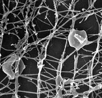
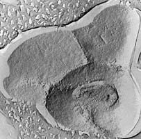
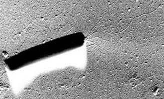
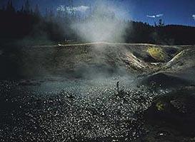
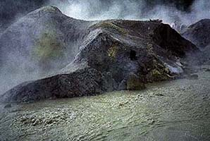

---
aliases:
- Thermoproteota
- Crenarchaeota
title: Crenarchaeota
---

# [[Thermoproteota]] 

   

## Phylogeny 

-   « Ancestral Groups  
    -   [Archaea](../Archaea)
    -   [Tree of Life](../Tree_of_Life.md)

-   ◊ Sibling Groups of  Archaea
    -   Crenarchaeota
    -   [Methanobacteriota](Methanobacteriota.md)

## #has_/text_of_/abstract 

> Thermoproteota are prokaryotes that have been classified as a phylum of the domain Archaea. 
> 
> Initially, the Thermoproteota were thought to be sulfur-dependent extremophiles 
> but recent studies have identified characteristic Thermoproteota environmental rRNA 
> indicating the organisms may be the most abundant archaea in the marine environment. 
> 
> Originally, they were separated from the other archaea based on rRNA sequences; 
> other physiological features, such as lack of histones, have supported this division, 
> although some crenarchaea were found to have histones. 
> 
> Until 2005 all cultured Thermoproteota had been thermophilic or hyperthermophilic organisms, 
> some of which have the ability to grow at up to 113 °C. These organisms stain Gram negative 
> and are morphologically diverse, having rod, cocci, filamentous and oddly-shaped cells. 
> 
> Recent evidence shows that some members of the Thermoproteota are methanogens.
>
> Thermoproteota were initially classified as a part of regnum Eocyta in 1984, 
> but this classification has been discarded. 
> The term "eocyte" now applies to either TACK (formerly **Crenarchaeota**) or to Thermoproteota.
>
> [Wikipedia](https://en.wikipedia.org/wiki/Thermoproteota) 

## Introduction

The kingdom Crenarchaeota has the distinction of including 
microbial species with the highest known growth temperatures of any organisms.

Although they are microscopic, single-celled organisms, 
they flourish under conditions which would quickly kill most \"higher\" organisms. 

As a rule, they grow best between 80° and 100°C, 
and several species will not grow below 80°C. 
Several species also prefer to live under very acidic conditions
in dilute solutions of hot sulfuric acid. 

Approximately 15 genera are known, and most of the hyperthermophilic species 
have been isolated from marine or terrestrial volcanic environments, 
such as hot springs and shallow or deep-sea hydrothermal vents. 
Recent analyses of genetic sequences obtained directly from environomental samples, however,
indicate the existence of low temperature Crenarchaeota, which have not yet been cultivated.

Crenarchaeota comprise one kingdom in the larger domain of Archaea.

Although they are simple, microscopic organisms, 
Archaea are quite distinct from more commonly encountered Bacteria, 
having branched off from the latter very early in evolutionary history 
(probably \>3.5 billion years ago.) 

### Characteristics

The Kingdom Crenarchaeota has been defined phylogenetically, 
based on comparative molecular sequence analyses, 
and its members are therefore primarily defined by sequence similarity. 

However, like all Archaea, Crenarchaeota are prokaryotic, 
and are bounded by ether-linked lipid membranes 
which contain isoprinoid side chains instead of fatty acids.

Cells range in size from cocci \<1µm in diameter to filaments over 100µm in length. 
Species display a wide range of cell shapes, 
including regular cocci clustered in grape-like aggregates (Staphylothermus),
irregular, lobed cells (Sulfolobus), discs (Thermodiscus), 
very thin filaments (\<0.5µm diameter; Thermofilum), 
and almost rectangular rods (Thermoproteus, Pyrobaculum). 

Most species possess flagella and are motile. 
A few members of the Crenarchaeota exhibit strange morphologies:
Pyrodictium produces disk-shaped cells 
connected by extensive networks of proteinaceous fibers 
which may help it to attach to sulfur granules.

Metabolically, Crenarchaeota are quite diverse, 
ranging from chemoorganotrophs to chemolithoautotrophs. 
They are anaerobes, facultative anaerobes or aerobes, 
and many utilize sulfur in some way for energy metabolism. 

Several species are primary producers of organic matter, 
using carbon dioxide as sole carbon source, 
and gaining energy by the oxidation of inorganic substances like sulfur and hydrogen, 
and reduction of sulfur or nitrate. 
Others grow on organic substrates by aerobic or anaerobic respiration or by fermentation.

The most spectacular feature of the Crenarchaeota, however, is their tolerance to, 
and even preference for, extremes of acidity and temperature. 

While many prefer neutral to slightly acidic pH ranges,
members of the crenarchaeal order Sulfolobales flourish at pH 1-2 and die above pH 7. 

Optimum growth temperatures range from 75° to 105°C, 
and the maximum temperature of growth can be as high as 113°C (Pyrobolus).
Most species are unable to grow below 70°C, 
although they can survive for long periods at low temperatures.

Two types of environments where Crenarchaeota thrive: 

Left. Obsidian Pool, in the Mud Volcano area of Yellowstone National Park, 
is a neutral-pH hot spring which contains an unusually wide diversity of Crenarchaeota. 
Note yellow deposits of sulfur on banks. (Photograph by Norm Pace, © 1997.) 

Right. Hot, sulfur-rich, acidic habitats, like this pool in Yellowstone, 
are often home to species of Sulfolobus.
(Photograph by S. Barns, © 1997.)

Surprisingly, recent rRNA sequence-based analyses indicate 
that Crenarchaeota also may be widely distributed in low-temperature environments 
such as ocean waters and terrestrial sediments and soils (Bintrim 1997, DeLong 1994, Furhman 1992, and Hersberger 1996). 

Although none of these organisms have been cultivated to date, 
elements of their rRNA sequences, together with the environments 
from which they were obtained, 
strongly suggest that these organisms are mesophilic (or even psychrophilic). 

Nothing is known of their physiology. 
Quantitation of rRNA abundance in Antarctic ocean waters indicates 
that these novel species may constitute a significant portion of the marine bacterioplankton. 
This, together with the fact that crenarchaeal rRNA sequences have been obtained 
from every low-temperature environment in which they were sought, 
indicates that what were once thought to be obscure organisms 
living in extreme conditions may instead be globally distributed, 
important players in the biosphere. 

### Crenarchaeota aren\'t just for microbiologists\...

These unusual properties of Crenarchaeota 
have attracted the attention of a wide range of scientists, 
including evolutionary biologists, exobiologists and biotechnology companies. 

The extreme conditions under which Crenarchaeota live today 
may be similar to those which existed on the early Earth at the time that life first arose. 
This, together with information about their geneology, 
suggests that these organisms may be much like the earliest lifeforms on earth. 

Photographs of some regions of the surface of Mars suggest 
that large hot spring systems, perhaps containing microbial life, may have once existed there. 

As a result, NASA exobiologists may study these features 
for chemical and fossil remnants of organisms resembling Crenarchaeota. 

Finally, the extreme resistance of crenarchaeal cellular enzymes to heat and acid 
make them very attractive to biotechnology companies, 
several of which are currently developing such enzymes for industrial and research uses. 

### Discussion of Phylogenetic Relationships

Evolutionary relationships between cultivated members of the Crenarchaeota 
have been inferred in several studies 
utilizing small and large subunit ribosomal RNA sequences 
(Barns 1996, Kjems 1992, Burggraf 1997) 

Unfortunately, few sequences for genes other than rRNA 
from more than one crenarchaeal species have been determined to date, 
thus no alternative molecular sequence-based hypotheses are currently available.

However, where analyses overlap, topologies of rRNA-based trees are largely concordant, 
and show division of the kingdom into three main lineages. 

The earliest branch within the kingdom 
contains the genera [[Thermoproteus]], [[Thermofilum]] and [[Pyrobaculum]], 
organisms distinguished by a rod-shaped morphology, neutrophily 
and anaerobiasis or facultative anaerobiasis. 

A second lineage contains the Sulfolobus, Stygiolobus, Acidianus and Metallosphaera genera, 
whose members share coccoid morphology and thermoacidophilic growth. 

The remaining Crenarchaeota cluster into a group comprised of several genera, 
including Pyrodictium, Desulfurococcus, Staphylothermus, Thermodiscus, Aeropyrum, Igneococcus
and Thermosphaera, all of which are coccoid, neutrophilic hyperthermophiles.

Intriguingly, most of the currently available crenarchaeal rRNA sequences 
have been obtained from uncultivated organisms 
through PCR-mediated cloning and sequencing of rDNAs 
directly from mixed-population DNAs extracted from sediments, soils and water samples
(Barns 1996, Bintrim 1997, DeLong 1994, Furhman 1992, McInerney 1995, Hershberger 1996). 

Most of these sequences branch more deeply from the crenarchaeal line of descent 
than do those of cultivated species.

Addition of such sequences to phylogenetic analyses of Crenarchaeota 
do not substantially change apparent relationships between cultivated species. 

However, analysis of these environmental rDNA sequences 
do reveal considerably greater phylogenetic breadth than was previously known for the kingdom. 

## Title Illustrations

  ---------------------------------------

  Scientific Name ::  Pyrodictium
  Comments          Scanning electron micrograph of Pyrodictium cells, connected by a network of protein \"fibers\" (Rieger 1995)
  Copyright ::         © 1997 R. Rachel

---------------------------------------

  Scientific Name ::  Pyrolobus
  Comments          Pyrolobus, the organism with the highest known growth temperature (113°C). Transmission electron micrograph of freeze-etched cells (Bloechl 1997).
  Copyright ::         © 1997 R. Rachel

--------------------------------------------------

  Scientific Name ::  Pyrobaculum
  Comments          Pyrobaculum, a rod-shaped organism with flagella. Transmission electron micrograph of a cell, shodowed with platinum (Voelkl 1993).
  Copyright ::         © 1997 R. Rachel

## Confidential Links & Embeds: 

### #is_/same_as :: [Thermoproteota](/_Standards/bio/bio~Domain/Archaea/Thermoproteota.md) 

### #is_/same_as :: [Thermoproteota.public](/_public/bio/bio~Domain/Archaea/Thermoproteota.public.md) 

### #is_/same_as :: [Thermoproteota.internal](/_internal/bio/bio~Domain/Archaea/Thermoproteota.internal.md) 

### #is_/same_as :: [Thermoproteota.protect](/_protect/bio/bio~Domain/Archaea/Thermoproteota.protect.md) 

### #is_/same_as :: [Thermoproteota.private](/_private/bio/bio~Domain/Archaea/Thermoproteota.private.md) 

### #is_/same_as :: [Thermoproteota.personal](/_personal/bio/bio~Domain/Archaea/Thermoproteota.personal.md) 

### #is_/same_as :: [Thermoproteota.secret](/_secret/bio/bio~Domain/Archaea/Thermoproteota.secret.md)

