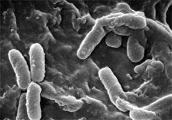
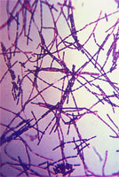

---
aliases:
- Eubacteria
- Bacteria
- bacterium
- bacteria
- is_a_bacteria
code_of_nomenclature: '[[_Standards/WikiData/WD~International_Code_of_Nomenclature_of_Prokaryotes,743780]]'
Commons_category: Bacteria
confidential: public
cssclasses:
- Type
described_by_source:
- '[[_Standards/WikiData/WD~Brockhaus_and_Efron_Encyclopedic_Dictionary,602358]]'
- '[[_Standards/WikiData/WD~The_Nuttall_Encyclopædia,3181656]]'
- '[[_Standards/WikiData/WD~Granat_Encyclopedic_Dictionary,4532138]]'
- "[[_Standards/WikiData/WD~The_New_Student's_Reference_Work,16082057]]"
- '[[_Standards/WikiData/WD~Small_Brockhaus_and_Efron_Encyclopedic_Dictionary,19180675]]'
draft: false
enumerationtype: InfectiousAgentClass
EPPO_Code: 1BACTK
expiryDate: 
has_effect:
- '[[_Standards/WikiData/WD~bacterial_infectious_disease,727028]]'
- '[[_Standards/WikiData/WD~bacterial_pneumonia,3776920]]'
has_id_wikidata: Q10876
homonymous_taxon: '[[_Standards/WikiData/WD~Bacteria,4034791]]'
image: "http://commons.wikimedia.org/wiki/Special:FilePath/E.%20coli%20Bacteria%20%287316101966%29.jpg"
instance_of: '[[_Standards/WikiData/WD~taxon,16521]]'
isDeleted: false
isReadOnly: false
ITIS_TSN: 50
keywords:
- bacteria
Krugosvet_article: nauka_i_tehnika/biologiya/BAKTERII.html
layout: 
license: "CC BY-SA 4.0"
linkTitle: "is_a_bacteria Class"
LPSN_URL: "https://lpsn.dsmz.de/domain/bacteria"
MeSH_tree_code: B03
mode_of_reproduction: '[[_Standards/WikiData/WD~cell_division,188909]]'
OmegaWiki_Defined_Meaning: 302
parent_taxon: '[[_Standards/WikiData/WD~Biota,2382443]]'
publish: true
publishDate: 
start_time: -3500000000-01-01
subclass_of: '[[_Standards/WikiData/WD~microorganism,39833]]'
tags:
- class/Class
- schema-org/Class
- class/infectious_agent
taxonomic_type: '[[_Standards/WikiData/WD~Bacillus,212032]]'
taxon_common_name:
- Bakterien
- Бактерии
- Bakteri
- Bakterije
- Bacteris
- bakterie
- Bakterie
- Bακτήρια
- Bacterium
- Bakterioj
- Bakterid
- Bakteerit
- Bactéries
- Bakteerien
- Baictéir
- Bakterie
- "חיידקים אמיתיים"
- जीवाणु
- Bakterije
- Baktérium
- Բակտերիա
- Bacterios
- Bakteri
- Batteri
- វេត្រាណូ
- 세균
- Bakterijos
- Baktērijas
- Бактерии
- Bakterier
- Bacteriën
- Bacterias
- bakterie
- Bactéria
- Añaki
- Bacterii
- Baktérie
- Bakterije
- Бактерије
- Bakterier
- பாக்டீரியா
- แบคทีเรีย
- Bakterya
- Bakteri
- Бактерії
- "Vi khuẩn"
- באַקטעריעס
- 细菌
- 細菌
- Bakterien
- باکتری
- Бактерии
- بكتيريا
taxon_name: Bacteria
taxon_rank: '[[_Standards/WikiData/WD~domain,146481]]'
title: "is_a_bacteria Class"
topic_s_main_Wikimedia_portal: '[[_Standards/WikiData/WD~Q42353284,42353284]]'
type: Type
UMLS_CUI: C0004611
union_of: '[[_Standards/WikiData/WD~list_of_values_as_qualifiers,23766486]]'
video:
- "http://commons.wikimedia.org/wiki/Special:FilePath/A-Microscope-Automated-Fluidic-System-to-Study-Bacterial-Processes-in-Real-Time-pone.0007282.s002.ogv"
- "http://commons.wikimedia.org/wiki/Special:FilePath/A-Microscope-Automated-Fluidic-System-to-Study-Bacterial-Processes-in-Real-Time-pone.0007282.s003.ogv"
WordLift_URL: "http://data.wordlift.io/wl01714/entity/bacteria"
---

# [[Bacteria]] 

Class of all bacteria.

Tag Instances like this: 
#is_a_/bacteria
#is_an_/infectious_agent

In [[../../schema-org]]: Pathogenic bacteria that cause bacterial infection.

[ #is_/sub_class_of :: [[../InfectiousAgentClass]] ]
[ #is_/enum_of :: [[../InfectiousAgentClass]] ]

#is_/same_as :: [[../../WikiData/WD~Bacteria,10876|WD~Bacteria,10876]] 

     

Eubacteria, also known as true bacteria or simply bacteria, 
are one of the two major domains of prokaryotic microorganisms, the other being [[Archaea]]. 

Eubacteria represent a vast and diverse group of single-celled organisms 
that are found in virtually every environment on Earth. 

They are characterized by their simple cell structure 
lacking a membrane-bound nucleus and other organelles, 
as well as their diverse metabolic capabilities and ecological roles.

## #has_/text_of_/abstract 

> **Bacteria** ( ; sg.: bacterium) are ubiquitous, mostly free-living organisms 
> often consisting of one biological cell. 
> They constitute a large domain of prokaryotic microorganisms. 
> 
> Typically a few micrometres in length, bacteria were 
> among the first life forms to appear on Earth, and are present in most of its habitats. 
> 
> Bacteria inhabit the air, soil, water, acidic hot springs, radioactive waste, 
> and the deep biosphere of Earth's crust. 
> 
> Bacteria play a vital role in many stages of the nutrient cycle 
> by recycling nutrients and the fixation of nitrogen from the atmosphere. 
> 
> The nutrient cycle includes the decomposition of dead bodies; 
> bacteria are responsible for the putrefaction stage in this process. 
> 
> In the biological communities surrounding hydrothermal vents and cold seeps, 
> extremophile bacteria provide the nutrients needed to sustain life 
> by converting dissolved compounds, such as hydrogen sulphide and methane, to energy. 
> 
> Bacteria also live in mutualistic, commensal and parasitic relationships with plants and animals. 
> Most bacteria have not been characterised 
> and there are many species that cannot be grown in the laboratory. 
> The study of bacteria is known as bacteriology, a branch of microbiology.
>
> Like all animals, humans carry vast numbers (approximately 10^13 to 10^14) of bacteria. 
> Most are in the gut, though there are many on the skin. 
> Most of the bacteria in and on the body are harmless or rendered so 
> by the protective effects of the immune system, 
> and many are beneficial, particularly the ones in the gut. 
> 
> However, several species of bacteria are pathogenic and cause infectious diseases, 
> including cholera, syphilis, anthrax, leprosy, tuberculosis, tetanus and bubonic plague. 
> 
> The most common fatal bacterial diseases are respiratory infections. 
> Antibiotics are used to treat bacterial infections and are also used in farming, 
> making antibiotic resistance a growing problem. 
> 
> Bacteria are important in sewage treatment and the breakdown of oil spills, 
> the production of cheese and yogurt through fermentation, 
> the recovery of gold, palladium, copper and other metals in the mining sector 
> (biomining, bioleaching), as well as in biotechnology, 
> and the manufacture of antibiotics and other chemicals.
>
> Once regarded as plants constituting the class Schizomycetes ("fission fungi"), 
> bacteria are now classified as prokaryotes. 
> 
> Unlike cells of animals and other eukaryotes, bacterial cells contain circular chromosomes, 
> do not contain a nucleus and rarely harbour membrane-bound organelles. 
> 
> Although the term bacteria traditionally included all prokaryotes, 
> the scientific classification changed after the discovery in the 1990s 
> that prokaryotes consist of two very different groups of organisms 
> that evolved from an ancient common ancestor. 
> 
> These evolutionary domains are called Bacteria and Archaea. 
> Unlike Archaea, bacteria contain ester-linked lipids in the cell membrane, 
> are resistant to diphtheria toxin, use formylmethionine in protein synthesis initiation, 
> and have numerous genetic differences, including a different 16S rRNA.
>
> [Wikipedia](https://en.wikipedia.org/wiki/Bacteria) 

## Characteristics

Here are some key features and characteristics of Eubacteria:
### Cell Structure: 
Eubacteria are prokaryotic cells, meaning they lack a membrane-bound nucleus 
and other membrane-bound organelles such as mitochondria and chloroplasts. 
Their genetic material, typically in the form of a __circular chromosome__, 
is located in the nucleoid region of the cell.

### Cell Wall Composition: 
Most Eubacteria have a cell wall composed of __peptidoglycan__, 
a unique polymer that provides structural support and protection to the cell. 
The composition and structure of the cell wall 
can vary among different groups of bacteria and can be a key factor in bacterial classification.

### Metabolic Diversity: 
Eubacteria exhibit a wide range of metabolic capabilities, 
including aerobic respiration, anaerobic respiration, fermentation, and photosynthesis. 
They can obtain energy from various sources, 
including organic compounds, inorganic chemicals, and sunlight.

### Ecological Roles: 
Eubacteria play crucial roles in various ecosystems and are involved in nutrient cycling, 
decomposition, and symbiotic relationships with other organisms. 
They can be found in diverse habitats, including soil, water, air, and living organisms, 
and can colonize extreme environments such as hot springs, deep-sea vents, and acidic lakes.

### Pathogenicity: 
While many Eubacteria are harmless or beneficial to humans and other organisms, 
some species are pathogens that can cause diseases in plants, animals, and humans. 
Examples of pathogenic bacteria include Escherichia coli, Salmonella, Staphylococcus aureus, 
and Mycobacterium tuberculosis.

## Classification: 

There is a great deal of diversity in the domain [Bacteria](https://en.wikipedia.org/wiki/Bacteria "Bacteria"). 
That diversity is further confounded by the [exchange of genes](https://en.wikipedia.org/wiki/Horizontal_gene_transfer "Horizontal gene transfer") between different bacterial lineages. 
The occurrence of duplicate genes between otherwise distantly-related bacteria 
makes it nearly impossible to distinguish bacterial species, count the bacterial species on the Earth, 
or organize them into a tree-like structure

Eubacteria are classified into numerous phyla, classes, orders, families, genera, and species 
based on their genetic, morphological, physiological, and ecological characteristics. 
Some of the major phyla of Eubacteria include Proteobacteria, Firmicutes, Actinobacteria, Bacteroidetes, Cyanobacteria, and others.

Overall, Eubacteria represent a diverse and ecologically important group of microorganisms 
with significant impacts on the environment, human health, and biotechnological applications.

## Phylogeny 

-   « Ancestral Groups  
    -   [Tree of Life](Tree_of_Life.md)

-   ◊ Sibling Groups of  Life on Earth
    -   Eubacteria
    -  [Eukarya](Eukarya.md))
    -   [Archaea](Archaea)
    -   [Virus](Virus.md)

-   » Sub-Groups

    -   [Aquificae](Aquificae.md)
    -   [Thermotogae](Thermotogae.md)
    -   [Thermodesulfobacteria](Thermodesulfobacteria.md)
    -   [Chrysiogenes arsenatis](Chrysiogenes_arsenatis)
    -   [Nitrospira](Nitrospira.md)
    -   [Deferribacteres](Deferribacteres.md)
    -   [Chloroflexi](Chloroflexi.md)
    -   [Thermomicrobium](Thermomicrobium.md)
    -   [Fibrobacteres](Fibrobacteres.md)
    -   [Proteobacteria](Proteobacteria.md)
    -   [Planctomycetes](Planctomycetes.md)
    -   [Chlamydiae](Chlamydiae.md)
    -   [Spirochaetes](Spirochaetes.md)
    -   [Bacteroidetes](Bacteroidetes.md)
    -   [Chlorobi](Chlorobi.md)
    -   [Actinobacteria](Actinobacteria.md)
    -   [Deinococcus-Thermus](Deinococcus-Thermus.md)
    -   [Cyanobacteria](Cyanobacteria.md)
    -   [Firmicutes](Firmicutes.md)
    -   [Fusobacteria](Fusobacteria.md)
    -   [Verrucomicrobia](Verrucomicrobia.md)
    -   [Acidobacteria](Acidobacteria.md)
    -   [Dictyoglomi](Dictyoglomi.md)
    -   [Gemmatimonas aurantiaca](Gemmatimonas_aurantiaca)

## Title Illustrations

--------------------------

Scientific Name ::     Enterococcus
Comments             Scanning Electron Micrograph of Enterococcus
Creator              CDC/Janice Carr
Specimen Condition   Dead Specimen
Source Collection    [Public Health Image Library](http://phil.cdc.gov/Phil/default.asp)

--------------------------

Scientific Name ::     Pseudomonas aeruginosa
Comments             Scanning Electron Micrograph of Pseudomonas aeruginosa
Creator              CDC/Janice Carr
Specimen Condition   Dead Specimen
Source Collection    [Public Health Image Library](http://phil.cdc.gov/Phil/default.asp)

--------------------------

Scientific Name ::     Bacillus anthracis
Comments             A photomicrograph of the Anthrax bacterium, Bacillus anthracis, using Gram stain technique
Specimen Condition   Dead Specimen
Source Collection    [Public Health Image Library](http://phil.cdc.gov/Phil/default.asp)
  
  

## Confidential Links & Embeds: 

### #is_/same_as :: [Bacteria](/_Standards/bio/bio~Domain/Bacteria.md) 

### #is_/same_as :: [Bacteria.public](/_public/bio/bio~Domain/Bacteria.public.md) 

### #is_/same_as :: [Bacteria.internal](/_internal/bio/bio~Domain/Bacteria.internal.md) 

### #is_/same_as :: [Bacteria.protect](/_protect/bio/bio~Domain/Bacteria.protect.md) 

### #is_/same_as :: [Bacteria.private](/_private/bio/bio~Domain/Bacteria.private.md) 

### #is_/same_as :: [Bacteria.personal](/_personal/bio/bio~Domain/Bacteria.personal.md) 

### #is_/same_as :: [Bacteria.secret](/_secret/bio/bio~Domain/Bacteria.secret.md)

