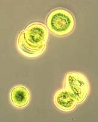
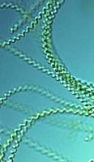

---
aliases:
- Algat jeshile-blu
- algă albastră-verde
- Anqas añaki
- Blaualge
- blauwalgen
- blue-green algae
- Blágerlar
- Blä algen
- blågrønnbakterier
- Cianabaictéir
- cianobacteri
- Cianobacterias
- cianobakterije
- cianobakterio
- cianobaktériumok
- Cyanobacteria
- cyanobakteriar
- Cyanobakterie
- Cyanobakterien
- Cyanobakterier
- Cïanobakterïyalar
- Göy-yaşıl yosunlar
- Koʻk-yashil suvoʻtlar
- melsvabakterės
- Modrozelene bakterije
- Nâ-sè-khún
- Sianobakterie
- Sianôbakteria
- sinice
- Siyanobakteri
- Siyanobakteriya
- syanobakteerit
- Syanobakteri
- tsüanobakterid
- Vi khuẩn lam
- Zianobakterio
- Zilaļģes
- čuovjisbaktereh
- Κυανοβακτήρια
- Көкжашыл балырлар
- модрозелене бактерије
- ціанобактерії
- Цијанобактерии
- цианобактерии
- Цианобактериялар
- цыанабактэрыі
- Ցիանոբակտերիաներ
- כחוליות
- بكتيريا زرقاء
- تسىيانوباكتەرىييالار
- سائنوبئڪٽيريا
- ساينوباکتريا (د باکتريا يو ډول دی چې شين اسماني رنګ لري)
- سیانوباکتر
- नील हरित शैवाल
- সায়ানোব্যাকটেরিয়া
- ਨੀਲ ਹਰੀ ਕਾਈ
- நீலப்பச்சைப்பாசி
- സയനോബാക്ടീരിയ
- සයනොබැක්ටීරියා
- สาหร่ายสีเขียวแกมน้ำเงิน
- ლურჯ-მწვანე წყალმცენარეები
- ሰማያዊ አረንጓዴአማ ዋቅላሚዎች
- 蓝菌门
- 藍菌門
- 藍藻
- 남조류
title: Cyanobacteria
has_id_wikidata: Q93315
dv_has_:
  name_:
    af: Sianobakterie
    am: ሰማያዊ አረንጓዴአማ ዋቅላሚዎች
    an: Cyanobacteria
    ar: بكتيريا زرقاء
    arz: بكتيريا زرقاء
    ast: Cyanobacteria
    az: Göy-yaşıl yosunlar
    be: цыанабактэрыі
    bg: цианобактерии
    bn: সায়ানোব্যাকটেরিয়া
    bs: Cyanobacteria
    ca: cianobacteri
    ceb: Cyanobacteria
    cs: sinice
    da: Cyanobakterie
    de: Cyanobakterien
    el: Κυανοβακτήρια
    en: Cyanobacteria
    eo: cianobakterio
    es: Cyanobacteria
    et: tsüanobakterid
    eu: Zianobakterio
    ext: Cyanobacteria
    fa: سیانوباکتر
    fi: syanobakteerit
    fr: Cyanobacteria
    frr: Blä algen
    ga: Cianabaictéir
    gl: Cianobacterias
    he: כחוליות
    hi: नील हरित शैवाल
    hr: Cyanobacteria
    ht: Syanobakteri
    hu: cianobaktériumok
    hy: Ցիանոբակտերիաներ
    ia: Cyanobacteria
    id: Cyanobacteria
    ie: Cyanobacteria
    io: Cyanobacteria
    is: Blágerlar
    it: Cyanobacteria
    ja: 藍藻
    jv: Cyanobacteria
    ka: ლურჯ-მწვანე წყალმცენარეები
    kk: Цианобактериялар
    kk_arab: تسىيانوباكتەرىييالار
    kk-cn: تسىيانوباكتەرىييالار
    kk_cyrl: Цианобактериялар
    kk-kz: Цианобактериялар
    kk_latn: Cïanobakterïyalar
    kk-tr: Cïanobakterïyalar
    ko: 남조류
    ky: Көкжашыл балырлар
    la: Cyanobacteria
    lt: melsvabakterės
    lv: Zilaļģes
    mg: Sianôbakteria
    mk: Цијанобактерии
    ml: സയനോബാക്ടീരിയ
    mul: Cyanobacteria
    nan: Nâ-sè-khún
    nb: blågrønnbakterier
    nl: blauwalgen
    nn: cyanobakteriar
    oc: Cyanobacteria
    pa: ਨੀਲ ਹਰੀ ਕਾਈ
    pl: sinice
    ps: ساينوباکتريا (د باکتريا يو ډول دی چې شين اسماني رنګ لري)
    pt: Cyanobacteria
    pt_br: Cyanobacteria
    qu: Anqas añaki
    ro: algă albastră-verde
    ru: цианобактерии
    sco: Cyanobacteria
    sd: سائنوبئڪٽيريا
    sh: Cyanobacteria
    si: සයනොබැක්ටීරියා
    sk: Sinice
    sl: cianobakterije
    smn: čuovjisbaktereh
    so: Siyanobakteriya
    sq: Algat jeshile-blu
    sr: модрозелене бактерије
    sr_ec: Модрозелене бактерије
    sr_el: Modrozelene bakterije
    sv: Cyanobakterier
    ta: நீலப்பச்சைப்பாசி
    th: สาหร่ายสีเขียวแกมน้ำเงิน
    tl: Cyanobacteria
    tr: Siyanobakteri
    uk: ціанобактерії
    uz: Koʻk-yashil suvoʻtlar
    vi: Vi khuẩn lam
    vo: Cyanobacteria
    war: Cyanobacteria
    wuu: 蓝菌门
    yue: 藍菌門
    zh: 藍菌門
    zh_cn: 蓝菌门
    zh_hans: 蓝菌门
    zh_hant: 藍菌門
    zh_hk: 藍菌門
    zh_sg: 蓝菌门
    zh_tw: 藍菌門
---

# [[Cyanobacteria]] 

#is_a/bio-Phylum  
#is_a :: [[../../../Taxon_Rank/bio~Kingdom/bio~Phylum|bio~Phylum]]  

   

## #has_/text_of_/abstract 

> **Cyanobacteria** ( sy-AN-oh-bak-TEER-ee-ə) are a group of autotrophic gram-negative bacteria 
> that can obtain biological energy via oxygenic photosynthesis. 
> 
> The name "cyanobacteria" (from Ancient Greek  κύανος (kúanos) 'blue') 
> refers to their bluish green (cyan) color, 
> which forms the basis of cyanobacteria's informal common name, blue-green algae.
>
> Cyanobacteria are probably the most numerous taxon to have ever existed on Earth 
> and the first organisms known to have produced oxygen, 
> having appeared in the middle Archean eon and apparently originated in a freshwater or terrestrial environment. 
> 
> Their photopigments can absorb the red- and blue-spectrum frequencies of sunlight 
> (thus reflecting a greenish color) to split water molecules into hydrogen ions and oxygen. 
> The hydrogen ions are used to react with carbon dioxide 
> to produce complex organic compounds such as carbohydrates (a process known as carbon fixation), 
> and the oxygen is released as a byproduct. 
> 
> By continuously producing and releasing oxygen over billions of years, cyanobacteria are thought to have 
> converted the early Earth's anoxic, weakly reducing prebiotic atmosphere, 
> into an oxidizing one with free gaseous oxygen 
> (which previously would have been immediately removed by various surface reductants), 
> resulting in the Great Oxidation Event and the "rusting of the Earth" during the early Proterozoic, 
> dramatically changing the composition of life forms on Earth. 
> The subsequent adaptation of early single-celled organisms to survive in oxygenous environments 
> likely had led to endosymbiosis between anaerobes and aerobes, 
> and hence the evolution of eukaryotes during the Paleoproterozoic.
>
> Cyanobacteria use photosynthetic pigments such as various forms of chlorophyll, carotenoids, 
> phycobilins to convert the photonic energy in sunlight to chemical energy. 
> Unlike heterotrophic prokaryotes, cyanobacteria have internal membranes. 
> These are flattened sacs called thylakoids where photosynthesis is performed. 
> Photoautotrophic eukaryotes such as red algae, green algae and plants 
> perform photosynthesis in chlorophyllic organelles that are thought to have their ancestry in cyanobacteria, 
> acquired long ago via endosymbiosis. 
> These endosymbiont cyanobacteria in eukaryotes then evolved 
> and differentiated into specialized organelles 
> such as chloroplasts, chromoplasts, etioplasts, and leucoplasts, collectively known as plastids.
>
> Sericytochromatia, the proposed name of the paraphyletic and most basal group, 
> is the ancestor of both the non-photosynthetic group Melainabacteria 
> and the photosynthetic cyanobacteria, also called Oxyphotobacteria.
>
> The cyanobacteria Synechocystis and Cyanothece are important model organisms 
> with potential applications in biotechnology for bioethanol production, food colorings, 
> as a source of human and animal food, dietary supplements and raw materials. 
> 
> Cyanobacteria produce a range of toxins known as cyanotoxins 
> that can cause harmful health effects in humans and animals.
>
> [Wikipedia](https://en.wikipedia.org/wiki/Cyanobacteria) 

## Phylogeny 

-   « Ancestral Groups  
    -   [Bacteria](../../Bacteria.md)
    -   [Tree of Life](../../Tree_of_Life.md)

-   ◊ Sibling Groups of  Eubacteria
    -   [Aquificae](../Pseudomonadati/Aquificae.md)
    -   [Thermotogae](../Thermotogati/Thermotogota/Thermotogae.md)
    -   [Thermodesulfobacteria](../Pseudomonadati/Thermodesulfobacteria.md)
    -   [Chrysiogenes arsenatis](Chrysiogenes_arsenatis)
    -   [Nitrospira](../Pseudomonadati/Nitrospira.md)
    -   [Deferribacteres](../Pseudomonadati/Deferribacteres.md)
    -   [Chloroflexi](Chloroflexota/Chloroflexi.md)
    -   [Thermomicrobium](../Pseudomonadati/Thermomicrobium.md)
    -   [Fibrobacteres](../Pseudomonadati/Fibrobacteres.md)
    -   [Proteobacteria](../Pseudomonadati/Proteobacteria.md)
    -   [Planctomycetes](../Pseudomonadati/Planctomycetes.md)
    -   [Chlamydiae](../Pseudomonadati/Chlamydiae.md)
    -   [Spirochaetes](../Pseudomonadati/Spirochaetes.md)
    -   [Bacteroidetes](../Pseudomonadati/Bacteroidetes.md)
    -   [Chlorobi](../Pseudomonadati/Chlorobi.md)
    -   [Actinobacteria](Actinobacteria.md)
    -   [Deinococcus-Thermus](../Thermotogati/Thermotogota/Thermotogae/Deinococcus-Thermus.md)
    -   Cyanobacteria
    -   [Bacillota](Bacillota.md)
    -   [Fusobacteria](Fusobacteria.md)
    -   [Verrucomicrobia](../Pseudomonadati/Verrucomicrobia.md)
    -   [Acidobacteria](../Pseudomonadati/Acidobacteria.md)
    -   [Dictyoglomi](../Pseudomonadati/Dictyoglomi.md)
    -   [Gemmatimonas aurantiaca](Gemmatimonas_aurantiaca)

-   » Sub-Groups 
	-   *Subsection I*
	    -   *Chamaesiphon*
	    -   *Chroococcus*
	    -   *Cyanobacterium*
	    -   *Cyanobium*
	    -   *Cyanothece*
	    -   *Dactylococcopsis*
	    -   *Gloeobacter*
	    -   *Gloeocapsa*
	    -   *Gloeothece*
	    -   *Microcystis*
	    -   *Prochlorococcus*
	    -   *Prochloron*
	    -   *Synechococcus*
	    -   *Synechocystis*
	-   *Subsection II*
	    -   *Cyanocystis*
	    -   *Dermocarpella*
	    -   *Stanieria*
	    -   *Xenococcus*
	    -   *Chroococcidiopsis*
	    -   *Myxosarcina*
	    -   *Pleurocapsa*
	-   *Subsection III*
	    -   *Arthrospira*
	    -   *Borzia*
	    -   *Crinalium*
	    -   *Geitlerinema*
	    -   *Halospirulina*
	    -   *Leptolyngbya*
	    -   *Limnothrix*
	    -   *Lyngbya*
	    -   *Microcoleus*
	    -   *Oscillatoria*
	    -   *Planktothrix*
	    -   *Prochlorothrix*
	    -   *Pseudanabaena*
	    -   *Spirulina*
	    -   *Starria*
	    -   *Symploca*
	    -   *Trichodesmium*
	    -   *Tychonema*
	-   *Subsection IV*
	    -   *Anabaena*
	    -   *Anabaenopsis*
	    -   *Aphanizomenon*
	    -   *Calothrix*
	    -   *Cyanospira*
	    -   *Cylindrospermopsis*
	    -   *Cylindrospermum*
	    -   *Nodularia*
	    -   *Nostoc*
	    -   *Rivularia*
	    -   *Scytonema*
	    -   *Tolypothrix*
	-   *Subsection V*
	    -   *Chlorogloeopsis*
	    -   *Fischerella*
	    -   *Geitleria*
	    -   *Iyengariella*
	    -   *Nostochopsis*
	    -   *Stigonema*

## Confidential Links & Embeds: 

### #is_/same_as :: [[/_Standards/bio/bio~Domain/Bacteria/Bacillati/Cyanobacteria|Cyanobacteria]] 

### #is_/same_as :: [[/_public/bio/bio~Domain/Bacteria/Bacillati/Cyanobacteria.public|Cyanobacteria.public]] 

### #is_/same_as :: [[/_internal/bio/bio~Domain/Bacteria/Bacillati/Cyanobacteria.internal|Cyanobacteria.internal]] 

### #is_/same_as :: [[/_protect/bio/bio~Domain/Bacteria/Bacillati/Cyanobacteria.protect|Cyanobacteria.protect]] 

### #is_/same_as :: [[/_private/bio/bio~Domain/Bacteria/Bacillati/Cyanobacteria.private|Cyanobacteria.private]] 

### #is_/same_as :: [[/_personal/bio/bio~Domain/Bacteria/Bacillati/Cyanobacteria.personal|Cyanobacteria.personal]] 

### #is_/same_as :: [[/_secret/bio/bio~Domain/Bacteria/Bacillati/Cyanobacteria.secret|Cyanobacteria.secret]] 

