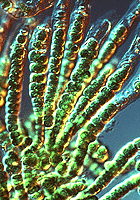
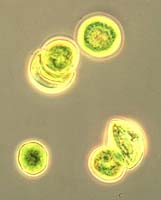
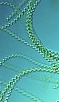

---
aliases:
- "blue-green algae"
- Blaualge
- Cyanobacteria
title: Cyanobacteria
---

# [[Cyanobacteria]] 

   

## #has_/text_of_/abstract 

> **Cyanobacteria** ( sy-AN-oh-bak-TEER-ee-ə) are a group of autotrophic gram-negative bacteria 
> that can obtain biological energy via oxygenic photosynthesis. 
> 
> The name "cyanobacteria" (from Ancient Greek  κύανος (kúanos) 'blue') 
> refers to their bluish green (cyan) color, 
> which forms the basis of cyanobacteria's informal common name, blue-green algae.
>
> Cyanobacteria are probably the most numerous taxon to have ever existed on Earth and the first organisms known to have produced oxygen, having appeared in the middle Archean eon and apparently originated in a freshwater or terrestrial environment. Their photopigments can absorb the red- and blue-spectrum frequencies of sunlight (thus reflecting a greenish color) to split water molecules into hydrogen ions and oxygen. The hydrogen ions are used to react with carbon dioxide to produce complex organic compounds such as carbohydrates (a process known as carbon fixation), and the oxygen is released as a byproduct. By continuously producing and releasing oxygen over billions of years, cyanobacteria are thought to have converted the early Earth's anoxic, weakly reducing prebiotic atmosphere, into an oxidizing one with free gaseous oxygen (which previously would have been immediately removed by various surface reductants), resulting in the Great Oxidation Event and the "rusting of the Earth" during the early Proterozoic, dramatically changing the composition of life forms on Earth. The subsequent adaptation of early single-celled organisms to survive in oxygenous environments likely had led to endosymbiosis between anaerobes and aerobes, and hence the evolution of eukaryotes during the Paleoproterozoic.
>
> Cyanobacteria use photosynthetic pigments such as various forms of chlorophyll, carotenoids, phycobilins to convert the photonic energy in sunlight to chemical energy. Unlike heterotrophic prokaryotes, cyanobacteria have internal membranes. These are flattened sacs called thylakoids where photosynthesis is performed. Photoautotrophic eukaryotes such as red algae, green algae and plants perform photosynthesis in chlorophyllic organelles that are thought to have their ancestry in cyanobacteria, acquired long ago via endosymbiosis. These endosymbiont cyanobacteria in eukaryotes then evolved and differentiated into specialized organelles such as chloroplasts, chromoplasts, etioplasts, and leucoplasts, collectively known as plastids.
>
> Sericytochromatia, the proposed name of the paraphyletic and most basal group, is the ancestor of both the non-photosynthetic group Melainabacteria and the photosynthetic cyanobacteria, also called Oxyphotobacteria.
>
> The cyanobacteria Synechocystis and Cyanothece are important model organisms with potential applications in biotechnology for bioethanol production, food colorings, as a source of human and animal food, dietary supplements and raw materials. Cyanobacteria produce a range of toxins known as cyanotoxins that can cause harmful health effects in humans and animals.
>
> [Wikipedia](https://en.wikipedia.org/wiki/Cyanobacteria) 

## Phylogeny 

-   « Ancestral Groups  
    -   [Bacteria](../Bacteria.md)
    -   [Tree of Life](../Tree_of_Life.md)

-   ◊ Sibling Groups of  Eubacteria
    -   [Aquificae](Aquificae.md)
    -   [Thermotogae](Thermotogae.md)
    -   [Thermodesulfobacteria](Thermodesulfobacteria.md)
    -   [Chrysiogenes arsenatis](Chrysiogenes_arsenatis)
    -   [Nitrospira](Nitrospira.md)
    -   [Deferribacteres](Deferribacteres.md)
    -   [Chloroflexi](Chloroflexi.md)
    -   [Thermomicrobium](Thermomicrobium.md)
    -   [Fibrobacteres](Fibrobacteres.md)
    -   [Proteobacteria](Proteobacteria.md)
    -   [Planctomycetes](Planctomycetes.md)
    -   [Chlamydiae](Chlamydiae.md)
    -   [Spirochaetes](Spirochaetes.md)
    -   [Bacteroidetes](Bacteroidetes.md)
    -   [Chlorobi](Chlorobi.md)
    -   [Actinobacteria](Actinobacteria.md)
    -   [Deinococcus-Thermus](Deinococcus-Thermus.md)
    -   Cyanobacteria
    -   [Firmicutes](Firmicutes.md)
    -   [Fusobacteria](Fusobacteria.md)
    -   [Verrucomicrobia](Verrucomicrobia.md)
    -   [Acidobacteria](Acidobacteria.md)
    -   [Dictyoglomi](Dictyoglomi.md)
    -   [Gemmatimonas aurantiaca](Gemmatimonas_aurantiaca)

-   » Sub-Groups 
	-   *Subsection I*
	    -   *Chamaesiphon*
	    -   *Chroococcus*
	    -   *Cyanobacterium*
	    -   *Cyanobium*
	    -   *Cyanothece*
	    -   *Dactylococcopsis*
	    -   *Gloeobacter*
	    -   *Gloeocapsa*
	    -   *Gloeothece*
	    -   *Microcystis*
	    -   *Prochlorococcus*
	    -   *Prochloron*
	    -   *Synechococcus*
	    -   *Synechocystis*
	-   *Subsection II*
	    -   *Cyanocystis*
	    -   *Dermocarpella*
	    -   *Stanieria*
	    -   *Xenococcus*
	    -   *Chroococcidiopsis*
	    -   *Myxosarcina*
	    -   *Pleurocapsa*
	-   *Subsection III*
	    -   *Arthrospira*
	    -   *Borzia*
	    -   *Crinalium*
	    -   *Geitlerinema*
	    -   *Halospirulina*
	    -   *Leptolyngbya*
	    -   *Limnothrix*
	    -   *Lyngbya*
	    -   *Microcoleus*
	    -   *Oscillatoria*
	    -   *Planktothrix*
	    -   *Prochlorothrix*
	    -   *Pseudanabaena*
	    -   *Spirulina*
	    -   *Starria*
	    -   *Symploca*
	    -   *Trichodesmium*
	    -   *Tychonema*
	-   *Subsection IV*
	    -   *Anabaena*
	    -   *Anabaenopsis*
	    -   *Aphanizomenon*
	    -   *Calothrix*
	    -   *Cyanospira*
	    -   *Cylindrospermopsis*
	    -   *Cylindrospermum*
	    -   *Nodularia*
	    -   *Nostoc*
	    -   *Rivularia*
	    -   *Scytonema*
	    -   *Tolypothrix*
	-   *Subsection V*
	    -   *Chlorogloeopsis*
	    -   *Fischerella*
	    -   *Geitleria*
	    -   *Iyengariella*
	    -   *Nostochopsis*
	    -   *Stigonema*

## Confidential Links & Embeds: 

### #is_/same_as :: [Cyanobacteria](/_Standards/bio/bio~Domain/Bacteria/Cyanobacteria.md) 

### #is_/same_as :: [Cyanobacteria.public](/_public/bio/bio~Domain/Bacteria/Cyanobacteria.public.md) 

### #is_/same_as :: [Cyanobacteria.internal](/_internal/bio/bio~Domain/Bacteria/Cyanobacteria.internal.md) 

### #is_/same_as :: [Cyanobacteria.protect](/_protect/bio/bio~Domain/Bacteria/Cyanobacteria.protect.md) 

### #is_/same_as :: [Cyanobacteria.private](/_private/bio/bio~Domain/Bacteria/Cyanobacteria.private.md) 

### #is_/same_as :: [Cyanobacteria.personal](/_personal/bio/bio~Domain/Bacteria/Cyanobacteria.personal.md) 

### #is_/same_as :: [Cyanobacteria.secret](/_secret/bio/bio~Domain/Bacteria/Cyanobacteria.secret.md)

