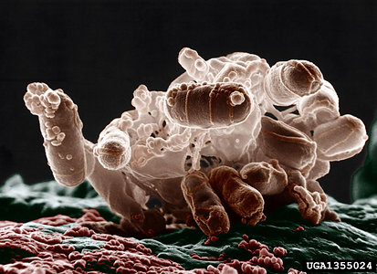

-   « Ancestral Groups 
    -   [Bacteria](../Bacteria.md)
    -   [Tree of Life](../Tree_of_Life.md)

-   ◊ Sibling Groups of  Eubacteria
    -   [Aquificae](Aquificae.md)
    -   [Thermotogae](Thermotogae.md)
    -   [Thermodesulfobacteria](Thermodesulfobacteria.md)
    -   [Chrysiogenes arsenatis](Chrysiogenes_arsenatis)
    -   [Nitrospira](Nitrospira.md)
    -   [Deferribacteres](Deferribacteres.md)
    -   [Chloroflexi](Chloroflexi.md)
    -   [Thermomicrobium](Thermomicrobium.md)
    -   [Fibrobacteres](Fibrobacteres.md)
    -   Proteobacteria
    -   [Planctomycetes](Planctomycetes.md)
    -   [Chlamydiae](Chlamydiae.md)
    -   [Spirochaetes](Spirochaetes.md)
    -   [Bacteroidetes](Bacteroidetes.md)
    -   [Chlorobi](Chlorobi.md)
    -   [Actinobacteria](Actinobacteria.md)
    -   [Deinococcus-Thermus](Deinococcus-Thermus.md)
    -   [Cyanobacteria](Cyanobacteria.md)
    -   [Firmicutes](Firmicutes.md)
    -   [Fusobacteria](Fusobacteria.md)
    -   [Verrucomicrobia](Verrucomicrobia.md)
    -   [Acidobacteria](Acidobacteria.md)
    -   [Dictyoglomi](Dictyoglomi.md)
    -   [Gemmatimonas aurantiaca](Gemmatimonas_aurantiaca)

-   » Sub-Groups
    -   [alpha Proteobacteria](alpha_Proteobacteria)
    -   [delta Proteobacteria](delta_Proteobacteria)

# Proteobacteria 

-   *[alpha     Proteobacteria](alpha_Proteobacteria)*
-   *beta Proteobacteria*
-   *gamma Proteobacteria*
-   *[delta     Proteobacteria](delta_Proteobacteria)*
-   *epsilon Proteobacteria*

Containing group: [Bacteria](../Bacteria.md)

### Information on the Internet

-   [CGSC: E. coli Genetic Stock     Center](http://cgsc.biology.yale.edu/top.html). Provides access to a
    database of E. coli genetic information. Yale University.

### References

Garrity, G. M., J. A. Bell, and T. G. Lilburn. 2004. Taxonomic Outline
of the Prokaryotes. Bergey\'s Manual of Systematic Bacteriology, Second
Edition. Release 5.0.

Woese, C. R. 1987. Bacterial evolution. Microbiol. Rev. 51:221--271.

Woese, C. R., E. Stackebrandt, T. J. Macke, and G. E. Fox. 1985. A
phylogenetic definition of the major eubacterial taxa. Syst. Appl.
Microbiol. 6:143--151.

##### Title Illustrations



  ----------------------------------------------
  Scientific Name ::     Escherichia coli
  Comments             Colorized low-temperature electron micrograph of a cluster bacteria. Individual bacteria in this photo are oblong and colored brown.
  Acknowledgements     Photograph courtesy [InsectImages.org](http://www.insectimages.org/) (#1355024), Colorization by Christopher Pooley
  Specimen Condition   Dead Specimen
  Source Collection    [InsectImages.org](http://www.insectimages.org/)
  Copyright ::            © 2005 Eric Erbe, USDA ARS
  ----------------------------------------------
