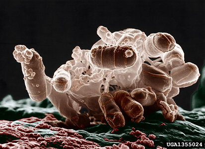

---
aliases:
  - Pseudomonadota
  - Proteobacteria
title: Proteobacteria
---

# [[Proteobacteria]] 

#is_a/bio-Phylum  
#is_a :: [[../../../Taxon_Rank/bio~Kingdom/bio~Phylum|bio~Phylum]]  

## #has_/text_of_/abstract 

> Pseudomonadota (synonym "Proteobacteria") is a major phylum of gram-negative bacteria. 
> Currently, they are considered the predominant phylum within the domain of bacteria. 
> 
> They are naturally found as pathogenic and free-living (non-parasitic) genera. 
> The phylum comprises six classes Acidithiobacillia, Alphaproteobacteria, Betaproteobacteria, Gammaproteobacteria, Hydrogenophilia, and Zetaproteobacteria. 
> The Pseudomonadota are widely diverse, 
> with differences in morphology, metabolic processes, relevance to humans, and ecological influence.
>
> [Wikipedia](https://en.wikipedia.org/wiki/Pseudomonadota)

## Phylogeny 

-   « Ancestral Groups  
    -   [Bacteria](../../Bacteria.md)
    -   [Tree of Life](../../Tree_of_Life.md)

-   ◊ Sibling Groups of  Eubacteria
    -   [Aquificae](Pseudomonadati/Aquificae.md)
    -   [Thermotogae](../Thermotogati/Thermotogota/Thermotogae.md)
    -   [Thermodesulfobacteria](Thermodesulfobacteria.md)
    -   [Chrysiogenes arsenatis](Chrysiogenes_arsenatis)
    -   [Nitrospira](Nitrospira.md)
    -   [Deferribacteres](Deferribacteres.md)
    -   [Chloroflexi](../Bacillati/Chloroflexota/Chloroflexi.md)
    -   [Thermomicrobium](Thermomicrobium.md)
    -   [Fibrobacteres](Fibrobacteres.md)
    -   Proteobacteria
    -   [Planctomycetes](Planctomycetes.md)
    -   [Chlamydiae](Pseudomonadati/Chlamydiae.md)
    -   [Spirochaetes](Spirochaetes.md)
    -   [Bacteroidetes](Pseudomonadati/Bacteroidetes.md)
    -   [Chlorobi](Pseudomonadati/Chlorobi.md)
    -   [Actinobacteria](Bacillati/Actinobacteria.md)
    -   [Deinococcus-Thermus](../Thermotogati/Thermotogota/Thermotogae/Deinococcus-Thermus.md)
    -   [Cyanobacteria](Bacillati/Cyanobacteria.md)
    -   [Bacillota](../Bacillati/Bacillota.md)
    -   [Fusobacteria](Fusobacteria.md)
    -   [Verrucomicrobia](Verrucomicrobia.md)
    -   [Acidobacteria](Pseudomonadati/Acidobacteria.md)
    -   [Dictyoglomi](Dictyoglomi.md)
    -   [Gemmatimonas aurantiaca](Gemmatimonas_aurantiaca)

-   » Sub-Groups
    -   [alpha Proteobacteria](alpha_Proteobacteria)
	-   *beta Proteobacteria*
    -   [delta Proteobacteria](delta_Proteobacteria)
	-   *gamma Proteobacteria*
	-   *epsilon Proteobacteria*
	

## Title Illustrations

----------------------------------------------

  Scientific Name ::     Escherichia coli
  Comments             Colorized low-temperature electron micrograph of a cluster bacteria. Individual bacteria in this photo are oblong and colored brown.
  Acknowledgements     Photograph courtesy [InsectImages.org](http://www.insectimages.org/) (#1355024), Colorization by Christopher Pooley
  Specimen Condition   Dead Specimen
  Source Collection    [InsectImages.org](http://www.insectimages.org/)
  Copyright ::            © 2005 Eric Erbe, USDA ARS

## Confidential Links & Embeds: 

### #is_/same_as :: [[/_Standards/bio/bio~Domain/Bacteria/Pseudomonadati/Proteobacteria|Proteobacteria]] 

### #is_/same_as :: [[/_public/bio/bio~Domain/Bacteria/Pseudomonadati/Proteobacteria.public|Proteobacteria.public]] 

### #is_/same_as :: [[/_internal/bio/bio~Domain/Bacteria/Pseudomonadati/Proteobacteria.internal|Proteobacteria.internal]] 

### #is_/same_as :: [[/_protect/bio/bio~Domain/Bacteria/Pseudomonadati/Proteobacteria.protect|Proteobacteria.protect]] 

### #is_/same_as :: [[/_private/bio/bio~Domain/Bacteria/Pseudomonadati/Proteobacteria.private|Proteobacteria.private]] 

### #is_/same_as :: [[/_personal/bio/bio~Domain/Bacteria/Pseudomonadati/Proteobacteria.personal|Proteobacteria.personal]] 

### #is_/same_as :: [[/_secret/bio/bio~Domain/Bacteria/Pseudomonadati/Proteobacteria.secret|Proteobacteria.secret]] 

