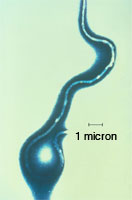
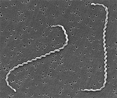

---
aliases:
  - Spirochaetota
  - spirochete
  - spirochaete
  - Spirochaetes
title: Spirochaetes
---

# [[Spirochaetes]] 

#is_a/bio-Phylum  
#is_a :: [[../../../Taxon_Rank/bio~Kingdom/bio~Phylum|bio~Phylum]]  

  

## #has_/text_of_/abstract 

> A spirochaete or spirochete is a member of the phylum Spirochaetota (also called **Spirochaetes** ), 
> which contains distinctive diderm (double-membrane) Gram-negative bacteria, 
> most of which have long, helically coiled (corkscrew-shaped or spiraled, hence the name) cells. 
> 
> Spirochaetes are chemoheterotrophic in nature, 
> with lengths between 3 and 500 μm and diameters around 0.09 to at least 3 μm.
>
> Spirochaetes are distinguished from other bacterial phyla by the location of their flagella, 
> called endoflagella, or periplasmic flagella, which are  sometimes called axial filaments. 
> 
> Endoflagella are anchored at each end (pole) of the bacterium within the periplasmic space 
> (between the inner and outer membranes) where they project backwards 
> to extend the length of the cell. 
> These cause a twisting motion which allows the spirochaete to move. 
> 
> When reproducing, a spirochaete will undergo asexual transverse binary fission. 
> 
> Most spirochaetes are free-living and anaerobic, but there are numerous exceptions. 
> 
> Spirochaete bacteria are diverse in their pathogenic capacity 
> and the ecological niches that they inhabit, 
> as well as molecular characteristics including guanine-cytosine content and genome size.
>
> [Wikipedia](https://en.wikipedia.org/wiki/Spirochaete) 

## Phylogeny 

-   « Ancestral Groups  
    -   [Bacteria](../../Bacteria.md)
    -   [Tree of Life](../../Tree_of_Life.md)

-   ◊ Sibling Groups of  Eubacteria
    -   [Aquificae](Pseudomonadati/Aquificae.md)
    -   [Thermotogae](../Thermotogati/Thermotogota/Thermotogae.md)
    -   [Thermodesulfobacteria](Thermodesulfobacteria.md)
    -   [Chrysiogenes arsenatis](Chrysiogenes_arsenatis)
    -   [Nitrospira](Nitrospira.md)
    -   [Deferribacteres](Deferribacteres.md)
    -   [Chloroflexi](../Bacillati/Chloroflexota/Chloroflexi.md)
    -   [Thermomicrobium](Thermomicrobium.md)
    -   [Fibrobacteres](Fibrobacteres.md)
    -   [Proteobacteria](Pseudomonadati/Proteobacteria.md)
    -   [Planctomycetes](Planctomycetes.md)
    -   [Chlamydiae](Pseudomonadati/Chlamydiae.md)
    -   Spirochaetes
    -   [Bacteroidetes](Pseudomonadati/Bacteroidetes.md)
    -   [Chlorobi](Pseudomonadati/Chlorobi.md)
    -   [Actinobacteria](Bacillati/Actinobacteria.md)
    -   [Deinococcus-Thermus](../Thermotogati/Thermotogota/Thermotogae/Deinococcus-Thermus.md)
    -   [Cyanobacteria](Bacillati/Cyanobacteria.md)
    -   [Bacillota](../Bacillati/Bacillota.md)
    -   [Fusobacteria](Fusobacteria.md)
    -   [Verrucomicrobia](Verrucomicrobia.md)
    -   [Acidobacteria](Pseudomonadati/Acidobacteria.md)
    -   [Dictyoglomi](Dictyoglomi.md)
    -   [Gemmatimonas aurantiaca](Gemmatimonas_aurantiaca)

-   » Sub-Groups 
	-   *Borrelia*
	-   *Brachyspira*
	-   *Brevinema*
	-   *Clevelandina*
	-   *Cristispira*
	-   *Diplocalyx*
	-   *Hollandina*
	-   *Leptonema*
	-   *Leptospira*
	-   *Pillotina*
	-   *Serpulina*
	-   *Spirochaeta*
	-   *Treponema*

## Title Illustrations

------------------------------

  scientific_name ::     Borrelia burgdorferi
  Comments             Photomicrograph of Borrelia burgdorferi, the bacterium that causes Lyme disease
  specimen_condition ::  Dead Specimen
  Source Collection    [Public Health Image Library](http://phil.cdc.gov/Phil/default.asp) 

------------------------------

  scientific_name ::     Leptospira interrogans
  Comments             Scanning electron micrograph of Leptospira interrogans strain RGA. Two spirochetes bound to a 0.2 µm filter. Strain RGA was isolated in 1915 by Uhlenhuth and Fromme from the blood of a soldier in Belgium.
  Creator              CDC/NCID/HIP/Janice Carr
  specimen_condition ::  Dead Specimen
  Source Collection    [Public Health Image Library](http://phil.cdc.gov/Phil/default.asp) 

## Confidential Links & Embeds: 

### #is_/same_as :: [[/_Standards/bio/bio~Domain/Bacteria/Pseudomonadati/Spirochaetes|Spirochaetes]] 

### #is_/same_as :: [[/_public/bio/bio~Domain/Bacteria/Pseudomonadati/Spirochaetes.public|Spirochaetes.public]] 

### #is_/same_as :: [[/_internal/bio/bio~Domain/Bacteria/Pseudomonadati/Spirochaetes.internal|Spirochaetes.internal]] 

### #is_/same_as :: [[/_protect/bio/bio~Domain/Bacteria/Pseudomonadati/Spirochaetes.protect|Spirochaetes.protect]] 

### #is_/same_as :: [[/_private/bio/bio~Domain/Bacteria/Pseudomonadati/Spirochaetes.private|Spirochaetes.private]] 

### #is_/same_as :: [[/_personal/bio/bio~Domain/Bacteria/Pseudomonadati/Spirochaetes.personal|Spirochaetes.personal]] 

### #is_/same_as :: [[/_secret/bio/bio~Domain/Bacteria/Pseudomonadati/Spirochaetes.secret|Spirochaetes.secret]] 

