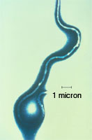
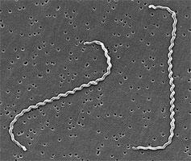

-   « Ancestral Groups 
    -   [Bacteria](../Bacteria.md)
    -   [Tree of Life](../Tree_of_Life.md)

-   ◊ Sibling Groups of  Eubacteria
    -   [Aquificae](Aquificae.md)
    -   [Thermotogae](Thermotogae.md)
    -   [Thermodesulfobacteria](Thermodesulfobacteria.md)
    -   [Chrysiogenes arsenatis](Chrysiogenes_arsenatis)
    -   [Nitrospira](Nitrospira.md)
    -   [Deferribacteres](Deferribacteres.md)
    -   [Chloroflexi](Chloroflexi.md)
    -   [Thermomicrobium](Thermomicrobium.md)
    -   [Fibrobacteres](Fibrobacteres.md)
    -   [Proteobacteria](Proteobacteria.md)
    -   [Planctomycetes](Planctomycetes.md)
    -   [Chlamydiae](Chlamydiae.md)
    -   Spirochaetes
    -   [Bacteroidetes](Bacteroidetes.md)
    -   [Chlorobi](Chlorobi.md)
    -   [Actinobacteria](Actinobacteria.md)
    -   [Deinococcus-Thermus](Deinococcus-Thermus.md)
    -   [Cyanobacteria](Cyanobacteria.md)
    -   [Firmicutes](Firmicutes.md)
    -   [Fusobacteria](Fusobacteria.md)
    -   [Verrucomicrobia](Verrucomicrobia.md)
    -   [Acidobacteria](Acidobacteria.md)
    -   [Dictyoglomi](Dictyoglomi.md)
    -   [Gemmatimonas aurantiaca](Gemmatimonas_aurantiaca)

-   »

# Spirochaetes 

-   *Borrelia*
-   *Brachyspira*
-   *Brevinema*
-   *Clevelandina*
-   *Cristispira*
-   *Diplocalyx*
-   *Hollandina*
-   *Leptonema*
-   *Leptospira*
-   *Pillotina*
-   *Serpulina*
-   *Spirochaeta*
-   *Treponema*

Containing group: [Bacteria](../Bacteria.md)

### References

Garrity, G. M., J. A. Bell, and T. G. Lilburn. 2004. Taxonomic Outline
of the Prokaryotes. Bergey\'s Manual of Systematic Bacteriology, Second
Edition. Release 5.0.

##### Title Illustrations



  ------------------------------
  Scientific Name ::     Borrelia burgdorferi
  Comments             Photomicrograph of Borrelia burgdorferi, the bacterium that causes Lyme disease
  Specimen Condition   Dead Specimen
  Source Collection    [Public Health Image Library](http://phil.cdc.gov/Phil/default.asp)
  ------------------------------


  ---------------------------------------------------------------------
  Scientific Name ::     Leptospira interrogans
  Comments             Scanning electron micrograph of Leptospira interrogans strain RGA. Two spirochetes bound to a 0.2 µm filter. Strain RGA was isolated in 1915 by Uhlenhuth and Fromme from the blood of a soldier in Belgium.
  Creator              CDC/NCID/HIP/Janice Carr
  Specimen Condition   Dead Specimen
  Source Collection    [Public Health Image Library](http://phil.cdc.gov/Phil/default.asp)
  ---------------------------------------------------------------------
