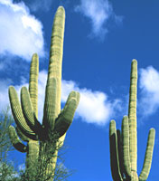
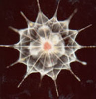
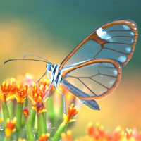
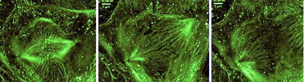
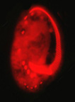
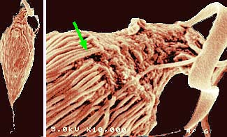

---
aliases:
  - Eukaryotes
  - Eukaryota
  - Eukaryote
  - Eukarya
  - eukaryote
  - eukarionty
  - jądrowce
  - karionty
  - karioty
  - organizmy eukariotyczne
  - organizmy jądrowe
  - evkarionti
  - 真核域
has_id_wikidata: Q19088
AlgaeBase_URL: https://www.algaebase.org/browse/taxonomy/detail/?taxonid=86701
Commons_category: Eukaryota
described_by_source: "[[_Standards/WikiData/WD~Treccani's_Enciclopedia_on_line,65921422]]"
disjoint_union_of: '[[_Standards/WikiData/WD~list_of_values_as_qualifiers,23766486]]'
equivalent_class:
  - http://dbpedia.org/ontology/Eukaryote
  - http://kbpedia.org/kko/rc/EukaryoticOrganism
has_characteristic: '[[_Standards/WikiData/WD~eukaryality,115254102]]'
image: http://commons.wikimedia.org/wiki/Special:FilePath/Eukaryota%20diversity%202.jpg
instance_of: '[[_Standards/WikiData/WD~taxon,16521]]'
IPA_transcription: ˈjukɛɚiˈɑtə
MeSH_tree_code: B01
OmegaWiki_Defined_Meaning: 796039
parent_taxon: '[[_Standards/WikiData/WD~Cytota,3322575]]'
start_time: -2700000000-01-01
subclass_of: '[[_Standards/WikiData/WD~organism,7239]]'
taxon_common_name:
  - eukaryote
  - eukarionty
  - jądrowce
  - karionty
  - karioty
  - organizmy eukariotyczne
  - organizmy jądrowe
  - evkarionti
  - 真核域
taxon_name: Eukaryota
taxon_rank:
  - '[[_Standards/WikiData/WD~domain,146481]]'
  - '[[_Standards/WikiData/WD~superkingdom,19858692]]'
title: Eukaryotes
topic_s_main_template: '[[_Standards/WikiData/WD~Template_Eukaryota,13421047]]'
UMLS_CUI: C0684063
video: http://commons.wikimedia.org/wiki/Special:FilePath/A-Detailed-History-of-Intron-rich-Eukaryotic-Ancestors-Inferred-from-a-Global-Survey-of-100-pcbi.1002150.s003.ogv
---

# [[Eukarya]]

#is_a/bio-Domain 
#is_a :: [[../bio~Domain|bio~Domain]] 

Eukaryota, Organisms with nucleated cells 

   

#is_/same_as :: [[../../WikiData/WD~Eukaryote,19088|WD~Eukaryote,19088]]  

## #has_/text_of_/abstract 

> The **Eukaryotes** ( yoo-KARR-ee-ohts, -⁠əts) constitute the domain of Eukaryota or Eukarya, 
> organisms whose cells have a membrane-bound nucleus. 
> 
> All animals, plants, fungi, seaweeds, and many unicellular organisms are eukaryotes. 
> They constitute a major group of life forms alongside the two groups of prokaryotes: 
> the Bacteria and the Archaea. 
> 
> Eukaryotes represent a small __minority of the number__ of organisms, 
> but given their generally much larger size, 
> their collective global __biomass is much larger__ than that of prokaryotes.
>
> The eukaryotes emerged within the archaeal kingdom Promethearchaeati 
> and its sole phylum Promethearchaeota. 
> 
> This implies that there are only two domains of life, Bacteria and Archaea, 
> with eukaryotes incorporated among the Archaea. 
> 
> Eukaryotes first emerged during the Paleoproterozoic, likely as flagellated cells. 
> 
> The leading evolutionary theory is they were created by symbiogenesis between 
> - an anaerobic Promethearchaeati archaean and 
> - an aerobic proteobacterium, which formed the mitochondria. 
> A second episode of symbiogenesis with a cyanobacterium created the plants, with chloroplasts.
>
> Eukaryotic cells contain membrane-bound organelles such as the nucleus, 
> the endoplasmic reticulum, and the Golgi apparatus. 
> 
> Eukaryotes may be either unicellular or multicellular. 
> In comparison, prokaryotes are typically unicellular. 
> Unicellular eukaryotes are sometimes called protists. 
> Eukaryotes can reproduce both asexually through mitosis 
> and sexually through meiosis and gamete fusion (fertilization).
>
> [Wikipedia](https://en.wikipedia.org/wiki/Eukaryote) 

## Phylogeny 

-   « Ancestral Groups  
    -   [Tree of Life](Tree_of_Life.md)
-   ◊ Sibling Groups of  Life on Earth
    -   [Bacteria](Bacteria.md)
    -   Eukaryotes
    -   [Archaea](Archaea)
    -   [Virus](Virus.md)

-   » Sub-Groups

    -   [Choanoflagellates](Eukarya/Choanoflagellates.md)
    -   [Animals](Eukarya/Animals.md)
    -   [Fungi](Eukarya/Fungi.md)
    -   [Stramenopiles](Eukarya/Stramenopiles.md)
    -   [Alveolate](Eukarya/Alveolate.md)
    -   [Rhodophyta](Eukarya/Rhodophyta.md)
    -   [Green plants](Eukarya/Plant.md)
    -   [The other protists](Eukarya/Protist.md)

## Introduction

[Patrick Keeling and Brian S. Leander](tree?group=Eukaryotes&contgroup=Life_on_Earth#AboutThisPage) 

The eukaryotes include ourselves, other animals, plants and fungi 
and a rich variety of single-cellular micro-organisms (protists). 

The protists include parasites that are so successful 
as to compromise the economies of entire countries. 

Eukaryotes visibly influence the nature of our world.

The Eukaryota - along with the Archaea and Eubacteria - 
make up the three major branches of living organisms (viruses excepted). 

Eukaryotes are usually distinguished from other forms of life by the presence of nuclei 
and the presence of a cytoskeleton. 

The nuclei contain genetic information which is organized into discrete chromosomes 
and contained within a membrane-bounded compartment. 
The word \'eukaryote\' means \'true nuclei\'. 

The cytoskeleton is a complex array of proteins 
which provides the structural framework for the eukaryotic cell and its components, 
inclusive of the nucleus. 

The cytoskeleton has been widely exploited in the evolutionary diversification of eukaryotes. 
The cytoskeleton and organelles are discussed in more detail in the \'Characteristics\' section below.

Three stages of movement of chromosomes during division of a nucleus 
in a newt lung epithelial cell.\
Photograph copyright © 1998 Rudolf Oldenbourg.

Eukaryotes probably emerged from prokaryotic ancestry 
about 1.6 - 2.1 billion years ago (Knoll, 1992). 

The evolutionary diversification of eukaryotes has involved invention of organelles, 
and their modification.

Now, about 60 types of eukaryotes can be distinguished 
on the basis of their cellular organization (Patterson, 1999). 
One of these lines (the opisthokonts) includes the million or so species of animals and fungi, 
another (the Viridaeplantae) is formed of the green algae and the land plants. 

The majority of the lines of eukaryotes are traditionally classified 
in a paraphyletic assemblage of mostly unicellular organisms referred to as [the protists](#TheProtista).

### Characteristics 

Eukaryotes are distinguished from prokaryotes by the structural complexity of the cells -
characterized by having many functions 
segregated into semi-autonomous regions of the cells (organelles), and by the cytoskeleton.

The most evident organelle in most cells is the nucleus, 
and it is from the presence of this organelle that the eukaryotes get their name. 
Most cells have a single nucleus, some have more (some have thousands) 
and others like red blood cells of ourselves have none, to be most flexible - 
but they are derive from cells by removing the nucleus. 

Nuclei contain most of the genetic material of a cell - 
with other elements of the genome located in mitchondria and plastids 
(if those organelles are also present). 

The nucleus is bounded by a membranous envelope. 
The nuclear envelope is part of the endomembrane system 
that extends to include the endoplasmic reticulum, dictyosomes (Golgi apparatus) 
and the cell or plasma membrane that encloses the cell. 

The envelope is perforated by nuclear pores which allow compounds to pass 
between the nucleus and the surrounding cytoplasm. 

Some protists have more than one kind of nucleus - 
using one to retain a copy of the genome for purposes of reproduction, 
and another in which some genes have been greatly amplified, to regulate activities.

Within the nucleus, the genes are located on a number of chromosomes.
The total amount of DNA in a nucleus measuring less than one hundredth
of a millimetre across may stretch to over a metre. 

When not in use this is kept within a nucleus measuring only a few microns across 
by being bundled up in superhelical arrays.

The cytoskeleton is comprised of a rich array of proteins. 
The major ones are tubulin (which forms microtubules) 
and actin (forming microfilaments) and a myriad of interacting proteins 
which effect movement or create the skeletal architecture of cells. 

The cytoskeleton provides shape for the cell and support for membranous organelles. 
It also provides anchorage for motility proteins 
which transport materials within the cell and cause deformations 
which bring about the movements of the entire cell - or organism.

Examples of cytoskeletal architecture: metaphase chromosomes (left),
kinetids (center), cytoskeleton of Euplotes (right).\
Left and right photographs copyright © 2000 David J. Patterson. Center
photograph copyright © 1996 Rudolf Oldenbourg.

Many metabolic functions are carried out within membrane bound organelles. 
The organelles include the endoplasmic reticulum, 
dictyosomes (= Golgi apparatus), lysosomes, and peroxisomes. 

Other membrane bound organelles that are not always present include chloroplasts 
(in plants, algae and organisms which have developed symbiotic associations with plastids, 
algae or plants) and mitochondria or hydrogenosomes. 

Protists (mostly microbial eukaryotes) have membrane-bounded organelles 
not found in most other eukaryotes - such as contractile vacuoles and extrusomes. 

Non-membrane-bound organelles include cytoskeletal elements 
(such as microtubular constructs made up of tubulin, or filamentous structures often incorporating actin),
contractile systems (actin-myosin assemblages, spasmin/centrin) or other
motility devices (mitotic spindle, myonemes, cilia, flagella).

### The Protista

The protists are a paraphyletic group 
consisting of those eukaryotes which are not animals, true fungi or green plants. 

Using ultrastructural characteristics, we can identify about 60 types of protists, 
and the relationships among these lineages are not clear.

There are estimated to be about 200,000 named species of protists. 
Some of the groups of protists contain only one or a few genera or species,
but others encompass an immense diversity of organizational types (including multicellularity) 
which eclipses that found in some of the more familiar animals or plants. 

A particularly good example of this is the territory referred to as the stramenopiles. 
This group embraces a quantity of photosynthetic activitiy second only to the land plants, 
and it includes fungal like organisms (Oomycetes), parasitic protozoa (opalines and Blastocystis), 
free-living protozoa (some heliozoa and flagellates) 
as well as various unicellular algae (chrysophytes) and muticellular algae (kelps and other brown algae).

Protists have traditionally been classified into the following
non-monophyletic adaptive groups:

-   [Flagellates](http://www.tolweb.org/accessory/Flagellates?acc_id=50)
-   [Amoebae](http://www.tolweb.org/accessory/Amoebae?acc_id=51)
-   [Algae](http://www.tolweb.org/accessory/Algae:_Protists_with_Chloroplasts?acc_id=52)
-   [Parasitic     Protists](http://www.tolweb.org/accessory/Parasitic_Protists?acc_id=53)

### Discussion of Phylogenetic Relationships

#### General relationships among eukaryotes

Our understanding of the phylogenetic relationships among the eukaryotes
is not yet resolved nor stable. 
Two large bodies of data have contributed most to our current understanding 
of the diversity and interrelationships of eukaryotic lineages.

Information derived from electron microscopy on the structure of the cells 
has revealed consistent patterns among groups for which the monophyly is not doubted 
(such as the ciliates or the red algae). 
The same approach has then been applied to many protists, 
and has revealed that there are about 80 patterns of organization (Patterson, 1999).
These have now been clustered into about 60 lineages. 
Molecular analyses, when available, usually confirm these groupings.

The second body of data derives from comparative molecular data -
initially focussing on the genes which code for [small subunit ribosomal RNA](http://www.tolweb.org/accessory/Trees_Based_on_16s_rDNA?acc_id=54).

As it became evident that the insights might be distorted 
by problems in the methods of phylogenetic inference, 
and that our emerging insights (trees) were imprecise, 
so an increasing number of genes have been called upon 
to identify which elements of our understanding are secure and which are unrealiable. 
The position now is less confident than a decade earlier, 
and the means of resolving conflict among molecular insights has yet to be agreed upon 
(Philippe & Adoutte, 1998; Katz, 1999).

The most comprehensive molecular trees are still those 
based on analysis of 16S ribosomal RNA (e.g. Cavalier-Smith, 1993; Sogin & Silberman, 1998). 

The early molecular trees indicated that the earliest branches of eukaryote evolution 
are represented by microsporidia, trichomonads and diplomonads. 

These organisms lack dictyosomes, peroxisomes and conventional mitochondria. 
In addition, the organization of their cytoskeleton was simple 
and they had a relatively small number of membranous organelles 
when compared to more recently evolved taxa such as plants, animals and fungi. 
Organisms located higher in the tree had more organellar diversity, 
including the presence of dictyosomes, various membranous compartments, 
mitochondria and chloroplasts. 

The consistency of the molecular and structural insights led to models 
that these taxa were primitively amitochondriate, had derived early in eukaryote evolution, 
and could reveal to us the sequence in which the eukaryotic cell was assembled.

Early trees included an unresolved polytomy for the early-branching amitochondriate protists (Leipe et al., 1993). 
It was followed by the separation of the Euglenozoa (Euglena + other euglenids, trypanosomes +
other kinetoplastids), a few other taxa such as the Heterolobosea
(acrasid slime moulds, and the agents of amoebic meningitis -
Naegleria), and a variety of amoeboid organisms (Sogin et al., 1996).
The remaining organisms formed a cluster that was referred to as the
eukaryotic crown and was interpreted as the nearly simultaneous
separation of animals, plants, fungi and several complex protist
assemblages (Knoll, 1992).

Within the last decade, it became increasingly evident that this
understanding was not accurate (Roger, 1999). 
There is a problem that lineages which have shown rapid rates of evolution 
(have long branch lengths) are drawn together at the base of dendrograms 
created by programs that sought to interpret molecular data as evolutionary trees.

Secondly, a variety of the \'amitochondriate\' organisms have been shown
to have genes for mitochondrial proteins suggesting that they are not
primitively amitochondriate but secondarily amitochondriate. The
presence of small membranous organelles in a number of these taxa
suggests that they contain pre-mitochondria or reduced mitochondria.
Enhanced molecular data provided evidence of different associations -
the microsporidia were not organisms at the base of the tree but were a
specialised kind of fungus and derived late in eukaryotic evolution,
their structural simplicity being attributed to regression (Edlind et
al., 1996; Keeling & Doolittle, 1996; Li et al., 1996; Germot et al.,
1997; Edlind, 1998; Fast et al. 1999; Hirt et al., 1999; Keeling et al.,
2000; Van de Peer et al., 2000). Molecular data also identified new
candidates for the most primitive eukaryotes - Reclinomonas (an excavate
flagellate) has a mitochondrial genome more replete with genes than any
other and may be related to one of the first eukaryotes to acquire
mitochondria (Lang et al., 1997). Yet molecular trees do not concur with
each other (Katz, 1999). The consequence of these insights has been to
demolish the model of the 1990\'s, but not to replace it with something
better.

Yet, the intervening period has seen progress. At the beginning of the
1990\'s, we could recognise about 80 different types of eukaryotes
(Patterson, 1994). In the intervening period, perhaps 10 further types
of protists were being or have been added - either through the efforts
of bioprospectors or through more detailed study of many of the
underdescribed genera of protists. Yet only about 60 lineages are
currently recognised. That is - about half of the lineages have found
homes. We have now agreed that the sister group to the Metazoa are the
collar-flagellates (choanoflagellates), and that these, together with
the fungi and chytrids form a lineage (the opisthokonts), and that the
opisthokonts contain two types of spore-forming organisms (Microsporidia
and Myxozoa) that used to be considered as protists but are now seen as
derived from multicellular organisms (Microsporidia from fungi, Myxozoa
from coelenterates or bilateria); the ciliates, apicomplexan sporozoa
and dinoflagellates are regarded as forming a lineage (the alveolates),
the stramenopiles is now home to the brown algae, diatoms, chrysophytes,
opalines, Blastocystis, some heliozoa, some heterotrophic flagellates
and so on), and new groups - such as the excavates (including Giardia
and the other diplomonads, retortamonads, and various heterotrophic
flagellates such as Carpediemonas and the quadriflagellated Trimastix) -
continue to be promoted. The resolution to the interrelationships of all
eukaryotes looks as if it will reside in the piece by piece assembly of
the jig-saw puzzle, rather than in the broad sweep approach which gave
us so much confidence a decade ago.

#### Phylogenetic relationships among the opisthokonts

The term \'opisthokont\' was introduced by Copeland (Copeland, 1956) for
the chytrids - a small group of parasitic protists, now commonly
included within the fungi. The name refers to the posterior (opistho)
location of the flagellum (kont) in swimming cells. As comparative
molecular biology indicated that the fungi and animals were related, so
the term was applied to the (animals + fungi) clade (Cavalier-Smith &
Chao, 1995). This is not entirely satisfactory, but an alternative name
for the (animals + fungi) clade has yet to emerge.

The argument that the choanoflagellates gave rise to sponges and these
in turn to the diploblastic and triploblastic animals is one with a long
history, but an understanding of the origins of animals was impeded by
spurious arguments based on reference to mythical ancestors (Hanson,
1977; Willmer, 1990). The relatedness of the collar flagellates
(choanoflagellates) to the Metazoa was confirmed by comparative analyses
of ribosomal RNA (Kim et al., 1999; Wainright et al., 1993), and the
basal status of the sponges within Metazoa is widely accepted (Jenner &
Schram 1999).

The relatedness of extended animal and fungal clades was not suggested
by comparative morphology, but was revealed by comparative molecular
biology (Baldauf & Palmer, 1993; Wainright et al., 1993; Sogin &
Silberman, 1998; Baldauf, 1999). Subsequently, similarities in the
anchorage systems of flagella of chytrid fungi and choanoflagellates
have been identified, corroborating the molecular perspective (Moestrup,
unpublished).

#### Microsporidian and myxosporan protists as members of the opisthokonts

Microsporidia are mostly unicellular intracellular parasites and have
traditionally been classified within the protozoan group \'Sporozoa\'.
With the advent of molecular phylogeny, they were placed at the base of
the tree of eukaryotes because of their gene structure and comparisons
of small subunit ribosomal RNA. They also have a very simple cellular
organization which corroborated this insight. The extension of
comparative molecular biology to embrace more genes has led to the view
that the microsporidia are a derived type of fungus, an argument
supported by the presence of a distinctive signature sequence (Kamaishi
et al., 1996; Keeling et al., 2000). There are no structural
synapomorphies tying the microsporidia to the fungi or to a subset of
the fungi.

Myxozoa (= Myxosporidia) were traditionally regarded as a type of
protist which produces multicellular spores. The spore contains
\'cells\' which could eject filaments. In the 1970\'s it became evident
that the appearance and development of the filaments co-incided with
that of the nematocysts of the coelenterates (Metazoa). Molecular
evidence has confirmed that Myxozoa are allied to the Metazoa, but
molecular approaches are as yet unable to resolve particular
relationships (Siddall et al., 1995; Smothers et al., 1994).

### Symbioses, Endosymbioses and the Origin of the Eukaryotic State

Symbiosis is the process in which unrelated organisms come together and
form a stable association - as do lichens (algae and fungi) and coral
reefs (coelenterates and dinoflagellate algae). This idea was
promulgated at the turn of the 20th century (Mereschkowsky, 1910) and
promoted later in the same century by Lynn Margulis (Margulis, 1970).
Symbiosis has been and still is an important driving force in the
evolution of eukaryotes. Through this mechanism, complementary metabolic
capabilities, life cycles, and competences of different organisms have
been brough together to create an amalgam that is greater than the sum
of the parts. Symbiosis has provided a selective advantage to organisms
when responding to changing environments. The close proximity of
partners in symbiosis creates opportunities for coevolution of genomes
and for the lateral transfer of genetic information between compartments
or between evolutionary lineages. Microorganisms that engage in
symbioses may be either extracellular or intracellular. Examples of
extracellular symbionts include lichenized fungi and various bacteria
which reside within metazoan digestive systems. There are also
extracellular bacteria which live on the surface of eukaryotic
microorganisms.

\

Symbiotic bacteria (one is indicated by the arrow) 
coat the surface of a devescovinid flagellate (a member of the parabasalids), 
its flagella are to the right.\
Photograph copyright © 2000 [Mitchell L. Sogin](http://hermes.mbl.edu/labs/JBPC/)

Intracellular symbionts are referred to as endosymbionts, and their
impact upon eukaryote evolution has been especially profound.
Endosymbiosis was important in the evolution of even the earliest
diverging eukaryotic cells. In the most radical views of eukaryotic
origins it is suggested (but not proven) that formation of the
eukaryotic cell was a consequence of genome fusions between a host cell
and endosymbionts representing distinct evolutionary lineages (Sogin,
1991; Forterre et al., 1992; Lake & Rivera, 1994; Golding & Gupta, 1995;
Katz, 1998, 1999).

The role of endosymbionts in the origins of mitochondria and
chloroplasts is more convincing. The ancestors of these organelles were
initially independent bacterial organisms which were acquired by or
invaded early eukaryotes. It is believed that by enriching the array of
metabolic processes available to the cell, the symbionts conferred a
selective advantage to ancestral eukaryotes. The consortium was
favoured, and the endosymbionts became integrated in the operations of
the cell as organelles.

In the case of mitochondria, ultrastructure and molecular data indicate
that they are derived from the alpha-proteo bacteria (Yang et al.,
1985). This particular association provided a means for early eukaryotic
cells\--previously limited to anaerobic metabolism\--to carry out
aerobic respiration. The benefit is that this association allowed oxygen
to be used as a terminal electron acceptor, and the energy derived from
ingested food increased by a factor of almost 20. There is now
considerable controversy about the timing of this endosymbiotic event
and whether there are any remnants of pre-mitochondrial euklaryotes.
Ribosomal RNA trees indicate that the earliest diverging eukaryotes
(e.g. diplomonads, trichomonads) lack mitochondria and this was thought
to indicate that these taxa were primitively without mitochondria (see
[Discussion of Phylogenetic Relationships](tree?group=Eukaryotes#DiscussionofPhylogeneticRelationships)).
However, there is now increasing evidence that genes normally found in
alpha-proteo bacteria are also present in the nucleus of amitochondriate
prostists and that mitochondria were present much earlier than
previously thought, but have now been lost from some early eukaryotes
(Roger, 1999).

The origins of chloroplasts are also rooted in endosymbiotic processes.
Probably later than the acquisition of mitochondria, a cyanobacterium
took up residence in an ancient eukaryote. These primary endosymbionts
were destined to become the chloroplasts which are found in eukaryotic
algae. Their role may have been to add autotrophic competency to
heterotrophic cells, or perhaps to provide oxygen to improve efficiency
of metabolism. Chloroplasts have proven to be promiscuous, and some
eukaryotic algae acquired their chloroplasts through secondary
endosymbioses in which the plastid of one eukaryotic algal species was
transferred to and became established in different eukaryotic clades
(Delwiche, 1999). At this time, there is no evidence that any of the
other familiar components of eukaryotic cells were acquired by
symbiosis.

### References

Arisue, N., M. Hasegawa, and T. Hashimoto. 2005. Root of the Eukaryota
tree as inferred from combined maximum likelihood analyses of multiple
molecular sequence data. Molecular Biology and Evolution 22(3):409-420.

Baldauf, S. L. 1999. A search for the origins of animals and fungi:
Comparing and combining molecular data. American Naturalist
154(suppl.):S178-S188.

Baldauf, S. L. and W. F. Doolittle. 1997. Origin and evolution of the
slime molds (Mycetozoa). Proceedings of the National Academy of Sciences
(USA) 94:12007-12012.

Baldauf, S. L. and J. D. Palmer. 1993. Animals and fungi are each
other\'s closest relatives: Congruent evidence from multiple proteins.
Proceedings of the National Academy of Sciences (USA) 90:11558-11562.

Berney, C. and J. Pawlowski. 2006. A molecular time-scale for eukaryote
evolution recalibrated with the continuous microfossil record.
Proceedings of the Royal Society Series B 273(1596):1867-1872.

Borchiellini C., N. Boury-Esnault, J. Vacelet, and Y. Le Parco. 1998.
Phylogenetic analysis of the Hsp70 sequences reveals the monophyly of
metazoa and specific phylogenetic relationships between animals and
fungi. Molecular Biology and Evolution 15:647-655.

Budin, K. and H. Philippe. 1998. New insights into the phylogeny of
eukaryotes based on Ciliate Hsp70 sequences. Molecular Biology and
Evolution 15:943-956.

Burki, F. and J. Pawlowski. 2006. Monophyly of Rhizaria and multigene
phylogeny of unicellular bikonts. Molecular Biology and Evolution
23(10):1922-1930.

Canning, E. U. 1998. Evolutionary relationships of Microsporidia. Pages
77-90 in Evolutionary Relationships among Protozoa (G. H. Coombs, K.
Vickerman, M .A. Sleigh, and A. Warren, eds.) Chapman & Hall, London.

Cavalier-Smith, T. 1993. Kingdom Protozoa and its 18 phyla. Microbiol.
Rev. 57:953-94.

Cavalier-Smith, T. and Chao, E. E. 1995. The opalozoan Apusomonas is
related to the common ancestor of animals, fungi and choanoflagellates.
Proceedings of the Royal Society of London Series B 261:1-6.

Clark C. G. and A. J. Roger. 1995. Direct evidence for secondary loss of
mitochondria in Entamoeba histolytica. Proceedings of the National
Academy of Sciences (USA) 92:6518-6521.

Copeland, H. F. 1956. The Classification of Lower Organisms. Pacific
Books, Palo Alto, California.

Delwiche, C. F. 1999. Tracing the thread of plastid diversity through
the tapistry of life. American Naturalist 154 (suppl.):S164-S177.

Douzery, E. J. P., E. A. Snell, E. Bapteste, F. Delsuc, and H. Philippe.
2004. The timing of eukaryotic evolution: Does a relaxed molecular clock
reconcile proteins and fossils? Proceedings of the National Academy of
Sciences (USA) 101(43):15386-15391.

Edlind, T. D. 1998. Phylogenetics of protozoan tubulin with reference to
the amitochondriate eukaryotes. Pages 91-108 in Evolutionary
Relationships Among Protozoa (G. H. Coombs, K. Vickerman, M. A. Sleigh,
and A. Warren, eds.) Chapman & Hall, London.

Edlind, T. D., J. Li, G. S. Visvesvara, M. H. Vodkin, G. L. McLaughlin,
and S. K. Katiyar. 1996. Phylogenetic analysis of beta-tubulin sequences
from amitochondrial protozoa. Molecular Phylogenetics and Evolution
5:359-367.

Embley T. M. and R. P. Hirt. 1998. Early branching eukaryotes? Curr.
Opinion Gen. Dev. 8:624-629.

Fast, N. M., J. M. Logsdon, and W. F. Doolittle. 1999. Phylogenetic
analysis of the TATA box binding protein (TBP) gene from Nosema
locustae: evidence for a microsporidia-fungi relationship and
spliceosomal intron loss. Molecular Biology and Evolution 16:1415-1419.

Forterre, P., N. Benachenhou-Lahfa, F. Confalonieri, M. Duguet, C. Elie
and B. Labedan. 1992. The nature of the last universal ancestor and the
root of the tree of life, still open questions. Biosystems 28:15-32.

Germot, A., H. Philippe, and H. Le Guyader. 1997. Evidence for loss of
mitochondria in Microsporidia from a mitochondrial-type HSP70 in Nosema
locustae. Molecular and Biochemical Parasitology 87:159-168.

Gogarten, J. P. 2003. Gene transfer: Gene swapping craze reaches
eukaryotes. Curr Biol 13: R53--54.

Golding, G. B. and R. S. Gupta. 1995. Protein-based phylogenies support
a chimeric origin for the eukaryotic genome. Molecular Biology and
Evolution 12:1-6.

Hampl, V., D. S. Horner, P. Dyal, J. Kulda, J. Flegr, P. G. Foster, and
T. M. Embley. 2005. Inference of the phylogenetic position of oxymonads
based on nine genes: Support for Metamonada and Excavata. Molecular
Biology and Evolution 22(12):2508-2518.

Hanson, E. D. 1977. The Origin and Early Evolution of Animals. Wesleyan
University Press, Middletown, Conn.

Hashimoto, T., Y. Nakamura, T. Kamaishi, and M. Hasegawa. 1997. Early
evolution of eukaryotes inferred from protein phylogenies of translation
elongation factors 1 alpha and 2. Archiv für Protistenkunde 148:287-295.

Hirt, R. P., B. Healy, C. R. Vossbrinck, E. U. Canning, and T. M.
Embley. 1997. A mitochondrial Hsp70 orthologue in Vairimorpha necatrix:
Molecular evidence that microsporidia once contained mitochondria.
Current Biology 7:995-998.

Hirt, R. P. and D. Horner (eds.) 2004. Organelles, Genomes and Eukaryote
Evolution. Taylor & Francis, London.

Hirt, R. P., J. M. Logsdon, Jr., B. Healy, M. W. Dorey, W. F. Doolittle,
and T. M. Embley. 1999. Microsporidia are related to fungi: evidence
from the largest subunit of RNA polymerase II and other proteins.
Proceedings of the National Academy of Sciences (USA) 96:580-585.

Huang, J., Y. Xu, and J. P. Gogarten. 2005. The presence of a
haloarchaeal type tyrosyl-tRNA synthetase marks the opisthokonts as
monophyletic. Molecular Biology and Evolution 22:2142-2146.

Jenner, R. A. and F. R. Schram. 1999. The grand game of metazoan
phylogeny: rules and strategies. Biological Reviews 74:121-142.

Kamaishi, T., T. Hashimoto, Y. Nakamura, F. Nakamura, S. Murata, N.
Okada, K. Okamoto, and M. Hasegawa. 1996. Protein phylogeny of
translation elongation factor EF-1alpha suggests microsporidians are
extremely ancient eukaryotes. Journal of Molecular Evolution 42:257-263.

Katz, L. A. 1998. Changing perspectives on the origin of eukaryotes.
Trends Ecol. Evol. 13:493-497.

Katz, L. A. 1999. The tangled web: gene genealogies and the origin of
eukaryotes. American Naturalist 154 (suppl.):S137-S145.

Keeling, P. J. 1998. A kingdom\'s progress: Archezoa and the origin of
eukaryotes. BioEssays 20:87-95.

Keeling, P. J. 2004. Diversity and evolutionary history of plastids and
their hosts. American Journal of Botany 91:1481-1493.

Keeling, P. J., G. Burger, D. G. Durnford, B. F. Lang, R. W. Lee, R. E.
Pearlman, A. J. Roger and M. W. Gray. 2005. The tree of eukaryotes.
Trends in Ecology & Evolution 20(12):670-676.

Keeling, P. J. and W. F. Doolittle. 1996. Alpha-tubulin from
early-diverging eukaryotic lineages and the evolution of the tubulin
family. Molecular Biology and Evolution 13:1297-1305.

Keeling, P. J., M. A. Luker, and J. D. Palmer. 2000. Evidence from
beta-tubulin phylogeny that microsporidia evolved from within the fungi.
Molecular Biology and Evolution 17:23-31.

Keeling, P. J. and G. I. McFadden. 1998. Origins of microsporidia.
Trends Microbiol. 6:19-23.

Keeling, P. J. and J. D. Palmer. 2000. Phylogeny - Parabasalian
flagellates are ancient eukaryotes. Nature 405:635-637.

Kim, J., W. Kim, and C. W. Cunningham. 1999. A new perspective on lower
metazoan relationships from 18S rDNA sequences. Molecular Biology and
Evolution 16:423-427.

Knoll, A. H. 1992. The early evolution of eukaryotes: a geological
perspective. Science 256:622-627.

Kumar, S. and A. Rzhetsky. 1996. Evolutionary relationships of
eukaryotic kingdoms. Journal of Molecular Evolution 42:183-193.

Lake, J. A. and M. C. Rivera. 1994. Was the nucleus the first
endosymbiont? Proceedings of the National Academy of Sciences (USA)
91:2880-2881.

Lang, B. F., G. Burger, C. J. O\'Kelly, R. Cedergren, G. B. Golding, C.
Lemieux, D. Sankoff, M. Turmel, and M. W. Gray. 1997. An ancestral
mitochondrial DNA resembling a eubacterial genome in miniature. Nature
387:493-497.

Lang, B. F., M. W. Gray, and G. Burger. 1999. Mitochondrial genome
evolution and the origin of eukaryotes. Annual Review of Genetics
33:351-397.

Leipe, D., J. H. Gunderson, T. A. Nerad and M. L. Sogin. 1993. Small
subunit ribosomal RNA of Hexamita inflata and the quest for the first
branch in the eukaryotic tree. Mol. Biochem. Parasitol. 59:41-48.

Li, J., S. K. Katiyar, A. Hamelin, G. S. Visvesvara, and T. D. Edlind.
1996. Tubulin genes from AIDS-associated microsporidia and implications
for phylogeny and benzimidazole sensitivity. Molecular and Biochemical
Parasitology 78:289-295.

Lipscomb D. L., J. S. Farris, M. Kallersjo and A. Tehler. 1998. Support,
ribosomal sequences and the phylogeny of the eukaryotes. Cladistics
14:303-338.

Maldonado, M. 2004. Choanoflagellates, choanocytes, and animal
multicellularity. Invertebrate Biology 123:1-22.

Margulis, L. 1970. Origin of Eukaryotic Cells. Yale University Press.

Margulis, L., M. Chapman, R. Guerrero, and J. Hall. 2006. The last
eukaryotic common ancestor (LECA): Acquisition of cytoskeletal motility
from aerotolerant spirochetes in the Proterozoic Eon. Proceedings of the
National Academy of Sciences (USA) 103(35):13080-13085.

Margulis, L., J. O. Corliss, M. Melkonian and D. J. Chapman. 1990.
Handbook of Protoctista. Jones and Bartlett Publishers, Boston.

Mereschkowsky, C. 1910. Theorie der zwei Plasmaarten als Grundlage der
Symbiogenesis. Eine neue Lehre von der Entstehung der Organismen.
Biologisches Centralblatt 30: 278-303, 321-347, 353-367.

Moreira, D., H. Le Guyader, and H. Philippe. 2000. The origin of red
algae and the evolution of chloroplasts. Nature 405:69-72.

Moreira, D., S. von der Heyden, D. Bass, P. López-García, E. Chao, and
T. Cavalier-Smith. 2007. Global eukaryote phylogeny: Combined small- and
large-subunit ribosomal DNA trees support monophyly of Rhizaria, Retaria
and Excavata. Molecular Phylogenetics and Evolution 44(1):255-266.

Morin, L. 2000. Long branch attraction effects and the status of \"basal
eukaryotes\": Phylogeny and structural analysis of the ribosomal RNA
gene cluster of the free-living diplomonad Trepomonas agilis. Journal of
Eukaryotic Microbiology 47:167-177.

Morris, P. J. 1993. The developmental role of the extracellular matrix
suggests a monophyletic origin of the Kingdom Animalia. Evolution
47:152-165.

Narbonne, G. M. 2004. Modular construction of early Ediacaran complex
life forms. Science 305(5687):1141-1144.

Nozaki, H., M. Matsuzaki, M. Takahara, O. Misumi, H. Kuroiwa, M.
Hasegawa, T. Shin-i, Y. Kohara, N. Ogasawara, and T. Kuroiwa. 2003. The
phylogenetic position of red algae revealed by multiple nuclear genes
from mitochondria-containing eukaryotes and an alternative hypothesis on
the origin of plastids. Journal of Molecular Evolution 56(4):485-497.

Patterson, D. J. 1994. Protozoa: Evolution and Systematics. Pages 1-14
in Progress in Protozoology. Proceedings of the IX International
Congress of Protozoology, Berlin 1993. (K. Hausmann and N. Hülsmann,
eds.) Gustav Fischer Verlag, Stuttgart, Jena, New York.

Patterson, D. J. 1999. The diversity of eukaryotes. American Naturalist
154 (suppl.):S96-S124.

Patterson, D. J. and M. L. Sogin. 1992. Eukaryote origins and protistan
diversity. Pages 13-46 in The Origin and Evolution of Prokaryotic and
Eukaryotic Cells (H. Hartman and K. Matsuno, eds.) World Scientific Pub.
Co. NJ.

Philip, G. K., C. J. Creevey, and J. O. McInerney. 2005. The
Opisthokonta and the Ecdysozoa may not be clades: Stronger support for
the grouping of plant and animal than for animal and fungi and stronger
support for the Coelomata than Ecdysozoa. Molecular Biology and
Evolution 22(5):1175--1184.

Philippe, H. and A. Adoutte. 1998. The molecular phylogeny of Eukaryota:
solid facts and uncertainties. Pages 25-56 in Evolutionary Relationships
among Protozoa (G. H. Coombs, K. Vickerman, M. A. Sleigh, and A. Warren,
eds.) Chapman & Hall, London.

Philippe, H. and A. Germot. 2000. Phylogeny of eukaryotes based on
ribosomal RNA: Long-branch attraction and models of sequence evolution.
Molecular Biology and Evolution 17:830-834.

Philippe, H., P. Lopez, H. Brinkmann, K. Budin, A. Germot, J. Laurent,
D. Moreira, M. Muller, and H. Le Guyader. 2000. Early-branching or
fast-evolving eukaryotes? An answer based on slowly evolving positions.
Proceedings of the Royal Society of London Series B 267:1213-1221.

Philippe, H., E. A. Snell, E. Bapteste, P. Lopez, P. W. H. Holland, and
D. Casane. 2004. Phylogenomics of eukaryotes: impact of missing data on
large alignments. Molecular Biology and Evolution 21(9):1740-1752.

Ragan, M. A. and R. R. Gutell. 1995. Are red algae plants? Botanical
Journal of the Linnean Society 118:81-105.

Ribeiro, S. and G. B. Golding. 1998. The mosaic nature of the eukaryotic
nucleus. Molecular Biology and Evolution 15:779-788.

Richards, T. A. and M. van der Giezen. 2006. Evolution of the Isd11-IscS
complex reveals a single alpha-proteobacterial endosymbiosis for all
eukaryotes. Molecular Biology and Evolution 23:1341-1344.

Roger, A. J. 1999. Reconstructing early events in eukaryotic evolution.
American Naturalist 154 (suppl.):S146-S163.

Roger, A. J., O. Sandblom, W. F. Doolittle, and H. Philippe. 1999. An
evaluation of elongation factor 1 alpha as a phylogenetic marker for
eukaryotes. Molecular Biology and Evolution 16:218-233.

Schlegel, M. 2003. Phylogeny of Eukaryotes recovered with molecular
data: highlights and pitfalls. European Journal of Protistology
39:113-122.

Schütze J., A. Krasko, M. R. Custodio, S. M. Efremova, I. M. Müller and
W. E. G. Müller. 1999. Evolutionary relationships of Metazoa within the
eukaryotes based on molecular data from Porifera. Proceedings of the
Royal Society of London Series B 266:63-73.

Siddall, M. E., D. S. Martin, D. Bridge, S. S. Desser, and D.K. Cone.
1995. The demise of a phylum of protists: phylogeny of Myxozoa and other
parasitic Cnidaria. J. Parasitol. 81:961-967.

Simpson, A. G. B., Y. Inagaki, and A. J. Roger. 2006. Comprehensive
multigene phylogenies of excavate protists reveal the evolutionary
positions of \"primitive\" eukaryotes. Molecular Biology and Evolution
23(3):615-625.

Smothers, J. F., C. D. van Dohlen, L. H. Smith, and R. D. Spall. 1994.
Molecular evidence that the myxozoan protists are metazoans. Science
265:1719-1721.

Sogin, M. L. 1991. Early evolution and the origin of eukaryotes. Current
Opinion in Genetics and Development 1:457-463.

Sogin, M. L., H. G. Morrison, G. Hinkle and J. D. Silberman. 1996.
Ancestral relationships of the major eukaryotic lineages. Microbiologia
SEM 12:17-28.

Sogin, M. L. and J. D. Silberman. 1998. Evolution of the protists and
protistan parasites from the perspective of molecular systematics.
International Journal of Parasitology 28:11-20.

Stechmann, A. and T. Cavalier-Smith. 2002. Rooting the eukaryote tree by
using a derived gene fusion. Science 297:89-91.

Steenkamp, E. T., J. Wright, and S. L. Baldauf. 2006. The protistan
origins of animals and fungi. Molecular Biology and Evolution 23:93-106.

Stiller, J. W., E. C. S. Duffield and B. D. Hall. 1998. Amitochondriate
amoebae and the evolution of DNA-dependent RNA polymerase II.
Proceedings of the National Academy of Sciences (USA) 95:11769-11774.

Stiller, J. W. and B. D. Hall. 1997. The origin of red algae:
Implications for plastid evolution. Proceedings of the National Academy
of Sciences (USA) 94:4520-4525.

Stiller, J. W. and B. D. Hall. 1999. Long-branch attraction and the rDNA
model of early eukaryotic evolution. Molecular Biology and Evolution
16:1270-1279.

Stiller, J. W, J. Riley, and B. D. Hall. 2001. Are red algae plants? A
critical evaluation of three key molecular data sets. Journal of
Molecular Evolution 52(6):527-539.

Taylor F. J. R. 1999. Ultrastructure as a control for protistan
molecular phylogeny. American Naturalist 154(suppl.):S125-S136.

Van de Peer, Y., A. Ben Ali, and A. Meyer. 2000. Microsporidia:
accumulating molecular evidence that a group of amitochondriate and
suspectedly primitive eukaryotes are just curious fungi. Gene 246:1-8.

Van de Peer, Y. and R. de Wachter. 1997. Evolutionary relationships
among the eukaryotic crown taxa taking into account site-to-site rate
variation in 18S rRNA. Journal of Molecular Evolution 45:619-630.

Van de Peer, Y., G. Van der Auwera and R. DeWachter. 1996. The evolution
of stramenopiles and alveolates as derived by \'substitution rate
calibration\' of small ribosomal subunit RNA. Journal of Molecular
Evolution 42:201-210.

Vellai T. and G. Vida. 1999. The origin of eukaryotes: the difference
between prokaryotic and eukaryotic cells. Proceedings of the Royal
Society of London Series B 266:1571-1577.

Wainright, P. O., G. Hinkle, M. L. Sogin, and S. K. Stickel. 1993.
Monophyletic origin of the Metazoa: an evolutionary link with fungi.
Science 260:340-342.

Wainright, P. O., D. J. Patterson, and M. L. Sogin. 1994. Monophyletic
origin of animals: a shared ancestry with fungi. Pages 39-53 in
Molecular Evolution of Physiological Processes. Society of General
Physiologists Series No. 49. (D. M. Farmborough, ed.) Rockefeller Press,
New York.

Willmer, P. 1990. Invertebrate Relationships: Patterns in Animal
Evolution. Cambridge University Press, Cambridge, UK.

Yang, D., Y. Oyaizu, H. Oyaizu, G. J. Olsen, and C. R. Woese. 1985.
Mitochondrial origins. Proceedings of the National Academy of Sciences
(USA) 82:4443-4447.

## Title Illustrations

  --------------------------------------------------------------------------
  Scientific Name ::     Cereus giganteus
  Location ::           Tucson, Arizona, U.S.A.
  Comments             Saguaros, the giant columnar cacti of the Sonoran desert of northwestern Mexico and the southwestern U.S.A.
  Specimen Condition   Live Specimen
  Life Cycle Stage ::     adults
  Image Use ::    [Attribution-NonCommercial 2.5 Creative Commons License](http://creativecommons.org/licenses/by-nc/2.5/).
  Copyright ::            © 1994 [Katja Schulz](mailto:treegrow@ag.arizona.edu) 
 
  --------------------------------------------------------------------------

  -----------------------------------------
  Scientific Name ::  Acantharea
  Comments          A star-shaped protist that lives in marine habitats - its yellow colour comes from symbiotic algae living inside it.
  Copyright ::         © 1998 Linda Amaral Zettler
  -----------------------------------------

  ------------------------------------------------------------------------------
  Scientific Name ::     Ithomiini, Senecio
  Location ::           Monteverde, Costa Rica
  Comments             Ithomiine butterfly feeding on Senecio flowers
  Specimen Condition   Live Specimen
  Copyright ::            © 1996 [Greg and Marybeth Dimijian](http://www.dimijianimages.com/) 
 
  ------------------------------------------------------------------------------

## Confidential Links & Embeds: 

### #is_/same_as :: [Eukarya](/_Standards/bio/bio~Domain/Eukarya.md) 

### #is_/same_as :: [Eukarya.public](/_public/bio/bio~Domain/Eukarya.public.md) 

### #is_/same_as :: [Eukarya.internal](/_internal/bio/bio~Domain/Eukarya.internal.md) 

### #is_/same_as :: [Eukarya.protect](/_protect/bio/bio~Domain/Eukarya.protect.md) 

### #is_/same_as :: [Eukarya.private](/_private/bio/bio~Domain/Eukarya.private.md) 

### #is_/same_as :: [Eukarya.personal](/_personal/bio/bio~Domain/Eukarya.personal.md) 

### #is_/same_as :: [Eukarya.secret](/_secret/bio/bio~Domain/Eukarya.secret.md)

