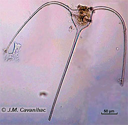
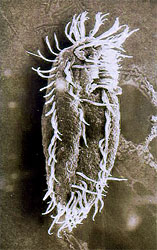

---
aliases:
  - Alveolates
title: Alveolates
---

# [[Alveolates]] 

#is_a/bio-Kingdom 
#is_a :: [[../../Taxon_Rank/bio~Kingdom|bio~Kingdom]]  

 

## #has_/text_of_/abstract 

> The **Alveolates** (meaning "pitted like a honeycomb") are a group of protists, 
> considered a major unranked clade or superphylum within Eukaryota. 
> They are currently grouped 
> - with the stramenopiles and Rhizaria among the protists 
> - with tubulocristate mitochondria into the SAR supergroup.
>
> [Wikipedia](https://en.wikipedia.org/wiki/Alveolate) 

## Introduction 

[Brian S. Leander](Alveolates.md) 

This group of protists was hypothesized only relatively recently, 
and confirmed by molecular studies by Gajadhar et al. (1991). 

The taxon contains three major taxa with very different adaptive strategies
- the flagellated dinoflagellates, 
- the almost completely parasitic apicomplexa, and 
- the ciliated ciliates. 

The relationships among the major lines of alveolates is still to be resolved 
as is the sister group relationship of this territory.

## Characteristics

ubulocristate protists with the cell surface underlain by a series of
abutting sacs or alveoli - or derived from such organisms.

## Phylogeny 

-   « Ancestral Groups   
    -   [Eukarya](../Eukarya.md)
    -   [Tree of Life](../Tree_of_Life.md) 

-   ◊ Sibling Groups of  Eukaryotes
    -   [Choanoflagellates](Choanoflagellates.md)
    -   [Animals](Animals.md)
    -   [Fungi](Fungi.md)
    -   [Stramenopiles](Stramenopiles.md)
    -   Alveolates
    -   [Rhodophyta](Rhodophyta.md)
    -   [Green plants](Plant.md)
    -   [The other protists](The_other_protists)

-   »   Subgroups
    -   [Euapicomplexa](Alveolates/Euapicomplexa.md)

## Title Illustrations

-----------------------
  
Scientific Name ::   Ceratium (Dinoflagellates)
Acknowledgements   Image courtesy [BIODIDAC](http://biodidac.bio.uottawa.ca/)
Copyright ::          © J. M. Cavanihac

---------------------------------------------------------------------------
[Stylonychia(Ciliates)](Alveolates/Ciliates~Stylonychia.jpg) 
Scientific Name ::     Stylonychia (Ciliates)
Comments             Scanning electron micrograph
Specimen Condition   Dead Specimen
Copyright ::            © [BIODIDAC](http://biodidac.bio.uottawa.ca/index.htm) 

## Confidential Links & Embeds: 

### #is_/same_as :: [Alveolates](/_Standards/bio/bio~Domain/Eukarya/Alveolates.md) 

### #is_/same_as :: [Alveolates.public](/_public/bio/bio~Domain/Eukarya/Alveolates.public.md) 

### #is_/same_as :: [Alveolates.internal](/_internal/bio/bio~Domain/Eukarya/Alveolates.internal.md) 

### #is_/same_as :: [Alveolates.protect](/_protect/bio/bio~Domain/Eukarya/Alveolates.protect.md) 

### #is_/same_as :: [Alveolates.private](/_private/bio/bio~Domain/Eukarya/Alveolates.private.md) 

### #is_/same_as :: [Alveolates.personal](/_personal/bio/bio~Domain/Eukarya/Alveolates.personal.md) 

### #is_/same_as :: [Alveolates.secret](/_secret/bio/bio~Domain/Eukarya/Alveolates.secret.md)

