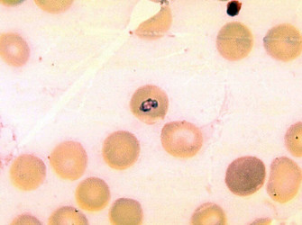

# [[Piroplasmorida]] 

## #has_/text_of_/abstract 

> Piroplasmida is an order of parasites in the phylum Apicomplexa. 
> 
> They divide by binary fission and as sporozoan parasites they possess sexual and asexual phases 
> (sexual reproduction occurs in the tick gut). 
> They include the tick parasites Babesia and Theileria.
>
> [Wikipedia](https://en.wikipedia.org/wiki/Piroplasmida) 

## Phylogeny 

-   « Ancestral Groups  
    -  [Euapicomplexa](../Euapicomplexa.md))
    -  [Alveolates](../../Alveolates.md))
    -  [Eukarya](../../../Eukarya.md))
    -   [Tree of Life](../../../Tree_of_Life.md)

-   ◊ Sibling Groups of  Euapicomplexa
    -   [Plasmodiidae](Plasmodiidae)
    -   Piroplasmorida

-   » Sub-Groups 
	-   *Anthemosomatidae*
	    -   *Anthemosoma*
	-   *Babesiidae*
	    -   *Babesia*
	    -   *Echinozoon*
	-   *Haemohormidiidae*
	    -   *Cristalloidophora*
	    -   *Dobellia*
	    -   *Echinococcidium*
	    -   *Globidiellum*
	    -   *Haemohormidium*
	    -   *Joyeuxella*
	    -   *Rhabdospora*
	    -   *Sauroplasma*
	    -   *Spermatobium*
	    -   *Toxocytis*
	    -   *Trophosphaera*
	-   *Theileriidae*
	    -   *Theileria*

## Title Illustrations

  ----------------------------
 
Scientific Name ::     Babesia microti
  Comments             Blood smear showing larger trophic stage of Babesia microti in erythrocyte.
  Creator              Dr. George Healy (Center for Disease Control)
  Specimen Condition   Dead Specimen
  Source Collection    [Public Health Image Library](http://phil.cdc.gov/Phil/default.asp)

## Confidential Links & Embeds: 

### #is_/same_as :: [Piroplasmorida](/_Standards/bio/bio~Domain/Eukarya/Alveolates/Euapicomplexa/Piroplasmorida.md) 

### #is_/same_as :: [Piroplasmorida.public](/_public/bio/bio~Domain/Eukarya/Alveolates/Euapicomplexa/Piroplasmorida.public.md) 

### #is_/same_as :: [Piroplasmorida.internal](/_internal/bio/bio~Domain/Eukarya/Alveolates/Euapicomplexa/Piroplasmorida.internal.md) 

### #is_/same_as :: [Piroplasmorida.protect](/_protect/bio/bio~Domain/Eukarya/Alveolates/Euapicomplexa/Piroplasmorida.protect.md) 

### #is_/same_as :: [Piroplasmorida.private](/_private/bio/bio~Domain/Eukarya/Alveolates/Euapicomplexa/Piroplasmorida.private.md) 

### #is_/same_as :: [Piroplasmorida.personal](/_personal/bio/bio~Domain/Eukarya/Alveolates/Euapicomplexa/Piroplasmorida.personal.md) 

### #is_/same_as :: [Piroplasmorida.secret](/_secret/bio/bio~Domain/Eukarya/Alveolates/Euapicomplexa/Piroplasmorida.secret.md)

