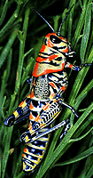
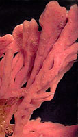
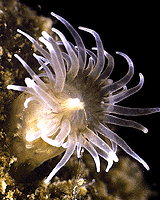

---
aliases:
- aadupen
- Aboa
- Abus
- ainmhí
- ajal
- Amudr
- anifail
- animais
- Animal
- Animale
- Animales
- Animali
- Animalia
- animalo
- Animals
- Animalu
- animałe
- Animol
- Animâ
- annimal
- anụmanụ
- Armali
- Awesis
- ayup
- ayvan
- Aɣersiw
- baagh
- Bagan
- Beathach
- Beburon
- Bestia
- Beêsten
- Biby
- Biesse
- Bieste
- Binatang
- Binensotta
- binkɔbigu
- bétye
- Bêesten
- Bʋnkɔnbid Yʋda
- Dabba
- danlu
- Deert
- Diarten
- dier
- dieren
- Dierte
- djur
- Doenghduz
- Dundat yi
- duŋo
- dyr
- dyreriket
- dzeivinīki
- dzīvnieki
- Déiereräich
- Dông-ŭk
- dýr
- Dēor
- elleekodde
- elliidriika
- eläinkunta
- Eläjäq
- Enyval
- Franz Peter
- Gedier
- gyvūnai
- Gīvē
- haiwan
- Hayop
- hayvan
- Hayvonlar
- Haywanlar
- Haýwanlar
- hewan
- heyvan
- Heywan
- holoholona
- Hova
- Héwan
- Həyvonon
- ijo lon tawa
- Inyamaswa
- isilwane
- Izilwanyana
- Jaanwar
- Jelu
- kafsha
- Kanlin
- Kararehe
- Kewan
- Kibulu
- Kpɩnɛ
- loen
- loomad
- Lã
- Mananap
- Manumanu
- Metazoa
- Meti
- Mhuka
- mnyama
- Monumanu
- mu᷆rnà
- Mymba
- Mürütkana
- Naaldeehii
- Nim
- Niġrun
- nyam
- Nyama
- Phukha
- qemuzimuzip
- qsinu
- Regnul Animalia
- Regnum Animalia
- Sato
- Sato kéwan
- Silwane
- Swiharhi
- tayam
- Thûng-vu̍t
- Tier
- Tōng-bu̍t
- Uywa
- Vasho
- Viecha
- Vinyama
- Xayawaan
- xaywannar
- Yōlcatl
- Zannimo
- zwierzęta
- zwiyrzynta
- zwěrjo
- állat
- ìmbɔ̀ŋ
- động vật
- Ŋkwa mena ndo si tsāʼ
- žeeʹvetkåʹdd
- živali
- Živatad
- životinja
- životinje
- živočichové
- živočíchy
- ζώο
- Амитан
- Амьтан
- Аԥстәы
- Быдла
- Гьайванар
- дийнаташ
- Жануарлар
- Жаныбарлар
- животиње
- животни
- животные
- жувата
- жывёлы
- жыва
- лулосъёс
- Пода
- Псэушъхьэ
- Ракшат
- тварина
- хайваннар
- Хайуандар
- Харамай
- Хӏайван
- цæрæгойтæ
- Чĕр чун
- Янлык
- ҷонвар
- կենդանիներ
- בעלי חיים
- جاندار
- جانور
- جانوران
- حئیوان
- حيوان
- حيوانات
- حیوون
- ژوي
- گیانلەبەر
- ھايۋانات
- ܚܝܘܬܐ
- ߓߌߦߊ߲
- जनावर
- जन्तवः
- जानवर
- पशु
- प्राणी
- প্রাণী
- প্ৰাণী
- ਜਾਨਵਰ
- પ્રાણી
- ପଶୁ
- விலங்கு
- జంతువు
- ಪ್ರಾಣಿ
- ജന്തു
- සත්තු
- สัตว์
- ສັດ
- སེམས་ཅན
- སྲོག་ཆགས་
- သတ္တဝါ
- သတ်းၻဝႃႇ
- ჩხოლარეფი
- ცხოველები
- እንስሳ
- ᎦᏂᏝᎢ
- ᐱᓯᐢᑭᐤ
- ᓂᕐᔪᑦ
- សត្វ
- ᱡᱤᱣᱟᱹᱞᱤ
- ẹranko
- ⴰⵎⵓⴷⵔ
- 动物
- 动物界
- 動物
- 동물
- "\U00010333\U00010339\U0001033F\U00010343"
has_id_wikidata: Q729
Archive_of_Our_Own_tag:
- Animals
- Animal
Baidu_Tieba_name: 动物
code_of_nomenclature: '[[_Standards/WikiData/WD~International_Code_of_Zoological_Nomenclature,13011]]'
Commons_category: Animalia
described_by_source:
- '[[../../../WikiData/WD~Brockhaus_and_Efron_Encyclopedic_Dictionary,602358]]'
- '[[_Standards/WikiData/WD~Encyclopædia_Britannica_11th_edition,867541]]'
- '[[_Standards/WikiData/WD~Dictionnaire_Infernal,1210353]]'
- '[[_Standards/WikiData/WD~Evangelisches_Kirchenlexikon,1381325]]'
- '[[_Standards/WikiData/WD~Religion_in_Geschichte_und_Gegenwart,1514334]]'
- '[[_Standards/WikiData/WD~Armenian_Soviet_Encyclopedia,2657718]]'
- '[[_Standards/WikiData/WD~Granat_Encyclopedic_Dictionary,4532138]]'
- "[[_Standards/WikiData/WD~The_New_Student's_Reference_Work,16082057]]"
- '[[_Standards/WikiData/WD~The_Encyclopedia_Americana,19085957]]'
- '[[_Standards/WikiData/WD~Small_Brockhaus_and_Efron_Encyclopedic_Dictionary,19180675]]'
- '[[_Standards/WikiData/WD~Meyers_Konversations-Lexikon,_4th_edition_(1885–1890),19219752]]'
- '[[_Standards/WikiData/WD~Encyclopædia_Britannica_Ninth_Edition,20096917]]'
- '[[_Standards/WikiData/WD~The_Domestic_Encyclopædia;_Or,_A_Dictionary_Of_Facts,_And_Useful_Knowledge,56441911]]'
- '[[_Standards/WikiData/WD~Metropolitan_Museum_of_Art_Tagging_Vocabulary,106727050]]'
- '[[_Standards/WikiData/WD~Encyclopedia_of_Early_Modern_History_Online,109120178]]'
Dewey_Decimal_Classification:
- 590
different_from:
- '[[_Standards/WikiData/WD~Eleotris_melanosoma,717377]]'
- '[[_Standards/WikiData/WD~Q19176651,19176651]]'
- '[[_Standards/WikiData/WD~Bête,65066169]]'
disjoint_union_of: '[[_Standards/WikiData/WD~list_of_values_as_qualifiers,23766486]]'
EAGLE_id: decor/lod/28
EPPO_Code: 1ANIMK
equivalent_class:
- http://dbpedia.org/ontology/Animal
- http://kbpedia.org/kko/rc/Animal
hashtag:
- animal
- animals
has_characteristic:
- '[[_Standards/WikiData/WD~animal_locomotion,925958]]'
- '[[_Standards/WikiData/WD~animal_taxonomy,1469725]]'
- '[[_Standards/WikiData/WD~animal_behavior,2990593]]'
- '[[_Standards/WikiData/WD~animal_culture,3007160]]'
has_list: '[[_Standards/WikiData/WD~list_of_animal_classes,1401693]]'
image: http://commons.wikimedia.org/wiki/Special:FilePath/2010-kodiak-bear-1.jpg
instance_of:
- '[[_Standards/WikiData/WD~first-order_class,104086571]]'
- '[[_Standards/WikiData/WD~taxon,16521]]'
IPTC_NewsCode: mediatopic/20000500
ITIS_TSN: 202423
MeSH_tree_code: B01.050
montage_image: http://commons.wikimedia.org/wiki/Special:FilePath/Animal%20diversity.png
OmegaWiki_Defined_Meaning: 194
parent_taxon: '[[_Standards/WikiData/WD~Apoikozoa,24966129]]'
pronunciation_audio:
- http://commons.wikimedia.org/wiki/Special:FilePath/LL-Q7026%20%28cat%29-Millars-animal.wav
- http://commons.wikimedia.org/wiki/Special:FilePath/LL-Q8752%20%28eus%29-ElsaBornFree-animalia.wav
properties_for_this_type:
- main food source
- gait
said_to_be_the_same_as: '[[_Standards/WikiData/WD~Q19719608,19719608]]'
social_media_followers: 15948
start_time: -665000000-01-01
studied_in:
- '[[_Standards/WikiData/WD~veterinary_medicine,170201]]'
- '[[_Standards/WikiData/WD~biology,420]]'
- '[[_Standards/WikiData/WD~zoology,431]]'
subclass_of: '[[_Standards/WikiData/WD~heterotroph,159344]]'
subreddit:
- Animal
taxon_common_name:
- animal
- animales
- dyreriket
- živali
- 动物界
taxon_name: Animalia
taxon_rank: '[[_Standards/WikiData/WD~kingdom,36732]]'
title: Animals
topic_s_main_template: '[[_Standards/WikiData/WD~Template_Animalia,6679944]]'
UMLS_CUI: C0003062
union_of: '[[_Standards/WikiData/WD~list_of_values_as_qualifiers,23766486]]'
U_S_National_Archives_Identifier:
- 10637132
video: http://commons.wikimedia.org/wiki/Special:FilePath/Brown%20bear%20fishing%20for%20salmon%20--%20Crescent%20Lake%2C%20Alaska%20-%20August%202015.webm
dv_has_:
  name_:
    ab: Аԥстәы
    ace: binatang
    ady: Псэушъхьэ
    af: dier
    am: እንስሳ
    an: Animalia
    ang: Dēor
    anp: पशु
    ar: حيوانات
    arc: ܚܝܘܬܐ
    ary: حيوان
    arz: حيوان
    as: প্ৰাণী
    ast: animal
    atj: Awesis
    awa: पशु
    ay: Uywa
    az: heyvan
    azb: حئیوان
    ba: Хайуандар
    ban: Beburon
    bar: Viecha
    bas: ìmbɔ̀ŋ
    bbc: Binatang
    bcl: Hayop
    be: жывёлы
    be_tarask: жывёлы
    bew: Héwan
    bg: животни
    bho: जानवर
    bi: Animol
    bm: Bagan
    bn: প্রাণী
    bo: སྲོག་ཆགས་
    br: loen
    bs: životinja
    bxr: Амитан
    ca: animal
    cdo: Dông-ŭk
    ce: дийнаташ
    ceb: Mananap
    chr: ᎦᏂᏝᎢ
    chy: Hova
    ckb: گیانلەبەر
    co: Animale
    cr: ᐱᓯᐢᑭᐤ
    crh: ayvan
    cs: živočichové
    cv: Чĕр чун
    cy: anifail
    da: dyr
    dag: binkɔbigu
    de: Tier
    de_ch: Tier
    diq: Heywan
    dtp: tayam
    dty: प्राणी
    dz: སེམས་ཅན
    ee: Lã
    el: ζώο
    en: Animalia
    en_ca: Animal
    en_gb: animal
    en-us: animal
    eo: animalo
    es: Animalia
    et: loomad
    eu: animalia
    ext: Animalia
    fa: جانوران
    fi: eläinkunta
    fj: Manumanu
    fo: dýr
    fr: animal
    frp: bétye
    frr: Diarten
    fy: dier
    ga: ainmhí
    gan: 動物
    gcr: Zannimo
    gd: Beathach
    gl: animais
    gn: Mymba
    got: "\U00010333\U00010339\U0001033F\U00010343"
    gpe: Animal
    gsw: Dier
    gu: પ્રાણી
    guc: Mürütkana
    guw: Kanlin
    gv: baagh
    ha: Dabba
    hak: Thûng-vu̍t
    haw: holoholona
    he: בעלי חיים
    hi: प्राणी
    hif: Jaanwar
    hr: životinje
    hsb: zwěrjo
    ht: Zannimo
    hu: állat
    hy: կենդանիներ
    ia: animal
    iba: Jelu
    id: hewan
    ie: animal
    ig: anụmanụ
    ik: Niġrun
    ilo: ayup
    inh: Дийнаташ
    io: animalo
    is: dýr
    it: animale
    iu: ᓂᕐᔪᑦ
    ja: 動物
    jam: Animal
    jbo: danlu
    jv: Sato kéwan
    ka: ცხოველები
    kaa: Haywanlar
    kab: Aɣersiw
    kbp: Kpɩnɛ
    kcg: nyam
    kg: Kibulu
    kge: Binatang
    kk: Жануарлар
    km: សត្វ
    kn: ಪ್ರಾಣಿ
    knc: Franz Peter
    ko: 동물
    koi: Пода
    ks: جانور
    ksh: Dier
    ku: ajal
    ku_latn: ajal
    kus: Bʋnkɔnbid Yʋda
    kw: Enyval
    ky: Жаныбарлар
    la: animalia
    lad: Animal
    lb: Déiereräich
    lbe: Хӏайван
    lez: Гьайванар
    lfn: animal
    li: Bieste
    lij: Animalia
    lld: Tier
    lmo: Bestia
    ln: Nyama
    lo: ສັດ
    lt: gyvūnai
    ltg: dzeivinīki
    lv: dzīvnieki
    lzh: 動物
    mai: पशु
    map_bms: Kewan
    mcn: mu᷆rnà
    mdf: жувата
    mg: Biby
    mhr: Янлык
    mi: Kararehe
    min: Binatang
    mk: животни
    ml: ജന്തു
    mn: Амьтан
    mr: प्राणी
    ms: haiwan
    ms_arab: حيوان
    mt: annimal
    mul: Animalia
    mwl: Animal
    my: သတ္တဝါ
    myv: Ракшат
    mzn: حیوون
    nah: Yōlcatl
    nan: Tōng-bu̍t
    nap: Animali
    nb: dyr
    nds: Deert
    nds_nl: dieren
    ne: जनावर
    new: पशु
    nia: hewan
    nl: dier
    nn: dyr
    nov: animalia
    nqo: ߓߌߦߊ߲
    nrm: Animâ
    nv: Naaldeehii
    oc: animalia
    om: Binensotta
    or: ପଶୁ
    os: цæрæгойтæ
    pa: ਜਾਨਵਰ
    pam: Animal
    pap: Animal
    pdc: Gedier
    pl: zwierzęta
    pms: Animalia
    pnb: جانور
    ps: ژوي
    pt: animalia
    pt_br: Animalia
    pwn: qemuzimuzip
    qu: Uywa
    rki: သတ္တဝါ
    rm: Animals
    rmy: Vasho
    ro: Regnul Animalia
    roa-tara: Regnum Animalia
    ru: животные
    rue: Быдла
    rup: Animalu
    rw: Inyamaswa
    sa: जन्तवः
    sah: Харамай
    sat: ᱡᱤᱣᱟᱹᱞᱤ
    sc: Animalia
    scn: Armali
    sco: animal
    sd: جاندار
    se: elliidriika
    sgs: Gīvē
    sh: životinje
    shi: Amudr
    shn: သတ်းၻဝႃႇ
    si: සත්තු
    sjd: жыва
    sk: živočíchy
    sl: živali
    smn: elleekodde
    sms: žeeʹvetkåʹdd
    sn: Mhuka
    so: Xayawaan
    sq: kafsha
    sr: животиње
    srn: Meti
    ss: Silwane
    stq: Dierte
    su: Sato
    sv: djur
    sw: mnyama
    szl: zwiyrzynta
    szy: aadupen
    ta: விலங்கு
    tay: qsinu
    te: జంతువు
    tg: ҷонвар
    th: สัตว์
    ti: እንስሳ
    tk: Haýwanlar
    tl: hayop
    tly: Həyvonon
    to: Monumanu
    tok: ijo lon tawa
    tpi: Abus
    tr: hayvan
    ts: Swiharhi
    tt: хайваннар
    tt_cyrl: хайваннар
    tt_latn: xaywannar
    tum: Vinyama
    tw: Aboa
    udm: лулосъёс
    ug: ھايۋانات
    uk: тварина
    ur: جانور
    uz: Hayvonlar
    ve: Phukha
    vec: animałe
    vep: Živatad
    vi: động vật
    vls: Bêesten
    vo: Nim
    vro: Eläjäq
    wa: Biesse
    war: Hayop
    wlx: duŋo
    wo: Dundat yi
    wuu: 動物
    xh: Izilwanyana
    xmf: ჩხოლარეფი
    ybb: Ŋkwa mena ndo si tsāʼ
    yi: בעלי חיים
    yo: ẹranko
    yue: 動物
    za: Doenghduz
    zea: Beêsten
    zgh: ⴰⵎⵓⴷⵔ
    zh: 动物
    zh_cn: 动物
    zh_hans: 动物
    zh_hant: 動物
    zh_hk: 動物
    zh_tw: 動物
    zu: isilwane
---

# [[Animal]] 

#is_/subject_of ::  [[../../Zoology|Zoology]] 

#is_a/bio-Kingdom 
#is_a :: [[../../Taxon_Rank/bio~Kingdom|bio~Kingdom]]  

    

Animalia and their sibling groups within the domain Eukaryota share a common ancestry.

#is_/same_as :: [[../../../WikiData/WD~Animal,729]] 

## #has_/text_of_/abstract 

> **Animals** are multicellular, eukaryotic organisms in the biological kingdom Animalia. 
> 
> With few exceptions, animals consume organic material, breathe oxygen, have myocytes 
> and are able to move, can reproduce sexually, 
> and grow from a hollow sphere of cells, the blastula, during embryonic development. 
> 
> Animals form a clade, meaning that they arose from a single common ancestor. 
> Over 1.5 million living animal species have been described, of which around 1.05 million are insects, over 85,000 are molluscs, and around 65,000 are vertebrates. 
> 
> It has been estimated there are as many as 7.77 million animal species on Earth. 
> Animal body lengths range from 8.5 μm (0.00033 in) to 33.6 m (110 ft). 
> They have complex ecologies and interactions with each other and their environments, 
> forming intricate food webs. 
> The scientific study of animals is known as zoology, 
> and the study of animal behaviour is known as ethology.
>
> The animal kingdom is divided into five major clades, 
> namely Porifera, Ctenophora, Placozoa, Cnidaria and Bilateria. 
> 
> Most living animal species belong to the clade Bilateria, a highly proliferative clade 
> whose members have a bilaterally symmetric and significantly cephalised body plan, 
> and the vast majority of bilaterians belong to two large clades: 
> - the protostomes, which includes organisms such as arthropods, molluscs, flatworms, annelids and nematodes; and 
> - the deuterostomes, which include echinoderms, hemichordates and chordates, the latter of which contains the vertebrates. 
> - The much smaller basal phylum Xenacoelomorpha have an uncertain position within Bilateria.
>
> Animals first appeared in the fossil record in the late Cryogenian period and diversified in the subsequent Ediacaran period in what is known as the Avalon explosion. Earlier evidence of animals is still controversial; the sponge-like organism Otavia has been dated back to the Tonian period at the start of the Neoproterozoic, but its identity as an animal is heavily contested. Nearly all modern animal phyla first appeared in the fossil record as marine species during the Cambrian explosion, which began around 539 million years ago (Mya), and most classes during the Ordovician radiation 485.4 Mya. Common to all living animals, 6,331 groups of genes have been identified that may have arisen from a single common ancestor that lived about 650 Mya during the Cryogenian period.
>
> Historically, Aristotle divided animals into those with blood and those without. Carl Linnaeus created the first hierarchical biological classification for animals in 1758 with his Systema Naturae, which Jean-Baptiste Lamarck expanded into 14 phyla by 1809. In 1874, Ernst Haeckel divided the animal kingdom into the multicellular Metazoa (now synonymous with Animalia) and the Protozoa, single-celled organisms no longer considered animals. In modern times, the biological classification of animals relies on advanced techniques, such as molecular phylogenetics, which are effective at demonstrating the evolutionary relationships between taxa.
>
> Humans make use of many other animal species for food (including meat, eggs, and dairy products), for materials (such as leather, fur, and wool), as pets and as working animals for transportation, and services. Dogs, the first domesticated animal, have been used in hunting, in security and in warfare, as have horses, pigeons and birds of prey; while other terrestrial and aquatic animals are hunted for sports, trophies or profits. Non-human animals are also an important cultural element of human evolution, having appeared in cave arts and totems since the earliest times, and are frequently featured in mythology, religion, arts, literature, heraldry, politics, and sports.
>
> [Wikipedia](https://en.wikipedia.org/wiki/Animal) 

## Characteristics

Here are some key differences between Animalia and their sibling groups:

### Mode of Nutrition:

Animals are predominantly heterotrophic organisms, 
meaning they obtain their nutrients by ingesting and digesting organic matter. 
They typically have specialized feeding structures such as mouths, digestive tracts, 
and associated organs like stomachs or intestines.

Fungi are also heterotrophic but obtain their nutrients through absorption rather than ingestion. They secrete enzymes that break down organic matter in their environment, 
and then absorb the resulting nutrients through their cell walls. 
Fungi often grow on or within their food source 
and can decompose a wide range of organic materials.

### Cell Wall Composition

Animals lack cell walls in their cells. 
Instead, their cells are typically surrounded by a flexible plasma membrane.

Fungi have cell walls primarily composed of chitin, a structural polysaccharide. 
This provides rigidity and support to fungal cells and distinguishes them from animals, 
which lack chitinous cell walls.

### Body Organization:

Animals exhibit a wide range of body plans and organizational structures, 
from simple tissues to complex organ systems. 
They often display symmetry (such as radial or bilateral) and have specialized sensory organs, 
nervous systems, and locomotion strategies.

Choanoflagellates are unicellular or colonial organisms with a single flagellum 
surrounded by a collar of microvilli. 
While they share some cellular similarities with animals 
(such as the presence of collar cells resembling choanocytes found in sponges), 
they lack the tissue differentiation and complex body plans characteristic of animals.

### Reproduction and Life Cycle: 
Animals exhibit diverse reproductive strategies, including sexual and asexual reproduction. 
Many animals have complex life cycles involving distinct larval and adult stages, 
as well as various modes of development (such as direct or indirect development).

Fungi reproduce sexually and/or asexually, often producing spores as a means of dispersal. 
They may have complex life cycles involving both sexual and asexual stages, 
but these are typically simpler than the life cycles of animals.

### Ecological Roles:

Animals occupy diverse ecological niches and play various roles in ecosystems 
as predators, prey, scavengers, pollinators, and more. 
They contribute to nutrient cycling, energy flow, and ecosystem stability 
through their __interactions with other organisms__ and their environments.

Fungi are essential decomposers in ecosystems, 
breaking down organic matter and recycling nutrients. 
They form symbiotic relationships with plants (such as mycorrhizae) and other organisms, contributing to nutrient uptake and enhancing plant growth.

These differences highlight the diverse adaptations and ecological roles 
of animals and their sibling groups within the broader context of eukaryotic diversity.

## Phylogeny 

-   « Ancestral Groups  
    -   [Eukarya](../Eukarya.md)
    -   [Tree of Life](../Tree_of_Life.md)

-   ◊ Sibling Groups of  Eukaryotes
    -   [Choanoflagellates](Choanoflagellates.md)
    -   Animals
    -   [Fungi](Fungi.md)
    -   [Stramenopiles](Stramenopiles.md)
    -   [Alveolate](Alveolate.md)
    -   [Rhodophyta](Rhodophyta.md)
    -   [Green plants](Plant.md)
    -   [The other protists](The_other_protists)

-   » Sub-Groups

    -   [Bilateria](Animal/Bilateria.md)
    -   [Myxozoa](Animal/Myxozoa.md)
    -   [Cnidaria](Animal/Cnidaria.md)
    -   [Ctenophora](Animal/Ctenophora.md)
    -   [Placozoa](Animal/Placozoa.md)
    -   [Sponge](Animal/Sponge.md)

## Title Illustrations

----------------------------------------------------------------------------------------

  scientific_name ::  Dactylotum variegatum 
  location ::        Arizona
  Comments          A colorful grasshopper (Bilateria)
  copyright ::         © 1995 [Joseph L. Spencer](http://www.inhs.uiuc.edu/staff/index.php?action=list&user_name=spencer1) 

----------------------------------------------------------------------------------------

  scientific_name ::  Ctenophora
  Comments          A comb jelly from the Texas State Aquarium
  copyright ::         © [Greg and Marybeth Dimijian](http://www.dimijianimages.com/) 

----------------------------------------------------------------------------

  scientific_name ::  Haliclona
  Comments          A sponge (Porifera)
  Creator           Photograph by David Remsen
  copyright ::         © 1995 [Marine Biological Laboratory, Woods Hole](http://www.mbl.edu/) 

-------------------------------------------------------------------------------

  scientific_name ::     Haliplanella luciae
  Comments             A sea anemone (Cnidaria)
  Acknowledgements     Photograph from Gray Museum Slide Collection
  specimen_condition ::  Live Specimen
  copyright ::            © 1995 [Marine Biological Laboratory, Woods Hole](http://www.mbl.edu/) 

## Confidential Links & Embeds: 

### #is_/same_as :: [[/_Standards/bio/bio~Domain/Eukarya/Animal|Animal]] 

### #is_/same_as :: [[/_public/bio/bio~Domain/Eukarya/Animal.public|Animal.public]] 

### #is_/same_as :: [[/_internal/bio/bio~Domain/Eukarya/Animal.internal|Animal.internal]] 

### #is_/same_as :: [[/_protect/bio/bio~Domain/Eukarya/Animal.protect|Animal.protect]] 

### #is_/same_as :: [[/_private/bio/bio~Domain/Eukarya/Animal.private|Animal.private]] 

### #is_/same_as :: [[/_personal/bio/bio~Domain/Eukarya/Animal.personal|Animal.personal]] 

### #is_/same_as :: [[/_secret/bio/bio~Domain/Eukarya/Animal.secret|Animal.secret]] 

