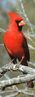
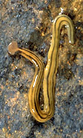
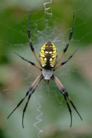
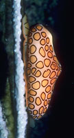
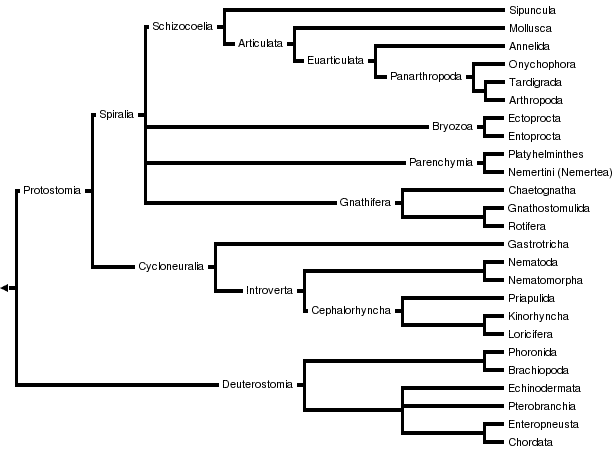

# [[Bilateria]] 

#is_a/bio-Phylum  
#is_a :: [[../../../Taxon_Rank/bio-Kingdom/bio-Phylum|bio-Phylum]]  

Triploblasts, Bilaterally symmetrical animals with three germ layers 

 
    

## #has_/text_of_/abstract 

> **Bilateria** is a clade of animals characterised by bilateral symmetry during embryonic development. 
> This means their body plans are laid around a longitudinal axis 
> with a front (or "head") and a rear (or "tail") end, 
> as well as a left–right–symmetrical belly (ventral) and back (dorsal) surface. 
> 
> Nearly all bilaterians maintain a bilaterally symmetrical body as adults; 
> the most notable exception is the echinoderms, which have pentaradial symmetry as adults, 
> but  bilateral symmetry as embryos. 
> 
> With few exceptions, bilaterian embryos are triploblastic, having three germ layers: 
> - endoderm, 
> - mesoderm and 
> - ectoderm, 
> and have complete digestive tracts with a separate mouth and anus. 
> 
> Some bilaterians lack body cavities, 
> while others have a primary body cavity derived from the blastocoel, 
> or a secondary cavity, the coelom. 
> 
> Cephalization is a characteristic feature among most bilaterians, 
> where the sense organs and central nerve ganglia 
> become concentrated at the front end of the animal.
>
> Bilaterians constitute one of the five main lineages of animals, the other four being 
> - Porifera (sponges), 
> - Cnidaria (jellyfish, hydrozoans, sea anemones and corals), 
> - Ctenophora (comb jellies) and 
> - Placozoa. 
> 
> They rapidly diversified in the late Ediacaran and the Cambrian, 
> and are now by far the most successful animal lineage, with over 98% of known animal species. 
> 
> Bilaterians are traditionally classified as either deuterostomes or protostomes, 
> based on whether the blastopore becomes the anus or mouth. 
> 
> The recently erected phylum Xenacoelomorpha, once thought to be flatworms, 
> has provided an extra challenge to bilaterian taxonomy, as they likely do not belong to either group.
>
> [Wikipedia](https://en.wikipedia.org/wiki/Bilateria) 

## Introduction

Bilateria represents a major evolutionary advancement over its parent group, 
the diploblasts (animals with two embryonic germ layers), 
which include organisms like cnidarians (jellyfish, corals, and sea anemones). 

## Characteristics

Here are some key differences between Bilateria and their parent group:

### Triplastic Embryonic Development: 
One of the most significant differences is the presence of three germ layers 
(ectoderm, mesoderm, and endoderm) in bilaterally symmetrical organisms, 
allowing for the development of complex organ systems. 
In contrast, diploblasts only possess two germ layers (ectoderm and endoderm).

### Bilateral Symmetry: 
Bilaterians exhibit bilateral symmetry, 
meaning they can be divided into two equal halves along a single plane. 
This symmetry is associated with cephalization, 
the concentration of sensory organs and nervous tissues at the anterior end, 
which aids in directional movement and more complex behavior. 
In contrast, diploblasts typically display radial symmetry, 
with body parts arranged around a central axis.

### Central Nervous System: 
Bilaterians possess a centralized nervous system, 
typically with a brain and nerve cords running along the length of the body. 
This centralized nervous system allows for more coordinated and complex responses to stimuli 
compared to the diffuse nerve net found in diploblasts.

### Mesoderm and Coelom Formation: 
Bilaterians have a mesoderm, a third germ layer between the ectoderm and endoderm, 
which gives rise to structures such as muscles, bones, and the circulatory system. 
Many bilaterians also develop a coelom, a fluid-filled body cavity derived from mesoderm, 
which provides space for greater organ specialization and complexity. 
Diploblasts lack a true mesoderm and coelom.

### Digestive System Complexity: 
Bilaterians typically have a more complex digestive system compared to diploblasts. 
Bilaterians often have a complete digestive tract with separate mouth and anus, 
allowing for more efficient food processing and digestion. 
In contrast, diploblasts have a gastrovascular cavity with a single opening 
serving as __both mouth and anus__.

These differences represent key evolutionary innovations 
that have contributed to the success and diversity of bilaterally symmetrical organisms. 
They allowed for the development of more complex body plans 
and increased adaptability to various environments.

## Phylogeny 

-   « Ancestral Groups  
    -   [Animals](../Animals.md) 
    -   [Eukarya](../../Eukarya.md) 
    -   [Tree of Life](../../Tree_of_Life.md) 

-   ◊ Sibling Groups of  Animals
    -   Bilateria
    -   [Myxozoa](Myxozoa.md)
    -   [Cnidaria](Cnidaria.md)
    -   [Ctenophora](Ctenophora.md)
    -   [Placozoa](Placozoa.md)
    -   [Sponge](Sponge.md)

-   » Sub-Groups

    -   [Deuterostomia](Bilateria/Deutero.md)
    -   [Arthropoda](Bilateria/Arthropoda.md)
    -   [Onychophora](Bilateria/Onychophora.md)
    -   [Tardigrade](../../../bio~Tree/Tardigrade.md)
    -   [Nematoda](Bilateria/Nematoda.md)
    -   [Nematomorpha](Bilateria/Nematomorpha.md)
    -   [Kinorhyncha](Bilateria/Kinorhyncha.md)
    -   [Loricifera](Bilateria/Loricifera.md)
    -   [Priapulida](Bilateria/Priapulida.md)
    -   [Arrow_Worm](../../../bio~Tree/Arrow_Worm.md)
    -   [Gastrotricha](Bilateria/Gastrotricha.md)
    -   [Rotifera](Bilateria/Rotifera.md)
    -   [Gnathostomulida](Bilateria/Gnathostomulida.md)
    -   [Limnognathia maerski](Limnognathia_maerski)
    -   [Cycliophora](Bilateria/Cycliophora.md)
    -   [Mesozoa](Bilateria/Mesozoa.md)
    -   [Platyhelminthes](Bilateria/Platyhelminthes.md)
    -   [Annelida](Bilateria/Annelida.md)
    -   [Bryozoa](Bilateria/Bryozoa.md)
    -   [Sipuncula](Bilateria/Sipuncula.md)
    -   [Mollusca](Bilateria/Mollusca.md)
    -   [Nemertea](Bilateria/Nemertea.md)
    -   [Entoprocta](Bilateria/Entoprocta.md)
    -   [Phoronida](Bilateria/Phoronida.md)
    -   [Brachiopoda](Bilateria/Brachiopoda.md)

### Discussion of Phylogenetic Relationships

Due to new evidence from developmental biology and molecular
phylogenetics, ideas about bilaterian relationships have undergone a
major paradigm shift within the last decade. The new hypotheses shown in
the tree above are now widely accepted, but there are also many sceptics
who emphasize the pitfalls and inconsistencies associated with the new
data. One of the most prominent alternative views based on morphological
evidence is championed by Nielsen (2001):

## Title Illustrations

  ------------
  Scientific Name ::     Cardinalis cardinalis
  Location ::           Arizona
  Comments             A cardinal bird
  Specimen Condition   Live Specimen
  Copyright ::            © 1995 D. Brent Burt
  ------------

  ----------------------------------------------------------------------------
  Scientific Name ::  Bipalium
  Location ::        Dallas, Texas
  Comments          A planarian flatworm (Platyhelminthes) after emerging from wet soil after rain
  Copyright ::         © [Greg and Marybeth Dimijian](http://www.dimijianimages.com/) 
  ----------------------------------------------------------------------------

  ----------------------------------------------------------------------------
  Scientific Name ::  Argiope
  Location ::        Dallas, Texas
  Comments          Argiope spider (Arthropoda) on web with stabilimentum
  Copyright ::         © [Greg and Marybeth Dimijian](http://www.dimijianimages.com/) 
  ----------------------------------------------------------------------------

  ------------------------------------------------------------------------------
  Scientific Name ::  Cyphoma gibbosum
  Location ::        Cayman Brac
  Comments          Flamingo tongue snail (Mollusca) with mantle extended over shell, foraging on branched coral
  Copyright ::         © 1981 [Greg and Marybeth Dimijian](http://www.dimijianimages.com/) 
  ------------------------------------------------------------------------------

## Confidential Links & Embeds: 

### #is_/same_as :: [Bilateria](/_Standards/bio/bio~Domain/Eukarya/Animal/Bilateria.md) 

### #is_/same_as :: [Bilateria.public](/_public/bio/bio~Domain/Eukarya/Animal/Bilateria.public.md) 

### #is_/same_as :: [Bilateria.internal](/_internal/bio/bio~Domain/Eukarya/Animal/Bilateria.internal.md) 

### #is_/same_as :: [Bilateria.protect](/_protect/bio/bio~Domain/Eukarya/Animal/Bilateria.protect.md) 

### #is_/same_as :: [Bilateria.private](/_private/bio/bio~Domain/Eukarya/Animal/Bilateria.private.md) 

### #is_/same_as :: [Bilateria.personal](/_personal/bio/bio~Domain/Eukarya/Animal/Bilateria.personal.md) 

### #is_/same_as :: [Bilateria.secret](/_secret/bio/bio~Domain/Eukarya/Animal/Bilateria.secret.md)

