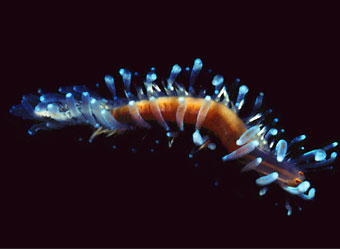
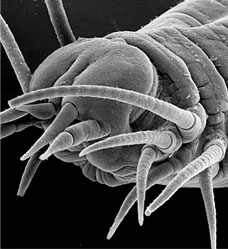
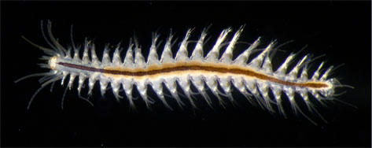
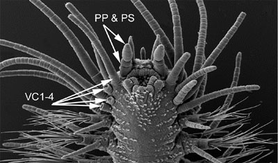
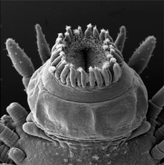
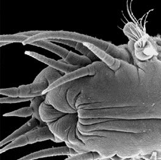

---
title: Hesionidae
---

## Phylogeny 

-   « Ancestral Groups  
    -  [Phyllodocida](../Phyllodocida.md))
    -  [Annelida](../../Annelida.md))
    -  [Bilateria](../../../Bilateria.md))
    -  [Animals](../../../../Animals.md))
    -  [Eukarya](../../../../../Eukarya.md))
    -   [Tree of Life](../../../../../Tree_of_Life.md)

-   ◊ Sibling Groups of  Phyllodocida
    -   Hesionidae
    -   [Minor holopelagic         Phyllodocida](Minor_holopelagic_Phyllodocida)

-   » Sub-Groups
    -  [capricornia](Hesionidae/capricornia.md))

# [[Hesionidae]]  

    

## Introduction

[Fredrik Pleijel and Greg W. Rouse]() 

All hesionids are benthic as adults and occur in marine environments
only. They have a world-wide distribution in all seas, but are more
common in shallow water and on continental shelves than in deep-water. A
noteworthy exception is their presence at hydrothermal vents, cold-seep
areas and on whale carcasses; eight species, some of which can appear in
huge abundances, have been described from these habitats to date. Based
on the few taxa that have been studied, it would appear that hesionids
are active predators (see Pleijel, 2001 for references).
)

Figure 3. *Gyptis* sp., from shallow waters of South Australia.
Copyright © 2004 Greg W. Rouse.
### Characteristics

Synapomorphies for Hesionidae relate to the cephalisation of the first
segments, and include the enlarged dorsal and ventral cirri and
cirrophores on segment 1-5 and 1-3, respectively (Fig. 4) and absence of
neurochaetae on segment 1-4 (Fig. 4; Pleijel, 1998). Although several of
these features are reversed within the group, enlarged ventral cirri
with well developed cirrophores on segment 1-3 are present in all
hesionids and not outside this group.
)

Figure 4. *Gyptis* sp. from South Australia. Top, anterior end in
dorso-lateral view. Arrows indicate paired antennae (PA), median antenna
(MA), nuchal organs (NO), dorsal cirri on segment 2-4 (DC2-4) (the
dorsal cirri on segment 1 are hidden), and dorsal cirri on segment 5
(DC5) and 6 (DC6). Bottom, anterior end in ventral view. Arrows indicate
the palpophore (PP) and palpostyle (PS) and the ventral cirri on segment
1-4. The ventral cirri on the right side of the animal are knocked off
on segment 2-4, showing only the enlarged cirrophores; they are all
entire on the left side. Copyright © 2004 Fredrik Pleijel.

Hesionids generally are provided with a pair of biarticulated palps,
paired antennae, and, in some, a median antenna (Fig. 4). When present,
there are two pairs of eyes. The proboscis is externally smooth in most
taxa, but, as in many other Phyllodocida, it often ends with a ring of
papillae (Fig. 5 right). A well-developed pair of lateral jaws occur in
*Nereimyra*, *Bonuania* and *Syllidia* (Fig. 5 left) only (homologous
with jaws in other Phyllodocida such as Nereididae and Chrysopetalidae),
although several other taxa have a dorsal and/or a ventral tooth.
)

Figure 5. Left, jaws of *Syllidia armata*, Sweden. Right, *Gyptis* sp.,
South Australia, ventral view showing everted proboscis with a terminal
ring of papillae. Both copyright © 2004 Fredrik Pleijel.

Usually, segments 1-4 or 1-5 show dorsal cirri and cirrophores that are
larger and much longer than on the following segments (Fig. 6), and the
same is the case for the ventral cirri on segment 1-3 or 1-4 (Fig. 4,
6). These segments also lack parapodial lobes and chaetae. Parapodia can
have both simple noto- and compound neurochaetae, or compound
neurochaetae only. They always carry dorsal and ventral cirri, and there
is a single pair of pygidial cirri. External genital organs are usually
absent, but have been reported for two members, *Sinohesione* and
*capricornia* (see Westheide et al., 1994 and Pleijel and Rouse, 2000a,
respectively). Most hesionids have separate sexes, although at least
some members of *Hesione* are hermaphrodites.
)

Figure 6. *Hesiospina aurantiaca*, Papua New Guinea, anterior end in
dorsal view, and *Ophiodromus flexuosus*, southern France, anterior end,
ventral view, showing dorsal and ventral cirri and the first parapodium
with chaetae on segments, left side. Copyright © 1997 Fredrik Pleijel.

Juvenile hesionids have a number of features that become modified in
several different ways during development. Accordingly, all juveniles
hitherto studied (members of *Gyptis*, *Hesiospina*, *Micropodarke*,
*Nereimyra*, *Ophiodromus*, *Podarkeopsis*, and *Psamathe*; unpublished
observations, but see also Haaland and Schram, 1982, 1983; Schram and
Haaland, 1984) have a median antenna, situated medio-dorsally on the
prostomium. In some taxa the median antenna remains dorsal during
ontogeny, in some it migrates forward to the anterior margin of the
prostomium (see *Ophiodromus* title illustration), and in others it
becomes reduced (Figure 6 left). Another feature relates to the terminal
proboscis ring. The distal end of the everted proboscis in juveniles has
10 papillae, whereas adult conditions vary from 10 papillae as in the
juveniles to no papillae at all (i.e. reduced), or a varying but larger
number of papillae (Fig. 5 right). Also, the anterior-most segments
exhibit ontogenetic variation. Larvae lack chaetae and parapodia on
segment 1, which is provided with dorsal and ventral cirri only, whereas
the following segments have both parapodia and neurochaetae. As the
animal grows, the chaetae and parapodia of these anterior-most segments
are reduced on segments 3, 4 or 5, depending on the taxon. As these
parapodial lobes are reduced, the dorsal and ventral cirri also become
enlarged and prolonged.

### Discussion of Phylogenetic Relationships

Pleijel (1998), in a revision of Hesionidae, explored two approaches for
rooting the tree. In one analysis, members of Chrysopetalidae and
Nereididae were used, whereas in another it was rooted with an
\"ontogenetic outgroup\", scored with states appearing early in the
ontogeny of hesionids. The former analysis yielded the topology in the
tree above (Fig. 1, with the addition of some recently described taxa),
whereas the latter retained the clades Ophiodrominae, Gyptini,
Ophiodromini, and Hesionini unaltered, but with Hesioninae and
Psamathini appearing as basal grades. Since the ontogenetic data were
obviously more incomplete, the results from the former analysis were
used for classifying the hesionids, but it should be kept in mind that
the root position requires further attention.

Licher and Westheide (1994) suggested that Pilargidae actually may be
nested within Hesionidae. This was rebutted by Pleijel and Dahlgren
(1998) and Dahlgren et al. (2000), who in the former study also removed
the two interstitial groups *Microphthalmus* and *Hesionides* from
Hesionidae. These taxa are currently referred to as Nereidiformia
*incertae sedis* and not included in the Hesionidae clade.

### Classification

The hesionid revision by Pleijel (1998) includes both traditional
Linnaean names, and phylogenetic definitions (e.g. Cantino and de
Queiroz, 2000) of a number of the names of the more inclusive clades.
Phylogenetic nomenclature, without Linnaean names, was fully applied in
a revision of *Heteropodarke* (Pleijel, 1999). This study also included
a critique of the use of species concepts in taxonomy, and presented a
system where clades only---and not species---are recognized. These
phylogenetic names, however, are purely \"experimental\" at this stage;
they are not established in the sense of the
[PhyloCode](http://www.ohiou.edu/phylocode/) (Cantino and de Queiroz,
2000) that will be active from 1 January 2005 and will not be
retroactive.

Pleijel and Rouse in two studies (2000a; 2000b) further explored
problems with the species issue and introduced the LITU (Least Inclusive
Taxonomic Unit) concept, i.e. the smallest clades which currently have
been recognized. This was applied in a case study that introduced the
new hesionid taxon [capricornia](Hesionidae/capricornia.md))*, and is
further discussed on that page.

-   Hesionidae
    -   Ophiodrominae
        -   Gyptini
            -   *Amphiduros*
            -   *Amphiduropsis*
            -   *Gyptis*
            -   *capricornia*
            -   *Hesiodeira*
            -   *Parahesione*
        -   Ophiodromini
            -   *Mahesia*
            -   *Heteropodarke*
            -   *Parasyllidea*
            -   *Ophiodromus*
            -   *Sinohesione*
            -   *Podarkeopsis*
    -   Hesioninae
        -   Psamathini
            -   *Bonuania*
            -   *Hesiospina*
            -   *Micropodarke*
            -   *Nereimyra*
            -   *Psamathe*
            -   *Sirsoe*
            -   *Syllidia*
        -   Hesionini
            -   *Hesione*
            -   *Leocrates*
            -   *Leocratides*
            -   *Wesenbergia*
    -   Hesiolyrinae
        -   *Hesiolyra*

## Title Illustrations

------------)
Scientific Name ::     Amphiduros fuscescens
Location ::           Canary Islands
Specimen Condition   Live Specimen
Copyright ::            © 2001 Leopoldo Moro

------------------------------------------------------------------------)
Scientific Name ::  Ophiodromus flexuosus
Location ::        southern France
Copyright ::         © 1997 [Fredrik Pleijel](mailto:pleijel@mnhn.fr) 

## Confidential Links & Embeds: 

### #is_/same_as ::[Hesionidae](Hesionidae.md)) 

### #is_/same_as :: [Hesionidae.public](/_public/bio/bio~Domain/Eukarya/Animal/Bilateria/Annelida/Phyllodocida/Hesionidae.public.md) 

### #is_/same_as :: [Hesionidae.internal](/_internal/bio/bio~Domain/Eukarya/Animal/Bilateria/Annelida/Phyllodocida/Hesionidae.internal.md) 

### #is_/same_as :: [Hesionidae.protect](/_protect/bio/bio~Domain/Eukarya/Animal/Bilateria/Annelida/Phyllodocida/Hesionidae.protect.md) 

### #is_/same_as :: [Hesionidae.private](/_private/bio/bio~Domain/Eukarya/Animal/Bilateria/Annelida/Phyllodocida/Hesionidae.private.md) 

### #is_/same_as :: [Hesionidae.personal](/_personal/bio/bio~Domain/Eukarya/Animal/Bilateria/Annelida/Phyllodocida/Hesionidae.personal.md) 

### #is_/same_as :: [Hesionidae.secret](/_secret/bio/bio~Domain/Eukarya/Animal/Bilateria/Annelida/Phyllodocida/Hesionidae.secret.md)

