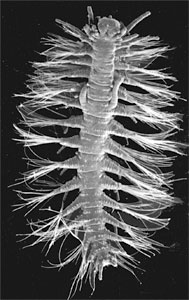
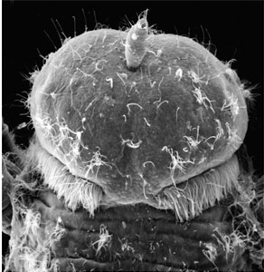

---
aliases:
  - capricornia
title: capricornia
---

## Phylogeny 

-   « Ancestral Groups  
    -  [Hesionidae](../Hesionidae.md))
    -  [Phyllodocida](../../Phyllodocida.md))
    -  [Annelida](../../../Annelida.md))
    -  [Bilateria](../../../../Bilateria.md))
    -  [Animals](../../../../../Animals.md))
    -  [Eukarya](../../../../../../Eukarya.md))
    -   [Tree of Life](../../../../../../Tree_of_Life.md)

-   ◊ Sibling Groups of  Hesionidae
    -   capricornia

-   » Sub-Groups 

# [[capricornia]] 

    

## Introduction

[Fredrik Pleijel and Greg W. Rouse]()

*capricornia* was described by Pleijel & Rouse (2000a). 
It is a tiny hesionid, reaching only about 2 mm in length. 
It is currently known from the Great Barrier Reef and New Caledonia, 
where it occurs in coral gravel and sand at a few meters depth.

### Characteristics

*capricornia* is identified by the synapomorphy paired penes situated on
segment 9. It appears to be closely related to a group including
*Amphiduros*, *Amphiduropsis*, *Gyptis* and *Parahesione*. Following an
analysis in the original description, it was sister to the first two of
these taxa, whereas in Pleijel (2001) it came out as sister to
*Parahesione*. In part, difficulties in assessing the more precise
position are likely related to its small size and the retention of many
juvenile hesionid features. Unusual for hesionids, which do not usually
have external genital organs (but see also Westheide et al., 1994), the
males of *capricornia* have a pair of large penes situated on segment 9
(see title illustration of *capricornia* male). The females have
spermathecae in the notopodia of segments 11 and 12.

### *capricornia* and the LITU Concept

The description of *capricornia* was carried out in association with
another paper, were we introduced the LITU concept (Least Inclusive
Taxonomic Unit, Pleijel and Rouse, 2000b). This paper, together with
those of Mishler (1999) and (Pleijel, 1999), contains a critique of the
application of species concepts in taxonomy, and suggests that it/they
should be abandoned. The critique refers both to theoretical problems
with various concepts, and to the practical appications. Pleijel and
Rouse commented on three of these: (1) lack of consensus on the meaning
of the term \"species\", (2) mixture, under many concepts, of
paraphyletic and monophyletic entities, and (3) impracticality, due to
lack of needed information.

Phylogenetic concepts based on the identification of monophyletic
species only, have been suggested, e.g., by Rosen (1979). Although we
partly agree with this, it still makes an absolute claim about a group:
this is a single species and it cannot be subdivided into further
species. Instead we suggested LITUs, which refer to the smallest
currently recognized clades. Since it is useful to be able to readily
identify LITUs and separate them from more inclusive clades, it was
suggested that they should be tagged in a way that could be easily
changed when they shift status, such as with an initial lower case
letter. This was applied in a case study that introduced the new
hesionid *capricornia*, and this is the reason why its name is spelled
without capital first letter. It is important to note that LITUs, in
contrast to species, do not represent absolute statements about the
internal relationships within the named group; they merely make
reference to the current resolution and knowledge.

## Title Illustrations 

------------------------------------------------------------------------)
Scientific Name ::     capricornia
Location ::           Great Barrier Reef
Comments             Note paired penes on segment 9
Specimen Condition   Dead Specimen
Sex ::                Male
View                 ventral
Copyright ::            © 2000 [Fredrik Pleijel](mailto:pleijel@mnhn.fr) 

------------------------------------------------------------------------

Scientific Name ::     capricornia
Location ::           Great Barrier Reef
Specimen Condition   Dead Specimen
Body Part            anterior end showing median antenna and nuchal organs
View                 dorsal
Copyright ::            © 2000 [Fredrik Pleijel](mailto:pleijel@mnhn.fr) 

## Confidential Links & Embeds: 

### #is_/same_as :: [capricornia](/_Standards/bio/bio~Domain/Eukarya/Animal/Bilateria/Annelida/Phyllodocida/Hesionidae/capricornia.md) 

### #is_/same_as :: [capricornia.public](/_public/bio/bio~Domain/Eukarya/Animal/Bilateria/Annelida/Phyllodocida/Hesionidae/capricornia.public.md) 

### #is_/same_as :: [capricornia.internal](/_internal/bio/bio~Domain/Eukarya/Animal/Bilateria/Annelida/Phyllodocida/Hesionidae/capricornia.internal.md) 

### #is_/same_as :: [capricornia.protect](/_protect/bio/bio~Domain/Eukarya/Animal/Bilateria/Annelida/Phyllodocida/Hesionidae/capricornia.protect.md) 

### #is_/same_as :: [capricornia.private](/_private/bio/bio~Domain/Eukarya/Animal/Bilateria/Annelida/Phyllodocida/Hesionidae/capricornia.private.md) 

### #is_/same_as :: [capricornia.personal](/_personal/bio/bio~Domain/Eukarya/Animal/Bilateria/Annelida/Phyllodocida/Hesionidae/capricornia.personal.md) 

### #is_/same_as :: [capricornia.secret](/_secret/bio/bio~Domain/Eukarya/Animal/Bilateria/Annelida/Phyllodocida/Hesionidae/capricornia.secret.md)

