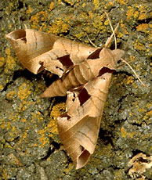
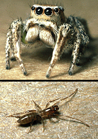
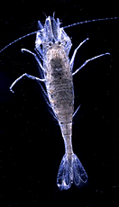

---
aliases:
- Arithropodi
- Arthropod
- Arthropoda
- Arthropoden
- Arthropodes
- arthropodo
- Artrapód
- Artropod
- Artropoda
- Artropode
- Artropodi
- Artropodo
- Artropodoj
- Artropodu
- Artropudi
- Artropòdes
- Artròpodes
- Artrópode
- Artrópodo
- Artrópodos
- Atwopòd
- Binatang
- Boʻgʻimoyoqlilar
- buğumayaqlılar
- buğumbacаqlılar
- Chat-kha tōng-bu̍t
- Chʼosh bijáád dahólónígíí
- Eklem bacaklılar
- Geleedpotigen
- Geleedpotiges
- Geleedpôtign
- Gelidpoetege
- Gliaderfiassler
- Gliderfießler
- Gliederfüßer
- Këmbënyjorët
- Laspuateten
- Leddjur
- Leddyr
- Liddfööt
- Liðadýr
- liðdýr
- lođâsjuálgásiih
- Lülijalgsed
- Mananap nga dinugtongan
- Melldrosek
- Miilixinximna
- Mymba ipy apytimby
- Narioutakuojē
- Nariuotakojai
- Niveljalkaiset
- Palačjaugaižed
- posmkāji
- Sillwichaki
- stawonogi
- Tiswermin
- Veʻehokohoko
- Zglavkari
- '[[:w:ta:கணுக்காலி'
- Ízeltlábúak
- Člankonošci
- Členonožci
- členovci
- Článkonožce
- động vật Chân khớp
- Động vật chân đốt
- Αρθρόποδα
- αρθρόποδο
- ёзмугороос
- Бандпоён
- Бирæкъахджынтæ
- Буынаяқтылар
- буынтыкаяклылар
- Быуынтығаяҡлылар
- Зглавкари
- Муунак буттуулар
- Пай уралли
- суставаногія
- членістаногія
- Членестоноги
- Членистоногі
- Членистоногие
- Членистоногы
- Членконоги
- Үет хөлтөн
- Үетэ хүлтэн
- Հոդվածոտանիներ
- ארטראפאד
- פרוקי רגליים
- פרוקי-רגליים
- آرتھوپوڈا
- آرٿروپاڊا
- ارتھروپوڈ
- بند پایان
- بندلینگون
- بندپایان
- بوغومآیاقلیلار
- جمگەپێیان
- مفصليات الأرجل
- مفصليات الارجل
- مفصليات الرجلين
- مفصلی پایہ
- अर्थोपोडा
- आर्थ्रोपोदा
- सन्धिपाद
- সন্ধিপদ
- সন্ধিপদী
- ਆਰਥਰੋਪੋਡ
- સંધિપાદ
- கணுக்காலி
- ఆర్థ్రోపోడా
- ಸಂಧಿಪದಿಗಳು
- ആർത്രോപോഡ
- สัตว์ขาปล้อง
- ခြေဆစ်များ သတ္တဝါ
- ფეხსახსრიანები
- ጋጥመ-ብዙ
- 節肢動物
- 節肢動物門
- 節足動物
- 節足動物門
- 节肢动物
- 节肢动物门
- 절지동물
- 절지동물문(節肢動物門)
has_id_wikidata: Q1360
Commons_category: Arthropoda
described_by_source:
- '[[../../../../../WikiData/WD~Brockhaus_and_Efron_Encyclopedic_Dictionary,602358|WD~Brockhaus_and_Efron_Encyclopedic_Dictionary,602358]]'
- '[[_Standards/WikiData/WD~Encyclopædia_Britannica_11th_edition,867541|WD~Encyclopædia_Britannica_11th_edition,867541]]'
- '[[_Standards/WikiData/WD~New_International_Encyclopedia,1029706|WD~New_International_Encyclopedia,1029706]]'
- '[[_Standards/WikiData/WD~Granat_Encyclopedic_Dictionary,4532138|WD~Granat_Encyclopedic_Dictionary,4532138]]'
- "[[_Standards/WikiData/WD~The_New_Student's_Reference_Work,16082057|WD~The_New_Student's_Reference_Work,16082057]]"
- "[[_Standards/WikiData/WD~Collier's_New_Encyclopedia,_1921,19047539|WD~Collier's_New_Encyclopedia,_1921,19047539]]"
- '[[_Standards/WikiData/WD~The_Encyclopedia_Americana,19085957|WD~The_Encyclopedia_Americana,19085957]]'
- '[[_Standards/WikiData/WD~Small_Brockhaus_and_Efron_Encyclopedic_Dictionary,19180675|WD~Small_Brockhaus_and_Efron_Encyclopedic_Dictionary,19180675]]'
- '[[_Standards/WikiData/WD~Meyers_Konversations-Lexikon,_4th_edition_(1885–1890),19219752|WD~Meyers_Konversations-Lexikon,_4th_edition_(1885–1890),19219752]]'
- '[[_Standards/WikiData/WD~Armenian_Soviet_Encyclopedia,_vol._6,124737633|WD~Armenian_Soviet_Encyclopedia,_vol._6,124737633]]'
Dewey_Decimal_Classification: 595
different_from:
- '[[_Standards/WikiData/WD~Arthropoda,21385261|WD~Arthropoda,21385261]]'
- '[[_Standards/WikiData/WD~Arthropoda,116480554|WD~Arthropoda,116480554]]'
EPPO_Code: 1ARTHP
Iconclass_notation: 25F71
image: http://commons.wikimedia.org/wiki/Special:FilePath/Abludomelita%20obtusata.jpg
instance_of: '[[_Standards/WikiData/WD~taxon,16521|WD~taxon,16521]]'
ITIS_TSN: 82696
Krugosvet_article: nauka_i_tehnika/biologiya/CHLENISTONOGIE.html
MeSH_tree_code: B01.050.500.131
montage_image: http://commons.wikimedia.org/wiki/Special:FilePath/Arthropoda%20collage.png
OmegaWiki_Defined_Meaning: 257
parent_taxon: '[[_Standards/WikiData/WD~Ecdysozoa,5176|WD~Ecdysozoa,5176]]'
permanent_duplicated_item: '[[_Standards/WikiData/WD~Arthropoda,115427055|WD~Arthropoda,115427055]]'
pronunciation_audio: http://commons.wikimedia.org/wiki/Special:FilePath/LL-Q8752%20%28eus%29-ElsaBornFree-Artropodo.wav
start_time: -540000000-01-01
studied_in:
- '[[_Standards/WikiData/WD~arthropodology,3520855|WD~arthropodology,3520855]]'
- '[[_Standards/WikiData/WD~palaeo-arthropodology,126937169|WD~palaeo-arthropodology,126937169]]'
subclass_of: '[[_Standards/WikiData/WD~invertebrate,43806|WD~invertebrate,43806]]'
taxon_common_name:
- Членистоногие
- مفصليات الأرجل
- Gliaderfiassler
- Членестоноги
- সন্ধিপদ
- Artròpodes
- členovci
- Leddyr
- Gliederfüßer
- Αρθρόποδα
- Arthropod
- Artrópodos
- Lülijalgsed
- Niveljalkaiset
- Arthropodes
- Laspuateten
- Artrapód
- Artrópodos
- Gliderfießler
- פרוקי רגליים
- Člankonošci
- Ízeltlábúak
- Հոդվածոտանիներ
- Artropodi
- 節足動物門
- 절지동물문(節肢動物門)
- Nariuotakojai
- Членконоги
- leddyr
- Geleedpotigen
- Artropòdes
- stawonogi
- Artrópode
- Artropode
- Artropodu
- Článkonožce
- Členonožci
- Зглавкари
- Leddjur
- '[[:w:ta:கணுக்காலி'
- Eklem bacaklılar
- Членистоногі
- Động vật chân đốt
- 節肢動物門
- 节肢动物门
taxon_name: Arthropoda
taxon_rank: '[[_Standards/WikiData/WD~phylum,38348|WD~phylum,38348]]'
title: Arthropoda
topic_s_main_template: '[[_Standards/WikiData/WD~Template_Arthropods,6687029|WD~Template_Arthropods,6687029]]'
topic_s_main_Wikimedia_portal: '[[_Standards/WikiData/WD~Portal_Arthropods,13365765|WD~Portal_Arthropods,13365765]]'
UMLS_CUI: C0003903
Unicode_character: "\U0001F41B"
union_of: '[[_Standards/WikiData/WD~list_of_values_as_qualifiers,23766486|WD~list_of_values_as_qualifiers,23766486]]'
dv_has_:
  name_:
    af: Geleedpotiges
    am: ጋጥመ-ብዙ
    an: Arthropoda
    ar: مفصليات الأرجل
    ary: مفصليات الرجلين
    arz: مفصليات الارجل
    as: সন্ধিপদী
    ast: Arthropoda
    az: buğumayaqlılar
    azb: بوغومآیاقلیلار
    ba: Быуынтығаяҡлылар
    bar: Arthropoda
    be: членістаногія
    be_tarask: суставаногія
    bg: членестоноги
    bn: সন্ধিপদী
    br: Arthropoda
    bs: Zglavkari
    bxr: Үетэ хүлтэн
    ca: artròpodes
    ceb: Mananap nga dinugtongan
    ckb: جمگەپێیان
    co: Arthropoda
    crh: buğumbacаqlılar
    cs: členovci
    cv: Пай уралли
    cy: Arthropod
    da: leddyr
    de: Gliederfüßer
    de-at: Arthropoda
    de_ch: Gliederfüßer
    el: αρθρόποδο
    en: arthropod
    en_ca: Arthropod
    en_gb: arthropod
    eo: Artropodoj
    es: artrópodos
    et: lülijalgsed
    eu: Artropodo
    ext: Arthropoda
    fa: بندپایان
    fi: niveljalkaiset
    fo: Liðadýr
    fr: arthropodes
    frp: Arthropoda
    frr: Laspuateten
    fur: Arthropoda
    ga: artrapód
    gd: Arthropoda
    gl: Artrópodo
    gn: Mymba ipy apytimby
    gsw: Gliederfüßer
    gu: સંધિપાદ
    ha: Arthropod
    he: פרוקי-רגליים
    hi: सन्धिपाद
    hif: Arthropod
    hr: člankonošci
    ht: Atwopòd
    hu: ízeltlábúak
    hy: հոդվածոտանիներ
    ia: arthropodo
    id: Artropoda
    ie: Arthropoda
    ig: Arthropod
    ilo: Arthropoda
    io: Artropodo
    is: liðdýr
    it: artropodi
    ja: 節足動物
    jv: Arthropoda
    ka: ფეხსახსრიანები
    kab: Tiswermin
    kg: Arthropoda
    kk: Буынаяқтылар
    kn: ಸಂಧಿಪದಿಗಳು
    ko: 절지동물
    ks: آرتھوپوڈا
    ku: Artropod
    kw: Melldrosek
    ky: Муунак буттуулар
    la: Arthropoda
    lad: Arthropoda
    lb: Arthropoden
    lfn: Artropodo
    li: Gelidpoetege
    lij: Arthropoda
    lmo: Arthropoda
    lt: Nariuotakojai
    lv: posmkāji
    mg: Arthropoda
    min: Arthropoda
    mk: Членконоги
    ml: ആർത്രോപോഡ
    mn: Үет хөлтөн
    mrj: Arthropoda
    ms: Artropod
    mt: Arthropoda
    mul: Arthropoda
    my: ခြေဆစ်များ သတ္တဝါ
    mzn: بندلینگون
    nan: Chat-kha tōng-bu̍t
    nap: Arthropoda
    nb: leddyr
    nds: Liddfööt
    nds_nl: Arthropoda
    ne: अर्थोपोडा
    new: आर्थ्रोपोदा
    nl: geleedpotigen
    nn: leddyr
    nov: Arthropoda
    nrm: Arthropoda
    nv: Chʼosh bijáád dahólónígíí
    nys: Arthropoda
    oc: Artropòdes
    om: Miilixinximna
    os: Бирæкъахджынтæ
    pa: ਆਰਥਰੋਪੋਡ
    pcd: Arthropoda
    pl: stawonogi
    pms: Arthropoda
    pnb: ارتھروپوڈ
    ps: بند پایان
    pt: artrópode
    pt_br: artrópode
    qu: Sillwichaki
    rm: Arthropoda
    ro: artropode
    ru: членистоногие
    rue: Членистоногы
    rup: Arthropoda
    sc: Arthropoda
    scn: Artropudi
    sco: Arthropod
    sd: آرٿروپاڊا
    sgs: Narioutakuojē
    sh: Zglavkari
    sk: Článkonožce
    sl: členonožci
    smn: lođâsjuálgásiih
    sq: Këmbënyjorët
    sr: зглавкари
    su: Arthropoda
    sv: leddjur
    sw: Arithropodi
    ta: கணுக்காலி
    te: ఆర్థ్రోపోడా
    tg: Бандпоён
    th: สัตว์ขาปล้อง
    tl: Arthropoda
    to: Veʻehokohoko
    tpi: Binatang
    tr: Eklem bacaklılar
    tt: буынтыкаяклылар
    tt_cyrl: буынтыкаяклылар
    udm: ёзмугороос
    uk: членистоногі
    ur: مفصلی پایہ
    uz: Boʻgʻimoyoqlilar
    vec: Arthropoda
    vep: Palačjaugaižed
    vi: động vật Chân khớp
    vls: Geleedpôtign
    vo: Arthropoda
    wa: Arthropoda
    war: Arthropoda
    wo: Arthropoda
    wuu: 节肢动物
    yi: ארטראפאד
    yue: 節肢動物
    zh: 节肢动物门
    zh_cn: 节肢动物门
    zh_hans: 节肢动物门
    zh_hant: 節肢動物
    zh_tw: 節肢動物
    zu: Arthropoda
---

# [[Arthropoda]] 🐛 

     

#is_/same_as :: [[../../../../../WikiData/WD~Arthropoda,1360|WD~Arthropoda,1360]]   

## #has_/text_of_/abstract 

> **Arthropod**s ( ARTH-rə-pod) are invertebrates in the phylum Arthropoda. They 
> possess an exoskeleton with a cuticle made of chitin, often mineralised with calcium carbonate, 
> a body with differentiated (metameric) segments, and paired jointed appendages. 
> 
> In order to keep growing, they must go through stages of moulting, 
> a process by which they shed their exoskeleton to reveal a new one. 
> They form an extremely diverse group of up to ten million species.
>
> Haemolymph is the analogue of blood for most arthropods.  
> An arthropod has an open circulatory system, 
> with a body cavity called a haemocoel through which haemolymph circulates to the interior organs. 
> 
> Like their exteriors, the internal organs of arthropods are generally built of repeated segments. 
> They have ladder-like nervous systems, with paired ventral nerve cords running through all segments and forming paired ganglia in each segment. Their heads are formed by fusion of varying numbers of segments, and their brains are formed by fusion of the ganglia of these segments and encircle the esophagus. The respiratory and excretory systems of arthropods vary, depending as much on their environment as on the subphylum to which they belong.
>
> Arthropods use combinations of compound eyes and pigment-pit ocelli for vision. In most species, the ocelli can only detect the direction from which light is coming, and the compound eyes are the main source of information, but the main eyes of spiders are ocelli that can form images and, in a few cases, can swivel to track prey. Arthropods also have a wide range of chemical and mechanical sensors, mostly based on modifications of the many bristles known as setae that project through their cuticles. Similarly, their reproduction and development are varied; all terrestrial species use internal fertilization, but this is sometimes by indirect transfer of the sperm via an appendage or the ground, rather than by direct injection. Aquatic species use either internal or external fertilization. Almost all arthropods lay eggs, with many species giving birth to live young after the eggs have hatched inside the mother; but a few are genuinely viviparous, such as aphids. Arthropod hatchlings vary from miniature adults to grubs and caterpillars that lack jointed limbs and eventually undergo a total metamorphosis to produce the adult form. The level of maternal care for hatchlings varies from nonexistent to the prolonged care provided by social insects.
>
> The evolutionary ancestry of arthropods dates back to the Cambrian period. The group is generally regarded as monophyletic, and many analyses support the placement of arthropods with cycloneuralians (or their constituent clades) in a superphylum Ecdysozoa. Overall, however, the basal relationships of animals are not yet well resolved. Likewise, the relationships between various arthropod groups are still actively debated. Today, arthropods contribute to the human food supply both directly as food, and more importantly, indirectly as pollinators of crops. Some species are known to spread severe disease to humans, livestock, and crops.
>
> [Wikipedia](https://en.wikipedia.org/wiki/Arthropod) 

## Phylogeny 

-   « Ancestral Groups  
    -  [Bilateria](../Bilateria.md) 
    -  [Animals](../../Animals.md) 
    -  [Eukarya](../../../Eukarya.md) 
    -   [Tree of Life](../../../Tree_of_Life.md)

-   ◊ Sibling Groups of  Bilateria
    -   [Deuterostomia](Deutero.md)
    -   Arthropoda
    -  [Onychophora](Onychophora.md) 
    -   [Tardigrada](Tardigrada)
    -  [Nematoda](Nematoda.md) 
    -  [Nematomorpha](Nematomorpha.md) 
    -  [Kinorhyncha](Kinorhyncha.md) 
    -  [Loricifera](Loricifera.md) 
    -  [Priapulida](Priapulida.md) 
    -   [Arrow_Worm](Arrow_Worm.md)
    -  [Gastrotricha](Gastrotricha.md) 
    -  [Rotifera](Rotifera.md) 
    -  [Gnathostomulida](Gnathostomulida.md) 
    -   [Limnognathia maerski](Limnognathia_maerski)
    -  [Cycliophora](Cycliophora.md) 
    -  [Mesozoa](Mesozoa.md) 
    -  [Platyhelminthes](Platyhelminthes.md) 
    -  [Annelida](Annelida.md) 
    -  [Bryozoa](Bryozoa.md) 
    -  [Sipuncula](Sipuncula.md) 
    -  [Mollusca](Mollusca.md) 
    -  [Nemertea](Nemertea.md) 
    -  [Entoprocta](Entoprocta.md) 
    -  [Phoronida](Phoronida.md) 
    -  [Brachiopoda](Brachiopoda.md) 

-   » Sub-Groups

    -  [Hexapoda](Arthropoda/Hexapoda.md) 
    -  [Crustacea](Arthropoda/Crustacea.md) 
    -  [Pauropoda](Arthropoda/Myriapoda/Pauropoda.md) 
    -  [Diplopoda](Arthropoda/Myriapoda/Diplopoda.md) 
    -  [Centipede](Arthropoda/Myriapoda/Centipede.md) 
    -  [Symphyla](Arthropoda/Myriapoda/Symphyla.md) 
    -  [Arachnida](Arthropoda/Chelicerata/Arachnida.md) 
    -   [Eur[Sea_Scorpion](Arthropoda/Chelicerata/Sea_Scorpion.md) -   [Horseshoe_Crab](Arthropoda/Chelicerata/Horseshoe_Crab.md)
    -   [Sea_Spider](Arthropoda/Chelicerata/Sea_Spider.md)
    -  [Trilobites](Arthropoda/Trilobites.md) 

## Title Illustrations

------------------------------------------------------------------------------ 
 
scientific_name ::     Eumorpha achemon
Creator              Photograph by George W. Robinson
specimen_condition ::  Live Specimen
Source Collection    [CalPhotos](http://calphotos.berkeley.edu/)
copyright ::            © 1999 [California Academy of Sciences](http://www.calacademy.org/) 

--------------------------------------------------------------------------- 
 
scientific_name ::  Habronattus, schizomid
copyright ::         © 1995 [Wayne Maddison](http://salticidae.org/wpm/home.html) 

-------------------------------------------------------------------------------- 
 
scientific_name ::   Crangon septemspinosa
Acknowledgements   from the Gray Museum Slide Collection
copyright ::          © 1995 [Marine Biological Laboratory, Woods Hole](http://www.mbl.edu/) 

## Confidential Links & Embeds: 

### #is_/same_as :: [[/_Standards/bio/bio~Domain/Eukarya/Animal/Bilateria/Arthropoda|Arthropoda]] 

### #is_/same_as :: [[/_public/bio/bio~Domain/Eukarya/Animal/Bilateria/Arthropoda.public|Arthropoda.public]] 

### #is_/same_as :: [[/_internal/bio/bio~Domain/Eukarya/Animal/Bilateria/Arthropoda.internal|Arthropoda.internal]] 

### #is_/same_as :: [[/_protect/bio/bio~Domain/Eukarya/Animal/Bilateria/Arthropoda.protect|Arthropoda.protect]] 

### #is_/same_as :: [[/_private/bio/bio~Domain/Eukarya/Animal/Bilateria/Arthropoda.private|Arthropoda.private]] 

### #is_/same_as :: [[/_personal/bio/bio~Domain/Eukarya/Animal/Bilateria/Arthropoda.personal|Arthropoda.personal]] 

### #is_/same_as :: [[/_secret/bio/bio~Domain/Eukarya/Animal/Bilateria/Arthropoda.secret|Arthropoda.secret]] 

