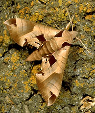
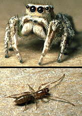

# [[Arthropoda]] 

     

#is_/same_as :: [[../../WikiData/WD~Arthropoda,1360|WD~Arthropoda,1360]] 

## #has_/text_of_/abstract 

> **Arthropod**s ( ARTH-rə-pod) are invertebrates in the phylum Arthropoda. They 
> possess an exoskeleton with a cuticle made of chitin, often mineralised with calcium carbonate, 
> a body with differentiated (metameric) segments, and paired jointed appendages. 
> 
> In order to keep growing, they must go through stages of moulting, 
> a process by which they shed their exoskeleton to reveal a new one. 
> They form an extremely diverse group of up to ten million species.
>
> Haemolymph is the analogue of blood for most arthropods.  
> An arthropod has an open circulatory system, 
> with a body cavity called a haemocoel through which haemolymph circulates to the interior organs. 
> 
> Like their exteriors, the internal organs of arthropods are generally built of repeated segments. 
> They have ladder-like nervous systems, with paired ventral nerve cords running through all segments and forming paired ganglia in each segment. Their heads are formed by fusion of varying numbers of segments, and their brains are formed by fusion of the ganglia of these segments and encircle the esophagus. The respiratory and excretory systems of arthropods vary, depending as much on their environment as on the subphylum to which they belong.
>
> Arthropods use combinations of compound eyes and pigment-pit ocelli for vision. In most species, the ocelli can only detect the direction from which light is coming, and the compound eyes are the main source of information, but the main eyes of spiders are ocelli that can form images and, in a few cases, can swivel to track prey. Arthropods also have a wide range of chemical and mechanical sensors, mostly based on modifications of the many bristles known as setae that project through their cuticles. Similarly, their reproduction and development are varied; all terrestrial species use internal fertilization, but this is sometimes by indirect transfer of the sperm via an appendage or the ground, rather than by direct injection. Aquatic species use either internal or external fertilization. Almost all arthropods lay eggs, with many species giving birth to live young after the eggs have hatched inside the mother; but a few are genuinely viviparous, such as aphids. Arthropod hatchlings vary from miniature adults to grubs and caterpillars that lack jointed limbs and eventually undergo a total metamorphosis to produce the adult form. The level of maternal care for hatchlings varies from nonexistent to the prolonged care provided by social insects.
>
> The evolutionary ancestry of arthropods dates back to the Cambrian period. The group is generally regarded as monophyletic, and many analyses support the placement of arthropods with cycloneuralians (or their constituent clades) in a superphylum Ecdysozoa. Overall, however, the basal relationships of animals are not yet well resolved. Likewise, the relationships between various arthropod groups are still actively debated. Today, arthropods contribute to the human food supply both directly as food, and more importantly, indirectly as pollinators of crops. Some species are known to spread severe disease to humans, livestock, and crops.
>
> [Wikipedia](https://en.wikipedia.org/wiki/Arthropod)

## Phylogeny 

-   « Ancestral Groups  
    -  [Bilateria](../Bilateria.md))
    -  [Animals](../../Animals.md))
    -  [Eukarya](../../../Eukarya.md))
    -   [Tree of Life](../../../Tree_of_Life.md)

-   ◊ Sibling Groups of  Bilateria
    -   [Deuterostomia](Deutero.md)
    -   Arthropoda
    -  [Onychophora](Onychophora.md))
    -   [Tardigrada](Tardigrada)
    -  [Nematoda](Nematoda.md))
    -  [Nematomorpha](Nematomorpha.md))
    -  [Kinorhyncha](Kinorhyncha.md))
    -  [Loricifera](Loricifera.md))
    -  [Priapulida](Priapulida.md))
    -   [Arrow_Worm](Arrow_Worm.md)
    -  [Gastrotricha](Gastrotricha.md))
    -  [Rotifera](Rotifera.md))
    -  [Gnathostomulida](Gnathostomulida.md))
    -   [Limnognathia maerski](Limnognathia_maerski)
    -  [Cycliophora](Cycliophora.md))
    -  [Mesozoa](Mesozoa.md))
    -  [Platyhelminthes](Platyhelminthes.md))
    -  [Annelida](Annelida.md))
    -  [Bryozoa](Bryozoa.md))
    -  [Sipuncula](Sipuncula.md))
    -  [Mollusca](Mollusca.md))
    -  [Nemertea](Nemertea.md))
    -  [Entoprocta](Entoprocta.md))
    -  [Phoronida](Phoronida.md))
    -  [Brachiopoda](Brachiopoda.md))

-   » Sub-Groups

    -  [Hexapoda](Arthropoda/Hexapoda.md))
    -  [Crustacea](Arthropoda/Crustacea.md))
    -  [Pauropoda](Arthropoda/Myriapoda/Pauropoda.md))
    -  [Diplopoda](Arthropoda/Myriapoda/Diplopoda.md))
    -  [Chilopoda](Arthropoda/Myriapoda/Chilopoda.md))
    -  [Symphyla](Arthropoda/Myriapoda/Symphyla.md))
    -  [Arachnida](Arthropoda/Chelicerata/Arachnida.md))
    -   [Eur[Sea_Scorpion](Arthropoda/Chelicerata/Sea_Scorpion.md) -   [Horseshoe_Crab](Arthropoda/Chelicerata/Horseshoe_Crab.md)
    -   [Sea_Spider](Arthropoda/Chelicerata/Sea_Spider.md)
    -  [Trilobites](Arthropoda/Trilobites.md))

## Title Illustrations

------------------------------------------------------------------------------)
Scientific Name ::     Eumorpha achemon
Creator              Photograph by George W. Robinson
Specimen Condition   Live Specimen
Source Collection    [CalPhotos](http://calphotos.berkeley.edu/)
Copyright ::            © 1999 [California Academy of Sciences](http://www.calacademy.org/) 

---------------------------------------------------------------------------)
Scientific Name ::  Habronattus, schizomid
Copyright ::         © 1995 [Wayne Maddison](http://salticidae.org/wpm/home.html) 

--------------------------------------------------------------------------------)
Scientific Name ::   Crangon septemspinosa
Acknowledgements   from the Gray Museum Slide Collection
Copyright ::          © 1995 [Marine Biological Laboratory, Woods Hole](http://www.mbl.edu/) 

## Confidential Links & Embeds: 

### #is_/same_as ::[Arthropoda](Arthropoda.md)) 

### #is_/same_as :: [Arthropoda.public](/_public/bio/bio~Domain/Eukarya/Animal/Bilateria/Arthropoda.public.md) 

### #is_/same_as :: [Arthropoda.internal](/_internal/bio/bio~Domain/Eukarya/Animal/Bilateria/Arthropoda.internal.md) 

### #is_/same_as :: [Arthropoda.protect](/_protect/bio/bio~Domain/Eukarya/Animal/Bilateria/Arthropoda.protect.md) 

### #is_/same_as :: [Arthropoda.private](/_private/bio/bio~Domain/Eukarya/Animal/Bilateria/Arthropoda.private.md) 

### #is_/same_as :: [Arthropoda.personal](/_personal/bio/bio~Domain/Eukarya/Animal/Bilateria/Arthropoda.personal.md) 

### #is_/same_as :: [Arthropoda.secret](/_secret/bio/bio~Domain/Eukarya/Animal/Bilateria/Arthropoda.secret.md)

