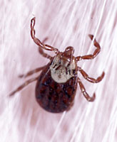
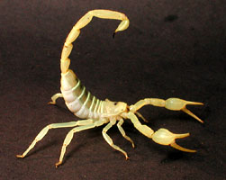
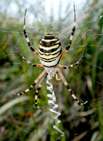

---
aliases:
  - Arachnid
  - Arachnida
Commons_category: Arachnida
Commons_gallery: Arachnida
described_by_source:
  - "[[_Standards/WikiData/WD~Brockhaus_and_Efron_Encyclopedic_Dictionary,602358]]"
  - "[[_Standards/WikiData/WD~Encyclopædia_Britannica_11th_edition,867541]]"
  - "[[_Standards/WikiData/WD~Armenian_Soviet_Encyclopedia,2657718]]"
  - "[[_Standards/WikiData/WD~Encyclopedic_Lexicon,4532135]]"
  - "[[_Standards/WikiData/WD~The_New_Student's_Reference_Work,16082057]]"
  - "[[_Standards/WikiData/WD~Small_Brockhaus_and_Efron_Encyclopedic_Dictionary,19180675]]"
  - "[[_Standards/WikiData/WD~Meyers_Konversations_Lexikon,_4th_edition_(1885_1890),19219752]]"
EPPO_Code: 1ARACC
has_id_wikidata: Q1358
has_use:
  - "[[_Standards/WikiData/WD~biological_pest_control,116890]]"
image:
  - http://commons.wikimedia.org/wiki/Special:FilePath/Arachnida%20collage.png
  - http://commons.wikimedia.org/wiki/Special:FilePath/Haeckel%20Arachnida.jpg
instance_of: "[[_Standards/WikiData/WD~taxon,16521]]"
ITIS_TSN: 82708
Krugosvet_article: nauka_i_tehnika/biologiya/PAUKOOBRAZNIE.html
MeSH_tree_code:
  - B01.050.500.131.166
mode_of_reproduction: "[[_Standards/WikiData/WD~sexual_reproduction,182353]]"
named_after: "[[_Standards/WikiData/WD~Arachne,190082]]"
OmegaWiki_Defined_Meaning: 1261046
parent_taxon: "[[_Standards/WikiData/WD~Sclerophorata,82244029]]"
permanent_duplicated_item: "[[_Standards/WikiData/WD~Q110738843,110738843]]"
start_time: -380000000-01-01
studied_by:
  - "[[_Standards/WikiData/WD~arachnology,190979]]"
  - "[[_Standards/WikiData/WD~palaeo_arachnology,131863708]]"
subreddit:
  - arachnids
taxon_common_name:
  - Αραχνίδια
  - Hämähäkkieläimet
  - Arachnide
  - Koonkern
  - Paučnjaci
  - Pókszabásúak
  - Սարդակերպներ
  - Aracnidi
  - クモ綱
  - 거미강
  - Edderkoppdyr
  - Spinachtigen
  - pajęczaki
  - Aracnídeos
  - Arahnide
  - Паукообразные
  - कीड
  - pajkovci
  - Spindeldjur
  - Örümceğimsiler
  - 蛛形纲
  - arachnid
  - Spinnentiere
  - Arácnidos
  - Паякообразни
  - pavoukovci
taxon_name: Arachnida
taxon_rank: "[[_Standards/WikiData/WD~class,37517]]"
title: Arachnida
topic_s_main_template: "[[_Standards/WikiData/WD~Template_Arachnida,15069760]]"
UMLS_CUI: C0003704
---

# [[Arachnida]]

Spiders, mites, scorpions, whipscorpions, pseudoscorpions 
)     

#is_/same_as :: [[../../../../../../../WikiData/WD~Arachnida,1358|WD~Arachnida,1358]]

## #has_/text_of_/abstract 

> Arachnids are arthropods in the class **Arachnida** () of the subphylum Chelicerata. Arachnida includes, among others, spiders, scorpions, ticks, mites, pseudoscorpions, harvestmen, camel spiders, whip spiders and vinegaroons.
>
> Adult arachnids have eight legs attached to the  cephalothorax. In some species the frontmost pair of legs has converted to a sensory function, while in others, different appendages can grow large enough to take on the appearance of extra pairs of legs.
>
> Almost all extant arachnids are terrestrial, living mainly on land. However, some inhabit freshwater environments and, with the exception of the pelagic zone, marine environments as well. They comprise over 110,000 named species, of which 51,000 are species of spiders.
>
> The term is derived from the Greek word ἀράχνη (aráchnē, 'spider'), from the myth of the hubristic human weaver Arachne, who was turned into a spider.
>
> [Wikipedia](https://en.wikipedia.org/wiki/Arachnid) 

## Phylogeny 

-   « Ancestral Groups  
    -  [Arthropoda](../../Arthropoda.md)) 
    -  [Bilateria](../../../Bilateria.md)) 
    -  [Animals](../../../../Animals.md)) 
    -  [Eukarya](../../../../../Eukarya.md)) 
    -   [Tree of Life](../../../../../Tree_of_Life.md) 

-   ◊ Sibling Groups of  Arthropoda
    -  [Hexapoda](../Hexapoda.md))
    -  [Crustacea](../Crustacea.md))
    -  [Pauropoda](../Myriapoda/Pauropoda.md))
    -  [Diplopoda](../Myriapoda/Diplopoda.md))
    -  [Centipede](../Myriapoda/Centipede.md))
    -  [Symphyla](../Myriapoda/Symphyla.md))
    -   Arachnida
    -   [Sea_Scorpion](Sea_Scorpion.md)
    -   [Horseshoe_Crab](Horseshoe_Crab.md)
    -   [Sea_Spider](Sea_Spider.md)
    -  [Trilobites](../Trilobites.md))

-   » Sub-Groups

    -  [Solifugae](Arachnida/Solifugae.md))
    -   [Spider](Arachnida/Spider.md)
    -   [Mite](Arachnida/Mite.md)
    -  [Scorpionida](Arachnida/Scorpionida.md))

## Title Illustrations
)

-   Pacific coast tick, Dermacentor occidentalis (Acari). Olympia,
Thurston County (Washington, US).\
Photograph courtesy
[CalPhotos](http://elib.cs.berkeley.edu/photos/), copyright © 2002
[William Leonard](mailto:mollusca1@attbi.com).

)
-   California gold scorpion, Smeringurus mesaensis (Scorpionida). Palm
Desert (California, US).
Photograph courtesy [CalPhotos](http://elib.cs.berkeley.edu/photos/), 
copyright © 2002 [Arie van der Meijden](mailto:Mail@arievandermeijden.nl).

)
-   Spider, Argiope bruennichi (Araneae). Coastal grassland, Viareggio
(Italy) 
Photograph courtesy [CalPhotos](http://elib.cs.berkeley.edu/photos/), 
copyright © 2002 [Arie van der Meijden](mailto:Mail@arievandermeijden.nl).

## Confidential Links & Embeds: 

### #is_/same_as :: [Arachnida](/_Standards/bio/bio~Domain/Eukarya/Animal/Bilateria/Arthropoda/Chelicerata/Arachnida.md) 

### #is_/same_as :: [Arachnida.public](/_public/bio/bio~Domain/Eukarya/Animal/Bilateria/Arthropoda/Chelicerata/Arachnida.public.md) 

### #is_/same_as :: [Arachnida.internal](/_internal/bio/bio~Domain/Eukarya/Animal/Bilateria/Arthropoda/Chelicerata/Arachnida.internal.md) 

### #is_/same_as :: [Arachnida.protect](/_protect/bio/bio~Domain/Eukarya/Animal/Bilateria/Arthropoda/Chelicerata/Arachnida.protect.md) 

### #is_/same_as :: [Arachnida.private](/_private/bio/bio~Domain/Eukarya/Animal/Bilateria/Arthropoda/Chelicerata/Arachnida.private.md) 

### #is_/same_as :: [Arachnida.personal](/_personal/bio/bio~Domain/Eukarya/Animal/Bilateria/Arthropoda/Chelicerata/Arachnida.personal.md) 

### #is_/same_as :: [Arachnida.secret](/_secret/bio/bio~Domain/Eukarya/Animal/Bilateria/Arthropoda/Chelicerata/Arachnida.secret.md)

