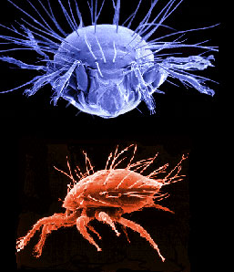
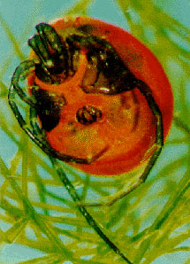

---
aliases:
- Milbe
- Mite
- Acari
Commons_category: Acari
described_by_source:
- '[[_Standards/WikiData/WD~Brockhaus_and_Efron_Encyclopedic_Dictionary,602358]]'
- '[[_Standards/WikiData/WD~Small_Brockhaus_and_Efron_Encyclopedic_Dictionary,19180675]]'
- '[[_Standards/WikiData/WD~Great_Soviet_Encyclopedia_(1926_1947),20078554]]'
has_id_wikidata: Q19137
image: "http://commons.wikimedia.org/wiki/Special:FilePath/Peacock%20mite%2C%20Tuckerella%20sp.jpg"
instance_of: '[[_Standards/WikiData/WD~taxon,16521]]'
ITIS_TSN: 733321
Krugosvet_article: biologiya/kleshchi
MeSH_tree_code: B01.050.500.131.166.132
OmegaWiki_Defined_Meaning: 2386
P8189: 987007553463905171
start_time: "-400000000-01-01T00:00:00Z"
taxon_common_name:
- клещи
- midd
- Milben
- Mijten
- acariens
- pršice
taxon_name: Acari
taxon_rank: '[[_Standards/WikiData/WD~subclass,5867051]]'
title: Acari
topic_s_main_template: '[[_Standards/WikiData/WD~Template_Taxonomy_Acari,38018029]]'
UMLS_CUI: C0000890
---

# [[Mite]] 

#is_/same_as :: [[../../../../../../../../WikiData/WD~Acari,19137]] 

## Phylogeny 

-   « Ancestral Groups  
    -  [Arachnida](../Arachnida.md))
    -  [Arthropoda](../../../Arthropoda.md))
    -  [Bilateria](../../../../Bilateria.md))
    -  [Animals](../../../../../Animals.md))
    -  [Eukarya](../../../../../../Eukarya.md))
    -   [Tree of Life](../../../../../../Tree_of_Life.md)

-   ◊ Sibling Groups of  Arachnida
    -  [Solifugae](Solifugae.md))
    -   [Spider](Spider.md)
    -   Acari
    -  [Scorpionida](Scorpionida.md))

-   » Sub-Groups
    -   [Acariformes](Mite/Acariformes.md)
    -   [Parasitiformes](Mite/Parasitiformes.md)

# [[Mite]]

Mites 

   

## #has_/text_of_/abstract 

> Mites are small arachnids (eight-legged arthropods) of two large orders, 
> the **Acari**formes and the Parasitiformes, 
> which were historically grouped together in the subclass Acari. 
> 
> However, most recent genetic analyses do not recover the two 
> as each other's closest relative within Arachnida, rendering the group invalid as a clade. 
> Most mites are tiny, less than 1 mm (0.04 in) in length, and have a simple, unsegmented body plan. 
> 
> The small size of most species makes them easily overlooked; some species live in water, 
> many live in soil as decomposers, others live on plants, sometimes creating galls, 
> while others are predators or parasites. 
> 
> This last type includes the commercially destructive Varroa parasite of honey bees, 
> as well as scabies mites of humans. 
> 
> Most species are harmless to humans, 
> but a few are associated with allergies or may transmit diseases.
>
> The scientific discipline devoted to the study of mites is called acarology.
>
> [Wikipedia](https://en.wikipedia.org/wiki/Mite) 

## Introduction

[David Evans Walter, Gerald Krantz, and Evert Lindquist]()

Mites (Acari or Acarina) are the most diverse and abundant of all arachnids, 
but because of their small size (usually less than a millimeter in length) we rarely see them. 

The **ticks** are an exception, in that they are usually big enough to see, 
especially when they are filled with blood. 

Red velvet mites are also among the giants of the Acari (to 10 mm), 
and can often be seen hunting on the ground or on tree trunks. 

Water mites are rarely more than a few millimeters long,
but their bright colours and rapid movement often bring them to our attention. 
At the smaller end of the mite size range are species like
the human follicle mite or the honeybee tracheal mite - small enough to
raise a family within a human hair follicle or within a bee\'s
respiratory tube, and too small (ca. 0.1 mm) to see without a
microscope.

Mites are also among the oldest of all terrestrial animals, with fossils
known from the early Devonian, nearly 400 million years ago (Norton et
al. 1988, Kethley et al. 1989). Three major lineages are currently
recognised: **Opilioacariformes, Acariformes** and **Parasitiformes**
(Krantz 1978, Johnston 1982, Evans 1992). About 45,000 species of mites
have been described - a small fraction (perhaps 5%) of the number of
species estimated to be alive today.

Mites are truly ubiquitous. They have successfully colonized nearly
every known terrestrial, marine, and fresh water habitat including polar
and alpine extremes, tropical lowlands and desert barrens, surface and
mineral soils to depths of 10 meters, cold and thermal surface springs
and subterranean waters with temperatures as high as 50C, all types of
streams, ponds and lakes, and sea waters of continental shelves and deep
sea trenches to depths of 5000 meters. Some idea of mite abundance and
diversity can be gained from analysis of one square meter of mixed
temperate hardwood or boreal coniferous litter, which may harbour
upwards from one million mites representing 200 species in at least 50
families. Within this complex matrix of decomposing plant matter, mites
help to regulate microbial processes directly by feeding on detritus and
microbes, and indirectly by predation on other microfauna.

Many mites have complex symbiotic associations with the larger organisms
on which they live. Plants, including crops and the canopies of tropical
rainforests, are inhabited by myriads of mite species feeding on mosses,
ferns, leaves, stems, flowers, fruit, lichens, microbes, other
arthropods and each other. Many mites found on agricultural crops are
major economic pests (e.g. spider mites) or useful biocontrol agents
(e.g. phytoseiid mites) of those pests. Mammals and birds are hosts to
innumerable species of parasitic mites (e.g. scabies and mange mites),
as are many reptiles and some amphibians. Insects, especially those that
build nests, live in semipermanent habitats like decaying wood, or use
more ephemeral habitats like bracket fungi and dung, are hosts to a
cornucopia of mite commensals, parasites and mutualists. None of these
mites exceed a centimeter in length, and the vast majority grow to less
than a millimeter, yet they often have a major impact on their hosts.

### Characteristics

The Acari can be defined by the following characteristics:

-   Hexapod prelarva (lost in Parasitiformes and many derived
    Acariformes)
-   Hexapod larval stage
-   Three octopod nymphal stages (variously abbreviated in derived taxa)
-   Gnathosoma delimited by a circumcapitular suture
-   Palpcoxal endites fused medially forming a hypostome
-   Hypostome with rutella or corniculi (lost in many derived
    Acariformes)
-   Loss of external evidence of opisthosomal segmentation, i.e. without
    tergites or sternites
-   Ingestion of particulate food (lost in many derived taxa)

### Discussion of Phylogenetic Relationships

Traditionally, the mites have been treated as a subclass of the
Arachnida, and three major lineages have been recognised, though the
names used to refer to these groups have varied considerably (Krantz
1978; Johnston 1982; Evans 1992). Here we generally follow the names
used in Parker (1982), and consider that three superorders (sensu Evans
1992) of Acari exist. The **Opilioacariformes** consists of a single
order and family (Opilioacarida, Opilioacaridae) with about 20 known
species. The **Acariformes** contains over 300 families and over 30, 000
described species. Two major lineages are recognised, the Sarcoptiformes
(Oribatida and Astigmata) and Trombidiformes (Prostigmata).
Additionally, eight families of very early derivative acariform mites
are lumped into the Endeostigmata, usually considered a suborder of the
Prostigmata, but clearly containing taxa that belong to both major
acariform lineages. The **Parasitiformes** consists of three orders:
Ixodida, Holothyrida, and Mesostigmata. The Mesostigmata contains in
excess of 65 families and 10,000 described species, the other two
parasitiform orders each comprise three families. About 850 species of
ticks are known, but only about 30 species of holothyrans have been
recognised.

What then is a mite? Aside from being generally tiny chelicerate
arthropods with hexapod larvae, a discrete gnathosoma, and a loss of
primary segmentation, mites are difficult to characterise. Lindquist
(1984) pointed out that many of the characters used to define mites were
present in other chelicerate orders, especially in the Ricinulei. He
proposed 11 apomorphic characteristics for the Acari (Table 8, p. 40),
but several of these character states are not present in the
Parasitiformes and presumably have been secondarily lost. It seems that
mites often are most easily recognised by what they are not - other
arachnids, rather than by a discrete set of acarine characters.

Among acarologists, arguments about monophyly or diphyly of the Acari
have yet to be resolved, although currently the monophyleticists seem to
be dominant (see Lindquist 1984, Evans 1992). The Parasitiformes and
Opilioacariformes are thought to be sister groups, and in turn this
taxon (the Anactinotrichida, so named because of the absence in their
setae of optically active actinochitin) is considered the sister group
of the Acariformes (also called the Actinotrichida). Outside of the
acarological community, those interested in chelicerate phylogeny have
tended to assume that the Acari were a monophyletic assemblage (e.g.
Weygoldt & Paulus 1979, Shulz 1990, Weygoldt 1997).

Recently, many acarologists have concluded that mites are closely
related to the arachnid order Ricinulei (Lindquist 1984, van der Hammen
1989, Evans 1992). Weygoldt & Paulus (1979) first proposed a sister
group relationship between the Ricinulei and the Acari, and named this
taxon the **Acarinomorpha**. Schulz (1990) also supported this
relationship, but like Weygoldt and Paulus, assumed that the Acari are
monophyletic. Van der Hammen (1989) considered the Acari to be
diphyletic, and the Acariformes and Parasitiformes at most distantly
related. According to van der Hammen, the Ricinulei and Anactinotrichida
(Parasitiformes + Opilioacariformes) are sister groups and, within
another lineage, the Actinotrichida (Acariformes) and the non-acarine
Palpigradi also are sister groups. Lindquist (1984) presented four
derived characters linking the Acari and Ricinulei (his Table 9, p. 41)
and concluded that, within the Acari proper, the Opilioacariformes and
Parasitiformes form a sister group to the Acariformes.

In our trunk page for the Acari, we follow the hypothesis of Lindquist
(1984), which suggests that a monophyletic lineage includes the
Ricinulei and the Acari. This hypothesis is based on the characters
presented by Lindquist, and is in agreement with that of Weygoldt &
Paulus (1979) and Schulz (1990), but not with that recently proposed by
Dunlop (1996).

## Title Illustrations

---------------------------------------------------------------

Scientific Name ::                    Neotrichozetes (top), Dendrolaelaspis (bottom)
Location ::                          Neotrichozetes from South America, Dendrolaelaspis from Australia
Comments                            Top: Scanning electron micrograph of microbe grazing oribatid mite.\
								  Bottom: SEM of a predatory mesostigmatic mite
Acknowledgements                    upper image © 1996 Jason Hurdis
Copyright ::                           © 1996 [David Evans Walter](http://www.uq.oz.au/entomology/david.evans.walter.html)

---------------

Scientific Name ::  Limnesia
Location ::        Canada
Comments          Photograph of a predatory water mite
Copyright ::         © 1996 C. Podemski

## Confidential Links & Embeds: 

### #is_/same_as :: [Mite](/_Standards/bio/bio~Domain/Eukarya/Animal/Bilateria/Arthropoda/Chelicerata/Arachnida/Mite.md) 

### #is_/same_as :: [Mite.public](/_public/bio/bio~Domain/Eukarya/Animal/Bilateria/Arthropoda/Chelicerata/Arachnida/Mite.public.md) 

### #is_/same_as :: [Mite.internal](/_internal/bio/bio~Domain/Eukarya/Animal/Bilateria/Arthropoda/Chelicerata/Arachnida/Mite.internal.md) 

### #is_/same_as :: [Mite.protect](/_protect/bio/bio~Domain/Eukarya/Animal/Bilateria/Arthropoda/Chelicerata/Arachnida/Mite.protect.md) 

### #is_/same_as :: [Mite.private](/_private/bio/bio~Domain/Eukarya/Animal/Bilateria/Arthropoda/Chelicerata/Arachnida/Mite.private.md) 

### #is_/same_as :: [Mite.personal](/_personal/bio/bio~Domain/Eukarya/Animal/Bilateria/Arthropoda/Chelicerata/Arachnida/Mite.personal.md) 

### #is_/same_as :: [Mite.secret](/_secret/bio/bio~Domain/Eukarya/Animal/Bilateria/Arthropoda/Chelicerata/Arachnida/Mite.secret.md)

