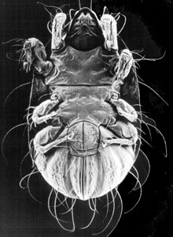

---
aliases:
  - Acariformes
title: Acariformes
---

# [[Acariformes]] 

The "mite-like" mites 

## #has_/text_of_/abstract 

> The **Acariformes**, also known as the Actinotrichida, 
> are the more diverse of the two superorders of mites. 
> 
> Over 32,000 described species are found in 351 families, 
> with an estimated total of 440,000 to 929,000 species, including undescribed species.
>
> [Wikipedia](https://en.wikipedia.org/wiki/Acariformes) 

## Phylogeny 

-   « Ancestral Groups  
    -   [Mite](../Mite.md)
    -  [Arachnida](../../Arachnida.md) 
    -  [Arthropoda](../../../../Arthropoda.md) 
    -  [Bilateria](../../../../../Bilateria.md) 
    -  [Animals](../../../../../../Animals.md) 
    -  [Eukarya](../../../../../../../Eukarya.md) 
    -   [Tree of Life](../../../../../../../Tree_of_Life.md)

-   ◊ Sibling Groups of  Acari
    -   Acariformes
    -   [Parasitiformes](Parasitiformes.md)

-   » Sub-Groups
    -   [Trombidiformes](Acariformes/Trombidiformes.md)

## Introduction

[Heather Proctor]() 

The Acariformes is one of the three major divisions of the Acari, the
other two being the Parasitiformes (including ticks) and the
Opilioacariformes. There are more than 30 000 described species of
acariform mites, and they inhabit all imaginable biotic and abiotic
habitats from hot springs to hydrothermal vents, from leaves to lizards,
and from the ears of your pet cat to the eyebrows of your grandfather.
They include such familiar scourges as dust mites, spider mites, scabies
and chiggers, as well as a huge range of lesser-known parasites,
predators, and fungivores. They are an ancient group of arachnids with
representatives among the earliest assemblages of terrestrial
invertebrates (Rhynie chert, Gilboa formation) (e.g. Kethley et al.
1979).

### Characteristics

A number of developmental characteristics unite the Acariformes.
Development is **anamorphic**, meaning that body segments are added
between moults. Also, prior to moulting, the legs of the subsequent
instar are formed **within the body** rather than within the hulls of
the previous instar\'s legs. There are also several characteristics of
acariform setae that differentiate them from other Acari. Another name
for the Acariformes is the \'Actinotrichida\', which refers to the fact
that their setae have a layer of optically active chitin,
**\'actinochitin\'**, that is birefringent under polarized light. Other
mites - the Parasitiformes and Opilioacariformes - lack actinochitin and
are sometimes grouped as the \'Anactinotrichida\'. **Trichobothria**,
specialized setae that are sensitive to vibrations and air currents, are
found in the Acariformes but not in other mites. Other modified sensory
setae unique to the Acariformes include **solenidia** and
**eupathidia**. Lindquist (1984) provides a list of the apomorphic
characters of this group.

### Discussion of Phylogenetic Relationships

As can be gathered from the illustrated tree, monophyly is not the rule
in the Acariformes. Acarologists have traditionally split this taxon
into three major groups, the Endeostigmata, Trombidiformes (also called
Prostigmata) and Sarcoptiformes (= Astigmata + Oribatida). However, the
Endeostigmata is likely to be an artifical group composed of primitive
members of both the trombidiform and sarcoptiform lineages. OConnor
(1984) performed a cladistic analysis that showed the Prostigmata to
share some derived setal and developmental characters with the
endeostigmatan taxa Sphaerolichidae and Lordalychidae. He therefore
suggested that the Prostigmata and Sphaerolichida (= Sphaerolichidae +
Lordalychidae) make up a monophyletic group, and gave this group the
name Trombidiformes. Within the Sarcoptiformes, the Astigmata and
Oribatida have traditionally been represented as taxa of equal rank;
however, it is quite apparent that the Astigmata are derived from within
the Oribatida, making the latter taxon paraphyletic (e.g. OConnor 1984,
Norton et al. 1993). Recent chemotaxonomic studies provide further
evidence of paraphyly. A novel defensive compound is known only from
Astigmata and middle-derivative Oribatida, but is absent in several
early derivative oribatid taxa (*Parhypochthonius*, *Gehypochthonius*
and *Nehypochthonius*) (Sakata & Norton 2001).

### References

Kethley, J.B., R.A. Norton, P.M. Bonamo and W.A. Shear. 1989. A
terrestrial alicorhagiid mite (Acari: Acariformes)from the Devonian of
New York. Micropaleontology 35:367-373.

Lindquist, E.E. 1984. Current theories on the evolution of major groups
of Acari and on their relationships with other groups of Arachnida, with
consequent implications for their classification. pp. 28-62 in D.A.
Griffiths and C.E. Bowman (eds.) Acarology VI, Vol. I. Ellis Horwood
Ltd., Chichester.

Norton, R.A., J.B. Kethley, D.E. Johnston, and B.M. OConnor.1993.
Phylogenetic perspectives on genetic systems and reproductive modes of
mites. pp. 8-99 in: D.L. Wrensch and M.A. Ebbert (eds.) Evolution and
diversity of sex ratio in insects and mites. Chapman & Hall, New York.

OConnor, B.M. 1984. Phylogenetic relationships among higher taxa in the
Acariformes, with particular reference to the Astigmata. pp. 19-27 in
D.A. Griffiths and C.E. Bowman. 1984. Acarology VI, Vol. I.
Ellis-Horwood Ltd., Chichester.

Sakata, T. and Norton, R. A. 2001. Opisthonotal gland chemistry of
early-derivative oribatid mites (Acari) and its relevance to systematic
relationships of Astigmata. International Journal of Acarology. in
press.

## Title Illustrations

Venter of acariform mite (Sarcoptiformes: Oribatida, Lohmanniidae:
*Meristolohmannia*). SEM copyright © 1998, D. Walter.
)

  --------
  Copyright ::   © 1998 D. Walter
  --------

## Confidential Links & Embeds: 

### #is_/same_as :: [[/_Standards/bio/bio~Domain/Eukarya/Animal/Bilateria/Arthropoda/Chelicerata/Arachnida/Mite/Acariformes|Acariformes]] 

### #is_/same_as :: [[/_public/bio/bio~Domain/Eukarya/Animal/Bilateria/Arthropoda/Chelicerata/Arachnida/Mite/Acariformes.public|Acariformes.public]] 

### #is_/same_as :: [[/_internal/bio/bio~Domain/Eukarya/Animal/Bilateria/Arthropoda/Chelicerata/Arachnida/Mite/Acariformes.internal|Acariformes.internal]] 

### #is_/same_as :: [[/_protect/bio/bio~Domain/Eukarya/Animal/Bilateria/Arthropoda/Chelicerata/Arachnida/Mite/Acariformes.protect|Acariformes.protect]] 

### #is_/same_as :: [[/_private/bio/bio~Domain/Eukarya/Animal/Bilateria/Arthropoda/Chelicerata/Arachnida/Mite/Acariformes.private|Acariformes.private]] 

### #is_/same_as :: [[/_personal/bio/bio~Domain/Eukarya/Animal/Bilateria/Arthropoda/Chelicerata/Arachnida/Mite/Acariformes.personal|Acariformes.personal]] 

### #is_/same_as :: [[/_secret/bio/bio~Domain/Eukarya/Animal/Bilateria/Arthropoda/Chelicerata/Arachnida/Mite/Acariformes.secret|Acariformes.secret]] 

