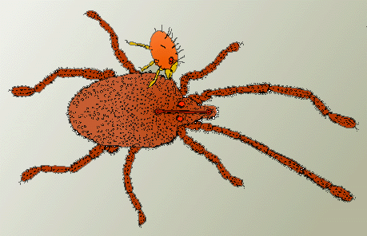

---
title: Parasitengona
---

# [[Parasitengona]]

Velvet mites, chiggers, water mites 

 

## #has_/text_of_/abstract 

> **Parasitengona** is a group of mites, variously ranked as a hyporder or a cohort, between the taxonomic ranks of order and family. 
>
> They are divided into the aquatic Hydrachnidia (water mites) and the terrestrial Trombidia. The latter includes velvet mites and chiggers.
>
> [Wikipedia](https://en.wikipedia.org/wiki/Parasitengona) 

## Introduction

[Heather Proctor]()

The Cohort Parasitengona comprises 6 superfamilies of terrestrial
prostigmatan mites and 9 superfamilies of aquatic mites (this group
being termed the Hydracarina or water mites) for a total of about 60
families. There are about 7000 named species, 5000 of which belong to
the Hydracarina (Welbourn 1991). Many of the named terrestrial species
belong to the medically important Trombiculoidea, a group that contains
the chiggers (also known as scrub itch mites).

### Characteristics

The major uniting characteristic of the Parasitengona is their **complex
life-cycle**, consisting of a parasitic larva, two inactive pupa-like
stages that represent the protonymph and tritonymph, and active
predatory deutonymphal and adult stages.

### Life Cycle and Ecology

Parasitengone mites share a common life cycle that is complex
ontogenetically and ecologically (Krantz 1978). They are termed
**protelean parasites** because larvae are parasitic while deutonymphs
and adults are predatory. Protonymphs and tritonymphs are inactive,
pupa-like stages called **calyptostases**. Most species of
parasitengones parasitize arthropods, but the Trombiculidae,
Leeuwenhoekiidae, and an aberrant genus of water mites (**Thermacarus**)
parasitize vertebrates. Amphibians, reptiles, birds and mammals are all
subject to attack from these larvae. Trombiculids and leeuwenhoekiids
are familiarly known as **chiggers** or scrub itch mites because of the
itchy welts they leave after feeding. They can also transmit parasitic
diseases (e.g. scrub typhus), and are thus considered medically
important arthropods. Adult parasitengones feed on insect eggs, larvae
and pupae as well as other small arthropods. Next to ticks, they are the
largest of all mites and can reach body lengths of more than 1 cm.
Adults are typically bright red and conspicuous, which together with
their often furry bodies has resulted in their common name \'velvet
mites\'.

### Discussion of Phylogenetic Relationships

Welbourn (1991) proposed the illustrated hypothesis of relationships
based on a cladistic analysis of 51 genera, using primarily
morphological characters of larvae. The relationship between the
Hydracarina and the other parasitengones isn\'t clear, and some
authorities consider the water mites (Hydracarina) to be the sister
group to the rest of the Parasitengona (Smith & Cook 1991). This
hypothesis implies that terrestrial parasitengones are derived from
aquatic ones.

## Phylogeny 

-   « Ancestral Groups  
    -   [Trombidiformes](../Trombidiformes.md)
    -   [Acariformes](../../Acariformes.md)
    -   [Mite](../../../Mite.md)
    -  [Arachnida](../../../../Arachnida.md))
    -  [Arthropoda](../../../../../../Arthropoda.md))
    -  [Bilateria](../../../../../../../Bilateria.md))
    -  [Animals](../../../../../../../../Animals.md))
    -  [Eukarya](../../../../../../../../../Eukarya.md))
    -   [Tree of Life](../../../../../../../../../Tree_of_Life.md)

-   ◊ Sibling Groups of  Trombidiformes
    -   Parasitengona

-   » Sub-Groups
    -   [Hydracarina](Parasitengona/Hydracarina.md)

## Title Illustrations

--------
Parasitengone larva parasitizing a parasitengone adult (Smarididae) from
Queensland, Australia. Drawing copyright © 1998, H. Proctor.

Copyright ::   © 1998 H. Proctor

## Confidential Links & Embeds: 

### #is_/same_as ::[Parasitengona](Parasitengona.md)) 

### #is_/same_as :: [Parasitengona.public](/_public/bio/bio~Domain/Eukarya/Animal/Bilateria/Arthropoda/Chelicerata/Arachnida/Mite/Acariformes/Trombidiformes/Parasitengona.public.md) 

### #is_/same_as :: [Parasitengona.internal](/_internal/bio/bio~Domain/Eukarya/Animal/Bilateria/Arthropoda/Chelicerata/Arachnida/Mite/Acariformes/Trombidiformes/Parasitengona.internal.md) 

### #is_/same_as :: [Parasitengona.protect](/_protect/bio/bio~Domain/Eukarya/Animal/Bilateria/Arthropoda/Chelicerata/Arachnida/Mite/Acariformes/Trombidiformes/Parasitengona.protect.md) 

### #is_/same_as :: [Parasitengona.private](/_private/bio/bio~Domain/Eukarya/Animal/Bilateria/Arthropoda/Chelicerata/Arachnida/Mite/Acariformes/Trombidiformes/Parasitengona.private.md) 

### #is_/same_as :: [Parasitengona.personal](/_personal/bio/bio~Domain/Eukarya/Animal/Bilateria/Arthropoda/Chelicerata/Arachnida/Mite/Acariformes/Trombidiformes/Parasitengona.personal.md) 

### #is_/same_as :: [Parasitengona.secret](/_secret/bio/bio~Domain/Eukarya/Animal/Bilateria/Arthropoda/Chelicerata/Arachnida/Mite/Acariformes/Trombidiformes/Parasitengona.secret.md)

