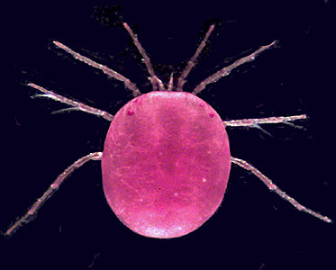

---
aliases:
  - Hydracarina
  - Hydrachnidiae
  - Hydrachnidia
  - Hydrachnellae
title: Hydracarina
---

# [[Hydracarina]]

 Water mites 

## #has_/text_of_/abstract 

> Hydrachnidia, also known as "water mites", Hydrachnidiae, **Hydracarina** or Hydrachnellae, 
> are among the most abundant and diverse groups of benthic arthropods, 
> composed of 6,000 described species from 57 families. A
> 
> s water mites of Africa, Asia, and South America have not been well-studied, the numbers are likely to be far greater. Other taxa of parasitengone mites include species with semi-aquatic habits, but only the Hydracarina are properly subaquatic. Water mites follow the general Parasitengona life cycle: active larva, inactive (calyptostasic) protonymph, active deutonymph, inactive tritonymph and active adult. Usually, larvae are parasites, while deutonymphs and adults are predators.
>
> [Wikipedia](https://en.wikipedia.org/wiki/Hydrachnidia) 

## Introduction

[Heather Proctor and Mark Harvey]()

Water mites, also known as the Hydracarina, Hydrachnidia or
Hydrachnellae, are a group of nine superfamilies and more than 40
families from the prostigmatan Cohort Parasitengona. Although other taxa
of parasitengone mites have species with semi-aquatic habits (e.g. the
Johnstonianidae), only the Hydracarina are truly subaquatic. There are
approximately 5000 named species of water mites (Smith & Cook 1991);
however, as water mites of Africa, Asia, and much of South America have
been poorly studied, this is likely a great underestimate of their true
number. They live in all types of freshwater bodies, from tree holes to
hot springs to deep lakes to torrential waterfalls, and some have also
invaded oceans (Cook 1974).

### Characteristics

Members of the Hydracarina are most obviously separated from other taxa
in the Cohort Parasitengona by having nymphal and adult stages that live
**beneath the surface of the water**. Morphological characteristics that
differentiate the group are less obvious. The combination of larval
characters unique to the Hydracarina is that larvae lack the supracoxal
seta \'e\', the companion seta associated with phi and omega on leg I,
and the companion seta associated with the dorsal eupathidium on tarsus
I. As well, the palpal genu has two setae compared to the one seta found
in larvae of other Parasitengona (Welbourn 1991). Witte (1991) lists a
number of unifying postlarval characters, including: presence of
glandularia (a combination of seta and gland), reduction of acrosomal
filament of the sperm cell, and modifications of the posterior arms of
the ejaculatory complex (the complex group of internal sclerites used by
the male to form the spermatophore). However, as Harvey (1998) points
out, it isn\'t clear whether Witte intended the Stygothrombidioidea to
be included in the Hydracarina.

### Life history and ecology

Water mites, like other parasitengones, have an extremely complex life
cycle (Smith & Cook 1991). Eggs are laid under water either on the
surface of substrates such as stones or vegetation, or inside living
plant tissue (Hydrachnidae: **Hydrachna**) or in the tissues of
freshwater sponges and mussels (Unionicolidae: **Unionicola**; Pionidae:
**Najadicola**). In the less derived groups, the larvae swim or crawl to
the water\'s surface after hatching, and break through the surface film.
They then run about on the upper surface of the water or on emergent
aquatic plants, seeking insect hosts to parasitize. In more derived
taxa, the larvae remain under water where they search for pre-imaginal
larvae (e.g. of odonates) or pupae (e.g. of dipterans). Larvae of the
\'aerial\' group typically begin to parasitize a host immediately upon
encounter; in contrast, \'aquatic\' larvae merely attend the pre-adult
host, and only begin parasitism after the adult has emerged from the
last larval or pupal skin.

Larvae engorge on host haemolymph and dissolved tissues for a period
lasting from a few days to several months, depending on the taxon.
Engorged larvae drop from the host back into the water. Because hosts of
water mite larvae are almost invariably winged adult insects (exceptions
are in the Hemiptera, where nymphal hosts may be parasitized), mites are
often carried far from their natal water bodies. Thus parasitism serves
not only a nutritional function for hydracarines, but it is the major
means of dispersal and colonization of new habitats. Although parasitism
is clearly a very important feature of water mite life cycles, the
parasitic phase has been lost repeatedly in different lineages of mites
(Smith 1998). Non-parasitic species appear to be evolutionary \'dead
ends\', as there are no clades of non-parasitic taxa, merely isolated
species in genera of otherwise parasitic species.

Once back in the water, the engorged larva transforms into a
calyptostatic protonymph (also called a nymphochrysalis) that is a
pupa-like stage inside the integument of the larva. Within the
protonymphal cuticle, the next stage - the deutonymph - develops. The
deutonymph ecloses as an active swimming or crawling predator of all
stages of aquatic insects, crustaceans, and other mites (Proctor &
Pritchard 1989). Deutonymphs are usually less highly sclerotized than
adults, which allows their integument to expand as they feed. A
well-fattened deutonymph transforms into a calpytostatic tritonymph
(also called a teleiochrysalis). The adult that emerges is also
predatory and typically feeds on prey similar to that chosen by the
deutonymph. Adults are more highly sclerotized than deutonymphs, and
have functional genital openings. They are also often extremely sexually
dimorphic, particularly those taxa in which the males transfer sperm
directly to the female. Copulation has apparently evolved repeatedly
within the water mites from an ancestral state in which sperm was
transferred via spermatophores deposited on a substrate (Proctor 1991).
The full range of sperm-transfer modes (copulation, paired but indirect,
completely dissociated) occurs within the water mites, making their
mating behaviour among the most diverse of any group of arthropods
(Proctor 1992).

One of the most striking things about water mites is their often
brilliant colouration. Scarlet, orange, red and yellow mites are common,
and are extremely visible against a background of green water plants.
These bright mites are often very unpalatable to fish (Kerfoot 1982),
presumably due to noxious secretions from their skin glands. Although
one might expect this aposematic connection between redness and
distastefulness to have evolved as an anti-fish-predation mechanism,
both the bright colour and foul taste are also present in terrestrial
parasitengones (Garga 1996).

### Discussion of Phylogenetic Relationships

Based on current distributions of major taxa, water mites appear to have
had a Pangaean origin, or to have evolved prior to the continental
consolidation that resulted in Pangaea. The group was originally
considered to be a polyphyletic assemblage of taxa that had
independently invaded water (discussed in Cook 1974). However, a number
of setal characters of the larvae and genital/spermatozoal characters of
the adults appear to unite these superfamilies as a monophyletic group
(Welbourn 1991, Witte 1991, Harvey 1998).

There is general agreement that the Stygothrombioidea, Hydrovolzioidea,
and families in the Hydryphantoidea are at the primitive end of the
cladogram; however, the hydryphantoid families have no clear
synapophorphies and the superfamily may be paraphyletic (Smith & Cook
1991). There is also general acceptance of the Hygrobatoidea as being
among the most derived of the superfamilies. Relative positions of the
other groups are not so clear. Phylogenetic studies of the water mites
are hindered by the ancient origin of the group (thus removing
biogeography as a tool at the superfamilial level), rarity of fossils,
and the apparent high degree of convergence in adult morphology. Larval
morphology appears to be more conservative, and has been extremely
valuable in understanding relationships among other members of the
Parasitengona (e.g. Welbourn 1991). To date, no DNA-based phylogeny has
been published, although several are in progress.

## Phylogeny 

-   « Ancestral Groups  
    -   [Parasitengona](../Parasitengona.md)
    -   [Trombidiformes](../../Trombidiformes.md)
    -   [Acariformes](../../../Acariformes.md)
    -   [Mite](../../../../Mite.md)
    -  [Arachnida](../../../../../Arachnida.md) 
    -  [Arthropoda](../../../../../../../Arthropoda.md) 
    -  [Bilateria](../../../../../../../../Bilateria.md) 
    -  [Animals](../../../../../../../../../Animals.md) 
    -  [Eukarya](../../../../../../../../../../Eukarya.md) 
    -   [Tree of Life](../../../../../../../../../../Tree_of_Life.md)

-   ◊ Sibling Groups of  Parasitengona
    -   Hydracarina

-   » Sub-Groups 

## Title Illustrations

--------
**Hydrodroma** (Hydrodromidae, Hydryphantoidea) from Queensland,
Australia. Photograph copyright © H. Proctor, 1998

Copyright ::   © 1998 H. Proctor

## Confidential Links & Embeds: 

### #is_/same_as :: [[/_Standards/bio/bio~Domain/Eukarya/Animal/Bilateria/Arthropoda/Chelicerata/Arachnida/Mite/Acariformes/Trombidiformes/Parasitengona/Hydracarina|Hydracarina]] 

### #is_/same_as :: [[/_public/bio/bio~Domain/Eukarya/Animal/Bilateria/Arthropoda/Chelicerata/Arachnida/Mite/Acariformes/Trombidiformes/Parasitengona/Hydracarina.public|Hydracarina.public]] 

### #is_/same_as :: [[/_internal/bio/bio~Domain/Eukarya/Animal/Bilateria/Arthropoda/Chelicerata/Arachnida/Mite/Acariformes/Trombidiformes/Parasitengona/Hydracarina.internal|Hydracarina.internal]] 

### #is_/same_as :: [[/_protect/bio/bio~Domain/Eukarya/Animal/Bilateria/Arthropoda/Chelicerata/Arachnida/Mite/Acariformes/Trombidiformes/Parasitengona/Hydracarina.protect|Hydracarina.protect]] 

### #is_/same_as :: [[/_private/bio/bio~Domain/Eukarya/Animal/Bilateria/Arthropoda/Chelicerata/Arachnida/Mite/Acariformes/Trombidiformes/Parasitengona/Hydracarina.private|Hydracarina.private]] 

### #is_/same_as :: [[/_personal/bio/bio~Domain/Eukarya/Animal/Bilateria/Arthropoda/Chelicerata/Arachnida/Mite/Acariformes/Trombidiformes/Parasitengona/Hydracarina.personal|Hydracarina.personal]] 

### #is_/same_as :: [[/_secret/bio/bio~Domain/Eukarya/Animal/Bilateria/Arthropoda/Chelicerata/Arachnida/Mite/Acariformes/Trombidiformes/Parasitengona/Hydracarina.secret|Hydracarina.secret]] 

