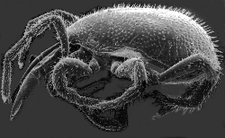

---
aliases:
  - Parasitiformes
title: Parasitiformes
has_id_wikidata: Q132756
---
## Phylogeny 

-   « Ancestral Groups  
    -   [Mite](../Mite.md)
    -  [Arachnida](../../Arachnida.md) 
    -  [Arthropoda](../../../../Arthropoda.md) 
    -  [Bilateria](../../../../../Bilateria.md) 
    -  [Animals](../../../../../../Animals.md) 
    -  [Eukarya](../../../../../../../Eukarya.md) 
    -   [Tree of Life](../../../../../../../Tree_of_Life.md)

-   ◊ Sibling Groups of  Acari
    -   [Acariformes](Acariformes.md)
    -   Parasitiformes

-   » Sub-Groups
    -   [Tick](Parasitiformes/Tick.md)

# [[Parasitiformes]]

Holothyrans, ticks and mesostigmatic mites 

 

## #has_/text_of_/abstract 

> **Parasitiformes** are a superorder of Arachnids, 
> constituting one of the two major groups of mites, alongside Acariformes. 
> Parasitiformes has, at times, been classified at the rank of order or suborder.
>
> It is uncertain whether Parasitiformes and Acariformes are closely related, 
> and in many analyses they are recovered more closely related to other arachnids. 
> 
> Amongst the best known members of the group are the ticks, 
> though the Mesostigmata is by far the most diverse group with over 8,000 described species, 
> including economically important species such as the varroa mite.
>
> [Wikipedia](https://en.wikipedia.org/wiki/Parasitiformes) 

## Introduction

[David Evans Walter]()

The Parasitiformes is one of the three major lineages of chelicerate
arthropods that are called mites. Ticks are among the most economically
important parasitiform mites, but numerous Mesostigmata, especially in
the Dermanyssoidea are also debilitating parasites of mammals, birds,
and reptiles. The phytoseiid mites used in biological control belong to
the Mesostigmata, as do numerous species of predators that inhabit
soil-litter systems. Currently, both the Ixodida (ticks) and Holothyrida
consist of three families; the Mesostigmata contains approximately 70
family-level taxa.

### Characteristics

Parasitiform mites have free coxae, a ventral anal opening covered by a
pair of plates, corniculli on the hypostome (lost in ticks), a
sclerotised ring surrounding the gnathosoma (capitulum), and usually a
biflagellate tritosternum (lost in ticks, many holothyrids, and some
parasitic Mesostigmata).

### Discussion of Phylogenetic Relationships

The hypothesis by Lehtinen (1991) supports a sistergroup relationship
between Holothyrida and Ixodida; however, other acarologists have
suggested that ticks and Mesostigmata are sistergroups. Phylogenetic
analyses addressing the proper placement of ticks are underway in
Queensland and Ohio.

### References

Lehtinen, P.T. 1991. Phylogeny and zoogeography of the Holothyrida. In:
Dusabek, F. and Bukva, V. (eds.) Modern Acarology, Volume 2. SPB
Academic Publishers, The Hague, pp. 101-113.

## Title Illustrations

SEM of Allothyrus sp. from Queensland (D.E. Walter)

 

--------
copyright ::   © 1996 D. E. Walter
--------

## Confidential Links & Embeds: 

### #is_/same_as :: [[/_Standards/bio/bio~Domain/Eukarya/Animal/Bilateria/Arthropoda/Chelicerata/Arachnida/Mite/Parasitiformes|Parasitiformes]] 

### #is_/same_as :: [[/_public/bio/bio~Domain/Eukarya/Animal/Bilateria/Arthropoda/Chelicerata/Arachnida/Mite/Parasitiformes.public|Parasitiformes.public]] 

### #is_/same_as :: [[/_internal/bio/bio~Domain/Eukarya/Animal/Bilateria/Arthropoda/Chelicerata/Arachnida/Mite/Parasitiformes.internal|Parasitiformes.internal]] 

### #is_/same_as :: [[/_protect/bio/bio~Domain/Eukarya/Animal/Bilateria/Arthropoda/Chelicerata/Arachnida/Mite/Parasitiformes.protect|Parasitiformes.protect]] 

### #is_/same_as :: [[/_private/bio/bio~Domain/Eukarya/Animal/Bilateria/Arthropoda/Chelicerata/Arachnida/Mite/Parasitiformes.private|Parasitiformes.private]] 

### #is_/same_as :: [[/_personal/bio/bio~Domain/Eukarya/Animal/Bilateria/Arthropoda/Chelicerata/Arachnida/Mite/Parasitiformes.personal|Parasitiformes.personal]] 

### #is_/same_as :: [[/_secret/bio/bio~Domain/Eukarya/Animal/Bilateria/Arthropoda/Chelicerata/Arachnida/Mite/Parasitiformes.secret|Parasitiformes.secret]] 

