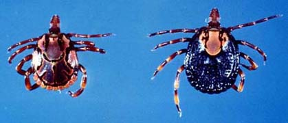
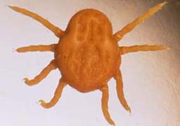
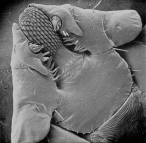

---
aliases:
  - Ixodida
  - Tick
  - Zecke
  - Ticks
title: Ixodida
---

# [[Tick]] 

Ticks probably exist unchanged since 350e6y. 
They survived 2 big Extinctions. 

Transfers: 
[[Borelliose]]  
[[FSME]] 
[[Lyme-Encephalitis]]  

   

## #has_/text_of_/abstract 

> Ticks are parasitic arachnids of the order **Ixodida**. 
> They are part of the mite superorder [[../Parasitiformes|Parasitiformes]]. 
> 
> Adult ticks are approximately 3 to 5 mm in length depending on age, sex, and species, 
> but can become larger when engorged. 
> 
> Ticks are external parasites, living by feeding on the blood of mammals, birds, 
> and sometimes reptiles and amphibians. 
> 
> The timing of the origin of ticks is uncertain, 
> though the oldest known tick fossils are around 100 million years old, 
> and come from the Cretaceous period. 
> Ticks are widely distributed around the world, especially in warm, humid climates.
>
> Ticks belong to two major families: the Ixodidae, or hard ticks, and the Argasidae, or soft ticks. 
> 
> Nuttalliella, a genus of tick from southern Africa, is the only member of the family Nuttalliellidae, 
> and represents the most primitive living lineage of ticks. 
> Adults have ovoid/pear-shaped bodies (idiosomas) 
> which become engorged with blood when they feed, and eight legs. 
> Their cephalothorax and abdomen are completely fused. 
> 
> In addition to having a hard shield on their dorsal surfaces, known as the scutum, 
> hard ticks have a beak-like structure at the front containing the mouthparts, 
> whereas soft ticks have their mouthparts on the underside of their bodies. 
> 
> Ticks locate potential hosts by sensing odor, body heat, moisture, 
> and/or vibrations in the environment.
>
> Ticks have four stages to their life cycle, namely egg, larva, nymph, and adult. 
> 
> Ticks belonging to the Ixodidae family undergo either a one-host, two-host, or three-host life cycle. 
> Argasid ticks have up to seven nymphal stages (instars), each one requiring blood ingestion, 
> and as such, Argasid ticks undergo a multihost life cycle. 
> 
> Because of their hematophagous (blood-ingesting) diets, 
> ticks act as vectors of many serious diseases that affect humans and other animals.
>
> [Wikipedia](https://en.wikipedia.org/wiki/Tick) 

## Phylogeny 

-   « Ancestral Groups  
    -   [Parasitiformes](../Parasitiformes.md)
    -   [Mite](../../Mite.md)
    -  [Arachnida](../../../Arachnida.md) 
    -  [Arthropoda](../../../../../Arthropoda.md) 
    -  [Bilateria](../../../../../../Bilateria.md) 
    -  [Animals](../../../../../../../Animals.md) 
    -  [Eukarya](../../../../../../../../Eukarya.md) 
    -   [Tree of Life](../../../../../../../../Tree_of_Life.md)

-   ◊ Sibling Groups of  Parasitiformes
    -   Ixodida

-   » Sub-Groups 
	-   *Ixodidae* [(Hard ticks)]
	-   *Argasidae* [(Soft ticks)]
	-   *Nuttalliellidae*

## Introduction

[Anna Murrell and Steve Barker](http://www.tolweb.org/)

Ticks are blood-feeding parasites of 
[- reptiles](tree?group=Amniota&contgroup=Terrestrial_Vertebrates),
- [birds](tree?group=Aves&contgroup=Coelurosauria),
- [mammals](tree?group=Mammalia&contgroup=Therapsida) and even
- [amphibians](tree?group=Living_Amphibians&contgroup=Terrestrial_Vertebrates)
(one tick species only). 

Ticks are generally much larger than other mites; 
engorged female ticks of some species reach 30 mm in size (Evans, 1992). 

Ticks transmit more infectious agents than any other blood-feeding arthropods (Hoogstraal, 1985), 
including *Borrelia burgdorgeri* (Lyme disease), *B. recurrentis* (relapsing fever),
*Babesia* spp. (tick fever), and *Rickettsia connorii* (boutenneuse fever). 

Other forms of pathogenesis attributed to ticks are anaemia
(e.g. *Hyalomma asiaticum* females consume more than 8 ml of blood per tick; Sonenshine, 1991) 
as well as dermatosis and paralysis (Roberts and Janovy, 1996).

There are approximately 860 spp. in 22 genera and three families
(Keirans, 1992; Keirans and Robbins, 1999). The Ixodidae and Argasidae
are large and cosmopolitan families, whereas the Nuttalliellidae has one
species which has only been found in South Africa and Tanzania (Evans,
1992). The main host of *Nuttalliella namaqua* is uncertain, as is the
life cycle (Oliver, 1989). Most ixodid ticks have three hosts, one for
each stage of the life cycle (larvae, nymph and adult), but in some
species this has been reduced (one- or two-host ticks spend two or more
life cycle stages on the same host individual) (Oliver, 1989). Ixodid
ticks need several days to feed, and once the female is engorged she
drops from the host to lay eggs (up to many thousand). Argasid ticks
only feed intermittently and do not remain attached to their hosts. They
may feed many times over their lifetime on a number of different hosts
and will often lay only a few hundred eggs. Argasid ticks also have
remarkable longevity and have been observed to live for many years and
long periods of starvation (Sonenshine, 1991).

### Characteristics

According to Lehtinen (1991) the following characters are synapomorphic
for the Ixodida:

i.  latigynial plates reduced;
ii. palpal tarsus reduced;
iii. hypostome projecting and sawlike.

*Haemaphysalis bremneri* mouthparts, showing toothed, sawlike
hypostome.\
Photograph copyright 2001 Steve Barker

Other prominent features of ticks are their large size, when compared to
other mites, and Haller\'s organ, a complex sensory apparatus on tarsus
1 (the holothyridan mites have a homologous organ).

### Discussion of Phylogenetic Relationships

The phylogenetic relationships of the three families of ticks, the
Argasidae, Ixodidae and Nuttalliellidae, are unresolved. The
monospecific Nuttalliellidae (*Nuttalliella namaqua*) has morphological
features of both the Argasidae and Ixodidae (Keirans et al., 1976), so
its relationship to them phylogenetically is unclear. Although molecular
analyses of the phylogenetic relationships of the Argasidae and Ixodidae
have been done (e.g. Black and Piesman, 1994; Black et al., 1997; Dobson
and Barker, 1999), these studies did not include the Nuttalliellidae
because few individuals of *N. namaqua* have ever been found (Roshdy et
al., 1983), and they have not been available for molecular applications.

## Title Illustrations

------------------------------------------------------------------------
 
Scientific Name ::  Amblyomma hebraeum
Comments          Ixodidae
Sex ::             male and female
Copyright ::         © 2001 [Steve Barker](mailto:S.Barker@imb.uq.edu.au) 

------------------------------------------------------------------------
 
Scientific Name ::  Otobius megnini
Comments          Argasidae
Copyright ::         © 2001 [Steve Barker](mailto:S.Barker@imb.uq.edu.au) 

## Confidential Links & Embeds: 

### #is_/same_as :: [[/_Standards/bio/bio~Domain/Eukarya/Animal/Bilateria/Arthropoda/Chelicerata/Arachnida/Mite/Parasitiformes/Tick|Tick]] 

### #is_/same_as :: [[/_public/bio/bio~Domain/Eukarya/Animal/Bilateria/Arthropoda/Chelicerata/Arachnida/Mite/Parasitiformes/Tick.public|Tick.public]] 

### #is_/same_as :: [[/_internal/bio/bio~Domain/Eukarya/Animal/Bilateria/Arthropoda/Chelicerata/Arachnida/Mite/Parasitiformes/Tick.internal|Tick.internal]] 

### #is_/same_as :: [[/_protect/bio/bio~Domain/Eukarya/Animal/Bilateria/Arthropoda/Chelicerata/Arachnida/Mite/Parasitiformes/Tick.protect|Tick.protect]] 

### #is_/same_as :: [[/_private/bio/bio~Domain/Eukarya/Animal/Bilateria/Arthropoda/Chelicerata/Arachnida/Mite/Parasitiformes/Tick.private|Tick.private]] 

### #is_/same_as :: [[/_personal/bio/bio~Domain/Eukarya/Animal/Bilateria/Arthropoda/Chelicerata/Arachnida/Mite/Parasitiformes/Tick.personal|Tick.personal]] 

### #is_/same_as :: [[/_secret/bio/bio~Domain/Eukarya/Animal/Bilateria/Arthropoda/Chelicerata/Arachnida/Mite/Parasitiformes/Tick.secret|Tick.secret]] 

